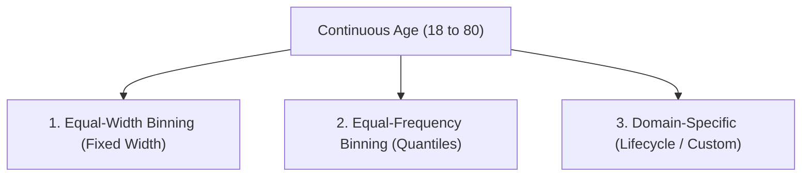
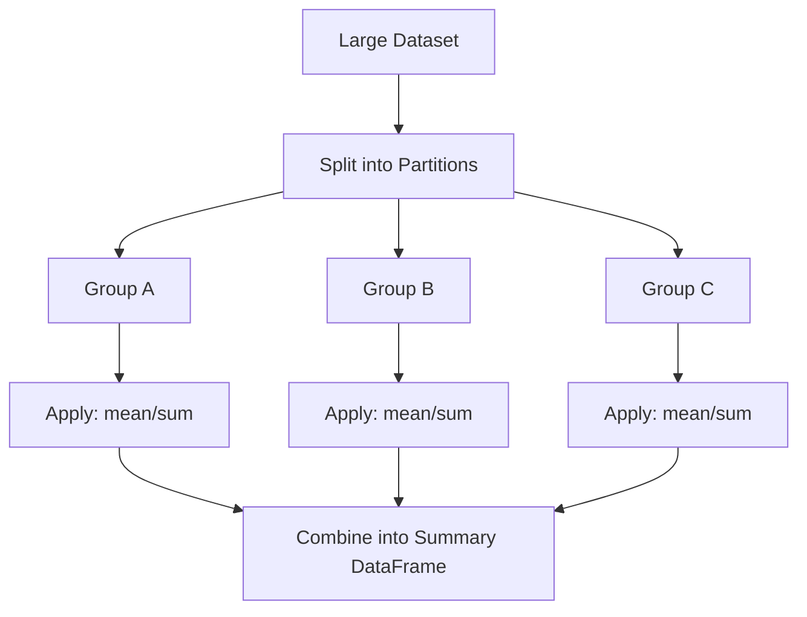
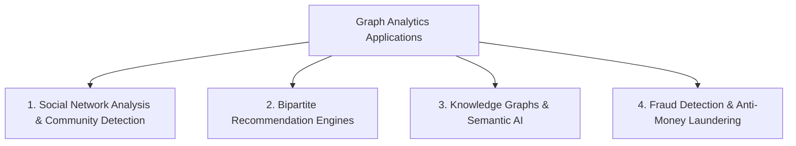
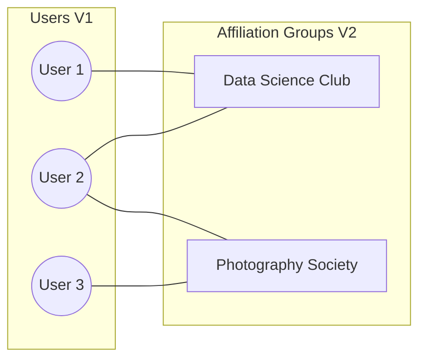
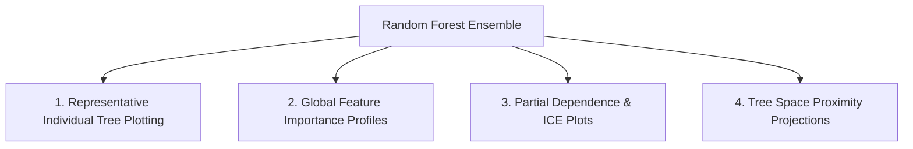
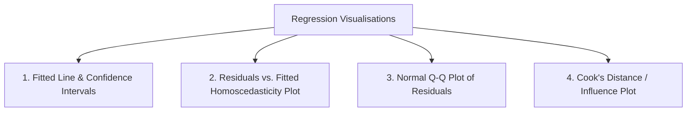

# MCS-067: Data Wrangling and Visualization
## Assignment Solutions (Academic Session 2026–2027)

**Programme:** Master of Science (Data Science and Analytics) (MSCDSA)  
**Course Code:** MCS-067  
**Course Title:** Data Wrangling and Visualization  
**Assignment Number:** MSCDSA(II)/067/Assign/2026-27  
**Maximum Marks:** 100 (4 Questions $\times$ 20 Marks = 80 Marks; Viva-Voce: 20 Marks)  

---

## Question 1 (20 Marks)

### (a) Data Wrangling Foundations, Data Semantics, and Profiling (3 Marks)

#### 1. What is Data Wrangling?
Data Wrangling (also termed data munging) is the iterative, multi-step process of discovering, cleaning, restructuring, transforming, enriching, and validating messy, raw, heterogeneous data into a reliable, coherent, and standardized format suitable for downstream analytical exploration, statistical modeling, and machine learning pipelines. Typically, 70% to 80% of an analyst's effort is dedicated to data wrangling.


#### 2. Key Pillars of Data Preparation:
* **Data Semantics:** A dataset is a collection of *values* organized into *variables* and *observations*. According to Hadley Wickham’s Tidy Data principles:
  1. Each variable forms a column.
  2. Each observation forms a row.
  3. Each type of observational unit forms a table.  
  Understanding semantics ensures that column headers represent measurement variables rather than values (e.g., separating "Month" from "Sales").
* **Data Profiling:** The automated or systematic examination of data dictionaries, row counts, data types, distinct value cardinalities, and frequency distributions to assess the structural integrity, quality, and completeness of the dataset before applying transformations.
* **Set-Based Profiling:** Treating column values as mathematical sets to evaluate domain constraints, identify unexpected cross-table intersections, compute set differences (e.g., verifying whether all foreign keys in an `Orders` table exist in the `Customers` master set), and detect orphaned records.
* **Summary Statistics:** Univariate and bivariate mathematical metrics (mean, median, interquartile range, standard deviation, skewness, min/max) that quantitatively describe central tendency, spread, and anomalies without plotting the entire raw distribution.

#### Illustrative Example:
Suppose raw retail logs record: `[TransID: T1, Date: 2026-04-12, Amount: "-500", City: "delhi", CustID: "C999"]`.
1. *Semantics Check:* Amount cannot be negative for a standard sale.
2. *Set-Based Profiling:* Checking if `CustID: C999` belongs to the set of registered customer IDs $\{C101, C102, C103\}$. It does not, revealing an orphaned foreign key.
3. *Data Profiling & Summary Stats:* Capitalization check reveals `"delhi"` vs `"Delhi"` (cardinality inflated), and min value of amount is $-\$500$, shifting the sample mean downward.

---

### (b) Data Profiling & Summary Statistics for Retail Transaction Data (3 Marks)

Given attributes: `Customer ID`, `Age`, `Gender`, `City`, `Purchase Amount`, `Payment Mode`.

#### 1. Data Profiling Procedure:
* **Structural Profiling:**
  * Check dataset schema: verify row count, memory footprint, and column data types (`Customer ID`: string/categorical, `Age`: integer, `Gender`: categorical/factor, `City`: string/nominal, `Purchase Amount`: float, `Payment Mode`: categorical/nominal).
  * Missing value scan: tally null count and null percentage per column.
  * Uniqueness & Cardinality: verify whether `Customer ID` has repeats (one customer, multiple purchases) and check distinct count for `City` (identifying typos) and `Payment Mode`.
* **Value Consistency Profiling:**
  * Identify case discrepancies (e.g., `'upi'`, `'UPI'`, `'Upi'`).
  * Check domain validity: $Age \in [10, 100]$, $Purchase\ Amount > 0$.
  * Verify regex conformity of identifiers (e.g., `^C\d{4}$`).

#### 2. Summary Statistics to Compute:

| Attribute | Variable Type | Appropriate Summary Statistics | Analytical Objective |
|:---|:---|:---|:---|
| **Customer ID** | Nominal Identifier | Total count, distinct count, top frequent IDs. | Detect power shoppers and repeat customer frequency. |
| **Age** | Ratio (Discrete) | Mean, Median, Mode, Standard Deviation, Min, Max, $Q_1$, $Q_3$, IQR, Skewness. | Understand demographic distribution and identify age anomalies (<18 or >90). |
| **Gender** | Nominal Categorical | Frequency count, relative percentage (proportions), Mode. | Examine customer gender distribution. |
| **City** | Nominal Categorical | Mode, distinct cardinality count, Pareto frequency distribution. | Identify top geographic revenue drivers. |
| **Purchase Amount**| Ratio (Continuous) | Mean, Median, Trimmed Mean, Variance, Std Dev, Min, Max, Range, IQR, Skewness, Kurtosis. | Measure transaction size, spending variance, and presence of high-value outliers. |
| **Payment Mode** | Nominal Categorical | Frequency table, percentage breakdown, Mode. | Assess adoption of UPI, credit card, net banking, or cash. |

---

### (c) Python Program for Data Cleaning and Transformation (3 Marks)

#### Synthetic CSV Generation & Pandas Wrangling Script:
```python
import io
import pandas as pd
import numpy as np

# 1. Create Synthetic Raw CSV Content with intentional anomalies
raw_csv_data = """EmpID,EmpName,Dept_Name,Salary,City
E101,John Doe,Information Tech,75000,New Delhi
E102,Jane Smith,IT,,delhi
E103,Rajesh Kumar,Finance,62000,Mumbai
E104,Anita Roy,Human Resources,58000,Bangalore
E105,Jane Smith,IT,,delhi
E106,Vikram Singh,fin,68000,MUMBAI
E107,Sunita Verma,HR,,Bengaluru
E108,Rohan Sen,Info Tech,71000,New Delhi
E109,Kavita Nair,Finance,64000,mumbai
"""

# Read into DataFrame
df = pd.read_csv(io.StringIO(raw_csv_data))
print("--- Initial Dirty DataFrame ---")
print(df)

# Task 1: Identify Missing Values
print("\n--- Missing Value Count per Column ---")
print(df.isnull().sum())
print("Records with Missing Values:")
print(df[df.isnull().any(axis=1)])

# Task 2: Remove Duplicate Records
initial_rows = len(df)
df = df.drop_duplicates(subset=['EmpName', 'Dept_Name', 'City'], keep='first')
print(f"\nDuplicates removed: {initial_rows - len(df)} duplicate row(s) dropped.")

# Task 3: Replace Inconsistent Department Names and City Names
# Standardize strings (strip whitespace and lower case mapping)
dept_mapping = {
    'Information Tech': 'IT',
    'Info Tech': 'IT',
    'IT': 'IT',
    'fin': 'Finance',
    'Finance': 'Finance',
    'Human Resources': 'HR',
    'HR': 'HR'
}
city_mapping = {
    'delhi': 'Delhi',
    'New Delhi': 'Delhi',
    'Mumbai': 'Mumbai',
    'MUMBAI': 'Mumbai',
    'mumbai': 'Mumbai',
    'Bangalore': 'Bengaluru',
    'Bengaluru': 'Bengaluru'
}

df['Dept_Name'] = df['Dept_Name'].map(dept_mapping)
df['City'] = df['City'].map(city_mapping)

# Task 4: Fill Missing Salary Values using Department-Wise Median
# Department-wise imputation prevents distortion caused by inter-departmental pay scales
df['Salary'] = df.groupby('Dept_Name')['Salary'].transform(lambda x: x.fillna(x.median()))

# Task 5: Rename Column Headings to Standard Snake_Case
df = df.rename(columns={
    'EmpID': 'employee_id',
    'EmpName': 'employee_name',
    'Dept_Name': 'department',
    'Salary': 'salary_inr',
    'City': 'location'
})

print("\n--- Final Cleaned and Standardized DataFrame ---")
print(df)
```

---

### (d) Missing Data Handling Techniques & Appropriateness (3 Marks)

#### Theoretical Framework of Missing Data Mechanisms (Rubin's Classification):
1. **MCAR (Missing Completely at Random):** Probability of missingness is entirely independent of observed and unobserved data (e.g., a lab tube dropped accidentally).
2. **MAR (Missing at Random):** Missingness depends systematically on observed covariates but not on the missing value itself (e.g., men are less likely to report depression score, but within gender it is random).
3. **MNAR (Missing Not at Random):** Missingness is directly related to the unobserved value itself (e.g., high earners refusing to disclose income).

#### Common Techniques and Situational Appropriateness:

| Technique | Description | Mathematical / Algorithmic Form | Appropriate Situations | Limitations / Inappropriate Situations |
|:---|:---|:---|:---|:---|
| **Listwise Deletion (Complete Case)** | Drops any row with at least one missing value. | Keep subset where $\prod \mathbb{I}(X_j \neq \text{NaN}) = 1$ | When missingness is MCAR and affects $< 3-5\%$ of a large sample. | Disastrous sample size loss; severely biased under MAR/MNAR. |
| **Mean / Median Imputation** | Replaces missing continuous values with univariate mean or median. | $x_i^* = \text{median}(X)$ | Simple baseline exploratory analysis; quick prototyping under MCAR. | Artificially deflates sample variance and shrinks standard error; alters covariance. |
| **Mode Imputation** | Replaces missing values with the most frequent category. | $x_i^* = \arg\max_k f(k)$ | Categorical variables with low missing rate and a single dominant class. | Distorts multinomial proportions; increases overconfidence in majority class. |
| **Forward Fill / Backward Fill (LOCF / NOCB)** | Propagates the last observed valid value forward or backward. | $x_t^* = x_{t-1}$ | Time-series data, streaming stock prices, sensor readings with high temporal sampling. | Invalid for cross-sectional independent records; introduces artificial plateaus. |
| **K-Nearest Neighbors (KNN) Imputation** | Replaces null using weighted average of $k$ most similar complete records. | $x_{i}^* = \frac{\sum w_j x_j}{\sum w_j}$ | Multivariate datasets where feature inter-correlations are moderate to strong (MAR). | Computationally expensive on large datasets ($O(N^2)$); sensitive to outliers. |
| **Multiple Imputation by Chained Equations (MICE)** | Iteratively specifies parametric regression models per missing feature. | Monte Carlo simulation over $M$ datasets | Rigorous epidemiological, biomedical, and inferential social science research (MAR). | Complex to implement and interpret; high computational overhead. |

---

### (e) Customer Age Discretisation (Binning) Methods (4 Marks)

Customer Age range: $18$ to $80$ years ($n=500$).



#### 1. Equal-Width (Equal-Interval) Discretisation:
Divides the total range $[X_{\min}, X_{\max}]$ into $k$ bins of identical width $W$:
$$W = \frac{X_{\max} - X_{\min}}{k} = \frac{80 - 18}{4} = \frac{62}{4} = 15.5 \text{ years}$$
* Bins: $[18, 33.5)$, $[33.5, 49)$, $[49, 64.5)$, $[64.5, 80]$.
* *Python Implementation:* `pd.cut(df['age'], bins=4)`
* *Pros & Cons:* Simple to interpret; highly sensitive to skewed distributions (bins in sparse tails will be empty or underpopulated).

#### 2. Equal-Frequency (Quantile-Based) Discretisation:
Divides data such that an approximately equal number of observations ($n/k = 500/4 = 125$) falls into each of the $k$ bins.
* Bins correspond to percentiles: Quartiles $Q_1 (25\%)$, $Q_2 (50\%)$, $Q_3 (75\%)$.
* *Python Implementation:* `pd.qcut(df['age'], q=4, labels=['Q1', 'Q2', 'Q3', 'Q4'])`
* *Pros & Cons:* Balances sample size across bins; handles skewed distributions well; however, interval widths become irregular and non-intuitive.

#### 3. Domain-Specific (Demographic Lifecycle) Binning:
Constructs bins based on established retail consumer behavior and demographic life stages:
* **Young Adults (Gen Z / College):** $18 - 25$
* **Early Career Professionals (Millennials):** $26 - 35$
* **Mid-Career / Family Stage:** $36 - 50$
* **Pre-Retirement:** $51 - 65$
* **Senior Citizens:** $> 65$
* *Python Implementation:*
```python
bins = [18, 25, 35, 50, 65, 80]
labels = ['Young Adult', 'Early Career', 'Mid Career', 'Pre-Retirement', 'Senior']
df['age_group'] = pd.cut(df['age'], bins=bins, labels=labels, include_lowest=True)
```
* *Pros & Cons:* Highly actionable for retail marketing segmentation; intervals reflect business reality rather than arbitrary math.

---

### (f) Outlier Detection via Interquartile Range (IQR) and Handling Strategies (4 Marks)

#### 1. Mathematical IQR Principle (Tukey's Fences):
* Let $Q_1$ be the 25th percentile and $Q_3$ be the 75th percentile.
* Interquartile Range: $\text{IQR} = Q_3 - Q_1$
* **Lower Bound:** $\text{LB} = Q_1 - 1.5 \times \text{IQR}$
* **Upper Bound:** $\text{UB} = Q_3 + 1.5 \times \text{IQR}$
* Any data point $x < \text{LB}$ or $x > \text{UB}$ is flagged as an outlier. Extreme outliers use $3.0 \times \text{IQR}$.

#### 2. Python Program for IQR Outlier Detection:
```python
import numpy as np
import pandas as pd

# Sample purchase transactions with synthetic outliers
data = {'transaction_amount': [120, 135, 140, 150, 155, 160, 165, 170, 180, 190, 200, 210, 850, 920, 15]}
df = pd.DataFrame(data)

# Compute Quartiles and IQR
Q1 = df['transaction_amount'].quantile(0.25)
Q3 = df['transaction_amount'].quantile(0.75)
IQR = Q3 - Q1

lower_bound = Q1 - 1.5 * IQR
upper_bound = Q3 + 1.5 * IQR

outliers = df[(df['transaction_amount'] < lower_bound) | (df['transaction_amount'] > upper_bound)]

print(f"Q1: {Q1:.2f}, Q3: {Q3:.2f}, IQR: {IQR:.2f}")
print(f"Lower Threshold: {lower_bound:.2f}, Upper Threshold: {upper_bound:.2f}")
print("Detected Outliers:\n", outliers)
```

#### 3. Outlier Handling Strategies:
1. **Trimming / Deletion:**
   * Drop rows outside boundaries. Appropriate when outliers result from data entry errors, faulty equipment, or corrupted network transmissions.
2. **Winsorization / Capping:**
   * Values exceeding the upper threshold are capped at $\text{UB}$; values below lower threshold are floored at $\text{LB}$. Preserves sample size while restraining leverage.
3. **Logarithmic / Box-Cox Transformation:**
   * Applying $y = \log(x + 1)$ compresses long right tails into approximately normal shapes, mitigating the disproportionate influence of high spenders.
4. **Separate Sub-population Modeling:**
   * When outliers represent legitimate high-net-worth clients (e.g., enterprise wholesale buyers in B2C data), segment them into a dedicated tier for specialized modeling.

---

## Question 2 (20 Marks)

### (a) Merging Two Files with Overlapping Data (3 Marks)

#### Problem Formulation & Assumptions:
* **Assumption:** Two files `branch_north.csv` and `branch_south.csv` contain identical schema: `[customer_id, customer_name, email, purchase_amount, purchase_date]`.
* **Overlap:** Some customers transacted in both branches, or identical transaction records were exported into both logs.
* **Goal:** Concatenate records, reconcile conflicting attributes, and eliminate redundant duplicate records.

#### Python Program:
```python
import pandas as pd

# Simulating two overlapping branch files
data_file1 = pd.DataFrame({
    'customer_id': [101, 102, 103, 104],
    'customer_name': ['Aarav', 'Bhavna', 'Chetan', 'Deepa'],
    'purchase_amount': [1500, 2200, 1800, 3100]
})

data_file2 = pd.DataFrame({
    'customer_id': [103, 104, 105, 106],
    'customer_name': ['Chetan', 'Deepa', 'Esha', 'Farhan'],
    'purchase_amount': [1800, 3500, 2900, 4200]  # Overlap on 103 and 104 (with 104 updated)
})

# Step 1: Vertical Concatenation (Union)
merged_df = pd.concat([data_file1, data_file2], ignore_index=True)

# Step 2: Deduplication
# If an exact match across all columns exists, drop the redundant row
exact_cleaned = merged_df.drop_duplicates()

# Step 3: Resolving primary key collisions with updated values
# Keeping the latest occurrence for overlapping customer IDs
final_merged = merged_df.drop_duplicates(subset=['customer_id'], keep='last').sort_values('customer_id')

print("Merged and Deduplicated Master File:")
print(final_merged)
```

---

### (b) Hierarchical Indexing (MultiIndex) and Dataset Reshaping (3 Marks)

#### What is Hierarchical Indexing?
Hierarchical Indexing allows a Pandas DataFrame or Series to possess two or more index levels along an axis. It enables storing and manipulating higher-dimensional data within standard two-dimensional tabular structures, eliminating the need to resort to complex multidimensional arrays.

#### Reshaping Operations:
* `stack()`: Pivots columns into the innermost row index level, transforming wide-format data into a tall/deep hierarchy.
* `unstack()`: Pivots an inner row index level into columns, spreading tall hierarchical data into wide format.
* `swaplevel()`: Exchanges the order of two index levels.

#### Illustrative Python Example:
```python
import pandas as pd
import numpy as np

# MultiIndex on Rows: State and City
arrays = [
    ['Maharashtra', 'Maharashtra', 'Karnataka', 'Karnataka'],
    ['Mumbai', 'Pune', 'Bengaluru', 'Mysuru']
]
index = pd.MultiIndex.from_arrays(arrays, names=['State', 'City'])

df = pd.DataFrame({
    'Quarter_1': [120, 85, 140, 60],
    'Quarter_2': [135, 95, 160, 75]
}, index=index)

print("--- Hierarchical DataFrame (MultiIndex on Rows) ---")
print(df)

# Reshaping: Stacking columns into a third hierarchical row level
stacked = df.stack()
print("\n--- Stacked into Series (State, City, Quarter) ---")
print(stacked)

# Reshaping: Unstacking 'State' to column level
unstacked_state = df.unstack(level='State')
print("\n--- Unstacked on State Level ---")
print(unstacked_state)
```

---

### (c) Supermarket Aggregation: Grouping by Region (3 Marks)

```python
import pandas as pd

# Creating Supermarket Dataset
data = {
    'Region': ['North', 'South', 'North', 'West', 'South', 'North', 'West', 'South'],
    'Product_Category': ['Electronics', 'Grocery', 'Clothing', 'Grocery', 'Electronics', 'Grocery', 'Clothing', 'Clothing'],
    'Sales': [45000, 12000, 25000, 18000, 52000, 15000, 31000, 22000],
    'Profit': [8500, 1400, 4200, 2100, 11000, 1800, 5400, 3600]
}
df_supermarket = pd.DataFrame(data)

# Group by Region: Total Sales and Average Profit
regional_summary = df_supermarket.groupby('Region').agg(
    Total_Sales=('Sales', 'sum'),
    Average_Profit=('Profit', 'mean')
).reset_index()

# Formatting currency
regional_summary['Average_Profit'] = regional_summary['Average_Profit'].round(2)

print("Supermarket Regional Sales & Profit Summary:")
print(regional_summary)
```

---

### (d) The Grouping Paradigm in Data Analysis and `groupby()` Mechanics (3 Marks)

#### 1. Why Create Groups?
In real-world data science, aggregate population figures often mask underlying behavioral heterogeneity (e.g., Simpson’s Paradox). Grouping implements the **Split-Apply-Combine** strategy:
1. **Split:** Partitions data into disjoint sub-groups based on categorical keys.
2. **Apply:** Computes independent functions (aggregations, transformations, or filters) on each partition.
3. **Combine:** Merges sub-results into a coherent structured output.



#### 2. Advanced Grouping Mechanics in Pandas:
* **Grouping by Dictionary:** Maps index labels or column names to group categories.
* **Grouping by Function:** Passes the index/labels to a Python function to compute the group key dynamically.
* **Grouping by Series:** Groups rows using an external Series aligned with the DataFrame's index.

```python
import pandas as pd

df = pd.DataFrame({
    'Revenue': [100, 250, 300, 150, 400],
    'Expenses': [70, 180, 210, 110, 280]
}, index=['Apple', 'Banana', 'Carrot', 'Avocado', 'Broccoli'])

# 1. Grouping using a Dictionary (Food classification)
food_dict = {'Apple': 'Fruit', 'Banana': 'Fruit', 'Carrot': 'Vegetable', 'Avocado': 'Fruit', 'Broccoli': 'Vegetable'}
print("--- Grouping via Dictionary ---")
print(df.groupby(food_dict).sum())

# 2. Grouping using a Function (Group by first letter of index)
print("\n--- Grouping via Function (First Letter) ---")
print(df.groupby(lambda item: item[0]).mean())

# 3. Grouping using a Series
category_series = pd.Series(['Fresh', 'Fresh', 'Root', 'Fresh', 'Root'], index=df.index, name='Type')
print("\n--- Grouping via Series ---")
print(df.groupby(category_series)['Revenue'].sum())
```

---

### (e) Synthetic Monthly Sales Visualization: Line and Scatter Plots (4 Marks)

```python
import matplotlib.pyplot as plt
import seaborn as sns
import pandas as pd
import numpy as np

# Set aesthetic style
sns.set_theme(style="whitegrid")

# Create synthetic dataset for 12 months across 3 products
months = ['Jan', 'Feb', 'Mar', 'Apr', 'May', 'Jun', 'Jul', 'Aug', 'Sep', 'Oct', 'Nov', 'Dec']
np.random.seed(42)

sales_data = {
    'Month': months,
    'Laptops': [45, 48, 52, 58, 65, 70, 75, 72, 80, 88, 95, 110],
    'Smartphones': [80, 85, 90, 88, 92, 105, 115, 110, 125, 140, 160, 180],
    'Tablets': [30, 32, 35, 34, 38, 42, 45, 43, 48, 52, 58, 65]
}
df_sales = pd.DataFrame(sales_data)

fig, axes = plt.subplots(1, 2, figsize=(14, 5))

# 1. Line Plot: Tracking Monthly Sales Trends
axes[0].plot(df_sales['Month'], df_sales['Laptops'], marker='o', linewidth=2, label='Laptops', color='#1f77b4')
axes[0].plot(df_sales['Month'], df_sales['Smartphones'], marker='s', linewidth=2, label='Smartphones', color='#2ca02c')
axes[0].plot(df_sales['Month'], df_sales['Tablets'], marker='^', linewidth=2, label='Tablets', color='#ff7f0e')
axes[0].set_title('Monthly Product Sales Trajectory (2026)', fontsize=12, fontweight='bold')
axes[0].set_xlabel('Month', fontsize=10)
axes[0].set_ylabel('Sales (Units in Thousands)', fontsize=10)
axes[0].legend(loc='upper left', frameon=True)

# 2. Scatter Plot: Correlation between Laptops and Smartphones Sales
axes[1].scatter(df_sales['Laptops'], df_sales['Smartphones'], s=90, c='#9467bd', edgecolors='black', alpha=0.85)
for i, txt in enumerate(df_sales['Month']):
    axes[1].annotate(txt, (df_sales['Laptops'][i]+0.8, df_sales['Smartphones'][i]+0.8), fontsize=8)

axes[1].set_title('Sales Correlation: Laptops vs. Smartphones', fontsize=12, fontweight='bold')
axes[1].set_xlabel('Laptops Sales (Units in Thousands)', fontsize=10)
axes[1].set_ylabel('Smartphones Sales (Units in Thousands)', fontsize=10)

plt.tight_layout()
plt.show()
```

---

### (f) Matplotlib Architecture: Figures, Axes, Legends, Annotations, Subplots (4 Marks)

#### 1. Theoretical Architecture of Matplotlib:
* **Figure:** The top-level bounding canvas holding all plot elements, subplots, titles, and legends.
* **Axes:** The actual coordinate plotting area (with x-axis, y-axis, spines, tick marks, and data points). A Figure can contain multiple Axes.
* **Labels & Titles:** Provide essential semantic context ($x$-label, $y$-label, suptitle).
* **Legends:** Map visual channels (color, marker, line style) back to categorical variables.
* **Annotations:** Highlight specific noteworthy data events, peaks, or structural breaks with text pointers.

#### 2. Demonstration Code:
```python
import matplotlib.pyplot as plt
import numpy as np

# Generate continuous time-series signal
x = np.linspace(0, 10, 200)
signal_a = np.sin(x)
signal_b = np.cos(x)

# 1. Figure & Subplot Arrangement
fig, (ax1, ax2) = plt.subplots(2, 1, figsize=(10, 7), sharex=True)
fig.suptitle('Comprehensive Matplotlib Anatomy Demonstration', fontsize=14, fontweight='bold')

# Top Axes: Signal A
line1, = ax1.plot(x, signal_a, color='navy', linestyle='-', linewidth=2, label=r'$\sin(x)$')
ax1.set_title('Subplot 1: Harmonic Sine Wave', fontsize=11)
ax1.set_ylabel('Amplitude', fontsize=10)
ax1.grid(True, linestyle='--', alpha=0.6)
ax1.legend(loc='upper right')

# Annotation: Highlighting the peak
peak_x = np.pi / 2
peak_y = 1.0
ax1.annotate('Global Peak\n(x=π/2, y=1)', xy=(peak_x, peak_y), xytext=(peak_x + 1.2, peak_y - 0.3),
             arrowprops=dict(facecolor='crimson', shrink=0.05, width=1.5, headwidth=8),
             fontsize=9, fontweight='semibold', bbox=dict(boxstyle="round,pad=0.3", fc="yellow", alpha=0.5))

# Bottom Axes: Signal B
line2, = ax2.plot(x, signal_b, color='darkgreen', linestyle='--', linewidth=2, label=r'$\cos(x)$')
ax2.set_title('Subplot 2: Harmonic Cosine Wave', fontsize=11)
ax2.set_xlabel('Time (t in seconds)', fontsize=10)
ax2.set_ylabel('Amplitude', fontsize=10)
ax2.grid(True, linestyle='--', alpha=0.6)
ax2.legend(loc='upper right')

plt.tight_layout()
plt.show()
```

---

## Question 3 (20 Marks)

### (a) Scatter Plot Matrix (Pair Plot) (3 Marks)

#### Definition and Purpose:
A **Scatter Plot Matrix** (or Pair Plot) is an $m \times m$ grid of plots that visualizes pairwise bivariate relationships across $m$ numerical continuous features in a dataset.
* **Off-Diagonal Cells:** Contain bivariate scatter plots illustrating correlations, linear/non-linear dependencies, clusters, and bivariate outliers between pairs of features $(X_i, X_j)$.
* **Diagonal Cells:** Contain univariate distributions (histograms or Kernel Density Estimation plots) for each individual variable $X_i$.

#### Why is it Needed?
1. Detects collinearity and multi-collinearity among potential regression predictors at a glance.
2. Identifies clustering and class separability when points are color-coded by categorical target classes.
3. Reveals non-linear interactions, heteroscedasticity, and bivariate data anomalies.

#### Python Code:
```python
import seaborn as sns
import matplotlib.pyplot as plt

# Loading canonical Iris dataset
iris = sns.load_dataset('iris')

# Generating Pair Plot with KDE on diagonal and hue segmentation
pair_grid = sns.pairplot(iris, hue='species', diag_kind='kde', corner=False,
                         plot_kws={'alpha': 0.7, 's': 40},
                         palette='Dark2')
pair_grid.fig.suptitle('Pairwise Feature Matrix (Scatter Plot Matrix)', y=1.02, fontsize=14)
plt.show()
```

---

### (b) Visualizing 5-Year Weather Department Daily Rainfall and Temperature Data (6 Marks)

#### Analytical Characteristics:
* Five years of continuous daily recordings ($5 \times 365 \approx 1,825$ rows).
* Variables: Date, Maximum Temperature, Minimum Temperature, Average Temperature, Precipitation/Rainfall (mm), Relative Humidity, Atmospheric Pressure, Wind Speed, Station Coordinates (Latitude, Longitude).

#### Recommended Visualization Techniques & Justification:

| Technique | Visual Channel / Mechanics | Justification & Domain Value |
|:---|:---|:---|
| **1. Dual-Axis Time Series with Moving Averages** | Line plot displaying date on $x$-axis; Temperature on left $y$-axis; Daily Rainfall as semi-transparent bar plot on right $y$-axis; 30-day rolling mean overlay. | Captures seasonal cycles, monsoon onset, extreme rainfall spikes, heatwaves, and multi-year climate shifts. |
| **2. Calendar Heatmap / Seasonal Subseries Plot** | 2D matrix where $x$-axis is day of year, $y$-axis is year, and cell color intensity encodes rainfall or daily max temp. | Instantly exposes seasonal anomalies (e.g., delayed monsoon in Year 3 or prolonged summer drought in Year 4). |
| **3. Scatter Plot Matrix with Marginals** | Pairwise plots of Max Temp, Min Temp, Humidity, and Rainfall with KDE marginals. | Identifies bivariate atmospheric relationships (e.g., high humidity + moderate temp = heavy rain threshold). |
| **4. Geographical / Spatial Isohyet Choropleth Map** | Geospatial map of weather stations with color-coded rainfall contour overlays (Kriging interpolation). | Essential for flood monitoring, river basin catchment modeling, and district-level drought declarations. |

---

### (c) Multi-Plot Analytical Dashboard in Python (3 Marks)

```python
import matplotlib.pyplot as plt
import matplotlib.gridspec as gridspec
import numpy as np

# Generate synthetic weather metrics (12 months)
months = ['Jan', 'Feb', 'Mar', 'Apr', 'May', 'Jun', 'Jul', 'Aug', 'Sep', 'Oct', 'Nov', 'Dec']
temp_max = np.array([21, 24, 30, 36, 41, 39, 34, 33, 33, 31, 27, 22])
temp_min = np.array([8, 11, 16, 22, 27, 28, 26, 25, 24, 18, 13, 9])
rainfall = np.array([15, 20, 18, 12, 35, 120, 280, 240, 130, 25, 5, 8])
humidity = np.array([65, 58, 48, 38, 42, 60, 82, 85, 78, 62, 55, 62])

fig = plt.figure(figsize=(14, 8))
gs = gridspec.GridSpec(2, 2, height_ratios=[1.2, 1], figure=fig)

# Plot 1: Temperature Envelope (Spanning top row)
ax1 = fig.add_subplot(gs[0, :])
ax1.plot(months, temp_max, color='firebrick', marker='o', label='Max Temp (°C)', linewidth=2)
ax1.plot(months, temp_min, color='royalblue', marker='s', label='Min Temp (°C)', linewidth=2)
ax1.fill_between(months, temp_min, temp_max, color='orange', alpha=0.15, label='Temp Range')
ax1.set_title('Annual Temperature Trajectory & Fluctuation Band', fontsize=12, fontweight='bold')
ax1.set_ylabel('Temperature (°C)')
ax1.legend(loc='upper left')
ax1.grid(True, linestyle=':', alpha=0.6)
ax1.annotate('Summer Peak (May: 41°C)', xy=(4, 41), xytext=(4.3, 38),
             arrowprops=dict(facecolor='black', arrowstyle='->', lw=1.5))

# Plot 2: Monthly Precipitation (Bar chart)
ax2 = fig.add_subplot(gs[1, 0])
bars = ax2.bar(months, rainfall, color='teal', edgecolor='black', alpha=0.8)
ax2.set_title('Monthly Precipitation Distribution', fontsize=11, fontweight='bold')
ax2.set_ylabel('Rainfall (mm)')
ax2.grid(axis='y', linestyle=':', alpha=0.6)
ax2.annotate('Monsoon Peak (Jul: 280mm)', xy=(6, 280), xytext=(5.5, 230),
             arrowprops=dict(facecolor='black', arrowstyle='->', lw=1.5))

# Plot 3: Scatter Plot - Humidity vs. Rainfall
ax3 = fig.add_subplot(gs[1, 1])
scatter = ax3.scatter(humidity, rainfall, c=temp_max, cmap='viridis', s=120, edgecolors='black')
cbar = fig.colorbar(scatter, ax=ax3)
cbar.set_label('Max Temp (°C)')
ax3.set_title('Rainfall vs. Relative Humidity', fontsize=11, fontweight='bold')
ax3.set_xlabel('Relative Humidity (%)')
ax3.set_ylabel('Rainfall (mm)')
ax3.grid(True, linestyle=':', alpha=0.6)

fig.suptitle('Regional Meteorological Insights Dashboard (2026)', fontsize=15, fontweight='bold')
plt.tight_layout()
plt.show()
```

---

### (d) Four Applications of Graphs (Networks) in Data Science (4 Marks)



1. **Social Network Analysis (SNA) & Community Detection:**
   * *Concept:* Nodes represent users; edges represent friendships, retweets, or direct communications.
   * *Algorithm/Metric:* Louvain modularity optimization, Betweenness centrality, PageRank.
   * *Value:* Identifies influential key opinion leaders (influencers) and discovers organic user clusters for targeted viral campaigns.
2. **Bipartite Recommendation Systems:**
   * *Concept:* A two-mode bipartite graph $G = (U, V, E)$ where user nodes $U$ connect to item nodes $V$ via rating or purchase edges $E$.
   * *Application:* Collaborative filtering via graph random walks (e.g., Pinterest Pixie, Spotify playlist-track embeddings).
3. **Enterprise Knowledge Graphs & Semantic Search:**
   * *Concept:* Triples of (Entity, Relation, Entity), e.g., `(Metformin, treats, Type-2 Diabetes)`.
   * *Application:* Grounding Large Language Models (RAG - Retrieval Augmented Generation) with factual ontologies to prevent hallucinations in healthcare and legal domains.
4. **Financial Fraud Detection & Anti-Money Laundering (AML):**
   * *Concept:* Bank accounts are nodes; financial transactions are directed weighted edges.
   * *Application:* Cycle detection algorithms (identifying circular fund routing designed to evade reporting thresholds) and synthetic identity ring discovery.

---

### (e) Social Network Analysis: Bipartite Graphs, Hierarchical Trees, and Graph Drawing (4 Marks)

#### 1. Bipartite Graphs in Social Networks:
A graph $G = (V_1, V_2, E)$ where the vertex set is partitioned into two disjoint subsets $V_1$ (e.g., Users) and $V_2$ (e.g., Groups, Events, or Sub-Reddits), such that every edge $e \in E$ connects a node in $V_1$ to a node in $V_2$.
* **Projection:** Projecting the bipartite graph onto $V_1$ produces a user-user affiliation network where edge weight reflects shared groups.



#### 2. Hierarchical Trees:
Trees represent directed, acyclic structures with an established parent-child hierarchy ($O(N)$ edges without cycles). In social networks, trees model:
* **Information Cascade Trees:** Tracking viral tweet retweets from the original creator down through retweeters.
* **Organizational Chart Trees:** Executive hierarchy in enterprise corporate communication graphs.

#### 3. Graph Drawing Techniques:
* **Force-Directed Layouts (Fruchterman-Reingold / Spring Embedder):**
  * Simulates physical systems: nodes act as repelling charged particles ($F_r \propto 1/d^2$) while edges act as connecting attractive springs ($F_a \propto d$).
  * Minimizes edge crossings, balances edge lengths, and clusters interconnected communities aesthetically.
* **Radial Layouts:** Places a central ego-node at the center with concentric rings showing friend degrees of separation.

---

## Question 4 (20 Marks)

### (a) Methods of Visualizing Random Forests (5 Marks)

A Random Forest is an ensemble of hundreds of decorrelated decision trees, making comprehensive direct visualization challenging ("black box"). To inspect and interpret the ensemble, four distinct visualization paradigms are utilized:



1. **Individual Tree Extraction & Visualization:**
   * Extract and display a subset of individual trees (e.g., tree index 0, 5, 20) using `sklearn.tree.plot_tree` or `dtreeviz`.
   * Highlights specific decision paths, split thresholds, and node sample distributions.
2. **Global Feature Importance Profiles:**
   * **Mean Decrease in Impurity (MDI / Gini Importance):** Horizontal bar chart showing total variance/Gini reduction brought by each feature across all trees.
   * **Permutation Feature Importance (PFI):** Bar chart showing loss in validation metric when each feature's values are randomly shuffled.
3. **Partial Dependence Plots (PDP) & Individual Conditional Expectation (ICE):**
   * PDP displays the average marginal effect of a single feature on the target prediction holding all other features constant:
     $$\hat{f}_{S}(x_S) = \frac{1}{n} \sum_{i=1}^n \hat{f}(x_S, x_{C}^{(i)})$$
   * ICE plots show individual curves for each observation, exposing interaction effects and heterogeneous responses.
4. **Ensemble Proximity Matrix via Dimensionality Reduction (MDS / t-SNE):**
   * The forest generates an $N \times N$ proximity matrix where entry $(i, j)$ represents the fraction of trees where instances $i$ and $j$ terminate in the same leaf node.
   * Multi-Dimensional Scaling (MDS) projects this proximity matrix onto 2D scatter space to visualize how the forest naturally clusters observations.

---

### (b) Bivariate Histogram and Kernel Density Estimation (KDE) (6 Marks)

#### 1. Mathematical Formulation:
When analyzing two continuous random variables $(X, Y)$, simple 1D summaries cannot convey joint distributions or co-dependencies.
* **Bivariate Histogram:** Partitions the 2D coordinate plane into rectangular or hexagonal bins $(B_{ij})$. The height/color of bin $(i,j)$ is the sample frequency:
  $$f(x, y) = \frac{\text{Count}((X_k, Y_k) \in B_{ij})}{N \cdot \Delta x \cdot \Delta y}$$
* **Bivariate Kernel Density Estimation (2D KDE):** A non-parametric continuous estimation of the joint probability density function using a smooth bivariate kernel function $K(\cdot)$ (typically Gaussian) and bandwidths $(h_x, h_y)$:
  $$\hat{f}(x, y) = \frac{1}{n h_x h_y} \sum_{i=1}^n K\left(\frac{x - x_i}{h_x}, \frac{y - y_i}{h_y}\right)$$
  Where the bivariate standard Gaussian kernel is:
  $$K(u, v) = \frac{1}{2\pi} \exp\left(-\frac{u^2 + v^2}{2}\right)$$

#### 2. Practical Python Demonstration:
```python
import seaborn as sns
import matplotlib.pyplot as plt
import numpy as np

# Generate correlated bivariate synthetic data (e.g., Engine Size vs CO2 Emissions)
np.random.seed(42)
mean = [2.5, 180]
cov = [[1.2, 28], [28, 900]]
engine_size, co2 = np.random.multivariate_normal(mean, cov, 1000).T

fig, (ax1, ax2) = plt.subplots(1, 2, figsize=(14, 5))

# Plot 1: Bivariate Hexbin Histogram
hex_plot = ax1.hexbin(engine_size, co2, gridsize=30, cmap='Blues', mincnt=1)
ax1.set_title('Bivariate Hexbin Histogram (Discrete Density)', fontsize=12, fontweight='bold')
ax1.set_xlabel('Engine Size (Liters)')
ax1.set_ylabel('CO2 Emissions (g/km)')
fig.colorbar(hex_plot, ax=ax1, label='Observation Count')

# Plot 2: 2D Kernel Density Estimation (Continuous Contour)
sns.kdeplot(x=engine_size, y=co2, ax=ax2, cmap='viridis', fill=True, levels=12, thresh=0.05)
ax2.set_title('Bivariate KDE (Continuous Smooth Probability Density)', fontsize=12, fontweight='bold')
ax2.set_xlabel('Engine Size (Liters)')
ax2.set_ylabel('CO2 Emissions (g/km)')

plt.tight_layout()
plt.show()
```

---

### (c) The Trellis Paradigm (Small Multiples / Faceting) (3 Marks)

#### 1. Definition and Historical Roots:
The **Trellis Paradigm** (formalized by William S. Cleveland and pioneered conceptually by Edward Tufte as "Small Multiples") is a visualization layout methodology where a complex multivariate dataset is partitioned across categorical conditioning variables into an array of small, identically scaled subplots (panels).

#### 2. Why is it Needed?
* **Elimination of Visual Clutter:** Plotting multiple groups with distinct colored markers on a single set of axes creates severe overplotting and visual confusion once categories exceed 3 or 4.
* **Cognitive Ease & Preattentive Processing:** Because each panel shares identical $x$- and $y$-axis scales, the human visual cortex can scan across rows and columns to detect patterns, outliers, shifts in slope, and interaction effects effortlessly.
* **Handling High-Dimensional Data:** Allows displaying 4 or 5 dimensions simultaneously (e.g., $x=$ Height, $y=$ Weight, Row Facet $=$ Smoker Status, Column Facet $=$ Gender, Point Color $=$ Age).

#### 3. Python Seaborn Implementation:
```python
import seaborn as sns
import matplotlib.pyplot as plt

tips = sns.load_dataset('tips')

# FacetGrid creates a Trellis display partitioned by 'time' (rows) and 'sex' (columns)
g = sns.FacetGrid(tips, row="time", col="sex", margin_titles=True, height=3.5, aspect=1.2)
g.map(sns.scatterplot, "total_bill", "tip", color="darkcyan", alpha=0.8)
g.add_legend()
g.fig.subplots_adjust(top=0.9)
g.fig.suptitle('Trellis Paradigm Demonstration (Small Multiples)', fontsize=13, fontweight='bold')
plt.show()
```

---

### (d) Comprehensive Regression Visualisations (6 Marks)

When evaluating a regression model, relying solely on goodness-of-fit metrics ($R^2$, RMSE) can be deceptive (e.g., Anscombe’s Quartet). A rigorous regression evaluation requires four key visualizations:



#### 1. The Four Essential Plots:
1. **Fitted Regression Scatter Plot with Confidence Bands:**
   * Plots predictor $X$ against outcome $Y$ with the estimated regression line $\hat{Y} = \beta_0 + \beta_1 X$ and the shaded 95% bootstrap confidence interval.
2. **Residuals vs. Fitted Values Plot:**
   * Plots fitted values $\hat{Y}_i$ on $x$-axis against residuals $e_i = Y_i - \hat{Y}_i$ on $y$-axis.
   * *Diagnostic:* Random uniform scatter around $y=0$ confirms linearity and **homoscedasticity** (constant error variance). A funnel shape signals heteroscedasticity; a U-curve signals non-linearity.
3. **Normal Quantile-Quantile (Q-Q) Plot of Residuals:**
   * Plots standardized residuals against theoretical normal quantiles.
   * *Diagnostic:* Points adhering closely to the 45-degree diagonal confirm that errors are normally distributed ($\epsilon \sim \mathcal{N}(0, \sigma^2)$), validating $t$-test and $F$-test inferences.
4. **Residuals vs. Leverage / Cook’s Distance Plot:**
   * Identifies influential observations that disproportionately pull the regression line due to high leverage ($h_{ii}$) and large residual magnitude.

#### 2. Python Code for Comprehensive Regression Diagnostics:
```python
import numpy as np
import pandas as pd
import matplotlib.pyplot as plt
import seaborn as sns
import statsmodels.api as sm
from statsmodels.formula.api import ols

# Generate synthetic linear regression data with mild heteroscedasticity
np.random.seed(42)
x = np.linspace(10, 100, 100)
noise = np.random.normal(0, 0.15 * x, 100) # Noise variance grows with x
y = 3.5 * x + 25 + noise

df_reg = pd.DataFrame({'X': x, 'Y': y})
model = ols('Y ~ X', data=df_reg).fit()

# Set up 2x2 diagnostic grid
fig, axes = plt.subplots(2, 2, figsize=(14, 10))

# 1. Fitted Line Plot
sns.regplot(data=df_reg, x='X', y='Y', ax=axes[0, 0], color='navy',
            scatter_kws={'alpha': 0.7}, line_kws={'color': 'red'})
axes[0, 0].set_title('1. Fitted Linear Regression with 95% CI', fontweight='bold')

# 2. Residuals vs Fitted
fitted = model.fittedvalues
residuals = model.resid
axes[0, 1].scatter(fitted, residuals, color='purple', alpha=0.7)
axes[0, 1].axhline(0, color='red', linestyle='--')
axes[0, 1].set_title('2. Residuals vs. Fitted (Check Homoscedasticity)', fontweight='bold')
axes[0, 1].set_xlabel('Fitted Values')
axes[0, 1].set_ylabel('Residuals')

# 3. Normal Q-Q Plot
sm.qqplot(residuals, line='45', fit=True, ax=axes[1, 0])
axes[1, 0].set_title('3. Normal Q-Q Plot of Residuals', fontweight='bold')

# 4. Scale-Location Plot (Square root of standardized residuals)
norm_residuals = model.get_influence().resid_studentized_internal
axes[1, 1].scatter(fitted, np.sqrt(np.abs(norm_residuals)), color='darkgreen', alpha=0.7)
axes[1, 1].set_title('4. Scale-Location Plot (Homoscedasticity Spread)', fontweight='bold')
axes[1, 1].set_xlabel('Fitted Values')
axes[1, 1].set_ylabel(r'$\sqrt{|\text{Standardized Residuals}|}$')

plt.tight_layout()
plt.show()
```

---
*End of MCS-067 Assignment Solutions Document.*
