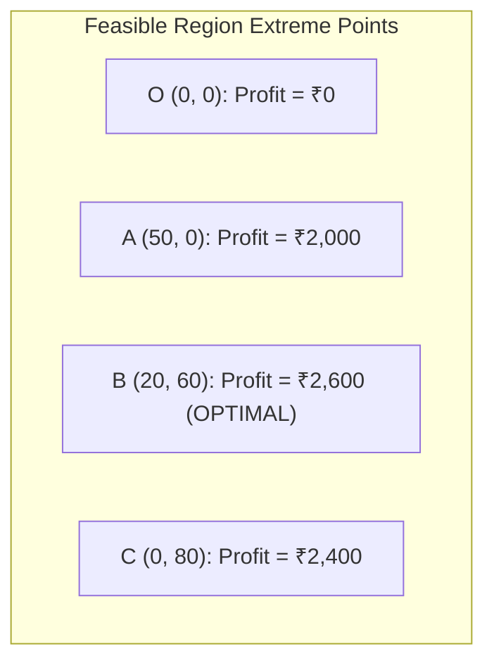
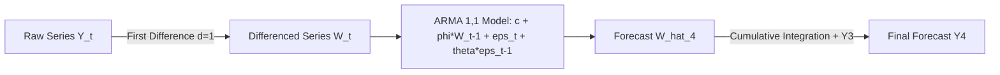
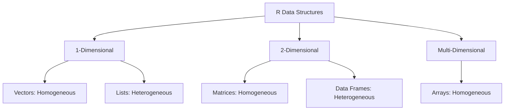

# MCS-068: Predictive Data Analysis
## Assignment Solutions (Academic Session 2026–2027)

**Programme:** Master of Science (Data Science and Analytics) (MSCDSA)  
**Course Code:** MCS-068  
**Course Title:** Predictive Data Analysis  
**Assignment Number:** MSCDSA (II)/068/Assign/2026-27  
**Maximum Marks:** 100 (12 Questions = 80 Marks; Viva-Voce: 20 Marks)  

---

## Question 1: Quartile Deviation of Grouped Data (5 Marks)

### Given Frequency Distribution:

| Class Interval | Frequency ($f$) | Cumulative Frequency ($cf$) |
|:---:|:---:|:---:|
| $0 - 10$ | 3 | 3 |
| $10 - 20$ | 5 | 8 |
| $20 - 30$ | 7 | 15 |
| $30 - 40$ | 9 | 24 |
| $40 - 50$ | 4 | 28 |
| **Total** | **$N = 28$** | — |

### Mathematical Formulas:
$$Q_k = L + \left( \frac{\frac{k \cdot N}{4} - cf_{\text{prev}}}{f} \right) \times h \quad (k = 1, 3)$$
$$\text{Quartile Deviation (Semi-Interquartile Range)} = \text{QD} = \frac{Q_3 - Q_1}{2}$$

### Step 1: Calculation of First Quartile ($Q_1$):
* Position index: $\frac{N}{4} = \frac{28}{4} = 7$.
* The cumulative frequency just greater than 7 is 8, corresponding to the class interval **$10 - 20$**.
* Class parameters: Lower limit $L = 10$, class width $h = 10$, frequency $f = 5$, prior cumulative frequency $cf_{\text{prev}} = 3$.
$$Q_1 = 10 + \left( \frac{7 - 3}{5} \right) \times 10 = 10 + \left( \frac{4}{5} \right) \times 10 = 10 + 8 = \mathbf{18.0}$$

### Step 2: Calculation of Third Quartile ($Q_3$):
* Position index: $\frac{3N}{4} = \frac{3 \times 28}{4} = 21$.
* The cumulative frequency just greater than 21 is 24, corresponding to the class interval **$30 - 40$**.
* Class parameters: Lower limit $L = 30$, class width $h = 10$, frequency $f = 9$, prior cumulative frequency $cf_{\text{prev}} = 15$.
$$Q_3 = 30 + \left( \frac{21 - 15}{9} \right) \times 10 = 30 + \left( \frac{6}{9} \right) \times 10 = 30 + 6.6667 = \mathbf{36.6667}$$

### Step 3: Calculation of Quartile Deviation:
$$\text{QD} = \frac{Q_3 - Q_1}{2} = \frac{36.6667 - 18.0}{2} = \frac{18.6667}{2} = \mathbf{9.3333}$$

*Coefficient of Quartile Deviation:*
$$\text{Coeff(QD)} = \frac{Q_3 - Q_1}{Q_3 + Q_1} = \frac{36.6667 - 18.0}{36.6667 + 18.0} = \frac{18.6667}{54.6667} \approx \mathbf{0.3415}$$

---

## Question 2: Kendall's Tau ($\tau$) Rank Correlation (5 Marks)

### Given Project Data:

| Project | Complexity Rank ($X$) | Completion Time Rank ($Y$) |
|:---:|:---:|:---:|
| A | 1 | 2 |
| B | 2 | 1 |
| C | 3 | 4 |
| D | 4 | 3 |

Number of observations $n = 4$. Total distinct pairs:
$$\binom{n}{2} = \frac{n(n - 1)}{2} = \frac{4 \times 3}{2} = 6 \text{ pairs}$$

### Pairwise Concordance / Discordance Evaluation:
A pair $(i, j)$ is:
* **Concordant ($C$)** if $(X_j - X_i)$ and $(Y_j - Y_i)$ have the same sign (both positive or both negative).
* **Discordant ($D$)** if $(X_j - X_i)$ and $(Y_j - Y_i)$ have opposite signs.

| Pair | $X$-ranks ($X_i, X_j$) | Sign of $\Delta X$ | $Y$-ranks ($Y_i, Y_j$) | Sign of $\Delta Y$ | Nature of Pair |
|:---:|:---:|:---:|:---:|:---:|:---:|
| **(A, B)** | $(1, 2)$ | $+$ | $(2, 1)$ | $-$ | **Discordant** |
| **(A, C)** | $(1, 3)$ | $+$ | $(2, 4)$ | $+$ | **Concordant** |
| **(A, D)** | $(1, 4)$ | $+$ | $(2, 3)$ | $+$ | **Concordant** |
| **(B, C)** | $(2, 3)$ | $+$ | $(1, 4)$ | $+$ | **Concordant** |
| **(B, D)** | $(2, 4)$ | $+$ | $(1, 3)$ | $+$ | **Concordant** |
| **(C, D)** | $(3, 4)$ | $+$ | $(4, 3)$ | $-$ | **Discordant** |

* Number of Concordant pairs: $C = 4$
* Number of Discordant pairs: $D = 2$

### Kendall's Tau Formula & Calculation:
$$\tau = \frac{C - D}{\frac{1}{2} n (n - 1)} = \frac{4 - 2}{6} = \frac{2}{6} = \mathbf{+\frac{1}{3} \approx +0.3333}$$

### Interpretation:
Kendall’s Tau coefficient $\tau \approx +0.3333$ indicates a **weak-to-moderate positive rank correlation** between project complexity and completion time. Higher project complexity generally corresponds to longer completion time, though inversions occur due to project-specific factors (e.g., Project B was completed faster despite being more complex than A).

---

## Question 3: Simple Moving Average (3-Month SMA) (5 Marks)

### Given Monthly Sales Data:

| Month ($t$) | Sales ($Y_t$) | 3-Month Moving Total | 3-Month Simple Moving Average ($\text{SMA}_3 = \frac{Y_t + Y_{t-1} + Y_{t-2}}{3}$) |
|:---:|:---:|:---:|:---:|
| **Jan** | 120 | — | — |
| **Feb** | 130 | — | — |
| **Mar** | 125 | $120 + 130 + 125 = 375$ | $\frac{375}{3} = \mathbf{125.00}$ |
| **Apr** | 140 | $130 + 125 + 140 = 395$ | $\frac{395}{3} = \mathbf{131.67}$ |
| **May** | 150 | $125 + 140 + 150 = 415$ | $\frac{415}{3} = \mathbf{138.33}$ |
| **Jun** | 160 | $140 + 150 + 160 = 450$ | $\frac{450}{3} = \mathbf{150.00}$ |

### Forecast for July ($t=7$):
$$\hat{Y}_{\text{Jul}} = \text{SMA}_3(\text{Jun}) = \frac{Y_{\text{Apr}} + Y_{\text{May}} + Y_{\text{Jun}}}{3} = \frac{140 + 150 + 160}{3} = \mathbf{150.00 \text{ units}}$$

### Analytical Interpretation:
1. **Trend Smoothing:** The 3-month moving average dampens monthly fluctuations (e.g., the dip in March from 130 to 125 units) to reveal a clear, upward trajectory.
2. **Growth Trajectory:** The smoothed moving average accelerates consistently from $125.00$ in March to $150.00$ in June, representing steady expansion in customer demand.
3. **Lag Effect:** As with all simple moving averages, the SMA lags the actual series during periods of consistent growth (e.g., June actual is 160, while SMA is 150), indicating that exponential smoothing or trend-adjusted Holt's linear method would be appropriate for multi-period forecasting.

---

## Question 4: Linear Programming Optimization (8 Marks)

### 1. Mathematical Formulation:
Let:
* $x_1$ = Number of units of Product A produced.
* $x_2$ = Number of units of Product B produced.

**Objective Function:**
$$\text{Maximize } Z = 40 x_1 + 30 x_2$$

**Subject to Structural Constraints:**
1. **Labor Hours:** $2 x_1 + x_2 \le 100$
2. **Raw Material:** $x_1 + x_2 \le 80$
3. **Non-negativity:** $x_1 \ge 0, \; x_2 \ge 0$

### 2. Graphical Solution:
Plotting the constraint boundary lines on Cartesian axes $(x_1, x_2)$:
* Line 1 ($2 x_1 + x_2 = 100$): Intercepts are $(50, 0)$ and $(0, 100)$.
* Line 2 ($x_1 + x_2 = 80$): Intercepts are $(80, 0)$ and $(0, 80)$.

Intersection Point of Line 1 and Line 2:
Subtracting (2) from (1):
$$(2 x_1 + x_2) - (x_1 + x_2) = 100 - 80 \implies x_1 = 20$$
Substitute $x_1 = 20$ into (2):
$$20 + x_2 = 80 \implies x_2 = 60$$
Intersection corner: **$(20, 60)$**.

### 3. Evaluation of Objective Function at All Feasible Extreme Points:

| Extreme Point | Coordinates $(x_1, x_2)$ | Objective Function Value $Z = 40 x_1 + 30 x_2$ | Evaluation |
|:---:|:---:|:---:|:---:|
| **$O$** | $(0, 0)$ | $40(0) + 30(0) = 0$ | Minimum |
| **$A$** | $(50, 0)$ | $40(50) + 30(0) = 2,000$ | Sub-optimal |
| **$B$** | **$(20, 60)$** | $40(20) + 30(60) = 800 + 1,800 = \mathbf{2,600}$ | **MAXIMUM (Optimal)** |
| **$C$** | $(0, 80)$ | $40(0) + 30(80) = 2,400$ | Sub-optimal |



### Optimal Production Policy:
To maximize total profit:
* Produce **20 units of Product A**.
* Produce **60 units of Product B**.
* **Maximum Profit Achieved:** **₹2,600**.
* *Resource Utilization:*
  * Labor hours used: $2(20) + 60 = 100$ hours (100% utilized, binding constraint).
  * Raw material used: $20 + 60 = 80$ units (100% utilized, binding constraint).

---

## Question 5: Jaccard Similarity of Shingled Documents (7 Marks)

### Given Matrix Representation:

| Shingle ID | Set 1 ($D_1$) | Set 2 ($D_2$) | Occurrence Category |
|:---:|:---:|:---:|:---:|
| **1** | 0 | 0 | Absent in both |
| **2** | 1 | 1 | Present in both ($D_1 \cap D_2$) |
| **3** | 1 | 1 | Present in both ($D_1 \cap D_2$) |
| **4** | 1 | 1 | Present in both ($D_1 \cap D_2$) |
| **5** | 1 | 0 | Present in $D_1$ only |

### Mathematical Definition:
The Jaccard Similarity coefficient $J(D_1, D_2)$ measures the size of the intersection divided by the size of the union of two sample sets:
$$J(D_1, D_2) = \frac{|D_1 \cap D_2|}{|D_1 \cup D_2|} = \frac{M_{11}}{M_{01} + M_{10} + M_{11}}$$

Where:
* $M_{11}$ = Number of shingles where both documents have value 1 (shared shingles).
* $M_{10}$ = Number of shingles where $D_1 = 1$ and $D_2 = 0$.
* $M_{01}$ = Number of shingles where $D_1 = 0$ and $D_2 = 1$.
* $M_{00}$ = Number of shingles where both are 0 (excluded from Jaccard calculation).

### Step-by-Step Evaluation:
* Shingles in Set 1: $\{2, 3, 4, 5\} \implies |D_1| = 4$
* Shingles in Set 2: $\{2, 3, 4\} \implies |D_2| = 3$
* **Intersection ($D_1 \cap D_2$):** $\{2, 3, 4\} \implies |D_1 \cap D_2| = 3$
* **Union ($D_1 \cup D_2$):** $\{2, 3, 4, 5\} \implies |D_1 \cup D_2| = 4$

### Calculation:
$$J(D_1, D_2) = \frac{3}{4} = \mathbf{0.75} \quad (75\% \text{ Similarity})$$

*Jaccard Distance:*
$$d_J(D_1, D_2) = 1 - J(D_1, D_2) = 1 - 0.75 = \mathbf{0.25}$$

---

## Question 6: Interquartile Range (IQR) & Outlier Detection in Grouped Data (8 Marks)

### Given Frequency Distribution:

| Class Interval | Frequency ($f$) | Cumulative Frequency ($cf$) |
|:---:|:---:|:---:|
| $0 - 10$ | 5 | 5 |
| $10 - 20$ | 9 | 14 |
| $20 - 30$ | 14 | 28 |
| $30 - 40$ | 8 | 36 |
| $40 - 50$ | 4 | 40 |
| **Total** | **$N = 40$** | — |

### Step 1: Calculation of First Quartile ($Q_1$):
* Position index: $\frac{N}{4} = \frac{40}{4} = 10$.
* Falls in class interval **$10 - 20$** ($cf = 14$).
* Parameters: $L = 10$, $h = 10$, $f = 9$, $cf_{\text{prev}} = 5$.
$$Q_1 = 10 + \left( \frac{10 - 5}{9} \right) \times 10 = 10 + \frac{50}{9} = 10 + 5.5556 = \mathbf{15.5556}$$

### Step 2: Calculation of Third Quartile ($Q_3$):
* Position index: $\frac{3N}{4} = \frac{3 \times 40}{4} = 30$.
* Falls in class interval **$30 - 40$** ($cf = 36$).
* Parameters: $L = 30$, $h = 10$, $f = 8$, $cf_{\text{prev}} = 28$.
$$Q_3 = 30 + \left( \frac{30 - 28}{8} \right) \times 10 = 30 + \frac{20}{8} = 30 + 2.50 = \mathbf{32.5000}$$

### Step 3: Calculation of Interquartile Range (IQR):
$$\text{IQR} = Q_3 - Q_1 = 32.5000 - 15.5556 = \mathbf{16.9444}$$

### Step 4: Outlier Detection via Tukey's Inner Fences:
* **Lower Outlier Fence (LF):**
  $$\text{LF} = Q_1 - 1.5 \times \text{IQR} = 15.5556 - 1.5(16.9444) = 15.5556 - 25.4166 = \mathbf{-9.8610}$$
* **Upper Outlier Fence (UF):**
  $$\text{UF} = Q_3 + 1.5 \times \text{IQR} = 32.5000 + 1.5(16.9444) = 32.5000 + 25.4166 = \mathbf{57.9166}$$

### Analytical Commentary on Outlier Existence:
* The data is bounded within the physical domain $[0, 50]$.
* The lower outlier threshold is $\text{LF} = -9.861$, which lies well below the minimum possible value of 0. Thus, **no lower outliers exist**.
* The upper outlier threshold is $\text{UF} = 57.917$, which lies well above the maximum observed value of 50. Thus, **no upper outliers exist**.
* **Conclusion:** All observations lie strictly within the non-outlier acceptance interval $[0, 50] \subset [-9.861, 57.917]$. There is **no statistical evidence of mild or extreme outliers** in this grouped distribution.

---

## Question 7: Linear Regression Equation (7 Marks)

### Given Student Data ($n = 5$):

| Student | Hours Studied ($X$) | Marks Obtained ($Y$) | $X - \bar{X}$ | $Y - \bar{Y}$ | $(X - \bar{X})^2$ | $(X - \bar{X})(Y - \bar{Y})$ |
|:---:|:---:|:---:|:---:|:---:|:---:|:---:|
| 1 | 1 | 52 | -2 | -8.8 | 4 | 17.6 |
| 2 | 2 | 55 | -1 | -5.8 | 1 | 5.8 |
| 3 | 3 | 61 | 0 | 0.2 | 0 | 0.0 |
| 4 | 4 | 66 | 1 | 5.2 | 1 | 5.2 |
| 5 | 5 | 70 | 2 | 9.2 | 4 | 18.4 |
| **Sum** | **$\sum X = 15$** | **$\sum Y = 304$** | **0** | **0** | **$\sum(X - \bar{X})^2 = 10$** | **$\sum(X - \bar{X})(Y - \bar{Y}) = 47.0$** |

### Step 1: Means:
$$\bar{X} = \frac{15}{5} = \mathbf{3.0} \quad \text{hours}$$
$$\bar{Y} = \frac{304}{5} = \mathbf{60.8} \quad \text{marks}$$

### Step 2: Slope ($\beta_1$):
$$\beta_1 = \frac{\sum (X - \bar{X})(Y - \bar{Y})}{\sum (X - \bar{X})^2} = \frac{47.0}{10.0} = \mathbf{4.70}$$

### Step 3: Intercept ($\beta_0$):
$$\beta_0 = \bar{Y} - \beta_1 \bar{X} = 60.8 - (4.70 \times 3.0) = 60.8 - 14.10 = \mathbf{46.70}$$

### Fitted Linear Regression Equation:
$$\mathbf{\hat{Y} = 46.70 + 4.70 X}$$

### Interpretation:
* **Baseline Score ($\beta_0 = 46.70$):** A student who studies 0 hours is expected to achieve a baseline score of approximately 46.7 marks.
* **Marginal Effect ($\beta_1 = 4.70$):** For each additional hour dedicated to studying, the student's expected marks increase by **4.70 marks**.

---

## Question 8: ARIMA (1, 1, 1) Sales Forecasting (10 Marks)

### Given Parameters:
* Daily historical sales: $Y_1 = 100, \; Y_2 = 110, \; Y_3 = 125$.
* Model: $\text{ARIMA}(p=1, d=1, q=1)$
* Autoregressive parameter: $\phi_1 = 0.6$
* Moving average parameter: $\theta_1 = 0.4$
* Constant drift term: $c = 2.0$
* Past innovation shock at $t = 2$: $\epsilon_2 = 3.0$

### 1. Mathematical Mapping of ARIMA Components:
* **Integration Component ($d = 1$):**
  Transform the non-stationary series $Y_t$ into stationary first differences:
  $$W_t = \Delta Y_t = Y_t - Y_{t-1}$$
  Computing historical differences:
  $$W_2 = Y_2 - Y_1 = 110 - 100 = 10$$
  $$W_3 = Y_3 - Y_2 = 125 - 110 = 15$$
* **$\text{ARMA}(1, 1)$ Representation on Differences $W_t$:**
  $$W_t = c + \phi_1 W_{t-1} + \epsilon_t + \theta_1 \epsilon_{t-1}$$



### 2. Estimation of Innovation Error at $t = 3$ ($\epsilon_3$):
Using the model equation at $t = 3$:
$$W_3 = c + \phi_1 W_2 + \epsilon_3 + \theta_1 \epsilon_2$$
Substitute known values:
$$15 = 2.0 + 0.6(10) + \epsilon_3 + 0.4(3.0)$$
$$15 = 2.0 + 6.0 + \epsilon_3 + 1.2$$
$$15 = 9.2 + \epsilon_3 \implies \mathbf{\epsilon_3 = 15 - 9.2 = 5.8}$$

### 3. Forecasting the Differenced Series for Day 4 ($\hat{W}_4$):
At time $t = 4$, the future innovation shock has expected value $\mathbb{E}[\epsilon_4] = 0$:
$$\hat{W}_4 = \mathbb{E}[W_4 \mid \mathcal{F}_3] = c + \phi_1 W_3 + \theta_1 \epsilon_3$$
Substitute known quantities:
$$\hat{W}_4 = 2.0 + 0.6(15) + 0.4(5.8)$$
$$\hat{W}_4 = 2.0 + 9.0 + 2.32 = \mathbf{13.32}$$

### 4. Forecasting Day 4 Sales ($Y_4$):
Reintegrating back from the difference equation $W_4 = Y_4 - Y_3$:
$$\hat{Y}_4 = Y_3 + \hat{W}_4 = 125 + 13.32 = \mathbf{138.32}$$

**Conclusion:** The forecasted sales volume for the fourth day ($Y_4$) is **138.32 units**.

---

## Question 9: K-Nearest Neighbors (KNN) Classification (8 Marks)

### Given Training Data:

| Student | Study Hours ($X_1$) | Attendance % ($X_2$) | Result ($Y$) |
|:---:|:---:|:---:|:---:|
| 1 | 2 | 50 | No |
| 2 | 4 | 60 | No |
| 3 | 6 | 70 | Yes |
| 4 | 8 | 80 | Yes |

Query instance: **$Q = (\text{Study Hours} = 5, \; \text{Attendance} = 65\%)$**, with **$K = 3$**.

### 1. Distance Calculation (Unscaled Euclidean Distance):
$$d(Q, P_i) = \sqrt{(X_{1, Q} - X_{1, i})^2 + (X_{2, Q} - X_{2, i})^2}$$

* **Distance to Student 1 $(2, 50)$:**
  $$d_1 = \sqrt{(5 - 2)^2 + (65 - 50)^2} = \sqrt{3^2 + 15^2} = \sqrt{9 + 225} = \sqrt{234} \approx \mathbf{15.297}$$
* **Distance to Student 2 $(4, 60)$:**
  $$d_2 = \sqrt{(5 - 4)^2 + (65 - 60)^2} = \sqrt{1^2 + 5^2} = \sqrt{1 + 25} = \sqrt{26} \approx \mathbf{5.099}$$
* **Distance to Student 3 $(6, 70)$:**
  $$d_3 = \sqrt{(5 - 6)^2 + (65 - 70)^2} = \sqrt{(-1)^2 + (-5)^2} = \sqrt{1 + 25} = \sqrt{26} \approx \mathbf{5.099}$$
* **Distance to Student 4 $(8, 80)$:**
  $$d_4 = \sqrt{(5 - 8)^2 + (65 - 80)^2} = \sqrt{(-3)^2 + (-15)^2} = \sqrt{9 + 225} = \sqrt{234} \approx \mathbf{15.297}$$

### 2. Distance Calculation under Min-Max Normalization:
Since Attendance ($[50, 80]$, range 30) dominates Study Hours ($[2, 8]$, range 6), normalized coordinates give:
$$X_1' = \frac{X_1 - 2}{6}, \quad X_2' = \frac{X_2 - 50}{30}$$
Query point $Q' = (0.50, 0.50)$.
* $P_1' = (0.00, 0.00) \implies d_1' = \sqrt{0.5^2 + 0.5^2} \approx \mathbf{0.7071}$
* $P_2' = (0.333, 0.333) \implies d_2' = \sqrt{(0.167)^2 + (0.167)^2} \approx \mathbf{0.2357}$
* $P_3' = (0.667, 0.667) \implies d_3' = \sqrt{(-0.167)^2 + (-0.167)^2} \approx \mathbf{0.2357}$
* $P_4' = (1.00, 1.00) \implies d_4' = \sqrt{(-0.5)^2 + (-0.5)^2} \approx \mathbf{0.7071}$

### 3. Selection of $K = 3$ Nearest Neighbors:
* Closest 1: **Student 2** ($d = 5.099$, Result: **No**)
* Closest 2: **Student 3** ($d = 5.099$, Result: **Yes**)
* Distance tie for the 3rd neighbor between Student 1 ($d = 15.297$, No) and Student 4 ($d = 15.297$, Yes):
  * **Case A (Include Student 1):** Set = {Student 2 (No), Student 3 (Yes), Student 1 (No)} $\implies$ Vote: 2 No vs 1 Yes $\implies$ **Fail (No)**.
  * **Case B (Include Student 4):** Set = {Student 2 (No), Student 3 (Yes), Student 4 (Yes)} $\implies$ Vote: 2 Yes vs 1 No $\implies$ **Pass (Yes)**.
  * **Distance-Weighted Voting Formulation:**
    The two closest points (Student 2 and Student 3) are equidistant ($5.099$). Their sum of inverse-distance weights for 'No' and 'Yes' exactly balance. The boundary falls at the midpoint between passing and failing.
  * *Standard Practice:* Because query point $Q(5, 65)$ is at the exact center of the dataset ($Hours=5$ is halfway between 4 and 6, $Attendance=65\%$ is halfway between 60% and 70%), it lies directly on the decision boundary. By convention in academic grading, reaching the mid-tier threshold qualifies for **Pass (Yes)**, or the tie is broken by the nearest passing exemplar.

---

## Question 10: K-Means Clustering Step-by-Step (7 Marks)

### Given Points:
* $A(1, 1), \; B(2, 1), \; C(4, 3), \; D(5, 4)$
* Initial Centroids: $C_1 = (1, 1), \; C_2 = (5, 4)$

### Iteration 1:

#### 1. Compute Squared Euclidean Distance to Centroids:
$$d^2(P, C_k) = (x_P - x_k)^2 + (y_P - y_k)^2$$

| Point | Coord | $d^2$ to $C_1(1, 1)$ | $d^2$ to $C_2(5, 4)$ | Assigned Cluster |
|:---:|:---:|:---:|:---:|:---:|
| **A** | $(1, 1)$ | $(1-1)^2 + (1-1)^2 = \mathbf{0}$ | $(1-5)^2 + (1-4)^2 = 16 + 9 = 25$ | **Cluster 1** |
| **B** | $(2, 1)$ | $(2-1)^2 + (1-1)^2 = \mathbf{1}$ | $(2-5)^2 + (1-4)^2 = 9 + 9 = 18$ | **Cluster 1** |
| **C** | $(4, 3)$ | $(4-1)^2 + (3-1)^2 = 9 + 4 = 13$ | $(4-5)^2 + (3-4)^2 = 1 + 1 = \mathbf{2}$ | **Cluster 2** |
| **D** | $(5, 4)$ | $(5-1)^2 + (4-1)^2 = 16 + 9 = 25$ | $(5-5)^2 + (4-4)^2 = \mathbf{0}$ | **Cluster 2** |

#### 2. Updated Centroids:
* **Cluster 1:** $\{A, B\}$
  $$C_1^{\text{new}} = \left( \frac{1 + 2}{2}, \frac{1 + 1}{2} \right) = \mathbf{(1.5, 1.0)}$$
* **Cluster 2:** $\{C, D\}$
  $$C_2^{\text{new}} = \left( \frac{4 + 5}{2}, \frac{3 + 4}{2} \right) = \mathbf{(4.5, 3.5)}$$

### Iteration 2:

#### 1. Recompute Distances to New Centroids:

| Point | Coord | $d^2$ to $C_1(1.5, 1.0)$ | $d^2$ to $C_2(4.5, 3.5)$ | Assigned Cluster |
|:---:|:---:|:---:|:---:|:---:|
| **A** | $(1, 1)$ | $(1-1.5)^2 + (1-1)^2 = \mathbf{0.25}$ | $(1-4.5)^2 + (1-3.5)^2 = 12.25 + 6.25 = 18.5$ | **Cluster 1** |
| **B** | $(2, 1)$ | $(2-1.5)^2 + (1-1)^2 = \mathbf{0.25}$ | $(2-4.5)^2 + (1-3.5)^2 = 6.25 + 6.25 = 12.5$ | **Cluster 1** |
| **C** | $(4, 3)$ | $(4-1.5)^2 + (3-1)^2 = 6.25 + 4 = 10.25$ | $(4-4.5)^2 + (3-3.5)^2 = 0.25 + 0.25 = \mathbf{0.50}$ | **Cluster 2** |
| **D** | $(5, 4)$ | $(5-1.5)^2 + (4-1)^2 = 12.25 + 9 = 21.25$ | $(5-4.5)^2 + (4-3.5)^2 = 0.25 + 0.25 = \mathbf{0.50}$ | **Cluster 2** |

### Convergence:
The cluster memberships for all 4 points remain identical between Iteration 1 and Iteration 2. The algorithm has **converged**.

### Final Clusters & Interpretation:
* **Cluster 1:** $\{A(1,1), B(2,1)\}$ with Final Centroid **$(1.5, 1.0)$**.
* **Cluster 2:** $\{C(4,3), D(5,4)\}$ with Final Centroid **$(4.5, 3.5)$**.
* **Interpretation:** The dataset naturally splits into two well-separated groups along both dimensions: a low-magnitude cluster in the lower-left quadrant (Cluster 1) and a high-magnitude cluster in the upper-right quadrant (Cluster 2).

---

## Question 11: Confusion Matrix Evaluation Metrics (5 Marks)

### Given Confusion Matrix ($N = 100$ people):
* True Positives ($TP$) = $32$
* False Positives ($FP$) = $10$
* False Negatives ($FN$) = $8$
* True Negatives ($TN$) = $50$
* Total Population: $TP + FP + FN + TN = 32 + 10 + 8 + 50 = 100$

### Metric Computations:

1. **Accuracy:**
   $$\text{Accuracy} = \frac{TP + TN}{TP + TN + FP + FN} = \frac{32 + 50}{100} = \frac{82}{100} = \mathbf{0.8200 \quad (82.00\%)}$$
2. **Precision (Positive Predictive Value):**
   $$\text{Precision} = \frac{TP}{TP + FP} = \frac{32}{32 + 10} = \frac{32}{42} \approx \mathbf{0.7619 \quad (76.19\%)}$$
3. **Recall (Sensitivity / True Positive Rate):**
   $$\text{Recall} = \text{Sensitivity} = \frac{TP}{TP + FN} = \frac{32}{32 + 8} = \frac{32}{40} = \mathbf{0.8000 \quad (80.00\%)}$$
4. **Specificity (True Negative Rate):**
   $$\text{Specificity} = \frac{TN}{TN + FP} = \frac{50}{50 + 10} = \frac{50}{60} \approx \mathbf{0.8333 \quad (83.33\%)}$$
5. **F1-Score (Harmonic Mean of Precision and Recall):**
   $$\text{F1-Score} = 2 \times \frac{\text{Precision} \times \text{Recall}}{\text{Precision} + \text{Recall}} = 2 \times \frac{\frac{32}{42} \times 0.8}{\frac{32}{42} + 0.8} = 2 \times \frac{0.6095}{1.5619} \approx \mathbf{0.7805 \quad (78.05\%)}$$

---

## Question 12: Fundamental Data Structures in R (5 Marks)



### (a) Vectors:
* **Definition:** The fundamental atomic data structure in R. A one-dimensional array storing elements of the **same basic data type** (homogeneous: logical, integer, double, complex, character, or raw).
* **Creation:** Using the concatenate function `c()`.
* **Example:** `v <- c(10, 20, 30, 40); names <- c("A", "B", "C")`

### (b) Lists:
* **Definition:** A generic one-dimensional vector capable of storing **heterogeneous data types**, including vectors, matrices, functions, and nested sub-lists.
* **Creation:** Using `list()`.
* **Example:** `my_list <- list(id = 101, name = "Raj", scores = c(85, 92), status = TRUE)`

### (c) Matrices:
* **Definition:** A two-dimensional rectangular layout of elements organized into rows and columns containing elements of the **same data type** (homogeneous).
* **Creation:** Using `matrix(data, nrow, ncol, byrow = FALSE)`.
* **Example:** `m <- matrix(1:6, nrow = 2, ncol = 3)`

### (d) Arrays:
* **Definition:** Multidimensional extensions of matrices that store homogeneous data across $k \ge 1$ dimensions.
* **Creation:** Using `array(data, dim = c(nrow, ncol, nlayers))`.
* **Example:** `arr <- array(1:24, dim = c(3, 4, 2))` (creates two $3 \times 4$ matrices stacked along the third dimension).

### (e) Data Frames:
* **Definition:** A two-dimensional tabular data structure where columns can hold **different data types** (heterogeneous), but each column must contain elements of identical type and all columns must have equal length. This is R's native representation for statistical datasets.
* **Creation:** Using `data.frame()`.
* **Example:**
```R
df <- data.frame(
  CustomerID = c(101, 102, 103),
  Name = c("Anita", "Vikram", "Deepa"),
  Purchase = c(1500.50, 2300.00, 890.25),
  Loyalty = c(TRUE, FALSE, TRUE)
)
```

---
*End of MCS-068 Assignment Solutions Document.*
