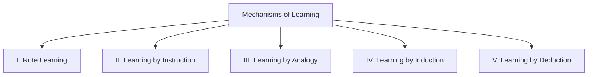
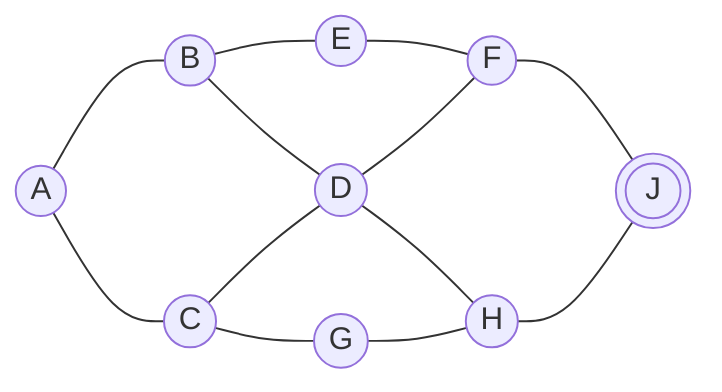
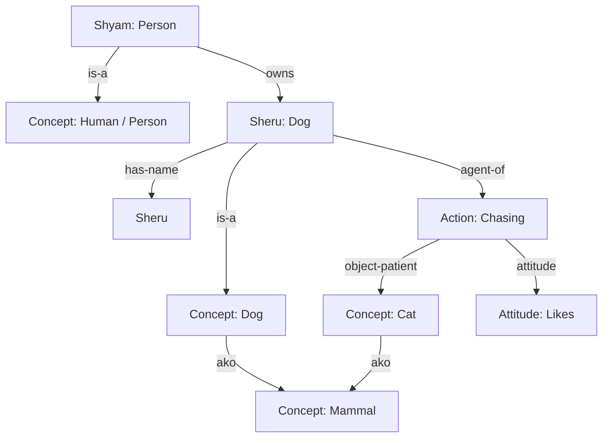
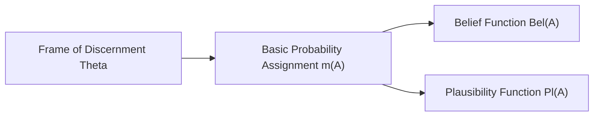
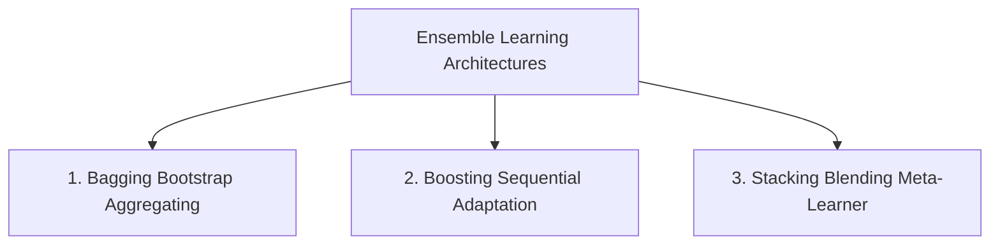
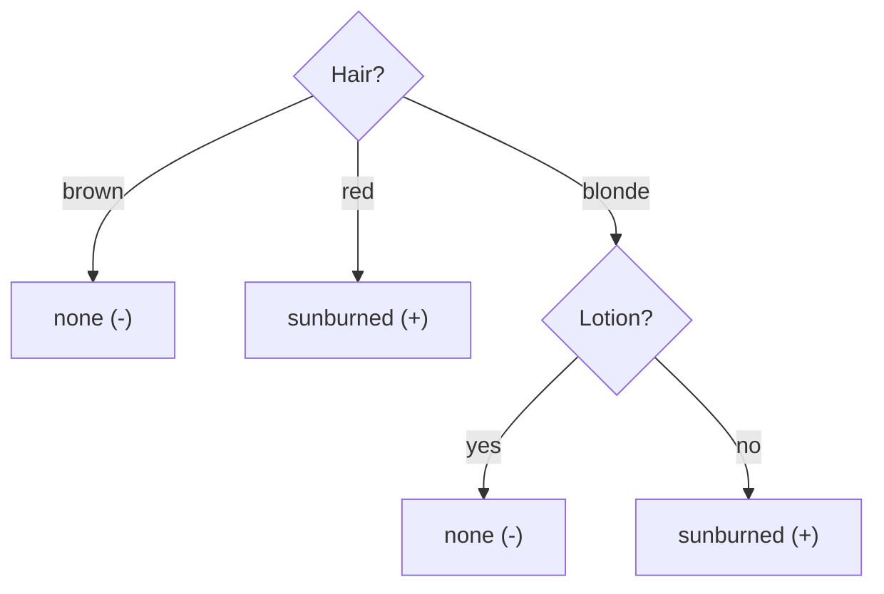
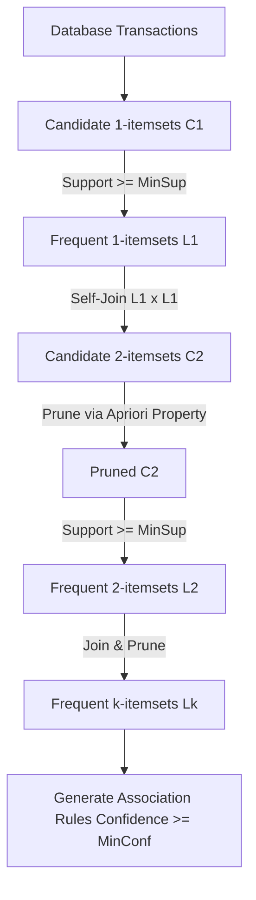

# MCS-224: Artificial Intelligence & Machine Learning
## Assignment Solutions (Academic Session 2026–2027)

**Programme:** Master of Science (Data Science and Analytics) (MSCDSA)  
**Course Code:** MCS-224  
**Course Title:** Artificial Intelligence & Machine Learning  
**Assignment Number:** MSCDSA (II)/224/Assign/2026-27  
**Maximum Marks:** 100 (16 Questions = 80 Marks; Viva-Voce: 20 Marks)  

---

## Question 1: Learning and Forms of Learning (5 Marks)

### What is Learning?
In Artificial Intelligence and Cognitive Science, **Learning** is the process by which an agent or system improves its task execution performance over time through experience, observation, study, or instruction. Formally (Tom Mitchell, 1997):
> *"A computer program is said to learn from experience $E$ with respect to some class of tasks $T$ and performance measure $P$, if its performance at tasks in $T$, as measured by $P$, improves with experience $E$."*

### Five Classical Ways of Learning:



1. **Rote Learning (Memorization):**
   * *Definition:* Direct memorization and caching of computed values or facts without active abstraction, generalization, or structural transformation.
   * *Mechanism:* The agent stores `(Input, Output)` pairs in a hash table or lookup table. When identical inputs recur, the result is retrieved in $O(1)$ time.
   * *Example:* Samuel’s Checkers-player caching previously evaluated board positions; memoization in dynamic programming.
2. **Learning by Instruction (Direct Advice Taking):**
   * *Definition:* Acquiring new knowledge from an external expert, teacher, or formalized corpus.
   * *Mechanism:* The system parses high-level advice, converts it into an internal operational representation (first-order logic rules, production rules), and integrates it into its knowledge base.
   * *Example:* An expert system receiving codified medical diagnostic guidelines from clinical handbooks.
3. **Learning by Analogy:**
   * *Definition:* Transferring relational concepts and problem-solving solutions from a familiar source domain to an unfamiliar target domain.
   * *Mechanism:* Step 1: Source identification; Step 2: Relational structural mapping; Step 3: Knowledge projection; Step 4: Verification and adaptation.
   * *Example:* Solving solar system celestial mechanics by mapping Rutherford’s planetary model of the atom.
4. **Learning by Induction:**
   * *Definition:* Inferring generalized hypotheses, latent patterns, or universal rules from specific training observations (Bottom-Up reasoning).
   * *Mechanism:* Given training instances $(x_1, y_1), \dots, (x_n, y_n)$, construct a general function $\hat{f}(x)$ such that $\hat{f}(x) \approx y$.
   * *Example:* Decision tree induction (ID3/C4.5) inferring diagnostic rules from patient records; linear regression.
5. **Learning by Deduction:**
   * *Definition:* Deriving specialized, logically guaranteed operational rules from general axioms, domain theories, and known truths (Top-Down reasoning).
   * *Mechanism:* Uses Explanation-Based Learning (EBL) and theorem proving to transform existing knowledge into faster, compilable execution rules without introducing uncertainty.
   * *Example:* Specializing the general axiom $\forall x (\text{Bird}(x) \land \neg\text{Abnormal}(x) \implies \text{Flies}(x))$ to deduce that a specific canary flies.

---

## Question 2: Artificial Intelligence and Real-World Applications (4 Marks)

### Definition of Artificial Intelligence:
**Artificial Intelligence (AI)** is the branch of computer science dedicated to designing computational systems, software, and autonomous agents capable of performing cognitive tasks typically requiring human intelligence. These tasks include perception, visual scene interpretation, natural language comprehension, formal reasoning, planning, decision-making under uncertainty, and adaptive learning. AI systems are categorized by:
* **Thinking Humanly / Rationally:** Cognitive modeling vs. laws of thought (formal logic).
* **Acting Humanly / Rationally:** Passing the Turing Test vs. Rational Agent Architectures (maximizing expected utility).

### AI Applications in Healthcare and Agriculture:

#### 1. Healthcare Domain:
* **Medical Imaging & Automated Diagnostics:** Deep Convolutional Neural Networks (CNNs) analyzing MRI scans, CT scans, and digital mammography to detect malignant tumors, retinal hemorrhages, and pulmonary lesions with radiologist-level sensitivity.
* **Drug Discovery & Molecular Docking:** Generative AI models (e.g., AlphaFold) predicting 3D protein structures and simulating drug-target molecular binding affinities, reducing early-stage pharmaceutical synthesis cycles from years to weeks.
* **Personalized Precision Medicine:** Predictive modeling integrating patient multi-omics, electronic health records (EHR), and genomic biomarkers to recommend patient-specific oncology therapy regimens.

#### 2. Agricultural Domain:
* **Precision Farming & Crop Health Monitoring:** Computer vision mounted on autonomous aerial drones and multispectral satellites calculating NDVI (Normalized Difference Vegetation Index) to detect pest infestations, nitrogen deficiency, and weed patches.
* **Autonomous Harvesting & Smart Robotics:** Computer vision-guided robotic arms identifying fruit ripeness and harvesting delicate crops without bruising.
* **Predictive Yield & Weather-Driven Irrigation:** Machine learning models fusing meteorological forecasts, IoT soil moisture sensor telemetries, and historical yield data to optimize automated drip irrigation schedules.

---

## Question 3: 8-Puzzle Problem Path Solving (4 Marks)

### Problem Formulation:
* **Start State ($S_0$):**
  $$\begin{matrix} 1 & 2 & 3 \\ 4 & 8 & \text{--} \\ 7 & 6 & 5 \end{matrix}$$
* **Goal State ($S_G$):**
  $$\begin{matrix} 1 & 2 & 3 \\ 4 & 5 & 6 \\ \text{--} & 7 & 8 \end{matrix}$$
* **Rules:** The blank space ($\text{--}$) can slide Up, Down, Left, or Right within the $3 \times 3$ grid boundaries. Each step has unit cost $g(n) = 1$.

### Step-by-Step State Transition Trajectory:

```
[Start S0]         [Step 1]           [Step 2]           [Step 3]
1  2  3            1  2  3            1  2  3            1  2  3
4  8  --   ===>    4  8  5    ===>    4  8  5    ===>    4  -- 5
7  6  5            7  6  --           7  -- 6            7  8  6
(Slide 5 Up)       (Slide 6 Right)    (Slide 8 Down)

      [Step 4]           [Step 5]           [Step 6]           [Goal S_G]
===>  1  2  3    ===>    1  2  3    ===>    1  2  3    ===>    1  2  3
      4  5  --           4  5  6            4  5  6            4  5  6
      7  8  6            7  8  --           7  -- 8            -- 7  8
      (Slide 5 Left)     (Slide 6 Up)       (Slide 8 Right)    (Slide 7 Right)
```

### Detailed Search Trace:
1. **Initial State ($g=0$):** Blank at position $(1, 2)$.
2. **Step 1 ($g=1$):** Slide tile **5** UP into $(1, 2)$; Blank moves DOWN to $(2, 2)$.
   Grid: Row 1: `[1, 2, 3]`; Row 2: `[4, 8, 5]`; Row 3: `[7, 6, --]`.
3. **Step 2 ($g=2$):** Slide tile **6** RIGHT into $(2, 2)$; Blank moves LEFT to $(2, 1)$.
   Grid: Row 1: `[1, 2, 3]`; Row 2: `[4, 8, 5]`; Row 3: `[7, --, 6]`.
4. **Step 3 ($g=3$):** Slide tile **8** DOWN into $(2, 1)$; Blank moves UP to $(1, 1)$.
   Grid: Row 1: `[1, 2, 3]`; Row 2: `[4, --, 5]`; Row 3: `[7, 8, 6]`.
5. **Step 4 ($g=4$):** Slide tile **5** LEFT into $(1, 1)$; Blank moves RIGHT to $(1, 2)$.
   Grid: Row 1: `[1, 2, 3]`; Row 2: `[4, 5, --]`; Row 3: `[7, 8, 6]`.
6. **Step 5 ($g=5$):** Slide tile **6** UP into $(1, 2)$; Blank moves DOWN to $(2, 2)$.
   Grid: Row 1: `[1, 2, 3]`; Row 2: `[4, 5, 6]`; Row 3: `[7, 8, --]`.
7. **Step 6 ($g=6$):** Slide tile **8** RIGHT into $(2, 2)$; Blank moves LEFT to $(2, 1)$.
   Grid: Row 1: `[1, 2, 3]`; Row 2: `[4, 5, 6]`; Row 3: `[7, --, 8]`.
8. **Step 7 ($g=7$):** Slide tile **7** RIGHT into $(2, 1)$; Blank moves LEFT to $(2, 0)$.
   Grid: Row 1: `[1, 2, 3]`; Row 2: `[4, 5, 6]`; Row 3: `[--, 7, 8]`.

**Conclusion:** The minimum cost path is achieved in **7 steps** ($Cost = 7$).

---

## Question 4: Breadth-First Search (BFS) Traversal (5 Marks)

### Graph Topology:
* **Start Node:** $A$ (designated by entry arrow).
* **Goal Node:** $J$ (designated by concentric target circles).
* **Undirected Adjacency Structure (Alphabetical Tie-Breaking):**
  * $A: [B, C]$
  * $B: [A, D, E]$
  * $C: [A, D, G]$
  * $D: [B, C, F, H]$
  * $E: [B, F]$
  * $F: [D, E, J]$
  * $G: [C, H]$
  * $H: [D, G, J]$
  * $J: [F, H]$



### BFS Execution Trace (FIFO Queue):

| Step | Current Dequeued Node | Visited Set | FIFO Queue Status | Parent Pointers / Path |
|:---:|:---:|:---:|:---:|:---:|
| **Init** | — | $\{A\}$ | $[A]$ | $A \to \text{None}$ |
| **1** | $A$ | $\{A, B, C\}$ | $[B, C]$ | $B \to A,\; C \to A$ |
| **2** | $B$ | $\{A, B, C, D, E\}$ | $[C, D, E]$ | $D \to B,\; E \to B$ |
| **3** | $C$ | $\{A, B, C, D, E, G\}$ | $[D, E, G]$ | $G \to C$ ($D$ already visited) |
| **4** | $D$ | $\{A, B, C, D, E, G, F, H\}$ | $[E, G, F, H]$ | $F \to D,\; H \to D$ |
| **5** | $E$ | $\{A, B, C, D, E, G, F, H\}$ | $[G, F, H]$ | ($F$ already visited) |
| **6** | $G$ | $\{A, B, C, D, E, G, F, H\}$ | $[F, H]$ | ($H$ already visited) |
| **7** | $F$ | $\{A, B, C, D, E, G, F, H, J\}$ | $[H, J]$ | **Goal $J$ enqueued!** ($J \to F$) |
| **8** | $H$ | $\{A, B, C, D, E, G, F, H, J\}$ | $[J]$ | ($J$ already visited) |
| **9** | **$J$** | Goal Reached | — | **TERMINATE** |

### Output:
* **BFS Traversal Order:** $A \to B \to C \to D \to E \to G \to F \to H \to J$
* **Shortest Path to Goal ($J$):** Reconstructed via parent pointers:
  $$A \to B \to D \to F \to J \quad (\text{Path Length } = 4 \text{ edges})$$

---

## Question 5: Semantic Network Representation (4 Marks)

### Statement:
> *"Shyam owns a dog named Sheru, and Sheru likes to chase cats."*

### Semantic Network Diagram:



### Knowledge Representation Analysis:
* **Entities (Nodes):**
  * `Shyam`: Instance node representing an individual human.
  * `Sheru`: Instance node representing an individual domestic dog.
  * `Person`, `Dog`, `Mammal`, `Cat`: Generic concept / class nodes.
* **Relations (Directed Labeled Arcs):**
  * `is-a / instance-of`: Links an instance to its conceptual class (`Shyam` $\xrightarrow{is-a}$ `Person`, `Sheru` $\xrightarrow{is-a}$ `Dog`).
  * `owns`: Directed relational edge from owner to asset (`Shyam` $\xrightarrow{owns}$ `Sheru`).
  * `ako (a kind of)`: Subsumption taxonomic inheritance (`Dog` $\xrightarrow{ako}$ `Mammal`, `Cat` $\xrightarrow{ako}$ `Mammal`).
  * `likes-to-chase`: Relational action predicate linking `Sheru` to the class `Cat`.

---

## Question 6: Probability and Relative Frequency (4 Marks)

### Experiment:
A coin is tossed 3 times.

#### (a) All Possible Outcomes (Sample Space $S$):
Each toss has 2 outcomes ($\{H, T\}$). For 3 tosses, the total elementary outcomes are $2^3 = 8$:
$$S = \{HHH, HHT, HTH, HTT, THH, THT, TTH, TTT\}$$

#### (b) Probabilities:
1. **Probability of 2 or more heads ($\ge 2$ Heads):**
   * Favorable event $E_1 = \{HHH, HHT, HTH, THH\}$
   * Number of favorable outcomes: $|E_1| = 4$
   * $$P(\ge 2\text{ Heads}) = \frac{|E_1|}{|S|} = \frac{4}{8} = \frac{1}{2} = 0.50$$
2. **Probability of getting three tails:**
   * Favorable event $E_2 = \{TTT\}$
   * Number of favorable outcomes: $|E_2| = 1$
   * $$P(3\text{ Tails}) = \frac{|E_2|}{|S|} = \frac{1}{8} = 0.125$$

#### (c) Relative Frequency of Tail $r_n(T)$:
* **Mathematical Definition:** If $n$ total coin tosses are performed and $n(T)$ tails are observed:
  $$r_n(T) = \frac{n(T)}{n}$$
* In the theoretical sample space of $N = 8$ trials (each consisting of 3 tosses, giving $n = 24$ total tosses), the total number of tails is:
  $$n(T) = 0(1) + 1(3) + 2(3) + 3(1) = 0 + 3 + 6 + 3 = 12$$
* Theoretical relative frequency:
  $$r_{24}(T) = \frac{12}{24} = 0.50$$
* *Asymptotic Behavior:* By the Weak Law of Large Numbers, as the empirical number of tosses $n \to \infty$, $r_n(T) \xrightarrow{P} P(T) = 0.5$.

---

## Question 7: Dempster-Shafer Theory of Evidence (4 Marks)

### Theoretical Principles:
Dempster-Shafer (D-S) Theory is a mathematical framework for reasoning under uncertainty that generalizes Bayesian probability by explicitly modeling **ignorance** and epistemic uncertainty.



1. **Frame of Discernment ($\Theta$):** The set of exhaustive and mutually exclusive hypotheses. The power set $2^\Theta$ encompasses all possible subsets.
2. **Basic Probability Assignment (BPA / Mass Function $m$):**
   A mapping $m: 2^\Theta \to [0, 1]$ satisfying:
   $$m(\emptyset) = 0 \quad \text{and} \quad \sum_{A \subseteq \Theta} m(A) = 1$$
3. **Belief $\text{Bel}(A)$ and Plausibility $\text{Pl}(A)$:**
   * **Belief:** Total certainty directly supporting $A$:
     $$\text{Bel}(A) = \sum_{B \subseteq A} m(B)$$
   * **Plausibility:** Extent to which $A$ cannot be refuted:
     $$\text{Pl}(A) = \sum_{B \cap A \neq \emptyset} m(B) = 1 - \text{Bel}(A^c)$$
   * The interval $[\text{Bel}(A), \text{Pl}(A)]$ represents the **uncertainty band**.
4. **Dempster's Rule of Combination:** Combines independent evidence sources $m_1$ and $m_2$:
   $$m_{1,2}(C) = \frac{\sum_{A \cap B = C} m_1(A) m_2(B)}{1 - K} \quad \text{for } C \neq \emptyset$$
   where the conflict factor is $K = \sum_{A \cap B = \emptyset} m_1(A) m_2(B)$.

### Illustrative Example:
Suppose a patient has a fever. Frame of discernment: $\Theta = \{\text{Flu } (F), \text{Cold } (C)\}$.
* Doctor 1 provides evidence based on symptoms: $m_1(\{F\}) = 0.6$, $m_1(\Theta) = 0.4$ (40% ignorance).
* Diagnostic lab test provides evidence: $m_2(\{F\}) = 0.7$, $m_2(\Theta) = 0.3$.
* Combined belief using Dempster's rule:
  * $m_{1,2}(\{F\}) = m_1(\{F\})m_2(\{F\}) + m_1(\{F\})m_2(\Theta) + m_1(\Theta)m_2(\{F\}) = 0.42 + 0.18 + 0.28 = 0.88$
  * $m_{1,2}(\Theta) = m_1(\Theta)m_2(\Theta) = 0.4 \times 0.3 = 0.12$
  * Here conflict $K = 0$.
  * Thus, belief in Flu increases to $\text{Bel}(\{F\}) = 0.88$.

---

## Question 8: Fuzzy Set Operations (5 Marks)

### Given Universe: $U = \{a, b, c, d, e\}$
* $A = \{ a/0.6, b/0.4, c/0.5, d/0.0, e/0.8 \}$
* $B = \{ a/0.2, b/0.8, c/0.7, d/0.3, e/0.5 \}$
* $C = \{ a/0.1, b/0.2, c/0.8, d/0.6, e/0.2 \}$

### Step-by-Step Computations:

#### (i) Fuzzy Union $A \cup B \cup C$:
$$\mu_{A \cup B \cup C}(x) = \max(\mu_A(x), \mu_B(x), \mu_C(x))$$
* For $a$: $\max(0.6, 0.2, 0.1) = 0.6$
* For $b$: $\max(0.4, 0.8, 0.2) = 0.8$
* For $c$: $\max(0.5, 0.7, 0.8) = 0.8$
* For $d$: $\max(0.0, 0.3, 0.6) = 0.6$
* For $e$: $\max(0.8, 0.5, 0.2) = 0.8$
$$\mathbf{A \cup B \cup C = \{ a/0.6, b/0.8, c/0.8, d/0.6, e/0.8 \}}$$

#### (ii) Fuzzy Intersection $A \cap B \cap C$:
$$\mu_{A \cap B \cap C}(x) = \min(\mu_A(x), \mu_B(x), \mu_C(x))$$
* For $a$: $\min(0.6, 0.2, 0.1) = 0.1$
* For $b$: $\min(0.4, 0.8, 0.2) = 0.2$
* For $c$: $\min(0.5, 0.7, 0.8) = 0.5$
* For $d$: $\min(0.0, 0.3, 0.6) = 0.0$
* For $e$: $\min(0.8, 0.5, 0.2) = 0.2$
$$\mathbf{A \cap B \cap C = \{ a/0.1, b/0.2, c/0.5, d/0.0, e/0.2 \}}$$

#### (iii) $A' \cup B' \cup C'$:
Using De Morgan's Law: $A' \cup B' \cup C' = (A \cap B \cap C)'$, where $\mu_{(A \cap B \cap C)'}(x) = 1 - \mu_{A \cap B \cap C}(x)$:
* For $a$: $1 - 0.1 = 0.9$
* For $b$: $1 - 0.2 = 0.8$
* For $c$: $1 - 0.5 = 0.5$
* For $d$: $1 - 0.0 = 1.0$
* For $e$: $1 - 0.2 = 0.8$
$$\mathbf{A' \cup B' \cup C' = \{ a/0.9, b/0.8, c/0.5, d/1.0, e/0.8 \}}$$

#### (iv) $A' \cap B' \cap C'$:
Using De Morgan's Law: $A' \cap B' \cap C' = (A \cup B \cup C)'$, where $\mu_{(A \cup B \cup C)'}(x) = 1 - \mu_{A \cup B \cup C}(x)$:
* For $a$: $1 - 0.6 = 0.4$
* For $b$: $1 - 0.8 = 0.2$
* For $c$: $1 - 0.8 = 0.2$
* For $d$: $1 - 0.6 = 0.4$
* For $e$: $1 - 0.8 = 0.2$
$$\mathbf{A' \cap B' \cap C' = \{ a/0.4, b/0.2, c/0.2, d/0.4, e/0.2 \}}$$

#### (v) $(A \cap B \cup C)'$:
First evaluate $A \cap B$:
* $a: \min(0.6, 0.2) = 0.2$
* $b: \min(0.4, 0.8) = 0.4$
* $c: \min(0.5, 0.7) = 0.5$
* $d: \min(0.0, 0.3) = 0.0$
* $e: \min(0.8, 0.5) = 0.5$
Thus, $A \cap B = \{ a/0.2, b/0.4, c/0.5, d/0.0, e/0.5 \}$.

Next union with $C$, $(A \cap B) \cup C$:
* $a: \max(0.2, 0.1) = 0.2$
* $b: \max(0.4, 0.2) = 0.4$
* $c: \max(0.5, 0.8) = 0.8$
* $d: \max(0.0, 0.6) = 0.6$
* $e: \max(0.5, 0.2) = 0.5$
Thus, $(A \cap B) \cup C = \{ a/0.2, b/0.4, c/0.8, d/0.6, e/0.5 \}$.

Finally, take the complement $((A \cap B) \cup C)' = 1 - \mu$:
* $a: 1 - 0.2 = 0.8$
* $b: 1 - 0.4 = 0.6$
* $c: 1 - 0.8 = 0.2$
* $d: 1 - 0.6 = 0.4$
* $e: 1 - 0.5 = 0.5$
$$\mathbf{(A \cap B \cup C)' = \{ a/0.8, b/0.6, c/0.2, d/0.4, e/0.5 \}}$$

---

## Question 9: Ensemble Learning and Three Primary Classes (4 Marks)

### What is Ensemble Learning?
**Ensemble Learning** is a machine learning paradigm in which multiple diverse individual models (termed *base learners* or *weak learners*) are systematically combined to produce a unified predictive meta-model. By aggregating predictions, ensembles achieve significantly lower generalization error, balance the bias-variance tradeoff, and avoid overfitting.



### Three Primary Classes:

1. **Bagging (Bootstrap Aggregating):**
   * *Architecture:* Parallel training. Generates $B$ bootstrap samples (sampling with replacement) from the training set; trains an independent high-variance model (e.g., deep decision tree) on each subset; averages their outputs (or takes majority vote).
   * *Primary Effect:* Substantially **reduces variance** without increasing bias.
   * *Representative Example:* **Random Forest**, Extra-Trees.
2. **Boosting:**
   * *Architecture:* Sequential training. Base learners are trained iteratively in stages. In each round, misclassified or high-residual training samples from prior learners are assigned higher sample weights (or models fit pseudo-residuals via gradient descent).
   * *Primary Effect:* Substantially **reduces bias** by converting weak learners into a strong learner.
   * *Representative Example:* **AdaBoost**, **Gradient Boosted Decision Trees (GBDT)**, XGBoost, LightGBM.
3. **Stacking (Stacked Generalization):**
   * *Architecture:* Heterogeneous multi-level learning. Multiple distinct algorithmic models (e.g., SVM, Random Forest, Logistic Regression, Neural Net) are trained in parallel on the raw training dataset (Level 0). Their out-of-fold predictions serve as new features for a meta-learner (Level 1, e.g., Ridge Regression) that produces the final prediction.
   * *Primary Effect:* Leverages orthogonal inductive biases of fundamentally different algorithms.

---

## Question 10: Naïve Bayes Classification (7 Marks)

### Given Dataset ($N = 8$ instances):

| Sl. No. | Color | Legs | Height | Smelly | Species |
|:---:|:---:|:---:|:---:|:---:|:---:|
| 1 | White | 3 | Short | Yes | M |
| 2 | Green | 2 | Tall | No | M |
| 3 | Green | 3 | Short | Yes | M |
| 4 | White | 3 | Short | Yes | M |
| 5 | Green | 2 | Short | No | H |
| 6 | White | 2 | Tall | No | H |
| 7 | White | 2 | Tall | No | H |
| 8 | White | 2 | Short | Yes | H |

### Query Sample:
$$X = \{\text{Color}=\text{Green}, \text{Legs}=2, \text{Height}=\text{Tall}, \text{Smelly}=\text{No}\}$$

### Step 1: Prior Probabilities $P(C_k)$
Total samples $N = 8$.
* Count($M$) = 4 $\implies P(M) = \frac{4}{8} = 0.50$
* Count($H$) = 4 $\implies P(H) = \frac{4}{8} = 0.50$

### Step 2: Conditional Likelihoods for Class $M$ ($N_M = 4$):
* $P(\text{Color}=\text{Green} \mid M) = \frac{2}{4} = 0.50$ (Instances 2, 3)
* $P(\text{Legs}=2 \mid M) = \frac{1}{4} = 0.25$ (Instance 2)
* $P(\text{Height}=\text{Tall} \mid M) = \frac{1}{4} = 0.25$ (Instance 2)
* $P(\text{Smelly}=\text{No} \mid M) = \frac{1}{4} = 0.25$ (Instance 2)

Joint Conditional Likelihood for $M$:
$$P(X \mid M) = 0.50 \times 0.25 \times 0.25 \times 0.25 = 0.0078125$$

Unnormalized Posterior for $M$:
$$P(X, M) = P(M) \times P(X \mid M) = 0.50 \times 0.0078125 = \mathbf{0.00390625} \quad \left(\frac{1}{256}\right)$$

### Step 3: Conditional Likelihoods for Class $H$ ($N_H = 4$):
* $P(\text{Color}=\text{Green} \mid H) = \frac{1}{4} = 0.25$ (Instance 5)
* $P(\text{Legs}=2 \mid H) = \frac{4}{4} = 1.00$ (Instances 5, 6, 7, 8)
* $P(\text{Height}=\text{Tall} \mid H) = \frac{2}{4} = 0.50$ (Instances 6, 7)
* $P(\text{Smelly}=\text{No} \mid H) = \frac{3}{4} = 0.75$ (Instances 5, 6, 7)

Joint Conditional Likelihood for $H$:
$$P(X \mid H) = 0.25 \times 1.00 \times 0.50 \times 0.75 = 0.09375$$

Unnormalized Posterior for $H$:
$$P(X, H) = P(H) \times P(X \mid H) = 0.50 \times 0.09375 = \mathbf{0.046875} \quad \left(\frac{12}{256}\right)$$

### Step 4: Classification Decision:
$$\frac{P(H \mid X)}{P(M \mid X)} = \frac{0.046875}{0.00390625} = 12$$
Normalized Probabilities:
$$P(H \mid X) = \frac{0.046875}{0.046875 + 0.00390625} = \frac{12}{13} \approx 92.31\%$$
$$P(M \mid X) = \frac{0.00390625}{0.046875 + 0.00390625} = \frac{1}{13} \approx 7.69\%$$

**Conclusion:** The query sample $X$ is conclusively classified as **Species H**.

---

## Question 11: ID3 Decision Tree Induction (7 Marks)

### What is a Decision Tree?
A **Decision Tree** is a non-parametric hierarchical supervised learning model that recursively partitions the feature space into orthogonal hyper-rectangles based on decision split rules.
* **Internal Nodes:** Test conditions on individual attributes.
* **Branches:** Outcomes of the test condition.
* **Leaf Nodes:** Terminal class labels or continuous predictions.

### Dataset ($N = 8$ instances):

| Name | Hair | Height | Weight | Lotion | Result |
|:---|:---|:---|:---|:---|:---|
| Sarah | blonde | average | light | no | sunburned (+) |
| Dana | blonde | tall | average | yes | none (-) |
| Alex | brown | short | average | yes | none (-) |
| Annie | blonde | short | average | no | sunburned (+) |
| Emily | red | average | heavy | no | sunburned (+) |
| Pete | brown | tall | heavy | no | none (-) |
| John | brown | average | heavy | no | none (-) |
| Katie | blonde | short | light | yes | none (-) |

Target Result: $p = 3$ (sunburned, $+$), $n = 5$ (none, $-$), Total $N = 8$.

### Step 1: Overall System Entropy $H(S)$:
$$H(S) = - \left(\frac{3}{8}\right) \log_2\left(\frac{3}{8}\right) - \left(\frac{5}{8}\right) \log_2\left(\frac{5}{8}\right) \approx - (0.375 \times -1.4150) - (0.625 \times -0.6781) = \mathbf{0.9544} \text{ bits}$$

### Step 2: Information Gain for All Attributes:

#### 1. Attribute: `Hair`
* `brown` (3 instances: Alex, Pete, John): $[0+, 3-] \implies H(\text{brown}) = 0.0000$
* `red` (1 instance: Emily): $[1+, 0-] \implies H(\text{red}) = 0.0000$
* `blonde` (4 instances: Sarah, Dana, Annie, Katie): $[2+, 2-] \implies H(\text{blonde}) = 1.0000$
* Remainder: $H(S \mid \text{Hair}) = \frac{3}{8}(0) + \frac{1}{8}(0) + \frac{4}{8}(1) = 0.5000$
$$\text{Gain}(\text{Hair}) = 0.9544 - 0.5000 = \mathbf{0.4544}$$

#### 2. Attribute: `Lotion`
* `yes` (3 instances: Dana, Alex, Katie): $[0+, 3-] \implies H(\text{yes}) = 0.0000$
* `no` (5 instances: Sarah, Annie, Emily, Pete, John): $[3+, 2-] \implies H(\text{no}) = - \frac{3}{5}\log_2\frac{3}{5} - \frac{2}{5}\log_2\frac{2}{5} = 0.9710$
* Remainder: $H(S \mid \text{Lotion}) = \frac{3}{8}(0) + \frac{5}{8}(0.9710) = 0.6069$
$$\text{Gain}(\text{Lotion}) = 0.9544 - 0.6069 = \mathbf{0.3476}$$

#### 3. Attribute: `Height`
* `tall` (2 instances): $[0+, 2-] \implies H = 0.0000$
* `short` (3 instances): $[1+, 2-] \implies H = 0.9183$
* `average` (3 instances): $[2+, 1-] \implies H = 0.9183$
* Remainder: $H(S \mid \text{Height}) = \frac{2}{8}(0) + \frac{3}{8}(0.9183) + \frac{3}{8}(0.9183) = 0.6887$
$$\text{Gain}(\text{Height}) = 0.9544 - 0.6887 = \mathbf{0.2657}$$

#### 4. Attribute: `Weight`
* `light` (2 instances): $[1+, 1-] \implies H = 1.0000$
* `heavy` (3 instances): $[1+, 2-] \implies H = 0.9183$
* `average` (3 instances): $[1+, 2-] \implies H = 0.9183$
* Remainder: $H(S \mid \text{Weight}) = \frac{2}{8}(1) + \frac{3}{8}(0.9183) + \frac{3}{8}(0.9183) = 0.9387$
$$\text{Gain}(\text{Weight}) = 0.9544 - 0.9387 = \mathbf{0.0157}$$

**Root Split Selection:** $\text{Hair}$ has the highest information gain ($0.4544$).

### Step 3: Splitting under `Hair`:
* Branch `Hair = brown`: Pure class $\implies$ **none**.
* Branch `Hair = red`: Pure class $\implies$ **sunburned**.
* Branch `Hair = blonde`: Contains Sarah (+), Dana (-), Annie (+), Katie (-).
  * Testing `Lotion`:
    * `yes` (Dana, Katie): Pure $[0+, 2-] \implies$ **none**.
    * `no` (Sarah, Annie): Pure $[2+, 0-] \implies$ **sunburned**.
  * Information gain for `Lotion` under `blonde` is $1.0000$ (perfect classification).

### Induced Decision Tree:



### Classification of Unknown Sample:
* **Unknown Instance:** $X = \{\text{Name: Peter}, \text{Hair: red}, \text{Height: short}, \text{Weight: average}\}$
* Trace: Root $\to$ `Hair == red` $\to$ **sunburned (+)**.
* **Predicted Class:** **sunburned**.

---

## Question 12: Quadratic Regression Modeling (5 Marks)

### Data:
$X = [3, 4, 5, 6, 7]$, $Y = [2.5, 3.2, 3.8, 6.5, 11.5]$ ($n = 5$).

### Model Formulation:
$$Y = a X^2 + b X + c$$

To simplify calculations, let $u = X - 5$, where $\sum u = 0$.
Then $u = [-2, -1, 0, 1, 2]$.

| $X$ | $u = X - 5$ | $u^2$ | $u^3$ | $u^4$ | $Y$ | $u Y$ | $u^2 Y$ |
|:---:|:---:|:---:|:---:|:---:|:---:|:---:|:---:|
| 3 | -2 | 4 | -8 | 16 | 2.5 | -5.0 | 10.0 |
| 4 | -1 | 1 | -1 | 1 | 3.2 | -3.2 | 3.2 |
| 5 | 0 | 0 | 0 | 0 | 3.8 | 0.0 | 0.0 |
| 6 | 1 | 1 | 1 | 1 | 6.5 | 6.5 | 6.5 |
| 7 | 2 | 4 | 8 | 16 | 11.5 | 23.0 | 46.0 |
| **Sum** | **0** | **10** | **0** | **34** | **27.5** | **21.3** | **65.7** |

Model in terms of $u$:
$$Y = A_0 + A_1 u + A_2 u^2$$

Normal equations when $\sum u = 0$ and $\sum u^3 = 0$:
1. $n A_0 + A_2 \sum u^2 = \sum Y \implies 5 A_0 + 10 A_2 = 27.5 \implies A_0 + 2 A_2 = 5.5$
2. $A_1 \sum u^2 = \sum u Y \implies 10 A_1 = 21.3 \implies \mathbf{A_1 = 2.13}$
3. $A_0 \sum u^2 + A_2 \sum u^4 = \sum u^2 Y \implies 10 A_0 + 34 A_2 = 65.7$

Solving for $A_0$ and $A_2$:
* From (1), $A_0 = 5.5 - 2 A_2$.
* Substitute into (3):
  $$10(5.5 - 2 A_2) + 34 A_2 = 65.7 \implies 55 - 20 A_2 + 34 A_2 = 65.7 \implies 14 A_2 = 10.7$$
  $$\mathbf{A_2 = \frac{10.7}{14} \approx 0.764286}$$
  $$\mathbf{A_0 = 5.5 - 2(0.764286) = 3.971429}$$

Model equation:
$$Y = 3.971429 + 2.13(X - 5) + 0.764286(X - 5)^2$$

In standard form $Y = a X^2 + b X + c$:
* $a = A_2 = \mathbf{0.76429}$
* $b = A_1 - 10 A_2 = 2.13 - 7.64286 = \mathbf{-5.51286}$
* $c = A_0 - 5 A_1 + 25 A_2 = 3.971429 - 10.65 + 19.107143 = \mathbf{12.42857}$

Fitted Quadratic Equation:
$$\mathbf{Y = 0.76429 X^2 - 5.51286 X + 12.42857}$$

### Predict $Y$ at $X = 9$:
For $X = 9$, $u = 9 - 5 = 4$:
$$Y(9) = 3.971429 + 2.13(4) + 0.764286(4^2)$$
$$Y(9) = 3.971429 + 8.520000 + 0.764286(16) = 3.971429 + 8.52 + 12.228571 = \mathbf{24.72}$$

**Result:** The predicted value of $Y$ at $X = 9$ is **24.72**.

---

## Question 13: Support Vector Machines (SVM) (6 Marks)

### Given Points:
* **Blue Class ($y = -1$):** $(1,2),\; (2,3),\; (-1,2),\; (-1,4),\; (-1,-1)$
* **Yellow Class ($y = +1$):** $(4,2),\; (5,-1),\; (5,1),\; (6,1),\; (5,3)$

### Geometric & Mathematical Derivation:
* Notice that the convex hull of the Blue points has its rightmost apex at $\mathbf{p}_{\text{blue}} = (2, 3)$.
* The convex hull of the Yellow points has its leftmost apex at $\mathbf{p}_{\text{yellow}} = (4, 2)$.
* The Euclidean distance between these two boundary points is:
  $$d = \sqrt{(4 - 2)^2 + (2 - 3)^2} = \sqrt{2^2 + (-1)^2} = \sqrt{5} \approx 2.236$$
* The vector connecting them is $\vec{v} = (4 - 2, 2 - 3) = (2, -1)$.
* The midpoint between these closest boundary points is:
  $$\mathbf{m} = \left(\frac{2+4}{2}, \frac{3+2}{2}\right) = (3, 2.5)$$
* The normal vector to the separating hyperplane is $\mathbf{w} \propto (2, -1)$.

### Hyperplane Equation:
Passing through $(3, 2.5)$ with normal $(2, -1)$:
$$2(x_1 - 3) - 1(x_2 - 2.5) = 0 \implies 2 x_1 - x_2 - 3.5 = 0$$
Multiplying by 2 gives integer coefficients:
$$\mathbf{4 x_1 - 2 x_2 - 7 = 0}$$

### Support Vectors & Margin:
* **Support Vectors:**
  * For Blue ($y = -1$): $\mathbf{(2, 3)}$
  * For Yellow ($y = +1$): $\mathbf{(4, 2)}$
* **Verification on Support Vectors:**
  * Blue $(2, 3)$: $4(2) - 2(3) - 7 = 8 - 6 - 7 = -5$
  * Yellow $(4, 2)$: $4(4) - 2(2) - 7 = 16 - 4 - 7 = +5$
* Canonical SVM weights: $\mathbf{w} = \left(\frac{4}{5}, -\frac{2}{5}\right) = (0.8, -0.4)$, $b = -1.4$.
  $$\|\mathbf{w}\| = \sqrt{0.8^2 + (-0.4)^2} = \sqrt{0.64 + 0.16} = \sqrt{0.8} = \frac{2}{\sqrt{5}}$$
* **Geometric Margin:**
  $$\gamma = \frac{2}{\|\mathbf{w}\|} = \frac{2}{2/\sqrt{5}} = \sqrt{5} \approx 2.236 \quad (\text{Half-margin } M = 1.118)$$

---

## Question 14: Feed-Forward Neural Network Output Calculations (6 Marks)

### Network Architecture:
* **Inputs:** $X_1, X_2$
* **Hidden Neurons:** $Z_1, Z_2$
* **Output Neurons:** $Y_1, Y_2$
* **Weights:**
  * $W = \begin{bmatrix} W_{11} & W_{12} \\ W_{21} & W_{22} \end{bmatrix} = \begin{bmatrix} -1 & 2 \\ 1 & -2 \end{bmatrix}$ (Input to Hidden)
  * $V = \begin{bmatrix} V_{11} & V_{12} \\ V_{21} & V_{22} \end{bmatrix} = \begin{bmatrix} 2 & -1 \\ -2 & 2 \end{bmatrix}$ (Hidden to Output)
* **Activation Function:** Step function $F(u) = \begin{cases} 1 & \text{if } u \ge 0 \\ 0 & \text{if } u < 0 \end{cases}$

### Propagation Equations:
$$z_{\text{in}1} = W_{11} X_1 + W_{21} X_2 = - X_1 + X_2 \implies Z_1 = F(z_{\text{in}1})$$
$$z_{\text{in}2} = W_{12} X_1 + W_{22} X_2 = 2 X_1 - 2 X_2 \implies Z_2 = F(z_{\text{in}2})$$
$$y_{\text{in}1} = V_{11} Z_1 + V_{21} Z_2 = 2 Z_1 - 2 Z_2 \implies Y_1 = F(y_{\text{in}1})$$
$$y_{\text{in}2} = V_{12} Z_1 + V_{22} Z_2 = - Z_1 + 2 Z_2 \implies Y_2 = F(y_{\text{in}2})$$

### Pattern Evaluations:

#### 1. Pattern P1: $(X_1 = 0, X_2 = 0)$
* $z_{\text{in}1} = 0 \implies Z_1 = F(0) = 1$
* $z_{\text{in}2} = 0 \implies Z_2 = F(0) = 1$
* $y_{\text{in}1} = 2(1) - 2(1) = 0 \implies Y_1 = F(0) = 1$
* $y_{\text{in}2} = -1(1) + 2(1) = 1 \implies Y_2 = F(1) = 1$
* **Output:** $(Y_1 = 1, Y_2 = 1)$

#### 2. Pattern P2: $(X_1 = 1, X_2 = 0)$
* $z_{\text{in}1} = -1(1) + 0 = -1 \implies Z_1 = F(-1) = 0$
* $z_{\text{in}2} = 2(1) - 0 = 2 \implies Z_2 = F(2) = 1$
* $y_{\text{in}1} = 2(0) - 2(1) = -2 \implies Y_1 = F(-2) = 0$
* $y_{\text{in}2} = -1(0) + 2(1) = 2 \implies Y_2 = F(2) = 1$
* **Output:** $(Y_1 = 0, Y_2 = 1)$

#### 3. Pattern P3: $(X_1 = 0, X_2 = 1)$
* $z_{\text{in}1} = -0 + 1 = 1 \implies Z_1 = F(1) = 1$
* $z_{\text{in}2} = 0 - 2(1) = -2 \implies Z_2 = F(-2) = 0$
* $y_{\text{in}1} = 2(1) - 2(0) = 2 \implies Y_1 = F(2) = 1$
* $y_{\text{in}2} = -1(1) + 2(0) = -1 \implies Y_2 = F(-1) = 0$
* **Output:** $(Y_1 = 1, Y_2 = 0)$

#### 4. Pattern P4: $(X_1 = 1, X_2 = 1)$
* $z_{\text{in}1} = -1(1) + 1(1) = 0 \implies Z_1 = F(0) = 1$
* $z_{\text{in}2} = 2(1) - 2(1) = 0 \implies Z_2 = F(0) = 1$
* $y_{\text{in}1} = 2(1) - 2(1) = 0 \implies Y_1 = F(0) = 1$
* $y_{\text{in}2} = -1(1) + 2(1) = 1 \implies Y_2 = F(1) = 1$
* **Output:** $(Y_1 = 1, Y_2 = 1)$

### Summary Table of Outputs:

| Pattern | $X_1$ | $X_2$ | $z_{\text{in}1}$ | $z_{\text{in}2}$ | $Z_1$ | $Z_2$ | $y_{\text{in}1}$ | $y_{\text{in}2}$ | $Y_1$ | $Y_2$ |
|:---:|:---:|:---:|:---:|:---:|:---:|:---:|:---:|:---:|:---:|:---:|
| **P1** | 0 | 0 | 0 | 0 | 1 | 1 | 0 | 1 | **1** | **1** |
| **P2** | 1 | 0 | -1 | 2 | 0 | 1 | -2 | 2 | **0** | **1** |
| **P3** | 0 | 1 | 1 | -2 | 1 | 0 | 2 | -1 | **1** | **0** |
| **P4** | 1 | 1 | 0 | 0 | 1 | 1 | 0 | 1 | **1** | **1** |

---

## Question 15: Principal Component Analysis (PCA) (5 Marks)

### Data:
$X_i = [2, 4, 5, 6, 6, 7, 9, 8]$, $Y_i = [1, 6, 4, 5, 7, 7, 10, 9]$ ($n = 8$).

### Step 1: Means and Mean-Centering:
* $\bar{X} = \frac{2 + 4 + 5 + 6 + 6 + 7 + 9 + 8}{8} = \frac{47}{8} = \mathbf{5.875}$
* $\bar{Y} = \frac{1 + 6 + 4 + 5 + 7 + 7 + 10 + 9}{8} = \frac{49}{8} = \mathbf{6.125}$

Mean-centered differences:
* $x' = [-3.875, -1.875, -0.875, 0.125, 0.125, 1.125, 3.125, 2.125]$
* $y' = [-5.125, -0.125, -2.125, -1.125, 0.875, 0.875, 3.875, 2.875]$

### Step 2: Covariance Matrix ($S$):
* $S_{xx} = \frac{\sum (x')^2}{n - 1} = \frac{34.875}{7} \approx \mathbf{4.9821}$
* $S_{yy} = \frac{\sum (y')^2}{n - 1} = \frac{56.875}{7} \approx \mathbf{8.1250}$
* $S_{xy} = \frac{\sum x' y'}{n - 1} = \frac{41.125}{7} \approx \mathbf{5.8750}$

$$\Sigma = \begin{bmatrix} 4.9821 & 5.8750 \\ 5.8750 & 8.1250 \end{bmatrix}$$

### Step 3: Eigenvalues:
Characteristic equation: $\det(\Sigma - \lambda I) = 0$:
$$\lambda^2 - \text{Tr}(\Sigma)\lambda + \det(\Sigma) = 0$$
* $\text{Tr}(\Sigma) = 4.9821 + 8.1250 = 13.1071$
* $\det(\Sigma) = (4.9821 \times 8.1250) - (5.8750)^2 = 40.4796 - 34.5156 = 5.9640$
$$\lambda = \frac{13.1071 \pm \sqrt{(13.1071)^2 - 4(5.9640)}}{2} = \frac{13.1071 \pm \sqrt{171.796 - 23.856}}{2} = \frac{13.1071 \pm 12.1631}{2}$$
* **$\lambda_1 \approx 12.6351$** (First Principal Component)
* **$\lambda_2 \approx 0.4720$**

### Step 4: First Principal Component Eigenvector:
$$(\Sigma - \lambda_1 I)\mathbf{e}_1 = 0 \implies (4.9821 - 12.6351) e_{11} + 5.8750 e_{12} = 0$$
$$-7.6530 e_{11} + 5.8750 e_{12} = 0 \implies e_{12} = \frac{7.6530}{5.8750} e_{11} \approx 1.3026 e_{11}$$
Normalizing:
$$\|\mathbf{e}_1\| = \sqrt{1^2 + 1.3026^2} = \sqrt{2.6968} \approx 1.6422$$
* $e_{11} = \frac{1}{1.6422} \approx \mathbf{0.6089}$
* $e_{12} = \frac{1.3026}{1.6422} \approx \mathbf{0.7932}$

**Principal Component 1 (PC1):**
$$\mathbf{e}_1 = \begin{bmatrix} 0.6089 \\ 0.7932 \end{bmatrix}$$
* **Explained Variance Ratio:**
  $$\frac{\lambda_1}{\lambda_1 + \lambda_2} = \frac{12.6351}{13.1071} = \mathbf{96.40\%}$$
PC1 accounts for over 96.4% of the total dataset variance.

---

## Question 16: The Apriori Algorithm (5 Marks)

### What is the Apriori Algorithm?
The **Apriori Algorithm** (Agrawal & Srikant, 1994) is an unsupervised data mining algorithm designed for **Association Rule Mining** over large transactional databases. It identifies frequent itemsets using the **Apriori Property** (Downward-Closure Property):
> *"All non-empty subsets of a frequent itemset must also be frequent."*  
> *Contrapositive (Pruning Principle):* If an itemset is infrequent, all of its supersets are guaranteed to be infrequent and are pruned immediately.



### Illustrative Example:
Suppose a supermarket has 4 transactions ($T_1$ to $T_4$):
* $T_1: \{\text{Milk}, \text{Bread}\}$
* $T_2: \{\text{Bread}, \text{Diaper}, \text{Beer}\}$
* $T_3: \{\text{Milk}, \text{Bread}, \text{Diaper}, \text{Beer}\}$
* $T_4: \{\text{Milk}, \text{Diaper}, \text{Beer}\}$
* Let $\text{Minimum Support} = 50\%$ (at least 2 transactions) and $\text{Minimum Confidence} = 75\%$.

#### 1. Candidate 1-Itemsets ($C_1$) & Frequent 1-Itemsets ($L_1$):
* $\{\text{Milk}\}: 3/4 = 75\%$ (Frequent)
* $\{\text{Bread}\}: 3/4 = 75\%$ (Frequent)
* $\{\text{Diaper}\}: 3/4 = 75\%$ (Frequent)
* $\{\text{Beer}\}: 3/4 = 75\%$ (Frequent)

#### 2. Candidate 2-Itemsets ($C_2$) & Frequent 2-Itemsets ($L_2$):
* $\{\text{Milk}, \text{Bread}\}: 2/4 = 50\%$ (Frequent)
* $\{\text{Milk}, \text{Diaper}\}: 2/4 = 50\%$ (Frequent)
* $\{\text{Milk}, \text{Beer}\}: 2/4 = 50\%$ (Frequent)
* $\{\text{Bread}, \text{Diaper}\}: 2/4 = 50\%$ (Frequent)
* $\{\text{Bread}, \text{Beer}\}: 2/4 = 50\%$ (Frequent)
* $\{\text{Diaper}, \text{Beer}\}: 3/4 = 75\%$ (Frequent)

#### 3. Candidate 3-Itemsets ($C_3$):
* Joining $\{\text{Diaper}, \text{Beer}\}$ with other frequent pairs gives candidate $\{\text{Milk}, \text{Diaper}, \text{Beer}\}$ and $\{\text{Bread}, \text{Diaper}, \text{Beer}\}$.
* Count for $\{\text{Diaper}, \text{Beer}, \text{Bread}\}$ = 2 ($T_2, T_3$).
* Count for $\{\text{Milk}, \text{Diaper}, \text{Beer}\}$ = 2 ($T_3, T_4$).

#### 4. Rule Generation (Confidence Evaluation):
Consider rule: $\text{Diaper} \implies \text{Beer}$:
$$\text{Confidence}(\text{Diaper} \implies \text{Beer}) = \frac{\text{Support}(\text{Diaper} \cup \text{Beer})}{\text{Support}(\text{Diaper})} = \frac{3/4}{3/4} = 100\% \ge 75\%$$
* Lift: $\text{Lift} = \frac{1.00}{0.75} = 1.33 > 1$ (Positive correlation).
* **Actionable Insight:** Customers purchasing diapers are highly likely to purchase beer, suggesting a cross-merchandising layout in the retail store.

---
*End of MCS-224 Assignment Solutions Document.*
