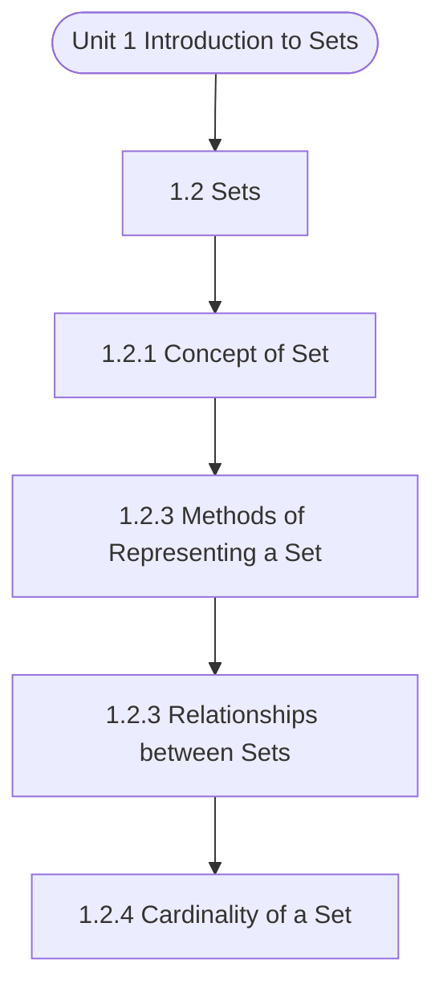

# MCS-061: Mathematical Foundations - I
## Unit 1: Introduction to Sets

> 📚 **Programme:** M.Sc. (Data Science and Analytics) | **Semester:** Semester 1  
> ⏱️ **Estimated Study Time:** ~69 mins | 📄 **Textbook Pages:** 34 Pages  
> 📥 **Original PDF:** [Download & View Authentic Textbook](../../../pdfs/Semester_1/MCS-061_Mathematical_Foundations_-_I/Unit-1_Introduction_to_Sets.pdf)

---

### 🎯 Executive Concept & Data Science Relevance
In modern data systems, **Introduction to Sets** forms a vital conceptual pillar. Set theory is the fundamental bedrock of discrete mathematics, computer science, and data engineering. Relational database operations (SQL JOIN, UNION, INTERSECT), feature spaces, probability sample spaces, and categorical groupings are direct applications of set theory.

> [!NOTE]
> **Why this matters for your career:** Mastering introduction to sets equips you with the foundational principles required to reason mathematically about high-dimensional datasets, evaluate algorithm performance, and avoid statistical pitfalls in production machine learning pipelines.

### 🗺️ Visual Knowledge Architecture
The following concept map illustrates the structural hierarchy and learning trajectory of this module:



### 📖 Core Definitions & Terminology Cards

> 📌 **Set**  
> - **Formal Definition:** A well-defined collection of distinct objects, denoted typically by uppercase letters $A, B, X$. Distinctness implies no duplicate elements, and well-defined means for any entity $x$, either $x \in A$ or $x \notin A$ is deterministically decidable.  
> - 💡 **Practical Intuition & Analogy:** *Think of a Python `set({1, 2, 3})` where duplicate elements are collapsed and lookup is based on unique membership.*

> 📌 **Cardinality $\vert A \vert$ or $n(A)$**  
> - **Formal Definition:** The total count of distinct elements in a finite set $A$. If $\vert A \vert = n$, the set contains exactly $n$ distinct members. For infinite sets, cardinality characterizes transfinite sizes (e.g. countable $\aleph_0$ vs uncountable $c$).  
> - 💡 **Practical Intuition & Analogy:** *The output of `len(my_set)` in programming.*

> 📌 **Power Set $\mathcal{P}(A)$**  
> - **Formal Definition:** The set of all possible subsets of $A$, including the empty set $\emptyset$ and $A$ itself: $\mathcal{P}(A) = \lbrace S \mid S \subseteq A \rbrace$. If $\vert A \vert = n$, then $\vert \mathcal{P}(A) \vert = 2^n$.  
> - 💡 **Practical Intuition & Analogy:** *In feature selection, evaluating all possible combinations of $n$ features requires searching through the power set of features ( $2^n$ candidate models ).*

> 📌 **Subset & Proper Subset**  
> - **Formal Definition:** A set $A$ is a subset of $B$ ( $A \subseteq B$ ) if $\forall x \in A \implies x \in B$. It is a proper subset ( $A \subset B$ ) if $A \subseteq B$ and $A \neq B$ (i.e. $\exists y \in B$ such that $y \notin A$).  
> - 💡 **Practical Intuition & Analogy:** *All Data Scientists are Analysts ( $A \subseteq B$ ), but not all Analysts are Data Scientists ( $A \subset B$ ).*

> 📌 **Universal Set $U$**  
> - **Formal Definition:** A designated superset containing all objects and entities under active consideration in a given problem or domain. Every set $X$ in that context satisfies $X \subseteq U$.  
> - 💡 **Practical Intuition & Analogy:** *The entire master database table or global population before applying any filter conditions.*

> 📌 **Complement $A^c$ or $A'$**  
> - **Formal Definition:** The set of all elements in the universal set $U$ that do not belong to $A$: $A^c = \lbrace x \in U \mid x \notin A \rbrace = U \setminus A$.  
> - 💡 **Practical Intuition & Analogy:** *The NOT condition in filtering: selecting all records that do NOT match a criteria.*

### ⚡ Governing Mathematical Laws & Formula Cheatsheet
#### 🔹 Power Set Cardinality Theorem
$$
\vert\mathcal{P}(A)\vert = 2^n \quad \text{where } n = \vert A\vert
$$
- **Explanation:** Proved by induction or combinatorics: each of the $n$ elements has exactly 2 binary choices (to be included or excluded from a subset).

#### 🔹 Principle of Inclusion-Exclusion (2 Sets)
$$
\vert A \cup B\vert = \vert A\vert + \vert B\vert - \vert A \cap B\vert
$$
- **Explanation:** Prevents double-counting the elements present in the intersection when calculating the total union size.

#### 🔹 Principle of Inclusion-Exclusion (3 Sets)
$$
\begin{aligned} \vert A \cup B \cup C\vert = & \;\vert A\vert + \vert B\vert + \vert C\vert \\ & - (\vert A \cap B\vert + \vert B \cap C\vert + \vert A \cap C\vert) \\ & + \vert A \cap B \cap C\vert \end{aligned}
$$
- **Explanation:** Alternates adding singletons, subtracting pairwise overlaps, and re-adding the three-way intersection.

#### 🔹 De Morgan's Laws for Sets
$$
(A \cup B)^c = A^c \cap B^c \quad \text{and} \quad (A \cap B)^c = A^c \cup B^c
$$
- **Explanation:** The complement of a union is the intersection of the complements, and vice versa. Fundamental to query optimization and boolean logic.

#### 🔹 Cartesian Product Cardinality
$$
\vert A \times B\vert = \vert A\vert \times \vert B\vert = \lbrace (a, b) \mid a \in A, b \in B \rbrace
$$
- **Explanation:** Basis of relational database CROSS JOIN, generating every ordered pair between two entities.

### ⚖️ Axiomatic Properties & Governing Laws
The mathematical formulations of this module are anchored by foundational algebraic and structural laws:

- **Idempotent Laws:** $A \cup A = A \quad \text{and} \quad A \cap A = A$
- **Identity Laws:** $A \cup \emptyset = A \quad \text{and} \quad A \cap U = A$
- **Domination Laws:** $A \cup U = U \quad \text{and} \quad A \cap \emptyset = \emptyset$
- **Commutative Laws:** $A \cup B = B \cup A \quad \text{and} \quad A \cap B = B \cap A$
- **Associative Laws:** $(A \cup B) \cup C = A \cup (B \cup C) \quad \text{and} \quad (A \cap B) \cap C = A \cap (B \cap C)$
- **Distributive Laws:** $A \cap (B \cup C) = (A \cap B) \cup (A \cap C) \quad \text{and} \quad A \cup (B \cap C) = (A \cup B) \cap (A \cup C)$
- **Complement Laws:** $A \cup A^c = U, \quad A \cap A^c = \emptyset, \quad (A^c)^c = A$

### 📌 Comprehensive Section-by-Section Study Breakdown
#### `1.2` Sets
##### 📘 Theoretical Principles & In-Depth Exposition
A set is generally represented by two methods as given below. Roster Method Dictionary meaning of ‘Roster’ is ‘a list showing persons who perform their duties in turn’. As its meaning suggests, in this method each and every element is listed and put, separating by commas, in curly brackets.

This method is also known as Tabular Form or Listing Method. For example, (i) If A is the set of vowels of English alphabets, then A = {a, e, i, o, u} (ii) If N is the set of natural numbers, then N = {1, 2, 3, 4, 5, …} (iii) If W is the set of whole numbers, then W = {0, 1, 2, 3, 4, 5, …} (iv) If Z is the set of integers, then Z = {… , – 3, – 2, – 1, 0, 1, 2, 3,…} (v) If E is the set of even natural numbers, then E = {2, 4, 6, 8, 10, 12, …} (vi) If O is the set of odd natural numbers, then O = {1, 3, 5, …} (vii) If P is the set of prime numbers, then P = {2, 3, 5, 7, 11, 13, 17, 19, 23, 29, 31, 37, …} Remark 1: Throughout the course, we use N, W and Z for the sets of natural numbers, whole numbers, and integers, respectively.

Set, Relations and Functions B. Set-Builder Method In this method, we consider one or more properties that are exclusive to the elements of a set, so that no other elements can be members of the set. This method is also known as the Property Method or Rule Method. For example, (i) Let A = {x : x is a vowel of English alphabet}, then elements of A are a, e, i, o, u and having exclusive property of being a vowel no other alphabet can be considered as an element of set A.

##### ⚙️ Mathematical & Algorithmic Mechanics
- **Formal Mechanics:** Establishes symbolic transformations and state invariants governing sets.
- **Boundary Invariants:** Ensures robust error-handling, non-empty set guarantees, and strict asymptotic bounds.

##### 📊 Practical Data Science & Production Relevance
- **Industry Application:** Directly implemented in production workflows such as SQL query filters, pandas vectorized operations, and feature transformation pipelines.
- **Production Pitfall:** Failing to verify membership bounds or missing edge cases in sets can cause silent data corruption or performance bottlenecks.

> [!TIP]
> **Key Exam & Technical Interview Takeaway:** Be prepared to define sets formally, cite its core mathematical invariants, and solve step-by-step numerical/proof questions.

#### `1.2.1` Concept of Set
##### 📘 Theoretical Principles & In-Depth Exposition
The section on **Concept of Set** establishes rigorous theoretical foundations necessary for advanced computational modeling. It introduces formal mathematical structures and symbolic notations that guarantee consistency across proofs and algorithms.

In the broader scope of **Introduction to Sets**, understanding concept of set is essential to formalizing data representations, verifying boundary constraints, and ensuring computational determinism across multidimensional feature spaces.

##### ⚙️ Mathematical & Algorithmic Mechanics
- **Formal Mechanics:** Establishes symbolic transformations and state invariants governing concept of set.
- **Boundary Invariants:** Ensures robust error-handling, non-empty set guarantees, and strict asymptotic bounds.

##### 📊 Practical Data Science & Production Relevance
- **Industry Application:** Directly implemented in production workflows such as SQL query filters, pandas vectorized operations, and feature transformation pipelines.
- **Production Pitfall:** Failing to verify membership bounds or missing edge cases in concept of set can cause silent data corruption or performance bottlenecks.

> [!TIP]
> **Key Exam & Technical Interview Takeaway:** Be prepared to define concept of set formally, cite its core mathematical invariants, and solve step-by-step numerical/proof questions.

#### `1.2.3` Methods of Representing a Set
##### 📘 Theoretical Principles & In-Depth Exposition
For any two sets X and Y, the set relationships that we discuss are: (i) equality (=) of X and Y (ii) X is a subset/ superset (⸦) of Y (iii) X is a proper subset/superset(⸦)of Y, and (iv) is not a subset of ( ). Set, Relations and Functions

##### ⚙️ Mathematical & Algorithmic Mechanics
- **Formal Mechanics:** Establishes symbolic transformations and state invariants governing methods of representing a set.
- **Boundary Invariants:** Ensures robust error-handling, non-empty set guarantees, and strict asymptotic bounds.

##### 📊 Practical Data Science & Production Relevance
- **Industry Application:** Directly implemented in production workflows such as SQL query filters, pandas vectorized operations, and feature transformation pipelines.
- **Production Pitfall:** Failing to verify membership bounds or missing edge cases in methods of representing a set can cause silent data corruption or performance bottlenecks.

> [!TIP]
> **Key Exam & Technical Interview Takeaway:** Be prepared to define methods of representing a set formally, cite its core mathematical invariants, and solve step-by-step numerical/proof questions.

#### `1.2.3` Relationships between Sets
##### 📘 Theoretical Principles & In-Depth Exposition
For any two sets X and Y, the set relationships that we discuss are: (i) equality (=) of X and Y (ii) X is a subset/ superset (⸦) of Y (iii) X is a proper subset/superset(⸦)of Y, and (iv) is not a subset of ( ). Set, Relations and Functions

##### ⚙️ Mathematical & Algorithmic Mechanics
- **Formal Mechanics:** Establishes symbolic transformations and state invariants governing relationships between sets.
- **Boundary Invariants:** Ensures robust error-handling, non-empty set guarantees, and strict asymptotic bounds.

##### 📊 Practical Data Science & Production Relevance
- **Industry Application:** Directly implemented in production workflows such as SQL query filters, pandas vectorized operations, and feature transformation pipelines.
- **Production Pitfall:** Failing to verify membership bounds or missing edge cases in relationships between sets can cause silent data corruption or performance bottlenecks.

> [!TIP]
> **Key Exam & Technical Interview Takeaway:** Be prepared to define relationships between sets formally, cite its core mathematical invariants, and solve step-by-step numerical/proof questions.

#### `1.2.4` Cardinality of a Set
##### 📘 Theoretical Principles & In-Depth Exposition
The number of elements in a finite set say A is called its Cardinality or cardinal number of a finite set and is denoted by n(A). For example, (i) If A = {x, y, z}, then n(A) = 3, i.e. cardinality of A is 3. (ii) If B = {1,4, 2, 3, 9, 15}, then n(B) = 6, i.e. cardinality of B is 6.

##### ⚙️ Mathematical & Algorithmic Mechanics
- **Formal Mechanics:** Establishes symbolic transformations and state invariants governing cardinality of a set.
- **Boundary Invariants:** Ensures robust error-handling, non-empty set guarantees, and strict asymptotic bounds.

##### 📊 Practical Data Science & Production Relevance
- **Industry Application:** Directly implemented in production workflows such as SQL query filters, pandas vectorized operations, and feature transformation pipelines.
- **Production Pitfall:** Failing to verify membership bounds or missing edge cases in cardinality of a set can cause silent data corruption or performance bottlenecks.

> [!TIP]
> **Key Exam & Technical Interview Takeaway:** Be prepared to define cardinality of a set formally, cite its core mathematical invariants, and solve step-by-step numerical/proof questions.

#### `1.2.5` Subsets
##### 📘 Theoretical Principles & In-Depth Exposition
Before we relook at the subset, let us define the empty set. The empty set (also known as the null set) is a unique concept in mathematics and set theory. It represents a set that contains no elements. It is denoted by or { } : A pair of curly braces with nothing between them. Definition: A set A is said to be a subset of a set B if each element of A is also an element of B.

In this case, B is called a superset of A. If A is a subset of B, we represent this by A ⸦ B. As a statement in logic, we represent this situation as, A ⸦ B [x A x B] ‘B contains ‘A’ or ‘B’ is a superset of A’ is represented by B ⸧ A. Set, Relations and Functions If A is not a subset of B, we write A B.

For example, i) if A ={4,5,6} and B = {4,5,7,8,6}, then A ⸦ B. But if C = {3,4} then C B. ii) If set A is set of all the cricketers of Indian Cricket Team and set B is all the bowlers of India cricket Team then B ⸦ A. Remarks 2: i) There is no complete standardization of the notation of subset.

##### ⚙️ Mathematical & Algorithmic Mechanics
- **Formal Mechanics:** Establishes symbolic transformations and state invariants governing subsets.
- **Boundary Invariants:** Ensures robust error-handling, non-empty set guarantees, and strict asymptotic bounds.

##### 📊 Practical Data Science & Production Relevance
- **Industry Application:** Directly implemented in production workflows such as SQL query filters, pandas vectorized operations, and feature transformation pipelines.
- **Production Pitfall:** Failing to verify membership bounds or missing edge cases in subsets can cause silent data corruption or performance bottlenecks.

> [!TIP]
> **Key Exam & Technical Interview Takeaway:** Be prepared to define subsets formally, cite its core mathematical invariants, and solve step-by-step numerical/proof questions.

#### `1.2.6` Power Set of a Set
##### 📘 Theoretical Principles & In-Depth Exposition
Definitions: The power set of a set A is the set of all the subsets of A, and is denoted by P(A). Sometimes power set of a given set A is denoted by 2A, because that is the Cardinality of the power set A. Mathematically, P(A) = {x:x ⸦ A}. Note that: • If |A| = n, then P(A) = 2n. For example, the set {1, 2, 3} has 3 elements, and, the power set of A, viz.

p(A) = { , {1}, {2}, {3}, {1, 2}, {1, 3}, {2, 3}, {1, 2, 3}} has 23 = 8 elements. • P(A) and A P(A) for all sets A. For example, if A={1}, then P(A)= { , {1}} and if A={1,2}, then P(A)={ , {1}, {2}, {1,2}} Similarly, if A = {1,2,3}, then P(A) = { , {1}, {2}, {3}, {1,2}, {1,3}, {2,3}, {1,2,3}}.

Definition: Any set which is a superset of all the set under consideration is known as the universal set. This is usually denoted by Ω, S or U. For example, if A={1,2,3}, B = {3,4,6,9} and C = {0,1}, then we can take U = {0,1,2,3,4,5,6,7,8,9} or U=N, or U=Z as the universal set. Introdution to Sets Note that the universal set can be chosen arbitrarily for a given problem.

##### ⚙️ Mathematical & Algorithmic Mechanics
- **Formal Mechanics:** Establishes symbolic transformations and state invariants governing power set of a set.
- **Boundary Invariants:** Ensures robust error-handling, non-empty set guarantees, and strict asymptotic bounds.

##### 📊 Practical Data Science & Production Relevance
- **Industry Application:** Directly implemented in production workflows such as SQL query filters, pandas vectorized operations, and feature transformation pipelines.
- **Production Pitfall:** Failing to verify membership bounds or missing edge cases in power set of a set can cause silent data corruption or performance bottlenecks.

> [!TIP]
> **Key Exam & Technical Interview Takeaway:** Be prepared to define power set of a set formally, cite its core mathematical invariants, and solve step-by-step numerical/proof questions.

#### `1.3` Types of Sets
##### 📘 Theoretical Principles & In-Depth Exposition
We have seen that set is a well-defined collection of distinct objects. Also repetition of elements in a set is not allowed. So once a set is defined, automatically number of elements contained by it has also become fixed. In this section, we shall discuss the different names given to a set on the bases of the number of elements contained by the set.

Equivalent and equal sets are also defined in this section. Null Set or Empty Set Consider a collection of those sons having their ages more than their respective fathers. Of course we will find no such son in this world. This type of collection is nothing but simply known as null set or empty set or void set in the terminology of sets.

It may appear strange, at least when heard for the first time, that a set may have no member at all, or the number of elements in a set may be zero. According to our definition of a set, the following is a set: S = {x: x is an even integer, and x2 = 9}. The collection S is well-defined, and hence, is a set.

##### ⚙️ Mathematical & Algorithmic Mechanics
- **Formal Mechanics:** Establishes symbolic transformations and state invariants governing types of sets.
- **Boundary Invariants:** Ensures robust error-handling, non-empty set guarantees, and strict asymptotic bounds.

##### 📊 Practical Data Science & Production Relevance
- **Industry Application:** Directly implemented in production workflows such as SQL query filters, pandas vectorized operations, and feature transformation pipelines.
- **Production Pitfall:** Failing to verify membership bounds or missing edge cases in types of sets can cause silent data corruption or performance bottlenecks.

> [!TIP]
> **Key Exam & Technical Interview Takeaway:** Be prepared to define types of sets formally, cite its core mathematical invariants, and solve step-by-step numerical/proof questions.

### 📐 Step-by-Step Solved Mathematical Examples
To solidify your theoretical understanding, work through these fully solved, step-by-step mathematical problems:

#### 🧮 Example 1: Three-Set Inclusion-Exclusion Survey Analysis
> **Problem Statement:**  
> In a cohort of 120 Data Science students, 65 know Python ( $P$ ), 50 know SQL ( $S$ ), and 40 know R ( $R$ ). Furthermore, 25 know both Python and SQL, 20 know both Python and R, 15 know both SQL and R, and 8 know all three technologies. How many students know at least one technology, and how many know none?

**Detailed Step-by-Step Solution:**

Applying the Principle of Inclusion-Exclusion for 3 sets:

$$
\begin{aligned} \vert P \cup S \cup R\vert & = \vert P\vert + \vert S\vert + \vert R\vert - (\vert P \cap S\vert + \vert P \cap R\vert + \vert S \cap R\vert) + \vert P \cap S \cap R\vert \\ & = 65 + 50 + 40 - (25 + 20 + 15) + 8 \\ & = 155 - 60 + 8 = 103 \text{ students.} \end{aligned}
$$

The count of students who know none of the three languages is:

$$
\vert(P \cup S \cup R)^c\vert = \vert U\vert - \vert P \cup S \cup R\vert = 120 - 103 = 17 \text{ students.}
$$

#### 🧮 Example 2: Power Set Enumeration and Proper Subset Calculation
> **Problem Statement:**  
> Given $S = \lbrace 1, 2, 3 \rbrace$. Calculate $\vert\mathcal{P}(S)\vert$, enumerate every element, and find the number of proper subsets.

**Detailed Step-by-Step Solution:**

1. **Cardinality:** With $n = \vert S\vert = 3$, the total subsets are $\vert\mathcal{P}(S)\vert = 2^3 = 8$.

2. **Enumeration:**
$$
\mathcal{P}(S) = \lbrace \emptyset, \lbrace 1\rbrace, \lbrace 2\rbrace, \lbrace 3\rbrace, \lbrace 1, 2\rbrace, \lbrace 1, 3\rbrace, \lbrace 2, 3\rbrace, \lbrace 1, 2, 3\rbrace \rbrace
$$

3. **Proper Subsets:** Since proper subsets exclude the set itself, the total count is $2^n - 1 = 8 - 1 = 7$.

### 💻 Practical Data Science Implementation (Python)
Theory translates directly into production algorithms. Below is a self-contained, commented Python implementation illustrating the core operations of this unit:

```python
# Practical Set Operations in Data Science
python_devs = {"Alice", "Bob", "Charlie", "David", "Eva"}
sql_devs = {"Charlie", "David", "Eva", "Frank", "Grace"}

# 1. Union (Full talent pool)
all_talent = python_devs | sql_devs
print(f"Total Unique Talent: {len(all_talent)} -> {all_talent}")

# 2. Intersection (Full-Stack Data Engineers)
full_stack = python_devs & sql_devs
print(f"Full-Stack Talent (Python & SQL): {len(full_stack)} -> {full_stack}")

# 3. Difference (Python Specialists without SQL)
python_only = python_devs - sql_devs
print(f"Python Only: {python_only}")

# 4. Jaccard Similarity Coefficient: |A ∩ B| / |A ∪ B|
jaccard_sim = len(full_stack) / len(all_talent)
print(f"Jaccard Skill Overlap: {jaccard_sim:.3f}")
```

### 💡 Interactive Self-Assessment Checkpoints
Test your comprehension before proceeding. Tap each question to reveal the comprehensive explanation:

<details>
<summary><b>Checkpoint 1:</b> If a set $A$ has 5 elements, how many proper subsets does it possess? <i>(Tap to reveal answer)</i></summary>

> **Answer & Analysis:**  
> A set with $n=5$ elements has total subsets $\vert\mathcal{P}(A)\vert = 2^5 = 32$. Proper subsets exclude the set itself, so the number of proper subsets is $2^n - 1 = 32 - 1 = 31$.
</details>

<details>
<summary><b>Checkpoint 2:</b> What is the difference between $x \in A$ and $\lbrace x\rbrace \subseteq A$? <i>(Tap to reveal answer)</i></summary>

> **Answer & Analysis:**  
> $x \in A$ denotes that element $x$ is a direct member of set $A$. In contrast, $\lbrace x\rbrace \subseteq A$ denotes that the singleton set containing $x$ is a subset of $A$.
</details>

<details>
<summary><b>Checkpoint 3:</b> State De Morgan's Law for the complement of $(A \cap B)$. <i>(Tap to reveal answer)</i></summary>

> **Answer & Analysis:**  
> $(A \cap B)^c = A^c \cup B^c$. The complement of the intersection is equal to the union of their individual complements.
</details>

<details>
<summary><b>Checkpoint 4:</b> Explain Russell's Paradox in naive set theory. <i>(Tap to reveal answer)</i></summary>

> **Answer & Analysis:**  
> Let $R = \lbrace X \mid X 
> otin X\rbrace$ be the set of all sets that do not contain themselves. If $R \in R$, then by definition $R 
> otin R$. If $R 
> otin R$, then by definition $R \in R$. This contradiction proves that naive unrestricted set comprehension leads to paradoxes, necessitating axiomatic set theory (ZFC).
</details>

<details>
<summary><b>Checkpoint 5:</b> Give reasons whether the following collections are sets or not. (i) Collection of intelligent students in a particular school. (ii) Collection of good hockey players in India. (iii) Collection of good actors in India. <i>(Tap to reveal answer)</i></summary>

> **Answer & Analysis:**  
> This question tests your conceptual mastery of Introduction to Sets. Review the governing formulas and section breakdowns above to formulate a complete, rigorous proof or derivation.
</details>

<details>
<summary><b>Checkpoint 6:</b> For X = {1, {2, 3}, 3, 4}, which ones of the following is/are true statement(s)? <i>(Tap to reveal answer)</i></summary>

> **Answer & Analysis:**  
> This question tests your conceptual mastery of Introduction to Sets. Review the governing formulas and section breakdowns above to formulate a complete, rigorous proof or derivation.
</details>

### 🎯 Executive Module Wrap-Up
- **Central Idea:** Introduction to Sets provides essential mathematical and algorithmic tools directly utilized in Data Science.
- **Mathematical Rigor:** Formulas and laws must be memorized with attention to boundary conditions and assumptions.
- **Full Textbook Coverage:** For exhaustive multi-page derivations, proofs, and supplementary exercises, consult the [Authentic IGNOU Textbook](../../../pdfs/Semester_1/MCS-061_Mathematical_Foundations_-_I/Unit-1_Introduction_to_Sets.pdf).

---
### 🧭 Navigation & Syllabus Index
[📑 Course Index](README.md) | [Next: Unit 2 ➡](unit_02_Relations.md)
