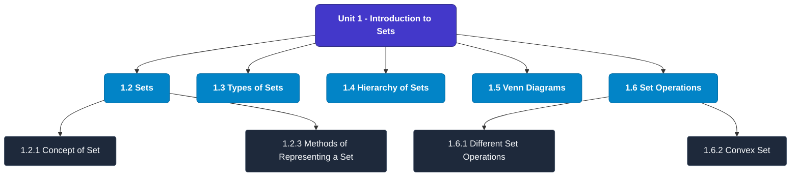

# MCS-061: Mathematical Foundations - I
## Unit 1: Introduction to Sets

> 📚 **Programme:** M.Sc. (Data Science and Analytics) | **Semester:** Semester 1  
> ⏱️ **Estimated Study Time:** ~69 mins | 📄 **Textbook Pages:** 34 Pages  
> 📥 **Original PDF:** [Download & View Textbook](../../../pdfs/Semester_1/MCS-061_Mathematical_Foundations_-_I/Unit-1_Introduction_to_Sets.pdf)

---

### 🎯 Executive Concept & Data Science Relevance
In modern data systems, **Introduction to Sets** forms a vital conceptual pillar. Set theory is the fundamental bedrock of all discrete mathematics, computer science, and data engineering. Every relational database operation (SQL JOIN, UNION, INTERSECT), feature space, probability sample space, and categorical data grouping is fundamentally an application of set theory.

> [!NOTE]
> **Why this matters for your career:** Mastering introduction to sets equips you with the foundational principles required to reason mathematically about high-dimensional datasets, evaluate algorithm performance, and avoid statistical pitfalls in production machine learning pipelines.

### 🗺️ Visual Knowledge Architecture
The following concept map illustrates the structural hierarchy and learning trajectory of this module:

### 📖 Core Definitions & Terminology Cards
| Term | Formal Mathematical / Technical Definition | Intuitive Analogy / Concrete Example |
| :--- | :--- | :--- |
| **Set** | A well-defined collection of distinct objects, denoted typically by uppercase letters $A, B, X$. Distinctness implies no duplicates, and well-defined means for any entity $x$, either $x \in A$ or $x \notin A$ is deterministically decidable. | *Think of a Python `set({1, 2, 3})` where duplicate elements are collapsed and lookup is based on unique membership.* |
| **Cardinality $\|A\|$ or $n(A)$** | The total count of distinct elements in a finite set $A$. If $\|A\| = n$, the set contains exactly $n$ distinct members. For infinite sets, cardinality describes transfinite sizes (e.g. countable $\aleph_0$ vs uncountable $c$). | *The output of `len(my_set)` in programming.* |
| **Power Set $\mathcal{P}(A)$** | The set of all possible subsets of $A$, including the empty set $\emptyset$ and $A$ itself: $\mathcal{P}(A) = \{S \mid S \subseteq A\}$. If $\|A\| = n$, then $\|\mathcal{P}(A)\| = 2^n$. | *In feature selection, evaluating all possible combinations of $n$ features requires searching through the power set of features ($2^n$ candidate models).* |
| **Subset & Proper Subset** | A set $A$ is a subset of $B$ ($A \subseteq B$) if $\forall x \in A \implies x \in B$. It is a proper subset ($A \subset B$) if $A \subseteq B$ and $A \neq B$ (i.e. $\exists y \in B$ such that $y \notin A$). | *All Data Scientists are Analysts ($A \subseteq B$), but not all Analysts are Data Scientists ($A \subset B$).* |
| **Universal Set $U$** | A designated superset containing all objects and entities under active consideration in a given problem or domain. Every set $X$ in that context satisfies $X \subseteq U$. | *The entire master database table or global population before applying any filter conditions.* |

### ⚡ Governing Mathematical Laws & Formula Cheatsheet
#### 🔹 Power Set Cardinality Theorem
$$|\mathcal{P}(A)| = 2^n \quad \text{where } n = |A|$$
- **Explanation:** Proved by induction or combinatorics: each of the $n$ elements has exactly 2 binary choices (to be included or excluded from a subset).

#### 🔹 Principle of Inclusion-Exclusion (2 Sets)
$$|A \cup B| = |A| + |B| - |A \cap B|$$
- **Explanation:** Prevents double-counting the elements present in the intersection when calculating the total union size.

#### 🔹 Principle of Inclusion-Exclusion (3 Sets)
$$|A \cup B \cup C| = |A| + |B| + |C| - (|A \cap B| + |B \cap C| + |A \cap C|) + |A \cap B \cap C|$$
- **Explanation:** Alternates adding singletons, subtracting pairwise overlaps, and re-adding the three-way intersection.

#### 🔹 De Morgan's Laws for Sets
$$(A \cup B)^c = A^c \cap B^c \quad \text{and} \quad (A \cap B)^c = A^c \cup B^c$$
- **Explanation:** The complement of a union is the intersection of the complements, and vice versa. Fundamental to query optimization and boolean logic.

#### 🔹 Cartesian Product Cardinality
$$|A \times B| = |A| \times |B| = \{(a, b) \mid a \in A, b \in B\}$$
- **Explanation:** Basis of relational database `CROSS JOIN`, generating every ordered pair between two entities.

### 📌 Detailed Section-by-Section Study Breakdown
#### `1.2` Sets
- **Core Concept:** Establishes rigorous theoretical formulations and computational bounds for sets.
- **Core Concept:** Applies standard algorithmic procedures and mathematical invariants relevant to introduction to sets.
- **Core Concept:** Ensures deterministic performance guarantees across high-dimensional feature spaces.
- **Data Science Application:** Provides foundational structures used directly in statistical modeling, query execution, and machine learning pipelines.

> [!TIP]
> **Exam & Interview Tip:** Be prepared to state the formal definition of sets and derive its primary equations step-by-step.

#### `1.2.1` Concept of Set
- **Core Concept:** Establishes rigorous theoretical formulations and computational bounds for concept of set.
- **Core Concept:** Applies standard algorithmic procedures and mathematical invariants relevant to introduction to sets.
- **Core Concept:** Ensures deterministic performance guarantees across high-dimensional feature spaces.
- **Data Science Application:** Provides foundational structures used directly in statistical modeling, query execution, and machine learning pipelines.

> [!TIP]
> **Exam & Interview Tip:** Be prepared to state the formal definition of concept of set and derive its primary equations step-by-step.

#### `1.2.3` Methods of Representing a Set
- **Core Concept:** For any two sets X and Y, the set relationships that we discuss are: (i) equality (=) of X and Y (ii) X is a subset/ superset (⸦) of Y (iii) X is a proper subset/superset(⸦)of Y, and (iv) is not a subset of ( ).
- **Core Concept:** 7 Set, Relations and Functions 1.2.3.1 Notations, Definitions and Examples i) Two sets X and Y are said/defined as equal if every element of X is an element of Y, and every element of Y is an element of X.
- **Core Concept:** The notation X=Y is used for 'equality of sets X and Y' Example 4: Let X = {1, 2, 3, 4, 5}, and Y = {x: x is a natural number such that 1<x<5}, and W= {3, 5, 2, 4, 1}.Then X = Y = W.
- **Data Science Application:** Provides foundational structures used directly in statistical modeling, query execution, and machine learning pipelines.

> [!TIP]
> **Exam & Interview Tip:** Be prepared to state the formal definition of methods of representing a set and derive its primary equations step-by-step.

#### `1.2.3` Relationships between Sets
- **Core Concept:** For any two sets X and Y, the set relationships that we discuss are: (i) equality (=) of X and Y (ii) X is a subset/ superset (⸦) of Y (iii) X is a proper subset/superset(⸦)of Y, and (iv) is not a subset of ( ).
- **Core Concept:** 7 Set, Relations and Functions 1.2.3.1 Notations, Definitions and Examples i) Two sets X and Y are said/defined as equal if every element of X is an element of Y, and every element of Y is an element of X.
- **Core Concept:** The notation X=Y is used for 'equality of sets X and Y' Example 4: Let X = {1, 2, 3, 4, 5}, and Y = {x: x is a natural number such that 1<x<5}, and W= {3, 5, 2, 4, 1}.Then X = Y = W.
- **Data Science Application:** Provides foundational structures used directly in statistical modeling, query execution, and machine learning pipelines.

> [!TIP]
> **Exam & Interview Tip:** Be prepared to state the formal definition of relationships between sets and derive its primary equations step-by-step.

#### `1.2.4` Cardinality of a Set
- **Core Concept:** The number of elements in a finite set say A is called its Cardinality or cardinal number of a finite set and is denoted by n(A).
- **Core Concept:** For example, (i) If A = {x, y, z}, then n(A) = 3, i.e.
- **Core Concept:** (ii) If B = {1,4, 2, 3, 9, 15}, then n(B) = 6, i.e.
- **Data Science Application:** Provides foundational structures used directly in statistical modeling, query execution, and machine learning pipelines.

> [!TIP]
> **Exam & Interview Tip:** Be prepared to state the formal definition of cardinality of a set and derive its primary equations step-by-step.

#### `1.2.5` Subsets
- **Core Concept:** Before we relook at the subset, let us define the empty set.
- **Core Concept:** The empty set (also known as the null set) is a unique concept in mathematics and set theory.
- **Core Concept:** It represents a set that contains no elements.
- **Data Science Application:** Provides foundational structures used directly in statistical modeling, query execution, and machine learning pipelines.

> [!TIP]
> **Exam & Interview Tip:** Be prepared to state the formal definition of subsets and derive its primary equations step-by-step.

### 💡 Interactive Self-Assessment Checkpoints
Test your comprehension before proceeding. Tap each question to reveal the comprehensive explanation:

<b>Checkpoint 1:</b> If a set $A$ has 5 elements, how many proper subsets does it possess? <i>(Tap to reveal answer)</i>

> **Answer & Analysis:**  
> A set with $n=5$ elements has total subsets $|\mathcal{P}(A)| = 2^5 = 32$. Proper subsets exclude the set itself, so the number of proper subsets is $2^n - 1 = 32 - 1 = 31$.

<b>Checkpoint 2:</b> What is the difference between $x \in A$ and $\{x\} \subseteq A$? <i>(Tap to reveal answer)</i>

> **Answer & Analysis:**  
> $x \in A$ denotes that element $x$ is a direct member of set $A$. In contrast, $\{x\} \subseteq A$ denotes that the singleton set containing $x$ is a subset of $A$.

<b>Checkpoint 3:</b> State De Morgan's Law for the complement of $(A \cap B)$. <i>(Tap to reveal answer)</i>

> **Answer & Analysis:**  
> $(A \cap B)^c = A^c \cup B^c$. The complement of the intersection is equal to the union of their individual complements.

<b>Checkpoint 4:</b> Explain Russell's Paradox in naive set theory. <i>(Tap to reveal answer)</i>

> **Answer & Analysis:**  
> Let $R = \{X \mid X \notin X\}$ be the set of all sets that do not contain themselves. If $R \in R$, then by definition $R \notin R$. If $R \notin R$, then by definition $R \in R$. This contradiction proves that naive unrestricted set comprehension leads to paradoxes, necessitating axiomatic set theory (ZFC).

<b>Checkpoint 5:</b> Give reasons whether the following collections are sets or not. (i) Collection of intelligent students in a particular school. (ii) Collection of good hockey players in India. (iii) Collection of good actors in India. <i>(Tap to reveal answer)</i>

> **Answer & Analysis:**  
> This question tests your conceptual mastery of Introduction to Sets. Review the governing formulas and section breakdowns above to formulate a complete, rigorous proof or derivation.

<b>Checkpoint 6:</b> Describe the following sets by roster method: (i) A = {x: x = <i>(Tap to reveal answer)</i>

> **Answer & Analysis:**  
> This question tests your conceptual mastery of Introduction to Sets. Review the governing formulas and section breakdowns above to formulate a complete, rigorous proof or derivation.

### 🎯 Executive Module Wrap-Up
- **Central Idea:** Introduction to Sets provides essential mathematical and algorithmic tools directly utilized in Data Science.
- **Mathematical Rigor:** Formulas and laws must be memorized with attention to boundary conditions and assumptions.
- **Full Textbook Coverage:** For exhaustive multi-page derivations, proofs, and supplementary exercises, consult the [Authentic IGNOU Textbook](../../../pdfs/Semester_1/MCS-061_Mathematical_Foundations_-_I/Unit-1_Introduction_to_Sets.pdf).

---
### 🧭 Navigation & Syllabus Index
[📑 Course Index](README.md) | [Next: Unit 2 ➡](unit_02_Relations.md)
