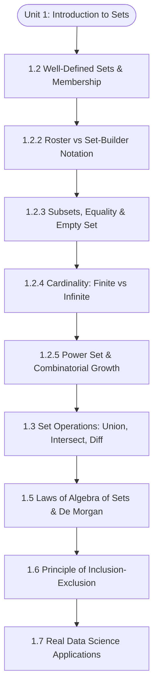

# MCS-061: Mathematical Foundations - I
## Unit 1: Introduction to Sets

> 📚 **Programme:** M.Sc. (Data Science and Analytics) | **Semester:** Semester I  
> ⏱️ **Estimated Study Time:** ~65 mins | 📄 **Textbook Pages:** 42 Pages  
> 📥 **Original PDF:** [Download & View Authentic Textbook](../../../pdfs/Semester_1/MCS-061_Mathematical_Foundations_-_I/Unit-1_Introduction_to_Sets.pdf)

---

### 🎯 Executive Concept & Data Science Relevance

In modern data science and computer engineering, **Set Theory** is not merely an abstract branch of pure mathematics—it is the foundational architecture upon which relational databases, query optimization, probability theory, feature engineering, and discrete algorithms are built.

When you execute a SQL query like:
```sql
SELECT user_id FROM signups WHERE signup_date >= '2026-01-01'
INTERSECT
SELECT user_id FROM transactions WHERE status = 'completed';
```
the database engine is directly executing the mathematical set intersection $A \cap B$ over distinct subsets of a universal user population $U$. In feature engineering, searching for the optimal subset of $k$ predictor variables out of $p$ candidate features requires traversing the combinatorial structure of the **Power Set** $\mathcal{P}(X)$ of cardinality $2^p$. In natural language processing (NLP), calculating the **Jaccard Similarity** between two document vocabulary sets is computed directly as the ratio of their intersection to their union:


$$
J(A, B) = \frac{|A \cap B|}{|A \cup B|}
$$


> [!NOTE]
> **Why this matters for your career:** Without set theory, data systems cannot guarantee query determinism, unique entity resolution, or mathematical consistency in probability sample spaces. Understanding set axioms, membership decidability, and algebraic identities gives you the mathematical maturity to reason about high-dimensional feature spaces, indexing invariants, and algorithmic efficiency.

---

### 🗺️ Visual Knowledge Architecture

The following learning trajectory outlines the structural progression of concepts in this module:



---

### 📖 Core Definitions & Terminology Cards

> 📌 **Set**  
> - **Formal Definition:** A well-defined collection of distinct objects. A collection is *well-defined* if and only if for any given entity $x$ and candidate set $A$, it is deterministically decidable whether $x \in A$ (membership) or $x \notin A$ (non-membership). Distinctness mandates that duplicates are collapsed: $\{1, 1, 2\} = \{1, 2\}$.  
> - 💡 **Practical Intuition & Analogy:** A Python `set` or SQL `DISTINCT` table where duplicates are automatically collapsed and membership lookup operates in $O(1)$ average time.

> 📌 **Empty Set ($\emptyset$ or $\{\}$)**  
> - **Formal Definition:** The unique set containing zero elements, denoted $\emptyset = \{x \mid x \neq x\}$. The empty set has cardinality $|\emptyset| = 0$. By vacuous truth, $\emptyset$ is a subset of every set $A$: $\forall A, \emptyset \subseteq A$.  
> - 💡 **Practical Intuition & Analogy:** An empty query result set (`SELECT * FROM users WHERE 1=0`) returning zero rows.

> 📌 **Cardinality ($|A|$ or $n(A)$)**  
> - **Formal Definition:** The total number of distinct elements in a set $A$. For finite sets, $|A| \in \mathbb{N} \cup \{0\}$. For infinite sets, cardinality distinguishes between *countably infinite* sets (like $\mathbb{N}, \mathbb{Z}, \mathbb{Q}$ with cardinality $\aleph_0$) and *uncountably infinite* sets (like $\mathbb{R}, [0, 1]$ with cardinality $\mathfrak{c} = 2^{\aleph_0}$).  
> - 💡 **Practical Intuition & Analogy:** The output of `len(my_set)` or `SELECT COUNT(DISTINCT column_name)`.

> 📌 **Subset ($\subseteq$) vs Proper Subset ($\subset$)**  
> - **Formal Definition:** $A \subseteq B \iff (\forall x \in A \implies x \in B)$. If $A \subseteq B$ and $A \neq B$ (meaning $\exists y \in B$ such that $y \notin A$), then $A$ is a *proper subset*, denoted $A \subset B$.  
> - 💡 **Practical Intuition & Analogy:** All Data Scientists are Tech Workers ($A \subseteq B$), but Tech Workers also include Software Engineers, DevOps, and Designers, making Data Scientists a proper subset ($A \subset B$).

> 📌 **Power Set ($\mathcal{P}(A)$ or $2^A$)**  
> - **Formal Definition:** The set of all subsets of $A$: $\mathcal{P}(A) = \{S \mid S \subseteq A\}$. If $|A| = n$, then $|\mathcal{P}(A)| = 2^n$. By Cantor's Theorem, for any set $A$ (finite or infinite), $|A| < |\mathcal{P}(A)|$.  
> - 💡 **Practical Intuition & Analogy:** The combinatorial model space in exhaustive feature selection: evaluating every possible combination of $n$ features requires searching through all $2^n$ subsets in the power set.

> 📌 **Universal Set ($U$) & Complement ($A^c$ or $A'$)**  
> - **Formal Definition:** A designated superset $U$ containing all entities under current consideration. The complement of $A$ relative to $U$ is $A^c = \{x \in U \mid x \notin A\} = U \setminus A$.  
> - 💡 **Practical Intuition & Analogy:** In database analysis, $U$ is the complete master customer database, and $A^c$ represents all churned customers who did not make a purchase this month (`WHERE NOT IN`).

---

### ⚡ Governing Mathematical Laws & Formula Cheatsheet

#### 🔹 Power Set Cardinality Theorem

$$
|\mathcal{P}(A)| = 2^n \quad \text{where } n = |A|
$$

- **Rigorous Proof:** Let $A = \{a_1, a_2, \dots, a_n\}$. To construct any subset $S \subseteq A$, we make an independent binary decision for each element $a_i$: either $a_i \in S$ (include) or $a_i \notin S$ (exclude). By the Fundamental Counting Principle of combinatorics, there are $2 \times 2 \times \cdots \times 2 = 2^n$ distinct subsets.
- **Alternative Characteristic Vector Proof:** Every subset $S$ corresponds uniquely to a binary bitstring $(b_1, b_2, \dots, b_n) \in \{0, 1\}^n$, where $b_i = 1 \iff a_i \in S$. The number of binary strings of length $n$ is exactly $2^n$.

#### 🔹 Principle of Inclusion-Exclusion (2 Sets)

$$
|A \cup B| = |A| + |B| - |A \cap B|
$$

- **Mathematical Explanation:** Summing $|A| + |B|$ counts the elements in their mutual intersection $A \cap B$ twice. Subtracting $|A \cap B|$ restores exact single-count parity.

#### 🔹 Principle of Inclusion-Exclusion (3 Sets)
$$
\begin{aligned}
|A \cup B \cup C| = & \;|A| + |B| + |C| \\
& - (|A \cap B| + |B \cap C| + |A \cap C|) \\
& + |A \cap B \cap C|
\end{aligned}
$$
- **Mathematical Explanation:** Alternates adding singletons, subtracting pairwise overlaps, and re-adding the central triple intersection (which was added 3 times in singletons, then subtracted 3 times in pairs, leaving a net count of 0 until restored).

#### 🔹 De Morgan's Laws for Sets

$$
(A \cup B)^c = A^c \cap B^c \quad \text{and} \quad (A \cap B)^c = A^c \cup B^c
$$

- **Mathematical Explanation:** The complement of a union is the intersection of individual complements, and the complement of an intersection is the union of individual complements. Fundamental to boolean query optimization in database query planners (pushing NOT predicates through AND/OR trees).

#### 🔹 Cartesian Product Cardinality

$$
|A \times B| = |A| \times |B| = \{(a, b) \mid a \in A, b \in B\}
$$

- **Mathematical Explanation:** The set of all ordered pairs where the first coordinate is from $A$ and the second is from $B$. Serves as the mathematical definition of a SQL `CROSS JOIN`.

---

### ⚖️ Axiomatic Properties & Governing Laws

The algebra of sets $(\mathcal{P}(U), \cup, \cap, \cdot^c)$ forms a **Boolean Algebra** satisfying the following fundamental axiomatic laws:

- **Idempotent Laws:** $A \cup A = A \quad \text{and} \quad A \cap A = A$
- **Identity Laws:** $A \cup \emptyset = A \quad \text{and} \quad A \cap U = A$
- **Domination Laws:** $A \cup U = U \quad \text{and} \quad A \cap \emptyset = \emptyset$
- **Commutative Laws:** $A \cup B = B \cup A \quad \text{and} \quad A \cap B = B \cap A$
- **Associative Laws:** $(A \cup B) \cup C = A \cup (B \cup C) \quad \text{and} \quad (A \cap B) \cap C = A \cap (B \cap C)$
- **Distributive Laws:**  
  
$$
A \cap (B \cup C) = (A \cap B) \cup (A \cap C) \quad \text{and} \quad A \cup (B \cap C) = (A \cup B) \cap (A \cup C)
$$

- **Complement Laws:** $A \cup A^c = U, \quad A \cap A^c = \emptyset, \quad (A^c)^c = A$
- **Absorption Laws:** $A \cup (A \cap B) = A \quad \text{and} \quad A \cap (A \cup B) = A$
- **De Morgan's Laws:** $(A \cup B)^c = A^c \cap B^c \quad \text{and} \quad (A \cap B)^c = A^c \cup B^c$

---

### 📌 Comprehensive Section-by-Section Study Breakdown

#### `1.2` Concept of Set and Methods of Representation

##### 📘 Theoretical Principles & In-Depth Exposition
A set is defined as a well-defined collection of distinct entities. The word **"well-defined"** is mathematically critical: given an arbitrary candidate element $x$ and candidate set $A$, there must exist an unambiguous, objective rule that deterministically evaluates whether $x \in A$ is True or False. Subjective descriptions—such as "the collection of intelligent students", "the collection of handsome actors", or "the collection of high-earning professionals"—do **not** form sets because the membership criteria depend on individual opinion.

Sets are represented primarily via two formal methods:
1. **Roster / Listing Method (Tabular Form):** Every element is explicitly enumerated within curly braces, separated by commas.
   - Example: $V = \{a, e, i, o, u\}$ (vowels).
   - Example: $E = \{2, 4, 6, 8, \dots\}$ (positive even integers).
   - Order does not matter: $\{1, 2, 3\} = \{3, 1, 2\}$.
   - Repetition is collapsed: $\{a, a, b\} = \{a, b\}$.
2. **Set-Builder Method (Rule / Property Form):** Elements are described by an explicit mathematical predicate condition:
   
$$
S = \{x \in U \mid P(x)\}
$$

   read as: *"the set of all $x$ in universal set $U$ such that property $P(x)$ is satisfied."*
   - Example: $S = \{x \in \mathbb{R} \mid x^2 - 5x + 6 = 0\} = \{2, 3\}$.
   - Example: $P = \{p \in \mathbb{N} \mid p > 1 \land (\forall d \in \mathbb{N}, d \mid p \implies d = 1 \lor d = p)\}$ (the set of prime numbers).

##### ⚙️ Mathematical & Algorithmic Mechanics
- **Membership vs Subset Invariant:** $x \in A$ indicates element membership, whereas $\{x\} \subseteq A$ indicates subset inclusion. Confusing $x \in A$ with $\{x\} \in A$ is the most frequent conceptual mistake in discrete mathematics.
- **Russell's Paradox & Axiomatic Foundation:** In naive set theory, allowing unrestricted set comprehension $\{x \mid P(x)\}$ leads to fatal contradictions. Consider the set of all sets that do not contain themselves: $R = \{X \mid X \notin X\}$. If $R \in R$, then by definition $R \notin R$. If $R \notin R$, then by definition $R \in R$. This paradox proved that naive collections are invalid, forcing modern mathematics to adopt the Zermelo-Fraenkel axiomatic system (ZFC), where sets can only be formed as subsets of pre-existing sets.

##### 📊 Practical Data Science & Production Relevance
- **Data Engineering:** In Pandas and PySpark, distinct categorical values in a column are retrieved using `.unique()`, which constructs a hash set under the hood to deduplicate millions of records in $O(N)$ linear time.
- **Graph Databases:** In social network algorithms, checking whether user $u$ is a mutual friend of user $v$ involves an $O(1)$ set membership query: `u in friend_set[v]`.

> [!TIP]
> **Key Exam & Technical Interview Takeaway:** In exams, you are frequently asked to convert between Roster form and Set-Builder form, and to determine whether a collection is well-defined. Always verify if the predicate has an unambiguous truth evaluation for every element.

---

#### `1.2.3` Set Relationships: Equality, Subsets, and Supersets

##### 📘 Theoretical Principles & In-Depth Exposition
Two sets $A$ and $B$ are **equal** ($A = B$) if and only if they contain precisely the same elements:

$$
A = B \iff (\forall x, x \in A \iff x \in B)
$$

In formal proofs, demonstrating that $A = B$ always requires a **two-way mutual subset proof**:
1. Prove $A \subseteq B$ (assume $x \in A$, derive $x \in B$).
2. Prove $B \subseteq A$ (assume $y \in B$, derive $y \in A$).

**The Empty Set Paradox:** Students often wonder why the empty set $\emptyset$ is considered a subset of every set $A$ ($\emptyset \subseteq A$). The proof relies on **Vacuous Truth** in formal logic:
- The definition of subset is: $\emptyset \subseteq A \iff (\forall x, x \in \emptyset \implies x \in A)$.
- Since the empty set contains no elements, the premise $x \in \emptyset$ is identically **False** for all $x$.
- In classical logic, a conditional statement with a false premise $(\text{False} \implies Q)$ is always identically **True**, regardless of whether $Q$ is True or False.
- Therefore, $\emptyset \subseteq A$ is unconditionally true for every possible set $A$.

##### ⚙️ Mathematical & Algorithmic Mechanics
- **Proper Subsets:** $A \subset B \iff A \subseteq B \land A \neq B$. If $|B| = n$, the total number of proper subsets is $2^n - 1$ (excluding $B$ itself).
- **Reflexivity, Antisymmetry, Transitivity:** The subset relation $\subseteq$ defines a **Partial Order (Poset)** on the power set $\mathcal{P}(U)$:
  - Reflexive: $A \subseteq A$
  - Antisymmetric: $(A \subseteq B \land B \subseteq A) \implies A = B$
  - Transitive: $(A \subseteq B \land B \subseteq C) \implies A \subseteq C$

##### 📊 Practical Data Science & Production Relevance
- **Authorization & Role-Based Access Control (RBAC):** In security systems, permissions are modeled as sets. If a user's permission set $P_{\text{user}}$ is a superset of the required action permissions $P_{\text{action}}$ ($P_{\text{action}} \subseteq P_{\text{user}}$), access is granted.
- **Data Validation Testing:** In ETL pipelines, verifying that all categorical values in a production batch belong to the allowable lookup domain is executed as `assert set(df['status']).issubset(ALLOWED_STATUSES)`.

---

#### `1.2.4` Cardinality and Transfinite Numbers

##### 📘 Theoretical Principles & In-Depth Exposition
Cardinality measures the size of a set. For finite sets, cardinality is simply the natural number representing its element count: $|A| = n$. However, in advanced mathematics and computer science, infinite sets exhibit profoundly different cardinalities:
1. **Countably Infinite Sets ($\aleph_0$, Aleph-Null):** A set $A$ is countably infinite if there exists a bijection (one-to-one correspondence) between $A$ and the natural numbers $\mathbb{N}$:
   
$$
| \mathbb{N} | = | \mathbb{Z} | = | \mathbb{Q} | = \aleph_0
$$

   Remarkably, the set of all integers $\mathbb{Z}$ and the set of all rational numbers $\mathbb{Q}$ have the exact same cardinality as $\mathbb{N}$, even though $\mathbb{N} \subset \mathbb{Z} \subset \mathbb{Q}$!
2. **Uncountably Infinite Sets ($\mathfrak{c} = 2^{\aleph_0}$, Continuum):** Georg Cantor proved via his famous **Diagonal Argument** that the real numbers $\mathbb{R}$ and the interval $[0, 1]$ cannot be put into one-to-one correspondence with $\mathbb{N}$. Therefore, the continuum of real numbers represents a strictly higher infinity:
   
$$
|\mathbb{R}| = \mathfrak{c} > \aleph_0
$$


##### ⚙️ Mathematical & Algorithmic Mechanics
- **Cantor's Theorem:** For any set $A$, $|A| < |\mathcal{P}(A)|$. There is no surjective function from $A$ onto its power set $\mathcal{P}(A)$. This establishes that there is an infinite hierarchy of infinities: $\aleph_0 < 2^{\aleph_0} < 2^{2^{\aleph_0}} < \dots$.
- **Turing Computability Limit:** In computer science, the set of all possible computer programs (written in Python, C, etc.) is countably infinite ($\aleph_0$), but the set of all mathematical decision problems is uncountably infinite ($2^{\aleph_0}$). Because $\aleph_0 < 2^{\aleph_0}$, it is mathematically impossible to write programs for the vast majority of problems—proving that uncomputable problems (like the Halting Problem) must exist!

##### 📊 Practical Data Science & Production Relevance
- **Cardinality Estimation in Big Data:** When analyzing streaming logs with billions of requests (e.g. unique visitors on Google or Amazon), storing exact sets in memory requires gigabytes of RAM. Data engineers use probabilistic cardinality estimation algorithms like **HyperLogLog (HLL)**, which estimate $|A|$ within 1% error using only 1.5 KB of memory.

---

#### `1.3` Fundamental Set Operations: Union, Intersection, Difference & Symmetric Difference

##### 📘 Theoretical Principles & In-Depth Exposition
Given sets $A$ and $B$ in universal set $U$, the fundamental operations are defined as:
1. **Union ($A \cup B$):** The set containing all elements belonging to $A$, $B$, or both:
   
$$
A \cup B = \{x \in U \mid x \in A \lor x \in B\}
$$

2. **Intersection ($A \cap B$):** The set containing only elements belonging to both $A$ and $B$:
   
$$
A \cap B = \{x \in U \mid x \in A \land x \in B\}
$$

   If $A \cap B = \emptyset$, sets $A$ and $B$ are said to be **disjoint** (mutually exclusive).
3. **Set Difference / Relative Complement ($A \setminus B$ or $A - B$):** Elements that belong to $A$ but do not belong to $B$:
   
$$
A \setminus B = \{x \in U \mid x \in A \land x \notin B\} = A \cap B^c
$$

4. **Symmetric Difference ($A \Delta B$ or $A \oplus B$):** Elements that belong to either $A$ or $B$, but NOT both (the mathematical XOR operation):
   
$$
A \Delta B = (A \setminus B) \cup (B \setminus A) = (A \cup B) \setminus (A \cap B)
$$

5. **Cartesian Product ($A \times B$):** The set of all ordered pairs:
   
$$
A \times B = \{(a, b) \mid a \in A, b \in B\}
$$

   Note that $A \times B \neq B \times A$ unless $A = B$ or one of the sets is empty.

##### ⚙️ Mathematical & Algorithmic Mechanics
- **Bitwise Representation:** On 64-bit CPU architectures, sets over finite universes can be represented as binary bitmasks (unsigned integers). Set operations execute in single CPU instruction cycles:
  - Union = Bitwise OR (`|`)
  - Intersection = Bitwise AND (`&`)
  - Difference = Bitwise AND NOT (`& ~`)
  - Symmetric Difference = Bitwise XOR (`^`)

##### 📊 Practical Data Science & Production Relevance
- **Relational Algebra & SQL Operations:**
  - $A \cup B \iff$ `UNION`
  - $A \cap B \iff$ `INTERSECT`
  - $A \setminus B \iff$ `EXCEPT` / `MINUS`
  - $A \times B \iff$ `CROSS JOIN`
- **Recommender Systems:** In collaborative filtering, measuring how similar customer $A$'s purchase history is to customer $B$'s purchase history uses the **Dice Coefficient**:
  
$$
\text{Dice}(A, B) = \frac{2|A \cap B|}{|A| + |B|}
$$


---

### 📐 Step-by-Step Solved Mathematical Examples

#### 🧮 Example 1: Three-Set Survey Analysis via Inclusion-Exclusion
> **Problem Statement:**  
> A university analytics department surveyed 120 Data Science master's students regarding the programming languages they use in coursework:
> - 65 students use Python ($P$)
> - 50 students use SQL ($S$)
> - 40 students use R ($R$)
> - 25 students use both Python and SQL ($P \cap S$)
> - 20 students use both Python and R ($P \cap R$)
> - 15 students use both SQL and R ($S \cap R$)
> - 8 students use all three technologies ($P \cap S \cap R$)
> 
> Calculate:
> 1. How many students use at least one of the three languages?
> 2. How many students use none of the three languages?
> 3. How many students use Python exclusively?

**Detailed Step-by-Step Solution:**

1. **Calculate students using at least one language ($|P \cup S \cup R|$):**  
   Applying the Principle of Inclusion-Exclusion for 3 sets:
$$
   \begin{aligned}
   |P \cup S \cup R| & = |P| + |S| + |R| - (|P \cap S| + |P \cap R| + |S \cap R|) + |P \cap S \cap R| \\
   & = 65 + 50 + 40 - (25 + 20 + 15) + 8 \\
   & = 155 - 60 + 8 \\
   & = 103 \text{ students.}
   \end{aligned}
$$

2. **Calculate students who use none of the three languages ($|(P \cup S \cup R)^c|$):**  
   Subtract the union size from the total surveyed universe ($|U| = 120$):
   
$$
|(P \cup S \cup R)^c| = |U| - |P \cup S \cup R| = 120 - 103 = 17 \text{ students.}
$$


3. **Calculate students who use Python exclusively:**  
   Students using only Python are given by:
$$
   \begin{aligned}
   |P \setminus (S \cup R)| & = |P| - |P \cap S| - |P \cap R| + |P \cap S \cap R| \\
   & = 65 - 25 - 20 + 8 \\
   & = 28 \text{ students.}
   \end{aligned}
$$

---

#### 🧮 Example 2: Formal Set-Theoretic Proof of De Morgan's Law
> **Problem Statement:**  
> Let $A$ and $B$ be arbitrary subsets of universal set $U$. Prove rigorously from first principles that:
$$
(A \cup B)^c = A^c \cap B^c
$$

**Detailed Step-by-Step Solution:**

To prove equality of two sets $X = Y$, we must prove mutual inclusion: (i) $X \subseteq Y$, and (ii) $Y \subseteq X$.

**Part 1: Prove $(A \cup B)^c \subseteq A^c \cap B^c$**
1. Let $x$ be an arbitrary element such that $x \in (A \cup B)^c$.
2. By the definition of set complement, $x \notin (A \cup B)$.
3. By the logical negation of union, saying $x$ is not in $(A \cup B)$ means $x$ is neither in $A$ nor in $B$:
   
$$
\neg(x \in A \lor x \in B) \iff (x \notin A \land x \notin B)
$$

4. Since $x \notin A$, by definition $x \in A^c$.
5. Since $x \notin B$, by definition $x \in B^c$.
6. Since both hold simultaneously, $x \in (A^c \cap B^c)$.
7. Because every element of $(A \cup B)^c$ is in $(A^c \cap B^c)$, we conclude:
   
$$
(A \cup B)^c \subseteq A^c \cap B^c
$$


**Part 2: Prove $A^c \cap B^c \subseteq (A \cup B)^c$**
1. Let $y$ be an arbitrary element such that $y \in (A^c \cap B^c)$.
2. By the definition of intersection, $y \in A^c$ and $y \in B^c$.
3. By the definition of complement, $y \notin A$ and $y \notin B$.
4. By logical equivalence of De Morgan's propositional laws, $(y \notin A \land y \notin B) \iff \neg(y \in A \lor y \in B)$.
5. This means $y \notin (A \cup B)$.
6. Therefore, $y \in (A \cup B)^c$.
7. Because every element of $A^c \cap B^c$ is in $(A \cup B)^c$, we conclude:
   
$$
A^c \cap B^c \subseteq (A \cup B)^c
$$


**Conclusion:**  
Since $(A \cup B)^c \subseteq A^c \cap B^c$ and $A^c \cap B^c \subseteq (A \cup B)^c$, by the definition of set equality:

$$
(A \cup B)^c = A^c \cap B^c \quad \blacksquare
$$


---

### 💻 Practical Data Science Implementation (Python)

Below is a self-contained, documented Python script demonstrating production set operations, bitmask optimization, Jaccard similarity, and powerset generation:

```python
"""
mscdsa_set_theory.py
Practical demonstration of set theory operations in Data Science.
"""

from typing import List, Set, Any
from itertools import chain, combinations


def jaccard_similarity(set_a: Set[Any], set_b: Set[Any]) -> float:
    """
    Computes the Jaccard Similarity Index between two sample sets:
    J(A, B) = |A ∩ B| / |A ∪ B|
    """
    intersection_size = len(set_a & set_b)
    union_size = len(set_a | set_b)
    if union_size == 0:
        return 1.0  # Both are empty sets
    return intersection_size / union_size


def powerset(iterable) -> List[tuple]:
    """
    Generates the Power Set P(A) of an input collection:
    powerset([1,2,3]) --> (), (1,), (2,), (3,), (1,2), (1,3), (2,3), (1,2,3)
    """
    s = list(iterable)
    return list(chain.from_iterable(combinations(s, r) for r in range(len(s) + 1)))


def bitmask_subset_check(subset_mask: int, parent_mask: int) -> bool:
    """
    Checks if set A is a subset of B using binary bitwise operations in O(1) CPU time.
    A ⊆ B <=> (A & B) == A
    """
    return (subset_mask & parent_mask) == subset_mask


if __name__ == "__main__":
    # 1. Real-world User Segment Analysis
    python_engineers = {"Alice", "Bob", "Charlie", "David", "Eva"}
    sql_engineers = {"Charlie", "David", "Eva", "Frank", "Grace"}
    spark_engineers = {"Eva", "Frank", "Helen", "Ian"}

    # Set Operations
    full_talent_pool = python_engineers | sql_engineers | spark_engineers  # Union
    full_stack_ai = python_engineers & sql_engineers & spark_engineers     # 3-Way Intersection
    python_specialists = python_engineers - (sql_engineers | spark_engineers)  # Set Difference
    exclusive_overlap = python_engineers ^ sql_engineers                  # Symmetric Difference

    print(f"Total Unique Talent (|P ∪ S ∪ Sp|): {len(full_talent_pool)} engineers")
    print(f"Full-Stack Talent (|P ∩ S ∩ Sp|): {full_stack_ai}")
    print(f"Python Specialists (P \\ (S ∪ Sp)): {python_specialists}")
    print(f"Symmetric Difference (P Δ S): {exclusive_overlap}")

    # 2. Jaccard Similarity in NLP / Document Matching
    doc1_tokens = {"data", "science", "machine", "learning", "python", "regression"}
    doc2_tokens = {"python", "machine", "learning", "neural", "networks", "deep"}
    sim = jaccard_similarity(doc1_tokens, doc2_tokens)
    print(f"Jaccard Token Similarity: {sim:.4f}")

    # 3. Exhaustive Feature Selection (Power Set)
    features = ["age", "income", "credit_score"]
    all_feature_models = powerset(features)
    print(f"Total Candidate Feature Subsets (2^{len(features)}): {len(all_feature_models)}")
    for idx, model in enumerate(all_feature_models):
        print(f"  Model {idx}: {model if model else '∅ (Intercept Only)'}")
```

---

### 💡 Interactive Self-Assessment Checkpoints

Test your mastery with these authentic IGNOU textbook problems and conceptual challenges. Tap each card to reveal the complete step-by-step mathematical solution:

<details>
<summary><b>Checkpoint 1:</b> Give reasons whether the following collections are sets or not: (i) Collection of intelligent students in a school, (ii) Collection of good hockey players in India, (iii) Collection of good actors in India. <i>(Tap to reveal answer)</i></summary>

> **Answer & Analysis:**  
> **None of these collections form a set.**  
> - **Mathematical Reason:** By definition, a set must be a *well-defined* collection. This means given any candidate individual, there must exist an objective, deterministic rule to evaluate whether they belong to the set.  
> - Attributes like *"intelligent"*, *"good hockey player"*, and *"good actor"* are qualitative, subjective, and relative. A player or actor may be regarded as "good" by one observer but not by another. Because membership is not objectively decidable, these collections are not well-defined and therefore cannot be sets in mathematics.
</details>

<details>
<summary><b>Checkpoint 2:</b> For $X = \{1, \{2, 3\}, 3, 4\}$, evaluate the truth value of: (i) $1 \in X$, (ii) $\{2, 3\} \subseteq X$, (iii) $\{2, 3\} \in X$, (iv) $\{\{2, 3\}\} \subseteq X$. <i>(Tap to reveal answer)</i></summary>

> **Answer & Analysis:**  
> Notice that the elements of $X$ are the integer $1$, the set $\{2, 3\}$, the integer $3$, and the integer $4$.  
> - **(i) $1 \in X$ is TRUE:** $1$ is an explicit element of $X$.  
> - **(ii) $\{2, 3\} \subseteq X$ is FALSE:** For $\{2, 3\}$ to be a subset of $X$, both $2$ and $3$ must be elements of $X$. While $3 \in X$, $2 \notin X$ ($2$ exists only inside the sub-element $\{2, 3\}$).  
> - **(iii) $\{2, 3\} \in X$ is TRUE:** The set $\{2, 3\}$ is treated as a single entity and is directly listed as an element of $X$.  
> - **(iv) $\{\{2, 3\}\} \subseteq X$ is TRUE:** The singleton set containing $\{2, 3\}$ is a subset because its sole element $\{2, 3\} \in X$.
</details>

<details>
<summary><b>Checkpoint 3:</b> Give two proper subsets and two supersets of the set of vowels of the English alphabet $V = \{a, e, i, o, u\}$. <i>(Tap to reveal answer)</i></summary>

> **Answer & Analysis:**  
> - **Proper Subsets ($S \subset V$):** Any non-empty subset strictly smaller than $V$.  
>   - $S_1 = \{a, e\}$  
>   - $S_2 = \{i, o, u\}$  
> - **Supersets ($B \supset V$):** Any set strictly containing all five vowels plus additional elements.  
>   - $B_1 = \{a, b, c, d, e, i, o, u\}$  
>   - $B_2 = \text{The complete English alphabet } \{a, b, c, \dots, z\}$.
</details>

<details>
<summary><b>Checkpoint 4:</b> For which set $A$ is the power set cardinality $|\mathcal{P}(A)| = 1$? <i>(Tap to reveal answer)</i></summary>

> **Answer & Analysis:**  
> - The cardinality of the power set is governed by $|\mathcal{P}(A)| = 2^n$, where $n = |A|$.  
> - Setting $2^n = 1 \implies n = 0$.  
> - The only set with cardinality $0$ is the **Empty Set** $A = \emptyset$.  
> - Its power set contains exactly one element: $\mathcal{P}(\emptyset) = \{\emptyset\}$. Notice that $|\{\emptyset\}| = 1$ because the set contains the empty set itself.
</details>

<details>
<summary><b>Checkpoint 5:</b> If $A \subseteq B$, prove rigorously whether $\mathcal{P}(A) \subseteq \mathcal{P}(B)$. <i>(Tap to reveal answer)</i></summary>

> **Answer & Analysis:**  
> **Yes, $\mathcal{P}(A) \subseteq \mathcal{P}(B)$ always holds.**  
> - **Proof:**  
>   1. By definition, $\mathcal{P}(A) = \{X \mid X \subseteq A\}$ and $\mathcal{P}(B) = \{Y \mid Y \subseteq B\}$.  
>   2. To prove $\mathcal{P}(A) \subseteq \mathcal{P}(B)$, let $S$ be an arbitrary element of $\mathcal{P}(A)$.  
>   3. By definition of power set, $S \in \mathcal{P}(A) \implies S \subseteq A$.  
>   4. We are given that $A \subseteq B$.  
>   5. By the transitive property of set inclusion, $(S \subseteq A \land A \subseteq B) \implies S \subseteq B$.  
>   6. Since $S \subseteq B$, it follows by definition that $S \in \mathcal{P}(B)$.  
>   7. Because every element $S \in \mathcal{P}(A)$ is also an element of $\mathcal{P}(B)$, we conclude that $\mathcal{P}(A) \subseteq \mathcal{P}(B)$. $\blacksquare$
</details>

<details>
<summary><b>Checkpoint 6:</b> If set $A$ has 5 elements, how many proper subsets does it possess? <i>(Tap to reveal answer)</i></summary>

> **Answer & Analysis:**  
> - Total subsets in the power set: $|\mathcal{P}(A)| = 2^n = 2^5 = 32$.  
> - Proper subsets are defined as all subsets of $A$ *except* $A$ itself.  
> - Therefore, the number of proper subsets is:  
>   
$$
2^n - 1 = 32 - 1 = 31 \text{ proper subsets.}
$$

</details>

---

### 🎯 Executive Module Wrap-Up

- **Central Idea:** Set theory is the core mathematical framework for data organization, relational databases, discrete math, and probability.
- **Mathematical Rigor:** Distinguish strictly between element membership ($x \in A$) and subset inclusion ($\{x\} \subseteq A$). Remember that the empty set $\emptyset$ is a subset of every set, and the power set grows exponentially ($2^n$).
- **Full Textbook Coverage:** For exhaustive multi-page exercises and supplementary proofs, consult the [Authentic IGNOU Textbook](../../../pdfs/Semester_1/MCS-061_Mathematical_Foundations_-_I/Unit-1_Introduction_to_Sets.pdf).

---

### 🧭 Navigation & Syllabus Index
[📑 Course Index](README.md) | [Next: Unit 2 ➡](unit_02_Relations.md)
