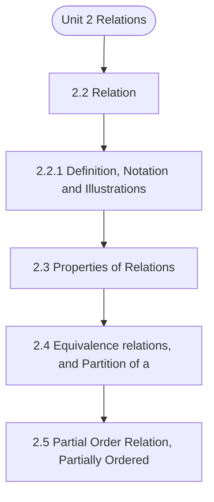

# MCS-061: Mathematical Foundations - I
## Unit 2: Relations

> 📚 **Programme:** M.Sc. (Data Science and Analytics) | **Semester:** Semester 1  
> ⏱️ **Estimated Study Time:** ~47 mins | 📄 **Textbook Pages:** 23 Pages  
> 📥 **Original PDF:** [Download & View Authentic Textbook](../../../pdfs/Semester_1/MCS-061_Mathematical_Foundations_-_I/Unit-2_Relations.pdf)

---

### 🎯 Executive Concept & Data Science Relevance
In modern data systems, **Relations** forms a vital conceptual pillar. Relations form the mathematical blueprint of Relational Database Management Systems (RDBMS). Foreign keys, functional dependencies, equivalence partitioning in clustering, and partial orderings in graph dependency pipelines all originate directly from formal relation theory.

> [!NOTE]
> **Why this matters for your career:** Mastering relations equips you with the foundational principles required to reason mathematically about high-dimensional datasets, evaluate algorithm performance, and avoid statistical pitfalls in production machine learning pipelines.

### 🗺️ Visual Knowledge Architecture
The following concept map illustrates the structural hierarchy and learning trajectory of this module:



### 📖 Core Definitions & Terminology Cards

> 📌 **Binary Relation**  
> - **Formal Definition:** A binary relation $R$ from set $A$ to set $B$ is any subset of the Cartesian product $A \times B$, i.e., $R \subseteq A \times B$. If $(a, b) \in R$, we write $aRb$.  
> - 💡 **Practical Intuition & Analogy:** *A table connecting users to purchased items in an e-commerce platform.*

> 📌 **Reflexive Relation**  
> - **Formal Definition:** A relation $R$ on set $A$ is reflexive if $\forall a \in A, (a, a) \in R$. Every element is related to itself.  
> - 💡 **Practical Intuition & Analogy:** *Equality ( $a = a$ ) and the 'is subset of' relation ( $A \subseteq A$ ) are reflexive.*

> 📌 **Symmetric Relation**  
> - **Formal Definition:** A relation $R$ on $A$ is symmetric if $\forall a, b \in A, (a, b) \in R \implies (b, a) \in R$.  
> - 💡 **Practical Intuition & Analogy:** *A mutual friendship in a social network or an undirected edge in a graph.*

> 📌 **Transitive Relation**  
> - **Formal Definition:** A relation $R$ on $A$ is transitive if $\forall a, b, c \in A, [(a, b) \in R \land (b, c) \in R] \implies (a, c) \in R$.  
> - 💡 **Practical Intuition & Analogy:** *Ancestry or inequality: If $a < b$ and $b < c$, then $a < c$.*

> 📌 **Equivalence Relation**  
> - **Formal Definition:** A relation $R$ on $A$ that is simultaneously reflexive, symmetric, and transitive. It partitions $A$ into mutually disjoint equivalence classes.  
> - 💡 **Practical Intuition & Analogy:** *Clustering data points into distinct, non-overlapping groups based on identical feature attributes.*

### ⚡ Governing Mathematical Laws & Formula Cheatsheet
#### 🔹 Total Relations on a Set
$$
\text{Total Relations on } A = 2^{\vert A\vert^2} = 2^{n^2} \quad \text{where } n = \vert A\vert
$$
- **Explanation:** Since $\vert A \times A\vert = n^2$, any relation is a subset of $A \times A$, yielding $2^{n^2}$ possible relations.

#### 🔹 Total Reflexive Relations
$$
\text{Reflexive Relations} = 2^{n(n - 1)}
$$
- **Explanation:** The $n$ diagonal pairs $(a, a)$ must all be included (1 choice each), leaving $n^2 - n = n(n-1)$ off-diagonal pairs with 2 choices each.

#### 🔹 Total Symmetric Relations
$$
\text{Symmetric Relations} = 2^{\frac{n(n + 1)}{2}}
$$
- **Explanation:** Determined entirely by choices on the diagonal ($n$) and the upper triangle ($n(n-1)/2$).

#### 🔹 Equivalence Class Definition
$$
[a] = \lbrace x \in A \mid (x, a) \in R \rbrace
$$
- **Explanation:** The collection of all elements in $A$ related to representative element $a$. The union of all equivalence classes equals $A$.

### ⚖️ Axiomatic Properties & Governing Laws
The mathematical formulations of this module are anchored by foundational algebraic and structural laws:

- **Reflexivity Condition:** $\forall a \in A \implies (a, a) \in R$
- **Symmetry Condition:** $(a, b) \in R \implies (b, a) \in R$
- **Antisymmetry Condition:** $(a, b) \in R \land (b, a) \in R \implies a = b$
- **Transitivity Condition:** $(a, b) \in R \land (b, c) \in R \implies (a, c) \in R$
- **Equivalence Partition Theorem:** Every equivalence relation on $A$ induces a unique partition into pairwise disjoint equivalence classes.

### 📌 Comprehensive Section-by-Section Study Breakdown
#### `2.2` Relation
##### 📘 Theoretical Principles & In-Depth Exposition
RELATION The concept of 'relation' is one of the few fundamental concepts of mathematics. We begin the discussion with its formal/ mathematical definition and illustrations through some well-known examples.

##### ⚙️ Mathematical & Algorithmic Mechanics
- **Formal Mechanics:** Establishes symbolic transformations and state invariants governing relation.
- **Boundary Invariants:** Ensures robust error-handling, non-empty set guarantees, and strict asymptotic bounds.

##### 📊 Practical Data Science & Production Relevance
- **Industry Application:** Directly implemented in production workflows such as SQL query filters, pandas vectorized operations, and feature transformation pipelines.
- **Production Pitfall:** Failing to verify membership bounds or missing edge cases in relation can cause silent data corruption or performance bottlenecks.

> [!TIP]
> **Key Exam & Technical Interview Takeaway:** Be prepared to define relation formally, cite its core mathematical invariants, and solve step-by-step numerical/proof questions.

#### `2.2.1` Definition, Notation and Illustrations
##### 📘 Theoretical Principles & In-Depth Exposition
In Mathematics, a relation from a set X to a set Y is defined as a subset of the cross- product X xY. Earlier mentioned relations like is-mother-of or is-less-than can be discussed as subsets of cross-products of some sets as follows. Notation (in Mathematics) If Sheela is the mother of Shivam, then the fact may be expressed as Sheela is- mother-of Shivam.

In mathematics, it is preferred to denote the fact as (Sheela, Shivam) ∈ is-mother-of, where the relation “is mother of” is considered as the set of all the pairs (m, c), for which m “is mother” of c. In one of the methods of mathematical shorthand, is-mother-of is denoted in set notation as: is-mother-of= {(m, c): m ∈ X, c ∈ Y, and m is mother of c} ⊆ X × Y, ......(i) where X= Y = set of human beings.

(The above form (i) is called the set-builder form, in which the name of the property viz. is-mother-of is used) Then the fact Savitri is not the mother of Mohan, is denoted as (Savitri, Mohan) ∉ is-mother-of. Similarly, the relation 'is-less-than' (<) on N, may be considered as a subset of a cross- product by taking X= Y = N = {1, 2, 3,...}—as follows is-less-than = {(1, 2), (1, 3), (1, 4), ..., (2, 3), (2, 4), (2,5),..., (3, 4), (3, 5), (3, 6), ...}, or more systematically as is-less-than = {(1, 2), (1, 3), (1, 4), (2, 3), (1, 5), (2,4), (1, 6), (2, 5), (3, 4), (1, 7), (2, 6), (3, 5), (1, 8), (2, 7), (3, 6), (4, 5), (1, 9), (2, 8) ...}⊆ N × N ….....

##### ⚙️ Mathematical & Algorithmic Mechanics
- **Formal Mechanics:** Establishes symbolic transformations and state invariants governing definition, notation and illustrations.
- **Boundary Invariants:** Ensures robust error-handling, non-empty set guarantees, and strict asymptotic bounds.

##### 📊 Practical Data Science & Production Relevance
- **Industry Application:** Directly implemented in production workflows such as SQL query filters, pandas vectorized operations, and feature transformation pipelines.
- **Production Pitfall:** Failing to verify membership bounds or missing edge cases in definition, notation and illustrations can cause silent data corruption or performance bottlenecks.

> [!TIP]
> **Key Exam & Technical Interview Takeaway:** Be prepared to define definition, notation and illustrations formally, cite its core mathematical invariants, and solve step-by-step numerical/proof questions.

#### `2.3` Properties of Relations
##### 📘 Theoretical Principles & In-Depth Exposition
We will discuss properties of only for those relations R for which the domain and range is the same set, say X, i.e., the relations on a set, say X. Unless mentioned otherwise, all relations are on the set X (fixed for all the relations under consideration). The discussion revolves around three important properties of relations on a set, viz.

(i) reflexive, (ii) symmetric, and (iii) transitive. Other relations to be discussed are directly or indirectly modifications of these properties. 1) Reflexive, Not-Reflexive, Anti-Reflexive/Irreflexive a) A relation R on set X is said to be reflexive, if for every a ∈ X, then (a, a) ∈ R.

For example, each of the following is a reflexive relation i) the relation of equality (=) on N = {1, 2, 3,...} ii) The universal relation on X, is reflexive. b) by definition under (a) above, R is not reflexive on X, if for at least one a ∈ X, we have (a, a) ∉ R. For example, i) Let X= N = {1, 2, 3, ...}.

##### ⚙️ Mathematical & Algorithmic Mechanics
- **Formal Mechanics:** Establishes symbolic transformations and state invariants governing properties of relations.
- **Boundary Invariants:** Ensures robust error-handling, non-empty set guarantees, and strict asymptotic bounds.

##### 📊 Practical Data Science & Production Relevance
- **Industry Application:** Directly implemented in production workflows such as SQL query filters, pandas vectorized operations, and feature transformation pipelines.
- **Production Pitfall:** Failing to verify membership bounds or missing edge cases in properties of relations can cause silent data corruption or performance bottlenecks.

> [!TIP]
> **Key Exam & Technical Interview Takeaway:** Be prepared to define properties of relations formally, cite its core mathematical invariants, and solve step-by-step numerical/proof questions.

#### `2.4` Equivalence relations, and Partition of a Set
##### 📘 Theoretical Principles & In-Depth Exposition
PARTITION OF A SET A relation R on a set X is said to be an equivalence relation, if R is reflexive, symmetric and transitive. In more detailed form, R is an equivalence relation on set X, if and only if (i) R is reflexive on X, i. for every x ∈ X, we have (x, x) ∈R, and (ii) R is symmetric on X, i.

for x, y ∈ X, if (x, y)∈ R, then (y, x) ∈ R, and (iii) R is transitive on X, i. for x, y, z∈ X, if (x, y)∈ R, and(y, z)∈ R, then (x, z) ∈R Some examples: i) The relation of equality (=) on the set of numbers, say Q, the set of rational numbers, is an equivalence relation ii) The relation of 'is-parallel-to' on the set of all straight lines in a plane, is an equivalence relation iii) The relation of 'is-congruent-to' on the set of all triangles in a plane, is an equivalence relation iv) The relation of 'is-sibling-of (male or female having same parents) on the set of human beings, is an equivalence relation.

Not-equivalent relation: A relation R on a set X is not an equivalence relation if R i) fails to be reflexive on X: i. e., even for one particular a ∈ X, if (a, a) ∉ R. For example, for set X = {1, 2, 3}, the relation R= {(2, 2), (3, 3), (2, 3), (3, 2)} is not equivalence relation, as it is not reflexive, because (1, 1)∉ R, despite (2, 2), (3, 3) ∈ R(this is an example of a relation which is symmetric, and transitive, but which is not reflexive) Or ii) fails to be symmetric on X, i.

##### ⚙️ Mathematical & Algorithmic Mechanics
- **Formal Mechanics:** Establishes symbolic transformations and state invariants governing equivalence relations, and partition of a set.
- **Boundary Invariants:** Ensures robust error-handling, non-empty set guarantees, and strict asymptotic bounds.

##### 📊 Practical Data Science & Production Relevance
- **Industry Application:** Directly implemented in production workflows such as SQL query filters, pandas vectorized operations, and feature transformation pipelines.
- **Production Pitfall:** Failing to verify membership bounds or missing edge cases in equivalence relations, and partition of a set can cause silent data corruption or performance bottlenecks.

> [!TIP]
> **Key Exam & Technical Interview Takeaway:** Be prepared to define equivalence relations, and partition of a set formally, cite its core mathematical invariants, and solve step-by-step numerical/proof questions.

#### `2.5` Partial Order Relation, Partially Ordered Set
##### 📘 Theoretical Principles & In-Depth Exposition
EQUIVALENCE RELATION For an equivalence relation R on a set X, the subset [a] of X defined as [a] = {𝑥∈ X: (x, a) ∈R} is called an equivalence class of a under the equivalence relation R. Example: Consider the relation R= {(a, a), (b. b), (b, c), (c, b), (c, c)} on set X= {a, b, c}.

The relation is an equivalence relation. Two equivalence classes in X under R are {a} and {b, c}. Every equivalence relation on a set X determines a partition of X. Conversely, if we are given a partition of a non-empty set, then it determines an equivalence relation on X. Let P ={Ai} be a partition of X.

Then we define a relation R on X such that for x, y∈ X, (x, y) ∈ R if and only if x and y belong to the same class Ai of the partition. Then, to show R is an equivalence relation on X: (I) Reflexive: for each x ∈ X, the elements x, and x belong to the same class, hence (x, x) ∈ R.

##### ⚙️ Mathematical & Algorithmic Mechanics
- **Formal Mechanics:** Establishes symbolic transformations and state invariants governing partial order relation, partially ordered set.
- **Boundary Invariants:** Ensures robust error-handling, non-empty set guarantees, and strict asymptotic bounds.

##### 📊 Practical Data Science & Production Relevance
- **Industry Application:** Directly implemented in production workflows such as SQL query filters, pandas vectorized operations, and feature transformation pipelines.
- **Production Pitfall:** Failing to verify membership bounds or missing edge cases in partial order relation, partially ordered set can cause silent data corruption or performance bottlenecks.

> [!TIP]
> **Key Exam & Technical Interview Takeaway:** Be prepared to define partial order relation, partially ordered set formally, cite its core mathematical invariants, and solve step-by-step numerical/proof questions.

#### `2.5.1` Applications of Equivalence Relation and Partition of a Set
##### 📘 Theoretical Principles & In-Depth Exposition
Motivation for equivalence relation is that for some specific purpose, many apparently distinct elements behave identically, and hence need not be distinguished from each other. By clubbing all such elements, we reduce complexity for designing solutions of problems concerning the purpose.

For example, for designing a timetable for a school with 1000 students, 5 classes (say, VIII to XII), each class having 4 sections (say, A, B, C & D), and each section having 50 students. Now the timetable need not be designed independently for 1000 distinct students, but only for 20 class sections (5 x 4).

For the purpose of designing a timetable, all the 50 students of a class- section are treated as a single entity, which is an equivalence class under the equivalence relation R with (x, y) ∈ R if and only if students x and y belong to the same class-section. These 20 class sections determine a partition of the set of all students in the school.

##### ⚙️ Mathematical & Algorithmic Mechanics
- **Formal Mechanics:** Establishes symbolic transformations and state invariants governing applications of equivalence relation and partition of a set.
- **Boundary Invariants:** Ensures robust error-handling, non-empty set guarantees, and strict asymptotic bounds.

##### 📊 Practical Data Science & Production Relevance
- **Industry Application:** Directly implemented in production workflows such as SQL query filters, pandas vectorized operations, and feature transformation pipelines.
- **Production Pitfall:** Failing to verify membership bounds or missing edge cases in applications of equivalence relation and partition of a set can cause silent data corruption or performance bottlenecks.

> [!TIP]
> **Key Exam & Technical Interview Takeaway:** Be prepared to define applications of equivalence relation and partition of a set formally, cite its core mathematical invariants, and solve step-by-step numerical/proof questions.

#### `2.5.2` Partial Order Relation, Partially Ordered Sets
##### 📘 Theoretical Principles & In-Depth Exposition
A relation R on a set X is said to be a partial order, if R is reflexive, antisymmetric and transitive. In more detailed form, R is an partial order on set X, if and only if i) R is reflexive on X, i. for every x ∈ X, we have (x, x) ∈R, and ii) R is anti-symmetric on X, i. for x, y∈ X, if (x, y)∈ R, and (y, x) ∈ R, then x=y, and iii) R is transitive on X, i.

for x, y, z∈X,if (x, y)∈ R, and(y, z)∈ R, then (x, z) ∈ R Some examples: i) The relation of less-than-or-equal-to (≤) on the set of numbers, say Q, the set of rational numbers, is a partial order relation ii) The relation of subset-of(⊆) on a set of subsets of a given set, is a partial order.

iii) The relation of is-divisor-of on N, the set of natural numbers is a partial order. The relation is called partial order because, some pairs of elements of domain under a partial order may not be related. For example, in (ii) just above, the two subsets {a, b, c} and {b, c, d} are not related to each other under subset-of(⊆) relation.

##### ⚙️ Mathematical & Algorithmic Mechanics
- **Formal Mechanics:** Establishes symbolic transformations and state invariants governing partial order relation, partially ordered sets.
- **Boundary Invariants:** Ensures robust error-handling, non-empty set guarantees, and strict asymptotic bounds.

##### 📊 Practical Data Science & Production Relevance
- **Industry Application:** Directly implemented in production workflows such as SQL query filters, pandas vectorized operations, and feature transformation pipelines.
- **Production Pitfall:** Failing to verify membership bounds or missing edge cases in partial order relation, partially ordered sets can cause silent data corruption or performance bottlenecks.

> [!TIP]
> **Key Exam & Technical Interview Takeaway:** Be prepared to define partial order relation, partially ordered sets formally, cite its core mathematical invariants, and solve step-by-step numerical/proof questions.

#### `2.6.1` Set-type Operations on Relations
##### 📘 Theoretical Principles & In-Depth Exposition
The set-type operations on relations include union of relations, intersection of relations etc. The definitions of these operations are exactly on the lines of the operation on relations only through examples. For the discussion of this type of operations on relations, let R and S be two relations from X = {1, 2, 3, 4} to Y= {a, b, c}, with R= {(1, a), (2, a), (2, c), (3, b), (4, b), (4, c)} S= {(1, b), (2, a), (3, a), (3, b), (4, a)} Then, Universal relation U has 4 x 3 =12 elements of the form (x, y) with all x ∈ X, and all y ∈ Y.

i) Union of R and S denoted by RUS, is given by: RUS = {(1, a), (2, a), (2, c), (3, b), (4, b), (4, c), (1, b), (3, a), (4, a)} ii) Intersection of R and S denoted by R∩S, is given by R∩S = {(2, a), 3,b)} iii) Difference R-S = {(1, a), (2, c), (4, b), (4, c)}, and Difference S-R = {(1, b), (3, a), (4, a)} iv) Complement of relation R= R'= {(1, b), (1, c), (2, b), (3, a), (3, c), (4, a)}.

##### ⚙️ Mathematical & Algorithmic Mechanics
- **Formal Mechanics:** Establishes symbolic transformations and state invariants governing set-type operations on relations.
- **Boundary Invariants:** Ensures robust error-handling, non-empty set guarantees, and strict asymptotic bounds.

##### 📊 Practical Data Science & Production Relevance
- **Industry Application:** Directly implemented in production workflows such as SQL query filters, pandas vectorized operations, and feature transformation pipelines.
- **Production Pitfall:** Failing to verify membership bounds or missing edge cases in set-type operations on relations can cause silent data corruption or performance bottlenecks.

> [!TIP]
> **Key Exam & Technical Interview Takeaway:** Be prepared to define set-type operations on relations formally, cite its core mathematical invariants, and solve step-by-step numerical/proof questions.

### 📐 Step-by-Step Solved Mathematical Examples
To solidify your theoretical understanding, work through these fully solved, step-by-step mathematical problems:

#### 🧮 Example 1: Verifying an Equivalence Relation & Equivalence Classes
> **Problem Statement:**  
> Let $R$ be a relation on the set of integers $\mathbb{Z}$ defined by $aRb \iff a \equiv b \pmod 4$ (i.e. $a - b$ is divisible by 4). Prove that $R$ is an equivalence relation and determine the distinct equivalence classes.

**Detailed Step-by-Step Solution:**

1. **Reflexivity:** For any $a \in \mathbb{Z}$, $a - a = 0 = 4 \times 0$. Thus $aRa$. Reflexive.
2. **Symmetry:** If $aRb$, then $a - b = 4k$ for some $k \in \mathbb{Z}$. Then $b - a = 4(-k)$. Since $-k \in \mathbb{Z}$, $bRa$. Symmetric.
3. **Transitivity:** If $aRb$ and $bRc$, then $a - b = 4k$ and $b - c = 4m$. Adding yields $a - c = 4(k + m)$. Since $k+m \in \mathbb{Z}$, $aRc$. Transitive.

Conclusion: $R$ is an **Equivalence Relation**.

**Equivalence Classes:**
- $[0] = \lbrace \dots, -8, -4, 0, 4, 8, \dots \rbrace$
- $[1] = \lbrace \dots, -7, -3, 1, 5, 9, \dots \rbrace$
- $[2] = \lbrace \dots, -6, -2, 2, 6, 10, \dots \rbrace$
- $[3] = \lbrace \dots, -5, -1, 3, 7, 11, \dots \rbrace$

#### 🧮 Example 2: Counting Relations on a Finite Set
> **Problem Statement:**  
> Let set $A = \lbrace 1, 2, 3 \rbrace$ ($n=3$). Calculate (i) total relations, (ii) total reflexive relations, and (iii) total symmetric relations.

**Detailed Step-by-Step Solution:**

1. **Total Relations:** $2^{n^2} = 2^{3^2} = 2^9 = 512$.
2. **Reflexive Relations:** $2^{n(n-1)} = 2^{3(2)} = 2^6 = 64$.
3. **Symmetric Relations:** $2^{\frac{n(n+1)}{2}} = 2^{\frac{3(4)}{2}} = 2^6 = 64$.

### 💻 Practical Data Science Implementation (Python)
Theory translates directly into production algorithms. Below is a self-contained, commented Python implementation illustrating the core operations of this unit:

```python
import numpy as np

# Matrix representation of a binary relation on A = {0, 1, 2}
n = 3
R_matrix = np.array([
    [1, 1, 0],
    [1, 1, 0],
    [0, 0, 1]
], dtype=int)

# Check Reflexivity: All diagonal elements must be 1
is_reflexive = np.all(np.diag(R_matrix) == 1)

# Check Symmetry: Matrix must equal its transpose
is_symmetric = np.array_equal(R_matrix, R_matrix.T)

# Check Transitivity: R^2 subseteq R (boolean multiplication)
R_sq = np.dot(R_matrix, R_matrix) > 0
is_transitive = np.all(R_matrix >= R_sq)

print(f"Reflexive: {is_reflexive}")
print(f"Symmetric: {is_symmetric}")
print(f"Transitive: {is_transitive}")
print(f"Is Equivalence Relation: {is_reflexive and is_symmetric and is_transitive}")
```

### 💡 Interactive Self-Assessment Checkpoints
Test your comprehension before proceeding. Tap each question to reveal the comprehensive explanation:

<details>
<summary><b>Checkpoint 1:</b> What three properties are required for a relation to be an Equivalence Relation? <i>(Tap to reveal answer)</i></summary>

> **Answer & Analysis:**  
> 1. Reflexivity: $\forall a \in A, (a,a) \in R$
> 2. Symmetry: $(a,b) \in R \implies (b,a) \in R$
> 3. Transitivity: $(a,b) \in R \land (b,c) \in R \implies (a,c) \in R$.
</details>

<details>
<summary><b>Checkpoint 2:</b> What is a Partial Order Relation (Poset)? <i>(Tap to reveal answer)</i></summary>

> **Answer & Analysis:**  
> A relation that is Reflexive, Antisymmetric ( $(a,b) \in R \land (b,a) \in R \implies a = b$ ), and Transitive. Example: The subset relation $\subseteq$ on power sets.
</details>

<details>
<summary><b>Checkpoint 3:</b> How many total relations exist on a set with 3 elements? <i>(Tap to reveal answer)</i></summary>

> **Answer & Analysis:**  
> For $n = 3$, $\vert A \times A\vert = 3^2 = 9$. Total relations $= 2^9 = 512$.
</details>

<details>
<summary><b>Checkpoint 4:</b> , (2,3), for which (1, 3) fails to be in R <i>(Tap to reveal answer)</i></summary>

> **Answer & Analysis:**  
> This question tests your conceptual mastery of Relations. Review the governing formulas and section breakdowns above to formulate a complete, rigorous proof or derivation.
</details>

<details>
<summary><b>Checkpoint 5:</b> , (1, 2), for which (3, 2) fails to be in R. Remarks <i>(Tap to reveal answer)</i></summary>

> **Answer & Analysis:**  
> This question tests your conceptual mastery of Relations. Review the governing formulas and section breakdowns above to formulate a complete, rigorous proof or derivation.
</details>

<details>
<summary><b>Checkpoint 6:</b> Under the relation of is-proper-divisor-of, draw Hasse diagram for set X, where X= all divisors of (i) <i>(Tap to reveal answer)</i></summary>

> **Answer & Analysis:**  
> This question tests your conceptual mastery of Relations. Review the governing formulas and section breakdowns above to formulate a complete, rigorous proof or derivation.
</details>

### 🎯 Executive Module Wrap-Up
- **Central Idea:** Relations provides essential mathematical and algorithmic tools directly utilized in Data Science.
- **Mathematical Rigor:** Formulas and laws must be memorized with attention to boundary conditions and assumptions.
- **Full Textbook Coverage:** For exhaustive multi-page derivations, proofs, and supplementary exercises, consult the [Authentic IGNOU Textbook](../../../pdfs/Semester_1/MCS-061_Mathematical_Foundations_-_I/Unit-2_Relations.pdf).

---
### 🧭 Navigation & Syllabus Index
[⬅ Previous: Unit 1](unit_01_Introduction_to_Sets.md) | [📑 Course Index](README.md) | [Next: Unit 3 ➡](unit_03_Functions.md)
