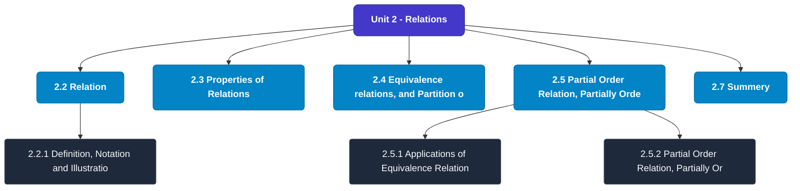

# MCS-061: Mathematical Foundations - I
## Unit 2: Relations

> 📚 **Programme:** M.Sc. (Data Science and Analytics) | **Semester:** Semester 1  
> ⏱️ **Estimated Study Time:** ~47 mins | 📄 **Textbook Pages:** 23 Pages  
> 📥 **Original PDF:** [Download & View Textbook](../../../pdfs/Semester_1/MCS-061_Mathematical_Foundations_-_I/Unit-2_Relations.pdf)

---

### 🎯 Executive Concept & Data Science Relevance
In modern data systems, **Relations** forms a vital conceptual pillar. Relations form the mathematical blueprint of Relational Database Management Systems (RDBMS). Foreign keys, functional dependencies, equivalence partitioning in clustering, and partial orderings in graph dependency pipelines all originate directly from formal relation theory.

> [!NOTE]
> **Why this matters for your career:** Mastering relations equips you with the foundational principles required to reason mathematically about high-dimensional datasets, evaluate algorithm performance, and avoid statistical pitfalls in production machine learning pipelines.

### 🗺️ Visual Knowledge Architecture
The following concept map illustrates the structural hierarchy and learning trajectory of this module:

### 📖 Core Definitions & Terminology Cards
| Term | Formal Mathematical / Technical Definition | Intuitive Analogy / Concrete Example |
| :--- | :--- | :--- |
| **Binary Relation** | A binary relation $R$ from set $A$ to set $B$ is any subset of the Cartesian product $A \times B$, i.e., $R \subseteq A \times B$. If $(a, b) \in R$, we write $aRb$. | *A table connecting users to purchased items in an e-commerce platform.* |
| **Reflexive Relation** | A relation $R$ on set $A$ is reflexive if $\forall a \in A, (a, a) \in R$. Every element is related to itself. | *Equality ($a = a$) and the 'is subset of' relation ($A \subseteq A$) are reflexive.* |
| **Symmetric Relation** | A relation $R$ on $A$ is symmetric if $\forall a, b \in A, (a, b) \in R \implies (b, a) \in R$. | *A mutual friendship in a social network or an undirected edge in a graph.* |
| **Transitive Relation** | A relation $R$ on $A$ is transitive if $\forall a, b, c \in A, [(a, b) \in R \land (b, c) \in R] \implies (a, c) \in R$. | *Ancestry or inequality: If $a < b$ and $b < c$, then $a < c$.* |
| **Equivalence Relation** | A relation $R$ on $A$ that is simultaneously reflexive, symmetric, and transitive. It partitions $A$ into mutually disjoint equivalence classes. | *Clustering data points into distinct, non-overlapping groups based on identical feature attributes.* |

### ⚡ Governing Mathematical Laws & Formula Cheatsheet
#### 🔹 Total Relations on a Set
$$\text{Total Relations on } A = 2^{|A|^2} = 2^{n^2} \quad \text{where } n = |A|$$
- **Explanation:** Since $|A \times A| = n^2$, any relation is a subset of $A \times A$, yielding $2^{n^2}$ possible relations.

#### 🔹 Total Reflexive Relations
$$\text{Reflexive Relations} = 2^{n(n - 1)}$$
- **Explanation:** The $n$ diagonal pairs $(a, a)$ must all be included (1 choice each), leaving $n^2 - n = n(n-1)$ off-diagonal pairs with 2 choices each.

#### 🔹 Total Symmetric Relations
$$\text{Symmetric Relations} = 2^{\frac{n(n + 1)}{2}}$$
- **Explanation:** Determined entirely by choices on the diagonal ($n$) and the upper triangle ($n(n-1)/2$).

#### 🔹 Equivalence Class Definition
$$[a] = \{x \in A \mid (x, a) \in R\}$$
- **Explanation:** The collection of all elements in $A$ related to representative element $a$. The union of all equivalence classes equals $A$.

### 📌 Detailed Section-by-Section Study Breakdown
#### `2.2` Relation
- **Core Concept:** The concept of 'relation' is one of the few fundamental concepts of mathematics.
- **Core Concept:** We begin the discussion with its formal/ mathematical definition and illustrations through some well-known examples.
- **Core Concept:** Definition, Notation and Illustrations In Mathematics, a relation from a set X to a set Y is defined as a subset of the cross- product X xY.
- **Data Science Application:** Provides foundational structures used directly in statistical modeling, query execution, and machine learning pipelines.

> [!TIP]
> **Exam & Interview Tip:** Be prepared to state the formal definition of relation and derive its primary equations step-by-step.

#### `2.2.1` Definition, Notation and Illustrations
- **Core Concept:** In Mathematics, a relation from a set X to a set Y is defined as a subset of the cross- product X xY.
- **Core Concept:** Earlier mentioned relations like is-mother-of or is-less-than can be discussed as subsets of cross-products of some sets as follows.
- **Core Concept:** Notation (in Mathematics) If Sheela is the mother of Shivam, then the fact may be expressed as Sheela is- mother-of Shivam.
- **Data Science Application:** Provides foundational structures used directly in statistical modeling, query execution, and machine learning pipelines.

> [!TIP]
> **Exam & Interview Tip:** Be prepared to state the formal definition of definition, notation and illustrations and derive its primary equations step-by-step.

#### `2.3` Properties of Relations
- **Core Concept:** We will discuss properties of only for those relations R for which the domain and range is the same set, say X, i.e., the relations on a set, say X.
- **Core Concept:** Unless mentioned otherwise, all relations are on the set X (fixed for all the relations under consideration).
- **Core Concept:** The discussion revolves around three important properties of relations on a set, viz.
- **Data Science Application:** Provides foundational structures used directly in statistical modeling, query execution, and machine learning pipelines.

> [!TIP]
> **Exam & Interview Tip:** Be prepared to state the formal definition of properties of relations and derive its primary equations step-by-step.

#### `2.4` Equivalence relations, and Partition of a Set
- **Core Concept:** PARTITION OF A SET A relation R on a set X is said to be an equivalence relation, if R is reflexive, symmetric and transitive.
- **Core Concept:** In more detailed form, R is an equivalence relation on set X, if and only if (i) R is reflexive on X, i.
- **Core Concept:** for every x ∈ X, we have (x, x) ∈R, and (ii) R is symmetric on X, i.
- **Data Science Application:** Provides foundational structures used directly in statistical modeling, query execution, and machine learning pipelines.

> [!TIP]
> **Exam & Interview Tip:** Be prepared to state the formal definition of equivalence relations, and partition of a set and derive its primary equations step-by-step.

#### `2.5` Partial Order Relation, Partially Ordered Set
- **Core Concept:** For an equivalence relation R on a set X, the subset [a] of X defined as [a] = {𝑥∈ X: (x, a) ∈R} is called an equivalence class of a under the equivalence relation R.
- **Core Concept:** Example: Consider the relation R= {(a, a), (b.
- **Core Concept:** b), (b, c), (c, b), (c, c)} on set X= {a, b, c}.
- **Data Science Application:** Provides foundational structures used directly in statistical modeling, query execution, and machine learning pipelines.

> [!TIP]
> **Exam & Interview Tip:** Be prepared to state the formal definition of partial order relation, partially ordered set and derive its primary equations step-by-step.

#### `2.5.1` Applications of Equivalence Relation and Partition of a Set
- **Core Concept:** Motivation for equivalence relation is that for some specific purpose, many apparently distinct elements behave identically, and hence need not be distinguished from each other.
- **Core Concept:** These 20 class sections determine a partition of the set of all students in the school.
- **Core Concept:** The equivalence relation has useful applications in the design of digital computers and other sequential machines.
- **Data Science Application:** Provides foundational structures used directly in statistical modeling, query execution, and machine learning pipelines.

> [!TIP]
> **Exam & Interview Tip:** Be prepared to state the formal definition of applications of equivalence relation and partition of a set and derive its primary equations step-by-step.

### 💡 Interactive Self-Assessment Checkpoints
Test your comprehension before proceeding. Tap each question to reveal the comprehensive explanation:

<b>Checkpoint 1:</b> What three properties are required for a relation to be an Equivalence Relation? <i>(Tap to reveal answer)</i>

> **Answer & Analysis:**  
> 1. Reflexivity: $\forall a \in A, (a,a) \in R$
2. Symmetry: $(a,b) \in R \implies (b,a) \in R$
3. Transitivity: $(a,b) \in R \land (b,c) \in R \implies (a,c) \in R$.

<b>Checkpoint 2:</b> What is a Partial Order Relation (Poset)? <i>(Tap to reveal answer)</i>

> **Answer & Analysis:**  
> A relation that is Reflexive, Antisymmetric ($(a,b) \in R \land (b,a) \in R \implies a = b$), and Transitive. Example: The subset relation $\subseteq$ on power sets.

<b>Checkpoint 3:</b> How many total relations exist on a set with 3 elements? <i>(Tap to reveal answer)</i>

> **Answer & Analysis:**  
> For $n = 3$, $|A \times A| = 3^2 = 9$. Total relations $= 2^9 = 512$.

<b>Checkpoint 4:</b> Let R be a relation from X= {1, 2, 3, 4}, to Y = {1, 2, 3, 4}, with R = {( <i>(Tap to reveal answer)</i>

> **Answer & Analysis:**  
> This question tests your conceptual mastery of Relations. Review the governing formulas and section breakdowns above to formulate a complete, rigorous proof or derivation.

<b>Checkpoint 5:</b> , (2, 1), (2, 3), (3, 1), (3, 2), (3, 4), (4, 3)} i) Give Graphic representation of R ii) Give Matrix representation of R <i>(Tap to reveal answer)</i>

> **Answer & Analysis:**  
> This question tests your conceptual mastery of Relations. Review the governing formulas and section breakdowns above to formulate a complete, rigorous proof or derivation.

<b>Checkpoint 6:</b> For each of the following relations, tell whether it is reflexive, not-reflexive or anti- reflexive i) R={( <i>(Tap to reveal answer)</i>

> **Answer & Analysis:**  
> This question tests your conceptual mastery of Relations. Review the governing formulas and section breakdowns above to formulate a complete, rigorous proof or derivation.

### 🎯 Executive Module Wrap-Up
- **Central Idea:** Relations provides essential mathematical and algorithmic tools directly utilized in Data Science.
- **Mathematical Rigor:** Formulas and laws must be memorized with attention to boundary conditions and assumptions.
- **Full Textbook Coverage:** For exhaustive multi-page derivations, proofs, and supplementary exercises, consult the [Authentic IGNOU Textbook](../../../pdfs/Semester_1/MCS-061_Mathematical_Foundations_-_I/Unit-2_Relations.pdf).

---
### 🧭 Navigation & Syllabus Index
[⬅ Previous: Unit 1](unit_01_Introduction_to_Sets.md) | [📑 Course Index](README.md) | [Next: Unit 3 ➡](unit_03_Functions.md)
