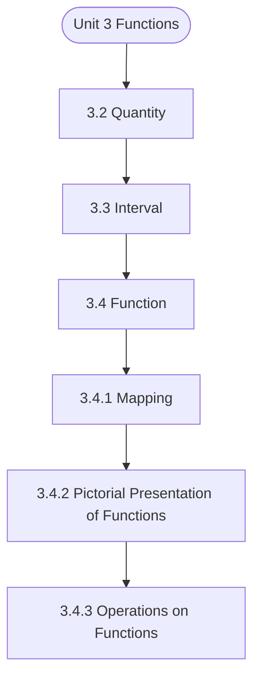

# MCS-061: Mathematical Foundations - I
## Unit 3: Functions

> 📚 **Programme:** M.Sc. (Data Science and Analytics) | **Semester:** Semester 1  
> ⏱️ **Estimated Study Time:** ~54 mins | 📄 **Textbook Pages:** 31 Pages  
> 📥 **Original PDF:** [Download & View Authentic Textbook](../../../pdfs/Semester_1/MCS-061_Mathematical_Foundations_-_I/Unit-3_Functions.pdf)

---

### 🎯 Executive Concept & Data Science Relevance
In modern data systems and advanced analytics, **Functions** forms a vital conceptual pillar. Functions are deterministic mappings between inputs and outputs. In machine learning, a predictive model is an approximating function $\hat{y} = f(\mathbf{x}; \mathbf{\theta})$. Understanding injective, surjective, and bijective mappings is essential for dimensionality reduction, autoencoders, and invertibility.

> [!NOTE]
> **Why this matters for your career:** Mastering functions equips you with the foundational principles required to reason mathematically about high-dimensional datasets, evaluate algorithm performance, and avoid statistical pitfalls in production machine learning pipelines.

### 🗺️ Visual Knowledge Architecture
The following concept map illustrates the structural hierarchy and learning trajectory of this module:



### 📖 Core Definitions & Terminology Cards

> 📌 **Function (Mapping)**  
> - **Formal Definition:** A relation $f: A \to B$ that associates every element $x \in A$ with a unique element $y \in B$, written as $y = f(x)$. Set $A$ is the domain, $B$ is the codomain, and $f(A) \subseteq B$ is the range.  
> - 💡 **Practical Intuition & Analogy:** *A Python function that guarantees returning exactly one output for every valid input.*

> 📌 **Injective (One-to-One)**  
> - **Formal Definition:** A function $f: A \to B$ is injective if $f(x_1) = f(x_2) \implies x_1 = x_2$, or equivalently $x_1 \neq x_2 \implies f(x_1) \neq f(x_2)$. No two inputs share the same output.  
> - 💡 **Practical Intuition & Analogy:** *A cryptographic hash without collisions or a primary key assignment.*

> 📌 **Surjective (Onto)**  
> - **Formal Definition:** A function $f: A \to B$ is surjective if $\forall y \in B, \exists x \in A$ such that $f(x) = y$. The range equals the codomain: $f(A) = B$.  
> - 💡 **Practical Intuition & Analogy:** *Every possible category in the target space is covered by at least one training observation.*

> 📌 **Bijective (One-to-One & Onto)**  
> - **Formal Definition:** A function that is simultaneously injective and surjective. Guarantees a strict 1-to-1 correspondence between domain $A$ and codomain $B$.  
> - 💡 **Practical Intuition & Analogy:** *A perfectly reversible transformation, like converting Celsius to Fahrenheit.*

### ⚡ Governing Mathematical Laws & Formula Cheatsheet
#### 🔹 Function Invertibility Condition
$$
f^{-1}: B \to A \text{ exists if and only if } f \text{ is Bijective}
$$
- **Explanation:** If not injective, the inverse is multi-valued; if not surjective, the inverse is undefined on parts of $B$.

#### 🔹 Composition of Functions
$$
(g \circ f)(x) = g(f(x)) \quad \text{where } f: A \to B, \; g: B \to C
$$
- **Explanation:** Chaining sequential data transformations, such as scaling data then applying a classifier.

#### 🔹 Pigeonhole Principle
$$
\text{If } n > k \text{ items are placed into } k \text{ bins, at least one bin contains } \ge \lceil n/k \rceil \text{ items}
$$
- **Explanation:** Guarantees hash collisions when the number of records exceeds the hash table capacity.

### ⚖️ Axiomatic Properties & Governing Laws
The mathematical formulations of this module are anchored by foundational algebraic and structural laws:

- **Composition Associativity:** $h \circ (g \circ f) = (h \circ g) \circ f$
- **Identity Mapping:** $f \circ I_A = f \quad \text{and} \quad I_B \circ f = f$
- **Inverse Composition:** $(g \circ f)^{-1} = f^{-1} \circ g^{-1} \quad \text{for bijections } f, g$
- **Invertibility Equivalence:** $f \circ f^{-1} = I_B \quad \text{and} \quad f^{-1} \circ f = I_A$

### 📌 Comprehensive Section-by-Section Study Breakdown
#### `3.2` Quantity

##### 📘 Theoretical Principles & Pedagogical Exposition
called the dependent variable, and the relation between d and t is called d's functional dependence on t. Going back briefly to (b), A = 50000 (1+6/100)t. Let g(t) = 50000 (1+6/100)t, then A = g(t). Here, g is a function name, t is independent variable, and A is the dependent variable, and the relation between A and t is called A's functional dependence on t.

In case of (c), let h(r) = πr2, then Area = h(r), and h is a function name, r is the independent variable and Area is the dependent variable, and the relation between Area and r is called Area's functional dependence on r. Further, let X and Y be two sets. Then a rule which associates each element of X to a unique element of Y is called a function.

X is called domain of the function. Y is called co-domain of the function and the set of only those values of Y for which function is defined is called range of the function. That is, subset { of Y is called range of the function. Functions Notation: (i) A function is generally denoted by f, g, h, etc., in the case of above definition we write f: X Y and read as f is a function from X to Y.


##### ⚙️ Mathematical & Algorithmic Mechanics
- **Core Mechanism:** A function $f: A \to B$ maps each domain element to exactly one codomain element. Injections guarantee unique mappings ($f(a)=f(b) \implies a=b$); surjections cover the entire codomain; bijections admit two-sided inverses $f^{-1}: B \to A$.
- **Boundary Conditions:** Division by zero singularities, non-injective hash collisions in hash tables, and undefined out-of-domain evaluation.

##### 📊 Practical Data Science & Production Relevance
- **Production Workflow:** Feature transformations $X \mapsto \phi(X)$, hash functions in distributed partitions, non-linear activation functions (ReLU, Sigmoid, Softmax), and invertible normalizing flows.
- **Real-World Pitfall:** Applying inverse transformations to non-injective functions, creating multi-valued ambiguities or silent data destruction.

> [!TIP]
> **Exam & Technical Interview Insight:** In exams, demonstrate injectivity by showing $f(x_1) = f(x_2) \implies x_1 = x_2$, and surjectivity by expressing domain variable $x$ in terms of codomain target $y$.

#### `3.3` Interval

##### 📘 Theoretical Principles & Pedagogical Exposition
Let R be the set of all real numbers. Then a set I R is said to be an interval if whenever a < then I For example, the set of all real numbers satisfying is an interval where x can take any real value between 2 and 3 including 2 and 3. Interval, now let us learn some more intervals Left Open and Right Closed Interval A left open and right closed interval I R with end points a and b (a < b) is denoted by (a, b] and is defined as (a, b] = In this case and a Left Closed and Right Open Interval A left closed and right open interval I R with end points a and b (a < b) is denoted by [a, b) and is defined as [a, b) = In this case and a Functions Length of an Interval Length of each of the intervals (a, b), [a, b], (a, b], [a, b) is defined as i.e.

length of the interval = difference of the end points For example, if I = (2, 7) then (I) = 7 – 2 = 5, where (I) denotes the length of the interval I. Finite Interval An interval is said to be finite if its length is finite. For example, if I = (– 3, 5) then (I) = 5 – (– 3) = 5 + 3 = 8 which is finite.

interval I is finite. Infinite Interval An interval is said to be infinite interval if its length is not finite. For example, (i) The set : is an infinite interval and is denoted by (a, ) (ii) The set is an infinite interval and is denoted by (– ) Similarly, infinite intervals [a, ), (– ] are defined as [a, ) = { , where a is a fixed real number (– ] = { where a is a fixed real number Remarks 1: (i) Each interval contains infinitely many elements.


##### ⚙️ Mathematical & Algorithmic Mechanics
- **Core Mechanism:** A function $f: A \to B$ maps each domain element to exactly one codomain element. Injections guarantee unique mappings ($f(a)=f(b) \implies a=b$); surjections cover the entire codomain; bijections admit two-sided inverses $f^{-1}: B \to A$.
- **Boundary Conditions:** Division by zero singularities, non-injective hash collisions in hash tables, and undefined out-of-domain evaluation.

##### 📊 Practical Data Science & Production Relevance
- **Production Workflow:** Feature transformations $X \mapsto \phi(X)$, hash functions in distributed partitions, non-linear activation functions (ReLU, Sigmoid, Softmax), and invertible normalizing flows.
- **Real-World Pitfall:** Applying inverse transformations to non-injective functions, creating multi-valued ambiguities or silent data destruction.

> [!TIP]
> **Exam & Technical Interview Insight:** In exams, demonstrate injectivity by showing $f(x_1) = f(x_2) \implies x_1 = x_2$, and surjectivity by expressing domain variable $x$ in terms of codomain target $y$.

#### `3.4` Function

##### 📘 Theoretical Principles & Pedagogical Exposition
A function is a mathematical term, which is a tool used to describe some aspects of the real world, including the following: a) Given that a vehicle moves at a constant average speed (say 50 km./hour), then the distance (say d) covered depends on the time (say t hours) over which the vehicle moves, Sets, Relations and Functions b) If a person takes a loan L (say, of Rs.

50,000/-) on simple interest R (say, at 6% per annum), the amount (say A) payable depends on the time T, after which the payment is made, in addition to L and R. c) The area (say Area) of a circle depends on the radius (say r) of the circle. The statements (a), (b) and (c) above express some real life situations, and each of which can be mathematically expressed respectively as (a) d = 50* t, (a) A = 50000 (1+6/100)t, and Area = π.r2.

In each of these cases, there are two variable quantities involved: one on LHS and the other on RHS. For example, in (a) the quantity d occurs on LHS and quantity t occurs on RHS; in (b) the quantity A occurs on LHS and quantity t occurs on RHS; and in (c) the quantity Area occurs on LHS and quantity r occurs on RHS.


##### ⚙️ Mathematical & Algorithmic Mechanics
- **Core Mechanism:** A function $f: A \to B$ maps each domain element to exactly one codomain element. Injections guarantee unique mappings ($f(a)=f(b) \implies a=b$); surjections cover the entire codomain; bijections admit two-sided inverses $f^{-1}: B \to A$.
- **Boundary Conditions:** Division by zero singularities, non-injective hash collisions in hash tables, and undefined out-of-domain evaluation.

##### 📊 Practical Data Science & Production Relevance
- **Production Workflow:** Feature transformations $X \mapsto \phi(X)$, hash functions in distributed partitions, non-linear activation functions (ReLU, Sigmoid, Softmax), and invertible normalizing flows.
- **Real-World Pitfall:** Applying inverse transformations to non-injective functions, creating multi-valued ambiguities or silent data destruction.

> [!TIP]
> **Exam & Technical Interview Insight:** In exams, demonstrate injectivity by showing $f(x_1) = f(x_2) \implies x_1 = x_2$, and surjectivity by expressing domain variable $x$ in terms of codomain target $y$.

#### `3.4.1` Mapping

##### 📘 Theoretical Principles & Pedagogical Exposition
If f(x) = y, then y is called image of x under f, and x is called pre-image of y. Also, the y, or f(x), is called the value of x under the function f. The names 'map' and 'mapping' are also used instead of the name 'function'. The subset of Y which consists of all images f(x) of elements of X is called the range of function f (in Y) Remarks 2: Important to note that the role/meaning of ‘→’ is just a part of notation for a function.

It just indicates that the symbol X, immediately on left of ‘→’ is the domain, and the symbol Y, immediately on the right of ‘→’ is the codomain of the function-symbol f, the symbol which precedes ':'. Definitions: Let f be a function from A to B. The set A is called the domain of the function f and B is called the co-domain of function f.

The set {f(x)|x ∈A} is called the range of f, and is also denoted by f(A). Given an element x ∈A, the unique element of B to which the function f associates, it is denoted by f(x) and is called the f-image (or image) of x or the value of the function f for x. We also say that f maps x to f(x).


##### ⚙️ Mathematical & Algorithmic Mechanics
- **Core Mechanism:** A function $f: A \to B$ maps each domain element to exactly one codomain element. Injections guarantee unique mappings ($f(a)=f(b) \implies a=b$); surjections cover the entire codomain; bijections admit two-sided inverses $f^{-1}: B \to A$.
- **Boundary Conditions:** Division by zero singularities, non-injective hash collisions in hash tables, and undefined out-of-domain evaluation.

##### 📊 Practical Data Science & Production Relevance
- **Production Workflow:** Feature transformations $X \mapsto \phi(X)$, hash functions in distributed partitions, non-linear activation functions (ReLU, Sigmoid, Softmax), and invertible normalizing flows.
- **Real-World Pitfall:** Applying inverse transformations to non-injective functions, creating multi-valued ambiguities or silent data destruction.

> [!TIP]
> **Exam & Technical Interview Insight:** In exams, demonstrate injectivity by showing $f(x_1) = f(x_2) \implies x_1 = x_2$, and surjectivity by expressing domain variable $x$ in terms of codomain target $y$.

#### `3.4.2` Pictorial Presentation of Functions

##### 📘 Theoretical Principles & Pedagogical Exposition
A function can be presented diagrammatically. Here we will see few examples of that. In next unit of this block, you will learn in more detail about diagrammatical representation of different types of functions. Consider A = {1,2,3,4}, B= {1,4,5} and the rule f which associates 1→1, 2→4, 3→5, 4→5.

Then f is a function from A to B. Pictorial representation of above function f : Let us take another example of function f where f(x) = x+5 . If we take domain for this function {1,2,3,4} then diagrammatic representation will be : 1. Domain (input) f Range (output) Functions


##### ⚙️ Mathematical & Algorithmic Mechanics
- **Core Mechanism:** A function $f: A \to B$ maps each domain element to exactly one codomain element. Injections guarantee unique mappings ($f(a)=f(b) \implies a=b$); surjections cover the entire codomain; bijections admit two-sided inverses $f^{-1}: B \to A$.
- **Boundary Conditions:** Division by zero singularities, non-injective hash collisions in hash tables, and undefined out-of-domain evaluation.

##### 📊 Practical Data Science & Production Relevance
- **Production Workflow:** Feature transformations $X \mapsto \phi(X)$, hash functions in distributed partitions, non-linear activation functions (ReLU, Sigmoid, Softmax), and invertible normalizing flows.
- **Real-World Pitfall:** Applying inverse transformations to non-injective functions, creating multi-valued ambiguities or silent data destruction.

> [!TIP]
> **Exam & Technical Interview Insight:** In exams, demonstrate injectivity by showing $f(x_1) = f(x_2) \implies x_1 = x_2$, and surjectivity by expressing domain variable $x$ in terms of codomain target $y$.

#### `3.4.3` Operations on Functions

##### 📘 Theoretical Principles & Pedagogical Exposition
The binary operation '+' on Natural numbers may be considered for the function Plus: N × N→N, such that Plus (x, y) = (x+y), for each pair of Natural numbers. The union operation X U Y on sets can be considered as a function Union: P×P→P, where P is a set of all subsets of universal set U, such that Union (X, Y) = X U Y, for each pair X, Y of sets from P.

In general, an operation is a function in which the domain of function is either the codomain or cross-product of codomain of function, Cross-product may involve the codomain finitely many times: Codomain × Codomain ... For example, the square operation on N is the function SQ: N →N, such that SQ (n) = n2.

The domain of function SQ is the codomain of the function SQ. In the case of Plus and Union, just sown above, the Domain is a cross- product of codomain. Functions If given whose domain ranges are subsets of the real numbers, we define the function f+g by (f + g) (x) to be the function whose value at x is the sum of f(x) and g(x).


##### ⚙️ Mathematical & Algorithmic Mechanics
- **Core Mechanism:** A function $f: A \to B$ maps each domain element to exactly one codomain element. Injections guarantee unique mappings ($f(a)=f(b) \implies a=b$); surjections cover the entire codomain; bijections admit two-sided inverses $f^{-1}: B \to A$.
- **Boundary Conditions:** Division by zero singularities, non-injective hash collisions in hash tables, and undefined out-of-domain evaluation.

##### 📊 Practical Data Science & Production Relevance
- **Production Workflow:** Feature transformations $X \mapsto \phi(X)$, hash functions in distributed partitions, non-linear activation functions (ReLU, Sigmoid, Softmax), and invertible normalizing flows.
- **Real-World Pitfall:** Applying inverse transformations to non-injective functions, creating multi-valued ambiguities or silent data destruction.

> [!TIP]
> **Exam & Technical Interview Insight:** In exams, demonstrate injectivity by showing $f(x_1) = f(x_2) \implies x_1 = x_2$, and surjectivity by expressing domain variable $x$ in terms of codomain target $y$.

#### `3.4.4` Some Commonly Used Functions

##### 📘 Theoretical Principles & Pedagogical Exposition
Based on the nature of classification a function may be given some particular names. In this section you will see some commonly used function names, their definitions and their graphical representations. More on graphical representations of different types of functions you will learn in next unit of this Block.

Constant Function then a function is said to be a constant function if it is defined as: , where a is a real constant. a function is constant if range is a singleton set. all elements of the domain are associated to a single element of the co- domain of the function. For example, (i) defined by is a constant function because all elements of the domain are associated to the single element 3 as shown in the Fig.

3.8 (ii) defined by is also a constant function and its graph is given below in Fig. Y' X X' Y O y = f (x) = 2 Sets, Relations and Functions Identity Function a function is said to be an identity function if it is defined as : i.e. a function is said to be identity function if each element is associated to itself.


##### ⚙️ Mathematical & Algorithmic Mechanics
- **Core Mechanism:** A function $f: A \to B$ maps each domain element to exactly one codomain element. Injections guarantee unique mappings ($f(a)=f(b) \implies a=b$); surjections cover the entire codomain; bijections admit two-sided inverses $f^{-1}: B \to A$.
- **Boundary Conditions:** Division by zero singularities, non-injective hash collisions in hash tables, and undefined out-of-domain evaluation.

##### 📊 Practical Data Science & Production Relevance
- **Production Workflow:** Feature transformations $X \mapsto \phi(X)$, hash functions in distributed partitions, non-linear activation functions (ReLU, Sigmoid, Softmax), and invertible normalizing flows.
- **Real-World Pitfall:** Applying inverse transformations to non-injective functions, creating multi-valued ambiguities or silent data destruction.

> [!TIP]
> **Exam & Technical Interview Insight:** In exams, demonstrate injectivity by showing $f(x_1) = f(x_2) \implies x_1 = x_2$, and surjectivity by expressing domain variable $x$ in terms of codomain target $y$.

#### `3.4.5` Monotonic Functions

##### 📘 Theoretical Principles & Pedagogical Exposition
When a function that is either entirely non-increasing or non-decreasing it is called monotonic function. For Example, Increasing: If x ≤ y, then f(x) ≤ f(y). Any straight line with a positive slope is an increasing function. The general form is f(x) = mx+c, where the slope m is greater than 0.

Functions Strictly Increasing: If x < y, then f(x) < f(y). Note that strictly increasing functions are always injective. It is commonly found that some functions to be increasing only on specific portions of their domain. For Example f(x) = x2: This parabola is increasing for all x > 0.

(It is decreasing for x < 0). Linear Function : Any line with a positive slope, like f(x) = 2x+1. For every step you take to the right on the x-axis, you go up on the y-axis. Exponential Function: The natural exponential function f(x) = ex. This function not only increases but does so at an ever-faster rate.


##### ⚙️ Mathematical & Algorithmic Mechanics
- **Core Mechanism:** A function $f: A \to B$ maps each domain element to exactly one codomain element. Injections guarantee unique mappings ($f(a)=f(b) \implies a=b$); surjections cover the entire codomain; bijections admit two-sided inverses $f^{-1}: B \to A$.
- **Boundary Conditions:** Division by zero singularities, non-injective hash collisions in hash tables, and undefined out-of-domain evaluation.

##### 📊 Practical Data Science & Production Relevance
- **Production Workflow:** Feature transformations $X \mapsto \phi(X)$, hash functions in distributed partitions, non-linear activation functions (ReLU, Sigmoid, Softmax), and invertible normalizing flows.
- **Real-World Pitfall:** Applying inverse transformations to non-injective functions, creating multi-valued ambiguities or silent data destruction.

> [!TIP]
> **Exam & Technical Interview Insight:** In exams, demonstrate injectivity by showing $f(x_1) = f(x_2) \implies x_1 = x_2$, and surjectivity by expressing domain variable $x$ in terms of codomain target $y$.

### 📐 Step-by-Step Solved Mathematical Examples
To solidify your theoretical understanding, work through these fully solved, step-by-step mathematical problems:

#### 🧮 Example 1: Verifying Bijectivity and Finding Inverse Function
> **Problem Statement:**  
> Let $f: \mathbb{R} \setminus \lbrace 3\rbrace \to \mathbb{R} \setminus \lbrace 2\rbrace$ be defined by $f(x) = \frac{2x + 1}{x - 3}$. Prove that $f$ is bijective and determine its explicit inverse formula $f^{-1}(y)$.

**Detailed Step-by-Step Solution:**

1. **Injectivity:** Suppose $f(x_1) = f(x_2)$:

$$
\frac{2x_1 + 1}{x_1 - 3} = \frac{2x_2 + 1}{x_2 - 3} \implies (2x_1 + 1)(x_2 - 3) = (2x_2 + 1)(x_1 - 3)
$$


$$
2x_1 x_2 - 6x_1 + x_2 - 3 = 2x_1 x_2 - 6x_2 + x_1 - 3 \implies -7x_1 = -7x_2 \implies x_1 = x_2
$$

Thus $f$ is **Injective**.

2. **Surjectivity & Inverse:** Let $y = \frac{2x + 1}{x - 3}$. Solve for $x$:

$$
y(x - 3) = 2x + 1 \implies yx - 3y = 2x + 1 \implies x(y - 2) = 3y + 1
$$


$$
x = \frac{3y + 1}{y - 2}
$$

Since $y 
eq 2$, $x$ is well-defined in the domain for every $y$. Thus $f$ is **Surjective**.

Conclusion: $f$ is **Bijective**, with inverse $f^{-1}(x) = \frac{3x + 1}{x - 2}$.

#### 🧮 Example 2: Applying the Generalized Pigeonhole Principle
> **Problem Statement:**  
> A data engineering pipeline ingests 1001 user transaction logs into 100 partition buckets. Prove that at least one partition bucket contains at least 11 transaction logs.

**Detailed Step-by-Step Solution:**

By the Generalized Pigeonhole Principle, with $n = 1001$ items and $k = 100$ bins:

$$
\lceil n/k \rceil = \lceil 1001 / 100 \rceil = \lceil 10.01 \rceil = 11
$$

Therefore, at least one partition bucket is guaranteed to receive $\ge 11$ logs.

### 💻 Practical Data Science Implementation (Python)
Theory translates directly into production algorithms. Below is a self-contained, commented Python implementation illustrating the core operations of this unit:

```python
# Function Pipeline & Invertibility Simulation
def feature_transform(x):
    # Bijective linear normalization: f(x) = 2x + 1
    return 2 * x + 1

def inverse_transform(y):
    # Explicit inverse: f^(-1)(y) = (y - 1) / 2
    return (y - 1) / 2

raw_data = [10.0, 25.5, 50.0, 100.0]
encoded = [feature_transform(x) for x in raw_data]
decoded = [inverse_transform(y) for y in encoded]

print(f"Original: {raw_data}")
print(f"Transformed: {encoded}")
print(f"Reconstructed: {decoded}")
assert raw_data == decoded, "Lossless reconstruction failed!"
```

### 💡 Interactive Self-Assessment Checkpoints
Test your comprehension before proceeding. Tap each question to reveal the comprehensive explanation:

<details>
<summary><b>Checkpoint 1:</b> . Let N N : f → defined by f(n) = 3n, Express the function diagrammatically. Also, write domain, range and co- domain of the function. ……………………………………………………………………………… ……………………………………………………………………………… <i>(Tap to reveal answer)</i></summary>

> **Answer & Analysis:**  
> **Authentic Textbook Solution & Analysis:**
> 
> 1. N N : f → defined by N n , n ) x ( f  =  f(3) 6, f(2) ,3 )1( f = = = , and so on. See Fig. 3.6 Functions Domain of the function f {1, 2, 3, ...} N = = Range of the function f = Set of only those values for which function is define = {3, 6, 9, …} Co-domain = Set of all values of Y = {1, 2, 3, …}= N
> 
> - **Analytical Breakdown:** Verify each step against the governing definitions and formulas detailed in the cheatsheet above.
</details>

<details>
<summary><b>Checkpoint 2:</b> . If R R : f → be a function defined by then obtain (i) Domain of (ii) Range of ……………………………………………………………………………… ……………………………………………………………………………… <i>(Tap to reveal answer)</i></summary>

> **Answer & Analysis:**  
> **Authentic Textbook Solution & Analysis:**
> 
> 1. N N : f → defined by N n , n ) x ( f  =  f(3) 6, f(2) ,3 )1( f = = = , and so on. See Fig. 3.6 Functions Domain of the function f {1, 2, 3, ...} N = = Range of the function f = Set of only those values for which function is define = {3, 6, 9, …} Co-domain = Set of all values of Y = {1, 2, 3, …}= N
> 
> - **Analytical Breakdown:** Verify each step against the governing definitions and formulas detailed in the cheatsheet above.
</details>

<details>
<summary><b>Checkpoint 3:</b> . Find the domain and range of the following real-valued real functions: (i) f(x)= - |x| (ii) f(x) = + ……………………………………………………………………………… ……………………………………………………………………………… <i>(Tap to reveal answer)</i></summary>

> **Answer & Analysis:**  
> **Authentic Textbook Solution & Analysis:**
> 
> 1. N N : f → defined by N n , n ) x ( f  =  f(3) 6, f(2) ,3 )1( f = = = , and so on. See Fig. 3.6 Functions Domain of the function f {1, 2, 3, ...} N = = Range of the function f = Set of only those values for which function is define = {3, 6, 9, …} Co-domain = Set of all values of Y = {1, 2, 3, …}= N
> 
> - **Analytical Breakdown:** Verify each step against the governing definitions and formulas detailed in the cheatsheet above.
</details>

<details>
<summary><b>Checkpoint 4:</b> . For each of the following, tell whether f is a function or not. Justify , your answer. i) f: N→N, such that f(x) = x -3 ii) f: N→ Z, such that f(x) = x – 3 ……………………………………………………………………………… ……………………………………………………………………………… <i>(Tap to reveal answer)</i></summary>

> **Answer & Analysis:**  
> **Authentic Textbook Solution & Analysis:**
> 
> 7. Not every relation is a function. For example, this relation does not satisfy the property that: Each element of A must have been assigned to one element in B. If a ∈ A is assigned b ∈ B and a ∈ A is assigned b´ ∈ B, then b = b´ That is why relations that don’t satisfy the above properties are not a function
> 
> - **Analytical Breakdown:** Verify each step against the governing definitions and formulas detailed in the cheatsheet above.
</details>

<details>
<summary><b>Checkpoint 5:</b> What condition must a function satisfy to possess an inverse $f^{-1}$? <i>(Tap to reveal answer)</i></summary>

> **Answer & Analysis:**  
> The function must be **Bijective** (both injective/one-to-one and surjective/onto).
</details>

<details>
<summary><b>Checkpoint 6:</b> If $f(x) = 2x + 3$, find the inverse function $f^{-1}(x)$. <i>(Tap to reveal answer)</i></summary>

> **Answer & Analysis:**  
> Let $y = 2x + 3 \implies y - 3 = 2x \implies x = \frac{y - 3}{2}$. Therefore, $f^{-1}(x) = \frac{x - 3}{2}$.
</details>

### 🎯 Executive Module Wrap-Up
- **Central Idea:** Functions provides essential mathematical and algorithmic tools directly utilized in Data Science.
- **Mathematical Rigor:** Formulas and laws must be memorized with attention to boundary conditions and assumptions.
- **Full Textbook Coverage:** For exhaustive multi-page derivations, proofs, and supplementary exercises, consult the [Authentic IGNOU Textbook](../../../pdfs/Semester_1/MCS-061_Mathematical_Foundations_-_I/Unit-3_Functions.pdf).

---
### 🧭 Navigation & Syllabus Index
[⬅ Previous: Unit 2](unit_02_Relations.md) | [📑 Course Index](README.md) | [Next: Unit 4 ➡](unit_04_Graphical_Representation_of_Functions.md)
