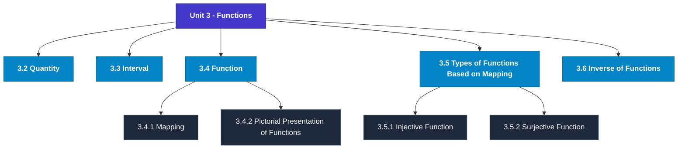

# MCS-061: Mathematical Foundations - I
## Unit 3: Functions

> 📚 **Programme:** M.Sc. (Data Science and Analytics) | **Semester:** Semester 1  
> ⏱️ **Estimated Study Time:** ~54 mins | 📄 **Textbook Pages:** 31 Pages  
> 📥 **Original PDF:** [Download & View Textbook](../../../pdfs/Semester_1/MCS-061_Mathematical_Foundations_-_I/Unit-3_Functions.pdf)

---

### 🎯 Executive Concept & Data Science Relevance
In modern data systems, **Functions** forms a vital conceptual pillar. Functions are deterministic mappings between inputs and outputs. In machine learning, a predictive model is an approximating function $\hat{y} = f(\mathbf{x}; \mathbf{\theta})$. Understanding injective, surjective, and bijective mappings is essential for dimensionality reduction, autoencoders, and invertibility.

> [!NOTE]
> **Why this matters for your career:** Mastering functions equips you with the foundational principles required to reason mathematically about high-dimensional datasets, evaluate algorithm performance, and avoid statistical pitfalls in production machine learning pipelines.

### 🗺️ Visual Knowledge Architecture
The following concept map illustrates the structural hierarchy and learning trajectory of this module:

### 📖 Core Definitions & Terminology Cards
| Term | Formal Mathematical / Technical Definition | Intuitive Analogy / Concrete Example |
| :--- | :--- | :--- |
| **Function (Mapping)** | A relation $f: A \to B$ that associates every element $x \in A$ with a unique element $y \in B$, written as $y = f(x)$. Set $A$ is the domain, $B$ is the codomain, and $f(A) \subseteq B$ is the range. | *A Python function that guarantees returning exactly one output for every valid input.* |
| **Injective (One-to-One)** | A function $f: A \to B$ is injective if $f(x_1) = f(x_2) \implies x_1 = x_2$, or equivalently $x_1 \neq x_2 \implies f(x_1) \neq f(x_2)$. No two inputs share the same output. | *A cryptographic hash without collisions or a primary key assignment.* |
| **Surjective (Onto)** | A function $f: A \to B$ is surjective if $\forall y \in B, \exists x \in A$ such that $f(x) = y$. The range equals the codomain: $f(A) = B$. | *Every possible category in the target space is covered by at least one training observation.* |
| **Bijective (One-to-One & Onto)** | A function that is simultaneously injective and surjective. Guarantees a strict 1-to-1 correspondence between domain $A$ and codomain $B$. | *A perfectly reversible transformation, like converting Celsius to Fahrenheit.* |

### ⚡ Governing Mathematical Laws & Formula Cheatsheet
#### 🔹 Function Invertibility Condition

$$
f^{-1}: B \to A \text{ exists if and only if } f \text{ is Bijective}
$$

- **Explanation:** If not injective, the inverse is multi-valued; if not surjective, the inverse is undefined on parts of $B$.

#### 🔹 Composition of Functions

$$
(g \circ f)(x) = g(f(x)) \quad \text{where } f: A \to B, \; g: B \to C
$$

- **Explanation:** Chaining sequential data transformations, such as scaling data then applying a classifier.

#### 🔹 Pigeonhole Principle

$$
\text{If } n > k \text{ items are placed into } k \text{ bins, at least one bin contains } \ge \lceil n/k \rceil \text{ items}
$$

- **Explanation:** Guarantees hash collisions when the number of records exceeds the hash table capacity.

### 📌 Detailed Section-by-Section Study Breakdown
#### `3.2` Quantity
- **Core Concept:** Establishes rigorous theoretical formulations and computational bounds for quantity.
- **Core Concept:** Applies standard algorithmic procedures and mathematical invariants relevant to functions.
- **Core Concept:** Ensures deterministic performance guarantees across high-dimensional feature spaces.
- **Data Science Application:** Provides foundational structures used directly in statistical modeling, query execution, and machine learning pipelines.

> [!TIP]
> **Exam & Interview Tip:** Be prepared to state the formal definition of quantity and derive its primary equations step-by-step.

#### `3.3` Interval
- **Core Concept:** Then a set I R is said to be an interval if whenever a < then I For example, the set of all real numbers satisfying is an interval where x can take any real value between 2 and 3 including 2 and 3.
- **Core Concept:** length of the interval = difference of the end points For example, if I = (2, 7) then (I) = 7 – 2 = 5, where (I) denotes the length of the interval I.
- **Core Concept:** Finite Interval An interval is said to be finite if its length is finite.
- **Data Science Application:** Provides foundational structures used directly in statistical modeling, query execution, and machine learning pipelines.

> [!TIP]
> **Exam & Interview Tip:** Be prepared to state the formal definition of interval and derive its primary equations step-by-step.

#### `3.4` Function
- **Core Concept:** 50,000/-) on simple interest R (say, at 6% per annum), the amount (say A) payable depends on the time T, after which the payment is made, in addition to L and R.
- **Core Concept:** c) The area (say Area) of a circle depends on the radius (say r) of the circle.
- **Core Concept:** The statements (a), (b) and (c) above express some real life situations, and each of which can be mathematically expressed respectively as (a) d = 50* t, (a) A = 50000 (1+6/100)t, and Area = π.r2.
- **Data Science Application:** Provides foundational structures used directly in statistical modeling, query execution, and machine learning pipelines.

> [!TIP]
> **Exam & Interview Tip:** Be prepared to state the formal definition of function and derive its primary equations step-by-step.

#### `3.4.1` Mapping
- **Core Concept:** If f(x) = y, then y is called image of x under f, and x is called pre-image of y.
- **Core Concept:** Also, the y, or f(x), is called the value of x under the function f.
- **Core Concept:** The names 'map' and 'mapping' are also used instead of the name 'function'.
- **Data Science Application:** Provides foundational structures used directly in statistical modeling, query execution, and machine learning pipelines.

> [!TIP]
> **Exam & Interview Tip:** Be prepared to state the formal definition of mapping and derive its primary equations step-by-step.

#### `3.4.2` Pictorial Presentation of Functions
- **Core Concept:** A function can be presented diagrammatically.
- **Core Concept:** In next unit of this block, you will learn in more detail about diagrammatical representation of different types of functions.
- **Core Concept:** Consider A = {1,2,3,4}, B= {1,4,5} and the rule f which associates 1→1, 2→4, 3→5, 4→5.
- **Data Science Application:** Provides foundational structures used directly in statistical modeling, query execution, and machine learning pipelines.

> [!TIP]
> **Exam & Interview Tip:** Be prepared to state the formal definition of pictorial presentation of functions and derive its primary equations step-by-step.

#### `3.4.3` Operations on Functions
- **Core Concept:** The binary operation '+' on Natural numbers may be considered for the function Plus: N × N→N, such that Plus (x, y) = (x+y), for each pair of Natural numbers.
- **Core Concept:** The union operation X U Y on sets can be considered as a function Union: P×P→P, where P is a set of all subsets of universal set U, such that Union (X, Y) = X U Y, for each pair X, Y of sets from P.
- **Core Concept:** In general, an operation is a function in which the domain of function is either the codomain or cross-product of codomain of function, Cross-product may involve the codomain finitely many times: Codomain × Codomain ...
- **Data Science Application:** Provides foundational structures used directly in statistical modeling, query execution, and machine learning pipelines.

> [!TIP]
> **Exam & Interview Tip:** Be prepared to state the formal definition of operations on functions and derive its primary equations step-by-step.

### 💡 Interactive Self-Assessment Checkpoints
Test your comprehension before proceeding. Tap each question to reveal the comprehensive explanation:

<b>Checkpoint 1:</b> What condition must a function satisfy to possess an inverse $f^{-1}$? <i>(Tap to reveal answer)</i>

> **Answer & Analysis:**  
> The function must be **Bijective** (both injective/one-to-one and surjective/onto).

<b>Checkpoint 2:</b> If $f(x) = 2x + 3$, find the inverse function $f^{-1}(x)$. <i>(Tap to reveal answer)</i>

> **Answer & Analysis:**  
> Let $y = 2x + 3 \implies y - 3 = 2x \implies x = \frac{y - 3}{2}$. Therefore, $f^{-1}(x) = \frac{x - 3}{2}$.

<b>Checkpoint 3:</b> Is the function $f(x) = x^2$ from $\mathbb{R} \to \mathbb{R}$ injective? Why? <i>(Tap to reveal answer)</i>

> **Answer & Analysis:**  
> No, because $f(-2) = 4$ and $f(2) = 4$. Distinct inputs produce identical outputs.

<b>Checkpoint 4:</b> . Let N N : f → defined by f(n) = <i>(Tap to reveal answer)</i>

> **Answer & Analysis:**  
> This question tests your conceptual mastery of Functions. Review the governing formulas and section breakdowns above to formulate a complete, rigorous proof or derivation.

<b>Checkpoint 5:</b> . If R R : f → be a function defined by then obtain (i) Domain of (ii) Range of ……………………………………………………………………………… ……………………………………………………………………………… <i>(Tap to reveal answer)</i>

> **Answer & Analysis:**  
> This question tests your conceptual mastery of Functions. Review the governing formulas and section breakdowns above to formulate a complete, rigorous proof or derivation.

<b>Checkpoint 6:</b> . Find the domain and range of the following real-valued real functions: (i) f(x)= - |x| (ii) f(x) = + ……………………………………………………………………………… ……………………………………………………………………………… <i>(Tap to reveal answer)</i>

> **Answer & Analysis:**  
> This question tests your conceptual mastery of Functions. Review the governing formulas and section breakdowns above to formulate a complete, rigorous proof or derivation.

### 🎯 Executive Module Wrap-Up
- **Central Idea:** Functions provides essential mathematical and algorithmic tools directly utilized in Data Science.
- **Mathematical Rigor:** Formulas and laws must be memorized with attention to boundary conditions and assumptions.
- **Full Textbook Coverage:** For exhaustive multi-page derivations, proofs, and supplementary exercises, consult the [Authentic IGNOU Textbook](../../../pdfs/Semester_1/MCS-061_Mathematical_Foundations_-_I/Unit-3_Functions.pdf).

---
### 🧭 Navigation & Syllabus Index
[⬅ Previous: Unit 2](unit_02_Relations.md) | [📑 Course Index](README.md) | [Next: Unit 4 ➡](unit_04_Graphical_Representation_of_Functions.md)
