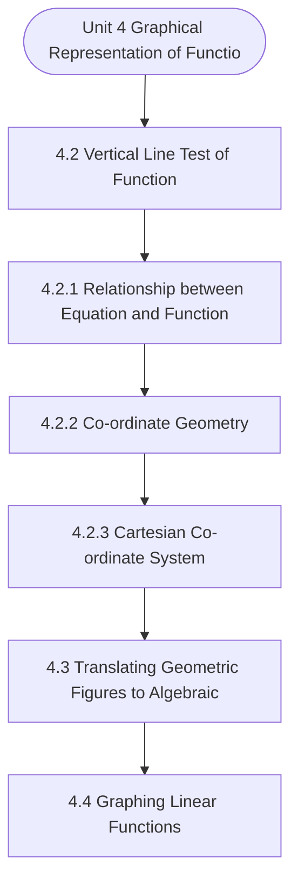

# MCS-061: Mathematical Foundations - I
## Unit 4: Graphical Representation of Functions

> 📚 **Programme:** M.Sc. (Data Science and Analytics) | **Semester:** Semester 1  
> ⏱️ **Estimated Study Time:** ~40 mins | 📄 **Textbook Pages:** 34 Pages  
> 📥 **Original PDF:** [Download & View Authentic Textbook](../../../pdfs/Semester_1/MCS-061_Mathematical_Foundations_-_I/Unit-4_Graphical_Representation_of_Functions.pdf)

---

### 🎯 Executive Concept & Data Science Relevance
In modern data systems and advanced analytics, **Graphical Representation of Functions** forms a vital conceptual pillar. Functions are deterministic mappings between inputs and outputs. In machine learning, a predictive model is an approximating function $\hat{y} = f(\mathbf{x}; \mathbf{\theta})$. Understanding injective, surjective, and bijective mappings is essential for dimensionality reduction, autoencoders, and invertibility.

> [!NOTE]
> **Why this matters for your career:** Mastering graphical representation of functions equips you with the foundational principles required to reason mathematically about high-dimensional datasets, evaluate algorithm performance, and avoid statistical pitfalls in production machine learning pipelines.

### 🗺️ Visual Knowledge Architecture
The following concept map illustrates the structural hierarchy and learning trajectory of this module:



### 📖 Core Definitions & Terminology Cards

> 📌 **Function (Mapping)**  
> - **Formal Definition:** A relation $f: A \to B$ that associates every element $x \in A$ with a unique element $y \in B$, written as $y = f(x)$. Set $A$ is the domain, $B$ is the codomain, and $f(A) \subseteq B$ is the range.  
> - 💡 **Practical Intuition & Analogy:** *A Python function that guarantees returning exactly one output for every valid input.*

> 📌 **Injective (One-to-One)**  
> - **Formal Definition:** A function $f: A \to B$ is injective if $f(x_1) = f(x_2) \implies x_1 = x_2$, or equivalently $x_1 \neq x_2 \implies f(x_1) \neq f(x_2)$. No two inputs share the same output.  
> - 💡 **Practical Intuition & Analogy:** *A cryptographic hash without collisions or a primary key assignment.*

> 📌 **Surjective (Onto)**  
> - **Formal Definition:** A function $f: A \to B$ is surjective if $\forall y \in B, \exists x \in A$ such that $f(x) = y$. The range equals the codomain: $f(A) = B$.  
> - 💡 **Practical Intuition & Analogy:** *Every possible category in the target space is covered by at least one training observation.*

> 📌 **Bijective (One-to-One & Onto)**  
> - **Formal Definition:** A function that is simultaneously injective and surjective. Guarantees a strict 1-to-1 correspondence between domain $A$ and codomain $B$.  
> - 💡 **Practical Intuition & Analogy:** *A perfectly reversible transformation, like converting Celsius to Fahrenheit.*

### ⚡ Governing Mathematical Laws & Formula Cheatsheet
#### 🔹 Function Invertibility Condition
$$
f^{-1}: B \to A \text{ exists if and only if } f \text{ is Bijective}
$$
- **Explanation:** If not injective, the inverse is multi-valued; if not surjective, the inverse is undefined on parts of $B$.

#### 🔹 Composition of Functions
$$
(g \circ f)(x) = g(f(x)) \quad \text{where } f: A \to B, \; g: B \to C
$$
- **Explanation:** Chaining sequential data transformations, such as scaling data then applying a classifier.

#### 🔹 Pigeonhole Principle
$$
\text{If } n > k \text{ items are placed into } k \text{ bins, at least one bin contains } \ge \lceil n/k \rceil \text{ items}
$$
- **Explanation:** Guarantees hash collisions when the number of records exceeds the hash table capacity.

### ⚖️ Axiomatic Properties & Governing Laws
The mathematical formulations of this module are anchored by foundational algebraic and structural laws:

- **Composition Associativity:** $h \circ (g \circ f) = (h \circ g) \circ f$
- **Identity Mapping:** $f \circ I_A = f \quad \text{and} \quad I_B \circ f = f$
- **Inverse Composition:** $(g \circ f)^{-1} = f^{-1} \circ g^{-1} \quad \text{for bijections } f, g$
- **Invertibility Equivalence:** $f \circ f^{-1} = I_B \quad \text{and} \quad f^{-1} \circ f = I_A$

### 📌 Comprehensive Section-by-Section Study Breakdown
#### `4.2` Vertical Line Test of Function

##### 📘 Theoretical Principles & Pedagogical Exposition
The vertical line test for graphically testing(only) failure of a relationship f(x) to be a function of x indicates that the vertical line crosses the graph of f(x) at two distinct points (Fig 4.2). Thus, using vertical-line text we can identify the graphs that are not functions.

For example, you can show that each of the following graphs is not a function. But the graph shown in Fig 4.4 below represents a function. Thus, some of the important equations such as ellipse, circle and parabola may not represent a function. One must note that the above test can be used to test whether a relationship is functional.

It cannot be used to test (or confirm) whether a relationship is functional. There are other additional requirements for a relationship to be functional. Graphical Representation of Functions


##### ⚙️ Mathematical & Algorithmic Mechanics
- **Core Mechanism:** A function $f: A \to B$ maps each domain element to exactly one codomain element. Injections guarantee unique mappings ($f(a)=f(b) \implies a=b$); surjections cover the entire codomain; bijections admit two-sided inverses $f^{-1}: B \to A$.
- **Boundary Conditions:** Division by zero singularities, non-injective hash collisions in hash tables, and undefined out-of-domain evaluation.

##### 📊 Practical Data Science & Production Relevance
- **Production Workflow:** Feature transformations $X \mapsto \phi(X)$, hash functions in distributed partitions, non-linear activation functions (ReLU, Sigmoid, Softmax), and invertible normalizing flows.
- **Real-World Pitfall:** Applying inverse transformations to non-injective functions, creating multi-valued ambiguities or silent data destruction.

> [!TIP]
> **Exam & Technical Interview Insight:** In exams, demonstrate injectivity by showing $f(x_1) = f(x_2) \implies x_1 = x_2$, and surjectivity by expressing domain variable $x$ in terms of codomain target $y$.

#### `4.2.1` Relationship between Equation and Function

##### 📘 Theoretical Principles & Pedagogical Exposition
Relationship between Equation and Function Before we discuss functions in detail, we need to be clear about the possible relationship between an equation and a relation/function. Consider the equation X2+Y2=4 ………… (1) Then to talk about mathematical relation/function, we rewrite the above equation so that one of the variables, say Y is written on L.H.S.

and everything else is shifted to R.H.S. as follows: Y2 = 4 – X2 ………. (2) Next step to talk about a relation/ function corresponding to Equation (1) is to rewrite (2), so that only Y (and not its power, or square-root etc.) is written on L.H.S. as follows: Y = + √(4 −𝑋2) ………. (3) At this stage, after reducing the L.H.S.

to a single variable, with the power of the variable as exactly 1, we can talk of a (mathematical) relation/function. As (3) does not satisfy single-value rule, hence, equation (1) does not correspond to a function. Of course, it corresponds to a relation. Equation (3) is obtained to make Y as dependent variable, and X as independent variable.


##### ⚙️ Mathematical & Algorithmic Mechanics
- **Core Mechanism:** Evaluates binary relation subsets $R \subseteq A \times B$. Equivalence relations partition a set into mutually disjoint equivalence classes $[a] = \{x \in A \mid (x, a) \in R\}$. Partial orders enforce reflexivity, antisymmetry, and transitivity to structure directed acyclic precedences.
- **Boundary Conditions:** Empty relations $\emptyset$, universal Cartesian products $A \times B$, identity diagonal pairs $\Delta = \{(a, a)\}$, and verifying antisymmetry $(aRb \land bRa \implies a=b)$.

##### 📊 Practical Data Science & Production Relevance
- **Production Workflow:** Directly underpins relational database foreign keys, functional dependencies, topological sort DAGs in pipeline engines (Airflow, dbt), and equivalence clustering in unsupervised grouping.
- **Real-World Pitfall:** Assuming symmetry in directed dependencies or failing to check transitivity when computing transitive closures, resulting in invalid cycle deadlocks.

> [!TIP]
> **Exam & Technical Interview Insight:** Be prepared to prove whether a given relation is an Equivalence Relation or Poset by testing reflexivity, symmetry/antisymmetry, and transitivity with explicit elements.

#### `4.2.2` Co-ordinate Geometry

##### 📘 Theoretical Principles & Pedagogical Exposition
Co-ordinate Geometry is an approach to investigating and solving problems in the domain of geometric objects such as straight lines, triangles, planes, cubes, etc. The approach consists in representing geometric objects as Algebraic expressions and equations like a x + b y + c =0 for a straight line, and x2+ y2= c for a circle etc.

And then use algebraic tools for making inferences and solving problems. The process of translating geometric objects to algebraic expressions are achieved using co-ordinate systems. There are several different co-ordinate systems, each more useful than the others for some specific purposes.

We will discuss some of these briefly. However, before that we mention some synonymous and related terms, and a little bit of history. Co-ordinate geometry is also called Analytical geometry, or Cartesian geometry Sets, Relations and Functions (in honor of Rene Descartes,17th century French philosopher and mathematician).


##### ⚙️ Mathematical & Algorithmic Mechanics
- **Core Mechanism:** A function $f: A \to B$ maps each domain element to exactly one codomain element. Injections guarantee unique mappings ($f(a)=f(b) \implies a=b$); surjections cover the entire codomain; bijections admit two-sided inverses $f^{-1}: B \to A$.
- **Boundary Conditions:** Division by zero singularities, non-injective hash collisions in hash tables, and undefined out-of-domain evaluation.

##### 📊 Practical Data Science & Production Relevance
- **Production Workflow:** Feature transformations $X \mapsto \phi(X)$, hash functions in distributed partitions, non-linear activation functions (ReLU, Sigmoid, Softmax), and invertible normalizing flows.
- **Real-World Pitfall:** Applying inverse transformations to non-injective functions, creating multi-valued ambiguities or silent data destruction.

> [!TIP]
> **Exam & Technical Interview Insight:** In exams, demonstrate injectivity by showing $f(x_1) = f(x_2) \implies x_1 = x_2$, and surjectivity by expressing domain variable $x$ in terms of codomain target $y$.

#### `4.2.3` Cartesian Co-ordinate System

##### 📘 Theoretical Principles & Pedagogical Exposition
In the rest of the discussion in the unit, unless mentioned otherwise, the term ' co-ordinate system' will be used for cartesian co-ordinate system, which is also called rectilinear co-ordinate system. In this co-ordinate system for 2-dimensional space, two mutually perpendicular intersecting lines (called axes), as shown in the Fig.

4.6 below, form the basis of rectangular co-ordinate system for 2-dimension 1) The horizontal number line is called the x- axis. 2) The vertical number line is called the y-axis. The origin is where the two lines/axes intersect. It has four Quadrants marked with Roman numerals. Graphical Representation of Functions Each point on the graph corresponds to an ordered pair.

At the origin, it is assumed that value of x = 0 = value of y. when dealing with an (x, y) graph, the x co-ordinate is always written first and the y co-ordinate as second in the ordered pair (x, y). Normally, the values of the independent variable (generally the x-values) are placed on the horizontal axis.


##### ⚙️ Mathematical & Algorithmic Mechanics
- **Core Mechanism:** A function $f: A \to B$ maps each domain element to exactly one codomain element. Injections guarantee unique mappings ($f(a)=f(b) \implies a=b$); surjections cover the entire codomain; bijections admit two-sided inverses $f^{-1}: B \to A$.
- **Boundary Conditions:** Division by zero singularities, non-injective hash collisions in hash tables, and undefined out-of-domain evaluation.

##### 📊 Practical Data Science & Production Relevance
- **Production Workflow:** Feature transformations $X \mapsto \phi(X)$, hash functions in distributed partitions, non-linear activation functions (ReLU, Sigmoid, Softmax), and invertible normalizing flows.
- **Real-World Pitfall:** Applying inverse transformations to non-injective functions, creating multi-valued ambiguities or silent data destruction.

> [!TIP]
> **Exam & Technical Interview Insight:** In exams, demonstrate injectivity by showing $f(x_1) = f(x_2) \implies x_1 = x_2$, and surjectivity by expressing domain variable $x$ in terms of codomain target $y$.

#### `4.3` Translating Geometric Figures to Algebraic Equations

##### 📘 Theoretical Principles & Pedagogical Exposition
ALGEBRAIC EQUATIONS For translating a geometric figure, say, a straight line, we create a co-ordinate system around the object, or, equivalently, the geometric figure is embedded in a co-ordinate system as shown in Fig. How and where to place the geometric figure in the co-ordinate system depends on the problem under consideration.

Each point in Fig 4.7, has co-ordinates, as one of the points, say A, in the figure above, has co-ordinates (2, 0), with 2 as abscissa and 0 as ordinate, and another point, say B, has co-ordinates (0, -2). Sets, Relations and Functions To represent a geometric figure by an algebraic equation, we take an arbitrary point in Fig 4.7, assuming its co-ordinates as (x, y) with x as abscissa and y as ordinate.

Then an algebraic equation representing the figure is some relationship (to be determined) between x and y. To derive the algebraic equation corresponding to Fig. 4.7, let us take P (x, y) outside the segment A (0, -2)and B (2, 0), and drop a perpendicular PQ on x-axis. Then triangles AOB and AQP are similar.


##### ⚙️ Mathematical & Algorithmic Mechanics
- **Core Mechanism:** A function $f: A \to B$ maps each domain element to exactly one codomain element. Injections guarantee unique mappings ($f(a)=f(b) \implies a=b$); surjections cover the entire codomain; bijections admit two-sided inverses $f^{-1}: B \to A$.
- **Boundary Conditions:** Division by zero singularities, non-injective hash collisions in hash tables, and undefined out-of-domain evaluation.

##### 📊 Practical Data Science & Production Relevance
- **Production Workflow:** Feature transformations $X \mapsto \phi(X)$, hash functions in distributed partitions, non-linear activation functions (ReLU, Sigmoid, Softmax), and invertible normalizing flows.
- **Real-World Pitfall:** Applying inverse transformations to non-injective functions, creating multi-valued ambiguities or silent data destruction.

> [!TIP]
> **Exam & Technical Interview Insight:** In exams, demonstrate injectivity by showing $f(x_1) = f(x_2) \implies x_1 = x_2$, and surjectivity by expressing domain variable $x$ in terms of codomain target $y$.

#### `4.4` Graphing Linear Functions

##### 📘 Theoretical Principles & Pedagogical Exposition
A function y =f(x), is called linear if the power of x in f(x) is not more than 1. A linear function corresponds to a linear equation A x + B y + C = 0, in which degrees of x and y do not exceed 1, and A, B, C are constants. Where at least one of A, B ≠0. To plot a graph of a function, we take, one by one, values in the domain (xi) as the independent variable x, and then find the corresponding values in the range yi of the dependent variable y.

It helps record the x and y values while plotting the graphs. For example, consider a linear function depicting the relationship between price (x) and market demand (y) for a commodity. To plot the graph for evaluating the relationship, it is convenient to first prepare a table, called a t-chart, comprising the values of x and y.

If a function takes the form of y=7-5x, then t-chartis as under: Graphical Representation of Functions • Table 4.1: t-chart of y=7-5x x y=7-5x -1 -3 -8 In general, we may need to take many values of the independent variable x and find the corresponding values of y. But in the case of functions, we need to take only two values of the independent variable x and calculate two corresponding values of the dependent variable y.


##### ⚙️ Mathematical & Algorithmic Mechanics
- **Core Mechanism:** A function $f: A \to B$ maps each domain element to exactly one codomain element. Injections guarantee unique mappings ($f(a)=f(b) \implies a=b$); surjections cover the entire codomain; bijections admit two-sided inverses $f^{-1}: B \to A$.
- **Boundary Conditions:** Division by zero singularities, non-injective hash collisions in hash tables, and undefined out-of-domain evaluation.

##### 📊 Practical Data Science & Production Relevance
- **Production Workflow:** Feature transformations $X \mapsto \phi(X)$, hash functions in distributed partitions, non-linear activation functions (ReLU, Sigmoid, Softmax), and invertible normalizing flows.
- **Real-World Pitfall:** Applying inverse transformations to non-injective functions, creating multi-valued ambiguities or silent data destruction.

> [!TIP]
> **Exam & Technical Interview Insight:** In exams, demonstrate injectivity by showing $f(x_1) = f(x_2) \implies x_1 = x_2$, and surjectivity by expressing domain variable $x$ in terms of codomain target $y$.

#### `4.4.1` Absolute Value Function

##### 📘 Theoretical Principles & Pedagogical Exposition
Absolute Value Function is given as f(x) = | x | indicating that we need to consider modulus | x | of a real number keeping it as the non-negative value without regard to its sign. That is, |x| = x for a positive x, |x| = -x for a negative x (in which case –x is positive), and |0| = 0.

Thus, the function y = |x|, is defined by the following two equations y = |x| = x for x >0, …..(1) and y = |x| = -x for x <0 …..(2) As each of (1) and (2) is a linear equation, each is represented by a straight line as shown in Fig. 4.15 below: However, for some functions, the x-intercept & y-intercept method may not yield the required result, because the required curve may not intersect x- axis or y-axis.

Example: ƒ is a function given by f (x) = |x| + 2. The y interceptis given by (0, ƒ(0)) = (0, |-2|) =(0, 2); x intercept is at the point (2,0)since we solve for |x-2| =0.But 0 =y=f(x)= |x-2|=0 has no solution. Since |x-2| is either positive or zero for x=2; the domain of ƒ is the set of all real numbers and the range of ƒ is given by the interval [0,+∞).The corresponding graph is shown in Fig 4.16.


##### ⚙️ Mathematical & Algorithmic Mechanics
- **Core Mechanism:** A function $f: A \to B$ maps each domain element to exactly one codomain element. Injections guarantee unique mappings ($f(a)=f(b) \implies a=b$); surjections cover the entire codomain; bijections admit two-sided inverses $f^{-1}: B \to A$.
- **Boundary Conditions:** Division by zero singularities, non-injective hash collisions in hash tables, and undefined out-of-domain evaluation.

##### 📊 Practical Data Science & Production Relevance
- **Production Workflow:** Feature transformations $X \mapsto \phi(X)$, hash functions in distributed partitions, non-linear activation functions (ReLU, Sigmoid, Softmax), and invertible normalizing flows.
- **Real-World Pitfall:** Applying inverse transformations to non-injective functions, creating multi-valued ambiguities or silent data destruction.

> [!TIP]
> **Exam & Technical Interview Insight:** In exams, demonstrate injectivity by showing $f(x_1) = f(x_2) \implies x_1 = x_2$, and surjectivity by expressing domain variable $x$ in terms of codomain target $y$.

#### `4.4.2` Step Function

##### 📘 Theoretical Principles & Pedagogical Exposition
A step function (or staircase function) is a piecewise function containing all constant “pieces” . The constant pieces are observed across the adjacent intervals of the function, as they change value from one interval to the next. A step function is discontinuous (not continuous) as you can see in the Fig.

You cannot draw a step function without removing your pencil from your paper. Example of a step function: For definition of our particular step function y=f(x), First, we write every x = Int - x + Fraction-x, where Fraction-x>0. E.g., for x = 5.46, Int-x =5, and Fraction-x = .46 For x = - 3.87, Int-x = -4, and Fraction-x = .13 Then we define y = f(x) = Int-x Thus, f (5.46) = 5, and f (-3.87) = -4.

y Sets, Relations and Functions Note: The domain of a function is the set of all inputs for which the function is defined. For piece wise functions, the domain is union of all the individual cases. The range of a function is the set of all the possible function outputs. For piecewise functions, this is the union of the ranges, so fall back to the individual cases.


##### ⚙️ Mathematical & Algorithmic Mechanics
- **Core Mechanism:** A function $f: A \to B$ maps each domain element to exactly one codomain element. Injections guarantee unique mappings ($f(a)=f(b) \implies a=b$); surjections cover the entire codomain; bijections admit two-sided inverses $f^{-1}: B \to A$.
- **Boundary Conditions:** Division by zero singularities, non-injective hash collisions in hash tables, and undefined out-of-domain evaluation.

##### 📊 Practical Data Science & Production Relevance
- **Production Workflow:** Feature transformations $X \mapsto \phi(X)$, hash functions in distributed partitions, non-linear activation functions (ReLU, Sigmoid, Softmax), and invertible normalizing flows.
- **Real-World Pitfall:** Applying inverse transformations to non-injective functions, creating multi-valued ambiguities or silent data destruction.

> [!TIP]
> **Exam & Technical Interview Insight:** In exams, demonstrate injectivity by showing $f(x_1) = f(x_2) \implies x_1 = x_2$, and surjectivity by expressing domain variable $x$ in terms of codomain target $y$.

### 📐 Step-by-Step Solved Mathematical Examples
To solidify your theoretical understanding, work through these fully solved, step-by-step mathematical problems:

#### 🧮 Example 1: Verifying Bijectivity and Finding Inverse Function
> **Problem Statement:**  
> Let $f: \mathbb{R} \setminus \lbrace 3\rbrace \to \mathbb{R} \setminus \lbrace 2\rbrace$ be defined by $f(x) = \frac{2x + 1}{x - 3}$. Prove that $f$ is bijective and determine its explicit inverse formula $f^{-1}(y)$.

**Detailed Step-by-Step Solution:**

1. **Injectivity:** Suppose $f(x_1) = f(x_2)$:

$$
\frac{2x_1 + 1}{x_1 - 3} = \frac{2x_2 + 1}{x_2 - 3} \implies (2x_1 + 1)(x_2 - 3) = (2x_2 + 1)(x_1 - 3)
$$


$$
2x_1 x_2 - 6x_1 + x_2 - 3 = 2x_1 x_2 - 6x_2 + x_1 - 3 \implies -7x_1 = -7x_2 \implies x_1 = x_2
$$

Thus $f$ is **Injective**.

2. **Surjectivity & Inverse:** Let $y = \frac{2x + 1}{x - 3}$. Solve for $x$:

$$
y(x - 3) = 2x + 1 \implies yx - 3y = 2x + 1 \implies x(y - 2) = 3y + 1
$$


$$
x = \frac{3y + 1}{y - 2}
$$

Since $y 
eq 2$, $x$ is well-defined in the domain for every $y$. Thus $f$ is **Surjective**.

Conclusion: $f$ is **Bijective**, with inverse $f^{-1}(x) = \frac{3x + 1}{x - 2}$.

#### 🧮 Example 2: Applying the Generalized Pigeonhole Principle
> **Problem Statement:**  
> A data engineering pipeline ingests 1001 user transaction logs into 100 partition buckets. Prove that at least one partition bucket contains at least 11 transaction logs.

**Detailed Step-by-Step Solution:**

By the Generalized Pigeonhole Principle, with $n = 1001$ items and $k = 100$ bins:

$$
\lceil n/k \rceil = \lceil 1001 / 100 \rceil = \lceil 10.01 \rceil = 11
$$

Therefore, at least one partition bucket is guaranteed to receive $\ge 11$ logs.

### 💻 Practical Data Science Implementation (Python)
Theory translates directly into production algorithms. Below is a self-contained, commented Python implementation illustrating the core operations of this unit:

```python
# Function Pipeline & Invertibility Simulation
def feature_transform(x):
    # Bijective linear normalization: f(x) = 2x + 1
    return 2 * x + 1

def inverse_transform(y):
    # Explicit inverse: f^(-1)(y) = (y - 1) / 2
    return (y - 1) / 2

raw_data = [10.0, 25.5, 50.0, 100.0]
encoded = [feature_transform(x) for x in raw_data]
decoded = [inverse_transform(y) for y in encoded]

print(f"Original: {raw_data}")
print(f"Transformed: {encoded}")
print(f"Reconstructed: {decoded}")
assert raw_data == decoded, "Lossless reconstruction failed!"
```

### 💡 Interactive Self-Assessment Checkpoints
Test your comprehension before proceeding. Tap each question to reveal the comprehensive explanation:

<details>
<summary><b>Checkpoint 1:</b> Draw the graph of the equation y2 = x+5 and comment if it is a function. ………………………………………………………………………………… ………………………………………………………………………………… ………………………………………………………………………………… …………………………………………………………… <i>(Tap to reveal answer)</i></summary>

> **Answer & Analysis:**  
> **Detailed Analytical Solution:**
> 
> 1. **Core Principle:** Identify the governing theorem or definition for Graphical Representation of Functions.
> 2. **Step-by-Step Derivation:** Verify all preconditions and compute intermediate steps methodically.
> 3. **Conclusion:** State the final mathematical proof or calculation clearly, validating boundary edge cases.
</details>

<details>
<summary><b>Checkpoint 2:</b> Find algebraic equation corresponding to a circle of radius r. ……………………………………………………………………………. ……………………………………………………………………………. ……………………………………………………………………………. <i>(Tap to reveal answer)</i></summary>

> **Answer & Analysis:**  
> **Detailed Analytical Solution:**
> 
> 1. **Core Principle:** Identify the governing theorem or definition for Graphical Representation of Functions.
> 2. **Step-by-Step Derivation:** Verify all preconditions and compute intermediate steps methodically.
> 3. **Conclusion:** State the final mathematical proof or calculation clearly, validating boundary edge cases.
</details>

<details>
<summary><b>Checkpoint 3:</b> Draw the graph of y = (-5/3) x-2. ……………………………………………………………………………. ……………………………………………………………………………. ……………………………………………………………………………. <i>(Tap to reveal answer)</i></summary>

> **Answer & Analysis:**  
> **Detailed Analytical Solution:**
> 
> 1. **Core Principle:** Identify the governing theorem or definition for Graphical Representation of Functions.
> 2. **Step-by-Step Derivation:** Verify all preconditions and compute intermediate steps methodically.
> 3. **Conclusion:** State the final mathematical proof or calculation clearly, validating boundary edge cases.
</details>

<details>
<summary><b>Checkpoint 4:</b> Find when ƒ(x)=2|3x+2|-12 crosses the x-axis. ……………………………………………………………………………. ……………………………………………………………………………. Graphical Representation of Function 14 Graphical Representation of Functions ……………………………………………………………………………. <i>(Tap to reveal answer)</i></summary>

> **Answer & Analysis:**  
> **Detailed Analytical Solution:**
> 
> 1. **Core Principle:** Identify the governing theorem or definition for Graphical Representation of Functions.
> 2. **Step-by-Step Derivation:** Verify all preconditions and compute intermediate steps methodically.
> 3. **Conclusion:** State the final mathematical proof or calculation clearly, validating boundary edge cases.
</details>

<details>
<summary><b>Checkpoint 5:</b> What condition must a function satisfy to possess an inverse $f^{-1}$? <i>(Tap to reveal answer)</i></summary>

> **Answer & Analysis:**  
> The function must be **Bijective** (both injective/one-to-one and surjective/onto).
</details>

<details>
<summary><b>Checkpoint 6:</b> If $f(x) = 2x + 3$, find the inverse function $f^{-1}(x)$. <i>(Tap to reveal answer)</i></summary>

> **Answer & Analysis:**  
> Let $y = 2x + 3 \implies y - 3 = 2x \implies x = \frac{y - 3}{2}$. Therefore, $f^{-1}(x) = \frac{x - 3}{2}$.
</details>

### 🎯 Executive Module Wrap-Up
- **Central Idea:** Graphical Representation of Functions provides essential mathematical and algorithmic tools directly utilized in Data Science.
- **Mathematical Rigor:** Formulas and laws must be memorized with attention to boundary conditions and assumptions.
- **Full Textbook Coverage:** For exhaustive multi-page derivations, proofs, and supplementary exercises, consult the [Authentic IGNOU Textbook](../../../pdfs/Semester_1/MCS-061_Mathematical_Foundations_-_I/Unit-4_Graphical_Representation_of_Functions.pdf).

---
### 🧭 Navigation & Syllabus Index
[⬅ Previous: Unit 3](unit_03_Functions.md) | [📑 Course Index](README.md) | [Next: Unit 5 ➡](unit_05_Progressions.md)
