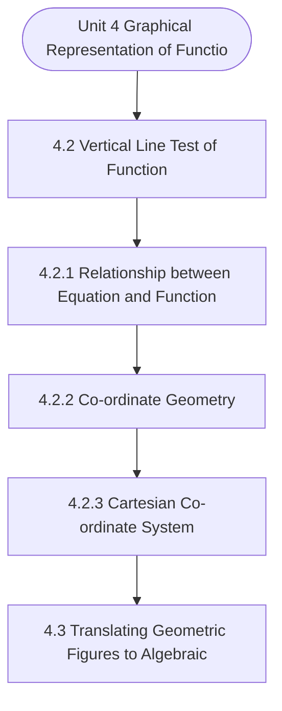

# MCS-061: Mathematical Foundations - I
## Unit 4: Graphical Representation of Functions

> 📚 **Programme:** M.Sc. (Data Science and Analytics) | **Semester:** Semester 1  
> ⏱️ **Estimated Study Time:** ~40 mins | 📄 **Textbook Pages:** 34 Pages  
> 📥 **Original PDF:** [Download & View Textbook](../../../pdfs/Semester_1/MCS-061_Mathematical_Foundations_-_I/Unit-4_Graphical_Representation_of_Functions.pdf)

---

### 🎯 Executive Concept & Data Science Relevance
In modern data systems, **Graphical Representation of Functions** forms a vital conceptual pillar. Functions are deterministic mappings between inputs and outputs. In machine learning, a predictive model is an approximating function $\hat{y} = f(\mathbf{x}; \mathbf{\theta})$. Understanding injective, surjective, and bijective mappings is essential for dimensionality reduction, autoencoders, and invertibility.

> [!NOTE]
> **Why this matters for your career:** Mastering graphical representation of functions equips you with the foundational principles required to reason mathematically about high-dimensional datasets, evaluate algorithm performance, and avoid statistical pitfalls in production machine learning pipelines.

### 🗺️ Visual Knowledge Architecture
The following concept map illustrates the structural hierarchy and learning trajectory of this module:

### 📖 Core Definitions & Terminology Cards

> 📌 **Function (Mapping)**  
> - **Formal Definition:** A relation $f: A \to B$ that associates every element $x \in A$ with a unique element $y \in B$, written as $y = f(x)$. Set $A$ is the domain, $B$ is the codomain, and $f(A) \subseteq B$ is the range.  
> - 💡 **Practical Intuition & Analogy:** *A Python function that guarantees returning exactly one output for every valid input.*

> 📌 **Injective (One-to-One)**  
> - **Formal Definition:** A function $f: A \to B$ is injective if $f(x_1) = f(x_2) \implies x_1 = x_2$, or equivalently $x_1 \neq x_2 \implies f(x_1) \neq f(x_2)$. No two inputs share the same output.  
> - 💡 **Practical Intuition & Analogy:** *A cryptographic hash without collisions or a primary key assignment.*

> 📌 **Surjective (Onto)**  
> - **Formal Definition:** A function $f: A \to B$ is surjective if $\forall y \in B, \exists x \in A$ such that $f(x) = y$. The range equals the codomain: $f(A) = B$.  
> - 💡 **Practical Intuition & Analogy:** *Every possible category in the target space is covered by at least one training observation.*

> 📌 **Bijective (One-to-One & Onto)**  
> - **Formal Definition:** A function that is simultaneously injective and surjective. Guarantees a strict 1-to-1 correspondence between domain $A$ and codomain $B$.  
> - 💡 **Practical Intuition & Analogy:** *A perfectly reversible transformation, like converting Celsius to Fahrenheit.*

### ⚡ Governing Mathematical Laws & Formula Cheatsheet
#### 🔹 Function Invertibility Condition
$$
f^{-1}: B \to A \text{ exists if and only if } f \text{ is Bijective}
$$
- **Explanation:** If not injective, the inverse is multi-valued; if not surjective, the inverse is undefined on parts of $B$.

#### 🔹 Composition of Functions
$$
(g \circ f)(x) = g(f(x)) \quad \text{where } f: A \to B, \; g: B \to C
$$
- **Explanation:** Chaining sequential data transformations, such as scaling data then applying a classifier.

#### 🔹 Pigeonhole Principle
$$
\text{If } n > k \text{ items are placed into } k \text{ bins, at least one bin contains } \ge \lceil n/k \rceil \text{ items}
$$
- **Explanation:** Guarantees hash collisions when the number of records exceeds the hash table capacity.

### 📌 Detailed Section-by-Section Study Breakdown
#### `4.2` Vertical Line Test of Function
- **Core Concept:** 4.2: Graph that does not Represent a Function Thus, using vertical-line text we can identify the graphs that are not functions.
- **Core Concept:** For example, you can show that each of the following graphs is not a function.
- **Core Concept:** Thus, some of the important equations such as ellipse, circle and parabola may not represent a function.
- **Data Science Application:** Provides foundational structures used directly in statistical modeling, query execution, and machine learning pipelines.

> [!TIP]
> **Exam & Interview Tip:** Be prepared to state the formal definition of vertical line test of function and derive its primary equations step-by-step.

#### `4.2.1` Relationship between Equation and Function
- **Core Concept:** Before we discuss functions in detail, we need to be clear about the possible relationship between an equation and a relation/function.
- **Core Concept:** Consider the equation X2+Y2=4 ………… (1) Then to talk about mathematical relation/function, we rewrite the above equation so that one of the variables, say Y is written on L.H.S.
- **Core Concept:** and everything else is shifted to R.H.S.
- **Data Science Application:** Provides foundational structures used directly in statistical modeling, query execution, and machine learning pipelines.

> [!TIP]
> **Exam & Interview Tip:** Be prepared to state the formal definition of relationship between equation and function and derive its primary equations step-by-step.

#### `4.2.2` Co-ordinate Geometry
- **Core Concept:** Co-ordinate Geometry is an approach to investigating and solving problems in the domain of geometric objects such as straight lines, triangles, planes, cubes, etc.
- **Core Concept:** The approach consists in representing geometric objects as Algebraic expressions and equations like a x + b y + c =0 for a straight line, and x2+ y2= c for a circle etc.
- **Core Concept:** And then use algebraic tools for making inferences and solving problems.
- **Data Science Application:** Provides foundational structures used directly in statistical modeling, query execution, and machine learning pipelines.

> [!TIP]
> **Exam & Interview Tip:** Be prepared to state the formal definition of co-ordinate geometry and derive its primary equations step-by-step.

#### `4.2.3` Cartesian Co-ordinate System
- **Core Concept:** In the rest of the discussion in the unit, unless mentioned otherwise, the term ' co-ordinate system' will be used for cartesian co-ordinate system, which is also called rectilinear co-ordinate system.
- **Core Concept:** 4.6 below, form the basis of rectangular co-ordinate system for 2-dimension 1) The horizontal number line is called the x- axis.
- **Core Concept:** 2) The vertical number line is called the y-axis.
- **Data Science Application:** Provides foundational structures used directly in statistical modeling, query execution, and machine learning pipelines.

> [!TIP]
> **Exam & Interview Tip:** Be prepared to state the formal definition of cartesian co-ordinate system and derive its primary equations step-by-step.

#### `4.3` Translating Geometric Figures to Algebraic Equations
- **Core Concept:** 4.7, let us take P (x, y) outside the segment A (0, -2)and B (2, 0), and drop a perpendicular PQ on x-axis.
- **Core Concept:** From conventional/synthetic geometry, we know: IAOI / IAQI = IBOI / IPQI, ...
- **Core Concept:** (i) Where, IXI denotes length of line segment X.
- **Data Science Application:** Provides foundational structures used directly in statistical modeling, query execution, and machine learning pipelines.

> [!TIP]
> **Exam & Interview Tip:** Be prepared to state the formal definition of translating geometric figures to algebraic equations and derive its primary equations step-by-step.

#### `4.4` Graphing Linear Functions
- **Core Concept:** A function y =f(x), is called linear if the power of x in f(x) is not more than 1.
- **Core Concept:** A linear function corresponds to a linear equation A x + B y + C = 0, in which degrees of x and y do not exceed 1, and A, B, C are constants.
- **Core Concept:** To plot a graph of a function, we take, one by one, values in the domain (xi) as the independent variable x, and then find the corresponding values in the range yi of the dependent variable y.
- **Data Science Application:** Provides foundational structures used directly in statistical modeling, query execution, and machine learning pipelines.

> [!TIP]
> **Exam & Interview Tip:** Be prepared to state the formal definition of graphing linear functions and derive its primary equations step-by-step.

### 💡 Interactive Self-Assessment Checkpoints
Test your comprehension before proceeding. Tap each question to reveal the comprehensive explanation:

<b>Checkpoint 1:</b> What condition must a function satisfy to possess an inverse $f^{-1}$? <i>(Tap to reveal answer)</i>

> **Answer & Analysis:**  
> The function must be **Bijective** (both injective/one-to-one and surjective/onto).

<b>Checkpoint 2:</b> If $f(x) = 2x + 3$, find the inverse function $f^{-1}(x)$. <i>(Tap to reveal answer)</i>

> **Answer & Analysis:**  
> Let $y = 2x + 3 \implies y - 3 = 2x \implies x = \frac{y - 3}{2}$. Therefore, $f^{-1}(x) = \frac{x - 3}{2}$.

<b>Checkpoint 3:</b> Is the function $f(x) = x^2$ from $\mathbb{R} \to \mathbb{R}$ injective? Why? <i>(Tap to reveal answer)</i>

> **Answer & Analysis:**  
> No, because $f(-2) = 4$ and $f(2) = 4$. Distinct inputs produce identical outputs.

<b>Checkpoint 4:</b> Draw the graph of the equation y2 = x+5 and comment if it is a function. ………………………………………………………………………………… ………………………………………………………………………………… ………………………………………………………………………………… …………………………………………………………… <i>(Tap to reveal answer)</i>

> **Answer & Analysis:**  
> This question tests your conceptual mastery of Graphical Representation of Functions. Review the governing formulas and section breakdowns above to formulate a complete, rigorous proof or derivation.

<b>Checkpoint 5:</b> Find algebraic equation corresponding to a circle of radius r. ……………………………………………………………………………. ……………………………………………………………………………. ……………………………………………………………………………. <i>(Tap to reveal answer)</i>

> **Answer & Analysis:**  
> This question tests your conceptual mastery of Graphical Representation of Functions. Review the governing formulas and section breakdowns above to formulate a complete, rigorous proof or derivation.

<b>Checkpoint 6:</b> Draw the graph of y = (-5/3) x-2. ……………………………………………………………………………. ……………………………………………………………………………. ……………………………………………………………………………. <i>(Tap to reveal answer)</i>

> **Answer & Analysis:**  
> This question tests your conceptual mastery of Graphical Representation of Functions. Review the governing formulas and section breakdowns above to formulate a complete, rigorous proof or derivation.

### 🎯 Executive Module Wrap-Up
- **Central Idea:** Graphical Representation of Functions provides essential mathematical and algorithmic tools directly utilized in Data Science.
- **Mathematical Rigor:** Formulas and laws must be memorized with attention to boundary conditions and assumptions.
- **Full Textbook Coverage:** For exhaustive multi-page derivations, proofs, and supplementary exercises, consult the [Authentic IGNOU Textbook](../../../pdfs/Semester_1/MCS-061_Mathematical_Foundations_-_I/Unit-4_Graphical_Representation_of_Functions.pdf).

---
### 🧭 Navigation & Syllabus Index
[⬅ Previous: Unit 3](unit_03_Functions.md) | [📑 Course Index](README.md) | [Next: Unit 5 ➡](unit_05_Progressions.md)
