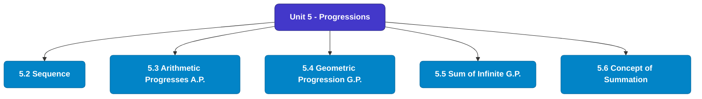

# MCS-061: Mathematical Foundations - I
## Unit 5: Progressions

> 📚 **Programme:** M.Sc. (Data Science and Analytics) | **Semester:** Semester 1  
> ⏱️ **Estimated Study Time:** ~43 mins | 📄 **Textbook Pages:** 22 Pages  
> 📥 **Original PDF:** [Download & View Textbook](../../../pdfs/Semester_1/MCS-061_Mathematical_Foundations_-_I/Unit-5_Progressions.pdf)

---

### 🎯 Executive Concept & Data Science Relevance
In modern data systems, **Progressions** forms a vital conceptual pillar. Set theory is the fundamental bedrock of all discrete mathematics, computer science, and data engineering. Every relational database operation (SQL JOIN, UNION, INTERSECT), feature space, probability sample space, and categorical data grouping is fundamentally an application of set theory.

> [!NOTE]
> **Why this matters for your career:** Mastering progressions equips you with the foundational principles required to reason mathematically about high-dimensional datasets, evaluate algorithm performance, and avoid statistical pitfalls in production machine learning pipelines.

### 🗺️ Visual Knowledge Architecture
The following concept map illustrates the structural hierarchy and learning trajectory of this module:

### 📖 Core Definitions & Terminology Cards
| Term | Formal Mathematical / Technical Definition | Intuitive Analogy / Concrete Example |
| :--- | :--- | :--- |
| **Set** | A well-defined collection of distinct objects, denoted typically by uppercase letters $A, B, X$. Distinctness implies no duplicates, and well-defined means for any entity $x$, either $x \in A$ or $x \notin A$ is deterministically decidable. | *Think of a Python `set({1, 2, 3})` where duplicate elements are collapsed and lookup is based on unique membership.* |
| **Cardinality $\|A\|$ or $n(A)$** | The total count of distinct elements in a finite set $A$. If $\|A\| = n$, the set contains exactly $n$ distinct members. For infinite sets, cardinality describes transfinite sizes (e.g. countable $\aleph_0$ vs uncountable $c$). | *The output of `len(my_set)` in programming.* |
| **Power Set $\mathcal{P}(A)$** | The set of all possible subsets of $A$, including the empty set $\emptyset$ and $A$ itself: $\mathcal{P}(A) = \{S \mid S \subseteq A\}$. If $\|A\| = n$, then $\|\mathcal{P}(A)\| = 2^n$. | *In feature selection, evaluating all possible combinations of $n$ features requires searching through the power set of features ($2^n$ candidate models).* |
| **Subset & Proper Subset** | A set $A$ is a subset of $B$ ($A \subseteq B$) if $\forall x \in A \implies x \in B$. It is a proper subset ($A \subset B$) if $A \subseteq B$ and $A \neq B$ (i.e. $\exists y \in B$ such that $y \notin A$). | *All Data Scientists are Analysts ($A \subseteq B$), but not all Analysts are Data Scientists ($A \subset B$).* |
| **Universal Set $U$** | A designated superset containing all objects and entities under active consideration in a given problem or domain. Every set $X$ in that context satisfies $X \subseteq U$. | *The entire master database table or global population before applying any filter conditions.* |

### ⚡ Governing Mathematical Laws & Formula Cheatsheet
#### 🔹 Power Set Cardinality Theorem
$$|\mathcal{P}(A)| = 2^n \quad \text{where } n = |A|$$
- **Explanation:** Proved by induction or combinatorics: each of the $n$ elements has exactly 2 binary choices (to be included or excluded from a subset).

#### 🔹 Principle of Inclusion-Exclusion (2 Sets)
$$|A \cup B| = |A| + |B| - |A \cap B|$$
- **Explanation:** Prevents double-counting the elements present in the intersection when calculating the total union size.

#### 🔹 Principle of Inclusion-Exclusion (3 Sets)
$$|A \cup B \cup C| = |A| + |B| + |C| - (|A \cap B| + |B \cap C| + |A \cap C|) + |A \cap B \cap C|$$
- **Explanation:** Alternates adding singletons, subtracting pairwise overlaps, and re-adding the three-way intersection.

#### 🔹 De Morgan's Laws for Sets
$$(A \cup B)^c = A^c \cap B^c \quad \text{and} \quad (A \cap B)^c = A^c \cup B^c$$
- **Explanation:** The complement of a union is the intersection of the complements, and vice versa. Fundamental to query optimization and boolean logic.

#### 🔹 Cartesian Product Cardinality
$$|A \times B| = |A| \times |B| = \{(a, b) \mid a \in A, b \in B\}$$
- **Explanation:** Basis of relational database `CROSS JOIN`, generating every ordered pair between two entities.

### 📌 Detailed Section-by-Section Study Breakdown
#### `5.2` Sequence
- **Core Concept:** Establishes rigorous theoretical formulations and computational bounds for sequence.
- **Core Concept:** Applies standard algorithmic procedures and mathematical invariants relevant to progressions.
- **Core Concept:** Ensures deterministic performance guarantees across high-dimensional feature spaces.
- **Data Science Application:** Provides foundational structures used directly in statistical modeling, query execution, and machine learning pipelines.

> [!TIP]
> **Exam & Interview Tip:** Be prepared to state the formal definition of sequence and derive its primary equations step-by-step.

#### `5.3` Arithmetic Progresses (A.P.)
- **Core Concept:** Some sequences follow a certain pattern.
- **Core Concept:** An Arithmetic progression (A.P.) is also a sequence which follows a particular pattern as defined below.
- **Core Concept:** Arithmetic progression (A.P.): A sequence   n n a or } a { is said to be arithmetic progression (A.P.) if ...
- **Data Science Application:** Provides foundational structures used directly in statistical modeling, query execution, and machine learning pipelines.

> [!TIP]
> **Exam & Interview Tip:** Be prepared to state the formal definition of arithmetic progresses (a.p.) and derive its primary equations step-by-step.

#### `5.4` Geometric Progression (G.P.)
- **Core Concept:** A sequence } a { n is said to be geometric progression (G.P.) if N n r a a n 1 n   = + i.e.
- **Core Concept:** ratio of any term to its preceding term is same (remains constant).
- **Core Concept:** where r is a non zero fixed constant and is known as common ratio For example, 3, 6, 12, 24, 48, … is G.P.
- **Data Science Application:** Provides foundational structures used directly in statistical modeling, query execution, and machine learning pipelines.

> [!TIP]
> **Exam & Interview Tip:** Be prepared to state the formal definition of geometric progression (g.p.) and derive its primary equations step-by-step.

#### `5.5` Sum of Infinite G.P.
- **Core Concept:** A geometric progression (G.P.) is said to be infinite G.P.
- **Core Concept:** will be finite if common ratio is less than 1 in magnitude.
- **Core Concept:** Let S denotes the sum of the infinite G.P.
- **Data Science Application:** Provides foundational structures used directly in statistical modeling, query execution, and machine learning pipelines.

> [!TIP]
> **Exam & Interview Tip:** Be prepared to state the formal definition of sum of infinite g.p. and derive its primary equations step-by-step.

#### `5.6` Concept of Summation
- **Core Concept:** to  is a sequence then expression  + + + to ...
- **Core Concept:** This series in the form of summation is written as   =1 n n a 18 Progressions i.e.
- **Core Concept:** a a a 3 2 1 In case of finite expression n 3 2 1 x ...
- **Data Science Application:** Provides foundational structures used directly in statistical modeling, query execution, and machine learning pipelines.

> [!TIP]
> **Exam & Interview Tip:** Be prepared to state the formal definition of concept of summation and derive its primary equations step-by-step.

#### `5.7` Sum of some Special Sequences
- **Core Concept:** Following are given sum of some special sequences as they will be helpful at various occasions during study of the programme.
- **Core Concept:** Always keep these in mind 19 Progression, Matrices and Determinants (1) 2 )1 n ( n n ...
- **Core Concept:** 3 2 1 k n n 1 k + = + + + + = =   = = sum of first n natural numbers.
- **Data Science Application:** Provides foundational structures used directly in statistical modeling, query execution, and machine learning pipelines.

> [!TIP]
> **Exam & Interview Tip:** Be prepared to state the formal definition of sum of some special sequences and derive its primary equations step-by-step.

### 💡 Interactive Self-Assessment Checkpoints
Test your comprehension before proceeding. Tap each question to reveal the comprehensive explanation:

<b>Checkpoint 1:</b> If a set $A$ has 5 elements, how many proper subsets does it possess? <i>(Tap to reveal answer)</i>

> **Answer & Analysis:**  
> A set with $n=5$ elements has total subsets $|\mathcal{P}(A)| = 2^5 = 32$. Proper subsets exclude the set itself, so the number of proper subsets is $2^n - 1 = 32 - 1 = 31$.

<b>Checkpoint 2:</b> What is the difference between $x \in A$ and $\{x\} \subseteq A$? <i>(Tap to reveal answer)</i>

> **Answer & Analysis:**  
> $x \in A$ denotes that element $x$ is a direct member of set $A$. In contrast, $\{x\} \subseteq A$ denotes that the singleton set containing $x$ is a subset of $A$.

<b>Checkpoint 3:</b> State De Morgan's Law for the complement of $(A \cap B)$. <i>(Tap to reveal answer)</i>

> **Answer & Analysis:**  
> $(A \cap B)^c = A^c \cup B^c$. The complement of the intersection is equal to the union of their individual complements.

<b>Checkpoint 4:</b> Explain Russell's Paradox in naive set theory. <i>(Tap to reveal answer)</i>

> **Answer & Analysis:**  
> Let $R = \{X \mid X \notin X\}$ be the set of all sets that do not contain themselves. If $R \in R$, then by definition $R \notin R$. If $R \notin R$, then by definition $R \in R$. This contradiction proves that naive unrestricted set comprehension leads to paradoxes, necessitating axiomatic set theory (ZFC).

<b>Checkpoint 5:</b> (i) If 5k + 1, 6k + 5 and 10k + 3 are three consecutive terms of an A.P. then find k. (ii) Is <i>(Tap to reveal answer)</i>

> **Answer & Analysis:**  
> This question tests your conceptual mastery of Progressions. Review the governing formulas and section breakdowns above to formulate a complete, rigorous proof or derivation.

<b>Checkpoint 6:</b> (i) Find the 10th term of the G.P. 128, 32, 8, 2, … (ii) <i>(Tap to reveal answer)</i>

> **Answer & Analysis:**  
> This question tests your conceptual mastery of Progressions. Review the governing formulas and section breakdowns above to formulate a complete, rigorous proof or derivation.

### 🎯 Executive Module Wrap-Up
- **Central Idea:** Progressions provides essential mathematical and algorithmic tools directly utilized in Data Science.
- **Mathematical Rigor:** Formulas and laws must be memorized with attention to boundary conditions and assumptions.
- **Full Textbook Coverage:** For exhaustive multi-page derivations, proofs, and supplementary exercises, consult the [Authentic IGNOU Textbook](../../../pdfs/Semester_1/MCS-061_Mathematical_Foundations_-_I/Unit-5_Progressions.pdf).

---
### 🧭 Navigation & Syllabus Index
[⬅ Previous: Unit 4](unit_04_Graphical_Representation_of_Functions.md) | [📑 Course Index](README.md) | [Next: Unit 6 ➡](unit_06_Matrix_Algebra.md)
