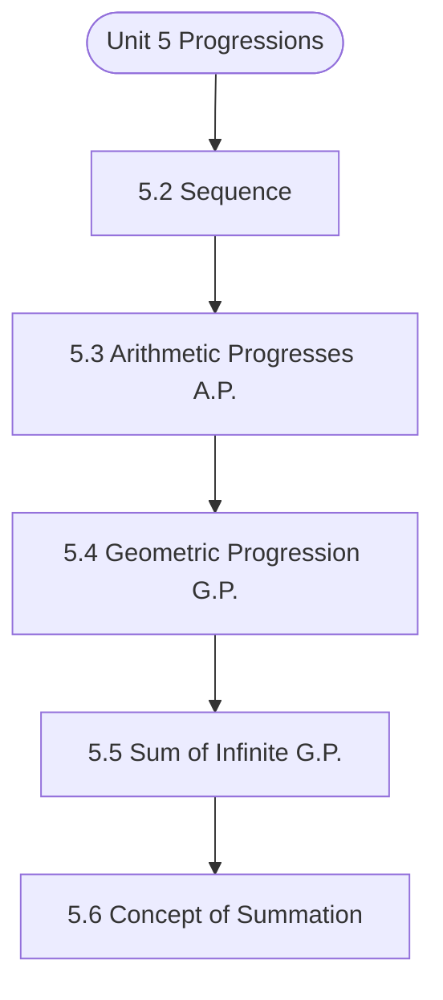

# MCS-061: Mathematical Foundations - I
## Unit 5: Progressions

> 📚 **Programme:** M.Sc. (Data Science and Analytics) | **Semester:** Semester 1  
> ⏱️ **Estimated Study Time:** ~43 mins | 📄 **Textbook Pages:** 22 Pages  
> 📥 **Original PDF:** [Download & View Textbook](../../../pdfs/Semester_1/MCS-061_Mathematical_Foundations_-_I/Unit-5_Progressions.pdf)

---

### 🎯 Executive Concept & Data Science Relevance
In modern data systems, **Progressions** forms a vital conceptual pillar. Calculus powers continuous optimization in Machine Learning. Loss function minimization via Gradient Descent, backpropagation in deep neural networks, and probability density integration all require derivatives, partial differentials, and definite integrals.

> [!NOTE]
> **Why this matters for your career:** Mastering progressions equips you with the foundational principles required to reason mathematically about high-dimensional datasets, evaluate algorithm performance, and avoid statistical pitfalls in production machine learning pipelines.

### 🗺️ Visual Knowledge Architecture
The following concept map illustrates the structural hierarchy and learning trajectory of this module:

### 📖 Core Definitions & Terminology Cards

> 📌 **Derivative $f'(x)$**  
> - **Formal Definition:** The instantaneous rate of change of $f(x)$ with respect to $x$: $f'(x) = \lim_{h \to 0} \frac{f(x+h) - f(x)}{h}$.  
> - 💡 **Practical Intuition & Analogy:** *The slope of the tangent line to the curve at point $x$, indicating direction of steepest increase.*

> 📌 **Gradient $\nabla f(\mathbf{x})$**  
> - **Formal Definition:** The vector of first-order partial derivatives of a multivariate function: $\nabla f = \left[\frac{\partial f}{\partial x_1}, \dots, \frac{\partial f}{\partial x_n}\right]^T$. Points in the direction of greatest rate of increase.  
> - 💡 **Practical Intuition & Analogy:** *The compass pointing uphill on a multidimensional loss landscape.*

> 📌 **Definite Integral**  
> - **Formal Definition:** The signed area under curve $f(x)$ bounded by $[a, b]$: $\int_a^b f(x) dx = F(b) - F(a)$ where $F'(x) = f(x)$.  
> - 💡 **Practical Intuition & Analogy:** *Accumulating continuous probabilities or continuous signals across a range of values.*

> 📌 **Critical Point**  
> - **Formal Definition:** A point $x_0$ where $f'(x_0) = 0$ or the derivative is undefined. Evaluated with second derivative $f''(x_0) > 0$ (local min) or $f''(x_0) < 0$ (local max).  
> - 💡 **Practical Intuition & Analogy:** *The bottom of the valley where model training reaches minimal loss.*

### ⚡ Governing Mathematical Laws & Formula Cheatsheet
#### 🔹 Chain Rule for Composite Functions
$$
\frac{d}{dx}[f(g(x))] = f'(g(x)) \cdot g'(x)
$$
- **Explanation:** The mathematical foundation of deep learning backpropagation through multi-layer neural networks.

#### 🔹 Product and Quotient Rules
$$
(uv)' = u'v + uv', \quad \left(\frac{u}{v}\right)' = \frac{u'v - uv'}{v^2}
$$
- **Explanation:** Rules for differentiating multiplied or divided feature combinations.

#### 🔹 Gradient Descent Parameter Update
$$
\mathbf{w}^{(t+1)} = \mathbf{w}^{(t)} - \alpha \nabla_{\mathbf{w}} \mathcal{L}(\mathbf{w})
$$
- **Explanation:** Iterative step against the gradient direction scaled by learning rate $\alpha$ to reach minimal loss.

#### 🔹 Taylor Series Expansion (First-Order Approximation)
$$
f(x) \approx f(a) + f'(a)(x - a) + \frac{f''(a)}{2!}(x - a)^2
$$
- **Explanation:** Approximates complex non-linear loss surfaces locally using tangent hyperplanes and quadratic forms.

### 📌 Detailed Section-by-Section Study Breakdown
#### `5.2` Sequence
- **Core Concept:** Establishes theoretical foundations, axiomatic formulations, and properties of sequence.
- **Core Concept:** Analyzes standard algorithmic workflows and mathematical transformations relevant to progressions.
- **Core Concept:** Applies computational bounds and optimization guarantees across data processing workflows.
- **Data Science Application:** Provides foundational structures used directly in statistical modeling, query execution, and machine learning pipelines.

> [!TIP]
> **Exam & Interview Tip:** Be prepared to state the formal definition of sequence and derive its primary equations step-by-step.

#### `5.3` Arithmetic Progresses (A.P.)
- **Core Concept:** Some sequences follow a certain pattern.
- **Core Concept:** An Arithmetic progression (A.P.) is also a sequence which follows a particular pattern as defined below.
- **Core Concept:** Arithmetic progression (A.P.): A sequence   n n a or } a { is said to be arithmetic progression (A.P.) if ...
- **Data Science Application:** Provides foundational structures used directly in statistical modeling, query execution, and machine learning pipelines.

> [!TIP]
> **Exam & Interview Tip:** Be prepared to state the formal definition of arithmetic progresses (a.p.) and derive its primary equations step-by-step.

#### `5.4` Geometric Progression (G.P.)
- **Core Concept:** A sequence } a { n is said to be geometric progression (G.P.) if N n r a a n 1 n   = + i.e.
- **Core Concept:** ratio of any term to its preceding term is same (remains constant).
- **Core Concept:** where r is a non zero fixed constant and is known as common ratio For example, 3, 6, 12, 24, 48, … is G.P.
- **Data Science Application:** Provides foundational structures used directly in statistical modeling, query execution, and machine learning pipelines.

> [!TIP]
> **Exam & Interview Tip:** Be prepared to state the formal definition of geometric progression (g.p.) and derive its primary equations step-by-step.

#### `5.5` Sum of Infinite G.P.
- **Core Concept:** A geometric progression (G.P.) is said to be infinite G.P.
- **Core Concept:** will be finite if common ratio is less than 1 in magnitude.
- **Core Concept:** Let S denotes the sum of the infinite G.P.
- **Data Science Application:** Provides foundational structures used directly in statistical modeling, query execution, and machine learning pipelines.

> [!TIP]
> **Exam & Interview Tip:** Be prepared to state the formal definition of sum of infinite g.p. and derive its primary equations step-by-step.

#### `5.6` Concept of Summation
- **Core Concept:** to  is a sequence then expression  + + + to ...
- **Core Concept:** This series in the form of summation is written as   =1 n n a 18 Progressions i.e.
- **Core Concept:** a a a 3 2 1 In case of finite expression n 3 2 1 x ...
- **Data Science Application:** Provides foundational structures used directly in statistical modeling, query execution, and machine learning pipelines.

> [!TIP]
> **Exam & Interview Tip:** Be prepared to state the formal definition of concept of summation and derive its primary equations step-by-step.

#### `5.7` Sum of some Special Sequences
- **Core Concept:** Following are given sum of some special sequences as they will be helpful at various occasions during study of the programme.
- **Core Concept:** Always keep these in mind 19 Progression, Matrices and Determinants (1) 2 )1 n ( n n ...
- **Core Concept:** 3 2 1 k n n 1 k + = + + + + = =   = = sum of first n natural numbers.
- **Data Science Application:** Provides foundational structures used directly in statistical modeling, query execution, and machine learning pipelines.

> [!TIP]
> **Exam & Interview Tip:** Be prepared to state the formal definition of sum of some special sequences and derive its primary equations step-by-step.

### 💡 Interactive Self-Assessment Checkpoints
Test your comprehension before proceeding. Tap each question to reveal the comprehensive explanation:

<b>Checkpoint 1:</b> What is the Chain Rule and why is it essential in Deep Learning? <i>(Tap to reveal answer)</i>

> **Answer & Analysis:**  
> The Chain Rule states $\frac{dy}{dx} = \frac{dy}{du} \cdot \frac{du}{dx}$. In deep networks, it allows computing the gradient of the loss with respect to early layer weights by propagating backwards layer-by-layer.

<b>Checkpoint 2:</b> How do you classify a critical point where $f'(x) = 0$ using the Second Derivative Test? <i>(Tap to reveal answer)</i>

> **Answer & Analysis:**  
> If $f''(x) > 0$, the point is a **local minimum**. If $f''(x) < 0$, it is a **local maximum**. If $f''(x) = 0$, the test is inconclusive (inflection point).

<b>Checkpoint 3:</b> What is the derivative of $\ln(x)$ and $e^x$? <i>(Tap to reveal answer)</i>

> **Answer & Analysis:**  
> $\frac{d}{dx}[\ln(x)] = \frac{1}{x}$ (for $x > 0$), and $\frac{d}{dx}[e^x] = e^x$.

<b>Checkpoint 4:</b> (i) If 5k + 1, 6k + 5 and 10k + 3 are three consecutive terms of an A.P. then find k. (ii) Is <i>(Tap to reveal answer)</i>

> **Answer & Analysis:**  
> This question tests your conceptual mastery of Progressions. Review the governing formulas and section breakdowns above to formulate a complete, rigorous proof or derivation.

<b>Checkpoint 5:</b> (i) Find the 10th term of the G.P. 128, 32, 8, 2, … (ii) <i>(Tap to reveal answer)</i>

> **Answer & Analysis:**  
> This question tests your conceptual mastery of Progressions. Review the governing formulas and section breakdowns above to formulate a complete, rigorous proof or derivation.

<b>Checkpoint 6:</b> – (5k + 1) = (10k + 3) – (6k + 5)   <i>(Tap to reveal answer)</i>

> **Answer & Analysis:**  
> This question tests your conceptual mastery of Progressions. Review the governing formulas and section breakdowns above to formulate a complete, rigorous proof or derivation.

### 🎯 Executive Module Wrap-Up
- **Central Idea:** Progressions provides essential mathematical and algorithmic tools directly utilized in Data Science.
- **Mathematical Rigor:** Formulas and laws must be memorized with attention to boundary conditions and assumptions.
- **Full Textbook Coverage:** For exhaustive multi-page derivations, proofs, and supplementary exercises, consult the [Authentic IGNOU Textbook](../../../pdfs/Semester_1/MCS-061_Mathematical_Foundations_-_I/Unit-5_Progressions.pdf).

---
### 🧭 Navigation & Syllabus Index
[⬅ Previous: Unit 4](unit_04_Graphical_Representation_of_Functions.md) | [📑 Course Index](README.md) | [Next: Unit 6 ➡](unit_06_Matrix_Algebra.md)
