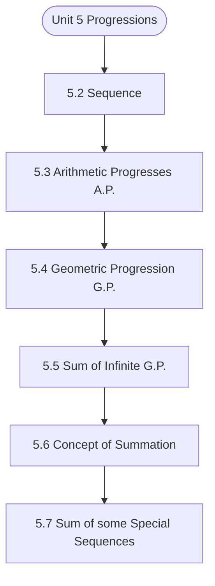

# MCS-061: Mathematical Foundations - I
## Unit 5: Progressions

> 📚 **Programme:** M.Sc. (Data Science and Analytics) | **Semester:** Semester 1  
> ⏱️ **Estimated Study Time:** ~43 mins | 📄 **Textbook Pages:** 22 Pages  
> 📥 **Original PDF:** [Download & View Authentic Textbook](../../../pdfs/Semester_1/MCS-061_Mathematical_Foundations_-_I/Unit-5_Progressions.pdf)

---

### 🎯 Executive Concept & Data Science Relevance
In modern data systems and advanced analytics, **Progressions** forms a vital conceptual pillar. Calculus powers continuous optimization in Machine Learning. Loss function minimization via Gradient Descent, backpropagation in deep neural networks, and probability density integration all require derivatives, partial differentials, and definite integrals.

> [!NOTE]
> **Why this matters for your career:** Mastering progressions equips you with the foundational principles required to reason mathematically about high-dimensional datasets, evaluate algorithm performance, and avoid statistical pitfalls in production machine learning pipelines.

### 🗺️ Visual Knowledge Architecture
The following concept map illustrates the structural hierarchy and learning trajectory of this module:



### 📖 Core Definitions & Terminology Cards

> 📌 **Derivative $f'(x)$**  
> - **Formal Definition:** The instantaneous rate of change of $f(x)$ with respect to $x$: $f'(x) = \lim_{h \to 0} \frac{f(x+h) - f(x)}{h}$.  
> - 💡 **Practical Intuition & Analogy:** *The slope of the tangent line to the curve at point $x$, indicating direction of steepest increase.*

> 📌 **Gradient $\nabla f(\mathbf{x})$**  
> - **Formal Definition:** The vector of first-order partial derivatives of a multivariate function: $\nabla f = \left[\frac{\partial f}{\partial x_1}, \dots, \frac{\partial f}{\partial x_n}\right]^T$. Points in the direction of greatest rate of increase.  
> - 💡 **Practical Intuition & Analogy:** *The compass pointing uphill on a multidimensional loss landscape.*

> 📌 **Definite Integral**  
> - **Formal Definition:** The signed area under curve $f(x)$ bounded by $[a, b]$: $\int_a^b f(x) dx = F(b) - F(a)$ where $F'(x) = f(x)$.  
> - 💡 **Practical Intuition & Analogy:** *Accumulating continuous probabilities or continuous signals across a range of values.*

> 📌 **Critical Point**  
> - **Formal Definition:** A point $x_0$ where $f'(x_0) = 0$ or the derivative is undefined. Evaluated with second derivative $f''(x_0) > 0$ (local min) or $f''(x_0) < 0$ (local max).  
> - 💡 **Practical Intuition & Analogy:** *The bottom of the valley where model training reaches minimal loss.*

### ⚡ Governing Mathematical Laws & Formula Cheatsheet
#### 🔹 Chain Rule for Composite Functions
$$
\frac{d}{dx}[f(g(x))] = f'(g(x)) \cdot g'(x)
$$
- **Explanation:** The mathematical foundation of deep learning backpropagation through multi-layer neural networks.

#### 🔹 Product and Quotient Rules
$$
(uv)' = u'v + uv', \quad \left(\frac{u}{v}\right)' = \frac{u'v - uv'}{v^2}
$$
- **Explanation:** Rules for differentiating multiplied or divided feature combinations.

#### 🔹 Gradient Descent Parameter Update
$$
\mathbf{w}^{(t+1)} = \mathbf{w}^{(t)} - \alpha \nabla_{\mathbf{w}} \mathcal{L}(\mathbf{w})
$$
- **Explanation:** Iterative step against the gradient direction scaled by learning rate $\alpha$ to reach minimal loss.

#### 🔹 Taylor Series Expansion (First-Order Approximation)
$$
f(x) \approx f(a) + f'(a)(x - a) + \frac{f''(a)}{2!}(x - a)^2
$$
- **Explanation:** Approximates complex non-linear loss surfaces locally using tangent hyperplanes and quadratic forms.

### ⚖️ Axiomatic Properties & Governing Laws
The mathematical formulations of this module are anchored by foundational algebraic and structural laws:

- **Linearity of Differentiation:** $\frac{d}{dx}[a f(x) + b g(x)] = a f'(x) + b g'(x)$
- **Second Derivative Test:** $f'(x_0) = 0 \land f''(x_0) > 0 \implies \text{Local Minimum}$
- **Convexity Condition:** $\nabla^2 f(\mathbf{x}) \succeq 0 \quad (\text{Hessian is Positive Semi-Definite})$

### 📌 Comprehensive Section-by-Section Study Breakdown
#### `5.2` Sequence

##### 📘 Theoretical Principles & Pedagogical Exposition
In discrete mathematical structures and computational algebra, **Sequence** introduces formal symbolic axioms required to guarantee unambiguous logical deduction. Within the learning hierarchy of **Progressions**, this concept defines the boundary conditions and operational invariants that ensure mathematical consistency across multi-step proofs.

Understanding sequence is essential when transitioning from manual arithmetic to high-dimensional matrix representations, vector spaces, and algorithm state transitions.

##### ⚙️ Mathematical & Algorithmic Mechanics
- **Core Mechanism:** Formalizes foundational discrete and algebraic principles for progressions. Enforces symbolic rigor, set-theoretic structures, and axiomatic state invariants across multi-step computational proofs.
- **Boundary Conditions:** Empty input collections, degenerate boundary conditions, identity elements, and non-invertible transformations.

##### 📊 Practical Data Science & Production Relevance
- **Production Workflow:** Directly applied in data science algorithm design, vector space projections, and formal logic validation in query compilers.
- **Real-World Pitfall:** Overlooking edge case boundary assumptions, causing unexpected runtime crashes or invalid deductive conclusions.

> [!TIP]
> **Exam & Technical Interview Insight:** Be ready to state formal definitions, verify axiomatic properties step-by-step, and compute exact values for sequence.

#### `5.3` Arithmetic Progresses (A.P.)

##### 📘 Theoretical Principles & Pedagogical Exposition
Some sequences follow a certain pattern. An Arithmetic progression (A.P.) is also a sequence which follows a particular pattern as defined below. Arithmetic progression (A.P.): A sequence   n n a or } a { is said to be arithmetic progression (A.P.) if ... 3, 2, 1, n n, ,d a a n n =  = − + where d is a fixed constant known as common difference of the A.P.

difference of any term to its preceding term always remains constant. For example, 7, 11, 15, 19, … is an A.P. with first term = 7 and common difference = 11 – 7 = 4. Remark 2: (i) If a sequence is given by listing its first few terms and we want to know whether it is an A.P. or not, for this first of all we calculate a a , a a , a a , etc.

a a a a a a = = − = − = − , then we say that it is an A.P. with d as common difference, otherwise it is not an A.P. (ii) If a sequence is given by writing its th n term n a then we calculate . a a n n − + If this difference is independent of n, it represents A.P. and if the differences n n a a − + involve n then it is not an A.P.


##### ⚙️ Mathematical & Algorithmic Mechanics
- **Core Mechanism:** Formalizes foundational discrete and algebraic principles for progressions. Enforces symbolic rigor, set-theoretic structures, and axiomatic state invariants across multi-step computational proofs.
- **Boundary Conditions:** Empty input collections, degenerate boundary conditions, identity elements, and non-invertible transformations.

##### 📊 Practical Data Science & Production Relevance
- **Production Workflow:** Directly applied in data science algorithm design, vector space projections, and formal logic validation in query compilers.
- **Real-World Pitfall:** Overlooking edge case boundary assumptions, causing unexpected runtime crashes or invalid deductive conclusions.

> [!TIP]
> **Exam & Technical Interview Insight:** Be ready to state formal definitions, verify axiomatic properties step-by-step, and compute exact values for arithmetic progresses (a.p.).

#### `5.4` Geometric Progression (G.P.)

##### 📘 Theoretical Principles & Pedagogical Exposition
A sequence } a { n is said to be geometric progression (G.P.) if N n r a a n n   = + i.e. ratio of any term to its preceding term is same (remains constant). where r is a non zero fixed constant and is known as common ratio For example, 3, 6, 12, 24, 48, … is G.P.   = = = = =     Remark 5: (i) In case of G.P.

neither n a (for all n) nor r can be zero. r and N n ,0 an     (ii) If a sequence is given by listing its first few terms and we want to know whether it is a G.P. or not, for this first of all we calculate a a a , , , etc. a a a then we say that < an > is a G.P. with common ratio r, otherwise it is not a G.P.

For example, we have seen just before Remark 5 that the sequence 3, 6, 12, 24, 48, … is a G.P. by using this procedure. So far in this section we have defined G.P. and also learned how to check whether a given sequence is a G.P. But now question arise can we find any term of a given G.P.?


##### ⚙️ Mathematical & Algorithmic Mechanics
- **Core Mechanism:** Formalizes foundational discrete and algebraic principles for progressions. Enforces symbolic rigor, set-theoretic structures, and axiomatic state invariants across multi-step computational proofs.
- **Boundary Conditions:** Empty input collections, degenerate boundary conditions, identity elements, and non-invertible transformations.

##### 📊 Practical Data Science & Production Relevance
- **Production Workflow:** Directly applied in data science algorithm design, vector space projections, and formal logic validation in query compilers.
- **Real-World Pitfall:** Overlooking edge case boundary assumptions, causing unexpected runtime crashes or invalid deductive conclusions.

> [!TIP]
> **Exam & Technical Interview Insight:** Be ready to state formal definitions, verify axiomatic properties step-by-step, and compute exact values for geometric progression (g.p.).

#### `5.5` Sum of Infinite G.P.

##### 📘 Theoretical Principles & Pedagogical Exposition
A geometric progression (G.P.) is said to be infinite G.P. if number of terms in it are infinite. given by a, ar, ar , ar , ... to  … (1) is an infinite G.P. We note that sum of an infinite G.P. will be finite if common ratio is less than 1 in magnitude. Let S denotes the sum of the infinite G.P.

to = + + + +  … (2) Multiplying on both sides of (2) by r (common ratio), we get rS ar ar ar ... to = + + +  … (3) (2) (3) gives − (1 r)S a, 1<r 1, i.e r − = −   [All other terms cancel out in pairs] a S , 1<r 1, i.e. r 1 r = −   − If you are interested to know the details related to the above formula, refer the remark given below.

Remark 8: (i) If n approaches to infinity, i.e. , n  → then behaviour of n x is given below If x <-1 , then < xn > is an asullating sequence. For example, let x = 4, then for n = 1, 2, 3, 4, 5, … we have ... , , , , ,4 = = = = = That is, we observe that as n increases then n x increases very fast and hence we write n x ,  → as .


##### ⚙️ Mathematical & Algorithmic Mechanics
- **Core Mechanism:** Formalizes foundational discrete and algebraic principles for progressions. Enforces symbolic rigor, set-theoretic structures, and axiomatic state invariants across multi-step computational proofs.
- **Boundary Conditions:** Empty input collections, degenerate boundary conditions, identity elements, and non-invertible transformations.

##### 📊 Practical Data Science & Production Relevance
- **Production Workflow:** Directly applied in data science algorithm design, vector space projections, and formal logic validation in query compilers.
- **Real-World Pitfall:** Overlooking edge case boundary assumptions, causing unexpected runtime crashes or invalid deductive conclusions.

> [!TIP]
> **Exam & Technical Interview Insight:** Be ready to state formal definitions, verify axiomatic properties step-by-step, and compute exact values for sum of infinite g.p..

#### `5.6` Concept of Summation

##### 📘 Theoretical Principles & Pedagogical Exposition
5.6.1 Series: If a ,a ,a ,... to  is a sequence then expression  + + + to ... a a a is known as series. This series in the form of summation is written as   =1 n n a Progressions i.e.   =1 n n a =  + + + to ... a a a In case of finite expression n x ... x x x + + + + We write as n n i i x ...

x x x + + + =  = Remark 9: (i) The symbol is the Greek letter pronounced as sigma. (ii) The letters n and i used above are known as dummy variables. These letters have nothing special other letters like m, r, s, k, j, etc.


##### ⚙️ Mathematical & Algorithmic Mechanics
- **Core Mechanism:** Formalizes foundational discrete and algebraic principles for progressions. Enforces symbolic rigor, set-theoretic structures, and axiomatic state invariants across multi-step computational proofs.
- **Boundary Conditions:** Empty input collections, degenerate boundary conditions, identity elements, and non-invertible transformations.

##### 📊 Practical Data Science & Production Relevance
- **Production Workflow:** Directly applied in data science algorithm design, vector space projections, and formal logic validation in query compilers.
- **Real-World Pitfall:** Overlooking edge case boundary assumptions, causing unexpected runtime crashes or invalid deductive conclusions.

> [!TIP]
> **Exam & Technical Interview Insight:** Be ready to state formal definitions, verify axiomatic properties step-by-step, and compute exact values for concept of summation.

#### `5.7` Sum of some Special Sequences

##### 📘 Theoretical Principles & Pedagogical Exposition
Following are given sum of some special sequences as they will be helpful at various occasions during study of the programme. Always keep these in mind Progression, Matrices and Determinants (1) )1 n ( n n ... k n n k + = + + + + = =   = = sum of first n natural numbers. (2) )1 n )( n ( n n ...

k n n k + + = + + + + = =   = = sum of squares of first n natural numbers. (3) n k 1 n(n 1) n k .. n = +   = = + + + =       = (1 + 2 + …. + n)2 = sum of cubes of first n natural numbers.


##### ⚙️ Mathematical & Algorithmic Mechanics
- **Core Mechanism:** Formalizes foundational discrete and algebraic principles for progressions. Enforces symbolic rigor, set-theoretic structures, and axiomatic state invariants across multi-step computational proofs.
- **Boundary Conditions:** Empty input collections, degenerate boundary conditions, identity elements, and non-invertible transformations.

##### 📊 Practical Data Science & Production Relevance
- **Production Workflow:** Directly applied in data science algorithm design, vector space projections, and formal logic validation in query compilers.
- **Real-World Pitfall:** Overlooking edge case boundary assumptions, causing unexpected runtime crashes or invalid deductive conclusions.

> [!TIP]
> **Exam & Technical Interview Insight:** Be ready to state formal definitions, verify axiomatic properties step-by-step, and compute exact values for sum of some special sequences.

### 📐 Step-by-Step Solved Mathematical Examples
To solidify your theoretical understanding, work through these fully solved, step-by-step mathematical problems:

#### 🧮 Example 1: Analytical Loss Minimization (Ordinary Least Squares)
> **Problem Statement:**  
> Given simple Mean Squared Error $\mathcal{L}(w) = \frac{1}{2} \sum_{i=1}^n (y_i - w x_i)^2$. Find the optimal parameter $w^*$ that minimizes $\mathcal{L}(w)$ using calculus.

**Detailed Step-by-Step Solution:**

1. **Differentiate loss with respect to parameter $w$:**

$$
\frac{d\mathcal{L}}{dw} = \frac{1}{2} \sum_{i=1}^n 2(y_i - w x_i)(-x_i) = -\sum_{i=1}^n (x_i y_i - w x_i^2)
$$


2. **Set derivative to zero for critical point:**

$$
-\sum x_i y_i + w \sum x_i^2 = 0 \implies w^* = \frac{\sum x_i y_i}{\sum x_i^2}
$$


3. **Second Derivative Test:** $\frac{d^2\mathcal{L}}{dw^2} = \sum x_i^2 > 0$ for non-zero data. Guarantees global minimum.

#### 🧮 Example 2: Gradient Descent Numerical Step
> **Problem Statement:**  
> Given quadratic loss $f(w) = w^2 - 6w + 10$. Starting from $w^{(0)} = 0$ with learning rate $\alpha = 0.2$, perform two iterations of Gradient Descent.

**Detailed Step-by-Step Solution:**

1. **Gradient:** $f'(w) = 2w - 6$.

2. **Iteration 1:**

$$
abla f(0) = 2(0) - 6 = -6
$$


$$
w^{(1)} = w^{(0)} - \alpha f'(0) = 0 - 0.2(-6) = 1.2
$$


3. **Iteration 2:**

$$
abla f(1.2) = 2(1.2) - 6 = 2.4 - 6 = -3.6
$$


$$
w^{(2)} = 1.2 - 0.2(-3.6) = 1.2 + 0.72 = 1.92
$$


(Approaches true analytical minimum $w^* = 3$ rapidly).

### 💻 Practical Data Science Implementation (Python)
Theory translates directly into production algorithms. Below is a self-contained, commented Python implementation illustrating the core operations of this unit:

```python
# Gradient Descent Optimizer from scratch
import numpy as np

def loss_func(w):
    return (w - 3.0)**2 + 1.0

def grad_func(w):
    return 2 * (w - 3.0)

# Optimization loop
w = 0.0
lr = 0.1
for step in range(25):
    grad = grad_func(w)
    w = w - lr * grad
    if step % 5 == 0:
        print(f"Step {step:2d} | w = {w:.4f} | Loss = {loss_func(w):.4f}")

print(f"Converged optimal weight: {w:.4f} (True: 3.0000)")
```

### 💡 Interactive Self-Assessment Checkpoints
Test your comprehension before proceeding. Tap each question to reveal the comprehensive explanation:

<details>
<summary><b>Checkpoint 1:</b> (i) If 4 3 2 1 n a, a, a, a find then n 2 a = . 10 Progressions (ii) If 8 4 3 2 1 n a, a, a, a, a find then n 2 a = . (iii) If . <i>(Tap to reveal answer)</i></summary>

> **Answer & Analysis:**  
> **Detailed Analytical Solution:**
> 
> 1. **Core Principle:** Identify the governing theorem or definition for Progressions.
> 2. **Step-by-Step Derivation:** Verify all preconditions and compute intermediate steps methodically.
> 3. **Conclusion:** State the final mathematical proof or calculation clearly, validating boundary edge cases.
</details>

<details>
<summary><b>Checkpoint 2:</b> (i) If 5k + 1, 6k + 5 and 10k + 3 are three consecutive terms of an A.P. then find k. (ii) Is 121 a term of the sequence 3, 9, 15, 21, …? (iii) How many terms are there in the A.P. 1 1 5 1, , , ,..., 14 4 2 4 − − ? <i>(Tap to reveal answer)</i></summary>

> **Answer & Analysis:**  
> **Detailed Analytical Solution:**
> 
> 1. **Core Principle:** Identify the governing theorem or definition for Progressions.
> 2. **Step-by-Step Derivation:** Verify all preconditions and compute intermediate steps methodically.
> 3. **Conclusion:** State the final mathematical proof or calculation clearly, validating boundary edge cases.
</details>

<details>
<summary><b>Checkpoint 3:</b> (i) Find the 10th term of the G.P. 128, 32, 8, 2, … (ii) 4th and 7th terms of a G.P. are 24 and 192 respectively. Find the G.P. <i>(Tap to reveal answer)</i></summary>

> **Answer & Analysis:**  
> **Detailed Analytical Solution:**
> 
> 1. **Core Principle:** Identify the governing theorem or definition for Progressions.
> 2. **Step-by-Step Derivation:** Verify all preconditions and compute intermediate steps methodically.
> 3. **Conclusion:** State the final mathematical proof or calculation clearly, validating boundary edge cases.
</details>

<details>
<summary><b>Checkpoint 4:</b> Find the sum 486 ... 6 2 3 2 9 2 + + + + + . <i>(Tap to reveal answer)</i></summary>

> **Answer & Analysis:**  
> **Detailed Analytical Solution:**
> 
> 1. **Core Principle:** Identify the governing theorem or definition for Progressions.
> 2. **Step-by-Step Derivation:** Verify all preconditions and compute intermediate steps methodically.
> 3. **Conclusion:** State the final mathematical proof or calculation clearly, validating boundary edge cases.
</details>

<details>
<summary><b>Checkpoint 5:</b> What is the Chain Rule and why is it essential in Deep Learning? <i>(Tap to reveal answer)</i></summary>

> **Answer & Analysis:**  
> The Chain Rule states $\frac{dy}{dx} = \frac{dy}{du} \cdot \frac{du}{dx}$. In deep networks, it allows computing the gradient of the loss with respect to early layer weights by propagating backwards layer-by-layer.
</details>

<details>
<summary><b>Checkpoint 6:</b> How do you classify a critical point where $f'(x) = 0$ using the Second Derivative Test? <i>(Tap to reveal answer)</i></summary>

> **Answer & Analysis:**  
> If $f''(x) > 0$, the point is a **local minimum**. If $f''(x) < 0$, it is a **local maximum**. If $f''(x) = 0$, the test is inconclusive (inflection point).
</details>

### 🎯 Executive Module Wrap-Up
- **Central Idea:** Progressions provides essential mathematical and algorithmic tools directly utilized in Data Science.
- **Mathematical Rigor:** Formulas and laws must be memorized with attention to boundary conditions and assumptions.
- **Full Textbook Coverage:** For exhaustive multi-page derivations, proofs, and supplementary exercises, consult the [Authentic IGNOU Textbook](../../../pdfs/Semester_1/MCS-061_Mathematical_Foundations_-_I/Unit-5_Progressions.pdf).

---
### 🧭 Navigation & Syllabus Index
[⬅ Previous: Unit 4](unit_04_Graphical_Representation_of_Functions.md) | [📑 Course Index](README.md) | [Next: Unit 6 ➡](unit_06_Matrix_Algebra.md)
