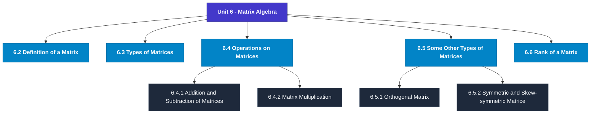

# MCS-061: Mathematical Foundations - I
## Unit 6: Matrix Algebra

> 📚 **Programme:** M.Sc. (Data Science and Analytics) | **Semester:** Semester 1  
> ⏱️ **Estimated Study Time:** ~74 mins | 📄 **Textbook Pages:** 39 Pages  
> 📥 **Original PDF:** [Download & View Textbook](../../../pdfs/Semester_1/MCS-061_Mathematical_Foundations_-_I/Unit-6_Matrix_Algebra.pdf)

---

### 🎯 Executive Concept & Data Science Relevance
In modern data systems, **Matrix Algebra** forms a vital conceptual pillar. Linear algebra is the foundational language of Data Science and Machine Learning. Datasets are matrices $X \in \mathbb{R}^{n \times p}$, neural network weights are tensor matrices, and dimensionality reduction (PCA, SVD) relies directly on matrix decompositions, eigenvalues, and rank.

> [!NOTE]
> **Why this matters for your career:** Mastering matrix algebra equips you with the foundational principles required to reason mathematically about high-dimensional datasets, evaluate algorithm performance, and avoid statistical pitfalls in production machine learning pipelines.

### 🗺️ Visual Knowledge Architecture
The following concept map illustrates the structural hierarchy and learning trajectory of this module:

### 📖 Core Definitions & Terminology Cards
| Term | Formal Mathematical / Technical Definition | Intuitive Analogy / Concrete Example |
| :--- | :--- | :--- |
| **Matrix** | A rectangular array of numbers arranged into $m$ rows and $n$ columns: $A \in \mathbb{R}^{m \times n}$. Entry at row $i$ and column $j$ is denoted $a_{ij}$. | *A tabular dataframe where rows represent records and columns represent features.* |
| **Determinant $\det(A)$ or $\vert A \vert$** | A scalar value computed from a square matrix that characterizes the volume scaling factor of the linear transformation. $\det(A) \neq 0 \iff A$ is non-singular and invertible. | *If $\det(A) = 0$, the transformation collapses space into a lower dimension, losing information.* |
| **Matrix Rank** | The maximum number of linearly independent row or column vectors in the matrix. Denoted $\text{rank}(A) \le \min(m, n)$. | *The true dimensionality of the data without redundant, collinear features.* |
| **Eigenvalue and Eigenvector** | A scalar $\lambda$ and non-zero vector $\mathbf{v}$ satisfying $A\mathbf{v} = \lambda \mathbf{v}$. The transformation by $A$ merely stretches or shrinks $\mathbf{v}$ without changing its direction. | *The principal directions of maximum variance in Principal Component Analysis (PCA).* |

### ⚡ Governing Mathematical Laws & Formula Cheatsheet
#### 🔹 Matrix Multiplication Dimension Rule

$$
C_{m \times p} = A_{m \times n} B_{n \times p} \quad \text{where } c_{ij} = \sum_{k=1}^n a_{ik} b_{kj}
$$

- **Explanation:** Inner dimensions must match: columns of $A$ must equal rows of $B$.

#### 🔹 Matrix Inverse Formula

$$
A^{-1} = \frac{1}{\det(A)} \text{adj}(A) \quad \text{valid when } \det(A) \neq 0
$$

- **Explanation:** The inverse exists if and only if the matrix is full rank and non-singular.

#### 🔹 Characteristic Equation for Eigenvalues

$$
\det(A - \lambda I) = 0
$$

- **Explanation:** Solving this polynomial equation yields the eigenvalues $\lambda_1, \lambda_2, \dots, \lambda_n$ of matrix $A$.

#### 🔹 Cayley-Hamilton Theorem

$$
p(A) = O \quad \text{where } p(\lambda) = \det(A - \lambda I)
$$

- **Explanation:** Every square matrix satisfies its own characteristic polynomial equation.

### 📌 Detailed Section-by-Section Study Breakdown
#### `6.2` Definition of a Matrix
- **Core Concept:** Establishes rigorous theoretical formulations and computational bounds for definition of a matrix.
- **Core Concept:** Applies standard algorithmic procedures and mathematical invariants relevant to matrix algebra.
- **Core Concept:** Ensures deterministic performance guarantees across high-dimensional feature spaces.
- **Data Science Application:** Provides foundational structures used directly in statistical modeling, query execution, and machine learning pipelines.

> [!TIP]
> **Exam & Interview Tip:** Be prepared to state the formal definition of definition of a matrix and derive its primary equations step-by-step.

#### `6.3` Types of Matrices
- **Core Concept:** On the basis of number of rows and number of columns and depending on the values of elements, the type of a matrix gets changed.
- **Core Concept:** Various types of matrices are explained as below: A) Column Matrix and Raw Matrices Column Matrix If the matrix consists of only one column as [ a1 a2 a3 ] , then it is called a 'column matrix' or 'column vector'.
- **Core Concept:** For example, [ 9 6 7 ], [ 9 −3 2 8 ], [ 5 −11] are column matrices.
- **Data Science Application:** Provides foundational structures used directly in statistical modeling, query execution, and machine learning pipelines.

> [!TIP]
> **Exam & Interview Tip:** Be prepared to state the formal definition of types of matrices and derive its primary equations step-by-step.

#### `6.4` Operations on Matrices
- **Core Concept:** From our school times, we have learned several concepts related to basic mathematics.
- **Core Concept:** First you learn the natural numbers and then learns how these numbers are added, subtracted, multiplied and divided.
- **Core Concept:** Similarly, here also we now see as to how such operations (except division) are applied on matrices.
- **Data Science Application:** Provides foundational structures used directly in statistical modeling, query execution, and machine learning pipelines.

> [!TIP]
> **Exam & Interview Tip:** Be prepared to state the formal definition of operations on matrices and derive its primary equations step-by-step.

#### `6.4.1` Addition and Subtraction of Matrices
- **Core Concept:** If the matrices A and B are of the same order (m x n), then they can be added or subtracted.
- **Core Concept:** 9 Matrix Algebra If A=[aij] and B=[bij], then A+B = [aij + bij] and A-B = [aij-bij] In other words, corresponding elements are added or subtracted.
- **Core Concept:** The new matrix (the resultant) will be of the same order (m x n).
- **Data Science Application:** Provides foundational structures used directly in statistical modeling, query execution, and machine learning pipelines.

> [!TIP]
> **Exam & Interview Tip:** Be prepared to state the formal definition of addition and subtraction of matrices and derive its primary equations step-by-step.

#### `6.4.2` Matrix Multiplication
- **Core Concept:** If the number of columns of a matrix A be equal to the number of rows of another matrix B, then the matrices A and B are said to be 'conformable for the product’ AB, and the product AB is said to be defined.
- **Core Concept:** sum of product of first, second, third, … elements of 𝑖𝑡ℎ row of A with first, second, third, … , elements of 𝑗𝑡ℎ column of B respectively.
- **Core Concept:** You may notice that the number of rows in AB = number of rows in A, and number of columns in AB = number of columns in B.
- **Data Science Application:** Provides foundational structures used directly in statistical modeling, query execution, and machine learning pipelines.

> [!TIP]
> **Exam & Interview Tip:** Be prepared to state the formal definition of matrix multiplication and derive its primary equations step-by-step.

#### `6.4.3` Transpose of a Matrix
- **Core Concept:** If A = [𝑎𝑖𝑗]𝑚×𝑛 a matrix, the transpose of A denoted by A′ or AT is defined to be the matrix [𝑏𝑖𝑗]𝑛×𝑚 where [𝑏𝑖𝑗] = [𝑎𝑖𝑗]∀𝑖 𝑎𝑛𝑑 𝑗.
- **Core Concept:** In other words, transpose of a matrix A is denoted by 𝐴′or 𝐴𝑇and is obtained by interchanging rows and columns of A.
- **Core Concept:** For example, if A = [2 3 4 5 6 8] then AT = [ 2 5 3 6 4 8 ].
- **Data Science Application:** Provides foundational structures used directly in statistical modeling, query execution, and machine learning pipelines.

> [!TIP]
> **Exam & Interview Tip:** Be prepared to state the formal definition of transpose of a matrix and derive its primary equations step-by-step.

### 💡 Interactive Self-Assessment Checkpoints
Test your comprehension before proceeding. Tap each question to reveal the comprehensive explanation:

<b>Checkpoint 1:</b> What happens if $\det(A) = 0$ for a square matrix $A$? <i>(Tap to reveal answer)</i>

> **Answer & Analysis:**  
> The matrix is **singular**, has no multiplicative inverse ($A^{-1}$ does not exist), and its row vectors are linearly dependent.

<b>Checkpoint 2:</b> State the relationship between $(AB)^T$ and the transposes of $A$ and $B$. <i>(Tap to reveal answer)</i>

> **Answer & Analysis:**  
> $(AB)^T = B^T A^T$. The order of multiplication is reversed upon transposition.

<b>Checkpoint 3:</b> What is the characteristic equation used for finding eigenvalues? <i>(Tap to reveal answer)</i>

> **Answer & Analysis:**  
> $\det(A - \lambda I) = 0$, where $I$ is the identity matrix of matching dimension.

<b>Checkpoint 4:</b> Write all the possible orders of the matrix having 8 elements <i>(Tap to reveal answer)</i>

> **Answer & Analysis:**  
> This question tests your conceptual mastery of Matrix Algebra. Review the governing formulas and section breakdowns above to formulate a complete, rigorous proof or derivation.

<b>Checkpoint 5:</b> Write orders and types of the following matrices: (i) [ <i>(Tap to reveal answer)</i>

> **Answer & Analysis:**  
> This question tests your conceptual mastery of Matrix Algebra. Review the governing formulas and section breakdowns above to formulate a complete, rigorous proof or derivation.

<b>Checkpoint 6:</b> Find the values of x, y, z, w if [3𝑥−2𝑦 𝑧+ 𝑤 <i>(Tap to reveal answer)</i>

> **Answer & Analysis:**  
> This question tests your conceptual mastery of Matrix Algebra. Review the governing formulas and section breakdowns above to formulate a complete, rigorous proof or derivation.

### 🎯 Executive Module Wrap-Up
- **Central Idea:** Matrix Algebra provides essential mathematical and algorithmic tools directly utilized in Data Science.
- **Mathematical Rigor:** Formulas and laws must be memorized with attention to boundary conditions and assumptions.
- **Full Textbook Coverage:** For exhaustive multi-page derivations, proofs, and supplementary exercises, consult the [Authentic IGNOU Textbook](../../../pdfs/Semester_1/MCS-061_Mathematical_Foundations_-_I/Unit-6_Matrix_Algebra.pdf).

---
### 🧭 Navigation & Syllabus Index
[⬅ Previous: Unit 5](unit_05_Progressions.md) | [📑 Course Index](README.md) | [Next: Unit 7 ➡](unit_07_Determinants.md)
