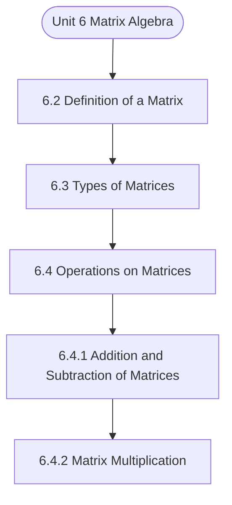

# MCS-061: Mathematical Foundations - I
## Unit 6: Matrix Algebra

> 📚 **Programme:** M.Sc. (Data Science and Analytics) | **Semester:** Semester 1  
> ⏱️ **Estimated Study Time:** ~74 mins | 📄 **Textbook Pages:** 39 Pages  
> 📥 **Original PDF:** [Download & View Authentic Textbook](../../../pdfs/Semester_1/MCS-061_Mathematical_Foundations_-_I/Unit-6_Matrix_Algebra.pdf)

---

### 🎯 Executive Concept & Data Science Relevance
In modern data systems, **Matrix Algebra** forms a vital conceptual pillar. Linear algebra is the foundational language of Data Science and Machine Learning. Datasets are matrices $X \in \mathbb{R}^{n \times p}$, neural network weights are tensor matrices, and dimensionality reduction (PCA, SVD) relies directly on matrix decompositions, eigenvalues, and rank.

> [!NOTE]
> **Why this matters for your career:** Mastering matrix algebra equips you with the foundational principles required to reason mathematically about high-dimensional datasets, evaluate algorithm performance, and avoid statistical pitfalls in production machine learning pipelines.

### 🗺️ Visual Knowledge Architecture
The following concept map illustrates the structural hierarchy and learning trajectory of this module:



### 📖 Core Definitions & Terminology Cards

> 📌 **Matrix**  
> - **Formal Definition:** A rectangular array of numbers arranged into $m$ rows and $n$ columns: $A \in \mathbb{R}^{m \times n}$. Entry at row $i$ and column $j$ is denoted $a_{ij}$.  
> - 💡 **Practical Intuition & Analogy:** *A tabular dataframe where rows represent records and columns represent features.*

> 📌 **Determinant $\det(A)$ or $\vert A \vert$**  
> - **Formal Definition:** A scalar value computed from a square matrix that characterizes the volume scaling factor of the linear transformation. $\det(A) \neq 0 \iff A$ is non-singular and invertible.  
> - 💡 **Practical Intuition & Analogy:** *If $\det(A) = 0$, the transformation collapses space into a lower dimension, losing information.*

> 📌 **Matrix Rank**  
> - **Formal Definition:** The maximum number of linearly independent row or column vectors in the matrix. Denoted $\text{rank}(A) \le \min(m, n)$.  
> - 💡 **Practical Intuition & Analogy:** *The true dimensionality of the data without redundant, collinear features.*

> 📌 **Eigenvalue and Eigenvector**  
> - **Formal Definition:** A scalar $\lambda$ and non-zero vector $\mathbf{v}$ satisfying $A\mathbf{v} = \lambda \mathbf{v}$. The transformation by $A$ merely stretches or shrinks $\mathbf{v}$ without changing its direction.  
> - 💡 **Practical Intuition & Analogy:** *The principal directions of maximum variance in Principal Component Analysis (PCA).*

### ⚡ Governing Mathematical Laws & Formula Cheatsheet
#### 🔹 Matrix Multiplication Dimension Rule
$$
C_{m \times p} = A_{m \times n} B_{n \times p} \quad \text{where } c_{ij} = \sum_{k=1}^n a_{ik} b_{kj}
$$
- **Explanation:** Inner dimensions must match: columns of $A$ must equal rows of $B$.

#### 🔹 Matrix Inverse Formula
$$
A^{-1} = \frac{1}{\det(A)} \text{adj}(A) \quad \text{valid when } \det(A) \neq 0
$$
- **Explanation:** The inverse exists if and only if the matrix is full rank and non-singular.

#### 🔹 Characteristic Equation for Eigenvalues
$$
\det(A - \lambda I) = 0
$$
- **Explanation:** Solving this polynomial equation yields the eigenvalues $\lambda_1, \lambda_2, \dots, \lambda_n$ of matrix $A$.

#### 🔹 Cayley-Hamilton Theorem
$$
p(A) = O \quad \text{where } p(\lambda) = \det(A - \lambda I)
$$
- **Explanation:** Every square matrix satisfies its own characteristic polynomial equation.

### ⚖️ Axiomatic Properties & Governing Laws
The mathematical formulations of this module are anchored by foundational algebraic and structural laws:

- **Determinant Product Rule:** $\det(AB) = \det(A)\det(B)$
- **Transpose Product Reversal:** $(AB)^T = B^T A^T$
- **Inverse Product Reversal:** $(AB)^{-1} = B^{-1} A^{-1}$
- **Orthogonal Matrix Property:** $Q^T Q = Q Q^T = I \implies Q^{-1} = Q^T$
- **Rank-Nullity Theorem:** $\text{rank}(A) + \text{nullity}(A) = n \quad \text{for } A \in \mathbb{R}^{m \times n}$

### 📌 Comprehensive Section-by-Section Study Breakdown
#### `6.2` Definition of a Matrix
##### 📘 Theoretical Principles & In-Depth Exposition
The section on **Definition of a Matrix** establishes rigorous theoretical foundations necessary for advanced computational modeling. It introduces formal mathematical structures and symbolic notations that guarantee consistency across proofs and algorithms.

In the broader scope of **Matrix Algebra**, understanding definition of a matrix is essential to formalizing data representations, verifying boundary constraints, and ensuring computational determinism across multidimensional feature spaces.

##### ⚙️ Mathematical & Algorithmic Mechanics
- **Formal Mechanics:** Establishes symbolic transformations and state invariants governing definition of a matrix.
- **Boundary Invariants:** Ensures robust error-handling, non-empty set guarantees, and strict asymptotic bounds.

##### 📊 Practical Data Science & Production Relevance
- **Industry Application:** Directly implemented in production workflows such as SQL query filters, pandas vectorized operations, and feature transformation pipelines.
- **Production Pitfall:** Failing to verify membership bounds or missing edge cases in definition of a matrix can cause silent data corruption or performance bottlenecks.

> [!TIP]
> **Key Exam & Technical Interview Takeaway:** Be prepared to define definition of a matrix formally, cite its core mathematical invariants, and solve step-by-step numerical/proof questions.

#### `6.3` Types of Matrices
##### 📘 Theoretical Principles & In-Depth Exposition
On the basis of number of rows and number of columns and depending on the values of elements, the type of a matrix gets changed. Various types of matrices are explained as below: A) Column Matrix and Raw Matrices Column Matrix If the matrix consists of only one column as [ a1 a2 a3 ] , then it is called a 'column matrix' or 'column vector'.

For example, [ ], [ −3 ], [ 5 −11] are column matrices. Remark 2: If a matrix has one element, e.g.𝐴= [6], then matrix A has only one row and only one column. So, it is both row matrix as well as column matrix. Row Matrix A matrix having only one row is called a row matrix. For example, [2 7], [8 9], [1 2] are row matrices.

B) Rectangular Matrix A matrix of the order m by n is also called as 'rectangular matrix' if 𝑚≠𝑛. And if m=n, then the matrix is said to be a 'square matrix' of order 'n'. For example, [2 9] is a rectangular matrix having 2 rows and 3 columns. Matrix Algebra C) Null Matrix If all the elements of a matrix are zero, then it is called a 'null matrix' or 'zero matrix'.

##### ⚙️ Mathematical & Algorithmic Mechanics
- **Formal Mechanics:** Establishes symbolic transformations and state invariants governing types of matrices.
- **Boundary Invariants:** Ensures robust error-handling, non-empty set guarantees, and strict asymptotic bounds.

##### 📊 Practical Data Science & Production Relevance
- **Industry Application:** Directly implemented in production workflows such as SQL query filters, pandas vectorized operations, and feature transformation pipelines.
- **Production Pitfall:** Failing to verify membership bounds or missing edge cases in types of matrices can cause silent data corruption or performance bottlenecks.

> [!TIP]
> **Key Exam & Technical Interview Takeaway:** Be prepared to define types of matrices formally, cite its core mathematical invariants, and solve step-by-step numerical/proof questions.

#### `6.4` Operations on Matrices
##### 📘 Theoretical Principles & In-Depth Exposition
From our school times, we have learned several concepts related to basic mathematics. First you learn the natural numbers and then learns how these numbers are added, subtracted, multiplied and divided. Similarly, here also we now see as to how such operations (except division) are applied on matrices.

These operations are explained by first giving a general formula and then examples. Note: Division of a matrix by another matrix is meaning less and hence it is not permitted in case of matrices.

##### ⚙️ Mathematical & Algorithmic Mechanics
- **Formal Mechanics:** Establishes symbolic transformations and state invariants governing operations on matrices.
- **Boundary Invariants:** Ensures robust error-handling, non-empty set guarantees, and strict asymptotic bounds.

##### 📊 Practical Data Science & Production Relevance
- **Industry Application:** Directly implemented in production workflows such as SQL query filters, pandas vectorized operations, and feature transformation pipelines.
- **Production Pitfall:** Failing to verify membership bounds or missing edge cases in operations on matrices can cause silent data corruption or performance bottlenecks.

> [!TIP]
> **Key Exam & Technical Interview Takeaway:** Be prepared to define operations on matrices formally, cite its core mathematical invariants, and solve step-by-step numerical/proof questions.

#### `6.4.1` Addition and Subtraction of Matrices
##### 📘 Theoretical Principles & In-Depth Exposition
If the matrices A and B are of the same order (m x n), then they can be added or subtracted. Matrix Algebra If A=[aij] and B=[bij], then A+B = [aij + bij] and A-B = [aij-bij] In other words, corresponding elements are added or subtracted. The new matrix (the resultant) will be of the same order (m x n).

Example: [1 5] + [0 4] = [1 + 0 2 + 1 3 + 2 3 + 2 4 + 3 5 + 4] = [1 9] Properties of Addition of Matrices i) A+B=B +A (so, matrix addition is commutative) ii) (A+B)+C=A+ (B+C) where C is the third matrix (so, matrix addition is associative). iii) A + O = O +A = A, where O denotes zero matrix of the same order.

Thus, zero matrix plays the same role in matrix algebra as zero in ordinary algebra. For a given matrix A, there exists a matrix B of the same order such that A + B = O = B + A. Here B is called additive inverse of A. (existence of additive inverse) Note: If A is a matrix and k is a scalar, then kA is a new matrix formed by multiplying every single entry of A by the value k.

##### ⚙️ Mathematical & Algorithmic Mechanics
- **Formal Mechanics:** Establishes symbolic transformations and state invariants governing addition and subtraction of matrices.
- **Boundary Invariants:** Ensures robust error-handling, non-empty set guarantees, and strict asymptotic bounds.

##### 📊 Practical Data Science & Production Relevance
- **Industry Application:** Directly implemented in production workflows such as SQL query filters, pandas vectorized operations, and feature transformation pipelines.
- **Production Pitfall:** Failing to verify membership bounds or missing edge cases in addition and subtraction of matrices can cause silent data corruption or performance bottlenecks.

> [!TIP]
> **Key Exam & Technical Interview Takeaway:** Be prepared to define addition and subtraction of matrices formally, cite its core mathematical invariants, and solve step-by-step numerical/proof questions.

#### `6.4.2` Matrix Multiplication
##### 📘 Theoretical Principles & In-Depth Exposition
If the number of columns of a matrix A be equal to the number of rows of another matrix B, then the matrices A and B are said to be 'conformable for the product’ AB, and the product AB is said to be defined. If A = [aij] m x n and B = [bjk] n x p Then AB = [cik] m x p where = cik = ∑ aij bjk n j=1 Thus, [1 2] [ ] = [1 + 10 + 27 3 + 4 + 21 0 + 5 + 18 0 + 2 + 14] = [38 16] Further if 𝐴𝐵= 𝐶= [𝑐𝑖𝑗] p mwhere 𝑐𝑖𝑗= (𝑖, 𝑗)𝑡ℎelement of C and is equal to: = ∑ 𝑎𝑖𝑘𝑏𝑘𝑗 𝑛 𝑘=1 , i.e.

sum of product of first, second, third, … elements of 𝑖𝑡ℎ row of A with first, second, third, … , elements of 𝑗𝑡ℎ column of B respectively. You may notice that the number of rows in AB = number of rows in A, and number of columns in AB = number of columns in B. Properties of Matrix Multiplication: If A, B, C and D are four matrices such that corresponding multiplications hold then i) (AB) C=A (BC) [matrix multiplication is associative.] ii) (B+C) D= BD+CD [so, matrix multiplication is distributive with respect to addition] (a) A(B + C) = AB + AC (left distributive law) (b) (A + B)C = AC +BC (right distributive law) iii) If A is a square matrix of order n, then 𝐼𝑛𝐴= 𝐴𝐼𝑛= 𝐴, where 𝐼𝑛 is the identity matrix of order n.

Remark 4: Commutative law does not hold, in general, i.e. But for some cases AB may be equal to BA. This has been explained below: (i) AB may be defined but BA may not be defined and hence AB ≠𝐵𝐴in this case. For example, let A be a matrix of order 3 × 2 and B be a matrix of order .

##### ⚙️ Mathematical & Algorithmic Mechanics
- **Formal Mechanics:** Establishes symbolic transformations and state invariants governing matrix multiplication.
- **Boundary Invariants:** Ensures robust error-handling, non-empty set guarantees, and strict asymptotic bounds.

##### 📊 Practical Data Science & Production Relevance
- **Industry Application:** Directly implemented in production workflows such as SQL query filters, pandas vectorized operations, and feature transformation pipelines.
- **Production Pitfall:** Failing to verify membership bounds or missing edge cases in matrix multiplication can cause silent data corruption or performance bottlenecks.

> [!TIP]
> **Key Exam & Technical Interview Takeaway:** Be prepared to define matrix multiplication formally, cite its core mathematical invariants, and solve step-by-step numerical/proof questions.

#### `6.4.3` Transpose of a Matrix
##### 📘 Theoretical Principles & In-Depth Exposition
If A = [𝑎𝑖𝑗]𝑚×𝑛 a matrix, the transpose of A denoted by A′ or AT is defined to be the matrix [𝑏𝑖𝑗]𝑛×𝑚 where [𝑏𝑖𝑗] = [𝑎𝑖𝑗]∀𝑖 𝑎𝑛𝑑 𝑗. In other words, transpose of a matrix A is denoted by 𝐴′or 𝐴𝑇and is obtained by interchanging rows and columns of A. For example, if A = [2 8] then AT = [ ].

Properties of Transpose Matrices (i) (𝐴′)′ = 𝐴 (ii) (𝑘𝐴)′ = 𝑘𝐴′, where k is a scalar (iii) (𝐴+ 𝐵)′ = 𝐴′ + 𝐵′ (iv) (𝐴−𝐵)′ = 𝐴′ −𝐵′ (v) (𝐴𝐵)′ = 𝐵′𝐴′ Example 5: A = [2 −1 −1] , B = [ 6 −12] , C = [0 −1 0 ] then Matrix Algebra [A−B + C] = [ −4 −10 −10 11 ] or alternatively AT − BT + CT =[ 2 −1 −1] −[6 −12] + [ 0 −1 0] = [ −4 −10 −10 11 ] Example 6: A = [ 3 −4 −1], B = [3 −7 −1 8 ] , C = [ −1 ] then ABC = [ 39 −53] [ABC]T = [39 -53] = CTBTAT = [6 −1 0] [ −1 −7 ] [3 −4 −1]

##### ⚙️ Mathematical & Algorithmic Mechanics
- **Formal Mechanics:** Establishes symbolic transformations and state invariants governing transpose of a matrix.
- **Boundary Invariants:** Ensures robust error-handling, non-empty set guarantees, and strict asymptotic bounds.

##### 📊 Practical Data Science & Production Relevance
- **Industry Application:** Directly implemented in production workflows such as SQL query filters, pandas vectorized operations, and feature transformation pipelines.
- **Production Pitfall:** Failing to verify membership bounds or missing edge cases in transpose of a matrix can cause silent data corruption or performance bottlenecks.

> [!TIP]
> **Key Exam & Technical Interview Takeaway:** Be prepared to define transpose of a matrix formally, cite its core mathematical invariants, and solve step-by-step numerical/proof questions.

#### `6.4.4` Integral Powers of a Square Matrix
##### 📘 Theoretical Principles & In-Depth Exposition
A A2 = A A A 3 = or AA A = A A A 4 = or AA A = or A A A = and so on in general, q p A + = q pA A = q p A A . Remark 5: (i) (A B) A AB BA B . + = + + + (ii) B AB A ) B A ( + + = + if and only if AB = BA. Example 7: If A = [1 3]then find A . Solution: 𝐴2 = 𝐴𝐴= [1 3] [1 3] = [ 1 + 8 2 + 6 4 + 12 8 + 9] = [ 9 17] 𝐴4 = 𝐴2𝐴2 = [ 9 17] [ 9 17] = [ 81 + 128 72 + 136 144 + 272 128 + 289] = [209 417]

##### ⚙️ Mathematical & Algorithmic Mechanics
- **Formal Mechanics:** Establishes symbolic transformations and state invariants governing integral powers of a square matrix.
- **Boundary Invariants:** Ensures robust error-handling, non-empty set guarantees, and strict asymptotic bounds.

##### 📊 Practical Data Science & Production Relevance
- **Industry Application:** Directly implemented in production workflows such as SQL query filters, pandas vectorized operations, and feature transformation pipelines.
- **Production Pitfall:** Failing to verify membership bounds or missing edge cases in integral powers of a square matrix can cause silent data corruption or performance bottlenecks.

> [!TIP]
> **Key Exam & Technical Interview Takeaway:** Be prepared to define integral powers of a square matrix formally, cite its core mathematical invariants, and solve step-by-step numerical/proof questions.

#### `6.4.5` Adjoint and Reciprocal Matrices
##### 📘 Theoretical Principles & In-Depth Exposition
Cofactor: Cofactor of a square matrix Let A= [𝑎𝑖𝑗]𝑛×𝑛 be a square matrix, the cofactor fo element of aij is (-1)i+j Mij where Mij is determinant of the (n-1)×(n-1) matrix obtained by deleting ith row and jth column of A. If A=[𝑎𝑖𝑗]𝑛×𝑛 be a square matrix, then the transpose of the matrix [𝐴𝑖𝑗]𝑛×𝑛 Whose elements are the cofactors of the corresponding element in IAI is called the 'adjoint' or 'adjugate' matrix of A and is denoted by adjA It is equal to [𝐴𝑖𝑗]𝑛×𝑛.

In section 6.4.8 we will discuss inverse of a square matrix. But in order define Progressions, Matrices and Determinants inverse of a square matrix we use the concept of adjoint of the square matrix, so in this section we are going to discuss adjoint of the square matrix. Adjoint of a Matrix: Let A = [𝑎𝑖𝑗]𝑛×𝑛 be a square matrix of order 𝑛× 𝑛, then adjoint of A is denoted by adjA and is defined as adjA = [ 𝐴11 𝐴12 𝐴13 .

𝐴𝑛𝑛] 𝑇 where 𝐴𝑖𝑗 denotes the cofactor of th )j,i( element of the matrix A. It may be verified that A(adjA) = (adjA) A = |𝐴|𝐼, where I is an identity matrix of order n. Example 8: Find the adjA, where A =[ −4 −1 −2 ]. Also verify that A(adjA) = (adjA)A= |𝐴|I. Solution: A = [ −4 −1 −2 ] Let ij A denotes the cofactor of th )j,i( element of the matrix A.

##### ⚙️ Mathematical & Algorithmic Mechanics
- **Formal Mechanics:** Establishes symbolic transformations and state invariants governing adjoint and reciprocal matrices.
- **Boundary Invariants:** Ensures robust error-handling, non-empty set guarantees, and strict asymptotic bounds.

##### 📊 Practical Data Science & Production Relevance
- **Industry Application:** Directly implemented in production workflows such as SQL query filters, pandas vectorized operations, and feature transformation pipelines.
- **Production Pitfall:** Failing to verify membership bounds or missing edge cases in adjoint and reciprocal matrices can cause silent data corruption or performance bottlenecks.

> [!TIP]
> **Key Exam & Technical Interview Takeaway:** Be prepared to define adjoint and reciprocal matrices formally, cite its core mathematical invariants, and solve step-by-step numerical/proof questions.

### 📐 Step-by-Step Solved Mathematical Examples
To solidify your theoretical understanding, work through these fully solved, step-by-step mathematical problems:

#### 🧮 Example 1: Eigenvalue and Eigenvector Determination
> **Problem Statement:**  
> Find the eigenvalues and corresponding eigenvectors of the symmetric matrix $A = \begin{bmatrix} 4 & 2 \\ 2 & 1 \end{bmatrix}$.

**Detailed Step-by-Step Solution:**

1. **Characteristic Equation:** $\det(A - \lambda I) = 0$:
$$
\det\begin{bmatrix} 4 - \lambda & 2 \\ 2 & 1 - \lambda \end{bmatrix} = (4 - \lambda)(1 - \lambda) - (2)(2) = 0
$$
$$
\lambda^2 - 5\lambda + 4 - 4 = 0 \implies \lambda(\lambda - 5) = 0
$$
Eigenvalues: $\lambda_1 = 5, \; \lambda_2 = 0$.

2. **Eigenvector for $\lambda_1 = 5$:**
$$
(A - 5I)\mathbf{v}_1 = \begin{bmatrix} -1 & 2 \\ 2 & -4 \end{bmatrix} \begin{bmatrix} x_1 \\ x_2 \end{bmatrix} = \begin{bmatrix} 0 \\ 0 \end{bmatrix} \implies -x_1 + 2x_2 = 0 \implies x_1 = 2x_2
$$
Normalized eigenvector: $\mathbf{v}_1 = \frac{1}{\sqrt{5}} [2, 1]^T$.

3. **Eigenvector for $\lambda_2 = 0$:**
$$
(A - 0I)\mathbf{v}_2 = \begin{bmatrix} 4 & 2 \\ 2 & 1 \end{bmatrix} \begin{bmatrix} x_1 \\ x_2 \end{bmatrix} = \begin{bmatrix} 0 \\ 0 \end{bmatrix} \implies 2x_1 + x_2 = 0 \implies x_2 = -2x_1
$$
Normalized eigenvector: $\mathbf{v}_2 = \frac{1}{\sqrt{5}} [1, -2]^T$.

#### 🧮 Example 2: Matrix Inversion via Adjugate Formula
> **Problem Statement:**  
> Compute the determinant and inverse of $B = \begin{bmatrix} 3 & 1 \\ 5 & 2 \end{bmatrix}$.

**Detailed Step-by-Step Solution:**

1. **Determinant:** $\det(B) = (3)(2) - (1)(5) = 6 - 5 = 1 
eq 0$. Invertible.

2. **Adjugate:** Swap diagonal, negate off-diagonal:
$$
\text{adj}(B) = \begin{bmatrix} 2 & -1 \\ -5 & 3 \end{bmatrix}
$$

3. **Inverse:**
$$
B^{-1} = \frac{1}{1} \begin{bmatrix} 2 & -1 \\ -5 & 3 \end{bmatrix} = \begin{bmatrix} 2 & -1 \\ -5 & 3 \end{bmatrix}
$$

### 💻 Practical Data Science Implementation (Python)
Theory translates directly into production algorithms. Below is a self-contained, commented Python implementation illustrating the core operations of this unit:

```python
import numpy as np

# Principal Component Analysis (PCA) projection from scratch
X = np.array([
    [2.5, 2.4],
    [0.5, 0.7],
    [2.2, 2.9],
    [1.9, 2.2],
    [3.1, 3.0]
])

# 1. Mean-center data
X_mean = np.mean(X, axis=0)
X_centered = X - X_mean

# 2. Covariance matrix
cov_matrix = np.cov(X_centered, rowvar=False)

# 3. Eigen-decomposition
eigenvalues, eigenvectors = np.linalg.eig(cov_matrix)

# 4. Project onto primary principal component
pc1 = eigenvectors[:, np.argmax(eigenvalues)]
projected_1d = np.dot(X_centered, pc1)

print("Eigenvalues:", eigenvalues)
print("Principal Component 1:", pc1)
print("Projected 1D Data:", projected_1d)
```

### 💡 Interactive Self-Assessment Checkpoints
Test your comprehension before proceeding. Tap each question to reveal the comprehensive explanation:

<details>
<summary><b>Checkpoint 1:</b> What happens if $\det(A) = 0$ for a square matrix $A$? <i>(Tap to reveal answer)</i></summary>

> **Answer & Analysis:**  
> The matrix is **singular**, has no multiplicative inverse ( $A^{-1}$ does not exist ), and its row vectors are linearly dependent.
</details>

<details>
<summary><b>Checkpoint 2:</b> State the relationship between $(AB)^T$ and the transposes of $A$ and $B$. <i>(Tap to reveal answer)</i></summary>

> **Answer & Analysis:**  
> $(AB)^T = B^T A^T$. The order of multiplication is reversed upon transposition.
</details>

<details>
<summary><b>Checkpoint 3:</b> What is the characteristic equation used for finding eigenvalues? <i>(Tap to reveal answer)</i></summary>

> **Answer & Analysis:**  
> $\det(A - \lambda I) = 0$, where $I$ is the identity matrix of matching dimension.
</details>

<details>
<summary><b>Checkpoint 4:</b> Write all the possible orders of the matrix having 8 elements <i>(Tap to reveal answer)</i></summary>

> **Answer & Analysis:**  
> This question tests your conceptual mastery of Matrix Algebra. Review the governing formulas and section breakdowns above to formulate a complete, rigorous proof or derivation.
</details>

<details>
<summary><b>Checkpoint 5:</b> Find the values of x, y, z, w if [3𝑥−2𝑦 𝑧+ 𝑤 <i>(Tap to reveal answer)</i></summary>

> **Answer & Analysis:**  
> This question tests your conceptual mastery of Matrix Algebra. Review the governing formulas and section breakdowns above to formulate a complete, rigorous proof or derivation.
</details>

<details>
<summary><b>Checkpoint 6:</b> 6. (i) Find trace of the matrix A, where A = [8 <i>(Tap to reveal answer)</i></summary>

> **Answer & Analysis:**  
> This question tests your conceptual mastery of Matrix Algebra. Review the governing formulas and section breakdowns above to formulate a complete, rigorous proof or derivation.
</details>

### 🎯 Executive Module Wrap-Up
- **Central Idea:** Matrix Algebra provides essential mathematical and algorithmic tools directly utilized in Data Science.
- **Mathematical Rigor:** Formulas and laws must be memorized with attention to boundary conditions and assumptions.
- **Full Textbook Coverage:** For exhaustive multi-page derivations, proofs, and supplementary exercises, consult the [Authentic IGNOU Textbook](../../../pdfs/Semester_1/MCS-061_Mathematical_Foundations_-_I/Unit-6_Matrix_Algebra.pdf).

---
### 🧭 Navigation & Syllabus Index
[⬅ Previous: Unit 5](unit_05_Progressions.md) | [📑 Course Index](README.md) | [Next: Unit 7 ➡](unit_07_Determinants.md)
