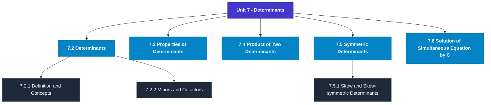

# MCS-061: Mathematical Foundations - I
## Unit 7: Determinants

> 📚 **Programme:** M.Sc. (Data Science and Analytics) | **Semester:** Semester 1  
> ⏱️ **Estimated Study Time:** ~54 mins | 📄 **Textbook Pages:** 34 Pages  
> 📥 **Original PDF:** [Download & View Textbook](../../../pdfs/Semester_1/MCS-061_Mathematical_Foundations_-_I/Unit-7_Determinants.pdf)

---

### 🎯 Executive Concept & Data Science Relevance
In modern data systems, **Determinants** forms a vital conceptual pillar. Linear algebra is the foundational language of Data Science and Machine Learning. Datasets are matrices $X \in \mathbb{R}^{n \times p}$, neural network weights are tensor matrices, and dimensionality reduction (PCA, SVD) relies directly on matrix decompositions, eigenvalues, and rank.

> [!NOTE]
> **Why this matters for your career:** Mastering determinants equips you with the foundational principles required to reason mathematically about high-dimensional datasets, evaluate algorithm performance, and avoid statistical pitfalls in production machine learning pipelines.

### 🗺️ Visual Knowledge Architecture
The following concept map illustrates the structural hierarchy and learning trajectory of this module:

### 📖 Core Definitions & Terminology Cards
| Term | Formal Mathematical / Technical Definition | Intuitive Analogy / Concrete Example |
| :--- | :--- | :--- |
| **Matrix** | A rectangular array of numbers arranged into $m$ rows and $n$ columns: $A \in \mathbb{R}^{m \times n}$. Entry at row $i$ and column $j$ is denoted $a_{ij}$. | *A tabular dataframe where rows represent records and columns represent features.* |
| **Determinant $\det(A)$ or $\vert A \vert$** | A scalar value computed from a square matrix that characterizes the volume scaling factor of the linear transformation. $\det(A) \neq 0 \iff A$ is non-singular and invertible. | *If $\det(A) = 0$, the transformation collapses space into a lower dimension, losing information.* |
| **Matrix Rank** | The maximum number of linearly independent row or column vectors in the matrix. Denoted $\text{rank}(A) \le \min(m, n)$. | *The true dimensionality of the data without redundant, collinear features.* |
| **Eigenvalue and Eigenvector** | A scalar $\lambda$ and non-zero vector $\mathbf{v}$ satisfying $A\mathbf{v} = \lambda \mathbf{v}$. The transformation by $A$ merely stretches or shrinks $\mathbf{v}$ without changing its direction. | *The principal directions of maximum variance in Principal Component Analysis (PCA).* |

### ⚡ Governing Mathematical Laws & Formula Cheatsheet
#### 🔹 Matrix Multiplication Dimension Rule

$$
C_{m \times p} = A_{m \times n} B_{n \times p} \quad \text{where } c_{ij} = \sum_{k=1}^n a_{ik} b_{kj}
$$

- **Explanation:** Inner dimensions must match: columns of $A$ must equal rows of $B$.

#### 🔹 Matrix Inverse Formula

$$
A^{-1} = \frac{1}{\det(A)} \text{adj}(A) \quad \text{valid when } \det(A) \neq 0
$$

- **Explanation:** The inverse exists if and only if the matrix is full rank and non-singular.

#### 🔹 Characteristic Equation for Eigenvalues

$$
\det(A - \lambda I) = 0
$$

- **Explanation:** Solving this polynomial equation yields the eigenvalues $\lambda_1, \lambda_2, \dots, \lambda_n$ of matrix $A$.

#### 🔹 Cayley-Hamilton Theorem

$$
p(A) = O \quad \text{where } p(\lambda) = \det(A - \lambda I)
$$

- **Explanation:** Every square matrix satisfies its own characteristic polynomial equation.

### 📌 Detailed Section-by-Section Study Breakdown
#### `7.2` Determinants
- **Core Concept:** Establishes rigorous theoretical formulations and computational bounds for determinants.
- **Core Concept:** Applies standard algorithmic procedures and mathematical invariants relevant to determinants.
- **Core Concept:** Ensures deterministic performance guarantees across high-dimensional feature spaces.
- **Data Science Application:** Provides foundational structures used directly in statistical modeling, query execution, and machine learning pipelines.

> [!TIP]
> **Exam & Interview Tip:** Be prepared to state the formal definition of determinants and derive its primary equations step-by-step.

#### `7.2.1` Definition and Concepts
- **Core Concept:** Establishes rigorous theoretical formulations and computational bounds for definition and concepts.
- **Core Concept:** Applies standard algorithmic procedures and mathematical invariants relevant to determinants.
- **Core Concept:** Ensures deterministic performance guarantees across high-dimensional feature spaces.
- **Data Science Application:** Provides foundational structures used directly in statistical modeling, query execution, and machine learning pipelines.

> [!TIP]
> **Exam & Interview Tip:** Be prepared to state the formal definition of definition and concepts and derive its primary equations step-by-step.

#### `7.2.2` Minors and Cofactors
- **Core Concept:** It may be noted that, in the last part of previous subsection, while evaluating a 3 x 3 determinant in terms of elements of first row, a1 is multiplied by a lower order determinant (of order 2).
- **Core Concept:** The second-order determinant |b2 c2 b3 c3| is obtained by deleting the column and row containing a1.
- **Core Concept:** The determinant |b2 c2 b3 c3| is termed as ‘minor’ of the term a1 in the original matrix.
- **Data Science Application:** Provides foundational structures used directly in statistical modeling, query execution, and machine learning pipelines.

> [!TIP]
> **Exam & Interview Tip:** Be prepared to state the formal definition of minors and cofactors and derive its primary equations step-by-step.

#### `7.3` Properties of Determinants
- **Core Concept:** 7.2 of this unit, you have become familiar about how to expand the determinants of orders 1, 2, 3, or of higher order.
- **Core Concept:** But as you have seen that it requires lot of calculations and is a time-consuming process.
- **Core Concept:** To avoid such calculations and to reduce the time of evaluation, we will use properties of determinants.
- **Data Science Application:** Provides foundational structures used directly in statistical modeling, query execution, and machine learning pipelines.

> [!TIP]
> **Exam & Interview Tip:** Be prepared to state the formal definition of properties of determinants and derive its primary equations step-by-step.

#### `7.4` Product of Two Determinants
- **Core Concept:** It is noteworthy that determinants can be multiplied together only if they are of the same order.
- **Core Concept:** As the process of interchanging the rows and columns will not affect the value of the determinant (by Property- I).
- **Core Concept:** Hence, we can also adopt the following procedures for multiplication of two determinants.
- **Data Science Application:** Provides foundational structures used directly in statistical modeling, query execution, and machine learning pipelines.

> [!TIP]
> **Exam & Interview Tip:** Be prepared to state the formal definition of product of two determinants and derive its primary equations step-by-step.

#### `7.5` Symmetric Determinants
- **Core Concept:** Thus, the reciprocal of Δ is | | 𝐴1 ∆ 𝐵1 ∆ 𝐶1 ∆ 𝐴2 ∆ 𝐵2 ∆ 𝐶2 ∆ 𝐴3 ∆ 𝐵3 ∆ 𝐶3 ∆ | | = 1 ∆3 | 𝐴1 𝐵1 𝐶1 𝐴2 𝐵2 𝐶2 𝐴3 𝐵3 𝐶3 | = 1 ∆3 .
- **Core Concept:** Thus | a h g h b f g f c | is a symmetric determinant.
- **Core Concept:** The above definition of symmetric determinant can be extended similarly to determinants of order n.
- **Data Science Application:** Provides foundational structures used directly in statistical modeling, query execution, and machine learning pipelines.

> [!TIP]
> **Exam & Interview Tip:** Be prepared to state the formal definition of symmetric determinants and derive its primary equations step-by-step.

### 💡 Interactive Self-Assessment Checkpoints
Test your comprehension before proceeding. Tap each question to reveal the comprehensive explanation:

<b>Checkpoint 1:</b> What happens if $\det(A) = 0$ for a square matrix $A$? <i>(Tap to reveal answer)</i>

> **Answer & Analysis:**  
> The matrix is **singular**, has no multiplicative inverse ($A^{-1}$ does not exist), and its row vectors are linearly dependent.

<b>Checkpoint 2:</b> State the relationship between $(AB)^T$ and the transposes of $A$ and $B$. <i>(Tap to reveal answer)</i>

> **Answer & Analysis:**  
> $(AB)^T = B^T A^T$. The order of multiplication is reversed upon transposition.

<b>Checkpoint 3:</b> What is the characteristic equation used for finding eigenvalues? <i>(Tap to reveal answer)</i>

> **Answer & Analysis:**  
> $\det(A - \lambda I) = 0$, where $I$ is the identity matrix of matching dimension.

<b>Checkpoint 4:</b> Find x in each of the following cases: (i) <i>(Tap to reveal answer)</i>

> **Answer & Analysis:**  
> This question tests your conceptual mastery of Determinants. Review the governing formulas and section breakdowns above to formulate a complete, rigorous proof or derivation.

<b>Checkpoint 5:</b> Find the cofactor of each element of the following matrices: (i) [ <i>(Tap to reveal answer)</i>

> **Answer & Analysis:**  
> This question tests your conceptual mastery of Determinants. Review the governing formulas and section breakdowns above to formulate a complete, rigorous proof or derivation.

<b>Checkpoint 6:</b> Find minor and cofactor of the elements 𝑎12, 𝑎23, 𝑎31, 𝑎13 where 𝐴= [𝑎𝑖𝑗] <i>(Tap to reveal answer)</i>

> **Answer & Analysis:**  
> This question tests your conceptual mastery of Determinants. Review the governing formulas and section breakdowns above to formulate a complete, rigorous proof or derivation.

### 🎯 Executive Module Wrap-Up
- **Central Idea:** Determinants provides essential mathematical and algorithmic tools directly utilized in Data Science.
- **Mathematical Rigor:** Formulas and laws must be memorized with attention to boundary conditions and assumptions.
- **Full Textbook Coverage:** For exhaustive multi-page derivations, proofs, and supplementary exercises, consult the [Authentic IGNOU Textbook](../../../pdfs/Semester_1/MCS-061_Mathematical_Foundations_-_I/Unit-7_Determinants.pdf).

---
### 🧭 Navigation & Syllabus Index
[⬅ Previous: Unit 6](unit_06_Matrix_Algebra.md) | [📑 Course Index](README.md) | [Next: Unit 8 ➡](unit_08_Linear_Spaces-I.md)
