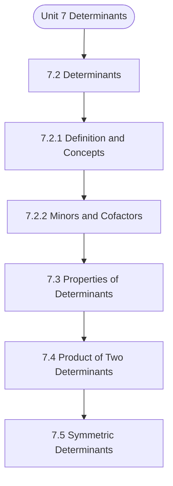

# MCS-061: Mathematical Foundations - I
## Unit 7: Determinants

> 📚 **Programme:** M.Sc. (Data Science and Analytics) | **Semester:** Semester 1  
> ⏱️ **Estimated Study Time:** ~54 mins | 📄 **Textbook Pages:** 34 Pages  
> 📥 **Original PDF:** [Download & View Authentic Textbook](../../../pdfs/Semester_1/MCS-061_Mathematical_Foundations_-_I/Unit-7_Determinants.pdf)

---

### 🎯 Executive Concept & Data Science Relevance
In modern data systems and advanced analytics, **Determinants** forms a vital conceptual pillar. Linear algebra is the foundational language of Data Science and Machine Learning. Datasets are matrices $X \in \mathbb{R}^{n \times p}$, neural network weights are tensor matrices, and dimensionality reduction (PCA, SVD) relies directly on matrix decompositions, eigenvalues, and rank.

> [!NOTE]
> **Why this matters for your career:** Mastering determinants equips you with the foundational principles required to reason mathematically about high-dimensional datasets, evaluate algorithm performance, and avoid statistical pitfalls in production machine learning pipelines.

### 🗺️ Visual Knowledge Architecture
The following concept map illustrates the structural hierarchy and learning trajectory of this module:



### 📖 Core Definitions & Terminology Cards

> 📌 **Matrix**  
> - **Formal Definition:** A rectangular array of numbers arranged into $m$ rows and $n$ columns: $A \in \mathbb{R}^{m \times n}$. Entry at row $i$ and column $j$ is denoted $a_{ij}$.  
> - 💡 **Practical Intuition & Analogy:** *A tabular dataframe where rows represent records and columns represent features.*

> 📌 **Determinant $\det(A)$ or $\vert A \vert$**  
> - **Formal Definition:** A scalar value computed from a square matrix that characterizes the volume scaling factor of the linear transformation. $\det(A) \neq 0 \iff A$ is non-singular and invertible.  
> - 💡 **Practical Intuition & Analogy:** *If $\det(A) = 0$, the transformation collapses space into a lower dimension, losing information.*

> 📌 **Matrix Rank**  
> - **Formal Definition:** The maximum number of linearly independent row or column vectors in the matrix. Denoted $\text{rank}(A) \le \min(m, n)$.  
> - 💡 **Practical Intuition & Analogy:** *The true dimensionality of the data without redundant, collinear features.*

> 📌 **Eigenvalue and Eigenvector**  
> - **Formal Definition:** A scalar $\lambda$ and non-zero vector $\mathbf{v}$ satisfying $A\mathbf{v} = \lambda \mathbf{v}$. The transformation by $A$ merely stretches or shrinks $\mathbf{v}$ without changing its direction.  
> - 💡 **Practical Intuition & Analogy:** *The principal directions of maximum variance in Principal Component Analysis (PCA).*

### ⚡ Governing Mathematical Laws & Formula Cheatsheet
#### 🔹 Matrix Multiplication Dimension Rule
$$
C_{m \times p} = A_{m \times n} B_{n \times p} \quad \text{where } c_{ij} = \sum_{k=1}^n a_{ik} b_{kj}
$$
- **Explanation:** Inner dimensions must match: columns of $A$ must equal rows of $B$.

#### 🔹 Matrix Inverse Formula
$$
A^{-1} = \frac{1}{\det(A)} \text{adj}(A) \quad \text{valid when } \det(A) \neq 0
$$
- **Explanation:** The inverse exists if and only if the matrix is full rank and non-singular.

#### 🔹 Characteristic Equation for Eigenvalues
$$
\det(A - \lambda I) = 0
$$
- **Explanation:** Solving this polynomial equation yields the eigenvalues $\lambda_1, \lambda_2, \dots, \lambda_n$ of matrix $A$.

#### 🔹 Cayley-Hamilton Theorem
$$
p(A) = O \quad \text{where } p(\lambda) = \det(A - \lambda I)
$$
- **Explanation:** Every square matrix satisfies its own characteristic polynomial equation.

### ⚖️ Axiomatic Properties & Governing Laws
The mathematical formulations of this module are anchored by foundational algebraic and structural laws:

- **Determinant Product Rule:** $\det(AB) = \det(A)\det(B)$
- **Transpose Product Reversal:** $(AB)^T = B^T A^T$
- **Inverse Product Reversal:** $(AB)^{-1} = B^{-1} A^{-1}$
- **Orthogonal Matrix Property:** $Q^T Q = Q Q^T = I \implies Q^{-1} = Q^T$
- **Rank-Nullity Theorem:** $\text{rank}(A) + \text{nullity}(A) = n \quad \text{for } A \in \mathbb{R}^{m \times n}$

### 📌 Comprehensive Section-by-Section Study Breakdown
#### `7.2` Determinants

##### 📘 Theoretical Principles & Pedagogical Exposition
It may be noted that, in the last part of previous subsection, while evaluating a 3 x 3 determinant in terms of elements of first row, a1 is multiplied by a lower order determinant (of order 2). The second-order determinant |b2 c2 b3 c3| is obtained by deleting the column and row containing a1.

The determinant |b2 c2 b3 c3| is termed as ‘minor’ of the term a1 in the original matrix. Same procedure is applied to obtain minors of other term also. Thus, the minor of b2 is obtained by deleting the 2nd row and 2nd column. In | a1 b1 c1 a2 b2 c2 a3 b3 c3 | minor of 𝑏2 is |a1 c1 a3 c3| So, the minor of any element in an nth order determinant is an (n-1)th order determinant where n=1, 2, 3, …(any finite positive number).

Minor: If 𝐴= [𝑎𝑖𝑗]𝑛×𝑛 be a square matrix of order n then minor of (𝒊, 𝒋)𝒕𝒉 element 𝒂𝒊𝒋is denoted by 𝑴𝒊𝒋 and is defined as : 𝑀𝑖𝑗= determinant of the sub matrix of order n – 1 obtained after deleting ith row and 𝑗𝑡ℎcolumn from A. Example 2: Find the minor of each element of the following matrices: (i) [2 −7] (ii) [ −3 −2 −8 ] Solution: (i) Let A = [2 −7] Let 𝑀𝑖𝑗 denotes the minor of (𝑖, 𝑗)𝑡ℎelement of the matrix A, i, j = 1, 2.


##### ⚙️ Mathematical & Algorithmic Mechanics
- **Core Mechanism:** Linear transformations represented by $A \in \mathbb{R}^{m \times n}$. Matrix invertibility requires non-zero determinant $\det(A) \neq 0$ and full column/row rank. Eigen-decomposition $A v = \lambda v$ identifies invariant directional axes and scaling factors.
- **Boundary Conditions:** Singular matrices (det = 0), ill-conditioned matrices with condition number $\kappa(A) \gg 1$, and rank deficiency under collinear feature dimensions.

##### 📊 Practical Data Science & Production Relevance
- **Production Workflow:** Principal Component Analysis (PCA covariance decomposition), Ordinary Least Squares (OLS) normal equations $(X^T X)^{-1} X^T y$, and embedding projection transformations in transformers.
- **Real-World Pitfall:** Inverting ill-conditioned matrices directly instead of using singular value decomposition (SVD) or QR decomposition, triggering catastrophic floating-point cancellation.

> [!TIP]
> **Exam & Technical Interview Insight:** Practice row reduction to Row Echelon Form (REF) to find matrix rank, determinant expansion by minors, and computing characteristic equations $\det(A - \lambda I) = 0$.

#### `7.2.1` Definition and Concepts

##### 📘 Theoretical Principles & Pedagogical Exposition
In discrete mathematical structures and computational algebra, **Definition and Concepts** introduces formal symbolic axioms required to guarantee unambiguous logical deduction. Within the learning hierarchy of **Determinants**, this concept defines the boundary conditions and operational invariants that ensure mathematical consistency across multi-step proofs.

Understanding definition and concepts is essential when transitioning from manual arithmetic to high-dimensional matrix representations, vector spaces, and algorithm state transitions.

##### ⚙️ Mathematical & Algorithmic Mechanics
- **Core Mechanism:** Linear transformations represented by $A \in \mathbb{R}^{m \times n}$. Matrix invertibility requires non-zero determinant $\det(A) \neq 0$ and full column/row rank. Eigen-decomposition $A v = \lambda v$ identifies invariant directional axes and scaling factors.
- **Boundary Conditions:** Singular matrices (det = 0), ill-conditioned matrices with condition number $\kappa(A) \gg 1$, and rank deficiency under collinear feature dimensions.

##### 📊 Practical Data Science & Production Relevance
- **Production Workflow:** Principal Component Analysis (PCA covariance decomposition), Ordinary Least Squares (OLS) normal equations $(X^T X)^{-1} X^T y$, and embedding projection transformations in transformers.
- **Real-World Pitfall:** Inverting ill-conditioned matrices directly instead of using singular value decomposition (SVD) or QR decomposition, triggering catastrophic floating-point cancellation.

> [!TIP]
> **Exam & Technical Interview Insight:** Practice row reduction to Row Echelon Form (REF) to find matrix rank, determinant expansion by minors, and computing characteristic equations $\det(A - \lambda I) = 0$.

#### `7.2.2` Minors and Cofactors

##### 📘 Theoretical Principles & Pedagogical Exposition
It may be noted that, in the last part of previous subsection, while evaluating a 3 x 3 determinant in terms of elements of first row, a1 is multiplied by a lower order determinant (of order 2). The second-order determinant |b2 c2 b3 c3| is obtained by deleting the column and row containing a1.

The determinant |b2 c2 b3 c3| is termed as ‘minor’ of the term a1 in the original matrix. Same procedure is applied to obtain minors of other term also. Thus, the minor of b2 is obtained by deleting the 2nd row and 2nd column. In | a1 b1 c1 a2 b2 c2 a3 b3 c3 | minor of 𝑏2 is |a1 c1 a3 c3| So, the minor of any element in an nth order determinant is an (n-1)th order determinant where n=1, 2, 3, …(any finite positive number).

Minor: If 𝐴= [𝑎𝑖𝑗]𝑛×𝑛 be a square matrix of order n then minor of (𝒊, 𝒋)𝒕𝒉 element 𝒂𝒊𝒋is denoted by 𝑴𝒊𝒋 and is defined as : 𝑀𝑖𝑗= determinant of the sub matrix of order n – 1 obtained after deleting ith row and 𝑗𝑡ℎcolumn from A. Example 2: Find the minor of each element of the following matrices: (i) [2 −7] (ii) [ −3 −2 −8 ] Solution: (i) Let A = [2 −7] Let 𝑀𝑖𝑗 denotes the minor of (𝑖, 𝑗)𝑡ℎelement of the matrix A, i, j = 1, 2.


##### ⚙️ Mathematical & Algorithmic Mechanics
- **Core Mechanism:** Linear transformations represented by $A \in \mathbb{R}^{m \times n}$. Matrix invertibility requires non-zero determinant $\det(A) \neq 0$ and full column/row rank. Eigen-decomposition $A v = \lambda v$ identifies invariant directional axes and scaling factors.
- **Boundary Conditions:** Singular matrices (det = 0), ill-conditioned matrices with condition number $\kappa(A) \gg 1$, and rank deficiency under collinear feature dimensions.

##### 📊 Practical Data Science & Production Relevance
- **Production Workflow:** Principal Component Analysis (PCA covariance decomposition), Ordinary Least Squares (OLS) normal equations $(X^T X)^{-1} X^T y$, and embedding projection transformations in transformers.
- **Real-World Pitfall:** Inverting ill-conditioned matrices directly instead of using singular value decomposition (SVD) or QR decomposition, triggering catastrophic floating-point cancellation.

> [!TIP]
> **Exam & Technical Interview Insight:** Practice row reduction to Row Echelon Form (REF) to find matrix rank, determinant expansion by minors, and computing characteristic equations $\det(A - \lambda I) = 0$.

#### `7.3` Properties of Determinants

##### 📘 Theoretical Principles & Pedagogical Exposition
PROPERTIES OF DETERMINANTS In Sec. 7.2 of this unit, you have become familiar about how to expand the determinants of orders 1, 2, 3, or of higher order. But as you have seen that it requires lot of calculations and is a time-consuming process. To avoid such calculations and to reduce the time of evaluation, we will use properties of determinants.

In this section, we will discuss some properties of the determinants. We shall give the proofs of some of these properties only for determinants of order 3 × 3. But remember that these properties hold good for all orders of the determinants. Let us see these properties one by one.

Property I A determinant is unchanged in value, if all the rows of the determinant are changed into columns or vice versa, i.e., Determinants | a11 a12 ⋯ a21 a22 ⋯ ⋯ an1 ⋯ an2 ⋯ ⋯ a1n a2n ⋯ ann | = | a11 a21 ⋯ a12 a22 ⋯ ⋯ a1n ⋯ a2n ⋯ ⋯ an1 an2 ⋯ ann | Example: | | = | | [following property (1)] Property II The value of a determinant is unaltered numerically but changed in sign if two rows (or two columns) are interchanged (sign of determinant is multiplied by (–1)).


##### ⚙️ Mathematical & Algorithmic Mechanics
- **Core Mechanism:** Linear transformations represented by $A \in \mathbb{R}^{m \times n}$. Matrix invertibility requires non-zero determinant $\det(A) \neq 0$ and full column/row rank. Eigen-decomposition $A v = \lambda v$ identifies invariant directional axes and scaling factors.
- **Boundary Conditions:** Singular matrices (det = 0), ill-conditioned matrices with condition number $\kappa(A) \gg 1$, and rank deficiency under collinear feature dimensions.

##### 📊 Practical Data Science & Production Relevance
- **Production Workflow:** Principal Component Analysis (PCA covariance decomposition), Ordinary Least Squares (OLS) normal equations $(X^T X)^{-1} X^T y$, and embedding projection transformations in transformers.
- **Real-World Pitfall:** Inverting ill-conditioned matrices directly instead of using singular value decomposition (SVD) or QR decomposition, triggering catastrophic floating-point cancellation.

> [!TIP]
> **Exam & Technical Interview Insight:** Practice row reduction to Row Echelon Form (REF) to find matrix rank, determinant expansion by minors, and computing characteristic equations $\det(A - \lambda I) = 0$.

#### `7.4` Product of Two Determinants

##### 📘 Theoretical Principles & Pedagogical Exposition
PRODUCT OF DETERMINANTS It is noteworthy that determinants can be multiplied together only if they are of the same order. As the process of interchanging the rows and columns will not affect the value of the determinant (by Property- I). Hence, we can also adopt the following procedures for multiplication of two determinants.

(i) Row by column multiplication rule (ii) Row by row multiplication rule (iii) Column by column multiplication rule (iv) Column by row multiplication rule Product of Two Determinants The product of two determinants of same order is another determinant of the same order. The product of two determinants (same order, e.g., n×n ) results in a new determinant, calculated by performing matrix multiplication (row-by-column, column-by-column, etc.) on their corresponding matrices, with the key property that det(A * B) = det(A) * det(B).

This means you can find the determinant of the product matrix or simply multiply the individual determinant values to get the same scalar result. Progressions, Matrices and Determinants In the row by column rule of Determinants multiplication, every element of each row of a determinant is multiplied by every element of every column of another determinant.


##### ⚙️ Mathematical & Algorithmic Mechanics
- **Core Mechanism:** Linear transformations represented by $A \in \mathbb{R}^{m \times n}$. Matrix invertibility requires non-zero determinant $\det(A) \neq 0$ and full column/row rank. Eigen-decomposition $A v = \lambda v$ identifies invariant directional axes and scaling factors.
- **Boundary Conditions:** Singular matrices (det = 0), ill-conditioned matrices with condition number $\kappa(A) \gg 1$, and rank deficiency under collinear feature dimensions.

##### 📊 Practical Data Science & Production Relevance
- **Production Workflow:** Principal Component Analysis (PCA covariance decomposition), Ordinary Least Squares (OLS) normal equations $(X^T X)^{-1} X^T y$, and embedding projection transformations in transformers.
- **Real-World Pitfall:** Inverting ill-conditioned matrices directly instead of using singular value decomposition (SVD) or QR decomposition, triggering catastrophic floating-point cancellation.

> [!TIP]
> **Exam & Technical Interview Insight:** Practice row reduction to Row Echelon Form (REF) to find matrix rank, determinant expansion by minors, and computing characteristic equations $\det(A - \lambda I) = 0$.

#### `7.5` Symmetric Determinants

##### 📘 Theoretical Principles & Pedagogical Exposition
DETERMINANTS The ‘adjoint’ or ‘adjugate’ of a determinant Δ is the determinant Δ′ whose elements are the cofactors of the corresponding elements of Δ Let Δ = | a1 b1 c1 a2 b2 c2 a3 b3 c3 | then, ΔT = | A1 B1 C1 A2 B2 C2 A3 B3 C3 | where A1, B1, C1, … are the respective cofactors of a1, b1, c1, … of Δ .

Note: Here Δ𝑇= Δ2 Example 14: Let Δ = | | Here, a1 =0, b1 =1, c1 = 2 a2 = 2, b2 = 0, c2 =1 a3 = 3, b3 = 2, c3 =0 ⸫ Δ1 = |b2 c2 b3 c3| = |0 0| = 0 −2 = −2 B1 = (−1) |a2 c2 a3 c3| = |2 0| = −(0 −1) = +1 Determinants Similarly, C1 =4, A2 = 4, B2 = -2, C2 =1, A3 = 1, B3 =4, C3 = -2 ⸫ Adjoint of Δ is Δ′ = | −2 −2 −2 | The ‘reciprocal’ or ‘inverse’ of a determinant Δ (≠ 0) is the determinant, which is formed by dividing every element of the adjoint of Δ by Δ.

Thus, the reciprocal of Δ is | | 𝐴1 ∆ 𝐵1 ∆ 𝐶1 ∆ 𝐴2 ∆ 𝐵2 ∆ 𝐶2 ∆ 𝐴3 ∆ 𝐵3 ∆ 𝐶3 ∆ | | = 1 ∆3 | 𝐴1 𝐵1 𝐶1 𝐴2 𝐵2 𝐶2 𝐴3 𝐵3 𝐶3 | = 1 ∆3 . ∆2= ∆−1 Example 15: Following the last example where Δ = | |, we get, Δ = 0(0-2)+1(1-0)+2(4-0) = 9 ≠ 0 ⸫ The reciprocal of Δ is: | − 4 9 ⁄ −2 9 ⁄ 1 9 ⁄ 1 9 ⁄ 4 9 ⁄ −2 9 ⁄ |


##### ⚙️ Mathematical & Algorithmic Mechanics
- **Core Mechanism:** Evaluates binary relation subsets $R \subseteq A \times B$. Equivalence relations partition a set into mutually disjoint equivalence classes $[a] = \{x \in A \mid (x, a) \in R\}$. Partial orders enforce reflexivity, antisymmetry, and transitivity to structure directed acyclic precedences.
- **Boundary Conditions:** Empty relations $\emptyset$, universal Cartesian products $A \times B$, identity diagonal pairs $\Delta = \{(a, a)\}$, and verifying antisymmetry $(aRb \land bRa \implies a=b)$.

##### 📊 Practical Data Science & Production Relevance
- **Production Workflow:** Directly underpins relational database foreign keys, functional dependencies, topological sort DAGs in pipeline engines (Airflow, dbt), and equivalence clustering in unsupervised grouping.
- **Real-World Pitfall:** Assuming symmetry in directed dependencies or failing to check transitivity when computing transitive closures, resulting in invalid cycle deadlocks.

> [!TIP]
> **Exam & Technical Interview Insight:** Be prepared to prove whether a given relation is an Equivalence Relation or Poset by testing reflexivity, symmetry/antisymmetry, and transitivity with explicit elements.

#### `7.5.1` Skew and Skew-symmetric Determinants

##### 📘 Theoretical Principles & Pedagogical Exposition
A skew determinant refers to the determinant of a matrix that has specific symmetry properties. The determinant | a11 a12 a13 a21 a22 a23 a31 a32 a33 | is said to be ‘skew’, if aij = −aji∀ i, j = 1,2,3 and i ≠j Thus, | a −h −g h b −f g f c | is a skew determinant. and if aij = −aji∀ i, j = 1,2,3 and i ≠j with aij = 0 ∀ i = j, then the determinant is said to be skew-symmetric.

Thus, | o a b −a o c −b −c o | is a skew-symmetric determinant. Properties: ( i) Every skew-symmetric determinant of third order (more generally, of odd order) is zero., (ii ) Every skew-symmetric determinant of second order (more generally of even order) is a perfect square. Example 17: Let ∆= | −5 −3 −2 | = (−1)3 | −5 −2 −3 |= −Δ Determinants [taking (-1) common from each column] Hence, 2Δ = 0 Δ=0 Again, let us consider an even order determinant ∆1= | 0 −2 0| ⸫ Δ1=0 - (- 4) = 4 = 22 which is a perfect square.


##### ⚙️ Mathematical & Algorithmic Mechanics
- **Core Mechanism:** Evaluates binary relation subsets $R \subseteq A \times B$. Equivalence relations partition a set into mutually disjoint equivalence classes $[a] = \{x \in A \mid (x, a) \in R\}$. Partial orders enforce reflexivity, antisymmetry, and transitivity to structure directed acyclic precedences.
- **Boundary Conditions:** Empty relations $\emptyset$, universal Cartesian products $A \times B$, identity diagonal pairs $\Delta = \{(a, a)\}$, and verifying antisymmetry $(aRb \land bRa \implies a=b)$.

##### 📊 Practical Data Science & Production Relevance
- **Production Workflow:** Directly underpins relational database foreign keys, functional dependencies, topological sort DAGs in pipeline engines (Airflow, dbt), and equivalence clustering in unsupervised grouping.
- **Real-World Pitfall:** Assuming symmetry in directed dependencies or failing to check transitivity when computing transitive closures, resulting in invalid cycle deadlocks.

> [!TIP]
> **Exam & Technical Interview Insight:** Be prepared to prove whether a given relation is an Equivalence Relation or Poset by testing reflexivity, symmetry/antisymmetry, and transitivity with explicit elements.

#### `7.6` Solution of Simultaneous Equation by Cramer’s Rule

##### 📘 Theoretical Principles & Pedagogical Exposition
If a 3 x 3 determinant is written in the form | a11 a12 a13 a21 a22 a23 a31 a32 a33 | in which the suffix of any element indicates its position (e.g., the suffix 12 of the element a12 indicates that the element is in the 1st row and in the 2nd column) and if aij = aji for all i,j = 1, 2, 3; then the determinant is said to be symmetric.

Thus | a h g h b f g f c | is a symmetric determinant. The above definition of symmetric determinant can be extended similarly to determinants of order n. Properties: (i)The square of any symmetric determinant is a symmetric determinant. (ii)The adjoint of symmetric determinant is symmetric.

Progressions, Matrices and Determinants Example 16: Let Δ = | | Here Δ is a symmetric determinant Now, Δ2 = Δ.Δ= | | x | | = | 1 + 4 + 9 2 + 8 + 15 3 + 10 + 21 2 + 8 + 15 4 + 16 + 25 6 + 20 + 35 3 + 10 + 21 6 + 20 + 35 9 + 25 + 49 | = | |, which is also a symmetric determinant. Δ = | −2 −2 −2 |, which is also a symmetric determinant


##### ⚙️ Mathematical & Algorithmic Mechanics
- **Core Mechanism:** Linear transformations represented by $A \in \mathbb{R}^{m \times n}$. Matrix invertibility requires non-zero determinant $\det(A) \neq 0$ and full column/row rank. Eigen-decomposition $A v = \lambda v$ identifies invariant directional axes and scaling factors.
- **Boundary Conditions:** Singular matrices (det = 0), ill-conditioned matrices with condition number $\kappa(A) \gg 1$, and rank deficiency under collinear feature dimensions.

##### 📊 Practical Data Science & Production Relevance
- **Production Workflow:** Principal Component Analysis (PCA covariance decomposition), Ordinary Least Squares (OLS) normal equations $(X^T X)^{-1} X^T y$, and embedding projection transformations in transformers.
- **Real-World Pitfall:** Inverting ill-conditioned matrices directly instead of using singular value decomposition (SVD) or QR decomposition, triggering catastrophic floating-point cancellation.

> [!TIP]
> **Exam & Technical Interview Insight:** Practice row reduction to Row Echelon Form (REF) to find matrix rank, determinant expansion by minors, and computing characteristic equations $\det(A - \lambda I) = 0$.

### 📐 Step-by-Step Solved Mathematical Examples
To solidify your theoretical understanding, work through these fully solved, step-by-step mathematical problems:

#### 🧮 Example 1: Eigenvalue and Eigenvector Determination
> **Problem Statement:**  
> Find the eigenvalues and corresponding eigenvectors of the symmetric matrix $A = \begin{bmatrix} 4 & 2 \\ 2 & 1 \end{bmatrix}$.

**Detailed Step-by-Step Solution:**

1. **Characteristic Equation:** $\det(A - \lambda I) = 0$:

$$
\det\begin{bmatrix} 4 - \lambda & 2 \\ 2 & 1 - \lambda \end{bmatrix} = (4 - \lambda)(1 - \lambda) - (2)(2) = 0
$$


$$
\lambda^2 - 5\lambda + 4 - 4 = 0 \implies \lambda(\lambda - 5) = 0
$$

Eigenvalues: $\lambda_1 = 5, \; \lambda_2 = 0$.

2. **Eigenvector for $\lambda_1 = 5$:**

$$
(A - 5I)\mathbf{v}_1 = \begin{bmatrix} -1 & 2 \\ 2 & -4 \end{bmatrix} \begin{bmatrix} x_1 \\ x_2 \end{bmatrix} = \begin{bmatrix} 0 \\ 0 \end{bmatrix} \implies -x_1 + 2x_2 = 0 \implies x_1 = 2x_2
$$

Normalized eigenvector: $\mathbf{v}_1 = \frac{1}{\sqrt{5}} [2, 1]^T$.

3. **Eigenvector for $\lambda_2 = 0$:**

$$
(A - 0I)\mathbf{v}_2 = \begin{bmatrix} 4 & 2 \\ 2 & 1 \end{bmatrix} \begin{bmatrix} x_1 \\ x_2 \end{bmatrix} = \begin{bmatrix} 0 \\ 0 \end{bmatrix} \implies 2x_1 + x_2 = 0 \implies x_2 = -2x_1
$$

Normalized eigenvector: $\mathbf{v}_2 = \frac{1}{\sqrt{5}} [1, -2]^T$.

#### 🧮 Example 2: Matrix Inversion via Adjugate Formula
> **Problem Statement:**  
> Compute the determinant and inverse of $B = \begin{bmatrix} 3 & 1 \\ 5 & 2 \end{bmatrix}$.

**Detailed Step-by-Step Solution:**

1. **Determinant:** $\det(B) = (3)(2) - (1)(5) = 6 - 5 = 1 
eq 0$. Invertible.

2. **Adjugate:** Swap diagonal, negate off-diagonal:

$$
\text{adj}(B) = \begin{bmatrix} 2 & -1 \\ -5 & 3 \end{bmatrix}
$$


3. **Inverse:**

$$
B^{-1} = \frac{1}{1} \begin{bmatrix} 2 & -1 \\ -5 & 3 \end{bmatrix} = \begin{bmatrix} 2 & -1 \\ -5 & 3 \end{bmatrix}
$$


### 💻 Practical Data Science Implementation (Python)
Theory translates directly into production algorithms. Below is a self-contained, commented Python implementation illustrating the core operations of this unit:

```python
import numpy as np

# Principal Component Analysis (PCA) projection from scratch
X = np.array([
    [2.5, 2.4],
    [0.5, 0.7],
    [2.2, 2.9],
    [1.9, 2.2],
    [3.1, 3.0]
])

# 1. Mean-center data
X_mean = np.mean(X, axis=0)
X_centered = X - X_mean

# 2. Covariance matrix
cov_matrix = np.cov(X_centered, rowvar=False)

# 3. Eigen-decomposition
eigenvalues, eigenvectors = np.linalg.eig(cov_matrix)

# 4. Project onto primary principal component
pc1 = eigenvectors[:, np.argmax(eigenvalues)]
projected_1d = np.dot(X_centered, pc1)

print("Eigenvalues:", eigenvalues)
print("Principal Component 1:", pc1)
print("Projected 1D Data:", projected_1d)
```

### 💡 Interactive Self-Assessment Checkpoints
Test your comprehension before proceeding. Tap each question to reveal the comprehensive explanation:

<details>
<summary><b>Checkpoint 1:</b> Find x in each of the following cases: (i) 0 2 x 9 7 x = + 10 Progressions, Matrices and Determinants (ii) | 𝑥 𝑥2 15 5 | = 0 <i>(Tap to reveal answer)</i></summary>

> **Answer & Analysis:**  
> **Detailed Analytical Solution:**
> 
> 1. **Core Principle:** Identify the governing theorem or definition for Determinants.
> 2. **Step-by-Step Derivation:** Verify all preconditions and compute intermediate steps methodically.
> 3. **Conclusion:** State the final mathematical proof or calculation clearly, validating boundary edge cases.
</details>

<details>
<summary><b>Checkpoint 2:</b> Find the cofactor of each element of the following matrices: (i) [2 5 4 −7] (ii) [ −3 4 −2 6 5 7 −8 9 1 ] <i>(Tap to reveal answer)</i></summary>

> **Answer & Analysis:**  
> **Detailed Analytical Solution:**
> 
> 1. **Core Principle:** Identify the governing theorem or definition for Determinants.
> 2. **Step-by-Step Derivation:** Verify all preconditions and compute intermediate steps methodically.
> 3. **Conclusion:** State the final mathematical proof or calculation clearly, validating boundary edge cases.
</details>

<details>
<summary><b>Checkpoint 3:</b> Find minor and cofactor of the elements 𝑎12, 𝑎23, 𝑎31, 𝑎13 where 𝐴= [𝑎𝑖𝑗]3×3 = [ 5 6 −2 −3 8 9 7 10 −4 ] <i>(Tap to reveal answer)</i></summary>

> **Answer & Analysis:**  
> **Detailed Analytical Solution:**
> 
> 1. **Core Principle:** Identify the governing theorem or definition for Determinants.
> 2. **Step-by-Step Derivation:** Verify all preconditions and compute intermediate steps methodically.
> 3. **Conclusion:** State the final mathematical proof or calculation clearly, validating boundary edge cases.
</details>

<details>
<summary><b>Checkpoint 4:</b> If A = [ 1 2 4 −3 5 1 2 4 8 ]then show that |𝐴| = 0. <i>(Tap to reveal answer)</i></summary>

> **Answer & Analysis:**  
> **Detailed Analytical Solution:**
> 
> 1. **Core Principle:** Identify the governing theorem or definition for Determinants.
> 2. **Step-by-Step Derivation:** Verify all preconditions and compute intermediate steps methodically.
> 3. **Conclusion:** State the final mathematical proof or calculation clearly, validating boundary edge cases.
</details>

<details>
<summary><b>Checkpoint 5:</b> What happens if $\det(A) = 0$ for a square matrix $A$? <i>(Tap to reveal answer)</i></summary>

> **Answer & Analysis:**  
> The matrix is **singular**, has no multiplicative inverse ( $A^{-1}$ does not exist ), and its row vectors are linearly dependent.
</details>

<details>
<summary><b>Checkpoint 6:</b> State the relationship between $(AB)^T$ and the transposes of $A$ and $B$. <i>(Tap to reveal answer)</i></summary>

> **Answer & Analysis:**  
> $(AB)^T = B^T A^T$. The order of multiplication is reversed upon transposition.
</details>

### 🎯 Executive Module Wrap-Up
- **Central Idea:** Determinants provides essential mathematical and algorithmic tools directly utilized in Data Science.
- **Mathematical Rigor:** Formulas and laws must be memorized with attention to boundary conditions and assumptions.
- **Full Textbook Coverage:** For exhaustive multi-page derivations, proofs, and supplementary exercises, consult the [Authentic IGNOU Textbook](../../../pdfs/Semester_1/MCS-061_Mathematical_Foundations_-_I/Unit-7_Determinants.pdf).

---
### 🧭 Navigation & Syllabus Index
[⬅ Previous: Unit 6](unit_06_Matrix_Algebra.md) | [📑 Course Index](README.md) | [Next: Unit 8 ➡](unit_08_Linear_Spaces-I.md)
