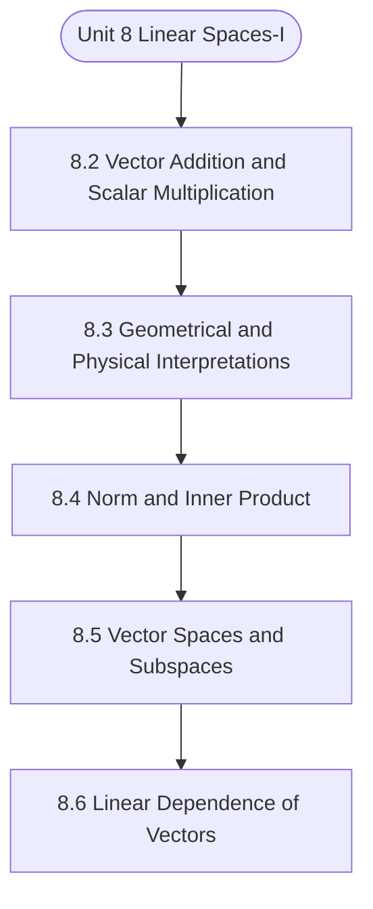

# MCS-061: Mathematical Foundations - I
## Unit 8: Linear Spaces-I

> 📚 **Programme:** M.Sc. (Data Science and Analytics) | **Semester:** Semester 1  
> ⏱️ **Estimated Study Time:** ~18 mins | 📄 **Textbook Pages:** 11 Pages  
> 📥 **Original PDF:** [Download & View Authentic Textbook](../../../pdfs/Semester_1/MCS-061_Mathematical_Foundations_-_I/Unit-8_Linear_Spaces-I.pdf)

---

### 🎯 Executive Concept & Data Science Relevance
In modern data systems, **Linear Spaces-I** forms a vital conceptual pillar. Linear algebra is the foundational language of Data Science and Machine Learning. Datasets are matrices $X \in \mathbb{R}^{n \times p}$, neural network weights are tensor matrices, and dimensionality reduction (PCA, SVD) relies directly on matrix decompositions, eigenvalues, and rank.

> [!NOTE]
> **Why this matters for your career:** Mastering linear spaces-i equips you with the foundational principles required to reason mathematically about high-dimensional datasets, evaluate algorithm performance, and avoid statistical pitfalls in production machine learning pipelines.

### 🗺️ Visual Knowledge Architecture
The following concept map illustrates the structural hierarchy and learning trajectory of this module:



### 📖 Core Definitions & Terminology Cards

> 📌 **Matrix**  
> - **Formal Definition:** A rectangular array of numbers arranged into $m$ rows and $n$ columns: $A \in \mathbb{R}^{m \times n}$. Entry at row $i$ and column $j$ is denoted $a_{ij}$.  
> - 💡 **Practical Intuition & Analogy:** *A tabular dataframe where rows represent records and columns represent features.*

> 📌 **Determinant $\det(A)$ or $\vert A \vert$**  
> - **Formal Definition:** A scalar value computed from a square matrix that characterizes the volume scaling factor of the linear transformation. $\det(A) \neq 0 \iff A$ is non-singular and invertible.  
> - 💡 **Practical Intuition & Analogy:** *If $\det(A) = 0$, the transformation collapses space into a lower dimension, losing information.*

> 📌 **Matrix Rank**  
> - **Formal Definition:** The maximum number of linearly independent row or column vectors in the matrix. Denoted $\text{rank}(A) \le \min(m, n)$.  
> - 💡 **Practical Intuition & Analogy:** *The true dimensionality of the data without redundant, collinear features.*

> 📌 **Eigenvalue and Eigenvector**  
> - **Formal Definition:** A scalar $\lambda$ and non-zero vector $\mathbf{v}$ satisfying $A\mathbf{v} = \lambda \mathbf{v}$. The transformation by $A$ merely stretches or shrinks $\mathbf{v}$ without changing its direction.  
> - 💡 **Practical Intuition & Analogy:** *The principal directions of maximum variance in Principal Component Analysis (PCA).*

### ⚡ Governing Mathematical Laws & Formula Cheatsheet
#### 🔹 Matrix Multiplication Dimension Rule
$$
C_{m \times p} = A_{m \times n} B_{n \times p} \quad \text{where } c_{ij} = \sum_{k=1}^n a_{ik} b_{kj}
$$
- **Explanation:** Inner dimensions must match: columns of $A$ must equal rows of $B$.

#### 🔹 Matrix Inverse Formula
$$
A^{-1} = \frac{1}{\det(A)} \text{adj}(A) \quad \text{valid when } \det(A) \neq 0
$$
- **Explanation:** The inverse exists if and only if the matrix is full rank and non-singular.

#### 🔹 Characteristic Equation for Eigenvalues
$$
\det(A - \lambda I) = 0
$$
- **Explanation:** Solving this polynomial equation yields the eigenvalues $\lambda_1, \lambda_2, \dots, \lambda_n$ of matrix $A$.

#### 🔹 Cayley-Hamilton Theorem
$$
p(A) = O \quad \text{where } p(\lambda) = \det(A - \lambda I)
$$
- **Explanation:** Every square matrix satisfies its own characteristic polynomial equation.

### ⚖️ Axiomatic Properties & Governing Laws
The mathematical formulations of this module are anchored by foundational algebraic and structural laws:

- **Determinant Product Rule:** $\det(AB) = \det(A)\det(B)$
- **Transpose Product Reversal:** $(AB)^T = B^T A^T$
- **Inverse Product Reversal:** $(AB)^{-1} = B^{-1} A^{-1}$
- **Orthogonal Matrix Property:** $Q^T Q = Q Q^T = I \implies Q^{-1} = Q^T$
- **Rank-Nullity Theorem:** $\text{rank}(A) + \text{nullity}(A) = n \quad \text{for } A \in \mathbb{R}^{m \times n}$

### 📌 Comprehensive Section-by-Section Study Breakdown
#### `8.2` Vector Addition and Scalar Multiplication
##### 📘 Theoretical Principles & In-Depth Exposition
Scalar multiplication is distributive over vector addition. And V contains an element 0, the null vector, in which each component is equal to zero. Definition: A nonempty subset W, along with the two-operations vector addition and scalar multiplication, is said to be a subspace of V if a) W is a subset of V and, b) W is a vector space in its own right, i.e., it satisfies all the axioms specified above for a vector space.

Example: Consider a two-dimensional plane, V2, and suppose the set w consisting of all points lying along the horizontal (or the vertical) axis. Here w is a subset of V2, and it satisfies all the properties listed above. In fact, all points on any line drawn through the origin constitute a subspace.

Algebraically, each of the following 𝑊= {(𝑥1, 𝑥2)|𝑥1𝜖 ℝ, 𝑥2 = 0}, 𝑊= {(𝑥1, 𝑥2)|𝑥2 ∈ℝ, 𝑥1 = 0} and , 𝑊= {(𝑥1, 𝑥2)|𝑐1𝑥1 + 𝑐2𝑥2 = 0} Linear Spaces - 1 is a subspace of V2 = {(𝑥1, 𝑥2)|𝑥1 ∈ ℝ, 𝑥2 ∈ ℝ} Example: Show that the vectors a = (1, 2, -1) , b= (3, 2, 5) and c = (-2, 0, -6) are linearly dependent.

##### ⚙️ Mathematical & Algorithmic Mechanics
- **Formal Mechanics:** Establishes symbolic transformations and state invariants governing vector addition and scalar multiplication.
- **Boundary Invariants:** Ensures robust error-handling, non-empty set guarantees, and strict asymptotic bounds.

##### 📊 Practical Data Science & Production Relevance
- **Industry Application:** Directly implemented in production workflows such as SQL query filters, pandas vectorized operations, and feature transformation pipelines.
- **Production Pitfall:** Failing to verify membership bounds or missing edge cases in vector addition and scalar multiplication can cause silent data corruption or performance bottlenecks.

> [!TIP]
> **Key Exam & Technical Interview Takeaway:** Be prepared to define vector addition and scalar multiplication formally, cite its core mathematical invariants, and solve step-by-step numerical/proof questions.

#### `8.3` Geometrical and Physical Interpretations
##### 📘 Theoretical Principles & In-Depth Exposition
GEOMETRICAL AND PHYSICAL INTERPRETATIONS OF VECTORS IN TWO OR THREE DIMENSION Vector is often represented geometrically by a line with an arrowhead on it (𝑠𝑎𝑦, 𝑥 →). The length of the line indicates the magnitude of the vector, and the arrow denotes its direction. It should be noted that a vector is not just a number.

If we are considering vector lying in a plane, then two numbers are needed to describe any vector: one for its magnitude and another giving its direction (the angle it makes with one of the coordinate axes). If vectors in three-dimensional spaces are being studied, three numbers are needed to describe any vector: one number for its magnitude, and two to denote its orientation with respect to some coordinate system.

In general, a vector may originate at any point in space and may terminate at any point. Physical quantities such as force are, of course, independent of where one places the vector in a coordinate system. They depend only on the magnitude and direction of the vector. For this reason, it is convenient to have a vector start always at the origin of the coordinate system as in Figure 8.1.

##### ⚙️ Mathematical & Algorithmic Mechanics
- **Formal Mechanics:** Establishes symbolic transformations and state invariants governing geometrical and physical interpretations.
- **Boundary Invariants:** Ensures robust error-handling, non-empty set guarantees, and strict asymptotic bounds.

##### 📊 Practical Data Science & Production Relevance
- **Industry Application:** Directly implemented in production workflows such as SQL query filters, pandas vectorized operations, and feature transformation pipelines.
- **Production Pitfall:** Failing to verify membership bounds or missing edge cases in geometrical and physical interpretations can cause silent data corruption or performance bottlenecks.

> [!TIP]
> **Key Exam & Technical Interview Takeaway:** Be prepared to define geometrical and physical interpretations formally, cite its core mathematical invariants, and solve step-by-step numerical/proof questions.

#### `8.4` Norm and Inner Product
##### 📘 Theoretical Principles & In-Depth Exposition
NORM AND INNER PRODUCT Both through scalar multiplication and vector addition transform one vector, or, a pair of vectors into another vector. Unlike these concepts defined in section 8.2, we will now define functions, which transform a pair of vectors into a scalar, a real number.

For a pair of vectors (the same length say n): a= (a1, a2, …., an) and b = (b1, b2, …, bn), we define their scalar product (as against scalar multiplication of section 8.2 as: <a,b> = a1b1+a2b2+…+anbn = ∑ 𝑎𝑖𝑏𝑖 𝑛 𝑖=1 Scalar product is also called inner product and even dot product of two vectors, these terms are often used interchangeably to refer to the same operation.

Example: If a = (1, -1, 2); b= (-2, 3, 6), then <a.b> = (1).(-2) + (11).(3) +(2) .(6) = 7 Norm of a vector: As the first step towards finding the norm of a vector, let us consider a given vector a = (a1, a2, …, an), and find out inner product of a with itself. The inner product would be ‖𝒂‖ = √𝑎12 + 𝑎22 + ⋯+ 𝑎𝑛2.

##### ⚙️ Mathematical & Algorithmic Mechanics
- **Formal Mechanics:** Establishes symbolic transformations and state invariants governing norm and inner product.
- **Boundary Invariants:** Ensures robust error-handling, non-empty set guarantees, and strict asymptotic bounds.

##### 📊 Practical Data Science & Production Relevance
- **Industry Application:** Directly implemented in production workflows such as SQL query filters, pandas vectorized operations, and feature transformation pipelines.
- **Production Pitfall:** Failing to verify membership bounds or missing edge cases in norm and inner product can cause silent data corruption or performance bottlenecks.

> [!TIP]
> **Key Exam & Technical Interview Takeaway:** Be prepared to define norm and inner product formally, cite its core mathematical invariants, and solve step-by-step numerical/proof questions.

#### `8.5` Vector Spaces and Subspaces
##### 📘 Theoretical Principles & In-Depth Exposition
VECTOR SPACES AND SUBSPACES Let us now define a set V such that it contains, as its elements, all n-component vector that can be generated from the field of real numbers, i.e., 𝑽= {(𝑥1, 𝑥2 … … , 𝑥𝑛|𝑥𝑖∈𝐑; 𝑖= 1,2, … , 𝑛} Properties of vectors: Let u,v,w be vectors and ∝, 𝛽, 𝛿∈ℝ. u+0 = 0+u =u Where 0 = (0,0,…,0) is a zero vector.

For each u there exists – u such that u + (-u) = (-u) + u =0 6. 𝟏𝒖= 𝒖 The set V satisfying i, ii and iii above said to be a vector space or a linear space over the field R. Summarizing: The aforesaid properties imply that V is closed under vector addition as well as under scalar multiplication of vectors.

Both operations of vector addition and scalar multiplication are commutative and associative. Scalar multiplication is distributive over vector addition. And V contains an element 0, the null vector, in which each component is equal to zero. Definition: A nonempty subset W, along with the two-operations vector addition and scalar multiplication, is said to be a subspace of V if a) W is a subset of V and, b) W is a vector space in its own right, i.e., it satisfies all the axioms specified above for a vector space.

##### ⚙️ Mathematical & Algorithmic Mechanics
- **Formal Mechanics:** Establishes symbolic transformations and state invariants governing vector spaces and subspaces.
- **Boundary Invariants:** Ensures robust error-handling, non-empty set guarantees, and strict asymptotic bounds.

##### 📊 Practical Data Science & Production Relevance
- **Industry Application:** Directly implemented in production workflows such as SQL query filters, pandas vectorized operations, and feature transformation pipelines.
- **Production Pitfall:** Failing to verify membership bounds or missing edge cases in vector spaces and subspaces can cause silent data corruption or performance bottlenecks.

> [!TIP]
> **Key Exam & Technical Interview Takeaway:** Be prepared to define vector spaces and subspaces formally, cite its core mathematical invariants, and solve step-by-step numerical/proof questions.

#### `8.6` Linear Dependence of Vectors
##### 📘 Theoretical Principles & In-Depth Exposition
LINEAR DEPENDENCE OF VECTORS A set of vectors 𝒙𝟏, 𝒙𝟐, … , 𝒙𝒏 are said to be linearly independent if there exists scalars c1, c2,...,cn not all zero such that c1x1+ c2x2+...+ cnxn=0. On the contrary, if no such scalars exist, then the vectors x1, ..., xn are said to be linearly independent.

The term 'linearly' in the above definition is important because only linear operations, i.e., scalar multiplication and vector addition, are permitted in obtaining the null vector. Two important results regarding linear independence or lack of it are as follows: Linear Spaces and Counting Techniques a) If x1, x2, ..., xk a subset of a set of vectors x1, x2, ..., xn ( n > k ), are linearly dependent, then the entire set is linearly dependent.

b) If a set of vectors x1, x2, ...,xn are linearly independent, then any subset of vectors, say, x1, x2,..., xk ( k < n ) are also linearly independent. Example: For the two vectors x = ( ) and y = ( ) we have, 3x - y = 0. Therefore, the two vectors x and y are linearly dependent.

##### ⚙️ Mathematical & Algorithmic Mechanics
- **Formal Mechanics:** Establishes symbolic transformations and state invariants governing linear dependence of vectors.
- **Boundary Invariants:** Ensures robust error-handling, non-empty set guarantees, and strict asymptotic bounds.

##### 📊 Practical Data Science & Production Relevance
- **Industry Application:** Directly implemented in production workflows such as SQL query filters, pandas vectorized operations, and feature transformation pipelines.
- **Production Pitfall:** Failing to verify membership bounds or missing edge cases in linear dependence of vectors can cause silent data corruption or performance bottlenecks.

> [!TIP]
> **Key Exam & Technical Interview Takeaway:** Be prepared to define linear dependence of vectors formally, cite its core mathematical invariants, and solve step-by-step numerical/proof questions.

#### `8.7` Generators and Basis
##### 📘 Theoretical Principles & In-Depth Exposition
GENERATORS AND BASIS Consider the case of two-dimensional Euclidian space (E2). Note: An n-dimensional Euclidian space (Euclidian vector space) is defined as the collection of all vectors (points) a = (a1,a2, ...,an), for aI ∈ R , along with the operationsof vector addition and scalar multiplication;, and with the concept of distance between the vectors.

In E2 , for the vectors u = (1 0) 𝑎𝑛𝑑 𝒗= (0 1), it is easily seen that any vector 𝒙= (𝑥1 𝑥2) may be generated from the vectors u and v as follows Linear Spaces - 1 𝒙= 𝑥1𝒖+ 𝑥2𝒗, 𝑓𝑜𝑟 𝑥1, 𝑥2 ∈R. Such vectors u and v- from which all other vectors can be obtained as linear combinations as above – are called ‘generators’ of the vector space, in this case, of the two-dimensional space (E2).

Example: Consider the vector (2 5). This can be expressed as: 2 (1 0) + 5 (0 1) , 𝑜𝑟 2 (1 1) + 3 (0 1), 𝑜𝑟 (1 0) + (1 1) + 4 (0 1) 𝑜𝑟 𝑒𝑣𝑒𝑛 2 (1 2) + 1 (0 1) + 3 (0 1) Thus, we can generate the vector (2 5) in a variety ways by taking a set of vectors such (0 1) and (1 0), or (1 1) , and (0 1) , 𝑜𝑟 (1 0) , (1 1), and (0 1), , 𝒐𝒓 (1 2) , (1 1)and (0 0).

##### ⚙️ Mathematical & Algorithmic Mechanics
- **Formal Mechanics:** Establishes symbolic transformations and state invariants governing generators and basis.
- **Boundary Invariants:** Ensures robust error-handling, non-empty set guarantees, and strict asymptotic bounds.

##### 📊 Practical Data Science & Production Relevance
- **Industry Application:** Directly implemented in production workflows such as SQL query filters, pandas vectorized operations, and feature transformation pipelines.
- **Production Pitfall:** Failing to verify membership bounds or missing edge cases in generators and basis can cause silent data corruption or performance bottlenecks.

> [!TIP]
> **Key Exam & Technical Interview Takeaway:** Be prepared to define generators and basis formally, cite its core mathematical invariants, and solve step-by-step numerical/proof questions.

#### `8.8` Summery
##### 📘 Theoretical Principles & In-Depth Exposition
SUMMERY This unit explained the way of presenting a variable with magnitude and direction. It also gives the idea about the basic vector operations such as addition, subtraction, and multiplication along with the concepts such as norm, inner product, generator, basis, characteristic equation, eigen value, and eigen vector.

##### ⚙️ Mathematical & Algorithmic Mechanics
- **Formal Mechanics:** Establishes symbolic transformations and state invariants governing summery.
- **Boundary Invariants:** Ensures robust error-handling, non-empty set guarantees, and strict asymptotic bounds.

##### 📊 Practical Data Science & Production Relevance
- **Industry Application:** Directly implemented in production workflows such as SQL query filters, pandas vectorized operations, and feature transformation pipelines.
- **Production Pitfall:** Failing to verify membership bounds or missing edge cases in summery can cause silent data corruption or performance bottlenecks.

> [!TIP]
> **Key Exam & Technical Interview Takeaway:** Be prepared to define summery formally, cite its core mathematical invariants, and solve step-by-step numerical/proof questions.

### 📐 Step-by-Step Solved Mathematical Examples
To solidify your theoretical understanding, work through these fully solved, step-by-step mathematical problems:

#### 🧮 Example 1: Eigenvalue and Eigenvector Determination
> **Problem Statement:**  
> Find the eigenvalues and corresponding eigenvectors of the symmetric matrix $A = \begin{bmatrix} 4 & 2 \\ 2 & 1 \end{bmatrix}$.

**Detailed Step-by-Step Solution:**

1. **Characteristic Equation:** $\det(A - \lambda I) = 0$:
$$
\det\begin{bmatrix} 4 - \lambda & 2 \\ 2 & 1 - \lambda \end{bmatrix} = (4 - \lambda)(1 - \lambda) - (2)(2) = 0
$$
$$
\lambda^2 - 5\lambda + 4 - 4 = 0 \implies \lambda(\lambda - 5) = 0
$$
Eigenvalues: $\lambda_1 = 5, \; \lambda_2 = 0$.

2. **Eigenvector for $\lambda_1 = 5$:**
$$
(A - 5I)\mathbf{v}_1 = \begin{bmatrix} -1 & 2 \\ 2 & -4 \end{bmatrix} \begin{bmatrix} x_1 \\ x_2 \end{bmatrix} = \begin{bmatrix} 0 \\ 0 \end{bmatrix} \implies -x_1 + 2x_2 = 0 \implies x_1 = 2x_2
$$
Normalized eigenvector: $\mathbf{v}_1 = \frac{1}{\sqrt{5}} [2, 1]^T$.

3. **Eigenvector for $\lambda_2 = 0$:**
$$
(A - 0I)\mathbf{v}_2 = \begin{bmatrix} 4 & 2 \\ 2 & 1 \end{bmatrix} \begin{bmatrix} x_1 \\ x_2 \end{bmatrix} = \begin{bmatrix} 0 \\ 0 \end{bmatrix} \implies 2x_1 + x_2 = 0 \implies x_2 = -2x_1
$$
Normalized eigenvector: $\mathbf{v}_2 = \frac{1}{\sqrt{5}} [1, -2]^T$.

#### 🧮 Example 2: Matrix Inversion via Adjugate Formula
> **Problem Statement:**  
> Compute the determinant and inverse of $B = \begin{bmatrix} 3 & 1 \\ 5 & 2 \end{bmatrix}$.

**Detailed Step-by-Step Solution:**

1. **Determinant:** $\det(B) = (3)(2) - (1)(5) = 6 - 5 = 1 
eq 0$. Invertible.

2. **Adjugate:** Swap diagonal, negate off-diagonal:
$$
\text{adj}(B) = \begin{bmatrix} 2 & -1 \\ -5 & 3 \end{bmatrix}
$$

3. **Inverse:**
$$
B^{-1} = \frac{1}{1} \begin{bmatrix} 2 & -1 \\ -5 & 3 \end{bmatrix} = \begin{bmatrix} 2 & -1 \\ -5 & 3 \end{bmatrix}
$$

### 💻 Practical Data Science Implementation (Python)
Theory translates directly into production algorithms. Below is a self-contained, commented Python implementation illustrating the core operations of this unit:

```python
import numpy as np

# Principal Component Analysis (PCA) projection from scratch
X = np.array([
    [2.5, 2.4],
    [0.5, 0.7],
    [2.2, 2.9],
    [1.9, 2.2],
    [3.1, 3.0]
])

# 1. Mean-center data
X_mean = np.mean(X, axis=0)
X_centered = X - X_mean

# 2. Covariance matrix
cov_matrix = np.cov(X_centered, rowvar=False)

# 3. Eigen-decomposition
eigenvalues, eigenvectors = np.linalg.eig(cov_matrix)

# 4. Project onto primary principal component
pc1 = eigenvectors[:, np.argmax(eigenvalues)]
projected_1d = np.dot(X_centered, pc1)

print("Eigenvalues:", eigenvalues)
print("Principal Component 1:", pc1)
print("Projected 1D Data:", projected_1d)
```

### 💡 Interactive Self-Assessment Checkpoints
Test your comprehension before proceeding. Tap each question to reveal the comprehensive explanation:

<details>
<summary><b>Checkpoint 1:</b> What happens if $\det(A) = 0$ for a square matrix $A$? <i>(Tap to reveal answer)</i></summary>

> **Answer & Analysis:**  
> The matrix is **singular**, has no multiplicative inverse ( $A^{-1}$ does not exist ), and its row vectors are linearly dependent.
</details>

<details>
<summary><b>Checkpoint 2:</b> State the relationship between $(AB)^T$ and the transposes of $A$ and $B$. <i>(Tap to reveal answer)</i></summary>

> **Answer & Analysis:**  
> $(AB)^T = B^T A^T$. The order of multiplication is reversed upon transposition.
</details>

<details>
<summary><b>Checkpoint 3:</b> What is the characteristic equation used for finding eigenvalues? <i>(Tap to reveal answer)</i></summary>

> **Answer & Analysis:**  
> $\det(A - \lambda I) = 0$, where $I$ is the identity matrix of matching dimension.
</details>

<details>
<summary><b>Checkpoint 4:</b> If a1 = (2,3,4,7), a2 = (0,0,0,1) and a3 = (1,0,1,0), find a1+2a2+3a3. <i>(Tap to reveal answer)</i></summary>

> **Answer & Analysis:**  
> This question tests your conceptual mastery of Linear Spaces-I. Review the governing formulas and section breakdowns above to formulate a complete, rigorous proof or derivation.
</details>

<details>
<summary><b>Checkpoint 5:</b> If x1 = (2,9,8) , x2= (0,1,0) and x3 = (1,0,1), find 2x2+5x3-x1. <i>(Tap to reveal answer)</i></summary>

> **Answer & Analysis:**  
> This question tests your conceptual mastery of Linear Spaces-I. Review the governing formulas and section breakdowns above to formulate a complete, rigorous proof or derivation.
</details>

<details>
<summary><b>Checkpoint 6:</b> Find the norm of the following vectors: (i) (2,5); (ii) (-2,2). <i>(Tap to reveal answer)</i></summary>

> **Answer & Analysis:**  
> This question tests your conceptual mastery of Linear Spaces-I. Review the governing formulas and section breakdowns above to formulate a complete, rigorous proof or derivation.
</details>

### 🎯 Executive Module Wrap-Up
- **Central Idea:** Linear Spaces-I provides essential mathematical and algorithmic tools directly utilized in Data Science.
- **Mathematical Rigor:** Formulas and laws must be memorized with attention to boundary conditions and assumptions.
- **Full Textbook Coverage:** For exhaustive multi-page derivations, proofs, and supplementary exercises, consult the [Authentic IGNOU Textbook](../../../pdfs/Semester_1/MCS-061_Mathematical_Foundations_-_I/Unit-8_Linear_Spaces-I.pdf).

---
### 🧭 Navigation & Syllabus Index
[⬅ Previous: Unit 7](unit_07_Determinants.md) | [📑 Course Index](README.md) | [Next: Unit 9 ➡](unit_09_Linear_Spaces-II.md)
