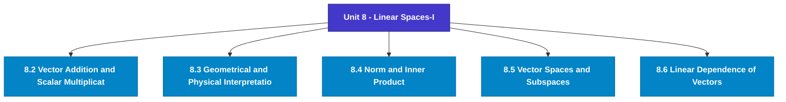

# MCS-061: Mathematical Foundations - I
## Unit 8: Linear Spaces-I

> 📚 **Programme:** M.Sc. (Data Science and Analytics) | **Semester:** Semester 1  
> ⏱️ **Estimated Study Time:** ~18 mins | 📄 **Textbook Pages:** 11 Pages  
> 📥 **Original PDF:** [Download & View Textbook](../../../pdfs/Semester_1/MCS-061_Mathematical_Foundations_-_I/Unit-8_Linear_Spaces-I.pdf)

---

### 🎯 Executive Concept & Data Science Relevance
In modern data systems, **Linear Spaces-I** forms a vital conceptual pillar. Linear algebra is the foundational language of Data Science and Machine Learning. Datasets are matrices $X \in \mathbb{R}^{n \times p}$, neural network weights are tensor matrices, and dimensionality reduction (PCA, SVD) relies directly on matrix decompositions, eigenvalues, and rank.

> [!NOTE]
> **Why this matters for your career:** Mastering linear spaces-i equips you with the foundational principles required to reason mathematically about high-dimensional datasets, evaluate algorithm performance, and avoid statistical pitfalls in production machine learning pipelines.

### 🗺️ Visual Knowledge Architecture
The following concept map illustrates the structural hierarchy and learning trajectory of this module:

### 📖 Core Definitions & Terminology Cards
| Term | Formal Mathematical / Technical Definition | Intuitive Analogy / Concrete Example |
| :--- | :--- | :--- |
| **Matrix** | A rectangular array of numbers arranged into $m$ rows and $n$ columns: $A \in \mathbb{R}^{m \times n}$. Entry at row $i$ and column $j$ is denoted $a_{ij}$. | *A tabular dataframe where rows represent records and columns represent features.* |
| **Determinant $\det(A)$ or $\vert A \vert$** | A scalar value computed from a square matrix that characterizes the volume scaling factor of the linear transformation. $\det(A) \neq 0 \iff A$ is non-singular and invertible. | *If $\det(A) = 0$, the transformation collapses space into a lower dimension, losing information.* |
| **Matrix Rank** | The maximum number of linearly independent row or column vectors in the matrix. Denoted $\text{rank}(A) \le \min(m, n)$. | *The true dimensionality of the data without redundant, collinear features.* |
| **Eigenvalue and Eigenvector** | A scalar $\lambda$ and non-zero vector $\mathbf{v}$ satisfying $A\mathbf{v} = \lambda \mathbf{v}$. The transformation by $A$ merely stretches or shrinks $\mathbf{v}$ without changing its direction. | *The principal directions of maximum variance in Principal Component Analysis (PCA).* |

### ⚡ Governing Mathematical Laws & Formula Cheatsheet
#### 🔹 Matrix Multiplication Dimension Rule

$$
C_{m \times p} = A_{m \times n} B_{n \times p} \quad \text{where } c_{ij} = \sum_{k=1}^n a_{ik} b_{kj}
$$

- **Explanation:** Inner dimensions must match: columns of $A$ must equal rows of $B$.

#### 🔹 Matrix Inverse Formula

$$
A^{-1} = \frac{1}{\det(A)} \text{adj}(A) \quad \text{valid when } \det(A) \neq 0
$$

- **Explanation:** The inverse exists if and only if the matrix is full rank and non-singular.

#### 🔹 Characteristic Equation for Eigenvalues

$$
\det(A - \lambda I) = 0
$$

- **Explanation:** Solving this polynomial equation yields the eigenvalues $\lambda_1, \lambda_2, \dots, \lambda_n$ of matrix $A$.

#### 🔹 Cayley-Hamilton Theorem

$$
p(A) = O \quad \text{where } p(\lambda) = \det(A - \lambda I)
$$

- **Explanation:** Every square matrix satisfies its own characteristic polynomial equation.

### 📌 Detailed Section-by-Section Study Breakdown
#### `8.2` Vector Addition and Scalar Multiplication
- **Core Concept:** Establishes rigorous theoretical formulations and computational bounds for vector addition and scalar multiplication.
- **Core Concept:** Applies standard algorithmic procedures and mathematical invariants relevant to linear spaces-i.
- **Core Concept:** Ensures deterministic performance guarantees across high-dimensional feature spaces.
- **Data Science Application:** Provides foundational structures used directly in statistical modeling, query execution, and machine learning pipelines.

> [!TIP]
> **Exam & Interview Tip:** Be prepared to state the formal definition of vector addition and scalar multiplication and derive its primary equations step-by-step.

#### `8.3` Geometrical and Physical Interpretations
- **Core Concept:** Vector is often represented geometrically by a line with an arrowhead on it (𝑠𝑎𝑦, 𝑥 →).
- **Core Concept:** The length of the line indicates the magnitude of the vector, and the arrow denotes its direction.
- **Core Concept:** It should be noted that a vector is not just a number.
- **Data Science Application:** Provides foundational structures used directly in statistical modeling, query execution, and machine learning pipelines.

> [!TIP]
> **Exam & Interview Tip:** Be prepared to state the formal definition of geometrical and physical interpretations and derive its primary equations step-by-step.

#### `8.4` Norm and Inner Product
- **Core Concept:** Both through scalar multiplication and vector addition transform one vector, or, a pair of vectors into another vector.
- **Core Concept:** Unlike these concepts defined in section 8.2, we will now define functions, which transform a pair of vectors into a scalar, a real number.
- **Core Concept:** The inner product would be ‖𝒂‖ = √𝑎12 + 𝑎22 + ⋯+ 𝑎𝑛2.
- **Data Science Application:** Provides foundational structures used directly in statistical modeling, query execution, and machine learning pipelines.

> [!TIP]
> **Exam & Interview Tip:** Be prepared to state the formal definition of norm and inner product and derive its primary equations step-by-step.

#### `8.5` Vector Spaces and Subspaces
- **Core Concept:** u+0 = 0+u =u Where 0 = (0,0,…,0) is a zero vector.
- **Core Concept:** For each u there exists – u such that u + (-u) = (-u) + u =0 6.
- **Core Concept:** 𝟏𝒖= 𝒖 The set V satisfying i, ii and iii above said to be a vector space or a linear space over the field R.
- **Data Science Application:** Provides foundational structures used directly in statistical modeling, query execution, and machine learning pipelines.

> [!TIP]
> **Exam & Interview Tip:** Be prepared to state the formal definition of vector spaces and subspaces and derive its primary equations step-by-step.

#### `8.6` Linear Dependence of Vectors
- **Core Concept:** A set of vectors 𝒙𝟏, 𝒙𝟐, … , 𝒙𝒏 are said to be linearly independent if there exists scalars c1, c2,...,cn not all zero such that c1x1+ c2x2+...+ cnxn=0.
- **Core Concept:** On the contrary, if no such scalars exist, then the vectors x1, ..., xn are said to be linearly independent.
- **Core Concept:** The term 'linearly' in the above definition is important because only linear operations, i.e., scalar multiplication and vector addition, are permitted in obtaining the null vector.
- **Data Science Application:** Provides foundational structures used directly in statistical modeling, query execution, and machine learning pipelines.

> [!TIP]
> **Exam & Interview Tip:** Be prepared to state the formal definition of linear dependence of vectors and derive its primary equations step-by-step.

#### `8.7` Generators and Basis
- **Core Concept:** Consider the case of two-dimensional Euclidian space (E2).
- **Core Concept:** In E2 , for the vectors u = (1 0) 𝑎𝑛𝑑 𝒗= (0 1), it is easily seen that any vector 𝒙= (𝑥1 𝑥2) may be generated from the vectors u and v as follows 9 Linear Spaces - 1 𝒙= 𝑥1𝒖+ 𝑥2𝒗, 𝑓𝑜𝑟 𝑥1, 𝑥2 ∈R.
- **Core Concept:** Such vectors u and v- from which all other vectors can be obtained as linear combinations as above – are called ‘generators’ of the vector space, in this case, of the two-dimensional space (E2).
- **Data Science Application:** Provides foundational structures used directly in statistical modeling, query execution, and machine learning pipelines.

> [!TIP]
> **Exam & Interview Tip:** Be prepared to state the formal definition of generators and basis and derive its primary equations step-by-step.

### 💡 Interactive Self-Assessment Checkpoints
Test your comprehension before proceeding. Tap each question to reveal the comprehensive explanation:

<b>Checkpoint 1:</b> What happens if $\det(A) = 0$ for a square matrix $A$? <i>(Tap to reveal answer)</i>

> **Answer & Analysis:**  
> The matrix is **singular**, has no multiplicative inverse ($A^{-1}$ does not exist), and its row vectors are linearly dependent.

<b>Checkpoint 2:</b> State the relationship between $(AB)^T$ and the transposes of $A$ and $B$. <i>(Tap to reveal answer)</i>

> **Answer & Analysis:**  
> $(AB)^T = B^T A^T$. The order of multiplication is reversed upon transposition.

<b>Checkpoint 3:</b> What is the characteristic equation used for finding eigenvalues? <i>(Tap to reveal answer)</i>

> **Answer & Analysis:**  
> $\det(A - \lambda I) = 0$, where $I$ is the identity matrix of matching dimension.

<b>Checkpoint 4:</b> If a1 = (2,3,4,7), a2 = (0,0,0,1) and a3 = (1,0,1,0), find a1+2a2+3a3. <i>(Tap to reveal answer)</i>

> **Answer & Analysis:**  
> This question tests your conceptual mastery of Linear Spaces-I. Review the governing formulas and section breakdowns above to formulate a complete, rigorous proof or derivation.

<b>Checkpoint 5:</b> If x1 = (2,9,8) , x2= (0,1,0) and x3 = (1,0,1), find 2x2+5x3-x1. <i>(Tap to reveal answer)</i>

> **Answer & Analysis:**  
> This question tests your conceptual mastery of Linear Spaces-I. Review the governing formulas and section breakdowns above to formulate a complete, rigorous proof or derivation.

<b>Checkpoint 6:</b> Find the norm of the following vectors: (i) (2,5); (ii) (-2,2). <i>(Tap to reveal answer)</i>

> **Answer & Analysis:**  
> This question tests your conceptual mastery of Linear Spaces-I. Review the governing formulas and section breakdowns above to formulate a complete, rigorous proof or derivation.

### 🎯 Executive Module Wrap-Up
- **Central Idea:** Linear Spaces-I provides essential mathematical and algorithmic tools directly utilized in Data Science.
- **Mathematical Rigor:** Formulas and laws must be memorized with attention to boundary conditions and assumptions.
- **Full Textbook Coverage:** For exhaustive multi-page derivations, proofs, and supplementary exercises, consult the [Authentic IGNOU Textbook](../../../pdfs/Semester_1/MCS-061_Mathematical_Foundations_-_I/Unit-8_Linear_Spaces-I.pdf).

---
### 🧭 Navigation & Syllabus Index
[⬅ Previous: Unit 7](unit_07_Determinants.md) | [📑 Course Index](README.md) | [Next: Unit 9 ➡](unit_09_Linear_Spaces-II.md)
