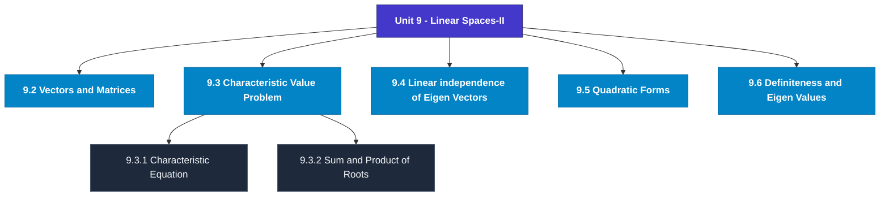

# MCS-061: Mathematical Foundations - I
## Unit 9: Linear Spaces-II

> 📚 **Programme:** M.Sc. (Data Science and Analytics) | **Semester:** Semester 1  
> ⏱️ **Estimated Study Time:** ~23 mins | 📄 **Textbook Pages:** 16 Pages  
> 📥 **Original PDF:** [Download & View Textbook](../../../pdfs/Semester_1/MCS-061_Mathematical_Foundations_-_I/Unit-9_Linear_Spaces-II.pdf)

---

### 🎯 Executive Concept & Data Science Relevance
In modern data systems, **Linear Spaces-II** forms a vital conceptual pillar. Linear algebra is the foundational language of Data Science and Machine Learning. Datasets are matrices $X \in \mathbb{R}^{n \times p}$, neural network weights are tensor matrices, and dimensionality reduction (PCA, SVD) relies directly on matrix decompositions, eigenvalues, and rank.

> [!NOTE]
> **Why this matters for your career:** Mastering linear spaces-ii equips you with the foundational principles required to reason mathematically about high-dimensional datasets, evaluate algorithm performance, and avoid statistical pitfalls in production machine learning pipelines.

### 🗺️ Visual Knowledge Architecture
The following concept map illustrates the structural hierarchy and learning trajectory of this module:

### 📖 Core Definitions & Terminology Cards
| Term | Formal Mathematical / Technical Definition | Intuitive Analogy / Concrete Example |
| :--- | :--- | :--- |
| **Matrix** | A rectangular array of numbers arranged into $m$ rows and $n$ columns: $A \in \mathbb{R}^{m \times n}$. Entry at row $i$ and column $j$ is denoted $a_{ij}$. | *A tabular dataframe where rows represent records and columns represent features.* |
| **Determinant $\det(A)$ or $\vert A \vert$** | A scalar value computed from a square matrix that characterizes the volume scaling factor of the linear transformation. $\det(A) \neq 0 \iff A$ is non-singular and invertible. | *If $\det(A) = 0$, the transformation collapses space into a lower dimension, losing information.* |
| **Matrix Rank** | The maximum number of linearly independent row or column vectors in the matrix. Denoted $\text{rank}(A) \le \min(m, n)$. | *The true dimensionality of the data without redundant, collinear features.* |
| **Eigenvalue and Eigenvector** | A scalar $\lambda$ and non-zero vector $\mathbf{v}$ satisfying $A\mathbf{v} = \lambda \mathbf{v}$. The transformation by $A$ merely stretches or shrinks $\mathbf{v}$ without changing its direction. | *The principal directions of maximum variance in Principal Component Analysis (PCA).* |

### ⚡ Governing Mathematical Laws & Formula Cheatsheet
#### 🔹 Matrix Multiplication Dimension Rule

$$
C_{m \times p} = A_{m \times n} B_{n \times p} \quad \text{where } c_{ij} = \sum_{k=1}^n a_{ik} b_{kj}
$$

- **Explanation:** Inner dimensions must match: columns of $A$ must equal rows of $B$.

#### 🔹 Matrix Inverse Formula

$$
A^{-1} = \frac{1}{\det(A)} \text{adj}(A) \quad \text{valid when } \det(A) \neq 0
$$

- **Explanation:** The inverse exists if and only if the matrix is full rank and non-singular.

#### 🔹 Characteristic Equation for Eigenvalues

$$
\det(A - \lambda I) = 0
$$

- **Explanation:** Solving this polynomial equation yields the eigenvalues $\lambda_1, \lambda_2, \dots, \lambda_n$ of matrix $A$.

#### 🔹 Cayley-Hamilton Theorem

$$
p(A) = O \quad \text{where } p(\lambda) = \det(A - \lambda I)
$$

- **Explanation:** Every square matrix satisfies its own characteristic polynomial equation.

### 📌 Detailed Section-by-Section Study Breakdown
#### `9.2` Vectors and Matrices
- **Core Concept:** Establishes rigorous theoretical formulations and computational bounds for vectors and matrices.
- **Core Concept:** Applies standard algorithmic procedures and mathematical invariants relevant to linear spaces-ii.
- **Core Concept:** Ensures deterministic performance guarantees across high-dimensional feature spaces.
- **Data Science Application:** Provides foundational structures used directly in statistical modeling, query execution, and machine learning pipelines.

> [!TIP]
> **Exam & Interview Tip:** Be prepared to state the formal definition of vectors and matrices and derive its primary equations step-by-step.

#### `9.3` Characteristic Value Problem
- **Core Concept:** Establishes rigorous theoretical formulations and computational bounds for characteristic value problem.
- **Core Concept:** Applies standard algorithmic procedures and mathematical invariants relevant to linear spaces-ii.
- **Core Concept:** Ensures deterministic performance guarantees across high-dimensional feature spaces.
- **Data Science Application:** Provides foundational structures used directly in statistical modeling, query execution, and machine learning pipelines.

> [!TIP]
> **Exam & Interview Tip:** Be prepared to state the formal definition of characteristic value problem and derive its primary equations step-by-step.

#### `9.3.1` Characteristic Equation
- **Core Concept:** For given n, to solve the system of equations Ax= λx, for λ, it can be written as (A −λI) x touching 0 (A−λI x = 0), Where I is a unit matrix of order n.
- **Core Concept:** The equation (i) is called the 'characteristic equation’ of matrix A and the left-hand side is called the 'characteristic polynomial' of matrix A.
- **Core Concept:** Example: Characteristic polynomial for a square matrix of order 2.
- **Data Science Application:** Provides foundational structures used directly in statistical modeling, query execution, and machine learning pipelines.

> [!TIP]
> **Exam & Interview Tip:** Be prepared to state the formal definition of characteristic equation and derive its primary equations step-by-step.

#### `9.3.2` Sum and Product of Roots
- **Core Concept:** 𝑐 j = (−1)𝑗∑ all principal minor or order j Thus, if characteristic roots are 𝜆1, 𝜆2, … … … , 𝜆𝑛, then ∑ 𝜆 𝑛 𝑖=1 𝑖= ∑ 𝑎𝑖𝑖 𝑛 𝑖=1 = 𝑇𝑟𝑎𝑐𝑒 (𝐴)𝑎𝑛𝑑 𝜆1, 𝜆2, … .
- **Core Concept:** 𝜆𝑛= ∏ 𝑛 𝑖=1𝜆𝑖= |𝐴| where Trace of a square matrix is the sum of its principal diagonal elements.
- **Core Concept:** Example: Let, A = [2 1 1 2] The characteristic equation is |𝐴−𝜆𝐼| = |2 −𝜆 1 1 2 −𝜆| = (2 −𝜆)2 −1 = 0 or, 4 −4𝜆+ 𝜆2 −1 = 0 or, 𝜆2 −4𝜆+ 3 = 0 𝜆= 4 ± √16 −12 2 = 4 ± 2 2 = 3,1 𝑖.
- **Data Science Application:** Provides foundational structures used directly in statistical modeling, query execution, and machine learning pipelines.

> [!TIP]
> **Exam & Interview Tip:** Be prepared to state the formal definition of sum and product of roots and derive its primary equations step-by-step.

#### `9.3.3` Characteristic Vector
- **Core Concept:** Let us now consider the determination of the value of x of the equation Ax = 𝜆x.
- **Core Concept:** Note that is chosen in such a way that [A - λI] is singular, i.e., its rank is less than n.
- **Core Concept:** We may make it unique through some additional restrictions.
- **Data Science Application:** Provides foundational structures used directly in statistical modeling, query execution, and machine learning pipelines.

> [!TIP]
> **Exam & Interview Tip:** Be prepared to state the formal definition of characteristic vector and derive its primary equations step-by-step.

#### `9.3.4` Diagonalisation
- **Core Concept:** It is a general property of real symmetric matrices that their roots are always real and that the associated characteristic vectors are mutually orthogonal.
- **Core Concept:** This implies that such a matrix can always be diagonalized by P, the matrix of n characteristic vectors.
- **Core Concept:** Continuing with the previous example, if we define a 2 x 2 matrix as 𝑃≡(𝑥1𝑥2) = [1 √2 ⁄ 1 √2 ⁄ 1 √2 ⁄ −1 √2 ⁄ ] Then PTP = I, i.e., P is an orthogonal matrix.
- **Data Science Application:** Provides foundational structures used directly in statistical modeling, query execution, and machine learning pipelines.

> [!TIP]
> **Exam & Interview Tip:** Be prepared to state the formal definition of diagonalisation and derive its primary equations step-by-step.

### 💡 Interactive Self-Assessment Checkpoints
Test your comprehension before proceeding. Tap each question to reveal the comprehensive explanation:

<b>Checkpoint 1:</b> What happens if $\det(A) = 0$ for a square matrix $A$? <i>(Tap to reveal answer)</i>

> **Answer & Analysis:**  
> The matrix is **singular**, has no multiplicative inverse ($A^{-1}$ does not exist), and its row vectors are linearly dependent.

<b>Checkpoint 2:</b> State the relationship between $(AB)^T$ and the transposes of $A$ and $B$. <i>(Tap to reveal answer)</i>

> **Answer & Analysis:**  
> $(AB)^T = B^T A^T$. The order of multiplication is reversed upon transposition.

<b>Checkpoint 3:</b> What is the characteristic equation used for finding eigenvalues? <i>(Tap to reveal answer)</i>

> **Answer & Analysis:**  
> $\det(A - \lambda I) = 0$, where $I$ is the identity matrix of matching dimension.

<b>Checkpoint 4:</b> Define the terms: eigen value, eigen vector and characteristic equations. <i>(Tap to reveal answer)</i>

> **Answer & Analysis:**  
> This question tests your conceptual mastery of Linear Spaces-II. Review the governing formulas and section breakdowns above to formulate a complete, rigorous proof or derivation.

<b>Checkpoint 5:</b> Write down the quadratic form : Q(x, y, z) = x <i>(Tap to reveal answer)</i>

> **Answer & Analysis:**  
> This question tests your conceptual mastery of Linear Spaces-II. Review the governing formulas and section breakdowns above to formulate a complete, rigorous proof or derivation.

<b>Checkpoint 6:</b> in the symmetric matrix form. <i>(Tap to reveal answer)</i>

> **Answer & Analysis:**  
> This question tests your conceptual mastery of Linear Spaces-II. Review the governing formulas and section breakdowns above to formulate a complete, rigorous proof or derivation.

### 🎯 Executive Module Wrap-Up
- **Central Idea:** Linear Spaces-II provides essential mathematical and algorithmic tools directly utilized in Data Science.
- **Mathematical Rigor:** Formulas and laws must be memorized with attention to boundary conditions and assumptions.
- **Full Textbook Coverage:** For exhaustive multi-page derivations, proofs, and supplementary exercises, consult the [Authentic IGNOU Textbook](../../../pdfs/Semester_1/MCS-061_Mathematical_Foundations_-_I/Unit-9_Linear_Spaces-II.pdf).

---
### 🧭 Navigation & Syllabus Index
[⬅ Previous: Unit 8](unit_08_Linear_Spaces-I.md) | [📑 Course Index](README.md) | [Next: Unit 10 ➡](unit_10_Techniques_of_Counting_and_Binomial_Theorem.md)
