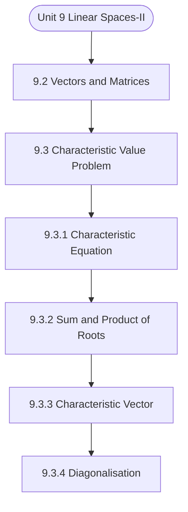

# MCS-061: Mathematical Foundations - I
## Unit 9: Linear Spaces-II

> 📚 **Programme:** M.Sc. (Data Science and Analytics) | **Semester:** Semester 1  
> ⏱️ **Estimated Study Time:** ~23 mins | 📄 **Textbook Pages:** 16 Pages  
> 📥 **Original PDF:** [Download & View Authentic Textbook](../../../pdfs/Semester_1/MCS-061_Mathematical_Foundations_-_I/Unit-9_Linear_Spaces-II.pdf)

---

### 🎯 Executive Concept & Data Science Relevance
In modern data systems and advanced analytics, **Linear Spaces-II** forms a vital conceptual pillar. Linear algebra is the foundational language of Data Science and Machine Learning. Datasets are matrices $X \in \mathbb{R}^{n \times p}$, neural network weights are tensor matrices, and dimensionality reduction (PCA, SVD) relies directly on matrix decompositions, eigenvalues, and rank.

> [!NOTE]
> **Why this matters for your career:** Mastering linear spaces-ii equips you with the foundational principles required to reason mathematically about high-dimensional datasets, evaluate algorithm performance, and avoid statistical pitfalls in production machine learning pipelines.

### 🗺️ Visual Knowledge Architecture
The following concept map illustrates the structural hierarchy and learning trajectory of this module:



### 📖 Core Definitions & Terminology Cards

> 📌 **Matrix**  
> - **Formal Definition:** A rectangular array of numbers arranged into $m$ rows and $n$ columns: $A \in \mathbb{R}^{m \times n}$. Entry at row $i$ and column $j$ is denoted $a_{ij}$.  
> - 💡 **Practical Intuition & Analogy:** *A tabular dataframe where rows represent records and columns represent features.*

> 📌 **Determinant $\det(A)$ or $\vert A \vert$**  
> - **Formal Definition:** A scalar value computed from a square matrix that characterizes the volume scaling factor of the linear transformation. $\det(A) \neq 0 \iff A$ is non-singular and invertible.  
> - 💡 **Practical Intuition & Analogy:** *If $\det(A) = 0$, the transformation collapses space into a lower dimension, losing information.*

> 📌 **Matrix Rank**  
> - **Formal Definition:** The maximum number of linearly independent row or column vectors in the matrix. Denoted $\text{rank}(A) \le \min(m, n)$.  
> - 💡 **Practical Intuition & Analogy:** *The true dimensionality of the data without redundant, collinear features.*

> 📌 **Eigenvalue and Eigenvector**  
> - **Formal Definition:** A scalar $\lambda$ and non-zero vector $\mathbf{v}$ satisfying $A\mathbf{v} = \lambda \mathbf{v}$. The transformation by $A$ merely stretches or shrinks $\mathbf{v}$ without changing its direction.  
> - 💡 **Practical Intuition & Analogy:** *The principal directions of maximum variance in Principal Component Analysis (PCA).*

### ⚡ Governing Mathematical Laws & Formula Cheatsheet
#### 🔹 Matrix Multiplication Dimension Rule
$$
C_{m \times p} = A_{m \times n} B_{n \times p} \quad \text{where } c_{ij} = \sum_{k=1}^n a_{ik} b_{kj}
$$
- **Explanation:** Inner dimensions must match: columns of $A$ must equal rows of $B$.

#### 🔹 Matrix Inverse Formula
$$
A^{-1} = \frac{1}{\det(A)} \text{adj}(A) \quad \text{valid when } \det(A) \neq 0
$$
- **Explanation:** The inverse exists if and only if the matrix is full rank and non-singular.

#### 🔹 Characteristic Equation for Eigenvalues
$$
\det(A - \lambda I) = 0
$$
- **Explanation:** Solving this polynomial equation yields the eigenvalues $\lambda_1, \lambda_2, \dots, \lambda_n$ of matrix $A$.

#### 🔹 Cayley-Hamilton Theorem
$$
p(A) = O \quad \text{where } p(\lambda) = \det(A - \lambda I)
$$
- **Explanation:** Every square matrix satisfies its own characteristic polynomial equation.

### ⚖️ Axiomatic Properties & Governing Laws
The mathematical formulations of this module are anchored by foundational algebraic and structural laws:

- **Determinant Product Rule:** $\det(AB) = \det(A)\det(B)$
- **Transpose Product Reversal:** $(AB)^T = B^T A^T$
- **Inverse Product Reversal:** $(AB)^{-1} = B^{-1} A^{-1}$
- **Orthogonal Matrix Property:** $Q^T Q = Q Q^T = I \implies Q^{-1} = Q^T$
- **Rank-Nullity Theorem:** $\text{rank}(A) + \text{nullity}(A) = n \quad \text{for } A \in \mathbb{R}^{m \times n}$

### 📌 Comprehensive Section-by-Section Study Breakdown
#### `9.2` Vectors and Matrices

##### 📘 Theoretical Principles & Pedagogical Exposition
expressions involving vectors and matrices can be obtained directly from the definitions. The vector derivatives of linear functions, quadratic forms and bilinear forms are defined and illustrated in this section. Second and higher order derivatives are not discussed explicitly, but can be obtained by successive differentiation in the usual manner.


##### ⚙️ Mathematical & Algorithmic Mechanics
- **Core Mechanism:** Linear transformations represented by $A \in \mathbb{R}^{m \times n}$. Matrix invertibility requires non-zero determinant $\det(A) \neq 0$ and full column/row rank. Eigen-decomposition $A v = \lambda v$ identifies invariant directional axes and scaling factors.
- **Boundary Conditions:** Singular matrices (det = 0), ill-conditioned matrices with condition number $\kappa(A) \gg 1$, and rank deficiency under collinear feature dimensions.

##### 📊 Practical Data Science & Production Relevance
- **Production Workflow:** Principal Component Analysis (PCA covariance decomposition), Ordinary Least Squares (OLS) normal equations $(X^T X)^{-1} X^T y$, and embedding projection transformations in transformers.
- **Real-World Pitfall:** Inverting ill-conditioned matrices directly instead of using singular value decomposition (SVD) or QR decomposition, triggering catastrophic floating-point cancellation.

> [!TIP]
> **Exam & Technical Interview Insight:** Practice row reduction to Row Echelon Form (REF) to find matrix rank, determinant expansion by minors, and computing characteristic equations $\det(A - \lambda I) = 0$.

#### `9.3` Characteristic Value Problem

##### 📘 Theoretical Principles & Pedagogical Exposition
For given n, to solve the system of equations Ax= λx, for λ, it can be written as (A −λI) x touching 0 (A−λI x = 0), Where I is a unit matrix of order n. Now, if the system has to have a non-trivial solution for the variable vector X, then rank [A−λ1] < n , which is true if and only if | a11 −λ a12 … a1n a21 a22 −λ … a2n ⋮ an1 ⋮ an2 ⋱ … ⋮ ann −λ | = 0 (i) The LHS in (i) gives us an nth degree polynomial equation in λ.

The equation (i) is called the 'characteristic equation’ of matrix A and the left-hand side is called the 'characteristic polynomial' of matrix A. Example: Characteristic polynomial for a square matrix of order 2. |𝑎11 −𝜆 𝑎12 𝑎21 𝑎22 −𝜆| = 0 ⇒(𝑎11 −𝜆)(𝑎22 −𝜆) −𝑎12𝑎21 = 0 ⇒ 𝜆2 −𝜆 (𝑎11 + 𝑎22) + (𝑎11𝑎22 −𝑎12𝑎21) = 0 which is a quadratic equation in 𝜆.

Note: if A is of order n, then the equation | A−λI | = 0 has n roots which may be real or complex, distinct or multiple, and zero or non-zero.


##### ⚙️ Mathematical & Algorithmic Mechanics
- **Core Mechanism:** Linear transformations represented by $A \in \mathbb{R}^{m \times n}$. Matrix invertibility requires non-zero determinant $\det(A) \neq 0$ and full column/row rank. Eigen-decomposition $A v = \lambda v$ identifies invariant directional axes and scaling factors.
- **Boundary Conditions:** Singular matrices (det = 0), ill-conditioned matrices with condition number $\kappa(A) \gg 1$, and rank deficiency under collinear feature dimensions.

##### 📊 Practical Data Science & Production Relevance
- **Production Workflow:** Principal Component Analysis (PCA covariance decomposition), Ordinary Least Squares (OLS) normal equations $(X^T X)^{-1} X^T y$, and embedding projection transformations in transformers.
- **Real-World Pitfall:** Inverting ill-conditioned matrices directly instead of using singular value decomposition (SVD) or QR decomposition, triggering catastrophic floating-point cancellation.

> [!TIP]
> **Exam & Technical Interview Insight:** Practice row reduction to Row Echelon Form (REF) to find matrix rank, determinant expansion by minors, and computing characteristic equations $\det(A - \lambda I) = 0$.

#### `9.3.1` Characteristic Equation

##### 📘 Theoretical Principles & Pedagogical Exposition
For given n, to solve the system of equations Ax= λx, for λ, it can be written as (A −λI) x touching 0 (A−λI x = 0), Where I is a unit matrix of order n. Now, if the system has to have a non-trivial solution for the variable vector X, then rank [A−λ1] < n , which is true if and only if | a11 −λ a12 … a1n a21 a22 −λ … a2n ⋮ an1 ⋮ an2 ⋱ … ⋮ ann −λ | = 0 (i) The LHS in (i) gives us an nth degree polynomial equation in λ.

The equation (i) is called the 'characteristic equation’ of matrix A and the left-hand side is called the 'characteristic polynomial' of matrix A. Example: Characteristic polynomial for a square matrix of order 2. |𝑎11 −𝜆 𝑎12 𝑎21 𝑎22 −𝜆| = 0 ⇒(𝑎11 −𝜆)(𝑎22 −𝜆) −𝑎12𝑎21 = 0 ⇒ 𝜆2 −𝜆 (𝑎11 + 𝑎22) + (𝑎11𝑎22 −𝑎12𝑎21) = 0 which is a quadratic equation in 𝜆.

Note: if A is of order n, then the equation | A−λI | = 0 has n roots which may be real or complex, distinct or multiple, and zero or non-zero.


##### ⚙️ Mathematical & Algorithmic Mechanics
- **Core Mechanism:** Linear transformations represented by $A \in \mathbb{R}^{m \times n}$. Matrix invertibility requires non-zero determinant $\det(A) \neq 0$ and full column/row rank. Eigen-decomposition $A v = \lambda v$ identifies invariant directional axes and scaling factors.
- **Boundary Conditions:** Singular matrices (det = 0), ill-conditioned matrices with condition number $\kappa(A) \gg 1$, and rank deficiency under collinear feature dimensions.

##### 📊 Practical Data Science & Production Relevance
- **Production Workflow:** Principal Component Analysis (PCA covariance decomposition), Ordinary Least Squares (OLS) normal equations $(X^T X)^{-1} X^T y$, and embedding projection transformations in transformers.
- **Real-World Pitfall:** Inverting ill-conditioned matrices directly instead of using singular value decomposition (SVD) or QR decomposition, triggering catastrophic floating-point cancellation.

> [!TIP]
> **Exam & Technical Interview Insight:** Practice row reduction to Row Echelon Form (REF) to find matrix rank, determinant expansion by minors, and computing characteristic equations $\det(A - \lambda I) = 0$.

#### `9.3.2` Sum and Product of Roots

##### 📘 Theoretical Principles & Pedagogical Exposition
Linear Spaces and Counting Techniques Consider the equation 𝜆2 −𝜆(𝑎11 + 𝑎22) + (𝑎11𝑎22 −𝑎12𝑎21) = 0 and let us write it as 𝑐0𝜆0 + 𝑐1𝜆+ 𝑐2 = 0 where, 𝑐0 = 1, 𝑐1 = −(𝑎11 + 𝑎22), 𝑐2 = 𝑎11𝑎22 −𝑎12𝑎21 Applying the knowledge of determining roots of the quadratic equation, we can write, 𝜆1𝜆2 = 𝑐2 𝑐0 = 𝑎11𝑎22 −𝑎21𝑎12 = | 𝐴 | In general, if A is a square matrix of order n, then the characteristic equation |𝐴−𝜆𝐼| = 0 can be written as 𝑐0𝜆𝑛+ 𝑐1𝜆𝑛−1 + 𝑐2𝜆𝑛−2 + ⋯+ 𝑐𝑛−1𝜆+ 𝑐𝑛= where 𝑐0 = 1, 𝑐1 = −∑ 𝑎𝑖𝑖, 𝑎𝑛𝑑 𝑐𝑛= (−1)𝑛 |𝐴| 𝑛 𝐼=1 𝑐2 = Sum of all principal minors of A of order 2.

𝑐 j = (−1)𝑗∑ all principal minor or order j Thus, if characteristic roots are 𝜆1, 𝜆2, … … … , 𝜆𝑛, then ∑ 𝜆 𝑛 𝑖=1 𝑖= ∑ 𝑎𝑖𝑖 𝑛 𝑖=1 = 𝑇𝑟𝑎𝑐𝑒 (𝐴)𝑎𝑛𝑑 𝜆1, 𝜆2, … . 𝜆𝑛= ∏ 𝑛 𝑖=1𝜆𝑖= |𝐴| where Trace of a square matrix is the sum of its principal diagonal elements. Example: Let, A = [2 2] The characteristic equation is |𝐴−𝜆𝐼| = |2 −𝜆 2 −𝜆| = (2 −𝜆)2 −1 = 0 or, 4 −4𝜆+ 𝜆2 −1 = 0 or, 𝜆2 −4𝜆+ 3 = 0 𝜆= 4 ± √16 −12 = 4 ± 2 = 3,1 𝑖.

𝜆1 = 3, 𝜆2 = 1 Example: Find all the eigen values of A = [ −1 ] Solution Characteristic equation of A is: |𝐴−𝜆𝐼3| = 0 ⇒ | 𝟐−𝜆 −𝟏−𝜆 𝟑−𝜆 | = 0 Expanding along 𝐶1, we get Linear Spaces - 2 (2 −𝜆) |−(1 + 𝜆) (3 −𝜆)| −|1 3 −𝜆| + | −1 −𝜆 0| = 0 ⇒−(𝟐− 𝜆)(1 + 𝜆)(3 −𝜆) −(3 −𝜆−6) + 3(1 + 𝜆) = 0 ⇒ 𝜆3 −4𝜆2 −3𝜆= 0 ⇒𝜆(𝜆2 −4𝜆−3) = 0 ⇒𝜆= 0 𝑜𝑟 𝜆= 1 2 (4 ± √28 = 1 2 (2 ± √7) Properties: i) If A is singular square matrix, i.e., |A| = 0, then at least one characteristic root of A is zero.


##### ⚙️ Mathematical & Algorithmic Mechanics
- **Core Mechanism:** Linear transformations represented by $A \in \mathbb{R}^{m \times n}$. Matrix invertibility requires non-zero determinant $\det(A) \neq 0$ and full column/row rank. Eigen-decomposition $A v = \lambda v$ identifies invariant directional axes and scaling factors.
- **Boundary Conditions:** Singular matrices (det = 0), ill-conditioned matrices with condition number $\kappa(A) \gg 1$, and rank deficiency under collinear feature dimensions.

##### 📊 Practical Data Science & Production Relevance
- **Production Workflow:** Principal Component Analysis (PCA covariance decomposition), Ordinary Least Squares (OLS) normal equations $(X^T X)^{-1} X^T y$, and embedding projection transformations in transformers.
- **Real-World Pitfall:** Inverting ill-conditioned matrices directly instead of using singular value decomposition (SVD) or QR decomposition, triggering catastrophic floating-point cancellation.

> [!TIP]
> **Exam & Technical Interview Insight:** Practice row reduction to Row Echelon Form (REF) to find matrix rank, determinant expansion by minors, and computing characteristic equations $\det(A - \lambda I) = 0$.

#### `9.3.3` Characteristic Vector

##### 📘 Theoretical Principles & Pedagogical Exposition
Let us now consider the determination of the value of x of the equation Ax = 𝜆x. Note that is chosen in such a way that [A - λI] is singular, i.e., its rank is less than n. This ensures that [A- 𝜆I]X=0 is a homogeneous system of equations having a non-trivial solution. But this solution may not be unique.

We may make it unique through some additional restrictions. Further, one set of non-trivial solution xi will correspond root of λi. Note: In the above and following discussion the 'i' in xi, is NOT used in the sense power of x, but as superfix, just like a suffix. Example: Let us find the characteristics vector for the matrix 𝐴= [2 2] As we derived earlier, λ1 = 3, λ2 = 1.

 For λ1 = 3, A −λiI = [2 −3 2 −3] = [−1 −1] To get x1 = [𝑥1 𝑥2 1], From (A-λiI) x1, we have Linear Spaces and Counting Techniques −𝑥1 1 + 𝑥2 1 = 0 𝑥1 1 − 𝑥2 1 = 0} ⟹𝑥1 1 = 𝑥2 So, the number of solutions (one equation involving two variables) is infinite. Let us choose one by setting 𝑥1 1 = 1, so that 𝑥1 = [1 1].


##### ⚙️ Mathematical & Algorithmic Mechanics
- **Core Mechanism:** Linear transformations represented by $A \in \mathbb{R}^{m \times n}$. Matrix invertibility requires non-zero determinant $\det(A) \neq 0$ and full column/row rank. Eigen-decomposition $A v = \lambda v$ identifies invariant directional axes and scaling factors.
- **Boundary Conditions:** Singular matrices (det = 0), ill-conditioned matrices with condition number $\kappa(A) \gg 1$, and rank deficiency under collinear feature dimensions.

##### 📊 Practical Data Science & Production Relevance
- **Production Workflow:** Principal Component Analysis (PCA covariance decomposition), Ordinary Least Squares (OLS) normal equations $(X^T X)^{-1} X^T y$, and embedding projection transformations in transformers.
- **Real-World Pitfall:** Inverting ill-conditioned matrices directly instead of using singular value decomposition (SVD) or QR decomposition, triggering catastrophic floating-point cancellation.

> [!TIP]
> **Exam & Technical Interview Insight:** Practice row reduction to Row Echelon Form (REF) to find matrix rank, determinant expansion by minors, and computing characteristic equations $\det(A - \lambda I) = 0$.

#### `9.3.4` Diagonalisation

##### 📘 Theoretical Principles & Pedagogical Exposition
It is a general property of real symmetric matrices that their roots are always real and that the associated characteristic vectors are mutually orthogonal. This implies that such a matrix can always be diagonalized by P, the matrix of n characteristic vectors. Continuing with the previous example, if we define a 2 x 2 matrix as 𝑃≡(𝑥1𝑥2) = [1 √2 ⁄ 1 √2 ⁄ 1 √2 ⁄ −1 √2 ⁄ ] Then PTP = I, i.e., P is an orthogonal matrix.

and PTAP = [1 √2 ⁄ 1 √2 ⁄ 1 √2 ⁄ −1 √2 ⁄ ] [2 2] [1 √2 ⁄ 1 √2 ⁄ 1 √2 ⁄ −1 √2 ⁄ ] Linear Spaces and Counting Techniques = [3 1] = [λ1 λ2] = ⋀ i.e., PTAP = ⋀ , where ⋀ is the diagonal matrix consisting of the characteristic values of A as its diagonal elements. Example: Diagonalize the matrix 𝐴= [ −1 −1 −1 −3 ] Solution: We have already seen that eigen vectors of A are [ ], [ ], [ −3 ] Let P = [ −3 ] ⇒𝑃−1 = 1 2 [ −6 −1 −2 −2 −1 ] We now show that 𝑃−1𝐴𝑃[ 𝜆1 𝜆2 𝜆3 ] Where 𝜆1 = 0, 𝜆2 = 1, 𝜆3 = 1 .

We have 𝑃−1𝐴𝑃= (𝑃−1𝐴)𝑃 = 1 2 [ −6 −1 −2 −2 −1 ] [ −1 −1 −1 −3 ] 𝑃 = 1 2 [ −2 −4 −2 ] [ −3 ] = [ −1 −2 −1 ] [ −3 ] [ ] Linear Spaces - 2 Note: This is general procedure to diagonalize a square matrix.


##### ⚙️ Mathematical & Algorithmic Mechanics
- **Core Mechanism:** Linear transformations represented by $A \in \mathbb{R}^{m \times n}$. Matrix invertibility requires non-zero determinant $\det(A) \neq 0$ and full column/row rank. Eigen-decomposition $A v = \lambda v$ identifies invariant directional axes and scaling factors.
- **Boundary Conditions:** Singular matrices (det = 0), ill-conditioned matrices with condition number $\kappa(A) \gg 1$, and rank deficiency under collinear feature dimensions.

##### 📊 Practical Data Science & Production Relevance
- **Production Workflow:** Principal Component Analysis (PCA covariance decomposition), Ordinary Least Squares (OLS) normal equations $(X^T X)^{-1} X^T y$, and embedding projection transformations in transformers.
- **Real-World Pitfall:** Inverting ill-conditioned matrices directly instead of using singular value decomposition (SVD) or QR decomposition, triggering catastrophic floating-point cancellation.

> [!TIP]
> **Exam & Technical Interview Insight:** Practice row reduction to Row Echelon Form (REF) to find matrix rank, determinant expansion by minors, and computing characteristic equations $\det(A - \lambda I) = 0$.

#### `9.4` Linear independence of Eigen Vectors

##### 📘 Theoretical Principles & Pedagogical Exposition
LINEAR INDEPENDENCE OF EIGEN VECTORS Another important property, in this context, is that, if λ1, λ2,……..,λn are distinct, then the corresponding characteristic vectors viz. x1, x2 ,..., xn, of A, are linearly independent. The condition (for the roots to be distinct) is sufficient but not necessary.

Even when some root, or more than one root, is repeated, it may be possible to find a set of n characteristic vectors, which are linearly independent. Moreover, if two roots are distinct then the characteristic vectors corresponding to them will be orthogonal.


##### ⚙️ Mathematical & Algorithmic Mechanics
- **Core Mechanism:** Linear transformations represented by $A \in \mathbb{R}^{m \times n}$. Matrix invertibility requires non-zero determinant $\det(A) \neq 0$ and full column/row rank. Eigen-decomposition $A v = \lambda v$ identifies invariant directional axes and scaling factors.
- **Boundary Conditions:** Singular matrices (det = 0), ill-conditioned matrices with condition number $\kappa(A) \gg 1$, and rank deficiency under collinear feature dimensions.

##### 📊 Practical Data Science & Production Relevance
- **Production Workflow:** Principal Component Analysis (PCA covariance decomposition), Ordinary Least Squares (OLS) normal equations $(X^T X)^{-1} X^T y$, and embedding projection transformations in transformers.
- **Real-World Pitfall:** Inverting ill-conditioned matrices directly instead of using singular value decomposition (SVD) or QR decomposition, triggering catastrophic floating-point cancellation.

> [!TIP]
> **Exam & Technical Interview Insight:** Practice row reduction to Row Echelon Form (REF) to find matrix rank, determinant expansion by minors, and computing characteristic equations $\det(A - \lambda I) = 0$.

#### `9.5` Quadratic Forms

##### 📘 Theoretical Principles & Pedagogical Exposition
QUADRATIC FORMS Consider the expression a11x12+2a12x1x2+a22x22 where a11, a12 and a22 are given constants and x1 and x2 are real variables. Expression such as this--being homogeneous of degree 2 in x1 and x2-is called quadratic form. Generally, on evaluation of the expression, its sign would depend not only on a's but also on the values of x1 and x2.

But sometimes, given the values of a's, it is possible to determine the sign of the expression, whatever x1 and x2 may be. For example, for Q(x1, x2) = x12− 4x1x2+4x22 = (x1−2x2)2, 𝑄(𝑥1, 𝑥2) is non-negative for all values of x and x2. Similarly, for Q (x1,x2)= −10x12+6x1 x2 − x22 = − x12− (3x1−x2)2, 𝑄(𝑥1, 𝑥2) is non-positive for all values of (x1, x2).

The quadratic forms that have a definite sign for all values of (x1, x2) are said to be either positive definite or negative definite depending on the sign. Other quadratic equations, which could vary in sign, are said to be indefinite quadratic forms. In general, with variables x1, x2 ,..., xn, we may have a quadratic form as: Q(x1, x2 , .


##### ⚙️ Mathematical & Algorithmic Mechanics
- **Core Mechanism:** Linear transformations represented by $A \in \mathbb{R}^{m \times n}$. Matrix invertibility requires non-zero determinant $\det(A) \neq 0$ and full column/row rank. Eigen-decomposition $A v = \lambda v$ identifies invariant directional axes and scaling factors.
- **Boundary Conditions:** Singular matrices (det = 0), ill-conditioned matrices with condition number $\kappa(A) \gg 1$, and rank deficiency under collinear feature dimensions.

##### 📊 Practical Data Science & Production Relevance
- **Production Workflow:** Principal Component Analysis (PCA covariance decomposition), Ordinary Least Squares (OLS) normal equations $(X^T X)^{-1} X^T y$, and embedding projection transformations in transformers.
- **Real-World Pitfall:** Inverting ill-conditioned matrices directly instead of using singular value decomposition (SVD) or QR decomposition, triggering catastrophic floating-point cancellation.

> [!TIP]
> **Exam & Technical Interview Insight:** Practice row reduction to Row Echelon Form (REF) to find matrix rank, determinant expansion by minors, and computing characteristic equations $\det(A - \lambda I) = 0$.

### 📐 Step-by-Step Solved Mathematical Examples
To solidify your theoretical understanding, work through these fully solved, step-by-step mathematical problems:

#### 🧮 Example 1: Eigenvalue and Eigenvector Determination
> **Problem Statement:**  
> Find the eigenvalues and corresponding eigenvectors of the symmetric matrix $A = \begin{bmatrix} 4 & 2 \\ 2 & 1 \end{bmatrix}$.

**Detailed Step-by-Step Solution:**

1. **Characteristic Equation:** $\det(A - \lambda I) = 0$:

$$
\det\begin{bmatrix} 4 - \lambda & 2 \\ 2 & 1 - \lambda \end{bmatrix} = (4 - \lambda)(1 - \lambda) - (2)(2) = 0
$$


$$
\lambda^2 - 5\lambda + 4 - 4 = 0 \implies \lambda(\lambda - 5) = 0
$$

Eigenvalues: $\lambda_1 = 5, \; \lambda_2 = 0$.

2. **Eigenvector for $\lambda_1 = 5$:**

$$
(A - 5I)\mathbf{v}_1 = \begin{bmatrix} -1 & 2 \\ 2 & -4 \end{bmatrix} \begin{bmatrix} x_1 \\ x_2 \end{bmatrix} = \begin{bmatrix} 0 \\ 0 \end{bmatrix} \implies -x_1 + 2x_2 = 0 \implies x_1 = 2x_2
$$

Normalized eigenvector: $\mathbf{v}_1 = \frac{1}{\sqrt{5}} [2, 1]^T$.

3. **Eigenvector for $\lambda_2 = 0$:**

$$
(A - 0I)\mathbf{v}_2 = \begin{bmatrix} 4 & 2 \\ 2 & 1 \end{bmatrix} \begin{bmatrix} x_1 \\ x_2 \end{bmatrix} = \begin{bmatrix} 0 \\ 0 \end{bmatrix} \implies 2x_1 + x_2 = 0 \implies x_2 = -2x_1
$$

Normalized eigenvector: $\mathbf{v}_2 = \frac{1}{\sqrt{5}} [1, -2]^T$.

#### 🧮 Example 2: Matrix Inversion via Adjugate Formula
> **Problem Statement:**  
> Compute the determinant and inverse of $B = \begin{bmatrix} 3 & 1 \\ 5 & 2 \end{bmatrix}$.

**Detailed Step-by-Step Solution:**

1. **Determinant:** $\det(B) = (3)(2) - (1)(5) = 6 - 5 = 1 
eq 0$. Invertible.

2. **Adjugate:** Swap diagonal, negate off-diagonal:

$$
\text{adj}(B) = \begin{bmatrix} 2 & -1 \\ -5 & 3 \end{bmatrix}
$$


3. **Inverse:**

$$
B^{-1} = \frac{1}{1} \begin{bmatrix} 2 & -1 \\ -5 & 3 \end{bmatrix} = \begin{bmatrix} 2 & -1 \\ -5 & 3 \end{bmatrix}
$$


### 💻 Practical Data Science Implementation (Python)
Theory translates directly into production algorithms. Below is a self-contained, commented Python implementation illustrating the core operations of this unit:

```python
import numpy as np

# Principal Component Analysis (PCA) projection from scratch
X = np.array([
    [2.5, 2.4],
    [0.5, 0.7],
    [2.2, 2.9],
    [1.9, 2.2],
    [3.1, 3.0]
])

# 1. Mean-center data
X_mean = np.mean(X, axis=0)
X_centered = X - X_mean

# 2. Covariance matrix
cov_matrix = np.cov(X_centered, rowvar=False)

# 3. Eigen-decomposition
eigenvalues, eigenvectors = np.linalg.eig(cov_matrix)

# 4. Project onto primary principal component
pc1 = eigenvectors[:, np.argmax(eigenvalues)]
projected_1d = np.dot(X_centered, pc1)

print("Eigenvalues:", eigenvalues)
print("Principal Component 1:", pc1)
print("Projected 1D Data:", projected_1d)
```

### 💡 Interactive Self-Assessment Checkpoints
Test your comprehension before proceeding. Tap each question to reveal the comprehensive explanation:

<details>
<summary><b>Checkpoint 1:</b> Define the terms: eigen value, eigen vector and characteristic equations. 12 Linear Spaces and Counting Techniques <i>(Tap to reveal answer)</i></summary>

> **Answer & Analysis:**  
> **Authentic Textbook Solution & Analysis:**
> 
> 5) i. [𝑥 𝑦 𝑧] [ −2 −2 −1 −1 ] [ 𝑥 𝑦 𝑧 ] ii. [𝑥 𝑦 𝑧] [ −3 ] [ 𝑥 𝑦 𝑧 ] iii. [𝑥 𝑦 𝑧] [ ] [ 𝑥 𝑦 𝑧 ] Linear Spaces and Counting Techniques
> 
> - **Analytical Breakdown:** Verify each step against the governing definitions and formulas detailed in the cheatsheet above.
</details>

<details>
<summary><b>Checkpoint 2:</b> If a = [ 2𝑎 −𝑎 3𝑎 𝑎 ] and x = [ 𝑥1 𝑥2 𝑥3 𝑥4 ] then prove that 𝜕 𝜕𝑥 (𝑎′𝑥) = 𝑎 <i>(Tap to reveal answer)</i></summary>

> **Answer & Analysis:**  
> **Detailed Analytical Solution:**
> 
> 1. **Core Principle:** Identify the governing theorem or definition for Linear Spaces-II.
> 2. **Step-by-Step Derivation:** Verify all preconditions and compute intermediate steps methodically.
> 3. **Conclusion:** State the final mathematical proof or calculation clearly, validating boundary edge cases.
</details>

<details>
<summary><b>Checkpoint 3:</b> Write down the quadratic form : Q(x, y, z) = x2+ 2y2 – 7z2 +4xy +8yz – 6zx (1) in the symmetric matrix form. <i>(Tap to reveal answer)</i></summary>

> **Answer & Analysis:**  
> **Step-by-Step Property Verification:**
> 
> 1. **Reflexivity:** Check if $(x, x) \in R$ for all elements $x \in X$. If even one diagonal pair is absent, the relation is not reflexive.
> 2. **Symmetry:** For every pair $(a, b) \in R$, verify if $(b, a) \in R$. If any directed pair lacks its reverse, the relation is not symmetric.
> 3. **Transitivity:** For all pairs $(a, b) \in R$ and $(b, c) \in R$, check if $(a, c) \in R$. If this chain is broken anywhere, the relation is not transitive.
</details>

<details>
<summary><b>Checkpoint 4:</b> Write down the following quadratic forms in the symmetric matrix form. i. 3x2 + 6xy + 11y2 ii. 5x2 + 20xy + 8y2 iii. x2+12xy + 5y2 <i>(Tap to reveal answer)</i></summary>

> **Answer & Analysis:**  
> **Step-by-Step Property Verification:**
> 
> 1. **Reflexivity:** Check if $(x, x) \in R$ for all elements $x \in X$. If even one diagonal pair is absent, the relation is not reflexive.
> 2. **Symmetry:** For every pair $(a, b) \in R$, verify if $(b, a) \in R$. If any directed pair lacks its reverse, the relation is not symmetric.
> 3. **Transitivity:** For all pairs $(a, b) \in R$ and $(b, c) \in R$, check if $(a, c) \in R$. If this chain is broken anywhere, the relation is not transitive.
</details>

<details>
<summary><b>Checkpoint 5:</b> What happens if $\det(A) = 0$ for a square matrix $A$? <i>(Tap to reveal answer)</i></summary>

> **Answer & Analysis:**  
> The matrix is **singular**, has no multiplicative inverse ( $A^{-1}$ does not exist ), and its row vectors are linearly dependent.
</details>

<details>
<summary><b>Checkpoint 6:</b> State the relationship between $(AB)^T$ and the transposes of $A$ and $B$. <i>(Tap to reveal answer)</i></summary>

> **Answer & Analysis:**  
> $(AB)^T = B^T A^T$. The order of multiplication is reversed upon transposition.
</details>

### 🎯 Executive Module Wrap-Up
- **Central Idea:** Linear Spaces-II provides essential mathematical and algorithmic tools directly utilized in Data Science.
- **Mathematical Rigor:** Formulas and laws must be memorized with attention to boundary conditions and assumptions.
- **Full Textbook Coverage:** For exhaustive multi-page derivations, proofs, and supplementary exercises, consult the [Authentic IGNOU Textbook](../../../pdfs/Semester_1/MCS-061_Mathematical_Foundations_-_I/Unit-9_Linear_Spaces-II.pdf).

---
### 🧭 Navigation & Syllabus Index
[⬅ Previous: Unit 8](unit_08_Linear_Spaces-I.md) | [📑 Course Index](README.md) | [Next: Unit 10 ➡](unit_10_Techniques_of_Counting_and_Binomial_Theorem.md)
