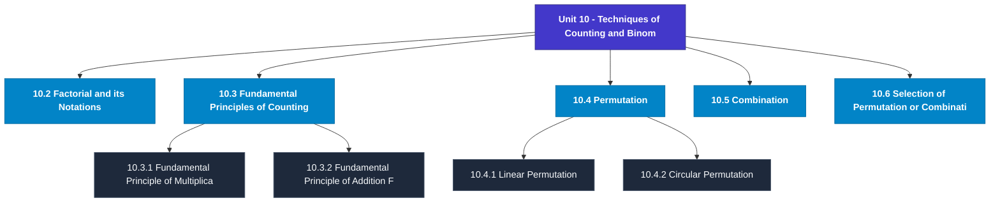

# MCS-061: Mathematical Foundations - I
## Unit 10: Techniques of Counting and Binomial Theorem

> 📚 **Programme:** M.Sc. (Data Science and Analytics) | **Semester:** Semester 1  
> ⏱️ **Estimated Study Time:** ~58 mins | 📄 **Textbook Pages:** 31 Pages  
> 📥 **Original PDF:** [Download & View Textbook](../../../pdfs/Semester_1/MCS-061_Mathematical_Foundations_-_I/Unit-10_Techniques_of_Counting_and_Binomial_Theorem.pdf)

---

### 🎯 Executive Concept & Data Science Relevance
In modern data systems, **Techniques of Counting and Binomial Theorem** forms a vital conceptual pillar. Set theory is the fundamental bedrock of all discrete mathematics, computer science, and data engineering. Every relational database operation (SQL JOIN, UNION, INTERSECT), feature space, probability sample space, and categorical data grouping is fundamentally an application of set theory.

> [!NOTE]
> **Why this matters for your career:** Mastering techniques of counting and binomial theorem equips you with the foundational principles required to reason mathematically about high-dimensional datasets, evaluate algorithm performance, and avoid statistical pitfalls in production machine learning pipelines.

### 🗺️ Visual Knowledge Architecture
The following concept map illustrates the structural hierarchy and learning trajectory of this module:

### 📖 Core Definitions & Terminology Cards
| Term | Formal Mathematical / Technical Definition | Intuitive Analogy / Concrete Example |
| :--- | :--- | :--- |
| **Set** | A well-defined collection of distinct objects, denoted typically by uppercase letters $A, B, X$. Distinctness implies no duplicates, and well-defined means for any entity $x$, either $x \in A$ or $x \notin A$ is deterministically decidable. | *Think of a Python `set({1, 2, 3})` where duplicate elements are collapsed and lookup is based on unique membership.* |
| **Cardinality $\vert A \vert$ or $n(A)$** | The total count of distinct elements in a finite set $A$. If $\vert A \vert = n$, the set contains exactly $n$ distinct members. For infinite sets, cardinality describes transfinite sizes (e.g. countable $\aleph_0$ vs uncountable $c$). | *The output of `len(my_set)` in programming.* |
| **Power Set $\mathcal{P}(A)$** | The set of all possible subsets of $A$, including the empty set $\emptyset$ and $A$ itself: $\mathcal{P}(A) = \{S \mid S \subseteq A\}$. If $\vert A \vert = n$, then $\vert \mathcal{P}(A) \vert = 2^n$. | *In feature selection, evaluating all possible combinations of $n$ features requires searching through the power set of features ($2^n$ candidate models).* |
| **Subset & Proper Subset** | A set $A$ is a subset of $B$ ($A \subseteq B$) if $\forall x \in A \implies x \in B$. It is a proper subset ($A \subset B$) if $A \subseteq B$ and $A \neq B$ (i.e. $\exists y \in B$ such that $y \notin A$). | *All Data Scientists are Analysts ($A \subseteq B$), but not all Analysts are Data Scientists ($A \subset B$).* |
| **Universal Set $U$** | A designated superset containing all objects and entities under active consideration in a given problem or domain. Every set $X$ in that context satisfies $X \subseteq U$. | *The entire master database table or global population before applying any filter conditions.* |

### ⚡ Governing Mathematical Laws & Formula Cheatsheet
#### 🔹 Power Set Cardinality Theorem

$$
\vert\mathcal{P}(A)\vert = 2^n \quad \text{where } n = \vert A\vert
$$

- **Explanation:** Proved by induction or combinatorics: each of the $n$ elements has exactly 2 binary choices (to be included or excluded from a subset).

#### 🔹 Principle of Inclusion-Exclusion (2 Sets)

$$
\vert A \cup B\vert = \vert A\vert + \vert B\vert - \vert A \cap B\vert
$$

- **Explanation:** Prevents double-counting the elements present in the intersection when calculating the total union size.

#### 🔹 Principle of Inclusion-Exclusion (3 Sets)

$$
\vert A \cup B \cup C\vert = \vert A\vert + \vert B\vert + \vert C\vert - (\vert A \cap B\vert + \vert B \cap C\vert + \vert A \cap C\vert) + \vert A \cap B \cap C\vert
$$

- **Explanation:** Alternates adding singletons, subtracting pairwise overlaps, and re-adding the three-way intersection.

#### 🔹 De Morgan's Laws for Sets

$$
(A \cup B)^c = A^c \cap B^c \quad \text{and} \quad (A \cap B)^c = A^c \cup B^c
$$

- **Explanation:** The complement of a union is the intersection of the complements, and vice versa. Fundamental to query optimization and boolean logic.

#### 🔹 Cartesian Product Cardinality

$$
\vert A \times B\vert = \vert A\vert \times \vert B\vert = \{(a, b) \mid a \in A, b \in B\}
$$

- **Explanation:** Basis of relational database `CROSS JOIN`, generating every ordered pair between two entities.

### 📌 Detailed Section-by-Section Study Breakdown
#### `10.2` Factorial and its Notations
- **Core Concept:** Establishes rigorous theoretical formulations and computational bounds for factorial and its notations.
- **Core Concept:** Applies standard algorithmic procedures and mathematical invariants relevant to techniques of counting and binomial theorem.
- **Core Concept:** Ensures deterministic performance guarantees across high-dimensional feature spaces.
- **Data Science Application:** Provides foundational structures used directly in statistical modeling, query execution, and machine learning pipelines.

> [!TIP]
> **Exam & Interview Tip:** Be prepared to state the formal definition of factorial and its notations and derive its primary equations step-by-step.

#### `10.3` Fundamental Principles of Counting
- **Core Concept:** There are two fundamental principles of counting.
- **Core Concept:** These two principles solve the problems of counting.
- **Core Concept:** So it becomes necessary for us first to define what is the counting problem?
- **Data Science Application:** Provides foundational structures used directly in statistical modeling, query execution, and machine learning pipelines.

> [!TIP]
> **Exam & Interview Tip:** Be prepared to state the formal definition of fundamental principles of counting and derive its primary equations step-by-step.

#### `10.3.1` Fundamental Principle of Multiplication (FPM)
- **Core Concept:** Suppose we want to complete two jobs, where first job can be done in m distinct ways, second job can be done in n distinct ways then both jobs can take place (one followed by other) in n m distinct ways.
- **Core Concept:** In general, suppose we want to complete n jobs, where first job can be done in 1 m distinct ways, second job can be done in 2 m distinct ways, third job can be done in 3 m distinct ways, and so on th n job can be done in n m distinct ways.
- **Core Concept:** Then these n jobs can take place (in succession) in n 3 2 1 m ...
- **Data Science Application:** Provides foundational structures used directly in statistical modeling, query execution, and machine learning pipelines.

> [!TIP]
> **Exam & Interview Tip:** Be prepared to state the formal definition of fundamental principle of multiplication (fpm) and derive its primary equations step-by-step.

#### `10.3.2` Fundamental Principle of Addition (FPA)
- **Core Concept:** Suppose we want to complete one job out of two jobs, where first job can be done in m distinct ways and second independent job can be done in n distinct ways.
- **Core Concept:** Then one of the two jobs can be completed in m + n distinct ways.
- **Core Concept:** Then one of the n jobs (any two or any three… or all of these can not occur simultaneously) can be completed in n 3 2 1 m ...
- **Data Science Application:** Provides foundational structures used directly in statistical modeling, query execution, and machine learning pipelines.

> [!TIP]
> **Exam & Interview Tip:** Be prepared to state the formal definition of fundamental principle of addition (fpa) and derive its primary equations step-by-step.

#### `10.4` Permutation
- **Core Concept:** Permutation is related to the arrangement of things.
- **Core Concept:** Things arranged in a line come under the heading of linear permutation, while arrangement of things in a circle comes under the heading of circular permutation.
- **Core Concept:** Let us discuss these two heading one by one.
- **Data Science Application:** Provides foundational structures used directly in statistical modeling, query execution, and machine learning pipelines.

> [!TIP]
> **Exam & Interview Tip:** Be prepared to state the formal definition of permutation and derive its primary equations step-by-step.

#### `10.4.1` Linear Permutation
- **Core Concept:** Possible arrangements in a line of a number of things taken some or all at a time are called the permutation.
- **Core Concept:** Before giving the general formula, let us consider an example, where we are to arrange say three books of different colours (Red, Green and Orange): Permutations of three books when taken one at a time are R, G, W, i.e.
- **Core Concept:** the number of permutations = 3 = 1 3P )!
- **Data Science Application:** Provides foundational structures used directly in statistical modeling, query execution, and machine learning pipelines.

> [!TIP]
> **Exam & Interview Tip:** Be prepared to state the formal definition of linear permutation and derive its primary equations step-by-step.

### 💡 Interactive Self-Assessment Checkpoints
Test your comprehension before proceeding. Tap each question to reveal the comprehensive explanation:

<b>Checkpoint 1:</b> If a set $A$ has 5 elements, how many proper subsets does it possess? <i>(Tap to reveal answer)</i>

> **Answer & Analysis:**  
> A set with $n=5$ elements has total subsets $\vert\mathcal{P}(A)\vert = 2^5 = 32$. Proper subsets exclude the set itself, so the number of proper subsets is $2^n - 1 = 32 - 1 = 31$.

<b>Checkpoint 2:</b> What is the difference between $x \in A$ and $\{x\} \subseteq A$? <i>(Tap to reveal answer)</i>

> **Answer & Analysis:**  
> $x \in A$ denotes that element $x$ is a direct member of set $A$. In contrast, $\{x\} \subseteq A$ denotes that the singleton set containing $x$ is a subset of $A$.

<b>Checkpoint 3:</b> State De Morgan's Law for the complement of $(A \cap B)$. <i>(Tap to reveal answer)</i>

> **Answer & Analysis:**  
> $(A \cap B)^c = A^c \cup B^c$. The complement of the intersection is equal to the union of their individual complements.

<b>Checkpoint 4:</b> Explain Russell's Paradox in naive set theory. <i>(Tap to reveal answer)</i>

> **Answer & Analysis:**  
> Let $R = \{X \mid X \notin X\}$ be the set of all sets that do not contain themselves. If $R \in R$, then by definition $R \notin R$. If $R \notin R$, then by definition $R \in R$. This contradiction proves that naive unrestricted set comprehension leads to paradoxes, necessitating axiomatic set theory (ZFC).

<b>Checkpoint 5:</b> Evaluate the following (i) ! <i>(Tap to reveal answer)</i>

> **Answer & Analysis:**  
> This question tests your conceptual mastery of Techniques of Counting and Binomial Theorem. Review the governing formulas and section breakdowns above to formulate a complete, rigorous proof or derivation.

<b>Checkpoint 6:</b> Express the following in terms of factorial. (i) <i>(Tap to reveal answer)</i>

> **Answer & Analysis:**  
> This question tests your conceptual mastery of Techniques of Counting and Binomial Theorem. Review the governing formulas and section breakdowns above to formulate a complete, rigorous proof or derivation.

### 🎯 Executive Module Wrap-Up
- **Central Idea:** Techniques of Counting and Binomial Theorem provides essential mathematical and algorithmic tools directly utilized in Data Science.
- **Mathematical Rigor:** Formulas and laws must be memorized with attention to boundary conditions and assumptions.
- **Full Textbook Coverage:** For exhaustive multi-page derivations, proofs, and supplementary exercises, consult the [Authentic IGNOU Textbook](../../../pdfs/Semester_1/MCS-061_Mathematical_Foundations_-_I/Unit-10_Techniques_of_Counting_and_Binomial_Theorem.pdf).

---
### 🧭 Navigation & Syllabus Index
[⬅ Previous: Unit 9](unit_09_Linear_Spaces-II.md) | [📑 Course Index](README.md) | [Next: Unit 11 ➡](unit_11_Limit_and_Continuity.md)
