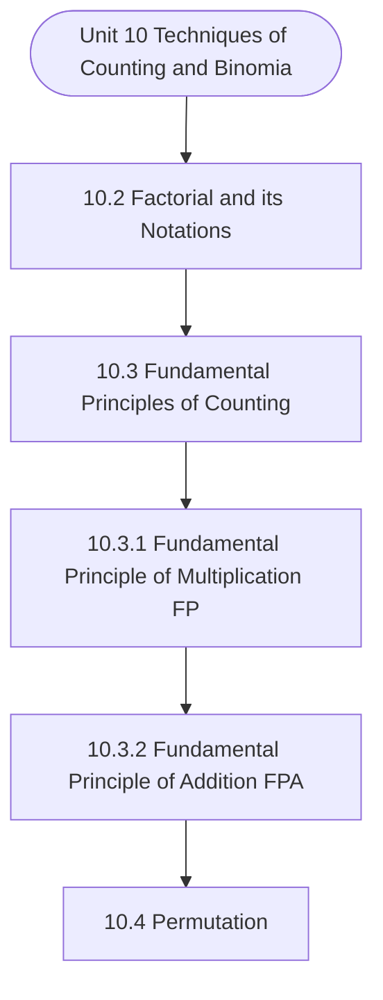

# MCS-061: Mathematical Foundations - I
## Unit 10: Techniques of Counting and Binomial Theorem

> 📚 **Programme:** M.Sc. (Data Science and Analytics) | **Semester:** Semester 1  
> ⏱️ **Estimated Study Time:** ~58 mins | 📄 **Textbook Pages:** 31 Pages  
> 📥 **Original PDF:** [Download & View Textbook](../../../pdfs/Semester_1/MCS-061_Mathematical_Foundations_-_I/Unit-10_Techniques_of_Counting_and_Binomial_Theorem.pdf)

---

### 🎯 Executive Concept & Data Science Relevance
In modern data systems, **Techniques of Counting and Binomial Theorem** forms a vital conceptual pillar. Calculus powers continuous optimization in Machine Learning. Loss function minimization via Gradient Descent, backpropagation in deep neural networks, and probability density integration all require derivatives, partial differentials, and definite integrals.

> [!NOTE]
> **Why this matters for your career:** Mastering techniques of counting and binomial theorem equips you with the foundational principles required to reason mathematically about high-dimensional datasets, evaluate algorithm performance, and avoid statistical pitfalls in production machine learning pipelines.

### 🗺️ Visual Knowledge Architecture
The following concept map illustrates the structural hierarchy and learning trajectory of this module:

### 📖 Core Definitions & Terminology Cards

> 📌 **Derivative $f'(x)$**  
> - **Formal Definition:** The instantaneous rate of change of $f(x)$ with respect to $x$: $f'(x) = \lim_{h \to 0} \frac{f(x+h) - f(x)}{h}$.  
> - 💡 **Practical Intuition & Analogy:** *The slope of the tangent line to the curve at point $x$, indicating direction of steepest increase.*

> 📌 **Gradient $\nabla f(\mathbf{x})$**  
> - **Formal Definition:** The vector of first-order partial derivatives of a multivariate function: $\nabla f = \left[\frac{\partial f}{\partial x_1}, \dots, \frac{\partial f}{\partial x_n}\right]^T$. Points in the direction of greatest rate of increase.  
> - 💡 **Practical Intuition & Analogy:** *The compass pointing uphill on a multidimensional loss landscape.*

> 📌 **Definite Integral**  
> - **Formal Definition:** The signed area under curve $f(x)$ bounded by $[a, b]$: $\int_a^b f(x) dx = F(b) - F(a)$ where $F'(x) = f(x)$.  
> - 💡 **Practical Intuition & Analogy:** *Accumulating continuous probabilities or continuous signals across a range of values.*

> 📌 **Critical Point**  
> - **Formal Definition:** A point $x_0$ where $f'(x_0) = 0$ or the derivative is undefined. Evaluated with second derivative $f''(x_0) > 0$ (local min) or $f''(x_0) < 0$ (local max).  
> - 💡 **Practical Intuition & Analogy:** *The bottom of the valley where model training reaches minimal loss.*

### ⚡ Governing Mathematical Laws & Formula Cheatsheet
#### 🔹 Chain Rule for Composite Functions
$$
\frac{d}{dx}[f(g(x))] = f'(g(x)) \cdot g'(x)
$$
- **Explanation:** The mathematical foundation of deep learning backpropagation through multi-layer neural networks.

#### 🔹 Product and Quotient Rules
$$
(uv)' = u'v + uv', \quad \left(\frac{u}{v}\right)' = \frac{u'v - uv'}{v^2}
$$
- **Explanation:** Rules for differentiating multiplied or divided feature combinations.

#### 🔹 Gradient Descent Parameter Update
$$
\mathbf{w}^{(t+1)} = \mathbf{w}^{(t)} - \alpha \nabla_{\mathbf{w}} \mathcal{L}(\mathbf{w})
$$
- **Explanation:** Iterative step against the gradient direction scaled by learning rate $\alpha$ to reach minimal loss.

#### 🔹 Taylor Series Expansion (First-Order Approximation)
$$
f(x) \approx f(a) + f'(a)(x - a) + \frac{f''(a)}{2!}(x - a)^2
$$
- **Explanation:** Approximates complex non-linear loss surfaces locally using tangent hyperplanes and quadratic forms.

### 📌 Detailed Section-by-Section Study Breakdown
#### `10.2` Factorial and its Notations
- **Core Concept:** Establishes theoretical foundations, axiomatic formulations, and properties of factorial and its notations.
- **Core Concept:** Analyzes standard algorithmic workflows and mathematical transformations relevant to techniques of counting and binomial theorem.
- **Core Concept:** Applies computational bounds and optimization guarantees across data processing workflows.
- **Data Science Application:** Provides foundational structures used directly in statistical modeling, query execution, and machine learning pipelines.

> [!TIP]
> **Exam & Interview Tip:** Be prepared to state the formal definition of factorial and its notations and derive its primary equations step-by-step.

#### `10.3` Fundamental Principles of Counting
- **Core Concept:** There are two fundamental principles of counting.
- **Core Concept:** These two principles solve the problems of counting.
- **Core Concept:** So it becomes necessary for us first to define what is the counting problem?
- **Data Science Application:** Provides foundational structures used directly in statistical modeling, query execution, and machine learning pipelines.

> [!TIP]
> **Exam & Interview Tip:** Be prepared to state the formal definition of fundamental principles of counting and derive its primary equations step-by-step.

#### `10.3.1` Fundamental Principle of Multiplication (FPM)
- **Core Concept:** Suppose we want to complete two jobs, where first job can be done in m distinct ways, second job can be done in n distinct ways then both jobs can take place (one followed by other) in n m distinct ways.
- **Core Concept:** In general, suppose we want to complete n jobs, where first job can be done in 1 m distinct ways, second job can be done in 2 m distinct ways, third job can be done in 3 m distinct ways, and so on th n job can be done in n m distinct ways.
- **Core Concept:** Then these n jobs can take place (in succession) in n 3 2 1 m ...
- **Data Science Application:** Provides foundational structures used directly in statistical modeling, query execution, and machine learning pipelines.

> [!TIP]
> **Exam & Interview Tip:** Be prepared to state the formal definition of fundamental principle of multiplication (fpm) and derive its primary equations step-by-step.

#### `10.3.2` Fundamental Principle of Addition (FPA)
- **Core Concept:** Suppose we want to complete one job out of two jobs, where first job can be done in m distinct ways and second independent job can be done in n distinct ways.
- **Core Concept:** Then one of the two jobs can be completed in m + n distinct ways.
- **Core Concept:** Then one of the n jobs (any two or any three… or all of these can not occur simultaneously) can be completed in n 3 2 1 m ...
- **Data Science Application:** Provides foundational structures used directly in statistical modeling, query execution, and machine learning pipelines.

> [!TIP]
> **Exam & Interview Tip:** Be prepared to state the formal definition of fundamental principle of addition (fpa) and derive its primary equations step-by-step.

#### `10.4` Permutation
- **Core Concept:** Permutation is related to the arrangement of things.
- **Core Concept:** Things arranged in a line come under the heading of linear permutation, while arrangement of things in a circle comes under the heading of circular permutation.
- **Core Concept:** Let us discuss these two heading one by one.
- **Data Science Application:** Provides foundational structures used directly in statistical modeling, query execution, and machine learning pipelines.

> [!TIP]
> **Exam & Interview Tip:** Be prepared to state the formal definition of permutation and derive its primary equations step-by-step.

#### `10.4.1` Linear Permutation
- **Core Concept:** Possible arrangements in a line of a number of things taken some or all at a time are called the permutation.
- **Core Concept:** Before giving the general formula, let us consider an example, where we are to arrange say three books of different colours (Red, Green and Orange): Permutations of three books when taken one at a time are R, G, W, i.e.
- **Core Concept:** the number of permutations = 3 = 1 3P )!
- **Data Science Application:** Provides foundational structures used directly in statistical modeling, query execution, and machine learning pipelines.

> [!TIP]
> **Exam & Interview Tip:** Be prepared to state the formal definition of linear permutation and derive its primary equations step-by-step.

### 💡 Interactive Self-Assessment Checkpoints
Test your comprehension before proceeding. Tap each question to reveal the comprehensive explanation:

<b>Checkpoint 1:</b> What is the Chain Rule and why is it essential in Deep Learning? <i>(Tap to reveal answer)</i>

> **Answer & Analysis:**  
> The Chain Rule states $\frac{dy}{dx} = \frac{dy}{du} \cdot \frac{du}{dx}$. In deep networks, it allows computing the gradient of the loss with respect to early layer weights by propagating backwards layer-by-layer.

<b>Checkpoint 2:</b> How do you classify a critical point where $f'(x) = 0$ using the Second Derivative Test? <i>(Tap to reveal answer)</i>

> **Answer & Analysis:**  
> If $f''(x) > 0$, the point is a **local minimum**. If $f''(x) < 0$, it is a **local maximum**. If $f''(x) = 0$, the test is inconclusive (inflection point).

<b>Checkpoint 3:</b> What is the derivative of $\ln(x)$ and $e^x$? <i>(Tap to reveal answer)</i>

> **Answer & Analysis:**  
> $\frac{d}{dx}[\ln(x)] = \frac{1}{x}$ (for $x > 0$), and $\frac{d}{dx}[e^x] = e^x$.

<b>Checkpoint 4:</b> Evaluate the following (i) ! <i>(Tap to reveal answer)</i>

> **Answer & Analysis:**  
> This question tests your conceptual mastery of Techniques of Counting and Binomial Theorem. Review the governing formulas and section breakdowns above to formulate a complete, rigorous proof or derivation.

<b>Checkpoint 5:</b> Express the following in terms of factorial. (i) <i>(Tap to reveal answer)</i>

> **Answer & Analysis:**  
> This question tests your conceptual mastery of Techniques of Counting and Binomial Theorem. Review the governing formulas and section breakdowns above to formulate a complete, rigorous proof or derivation.

<b>Checkpoint 6:</b> In an examination there are 10 multiple choice questions. First five questions have <i>(Tap to reveal answer)</i>

> **Answer & Analysis:**  
> This question tests your conceptual mastery of Techniques of Counting and Binomial Theorem. Review the governing formulas and section breakdowns above to formulate a complete, rigorous proof or derivation.

### 🎯 Executive Module Wrap-Up
- **Central Idea:** Techniques of Counting and Binomial Theorem provides essential mathematical and algorithmic tools directly utilized in Data Science.
- **Mathematical Rigor:** Formulas and laws must be memorized with attention to boundary conditions and assumptions.
- **Full Textbook Coverage:** For exhaustive multi-page derivations, proofs, and supplementary exercises, consult the [Authentic IGNOU Textbook](../../../pdfs/Semester_1/MCS-061_Mathematical_Foundations_-_I/Unit-10_Techniques_of_Counting_and_Binomial_Theorem.pdf).

---
### 🧭 Navigation & Syllabus Index
[⬅ Previous: Unit 9](unit_09_Linear_Spaces-II.md) | [📑 Course Index](README.md) | [Next: Unit 11 ➡](unit_11_Limit_and_Continuity.md)
