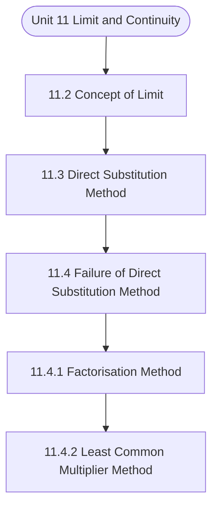

# MCS-061: Mathematical Foundations - I
## Unit 11: Limit and Continuity

> 📚 **Programme:** M.Sc. (Data Science and Analytics) | **Semester:** Semester 1  
> ⏱️ **Estimated Study Time:** ~61 mins | 📄 **Textbook Pages:** 31 Pages  
> 📥 **Original PDF:** [Download & View Textbook](../../../pdfs/Semester_1/MCS-061_Mathematical_Foundations_-_I/Unit-11_Limit_and_Continuity.pdf)

---

### 🎯 Executive Concept & Data Science Relevance
In modern data systems, **Limit and Continuity** forms a vital conceptual pillar. Calculus powers continuous optimization in Machine Learning. Loss function minimization via Gradient Descent, backpropagation in deep neural networks, and probability density integration all require derivatives, partial differentials, and definite integrals.

> [!NOTE]
> **Why this matters for your career:** Mastering limit and continuity equips you with the foundational principles required to reason mathematically about high-dimensional datasets, evaluate algorithm performance, and avoid statistical pitfalls in production machine learning pipelines.

### 🗺️ Visual Knowledge Architecture
The following concept map illustrates the structural hierarchy and learning trajectory of this module:

### 📖 Core Definitions & Terminology Cards

> 📌 **Derivative $f'(x)$**  
> - **Formal Definition:** The instantaneous rate of change of $f(x)$ with respect to $x$: $f'(x) = \lim_{h \to 0} \frac{f(x+h) - f(x)}{h}$.  
> - 💡 **Practical Intuition & Analogy:** *The slope of the tangent line to the curve at point $x$, indicating direction of steepest increase.*

> 📌 **Gradient $\nabla f(\mathbf{x})$**  
> - **Formal Definition:** The vector of first-order partial derivatives of a multivariate function: $\nabla f = \left[\frac{\partial f}{\partial x_1}, \dots, \frac{\partial f}{\partial x_n}\right]^T$. Points in the direction of greatest rate of increase.  
> - 💡 **Practical Intuition & Analogy:** *The compass pointing uphill on a multidimensional loss landscape.*

> 📌 **Definite Integral**  
> - **Formal Definition:** The signed area under curve $f(x)$ bounded by $[a, b]$: $\int_a^b f(x) dx = F(b) - F(a)$ where $F'(x) = f(x)$.  
> - 💡 **Practical Intuition & Analogy:** *Accumulating continuous probabilities or continuous signals across a range of values.*

> 📌 **Critical Point**  
> - **Formal Definition:** A point $x_0$ where $f'(x_0) = 0$ or the derivative is undefined. Evaluated with second derivative $f''(x_0) > 0$ (local min) or $f''(x_0) < 0$ (local max).  
> - 💡 **Practical Intuition & Analogy:** *The bottom of the valley where model training reaches minimal loss.*

### ⚡ Governing Mathematical Laws & Formula Cheatsheet
#### 🔹 Chain Rule for Composite Functions
$$
\frac{d}{dx}[f(g(x))] = f'(g(x)) \cdot g'(x)
$$
- **Explanation:** The mathematical foundation of deep learning backpropagation through multi-layer neural networks.

#### 🔹 Product and Quotient Rules
$$
(uv)' = u'v + uv', \quad \left(\frac{u}{v}\right)' = \frac{u'v - uv'}{v^2}
$$
- **Explanation:** Rules for differentiating multiplied or divided feature combinations.

#### 🔹 Gradient Descent Parameter Update
$$
\mathbf{w}^{(t+1)} = \mathbf{w}^{(t)} - \alpha \nabla_{\mathbf{w}} \mathcal{L}(\mathbf{w})
$$
- **Explanation:** Iterative step against the gradient direction scaled by learning rate $\alpha$ to reach minimal loss.

#### 🔹 Taylor Series Expansion (First-Order Approximation)
$$
f(x) \approx f(a) + f'(a)(x - a) + \frac{f''(a)}{2!}(x - a)^2
$$
- **Explanation:** Approximates complex non-linear loss surfaces locally using tangent hyperplanes and quadratic forms.

### 📌 Detailed Section-by-Section Study Breakdown
#### `11.2` Concept of Limit
- **Core Concept:** Establishes theoretical foundations, axiomatic formulations, and properties of concept of limit.
- **Core Concept:** Analyzes standard algorithmic workflows and mathematical transformations relevant to limit and continuity.
- **Core Concept:** Applies computational bounds and optimization guarantees across data processing workflows.
- **Data Science Application:** Provides foundational structures used directly in statistical modeling, query execution, and machine learning pipelines.

> [!TIP]
> **Exam & Interview Tip:** Be prepared to state the formal definition of concept of limit and derive its primary equations step-by-step.

#### `11.3` Direct Substitution Method
- **Core Concept:** Establishes theoretical foundations, axiomatic formulations, and properties of direct substitution method.
- **Core Concept:** Analyzes standard algorithmic workflows and mathematical transformations relevant to limit and continuity.
- **Core Concept:** Applies computational bounds and optimization guarantees across data processing workflows.
- **Data Science Application:** Provides foundational structures used directly in statistical modeling, query execution, and machine learning pipelines.

> [!TIP]
> **Exam & Interview Tip:** Be prepared to state the formal definition of direct substitution method and derive its primary equations step-by-step.

#### `11.4` Failure of Direct Substitution Method
- **Core Concept:** In mathematics following seven forms are known as indeterminate form, i.e.
- **Core Concept:** (i) 0 0 (ii)   (iii)   0 (iv)  −  (v) 0 0 (vi)  1 (vii) 0  So, if by direct substitution any of the above mentioned forms take place then D.S.M.
- **Core Concept:** fails and we need some alternate methods.
- **Data Science Application:** Provides foundational structures used directly in statistical modeling, query execution, and machine learning pipelines.

> [!TIP]
> **Exam & Interview Tip:** Be prepared to state the formal definition of failure of direct substitution method and derive its primary equations step-by-step.

#### `11.4.1` Factorisation Method
- **Core Concept:** This method is useful, when we get 0 0 form by direct substitution in the given expression of the type ) x ( g ) x ( f lim a x→ .
- **Core Concept:** This will happen if f(x) and g(x) both becomes zero on direct substitution.
- **Core Concept:**  both have at least one common factor (x – a).
- **Data Science Application:** Provides foundational structures used directly in statistical modeling, query execution, and machine learning pipelines.

> [!TIP]
> **Exam & Interview Tip:** Be prepared to state the formal definition of factorisation method and derive its primary equations step-by-step.

#### `11.4.2` Least Common Multiplier Method
- **Core Concept:** of the given expression and simplify it.
- **Core Concept:** Most of the times after simplification it reduces to 0 0 form then solve it as explained in factorisation method.
- **Core Concept:** Let us take an example based on this method.
- **Data Science Application:** Provides foundational structures used directly in statistical modeling, query execution, and machine learning pipelines.

> [!TIP]
> **Exam & Interview Tip:** Be prepared to state the formal definition of least common multiplier method and derive its primary equations step-by-step.

#### `11.4.3` Rationalisation Method
- **Core Concept:** This method is explained in the following example.
- **Data Science Application:** Provides foundational structures used directly in statistical modeling, query execution, and machine learning pipelines.

> [!TIP]
> **Exam & Interview Tip:** Be prepared to state the formal definition of rationalisation method and derive its primary equations step-by-step.

### 💡 Interactive Self-Assessment Checkpoints
Test your comprehension before proceeding. Tap each question to reveal the comprehensive explanation:

<b>Checkpoint 1:</b> What is the Chain Rule and why is it essential in Deep Learning? <i>(Tap to reveal answer)</i>

> **Answer & Analysis:**  
> The Chain Rule states $\frac{dy}{dx} = \frac{dy}{du} \cdot \frac{du}{dx}$. In deep networks, it allows computing the gradient of the loss with respect to early layer weights by propagating backwards layer-by-layer.

<b>Checkpoint 2:</b> How do you classify a critical point where $f'(x) = 0$ using the Second Derivative Test? <i>(Tap to reveal answer)</i>

> **Answer & Analysis:**  
> If $f''(x) > 0$, the point is a **local minimum**. If $f''(x) < 0$, it is a **local maximum**. If $f''(x) = 0$, the test is inconclusive (inflection point).

<b>Checkpoint 3:</b> What is the derivative of $\ln(x)$ and $e^x$? <i>(Tap to reveal answer)</i>

> **Answer & Analysis:**  
> $\frac{d}{dx}[\ln(x)] = \frac{1}{x}$ (for $x > 0$), and $\frac{d}{dx}[e^x] = e^x$.

<b>Checkpoint 4:</b> Evaluate the following limits: (i) <i>(Tap to reveal answer)</i>

> **Answer & Analysis:**  
> This question tests your conceptual mastery of Limit and Continuity. Review the governing formulas and section breakdowns above to formulate a complete, rigorous proof or derivation.

<b>Checkpoint 5:</b> Evaluate the following limits: (i) <i>(Tap to reveal answer)</i>

> **Answer & Analysis:**  
> This question tests your conceptual mastery of Limit and Continuity. Review the governing formulas and section breakdowns above to formulate a complete, rigorous proof or derivation.

<b>Checkpoint 6:</b> Evaluate       − + − + − → x <i>(Tap to reveal answer)</i>

> **Answer & Analysis:**  
> This question tests your conceptual mastery of Limit and Continuity. Review the governing formulas and section breakdowns above to formulate a complete, rigorous proof or derivation.

### 🎯 Executive Module Wrap-Up
- **Central Idea:** Limit and Continuity provides essential mathematical and algorithmic tools directly utilized in Data Science.
- **Mathematical Rigor:** Formulas and laws must be memorized with attention to boundary conditions and assumptions.
- **Full Textbook Coverage:** For exhaustive multi-page derivations, proofs, and supplementary exercises, consult the [Authentic IGNOU Textbook](../../../pdfs/Semester_1/MCS-061_Mathematical_Foundations_-_I/Unit-11_Limit_and_Continuity.pdf).

---
### 🧭 Navigation & Syllabus Index
[⬅ Previous: Unit 10](unit_10_Techniques_of_Counting_and_Binomial_Theorem.md) | [📑 Course Index](README.md) | [Next: Unit 12 ➡](unit_12_Differentiation.md)
