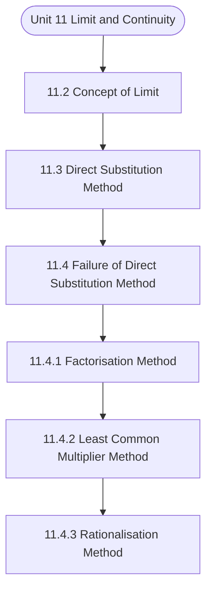

# MCS-061: Mathematical Foundations - I
## Unit 11: Limit and Continuity

> 📚 **Programme:** M.Sc. (Data Science and Analytics) | **Semester:** Semester 1  
> ⏱️ **Estimated Study Time:** ~61 mins | 📄 **Textbook Pages:** 31 Pages  
> 📥 **Original PDF:** [Download & View Authentic Textbook](../../../pdfs/Semester_1/MCS-061_Mathematical_Foundations_-_I/Unit-11_Limit_and_Continuity.pdf)

---

### 🎯 Executive Concept & Data Science Relevance
In modern data systems and advanced analytics, **Limit and Continuity** forms a vital conceptual pillar. Calculus powers continuous optimization in Machine Learning. Loss function minimization via Gradient Descent, backpropagation in deep neural networks, and probability density integration all require derivatives, partial differentials, and definite integrals.

> [!NOTE]
> **Why this matters for your career:** Mastering limit and continuity equips you with the foundational principles required to reason mathematically about high-dimensional datasets, evaluate algorithm performance, and avoid statistical pitfalls in production machine learning pipelines.

### 🗺️ Visual Knowledge Architecture
The following concept map illustrates the structural hierarchy and learning trajectory of this module:



### 📖 Core Definitions & Terminology Cards

> 📌 **Derivative $f'(x)$**  
> - **Formal Definition:** The instantaneous rate of change of $f(x)$ with respect to $x$: $f'(x) = \lim_{h \to 0} \frac{f(x+h) - f(x)}{h}$.  
> - 💡 **Practical Intuition & Analogy:** *The slope of the tangent line to the curve at point $x$, indicating direction of steepest increase.*

> 📌 **Gradient $\nabla f(\mathbf{x})$**  
> - **Formal Definition:** The vector of first-order partial derivatives of a multivariate function: $\nabla f = \left[\frac{\partial f}{\partial x_1}, \dots, \frac{\partial f}{\partial x_n}\right]^T$. Points in the direction of greatest rate of increase.  
> - 💡 **Practical Intuition & Analogy:** *The compass pointing uphill on a multidimensional loss landscape.*

> 📌 **Definite Integral**  
> - **Formal Definition:** The signed area under curve $f(x)$ bounded by $[a, b]$: $\int_a^b f(x) dx = F(b) - F(a)$ where $F'(x) = f(x)$.  
> - 💡 **Practical Intuition & Analogy:** *Accumulating continuous probabilities or continuous signals across a range of values.*

> 📌 **Critical Point**  
> - **Formal Definition:** A point $x_0$ where $f'(x_0) = 0$ or the derivative is undefined. Evaluated with second derivative $f''(x_0) > 0$ (local min) or $f''(x_0) < 0$ (local max).  
> - 💡 **Practical Intuition & Analogy:** *The bottom of the valley where model training reaches minimal loss.*

### ⚡ Governing Mathematical Laws & Formula Cheatsheet
#### 🔹 Chain Rule for Composite Functions
$$
\frac{d}{dx}[f(g(x))] = f'(g(x)) \cdot g'(x)
$$
- **Explanation:** The mathematical foundation of deep learning backpropagation through multi-layer neural networks.

#### 🔹 Product and Quotient Rules
$$
(uv)' = u'v + uv', \quad \left(\frac{u}{v}\right)' = \frac{u'v - uv'}{v^2}
$$
- **Explanation:** Rules for differentiating multiplied or divided feature combinations.

#### 🔹 Gradient Descent Parameter Update
$$
\mathbf{w}^{(t+1)} = \mathbf{w}^{(t)} - \alpha \nabla_{\mathbf{w}} \mathcal{L}(\mathbf{w})
$$
- **Explanation:** Iterative step against the gradient direction scaled by learning rate $\alpha$ to reach minimal loss.

#### 🔹 Taylor Series Expansion (First-Order Approximation)
$$
f(x) \approx f(a) + f'(a)(x - a) + \frac{f''(a)}{2!}(x - a)^2
$$
- **Explanation:** Approximates complex non-linear loss surfaces locally using tangent hyperplanes and quadratic forms.

### ⚖️ Axiomatic Properties & Governing Laws
The mathematical formulations of this module are anchored by foundational algebraic and structural laws:

- **Linearity of Differentiation:** $\frac{d}{dx}[a f(x) + b g(x)] = a f'(x) + b g'(x)$
- **Second Derivative Test:** $f'(x_0) = 0 \land f''(x_0) > 0 \implies \text{Local Minimum}$
- **Convexity Condition:** $\nabla^2 f(\mathbf{x}) \succeq 0 \quad (\text{Hessian is Positive Semi-Definite})$

### 📌 Comprehensive Section-by-Section Study Breakdown
#### `11.2` Concept of Limit

##### 📘 Theoretical Principles & Pedagogical Exposition
putting +ve sign as a superscript of 2 i.e. + 2 and the limit of the function as ) x ( f lim x + → … (2) If limit (2) exists, then we call it right hand limit (R.H.L.) of the function f(x) as x tends to 2. limits are used when functions have different values for x − →2 and + →2 x .

For example, in case of (a) modules functions, (b) functions having different values just below or above the value to which x is tending, i.e. there is break in function. (ii) Limit exists if L.H.L. both exist and are equal. Following example illustrates the idea of L.H.L. Example 7: Evaluate the following limits: (i) x lim x→ (ii) x lim x − → (iii)     −  + = → x , x x ,1 x f(x) where ), x ( f lim x (iv)    =  − − = → x ,0 x , x x f(x) where f(x), lim x Solution: (i) x lim x→ Here we have to use the concept of L.H.L.

and R.H.L., because of the presence of the modulus function. = x lim x − → Limit and Continuity Here, as x is approaching to zero from its left and hence x is having little bit lesser value than 0. Let us put x = 0 – h, where h is + ve real and is very small. As + − →  → h x L.H.L.


##### ⚙️ Mathematical & Algorithmic Mechanics
- **Core Mechanism:** Derivatives compute instantaneous rates of change $f'(x) = \lim_{h \to 0} \frac{f(x+h) - f(x)}{h}$. Multivariable gradient vectors $\nabla f$ point in the direction of steepest ascent, with stationary critical points satisfying $\nabla f = 0$.
- **Boundary Conditions:** Discontinuities, non-differentiable sharp cusps (e.g. $|x|$ at $x=0$), vanishing gradients in saturating regions, and indefinite Hessian saddle points.

##### 📊 Practical Data Science & Production Relevance
- **Production Workflow:** Gradient descent parameter optimization $\theta_{t+1} = \theta_t - \eta \nabla L(\theta)$ across deep neural networks, backpropagation autograd engines, and marginal utility modeling.
- **Real-World Pitfall:** Selecting an overly aggressive learning rate $\eta$ causing objective divergence around sharp local minima, or getting trapped along flat plateau regions.

> [!TIP]
> **Exam & Technical Interview Insight:** Memorize the product rule, quotient rule, and multivariable chain rule; solve optimization problems by verifying local extrema using second derivative / Hessian tests.

#### `11.3` Direct Substitution Method

##### 📘 Theoretical Principles & Pedagogical Exposition
In discrete mathematical structures and computational algebra, **Direct Substitution Method** introduces formal symbolic axioms required to guarantee unambiguous logical deduction. Within the learning hierarchy of **Limit and Continuity**, this concept defines the boundary conditions and operational invariants that ensure mathematical consistency across multi-step proofs.

Understanding direct substitution method is essential when transitioning from manual arithmetic to high-dimensional matrix representations, vector spaces, and algorithm state transitions.

##### ⚙️ Mathematical & Algorithmic Mechanics
- **Core Mechanism:** Derivatives compute instantaneous rates of change $f'(x) = \lim_{h \to 0} \frac{f(x+h) - f(x)}{h}$. Multivariable gradient vectors $\nabla f$ point in the direction of steepest ascent, with stationary critical points satisfying $\nabla f = 0$.
- **Boundary Conditions:** Discontinuities, non-differentiable sharp cusps (e.g. $|x|$ at $x=0$), vanishing gradients in saturating regions, and indefinite Hessian saddle points.

##### 📊 Practical Data Science & Production Relevance
- **Production Workflow:** Gradient descent parameter optimization $\theta_{t+1} = \theta_t - \eta \nabla L(\theta)$ across deep neural networks, backpropagation autograd engines, and marginal utility modeling.
- **Real-World Pitfall:** Selecting an overly aggressive learning rate $\eta$ causing objective divergence around sharp local minima, or getting trapped along flat plateau regions.

> [!TIP]
> **Exam & Technical Interview Insight:** Memorize the product rule, quotient rule, and multivariable chain rule; solve optimization problems by verifying local extrema using second derivative / Hessian tests.

#### `11.4` Failure of Direct Substitution Method

##### 📘 Theoretical Principles & Pedagogical Exposition
METHOD In mathematics following seven forms are known as indeterminate form, i.e. as such these forms are not defined. (i) 0 0 (ii)   (iii)   (iv)  −  (v) 0 (vi)  1 (vii)  So, if by direct substitution any of the above mentioned forms take place then D.S.M. fails and we need some alternate methods.

Some of them are listed below: I Factorisation Method II Least Common Multiplier Method III Rationalisation Method IV Use of some Standard Results Calculus Let us discuss these methods one by one:


##### ⚙️ Mathematical & Algorithmic Mechanics
- **Core Mechanism:** Derivatives compute instantaneous rates of change $f'(x) = \lim_{h \to 0} \frac{f(x+h) - f(x)}{h}$. Multivariable gradient vectors $\nabla f$ point in the direction of steepest ascent, with stationary critical points satisfying $\nabla f = 0$.
- **Boundary Conditions:** Discontinuities, non-differentiable sharp cusps (e.g. $|x|$ at $x=0$), vanishing gradients in saturating regions, and indefinite Hessian saddle points.

##### 📊 Practical Data Science & Production Relevance
- **Production Workflow:** Gradient descent parameter optimization $\theta_{t+1} = \theta_t - \eta \nabla L(\theta)$ across deep neural networks, backpropagation autograd engines, and marginal utility modeling.
- **Real-World Pitfall:** Selecting an overly aggressive learning rate $\eta$ causing objective divergence around sharp local minima, or getting trapped along flat plateau regions.

> [!TIP]
> **Exam & Technical Interview Insight:** Memorize the product rule, quotient rule, and multivariable chain rule; solve optimization problems by verifying local extrema using second derivative / Hessian tests.

#### `11.4.1` Factorisation Method

##### 📘 Theoretical Principles & Pedagogical Exposition
Factorisation Method This method is useful, when we get 0 0 form by direct substitution in the given expression of the type ) x ( g ) x ( f lim a x→ . This will happen if f(x) and g(x) both becomes zero on direct substitution.  both have at least one common factor (x – a). In this case express f(x) = (x – a) (some factor) and g(x) = (x – a) (some factor) either by long division method or by any other method known to you.

Then cancel out the common factor and again try D.S.M. works, we get the required limit. fails again, repeat the same procedure. Ultimately, after a finite number of steps, you will get the result as the numerator and dominator both are of finite degrees. Let us explain the method with the help of the following example.

Example 2: Evaluate the following limits: (i) x x lim x − − → (ii) x x lim x + + − → (iii) x x x x lim x + − − + → (iv) Solution: (i) x x lim x − − →     fails D.S.M. so , form Using factorisation method, we have x x x (x 2)(x 2) lim lim x x → → − − + = − − [ ) b a )( b a( b a + − = −  ] ) x ( lim x + = → x x 0, so dividing numerator and denominator by x 2.


##### ⚙️ Mathematical & Algorithmic Mechanics
- **Core Mechanism:** Derivatives compute instantaneous rates of change $f'(x) = \lim_{h \to 0} \frac{f(x+h) - f(x)}{h}$. Multivariable gradient vectors $\nabla f$ point in the direction of steepest ascent, with stationary critical points satisfying $\nabla f = 0$.
- **Boundary Conditions:** Discontinuities, non-differentiable sharp cusps (e.g. $|x|$ at $x=0$), vanishing gradients in saturating regions, and indefinite Hessian saddle points.

##### 📊 Practical Data Science & Production Relevance
- **Production Workflow:** Gradient descent parameter optimization $\theta_{t+1} = \theta_t - \eta \nabla L(\theta)$ across deep neural networks, backpropagation autograd engines, and marginal utility modeling.
- **Real-World Pitfall:** Selecting an overly aggressive learning rate $\eta$ causing objective divergence around sharp local minima, or getting trapped along flat plateau regions.

> [!TIP]
> **Exam & Technical Interview Insight:** Memorize the product rule, quotient rule, and multivariable chain rule; solve optimization problems by verifying local extrema using second derivative / Hessian tests.

#### `11.4.2` Least Common Multiplier Method

##### 📘 Theoretical Principles & Pedagogical Exposition
This method is useful in  −  form. Procedure: Take L.C.M. of the given expression and simplify it. Most of the times after simplification it reduces to 0 0 form then solve it as explained in factorisation method. Let us take an example based on this method. Example 3: Evaluate       − − − → x x x lim x Solution:       − − − → x x x lim x [  −  form, so D.S.M.

fails] Using LCM method, we have       − − − → x x x lim x       − − − = → ) x ( x x lim x x lim ) x ( x x lim x x = =       − − = → →


##### ⚙️ Mathematical & Algorithmic Mechanics
- **Core Mechanism:** Derivatives compute instantaneous rates of change $f'(x) = \lim_{h \to 0} \frac{f(x+h) - f(x)}{h}$. Multivariable gradient vectors $\nabla f$ point in the direction of steepest ascent, with stationary critical points satisfying $\nabla f = 0$.
- **Boundary Conditions:** Discontinuities, non-differentiable sharp cusps (e.g. $|x|$ at $x=0$), vanishing gradients in saturating regions, and indefinite Hessian saddle points.

##### 📊 Practical Data Science & Production Relevance
- **Production Workflow:** Gradient descent parameter optimization $\theta_{t+1} = \theta_t - \eta \nabla L(\theta)$ across deep neural networks, backpropagation autograd engines, and marginal utility modeling.
- **Real-World Pitfall:** Selecting an overly aggressive learning rate $\eta$ causing objective divergence around sharp local minima, or getting trapped along flat plateau regions.

> [!TIP]
> **Exam & Technical Interview Insight:** Memorize the product rule, quotient rule, and multivariable chain rule; solve optimization problems by verifying local extrema using second derivative / Hessian tests.

#### `11.4.3` Rationalisation Method

##### 📘 Theoretical Principles & Pedagogical Exposition
This method is explained in the following example. Example 4: Evaluate the following limits: (i) x x lim x − + → (ii) x x x lim x − + − − → Solution: (i) x x lim x − + →     fails D.S.M. so , form Rationalising the numerator, we have x x lim x − + → = x x x x lim x + + + +  − + → ( ) ( ) x x ) ( x lim x + + − + = → [ ) b a )( b a( b a + − = −  ] = ( ) x x x lim ) x ( x x lim x x + + = + + − + → → Limit and Continuity = x lim x = + = + + = + + → (ii) x x x lim x − + − − →     fails D.S.M.

so , form Rationalising the numerator, we have x x x lim x − + − − → = x x x x x x x lim x + + − + + −  − + − − → = ( ) x ( 5x 6) x lim (x 9)( 5x x 6) → − − + − − + + x 5x (x 6) lim (x 9)( 5x x 6) → − − + = − − + + x 4x lim (x 3 )( 5x x 6) → − = − − + + x 4(x 3) lim (x 3)(x 3)( 5x x 6) → − = − + − + + ) x x )( x ( lim x + + − + = → ) )( ( + + − + = )3 ( ) ( = = + = + =


##### ⚙️ Mathematical & Algorithmic Mechanics
- **Core Mechanism:** Derivatives compute instantaneous rates of change $f'(x) = \lim_{h \to 0} \frac{f(x+h) - f(x)}{h}$. Multivariable gradient vectors $\nabla f$ point in the direction of steepest ascent, with stationary critical points satisfying $\nabla f = 0$.
- **Boundary Conditions:** Discontinuities, non-differentiable sharp cusps (e.g. $|x|$ at $x=0$), vanishing gradients in saturating regions, and indefinite Hessian saddle points.

##### 📊 Practical Data Science & Production Relevance
- **Production Workflow:** Gradient descent parameter optimization $\theta_{t+1} = \theta_t - \eta \nabla L(\theta)$ across deep neural networks, backpropagation autograd engines, and marginal utility modeling.
- **Real-World Pitfall:** Selecting an overly aggressive learning rate $\eta$ causing objective divergence around sharp local minima, or getting trapped along flat plateau regions.

> [!TIP]
> **Exam & Technical Interview Insight:** Memorize the product rule, quotient rule, and multivariable chain rule; solve optimization problems by verifying local extrema using second derivative / Hessian tests.

#### `11.4.4` Use of some Standard Results

##### 📘 Theoretical Principles & Pedagogical Exposition
Here, we list without proof some very useful standard results which hold in limits. n n n a x na a x a x lim − → = − − [a and n are any real numbers, provided n n a , a −exist] 2. sin lim sin lim =   =   →  →  3. tan lim tan lim =   =   →  →  Limit and Continuity 5. , , where a>0, a≠1 in particular, e log x e lim e x x = = − → 6.

e ) x 1( lim x / x = + → 8. e x lim x x =      +  → Let us consider an example based on these standard results. Example 5: Evaluate the following limits: (i) x x lim x − − → (ii) / / / / x x x lim − − → (iii) x x sin lim x→ (iv) x cos lim x→ (v) x sin x tan lim x→ (vi) x lim x x − → (vii) x e lim ax x − → (viii) x ) x log( lim x + → (ix) e ) x log( lim x x − + → (x) x / x ) x 1( lim + → Solution: (i) Let I = x x lim x − − → = x x x lim − − → Dividing numerator and denominator by x – 3, we get I = x x x x x lim x x lim x x lim x x → → → − − − − = − − − − = ) ( ) ( − − =  =  = n n n 1 x a x a Using lim na x a − →   − =   −   (ii) / / / / x x x lim − − → Dividing numerator and denominator by x – 2, we get Calculus / / / / x x x lim − − → x x lim x x lim x x x x lim / / x / / x / / / / x − − − − = − − − − = → → → (iii) x x sin lim x→ = x x x x sin lim x  →     x by multipling and Dividing = x x sin lim x x sin lim x x → → = = x x sin lim x 4 →   x x As →  → = 4  = 3     =   →  sin lim  (iv) x cos lim x→ = 5x As x 5x 0 and lim cos5x limcos → → →  →   =   =     (v) x sin x tan lim x→ = x sin x x x tan lim x   → )1 )( 1( x sin x lim x x tan lim x x = =            = → →     =   =   → →  sin lim and tan lim x  (vi) x lim x x − → = x lim x lim x x x x − =  − → →   x x →  →  = 5 log e x e x a lim log a x →   −=     (vii) x e lim ax x − → = ax e lim a a ax e lim ax ax ax x − =  − → →   ax x →  →  = a(1)       = − → x e lim x x  = a (viii) = Limit and Continuity )1( =     = + → x ) x log( lim x  = 5 (ix) =       −       + = → → e x lim x ) x log( lim x 2x x x x x log(1 x) x (1)(1) as lim 1 and lim x e → → + = = = = − (x) x / x ) x 1( lim + → = x x ) x 1( lim         + → 8x 8x lim(1 8x) as x 8x →   = + →  →     ( )         = + = = → e x lim e )e( x x 


##### ⚙️ Mathematical & Algorithmic Mechanics
- **Core Mechanism:** Derivatives compute instantaneous rates of change $f'(x) = \lim_{h \to 0} \frac{f(x+h) - f(x)}{h}$. Multivariable gradient vectors $\nabla f$ point in the direction of steepest ascent, with stationary critical points satisfying $\nabla f = 0$.
- **Boundary Conditions:** Discontinuities, non-differentiable sharp cusps (e.g. $|x|$ at $x=0$), vanishing gradients in saturating regions, and indefinite Hessian saddle points.

##### 📊 Practical Data Science & Production Relevance
- **Production Workflow:** Gradient descent parameter optimization $\theta_{t+1} = \theta_t - \eta \nabla L(\theta)$ across deep neural networks, backpropagation autograd engines, and marginal utility modeling.
- **Real-World Pitfall:** Selecting an overly aggressive learning rate $\eta$ causing objective divergence around sharp local minima, or getting trapped along flat plateau regions.

> [!TIP]
> **Exam & Technical Interview Insight:** Memorize the product rule, quotient rule, and multivariable chain rule; solve optimization problems by verifying local extrema using second derivative / Hessian tests.

#### `11.5` Concept of Infinite Limit

##### 📘 Theoretical Principles & Pedagogical Exposition
In discrete mathematical structures and computational algebra, **Concept of Infinite Limit** introduces formal symbolic axioms required to guarantee unambiguous logical deduction. Within the learning hierarchy of **Limit and Continuity**, this concept defines the boundary conditions and operational invariants that ensure mathematical consistency across multi-step proofs.

Understanding concept of infinite limit is essential when transitioning from manual arithmetic to high-dimensional matrix representations, vector spaces, and algorithm state transitions.

##### ⚙️ Mathematical & Algorithmic Mechanics
- **Core Mechanism:** Derivatives compute instantaneous rates of change $f'(x) = \lim_{h \to 0} \frac{f(x+h) - f(x)}{h}$. Multivariable gradient vectors $\nabla f$ point in the direction of steepest ascent, with stationary critical points satisfying $\nabla f = 0$.
- **Boundary Conditions:** Discontinuities, non-differentiable sharp cusps (e.g. $|x|$ at $x=0$), vanishing gradients in saturating regions, and indefinite Hessian saddle points.

##### 📊 Practical Data Science & Production Relevance
- **Production Workflow:** Gradient descent parameter optimization $\theta_{t+1} = \theta_t - \eta \nabla L(\theta)$ across deep neural networks, backpropagation autograd engines, and marginal utility modeling.
- **Real-World Pitfall:** Selecting an overly aggressive learning rate $\eta$ causing objective divergence around sharp local minima, or getting trapped along flat plateau regions.

> [!TIP]
> **Exam & Technical Interview Insight:** Memorize the product rule, quotient rule, and multivariable chain rule; solve optimization problems by verifying local extrema using second derivative / Hessian tests.

### 📐 Step-by-Step Solved Mathematical Examples
To solidify your theoretical understanding, work through these fully solved, step-by-step mathematical problems:

#### 🧮 Example 1: Analytical Loss Minimization (Ordinary Least Squares)
> **Problem Statement:**  
> Given simple Mean Squared Error $\mathcal{L}(w) = \frac{1}{2} \sum_{i=1}^n (y_i - w x_i)^2$. Find the optimal parameter $w^*$ that minimizes $\mathcal{L}(w)$ using calculus.

**Detailed Step-by-Step Solution:**

1. **Differentiate loss with respect to parameter $w$:**

$$
\frac{d\mathcal{L}}{dw} = \frac{1}{2} \sum_{i=1}^n 2(y_i - w x_i)(-x_i) = -\sum_{i=1}^n (x_i y_i - w x_i^2)
$$


2. **Set derivative to zero for critical point:**

$$
-\sum x_i y_i + w \sum x_i^2 = 0 \implies w^* = \frac{\sum x_i y_i}{\sum x_i^2}
$$


3. **Second Derivative Test:** $\frac{d^2\mathcal{L}}{dw^2} = \sum x_i^2 > 0$ for non-zero data. Guarantees global minimum.

#### 🧮 Example 2: Gradient Descent Numerical Step
> **Problem Statement:**  
> Given quadratic loss $f(w) = w^2 - 6w + 10$. Starting from $w^{(0)} = 0$ with learning rate $\alpha = 0.2$, perform two iterations of Gradient Descent.

**Detailed Step-by-Step Solution:**

1. **Gradient:** $f'(w) = 2w - 6$.

2. **Iteration 1:**

$$
abla f(0) = 2(0) - 6 = -6
$$


$$
w^{(1)} = w^{(0)} - \alpha f'(0) = 0 - 0.2(-6) = 1.2
$$


3. **Iteration 2:**

$$
abla f(1.2) = 2(1.2) - 6 = 2.4 - 6 = -3.6
$$


$$
w^{(2)} = 1.2 - 0.2(-3.6) = 1.2 + 0.72 = 1.92
$$


(Approaches true analytical minimum $w^* = 3$ rapidly).

### 💻 Practical Data Science Implementation (Python)
Theory translates directly into production algorithms. Below is a self-contained, commented Python implementation illustrating the core operations of this unit:

```python
# Gradient Descent Optimizer from scratch
import numpy as np

def loss_func(w):
    return (w - 3.0)**2 + 1.0

def grad_func(w):
    return 2 * (w - 3.0)

# Optimization loop
w = 0.0
lr = 0.1
for step in range(25):
    grad = grad_func(w)
    w = w - lr * grad
    if step % 5 == 0:
        print(f"Step {step:2d} | w = {w:.4f} | Loss = {loss_func(w):.4f}")

print(f"Converged optimal weight: {w:.4f} (True: 3.0000)")
```

### 💡 Interactive Self-Assessment Checkpoints
Test your comprehension before proceeding. Tap each question to reveal the comprehensive explanation:

<details>
<summary><b>Checkpoint 1:</b> Evaluate the following limits: (i) 1 x 2 2 x 2 )3 x 2 x ( lim + → + − (ii) )1 x (x log lim 2 4 1 x + + → (iii) 3 lim 5 x→ (iv) 2 3 x <i>(Tap to reveal answer)</i></summary>

> **Answer & Analysis:**  
> **Detailed Analytical Solution:**
> 
> 1. **Core Principle:** Identify the governing theorem or definition for Limit and Continuity.
> 2. **Step-by-Step Derivation:** Verify all preconditions and compute intermediate steps methodically.
> 3. **Conclusion:** State the final mathematical proof or calculation clearly, validating boundary edge cases.
</details>

<details>
<summary><b>Checkpoint 2:</b> (x f(x) e wher ), x ( f 4 lim − = → 9 Calculus <i>(Tap to reveal answer)</i></summary>

> **Answer & Analysis:**  
> **Detailed Analytical Solution:**
> 
> 1. **Core Principle:** Identify the governing theorem or definition for Limit and Continuity.
> 2. **Step-by-Step Derivation:** Verify all preconditions and compute intermediate steps methodically.
> 3. **Conclusion:** State the final mathematical proof or calculation clearly, validating boundary edge cases.
</details>

<details>
<summary><b>Checkpoint 3:</b> Evaluate the following limits: (i) 60 x 52 x 3 x 6 x 12 x 16 x 7 x lim 2 3 4 2 3 2 x − + − − − + − → (ii) 4 x 2 x 2 x 5 x 4 x lim 3 2 3 2 x − − − + − → <i>(Tap to reveal answer)</i></summary>

> **Answer & Analysis:**  
> **Detailed Analytical Solution:**
> 
> 1. **Core Principle:** Identify the governing theorem or definition for Limit and Continuity.
> 2. **Step-by-Step Derivation:** Verify all preconditions and compute intermediate steps methodically.
> 3. **Conclusion:** State the final mathematical proof or calculation clearly, validating boundary edge cases.
</details>

<details>
<summary><b>Checkpoint 4:</b> Evaluate       − + − + − → x 2 x x 6 2 x 1 lim 2 3 2 x <i>(Tap to reveal answer)</i></summary>

> **Answer & Analysis:**  
> **Detailed Analytical Solution:**
> 
> 1. **Core Principle:** Identify the governing theorem or definition for Limit and Continuity.
> 2. **Step-by-Step Derivation:** Verify all preconditions and compute intermediate steps methodically.
> 3. **Conclusion:** State the final mathematical proof or calculation clearly, validating boundary edge cases.
</details>

<details>
<summary><b>Checkpoint 5:</b> What is the Chain Rule and why is it essential in Deep Learning? <i>(Tap to reveal answer)</i></summary>

> **Answer & Analysis:**  
> The Chain Rule states $\frac{dy}{dx} = \frac{dy}{du} \cdot \frac{du}{dx}$. In deep networks, it allows computing the gradient of the loss with respect to early layer weights by propagating backwards layer-by-layer.
</details>

<details>
<summary><b>Checkpoint 6:</b> How do you classify a critical point where $f'(x) = 0$ using the Second Derivative Test? <i>(Tap to reveal answer)</i></summary>

> **Answer & Analysis:**  
> If $f''(x) > 0$, the point is a **local minimum**. If $f''(x) < 0$, it is a **local maximum**. If $f''(x) = 0$, the test is inconclusive (inflection point).
</details>

### 🎯 Executive Module Wrap-Up
- **Central Idea:** Limit and Continuity provides essential mathematical and algorithmic tools directly utilized in Data Science.
- **Mathematical Rigor:** Formulas and laws must be memorized with attention to boundary conditions and assumptions.
- **Full Textbook Coverage:** For exhaustive multi-page derivations, proofs, and supplementary exercises, consult the [Authentic IGNOU Textbook](../../../pdfs/Semester_1/MCS-061_Mathematical_Foundations_-_I/Unit-11_Limit_and_Continuity.pdf).

---
### 🧭 Navigation & Syllabus Index
[⬅ Previous: Unit 10](unit_10_Techniques_of_Counting_and_Binomial_Theorem.md) | [📑 Course Index](README.md) | [Next: Unit 12 ➡](unit_12_Differentiation.md)
