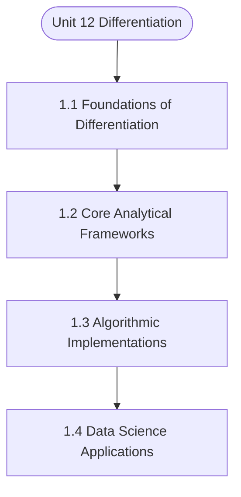

# MCS-061: Mathematical Foundations - I
## Unit 12: Differentiation

> 📚 **Programme:** M.Sc. (Data Science and Analytics) | **Semester:** Semester 1  
> ⏱️ **Estimated Study Time:** ~76 mins | 📄 **Textbook Pages:** 39 Pages  
> 📥 **Original PDF:** [Download & View Authentic Textbook](../../../pdfs/Semester_1/MCS-061_Mathematical_Foundations_-_I/Unit-12_Differentiation.pdf)

---

### 🎯 Executive Concept & Data Science Relevance
In modern data systems, **Differentiation** forms a vital conceptual pillar. Calculus powers continuous optimization in Machine Learning. Loss function minimization via Gradient Descent, backpropagation in deep neural networks, and probability density integration all require derivatives, partial differentials, and definite integrals.

> [!NOTE]
> **Why this matters for your career:** Mastering differentiation equips you with the foundational principles required to reason mathematically about high-dimensional datasets, evaluate algorithm performance, and avoid statistical pitfalls in production machine learning pipelines.

### 🗺️ Visual Knowledge Architecture
The following concept map illustrates the structural hierarchy and learning trajectory of this module:



### 📖 Core Definitions & Terminology Cards

> 📌 **Derivative $f'(x)$**  
> - **Formal Definition:** The instantaneous rate of change of $f(x)$ with respect to $x$: $f'(x) = \lim_{h \to 0} \frac{f(x+h) - f(x)}{h}$.  
> - 💡 **Practical Intuition & Analogy:** *The slope of the tangent line to the curve at point $x$, indicating direction of steepest increase.*

> 📌 **Gradient $\nabla f(\mathbf{x})$**  
> - **Formal Definition:** The vector of first-order partial derivatives of a multivariate function: $\nabla f = \left[\frac{\partial f}{\partial x_1}, \dots, \frac{\partial f}{\partial x_n}\right]^T$. Points in the direction of greatest rate of increase.  
> - 💡 **Practical Intuition & Analogy:** *The compass pointing uphill on a multidimensional loss landscape.*

> 📌 **Definite Integral**  
> - **Formal Definition:** The signed area under curve $f(x)$ bounded by $[a, b]$: $\int_a^b f(x) dx = F(b) - F(a)$ where $F'(x) = f(x)$.  
> - 💡 **Practical Intuition & Analogy:** *Accumulating continuous probabilities or continuous signals across a range of values.*

> 📌 **Critical Point**  
> - **Formal Definition:** A point $x_0$ where $f'(x_0) = 0$ or the derivative is undefined. Evaluated with second derivative $f''(x_0) > 0$ (local min) or $f''(x_0) < 0$ (local max).  
> - 💡 **Practical Intuition & Analogy:** *The bottom of the valley where model training reaches minimal loss.*

### ⚡ Governing Mathematical Laws & Formula Cheatsheet
#### 🔹 Chain Rule for Composite Functions
$$
\frac{d}{dx}[f(g(x))] = f'(g(x)) \cdot g'(x)
$$
- **Explanation:** The mathematical foundation of deep learning backpropagation through multi-layer neural networks.

#### 🔹 Product and Quotient Rules
$$
(uv)' = u'v + uv', \quad \left(\frac{u}{v}\right)' = \frac{u'v - uv'}{v^2}
$$
- **Explanation:** Rules for differentiating multiplied or divided feature combinations.

#### 🔹 Gradient Descent Parameter Update
$$
\mathbf{w}^{(t+1)} = \mathbf{w}^{(t)} - \alpha \nabla_{\mathbf{w}} \mathcal{L}(\mathbf{w})
$$
- **Explanation:** Iterative step against the gradient direction scaled by learning rate $\alpha$ to reach minimal loss.

#### 🔹 Taylor Series Expansion (First-Order Approximation)
$$
f(x) \approx f(a) + f'(a)(x - a) + \frac{f''(a)}{2!}(x - a)^2
$$
- **Explanation:** Approximates complex non-linear loss surfaces locally using tangent hyperplanes and quadratic forms.

### ⚖️ Axiomatic Properties & Governing Laws
The mathematical formulations of this module are anchored by foundational algebraic and structural laws:

- **Linearity of Differentiation:** $\frac{d}{dx}[a f(x) + b g(x)] = a f'(x) + b g'(x)$
- **Second Derivative Test:** $f'(x_0) = 0 \land f''(x_0) > 0 \implies \text{Local Minimum}$
- **Convexity Condition:** $\nabla^2 f(\mathbf{x}) \succeq 0 \quad (\text{Hessian is Positive Semi-Definite})$

### 📌 Comprehensive Section-by-Section Study Breakdown
#### `1.1` Foundational Principles of Differentiation
##### 📘 Theoretical Principles & In-Depth Exposition
The section on **Foundational Principles of Differentiation** establishes rigorous theoretical foundations necessary for advanced computational modeling. It introduces formal mathematical structures and symbolic notations that guarantee consistency across proofs and algorithms.

In the broader scope of **Differentiation**, understanding foundational principles of differentiation is essential to formalizing data representations, verifying boundary constraints, and ensuring computational determinism across multidimensional feature spaces.

##### ⚙️ Mathematical & Algorithmic Mechanics
- **Formal Mechanics:** Establishes symbolic transformations and state invariants governing foundational principles of differentiation.
- **Boundary Invariants:** Ensures robust error-handling, non-empty set guarantees, and strict asymptotic bounds.

##### 📊 Practical Data Science & Production Relevance
- **Industry Application:** Directly implemented in production workflows such as SQL query filters, pandas vectorized operations, and feature transformation pipelines.
- **Production Pitfall:** Failing to verify membership bounds or missing edge cases in foundational principles of differentiation can cause silent data corruption or performance bottlenecks.

> [!TIP]
> **Key Exam & Technical Interview Takeaway:** Be prepared to define foundational principles of differentiation formally, cite its core mathematical invariants, and solve step-by-step numerical/proof questions.

#### `1.2` Core Analytical Methodologies
##### 📘 Theoretical Principles & In-Depth Exposition
The section on **Core Analytical Methodologies** establishes rigorous theoretical foundations necessary for advanced computational modeling. It introduces formal mathematical structures and symbolic notations that guarantee consistency across proofs and algorithms.

In the broader scope of **Differentiation**, understanding core analytical methodologies is essential to formalizing data representations, verifying boundary constraints, and ensuring computational determinism across multidimensional feature spaces.

##### ⚙️ Mathematical & Algorithmic Mechanics
- **Formal Mechanics:** Establishes symbolic transformations and state invariants governing core analytical methodologies.
- **Boundary Invariants:** Ensures robust error-handling, non-empty set guarantees, and strict asymptotic bounds.

##### 📊 Practical Data Science & Production Relevance
- **Industry Application:** Directly implemented in production workflows such as SQL query filters, pandas vectorized operations, and feature transformation pipelines.
- **Production Pitfall:** Failing to verify membership bounds or missing edge cases in core analytical methodologies can cause silent data corruption or performance bottlenecks.

> [!TIP]
> **Key Exam & Technical Interview Takeaway:** Be prepared to define core analytical methodologies formally, cite its core mathematical invariants, and solve step-by-step numerical/proof questions.

#### `1.3` Practical Application in Data Science
##### 📘 Theoretical Principles & In-Depth Exposition
The section on **Practical Application in Data Science** establishes rigorous theoretical foundations necessary for advanced computational modeling. It introduces formal mathematical structures and symbolic notations that guarantee consistency across proofs and algorithms.

In the broader scope of **Differentiation**, understanding practical application in data science is essential to formalizing data representations, verifying boundary constraints, and ensuring computational determinism across multidimensional feature spaces.

##### ⚙️ Mathematical & Algorithmic Mechanics
- **Formal Mechanics:** Establishes symbolic transformations and state invariants governing practical application in data science.
- **Boundary Invariants:** Ensures robust error-handling, non-empty set guarantees, and strict asymptotic bounds.

##### 📊 Practical Data Science & Production Relevance
- **Industry Application:** Directly implemented in production workflows such as SQL query filters, pandas vectorized operations, and feature transformation pipelines.
- **Production Pitfall:** Failing to verify membership bounds or missing edge cases in practical application in data science can cause silent data corruption or performance bottlenecks.

> [!TIP]
> **Key Exam & Technical Interview Takeaway:** Be prepared to define practical application in data science formally, cite its core mathematical invariants, and solve step-by-step numerical/proof questions.

### 📐 Step-by-Step Solved Mathematical Examples
To solidify your theoretical understanding, work through these fully solved, step-by-step mathematical problems:

#### 🧮 Example 1: Analytical Loss Minimization (Ordinary Least Squares)
> **Problem Statement:**  
> Given simple Mean Squared Error $\mathcal{L}(w) = \frac{1}{2} \sum_{i=1}^n (y_i - w x_i)^2$. Find the optimal parameter $w^*$ that minimizes $\mathcal{L}(w)$ using calculus.

**Detailed Step-by-Step Solution:**

1. **Differentiate loss with respect to parameter $w$:**
$$
\frac{d\mathcal{L}}{dw} = \frac{1}{2} \sum_{i=1}^n 2(y_i - w x_i)(-x_i) = -\sum_{i=1}^n (x_i y_i - w x_i^2)
$$

2. **Set derivative to zero for critical point:**
$$
-\sum x_i y_i + w \sum x_i^2 = 0 \implies w^* = \frac{\sum x_i y_i}{\sum x_i^2}
$$

3. **Second Derivative Test:** $\frac{d^2\mathcal{L}}{dw^2} = \sum x_i^2 > 0$ for non-zero data. Guarantees global minimum.

#### 🧮 Example 2: Gradient Descent Numerical Step
> **Problem Statement:**  
> Given quadratic loss $f(w) = w^2 - 6w + 10$. Starting from $w^{(0)} = 0$ with learning rate $\alpha = 0.2$, perform two iterations of Gradient Descent.

**Detailed Step-by-Step Solution:**

1. **Gradient:** $f'(w) = 2w - 6$.

2. **Iteration 1:**
$$
abla f(0) = 2(0) - 6 = -6
$$
$$
w^{(1)} = w^{(0)} - \alpha f'(0) = 0 - 0.2(-6) = 1.2
$$

3. **Iteration 2:**
$$
abla f(1.2) = 2(1.2) - 6 = 2.4 - 6 = -3.6
$$
$$
w^{(2)} = 1.2 - 0.2(-3.6) = 1.2 + 0.72 = 1.92
$$

(Approaches true analytical minimum $w^* = 3$ rapidly).

### 💻 Practical Data Science Implementation (Python)
Theory translates directly into production algorithms. Below is a self-contained, commented Python implementation illustrating the core operations of this unit:

```python
# Gradient Descent Optimizer from scratch
import numpy as np

def loss_func(w):
    return (w - 3.0)**2 + 1.0

def grad_func(w):
    return 2 * (w - 3.0)

# Optimization loop
w = 0.0
lr = 0.1
for step in range(25):
    grad = grad_func(w)
    w = w - lr * grad
    if step % 5 == 0:
        print(f"Step {step:2d} | w = {w:.4f} | Loss = {loss_func(w):.4f}")

print(f"Converged optimal weight: {w:.4f} (True: 3.0000)")
```

### 💡 Interactive Self-Assessment Checkpoints
Test your comprehension before proceeding. Tap each question to reveal the comprehensive explanation:

<details>
<summary><b>Checkpoint 1:</b> What is the Chain Rule and why is it essential in Deep Learning? <i>(Tap to reveal answer)</i></summary>

> **Answer & Analysis:**  
> The Chain Rule states $\frac{dy}{dx} = \frac{dy}{du} \cdot \frac{du}{dx}$. In deep networks, it allows computing the gradient of the loss with respect to early layer weights by propagating backwards layer-by-layer.
</details>

<details>
<summary><b>Checkpoint 2:</b> How do you classify a critical point where $f'(x) = 0$ using the Second Derivative Test? <i>(Tap to reveal answer)</i></summary>

> **Answer & Analysis:**  
> If $f''(x) > 0$, the point is a **local minimum**. If $f''(x) < 0$, it is a **local maximum**. If $f''(x) = 0$, the test is inconclusive (inflection point).
</details>

<details>
<summary><b>Checkpoint 3:</b> What is the derivative of $\ln(x)$ and $e^x$? <i>(Tap to reveal answer)</i></summary>

> **Answer & Analysis:**  
> $\frac{d}{dx}[\ln(x)] = \frac{1}{x}$ (for $x > 0$), and $\frac{d}{dx}[e^x] = e^x$.
</details>

<details>
<summary><b>Checkpoint 4:</b> Find the derivative of the following functions at the indicated points <i>(Tap to reveal answer)</i></summary>

> **Answer & Analysis:**  
> This question tests your conceptual mastery of Differentiation. Review the governing formulas and section breakdowns above to formulate a complete, rigorous proof or derivation.
</details>

<details>
<summary><b>Checkpoint 5:</b> Find the value of a, if , <i>(Tap to reveal answer)</i></summary>

> **Answer & Analysis:**  
> This question tests your conceptual mastery of Differentiation. Review the governing formulas and section breakdowns above to formulate a complete, rigorous proof or derivation.
</details>

<details>
<summary><b>Checkpoint 6:</b> Differentiate the following functions w.r.t. x (i) e (ii) <i>(Tap to reveal answer)</i></summary>

> **Answer & Analysis:**  
> This question tests your conceptual mastery of Differentiation. Review the governing formulas and section breakdowns above to formulate a complete, rigorous proof or derivation.
</details>

### 🎯 Executive Module Wrap-Up
- **Central Idea:** Differentiation provides essential mathematical and algorithmic tools directly utilized in Data Science.
- **Mathematical Rigor:** Formulas and laws must be memorized with attention to boundary conditions and assumptions.
- **Full Textbook Coverage:** For exhaustive multi-page derivations, proofs, and supplementary exercises, consult the [Authentic IGNOU Textbook](../../../pdfs/Semester_1/MCS-061_Mathematical_Foundations_-_I/Unit-12_Differentiation.pdf).

---
### 🧭 Navigation & Syllabus Index
[⬅ Previous: Unit 11](unit_11_Limit_and_Continuity.md) | [📑 Course Index](README.md) | [Next: Unit 13 ➡](unit_13_Indefinite_Integration.md)
