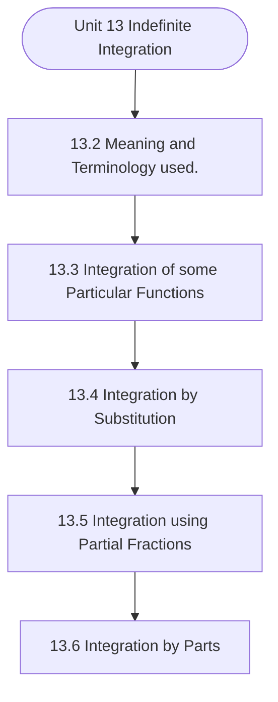

# MCS-061: Mathematical Foundations - I
## Unit 13: Indefinite Integration

> 📚 **Programme:** M.Sc. (Data Science and Analytics) | **Semester:** Semester 1  
> ⏱️ **Estimated Study Time:** ~59 mins | 📄 **Textbook Pages:** 29 Pages  
> 📥 **Original PDF:** [Download & View Authentic Textbook](../../../pdfs/Semester_1/MCS-061_Mathematical_Foundations_-_I/Unit-13_Indefinite_Integration.pdf)

---

### 🎯 Executive Concept & Data Science Relevance
In modern data systems, **Indefinite Integration** forms a vital conceptual pillar. Set theory is the fundamental bedrock of discrete mathematics, computer science, and data engineering. Relational database operations (SQL JOIN, UNION, INTERSECT), feature spaces, probability sample spaces, and categorical groupings are direct applications of set theory.

> [!NOTE]
> **Why this matters for your career:** Mastering indefinite integration equips you with the foundational principles required to reason mathematically about high-dimensional datasets, evaluate algorithm performance, and avoid statistical pitfalls in production machine learning pipelines.

### 🗺️ Visual Knowledge Architecture
The following concept map illustrates the structural hierarchy and learning trajectory of this module:



### 📖 Core Definitions & Terminology Cards

> 📌 **Set**  
> - **Formal Definition:** A well-defined collection of distinct objects, denoted typically by uppercase letters $A, B, X$. Distinctness implies no duplicate elements, and well-defined means for any entity $x$, either $x \in A$ or $x \notin A$ is deterministically decidable.  
> - 💡 **Practical Intuition & Analogy:** *Think of a Python `set({1, 2, 3})` where duplicate elements are collapsed and lookup is based on unique membership.*

> 📌 **Cardinality $\vert A \vert$ or $n(A)$**  
> - **Formal Definition:** The total count of distinct elements in a finite set $A$. If $\vert A \vert = n$, the set contains exactly $n$ distinct members. For infinite sets, cardinality characterizes transfinite sizes (e.g. countable $\aleph_0$ vs uncountable $c$).  
> - 💡 **Practical Intuition & Analogy:** *The output of `len(my_set)` in programming.*

> 📌 **Power Set $\mathcal{P}(A)$**  
> - **Formal Definition:** The set of all possible subsets of $A$, including the empty set $\emptyset$ and $A$ itself: $\mathcal{P}(A) = \lbrace S \mid S \subseteq A \rbrace$. If $\vert A \vert = n$, then $\vert \mathcal{P}(A) \vert = 2^n$.  
> - 💡 **Practical Intuition & Analogy:** *In feature selection, evaluating all possible combinations of $n$ features requires searching through the power set of features ( $2^n$ candidate models ).*

> 📌 **Subset & Proper Subset**  
> - **Formal Definition:** A set $A$ is a subset of $B$ ( $A \subseteq B$ ) if $\forall x \in A \implies x \in B$. It is a proper subset ( $A \subset B$ ) if $A \subseteq B$ and $A \neq B$ (i.e. $\exists y \in B$ such that $y \notin A$).  
> - 💡 **Practical Intuition & Analogy:** *All Data Scientists are Analysts ( $A \subseteq B$ ), but not all Analysts are Data Scientists ( $A \subset B$ ).*

> 📌 **Universal Set $U$**  
> - **Formal Definition:** A designated superset containing all objects and entities under active consideration in a given problem or domain. Every set $X$ in that context satisfies $X \subseteq U$.  
> - 💡 **Practical Intuition & Analogy:** *The entire master database table or global population before applying any filter conditions.*

> 📌 **Complement $A^c$ or $A'$**  
> - **Formal Definition:** The set of all elements in the universal set $U$ that do not belong to $A$: $A^c = \lbrace x \in U \mid x \notin A \rbrace = U \setminus A$.  
> - 💡 **Practical Intuition & Analogy:** *The NOT condition in filtering: selecting all records that do NOT match a criteria.*

### ⚡ Governing Mathematical Laws & Formula Cheatsheet
#### 🔹 Power Set Cardinality Theorem
$$
\vert\mathcal{P}(A)\vert = 2^n \quad \text{where } n = \vert A\vert
$$
- **Explanation:** Proved by induction or combinatorics: each of the $n$ elements has exactly 2 binary choices (to be included or excluded from a subset).

#### 🔹 Principle of Inclusion-Exclusion (2 Sets)
$$
\vert A \cup B\vert = \vert A\vert + \vert B\vert - \vert A \cap B\vert
$$
- **Explanation:** Prevents double-counting the elements present in the intersection when calculating the total union size.

#### 🔹 Principle of Inclusion-Exclusion (3 Sets)
$$
\begin{aligned} \vert A \cup B \cup C\vert = & \;\vert A\vert + \vert B\vert + \vert C\vert \\ & - (\vert A \cap B\vert + \vert B \cap C\vert + \vert A \cap C\vert) \\ & + \vert A \cap B \cap C\vert \end{aligned}
$$
- **Explanation:** Alternates adding singletons, subtracting pairwise overlaps, and re-adding the three-way intersection.

#### 🔹 De Morgan's Laws for Sets
$$
(A \cup B)^c = A^c \cap B^c \quad \text{and} \quad (A \cap B)^c = A^c \cup B^c
$$
- **Explanation:** The complement of a union is the intersection of the complements, and vice versa. Fundamental to query optimization and boolean logic.

#### 🔹 Cartesian Product Cardinality
$$
\vert A \times B\vert = \vert A\vert \times \vert B\vert = \lbrace (a, b) \mid a \in A, b \in B \rbrace
$$
- **Explanation:** Basis of relational database CROSS JOIN, generating every ordered pair between two entities.

### ⚖️ Axiomatic Properties & Governing Laws
The mathematical formulations of this module are anchored by foundational algebraic and structural laws:

- **Idempotent Laws:** $A \cup A = A \quad \text{and} \quad A \cap A = A$
- **Identity Laws:** $A \cup \emptyset = A \quad \text{and} \quad A \cap U = A$
- **Domination Laws:** $A \cup U = U \quad \text{and} \quad A \cap \emptyset = \emptyset$
- **Commutative Laws:** $A \cup B = B \cup A \quad \text{and} \quad A \cap B = B \cap A$
- **Associative Laws:** $(A \cup B) \cup C = A \cup (B \cup C) \quad \text{and} \quad (A \cap B) \cap C = A \cap (B \cap C)$
- **Distributive Laws:** $A \cap (B \cup C) = (A \cap B) \cup (A \cap C) \quad \text{and} \quad A \cup (B \cap C) = (A \cup B) \cap (A \cup C)$
- **Complement Laws:** $A \cup A^c = U, \quad A \cap A^c = \emptyset, \quad (A^c)^c = A$

### 📌 Comprehensive Section-by-Section Study Breakdown
#### `13.2` Meaning and Terminology used.
##### 📘 Theoretical Principles & In-Depth Exposition
The section on **Meaning and Terminology used.** establishes rigorous theoretical foundations necessary for advanced computational modeling. It introduces formal mathematical structures and symbolic notations that guarantee consistency across proofs and algorithms.

In the broader scope of **Indefinite Integration**, understanding meaning and terminology used. is essential to formalizing data representations, verifying boundary constraints, and ensuring computational determinism across multidimensional feature spaces.

##### ⚙️ Mathematical & Algorithmic Mechanics
- **Formal Mechanics:** Establishes symbolic transformations and state invariants governing meaning and terminology used..
- **Boundary Invariants:** Ensures robust error-handling, non-empty set guarantees, and strict asymptotic bounds.

##### 📊 Practical Data Science & Production Relevance
- **Industry Application:** Directly implemented in production workflows such as SQL query filters, pandas vectorized operations, and feature transformation pipelines.
- **Production Pitfall:** Failing to verify membership bounds or missing edge cases in meaning and terminology used. can cause silent data corruption or performance bottlenecks.

> [!TIP]
> **Key Exam & Technical Interview Takeaway:** Be prepared to define meaning and terminology used. formally, cite its core mathematical invariants, and solve step-by-step numerical/proof questions.

#### `13.3` Integration of some Particular Functions
##### 📘 Theoretical Principles & In-Depth Exposition
FUNCTIONS In this section, we learn how the formulae mentioned in the table on previous page are used. Example 1: Evaluate the following integrals: (i)  dx (ii) dx (iii) dx (iv)  dx x 3 (v) 7/ 2 x dx  (vi)  dx x (vii)  dx x / (viii) dx x 3 (ix)  + + dx ) x x ( (x)  − + dx )1 x )( x ( (xi)  + − dx x x x (xii) dx x x x  + + (xiii)       + dx x x (xiv) dx x x        + (xv)       + + − + dx x x x x Solution: (i)  dx = c x 5 + 5 isa constant andif kis constant then kdx kx c     = +      where c is constant of integration.

Indefinite Integration Note: Constant of integration c is added everywhere, so in future we will not write ‘where c is constant of integration’. (ii) dx = c c x = + as 0 is constant (iii) c x dx +  =  as  is constant (iv) c x c x dx x + = + + = +        + + = +  c n x dx x n n  (v) 7 1 7/2 x x dx c x c + = + = + +        + + = +  c n x dx x n n  (vi)  dx x = c x c x dx x + − = + + − = − + − −        + + = +  c n x dx x n n  (vii)  dx x / = c x c / x dx x / / / + − = + − = − − −        + + = +  c n x dx x n n  (viii) dx x 3 = c x c / x dx x dx x / / / / + = + = =   −       + + = +  c n x dx x n n  (ix)     + + = + + dx dx x dx x dx ) x x ( c x x x + + + = (x)   − + − = − + dx )1 x x x ( dx )1 x )( x ( c x x x x + − + − =           + = + + =   + c kx kdx and c n x dx x n n  (xi)  + − dx x x x = dx x x x x x        + −  − + − = dx ) x x x ( c x x x + − + − = − c x x x + − − = Calculus (xii) dx x x x  + + = ( ) 7/2 5/2 1/2 x x dx x x 3x dx x x x −   + + = + +       c x x x c / x / x / x / / / / / + + + = + + + = (xiii)        + dx x x = ( )dx x x / /  − + = c / x / x / / + + = c x x + + (xiv) dx x x        + =        + + dx x .x.2 x x  + + = − dx ) x x ( c x x x + + − + = − c x x x3 + + − = (xv)        + + − + dx x x x x  − −+ + − + = dx ) x x x x ( c x x x x x + − + − + − + = − − c x x x x x + − − − + = Example 2: Evaluate the following integrals: (i)  + dx ) x ( (ii)  − dx ) x ( (iii) + dx ) x ( / (iv) 5 8 3x dx −  (v)  + + dx x ) x ( / (vi)  + dx ) x ( (vii)  + dx x (viii) dx e x log  − (ix) dx a x loga  + (x)  dx a x (xi)  dx e x (xii) 5x 7 e dx +  (xiii) dx a x  − (xiv)  + dx ) x e ( x (xv)  + + + + dx ) a e a e a( e a a x x (xvi)  dx x x (xvii) dx x x (xviii) − x x x x b a ) b a( dx (xix)  + + dx ) a a e( a log m a log x x log a a a (xx) a x (5x 3) x x a dx 2x   + − + + +   +    Indefinite Integration Solution: (i)  + dx ) x ( = c )1 ( ) x ( + + + +           = = + + + = +  + n ,2 a Here c )1 n ( a ) b ax ( dx ) b ax ( n n  c ) x ( + + = (ii) c ) ( ) x ( dx ) x ( + − − = −            = − = + + + = +  + n ,9 a Here c )1 n ( a ) b ax ( dx ) b ax ( n n  c ) x ( 7 + − − = (iii) c ) x ( dx ) x ( / / +  + = +            = = + + + = +  + / n ,9 a Here c )1 n ( a ) b ax ( dx ) b ax ( n n  c ) x ( / + + = (iv) = −  dx x c )3 ( ) x ( dx ) x ( + −  − = −  c ) x ( + − − =           = − = + + + = +  + / n ,3 a Here c )1 n ( a ) b ax ( dx ) b ax ( n n  (v) dx ) x ( dx x ) x (   − + = + +       = −n m n m a a a   + = dx ) x ( c ) x ( +  + =           = = + + + = +  + n ,2 a Here c )1 n ( a ) b ax ( dx ) b ax ( n n  = c ) x ( 4 + + (vi) dx ) x ( dx ) x (   − + = + Calculus c ) x ( +  − + = −           − = = + + + = +  + n ,7 a Here c )1 n ( a ) b ax ( dx ) b ax ( n n  c ) x ( 2 + + − = − (vii) dx ) x ( dx x / −   + = + c ) x ( / +  + =           − = = + + + = +  + / n ,3 a Here c )1 n ( a ) b ax ( dx ) b ax ( n n  c x + + = (viii)    − = = − − dx ) x ( dx e dx e ) x log( x log a log f (x) a f(x)   =   ( ) 7/ 2 7/ 2 (3x 5) c (3x 5) c 7 / 2 (3) − = + = − + (ix) dx x dx a x loga   + = + a log f (x) a f(x)   =   ( ) 3/2 3/2 (4x 5) c (4x 5) c 3/ 2 + = + = + +  (x) c a log a dx a x x + =  mx mx a a dx c mlog a Herea a,m   = +       = =    (xi) c e dx e x x + =            = + =  a Here c a e dx e ax ax  (xii) c e dx e x x + = + +            = = + =  + + b ,5 a Here c a e dx e b ax b ax  (xiii) c a log a dx a x x + − = − −            = − = + =  + + n ,2 m Here c a log m a dx a n mx n mx  Indefinite Integration (xiv) c x e dx ) x e ( x x + + = +  (xv)  + + + + dx ) a e a e a( e a a x x = c x a x e x a e a log a e a a x x + + + + + a a e Here a ,e ,a all are constants andif kisconstant then kdx kx c     = +      (xvi)    = = dx dx )

##### ⚙️ Mathematical & Algorithmic Mechanics
- **Formal Mechanics:** Establishes symbolic transformations and state invariants governing integration of some particular functions.
- **Boundary Invariants:** Ensures robust error-handling, non-empty set guarantees, and strict asymptotic bounds.

##### 📊 Practical Data Science & Production Relevance
- **Industry Application:** Directly implemented in production workflows such as SQL query filters, pandas vectorized operations, and feature transformation pipelines.
- **Production Pitfall:** Failing to verify membership bounds or missing edge cases in integration of some particular functions can cause silent data corruption or performance bottlenecks.

> [!TIP]
> **Key Exam & Technical Interview Takeaway:** Be prepared to define integration of some particular functions formally, cite its core mathematical invariants, and solve step-by-step numerical/proof questions.

#### `13.4` Integration by Substitution
##### 📘 Theoretical Principles & In-Depth Exposition
In section 13.3, we have taken into consideration the integrations for which a formula can directly be used. But sometimes integrand cannot be directly integrated using standard formula. In order to convert it into a form for which standard formula can be applied, we substitute some function in place of some other function and this technique of obtaining the integration is known as integration by substitution method.

Substitution Method If integral is of the type , dx )) x ( f( ) x ('f or dx ) x ('f )) x ( f( n n   then Step I We substitute f(x) = t … (1) Step II Differentiate on both sides of (1) Step III Change the given integral in terms of t Step IV After simplification, if necessary, we get one of the standard forms discussed in Sec.

Using appropriate formula we can obtain the integral of given integrand in terms of t. Step V Replace t in terms of x, we get the desired result after simplification, if required. Following example will explain the substitution method and the steps involved in it: Example 4: Evaluate the following integrals: Calculus (i)  + dx x x (ii)  + − a x x n n (iii)  + dx e e x x (iv)  dx x log x (v)  + + + dx c bx ax b ax (vi)  + + + dx )1 x x ( x x (vii)  − − − + dx e e e e x x x x (viii) + dx x x (ix)  + + + dx c bx ax ) b ax ( (x)  + + dx ) x log( ) x 1( x Solution: (i) Let I =  + dx x x … (1) Putting t x10 = + Differentiating dt dx x = dt dx x 9 =  (1) becomes I =   = t dt dt t c t log + =     + =  c y log dy y  c x log + + = [Replacing t in terms of x ] c )1 x log( + + =       − + x real for ve be cannot x10  Alternatively: We can also put t x10 = Differentiating dt dx x = dt dx x 9 =  )1(  becomes I =  + =  + dt t dt t c t log + + =     + + = +  c a x log dx a x  Indefinite Integration c x log + + = [Replacing t in terms of x ] c )1 x log( + + =       + + x real for ve always is x10  (ii) Let I =  + − dx a x x n n … (1) Putting t a xn = + Differentiating dt dx nx n = − n dt dx x n =  − )1(  becomes I = t dt n c t log n + =     + =  c x log dx x  c a x log n n + + = [Replacing t in terms of x] (iii) Let I =  + dx e e x x … (1) Putting t ex = + Differentiating dt dx ex = )1(  becomes I = c e log c t log t dt x + + = + =      + =  c x log dx x  (iv) Let I =  dx x log x …(1) Putting t x log = Differentiating dt dx x = )1(  becomes I = t dt c t log + =     + =  c x log dx x  c x log log + = [Replacing t in terms of x] Calculus (v) Let I =  + + + dx c bx ax b ax … (1) Putting c bx ax2 + + = t Differentiating dt dx ) b ax ( = + )1(  becomes k c bx ax log k t log t dt I + + + = + = =  where k is constant of integration (vi) Let I = 8x 4x 4x 2x dx dx (x x 1) (x x 1) + + = + + + +   … (1) Putting t x x = + + Differentiating dt dx ) x x ( = + )1(  becomes I =   + −  = = − − c t dt t t dt = c )1 x x ( + + + − − [Replacing t in terms of x] (vii) Let I =  − − − + dx e e e e x x x x … (1) Putting t e e x x = − − Differentiating dt dx ) e e ( x x = + − dt dx ) e e( x x = +  − (1) becomes I = t dt c t log + =     + =  c x log dx x  c e e log x x + − = − [Replacing t in terms of x] (viii) Let I =   + = + dx )1 x ( x dx x x … (1) Putting t x = + Indefinite Integration Differentiating dt dx x = dt x dx =  )1(  becomes I = t dt c x log c t log + + = + = (ix) Let I = dx c bx ax ) b ax (  + + + … (1) Putting t c bx ax2 = + + Differentiating dt dx ) b ax ( = + )1(  becomes I = k )c bx ax ( k / t dt t / / + + + = + =  , where k is constant of integration (x) Let I =  + + dx ) x log( ) x 1( x … (1) Putting log t ) x 1( 2 = + Differentiating dt dx x x = + (1) becomes I = t dt = c ) x log( log c t log 2 + + = + [Replacing t in terms of x]

##### ⚙️ Mathematical & Algorithmic Mechanics
- **Formal Mechanics:** Establishes symbolic transformations and state invariants governing integration by substitution.
- **Boundary Invariants:** Ensures robust error-handling, non-empty set guarantees, and strict asymptotic bounds.

##### 📊 Practical Data Science & Production Relevance
- **Industry Application:** Directly implemented in production workflows such as SQL query filters, pandas vectorized operations, and feature transformation pipelines.
- **Production Pitfall:** Failing to verify membership bounds or missing edge cases in integration by substitution can cause silent data corruption or performance bottlenecks.

> [!TIP]
> **Key Exam & Technical Interview Takeaway:** Be prepared to define integration by substitution formally, cite its core mathematical invariants, and solve step-by-step numerical/proof questions.

#### `13.5` Integration using Partial Fractions
##### 📘 Theoretical Principles & In-Depth Exposition
The integrand may be in the form that it can be integrated only after resolving it into partial fractions. Here, in this section, we are going to deal with integration of such functions: First of all we discuss the process of resolving such functions into partial fractions: Important steps for resolving into partial fractions are: 1.

Check degree of numerator, if it is less than that of denominator, go to step 2 and if it is greater than or equal to that of denominator, then first divide the numerator by the denominator and then go to step 2. We may have one of the following main types of functions which we will dealt as discussed below: Indefinite Integration Type 1 Denominator involve all linear factors with exponent as unity.

.)3 x )( x )( x ( x − − − + Step I Let ) x )( x )( x ( x − − − + x C x B x A − + − + − = … (1) Step II Equate each of the factors of denominator to zero. x – 1 = 0 x =  , x x ,2 x x =  = − =  = − Step III Put x = 1, 2, 3 every where (in the given expression) but not in the factor from which it has come out, )3 )( 1( A = = − − + = , [By putting x = 1 in L.H.S.

##### ⚙️ Mathematical & Algorithmic Mechanics
- **Formal Mechanics:** Establishes symbolic transformations and state invariants governing integration using partial fractions.
- **Boundary Invariants:** Ensures robust error-handling, non-empty set guarantees, and strict asymptotic bounds.

##### 📊 Practical Data Science & Production Relevance
- **Industry Application:** Directly implemented in production workflows such as SQL query filters, pandas vectorized operations, and feature transformation pipelines.
- **Production Pitfall:** Failing to verify membership bounds or missing edge cases in integration using partial fractions can cause silent data corruption or performance bottlenecks.

> [!TIP]
> **Key Exam & Technical Interview Takeaway:** Be prepared to define integration using partial fractions formally, cite its core mathematical invariants, and solve step-by-step numerical/proof questions.

#### `13.6` Integration by Parts
##### 📘 Theoretical Principles & In-Depth Exposition
If u and v are any two functions of a single variable x such that first derivates of u and v w.r.t. x exist, then by product rule, we have ( ) d dv du uv u v dx dx dx = + Integrating on both sides, we have   + = dx dx du v dx dx dv u uv dv du u dx uv vdx dx dx  = −   … (1) Calculus Let ) x ( g dx dv and ) x ( f u = = … (2)  = =  dx ) x ( g v and ) x ('f dx du … (3) Using (2) and (3) in (1), we get f(x) g(x)dx f(x) g(x)dx f '(x) g(x)dx dx   = −       Or ( ) dx dx II I dx d dx II I dx II I        − = … (4) where I = first function = f(x) II = second function = g(x) R.H.S.

of equation (4) is known as integration by parts of L.H.S. of equation (4), where I, and II just indicate our choice between the product of two functions taking as first and second functions. Remark 3: (i) In case of integration by parts, choice of first and second function is important as explained in part (i) of Example 6 given below.

(ii) If in the product of two functions, one is polynomial function then we take polynomial function as first function. (iii) Integration by parts is one of the methods (techniques) of integration. It does not mean that integration of product of any two functions exists. Example 6: Evaluate the following integrals: (i)  dx xe x (ii)  dx e x x (iii)  dx a x x (iv)  dx x log Solution: (i) Let I =  dx xe x I II Integrating by parts (taking x as first and x e as second function) I ( )    +           − = x x c dx dx e ) x ( dx d dx e x where 1c is constant of integration  + − = x x c dx ) e )( 1( xe  + − = x x c dx e xe ( ) x x c c e xe + + − = where c is constant of integration Indefinite Integration x x xe e c, where c c c = − + = − Let us see what happens if we integrate by parts by taking x as second and x e as first function: I ( ) x x d e xdx (e ) xdx dx c dx     = − +            x x x x x x x e e e dx c x e dx c   = − + = − +       We see that integration becomes more complicated.

##### ⚙️ Mathematical & Algorithmic Mechanics
- **Formal Mechanics:** Establishes symbolic transformations and state invariants governing integration by parts.
- **Boundary Invariants:** Ensures robust error-handling, non-empty set guarantees, and strict asymptotic bounds.

##### 📊 Practical Data Science & Production Relevance
- **Industry Application:** Directly implemented in production workflows such as SQL query filters, pandas vectorized operations, and feature transformation pipelines.
- **Production Pitfall:** Failing to verify membership bounds or missing edge cases in integration by parts can cause silent data corruption or performance bottlenecks.

> [!TIP]
> **Key Exam & Technical Interview Takeaway:** Be prepared to define integration by parts formally, cite its core mathematical invariants, and solve step-by-step numerical/proof questions.

### 📐 Step-by-Step Solved Mathematical Examples
To solidify your theoretical understanding, work through these fully solved, step-by-step mathematical problems:

#### 🧮 Example 1: Three-Set Inclusion-Exclusion Survey Analysis
> **Problem Statement:**  
> In a cohort of 120 Data Science students, 65 know Python ( $P$ ), 50 know SQL ( $S$ ), and 40 know R ( $R$ ). Furthermore, 25 know both Python and SQL, 20 know both Python and R, 15 know both SQL and R, and 8 know all three technologies. How many students know at least one technology, and how many know none?

**Detailed Step-by-Step Solution:**

Applying the Principle of Inclusion-Exclusion for 3 sets:

$$
\begin{aligned} \vert P \cup S \cup R\vert & = \vert P\vert + \vert S\vert + \vert R\vert - (\vert P \cap S\vert + \vert P \cap R\vert + \vert S \cap R\vert) + \vert P \cap S \cap R\vert \\ & = 65 + 50 + 40 - (25 + 20 + 15) + 8 \\ & = 155 - 60 + 8 = 103 \text{ students.} \end{aligned}
$$

The count of students who know none of the three languages is:

$$
\vert(P \cup S \cup R)^c\vert = \vert U\vert - \vert P \cup S \cup R\vert = 120 - 103 = 17 \text{ students.}
$$

#### 🧮 Example 2: Power Set Enumeration and Proper Subset Calculation
> **Problem Statement:**  
> Given $S = \lbrace 1, 2, 3 \rbrace$. Calculate $\vert\mathcal{P}(S)\vert$, enumerate every element, and find the number of proper subsets.

**Detailed Step-by-Step Solution:**

1. **Cardinality:** With $n = \vert S\vert = 3$, the total subsets are $\vert\mathcal{P}(S)\vert = 2^3 = 8$.

2. **Enumeration:**
$$
\mathcal{P}(S) = \lbrace \emptyset, \lbrace 1\rbrace, \lbrace 2\rbrace, \lbrace 3\rbrace, \lbrace 1, 2\rbrace, \lbrace 1, 3\rbrace, \lbrace 2, 3\rbrace, \lbrace 1, 2, 3\rbrace \rbrace
$$

3. **Proper Subsets:** Since proper subsets exclude the set itself, the total count is $2^n - 1 = 8 - 1 = 7$.

### 💻 Practical Data Science Implementation (Python)
Theory translates directly into production algorithms. Below is a self-contained, commented Python implementation illustrating the core operations of this unit:

```python
# Practical Set Operations in Data Science
python_devs = {"Alice", "Bob", "Charlie", "David", "Eva"}
sql_devs = {"Charlie", "David", "Eva", "Frank", "Grace"}

# 1. Union (Full talent pool)
all_talent = python_devs | sql_devs
print(f"Total Unique Talent: {len(all_talent)} -> {all_talent}")

# 2. Intersection (Full-Stack Data Engineers)
full_stack = python_devs & sql_devs
print(f"Full-Stack Talent (Python & SQL): {len(full_stack)} -> {full_stack}")

# 3. Difference (Python Specialists without SQL)
python_only = python_devs - sql_devs
print(f"Python Only: {python_only}")

# 4. Jaccard Similarity Coefficient: |A ∩ B| / |A ∪ B|
jaccard_sim = len(full_stack) / len(all_talent)
print(f"Jaccard Skill Overlap: {jaccard_sim:.3f}")
```

### 💡 Interactive Self-Assessment Checkpoints
Test your comprehension before proceeding. Tap each question to reveal the comprehensive explanation:

<details>
<summary><b>Checkpoint 1:</b> If a set $A$ has 5 elements, how many proper subsets does it possess? <i>(Tap to reveal answer)</i></summary>

> **Answer & Analysis:**  
> A set with $n=5$ elements has total subsets $\vert\mathcal{P}(A)\vert = 2^5 = 32$. Proper subsets exclude the set itself, so the number of proper subsets is $2^n - 1 = 32 - 1 = 31$.
</details>

<details>
<summary><b>Checkpoint 2:</b> What is the difference between $x \in A$ and $\lbrace x\rbrace \subseteq A$? <i>(Tap to reveal answer)</i></summary>

> **Answer & Analysis:**  
> $x \in A$ denotes that element $x$ is a direct member of set $A$. In contrast, $\lbrace x\rbrace \subseteq A$ denotes that the singleton set containing $x$ is a subset of $A$.
</details>

<details>
<summary><b>Checkpoint 3:</b> State De Morgan's Law for the complement of $(A \cap B)$. <i>(Tap to reveal answer)</i></summary>

> **Answer & Analysis:**  
> $(A \cap B)^c = A^c \cup B^c$. The complement of the intersection is equal to the union of their individual complements.
</details>

<details>
<summary><b>Checkpoint 4:</b> Explain Russell's Paradox in naive set theory. <i>(Tap to reveal answer)</i></summary>

> **Answer & Analysis:**  
> Let $R = \lbrace X \mid X 
> otin X\rbrace$ be the set of all sets that do not contain themselves. If $R \in R$, then by definition $R 
> otin R$. If $R 
> otin R$, then by definition $R \in R$. This contradiction proves that naive unrestricted set comprehension leads to paradoxes, necessitating axiomatic set theory (ZFC).
</details>

<details>
<summary><b>Checkpoint 5:</b> Evaluate the following integrals: (i)        + dx x <i>(Tap to reveal answer)</i></summary>

> **Answer & Analysis:**  
> This question tests your conceptual mastery of Indefinite Integration. Review the governing formulas and section breakdowns above to formulate a complete, rigorous proof or derivation.
</details>

<details>
<summary><b>Checkpoint 6:</b> Evaluate the following integrals: (i)  −dx e x x <i>(Tap to reveal answer)</i></summary>

> **Answer & Analysis:**  
> This question tests your conceptual mastery of Indefinite Integration. Review the governing formulas and section breakdowns above to formulate a complete, rigorous proof or derivation.
</details>

### 🎯 Executive Module Wrap-Up
- **Central Idea:** Indefinite Integration provides essential mathematical and algorithmic tools directly utilized in Data Science.
- **Mathematical Rigor:** Formulas and laws must be memorized with attention to boundary conditions and assumptions.
- **Full Textbook Coverage:** For exhaustive multi-page derivations, proofs, and supplementary exercises, consult the [Authentic IGNOU Textbook](../../../pdfs/Semester_1/MCS-061_Mathematical_Foundations_-_I/Unit-13_Indefinite_Integration.pdf).

---
### 🧭 Navigation & Syllabus Index
[⬅ Previous: Unit 12](unit_12_Differentiation.md) | [📑 Course Index](README.md) | [Next: Unit 14 ➡](unit_14_Definite_Integration.md)
