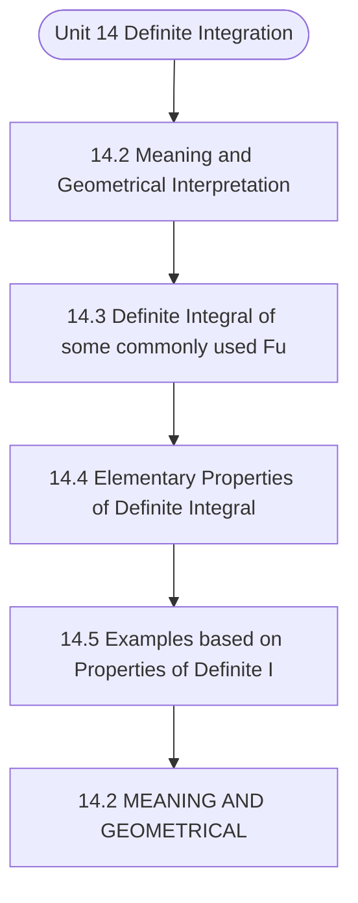

# MCS-061: Mathematical Foundations - I
## Unit 14: Definite Integration

> 📚 **Programme:** M.Sc. (Data Science and Analytics) | **Semester:** Semester 1  
> ⏱️ **Estimated Study Time:** ~49 mins | 📄 **Textbook Pages:** 23 Pages  
> 📥 **Original PDF:** [Download & View Authentic Textbook](../../../pdfs/Semester_1/MCS-061_Mathematical_Foundations_-_I/Unit-14_Definite_Integration.pdf)

---

### 🎯 Executive Concept & Data Science Relevance
In modern data systems and advanced analytics, **Definite Integration** forms a vital conceptual pillar. Set theory is the fundamental bedrock of discrete mathematics, computer science, and data engineering. Relational database operations (SQL JOIN, UNION, INTERSECT), feature spaces, probability sample spaces, and categorical groupings are direct applications of set theory.

> [!NOTE]
> **Why this matters for your career:** Mastering definite integration equips you with the foundational principles required to reason mathematically about high-dimensional datasets, evaluate algorithm performance, and avoid statistical pitfalls in production machine learning pipelines.

### 🗺️ Visual Knowledge Architecture
The following concept map illustrates the structural hierarchy and learning trajectory of this module:



### 📖 Core Definitions & Terminology Cards

> 📌 **Set**  
> - **Formal Definition:** A well-defined collection of distinct objects, denoted typically by uppercase letters $A, B, X$. Distinctness implies no duplicate elements, and well-defined means for any entity $x$, either $x \in A$ or $x \notin A$ is deterministically decidable.  
> - 💡 **Practical Intuition & Analogy:** *Think of a Python `set({1, 2, 3})` where duplicate elements are collapsed and lookup is based on unique membership.*

> 📌 **Cardinality $\vert A \vert$ or $n(A)$**  
> - **Formal Definition:** The total count of distinct elements in a finite set $A$. If $\vert A \vert = n$, the set contains exactly $n$ distinct members. For infinite sets, cardinality characterizes transfinite sizes (e.g. countable $\aleph_0$ vs uncountable $c$).  
> - 💡 **Practical Intuition & Analogy:** *The output of `len(my_set)` in programming.*

> 📌 **Power Set $\mathcal{P}(A)$**  
> - **Formal Definition:** The set of all possible subsets of $A$, including the empty set $\emptyset$ and $A$ itself: $\mathcal{P}(A) = \lbrace S \mid S \subseteq A \rbrace$. If $\vert A \vert = n$, then $\vert \mathcal{P}(A) \vert = 2^n$.  
> - 💡 **Practical Intuition & Analogy:** *In feature selection, evaluating all possible combinations of $n$ features requires searching through the power set of features ( $2^n$ candidate models ).*

> 📌 **Subset & Proper Subset**  
> - **Formal Definition:** A set $A$ is a subset of $B$ ( $A \subseteq B$ ) if $\forall x \in A \implies x \in B$. It is a proper subset ( $A \subset B$ ) if $A \subseteq B$ and $A \neq B$ (i.e. $\exists y \in B$ such that $y \notin A$).  
> - 💡 **Practical Intuition & Analogy:** *All Data Scientists are Analysts ( $A \subseteq B$ ), but not all Analysts are Data Scientists ( $A \subset B$ ).*

> 📌 **Universal Set $U$**  
> - **Formal Definition:** A designated superset containing all objects and entities under active consideration in a given problem or domain. Every set $X$ in that context satisfies $X \subseteq U$.  
> - 💡 **Practical Intuition & Analogy:** *The entire master database table or global population before applying any filter conditions.*

> 📌 **Complement $A^c$ or $A'$**  
> - **Formal Definition:** The set of all elements in the universal set $U$ that do not belong to $A$: $A^c = \lbrace x \in U \mid x \notin A \rbrace = U \setminus A$.  
> - 💡 **Practical Intuition & Analogy:** *The NOT condition in filtering: selecting all records that do NOT match a criteria.*

### ⚡ Governing Mathematical Laws & Formula Cheatsheet
#### 🔹 Power Set Cardinality Theorem
$$
\vert\mathcal{P}(A)\vert = 2^n \quad \text{where } n = \vert A\vert
$$
- **Explanation:** Proved by induction or combinatorics: each of the $n$ elements has exactly 2 binary choices (to be included or excluded from a subset).

#### 🔹 Principle of Inclusion-Exclusion (2 Sets)
$$
\vert A \cup B\vert = \vert A\vert + \vert B\vert - \vert A \cap B\vert
$$
- **Explanation:** Prevents double-counting the elements present in the intersection when calculating the total union size.

#### 🔹 Principle of Inclusion-Exclusion (3 Sets)
$$
\begin{aligned} \vert A \cup B \cup C\vert = & \;\vert A\vert + \vert B\vert + \vert C\vert \\ & - (\vert A \cap B\vert + \vert B \cap C\vert + \vert A \cap C\vert) \\ & + \vert A \cap B \cap C\vert \end{aligned}
$$
- **Explanation:** Alternates adding singletons, subtracting pairwise overlaps, and re-adding the three-way intersection.

#### 🔹 De Morgan's Laws for Sets
$$
(A \cup B)^c = A^c \cap B^c \quad \text{and} \quad (A \cap B)^c = A^c \cup B^c
$$
- **Explanation:** The complement of a union is the intersection of the complements, and vice versa. Fundamental to query optimization and boolean logic.

#### 🔹 Cartesian Product Cardinality
$$
\vert A \times B\vert = \vert A\vert \times \vert B\vert = \lbrace (a, b) \mid a \in A, b \in B \rbrace
$$
- **Explanation:** Basis of relational database CROSS JOIN, generating every ordered pair between two entities.

### ⚖️ Axiomatic Properties & Governing Laws
The mathematical formulations of this module are anchored by foundational algebraic and structural laws:

- **Idempotent Laws:** $A \cup A = A \quad \text{and} \quad A \cap A = A$
- **Identity Laws:** $A \cup \emptyset = A \quad \text{and} \quad A \cap U = A$
- **Domination Laws:** $A \cup U = U \quad \text{and} \quad A \cap \emptyset = \emptyset$
- **Commutative Laws:** $A \cup B = B \cup A \quad \text{and} \quad A \cap B = B \cap A$
- **Associative Laws:** $(A \cup B) \cup C = A \cup (B \cup C) \quad \text{and} \quad (A \cap B) \cap C = A \cap (B \cap C)$
- **Distributive Laws:** $A \cap (B \cup C) = (A \cap B) \cup (A \cap C) \quad \text{and} \quad A \cup (B \cap C) = (A \cup B) \cap (A \cup C)$
- **Complement Laws:** $A \cup A^c = U, \quad A \cap A^c = \emptyset, \quad (A^c)^c = A$

### 📌 Comprehensive Section-by-Section Study Breakdown
#### `14.2` Meaning and Geometrical Interpretation

##### 📘 Theoretical Principles & Pedagogical Exposition
In discrete mathematical structures and computational algebra, **Meaning and Geometrical Interpretation** introduces formal symbolic axioms required to guarantee unambiguous logical deduction. Within the learning hierarchy of **Definite Integration**, this concept defines the boundary conditions and operational invariants that ensure mathematical consistency across multi-step proofs.

Understanding meaning and geometrical interpretation is essential when transitioning from manual arithmetic to high-dimensional matrix representations, vector spaces, and algorithm state transitions.

##### ⚙️ Mathematical & Algorithmic Mechanics
- **Core Mechanism:** Formalizes foundational discrete and algebraic principles for definite integration. Enforces symbolic rigor, set-theoretic structures, and axiomatic state invariants across multi-step computational proofs.
- **Boundary Conditions:** Empty input collections, degenerate boundary conditions, identity elements, and non-invertible transformations.

##### 📊 Practical Data Science & Production Relevance
- **Production Workflow:** Directly applied in data science algorithm design, vector space projections, and formal logic validation in query compilers.
- **Real-World Pitfall:** Overlooking edge case boundary assumptions, causing unexpected runtime crashes or invalid deductive conclusions.

> [!TIP]
> **Exam & Technical Interview Insight:** Be ready to state formal definitions, verify axiomatic properties step-by-step, and compute exact values for meaning and geometrical interpretation.

#### `14.3` Definite Integral of some commonly used Functions

##### 📘 Theoretical Principles & Pedagogical Exposition
COMMONLY USED FUNCTIONS Let us here consider some examples of definite integrals based on the formulae Example 1: Evaluate the following integrals: (i)  dx (ii)  + dx )1 x ( (iii)  + dx ) x ( (iv)  3dx x (v)  adx x (vi) 18x 24 dx −  (vii)  − + dx )1 x )( x ( (viii)  + dx x x (ix)  − dx x (x)  dx x (xi)  x dx (xii)  x 3 dx e (xiii)  + x dx (xiv)  + x dx e Solution: (i)  dx =   x = − =  −  = (ii)  + dx )1 x ( = x x = − − + =       + (iii)  + dx ) x ( = 3x 4x   + = + − − = − =     (iv)  3dx x =  x x = − = =       (v)  adx x ( ) a a a a a x + + + − + =       + = Calculus (vi) dx x 2 − = / ) x (            − ( ) ( )         +  + = + +  )1 n ( a b ax dx b ax n n    / / ) ( ) ( − − − =   / / ) ( − =   − =    −  =   ) ( = = − = (vii)  − + dx )1 x )( x ( =  − + − dx )1 x x x ( x x x x       − + − =       − + − − − + − =       − + − − − + − = = + = + = (viii)  + dx x x =        + dx x x x x x dx ) x x (       − + = + = − −        − − − =       − = x x − − − = = = + = + = (ix)  − dx x = x log     −  1 log log − = log as log = = (x)  dx x =   x log dx x =  log ) log (log = − = (xi)  x dx =   log log log x = − =       Definite Integration (xii)  x 3 dx e = e ) e e( e x − = − =       (xiii)  + x dx =   x log log − =       + log ) ( log = − = (xiv)  + x dx e = ) e e( e x − =       + Example 2: Evaluate the following integrals: (i) dx x x 1 + (ii)  + + + dx x x x (iii) dx ) x )( x )( x ( x 0 − + − + (iv)  + + − 2 dx ) x )( x ( x Solution: (i) Let I = dx x x 1 + … (1) Putting t x = + 2t x = +  Differentiating dx = 2tdt Also when x = 1, t = 2 and when x = 6, t = 3 (1) becomes I =  − dt )t (t) t( t t dt ) t3 t( 2       − = − =       − − =           − − − = =       =       − − = (ii) Let I =  + + + dx x x x … (1) Putting t x x2 = + + Differentiating dt dx ) x ( = + Also when t ,0 x = = and when t ,1 x = = Calculus becomes )1(  I =   log log log t log t dt = − = =  (iii) Let I = dx ) x )( x )( x ( x 0 − + − +        − + + + − − = dx x x / x / Usingpartialfractionsasdiscussed in type1,weget 2 3 2( 1) 2 4 A ,B ,C (3 1)(3 4) ( 1 3)( 1 4) (4 3)(4 1)     + − + +   = = − = = = = + − −− −− − +     I       x log x log x log − + + + − − = ( ) ) log (log )1 log (log log log − + − + − − = (0 log3) (log3 0) 3(log 2 log 2 ) aslog1 = − − + − + − = n log3 log3 3(log 2 2log 2) log m n log m   = + + − =   ) log ( ) log log ( − + + = log log − = = log log − (iv) Let I =  + + − 2 dx ) x )( x ( x … (1) First we resolve into partial fractions Let ) x ( C x B x A ) x )( x ( x + + + + + = + + − Multiply on both sides by , ) x )( x ( + + we get )1 x ( C ) x )( x ( B ) x ( A x + + + + + + = − … (2) Putting get we ), ( in x − =  1 x gives x − = = +  ) ( C ) ( B ) ( A + + + − = − A − = A = − Putting get we ), ( in x − =   x gives x − = = +  )1 ( C ) ( B ) ( A + − + + = −  − = −  C C = 7 Definite Integration Comparing coefficient of x on both sides of (2), we get  − =  + = A B B A B = 6        + + + + + − =  2 dx ) x ( x x I     ( ) x x log x log         − + + + + + − = − ( )       − − − + − − = ) log (log log log       − − − + − = log log log as log1 = 0 log log log + − + − = [ m log n m log n =  ] log log + − =


##### ⚙️ Mathematical & Algorithmic Mechanics
- **Core Mechanism:** A function $f: A \to B$ maps each domain element to exactly one codomain element. Injections guarantee unique mappings ($f(a)=f(b) \implies a=b$); surjections cover the entire codomain; bijections admit two-sided inverses $f^{-1}: B \to A$.
- **Boundary Conditions:** Division by zero singularities, non-injective hash collisions in hash tables, and undefined out-of-domain evaluation.

##### 📊 Practical Data Science & Production Relevance
- **Production Workflow:** Feature transformations $X \mapsto \phi(X)$, hash functions in distributed partitions, non-linear activation functions (ReLU, Sigmoid, Softmax), and invertible normalizing flows.
- **Real-World Pitfall:** Applying inverse transformations to non-injective functions, creating multi-valued ambiguities or silent data destruction.

> [!TIP]
> **Exam & Technical Interview Insight:** In exams, demonstrate injectivity by showing $f(x_1) = f(x_2) \implies x_1 = x_2$, and surjectivity by expressing domain variable $x$ in terms of codomain target $y$.

#### `14.4` Elementary Properties of Definite Integral

##### 📘 Theoretical Principles & Pedagogical Exposition
INTEGRAL Here, first we list some properties and then we will use these properties to evaluate some integrals. P 1:   = b a b a dt )t( f dx ) x ( f (Change of variable property) P 2:   − = b a a b dx ) x ( f dx ) x ( f (Interchange of limits property) P 3:      + = c a b c b a b c a , dx ) x ( f dx ) x ( f dx ) x ( f In general We can introduce any number of points between a and b e.g.

     − + + + + = b a c a c c c c b c n n n dx ) x ( f dx ) x ( f ... dx ) x ( f dx ) x ( f dx ) x ( f where, a < b c c ... c c n n      − P 4: a a a 2 f(x)dx, if f(x)isanevenfunction f(x)dx 0, if f(x)isanoddfunction −   =     P 5:   − + = b a b a dx ) x b a( f dx ) x ( f In particular,   − = a a dx ) x a( f dx ) x ( f P 6:    − + = a a a dx ) x a ( f dx ) x ( f dx ) x ( f P7: a 2a 2 f(x)dx, if f(2a x) f(x) f(x)dx 0, if f(2a x) f(x)  − =  =  − = −    Definite Integration Proof: P 1: Let f(x)dx F(x), so f(t)dt F(t) = =   Now, by fundamental theorem of integral calculus   ) a( F ) b ( F ) x ( F dx ) x ( f b a b a − = =  … (1) and   ) a( F ) b ( F )t( F dt )t( f b a b a − = =  … (2) From (1) and (2)   = b a b a dt )t( f dx ) x ( f P 2: Let  = ) x ( F dx ) x ( f by fundamental theorem of integral calculus =  b a dx ) x ( f   ) a( F ) b ( F ) x ( F b a − = … (1) and    ) a( F ) b ( F ) b ( F ) a( F ) x ( F dx ) x ( f a b a b − − = − = =  … (2) From (1) and (2)   − = b a a b dx ) x ( f dx ) x ( f P 3: Let  = ) x ( F dx ) x ( f by fundamental theorem of integral calculus   ) a( F ) b ( F ) x ( F dx ) x ( f b a b a − = =  … (1) and ( )   ( )  b c c a c a b c x F x F dx ) x ( f dx ) x ( f + = +   ( ))c( F ) b ( F )) a( F )c( F ( − + − = ) a( F ) b ( F − = … (2) From (1) and (2)    + = c a b c b a dx ) x ( f dx ) x ( f dx ) x ( f P 4: Using property 3, we have Calculus    − − + = a a a a dx ) x ( f dx ) x ( f ) x ( f … (1) Let I =  − a dx ) x ( f Putting x = – t Differentiating dt dx − = Also, when a t ,a x = − = and when t ,0 x = =  − − =  a dt )t ( f I  − = a dx ) x ( f … (2) [Using properties1 and 2] Using (2) in (1) , we get    + − = − a a a a dx ) x ( f dx ) x ( f dx ) x ( f … (3)        + − + =     odd is f if , dx ) x ( f dx ) x ( f even is f if , dx ) x ( f dx ) x ( f a a a a      =  function odd an is f if , function even is f if , dx ) x ( f a P 5: Let I =  b a dx ) x ( f … (1) R.H.S.

suggests that we should put t b a x − + = Differentiating dt dx − = Also, when x = at = b and when x = b t = a becomes )1(  I = a b f (a b t)( dt) + − −   − + − = a b dt )t b a( f Definite Integration  − + = b a dt )t b a( f [Using property 2]  − + = b a dx ) x b a( [Using property 1] In particular If we put a b ,0 a = = in this result, then   − = a a dx ) x a( f dx ) x ( f P 6:    + = a a a a dx ) x ( f dx ) x ( f dx ) x ( f [Using property 3] I I + = … (1)  = a a dx ) x ( f I Putting x = 2a – t Differentiating dt dx − = Also, when a t,a x = = and when t,a x = =  − − =  a ) dt )( t a ( f I  − = a dt )t a ( f [Using property 2]  − = a dx ) x a ( … (2) [Using property 1] Using (2) in (1), we get    − + = a a a dx ) x a ( f dx ) x ( f ) x ( f P7: From property 6    − + = a a a dx ) x a ( f dx ) x ( f dx ) x ( f        − = − − = − + =     a a a a ) x ( f ) x a ( f if , dx ) x ( f dx ) x ( f ) x ( f ) x a ( f if , dx ) x ( f dx ) x ( f Calculus    − = − = − =  ) x ( f ) x a ( f if ,0 ) x ( f ) x a ( f if , dx ) x ( f a


##### ⚙️ Mathematical & Algorithmic Mechanics
- **Core Mechanism:** Derivatives compute instantaneous rates of change $f'(x) = \lim_{h \to 0} \frac{f(x+h) - f(x)}{h}$. Multivariable gradient vectors $\nabla f$ point in the direction of steepest ascent, with stationary critical points satisfying $\nabla f = 0$.
- **Boundary Conditions:** Discontinuities, non-differentiable sharp cusps (e.g. $|x|$ at $x=0$), vanishing gradients in saturating regions, and indefinite Hessian saddle points.

##### 📊 Practical Data Science & Production Relevance
- **Production Workflow:** Gradient descent parameter optimization $\theta_{t+1} = \theta_t - \eta \nabla L(\theta)$ across deep neural networks, backpropagation autograd engines, and marginal utility modeling.
- **Real-World Pitfall:** Selecting an overly aggressive learning rate $\eta$ causing objective divergence around sharp local minima, or getting trapped along flat plateau regions.

> [!TIP]
> **Exam & Technical Interview Insight:** Memorize the product rule, quotient rule, and multivariable chain rule; solve optimization problems by verifying local extrema using second derivative / Hessian tests.

#### `14.5` Examples based on Properties of Definite Integral

##### 📘 Theoretical Principles & Pedagogical Exposition
DEFINITE INTEGRAL In this section, you will see how the properties of definite integral, discussed in previous Sec. are used and save lot of calculation work. Example 3: Evaluate the following integrals: (i)  − dx x (ii)  − dx x (iii) x 1, x f(x)dx,wheref(x) 2x 3,1 x +    = +     (iv)  − − − + + x x dx ) e e x x ( (v)  −       + − dx x x log (vi) dx x  − (vii)  − + + b a dx ) x b a( f ) x ( f ) x ( f (viii) − + dx x x x (ix) − + + + dx x x x Solution: (i) Let I =  − dx x =   − + − dx x dx x [By P3] I =   − + − − dx ) x ( dx ) x ( ( ) for 1 x 2,x 0 so x x andfor 2 x 4,x 0 so x x   −      − = − −       −    − = −     x x x x       − +       − − =             − − − +             − − − − = ( ) + − − +       + − − − = = + = (ii)  − dx x =   − + − / / dx x dx x [By P 3] Definite Integration   − + − − = / / dx ) x ( dx ) x ( for 0 x 3/ 2 2x 0 so 2x (2x 3) and for 3/ 2 x 2x 0so 2x 2x     − − = − −       − − = −         / / x x x x − + − − =       + − − +       + − − − = + −      − − = = = + − = + − = (iii) Let I =  , dx ) x ( f where = ) x ( f      +   + x ,3 x x ,1 x … (1) Now, I   + = dx ) x ( f dx ) x ( f [Using property 3]   + + + = dx ) x ( dx )1 x ( [Using (1)]   x x x x + +       + = ) ( − − + + − − + = = + = (iv) Let I =  − − − + + x x dx ) e e x x ( Let x x e e x x ) x ( f − − + + = ) x ( x e e ) x ( ) x ( ) x ( f − − −− + − + − = −  x x e e x x − + − − = − ) e e x x ( x x − − + + − = ) x ( f − = ) x ( f  is an odd function dx ) e e x x ( I x x = + + + =   − − [By property 4] (v) Let I =  −       + − dx x x log Let       + − = x x log ) x ( f Calculus x x log x x log ) x ( ) x ( log ) x ( f −       + − =       − + =       − + − − = −        + − − = x x log ) x ( f − = [ m log n m log n =  ]  f(x) is an odd function  − =       + − =  x x log I [By property 4] (vi) dx x  − = dx e dx e x x   + − dx e dx e x x   + = − −         =    − =    − x x so x ,3 x for and x x so x ,0 x for  x x e e       +       − = − − )1 e( ) e 1( − + − − = e e )1 e e ( − = − = − + + − = (vii) Let I =  − + + b a dx ) x b a( f ) x ( f ) x ( f … (1)  − + − + + − + − + = b a dx )) x b a( b a( f ) x b a( f ) x b a( f [Using property 5] I =  + − + − + b a dx ) x ( f ) x b a( f ) x b a( f … (2) (1) + (2) gives 2I = dx ) x b a( f ) x ( f ) x b a( f ) x ( f b a − + + − + +  = b a dx  a b x b a − = = a b I − =  (viii) Let I =  − + dx x x x … (1)  − − + − − = dx ) x ( x x [Using property 5] Definite Integration I = dx x x x 2 + − − … (2) (1) + (2) gives 2I =  − + − + dx x x x x  x dx = − = = =  / I =  (ix) Let I =  − + + + dx x x x … (1)  − − + + − + − = dx ) x ( x x [Using property 5]  + + − − = dx x x x I … (2) (1) + (2) gives  + + − − + + = dx x x x x I  x dx = − = = =  / I = 


##### ⚙️ Mathematical & Algorithmic Mechanics
- **Core Mechanism:** Derivatives compute instantaneous rates of change $f'(x) = \lim_{h \to 0} \frac{f(x+h) - f(x)}{h}$. Multivariable gradient vectors $\nabla f$ point in the direction of steepest ascent, with stationary critical points satisfying $\nabla f = 0$.
- **Boundary Conditions:** Discontinuities, non-differentiable sharp cusps (e.g. $|x|$ at $x=0$), vanishing gradients in saturating regions, and indefinite Hessian saddle points.

##### 📊 Practical Data Science & Production Relevance
- **Production Workflow:** Gradient descent parameter optimization $\theta_{t+1} = \theta_t - \eta \nabla L(\theta)$ across deep neural networks, backpropagation autograd engines, and marginal utility modeling.
- **Real-World Pitfall:** Selecting an overly aggressive learning rate $\eta$ causing objective divergence around sharp local minima, or getting trapped along flat plateau regions.

> [!TIP]
> **Exam & Technical Interview Insight:** Memorize the product rule, quotient rule, and multivariable chain rule; solve optimization problems by verifying local extrema using second derivative / Hessian tests.

#### `14.2` MEANING AND GEOMETRICAL

##### 📘 Theoretical Principles & Pedagogical Exposition
In discrete mathematical structures and computational algebra, **MEANING AND GEOMETRICAL** introduces formal symbolic axioms required to guarantee unambiguous logical deduction. Within the learning hierarchy of **Definite Integration**, this concept defines the boundary conditions and operational invariants that ensure mathematical consistency across multi-step proofs.

Understanding meaning and geometrical is essential when transitioning from manual arithmetic to high-dimensional matrix representations, vector spaces, and algorithm state transitions.

##### ⚙️ Mathematical & Algorithmic Mechanics
- **Core Mechanism:** Formalizes foundational discrete and algebraic principles for definite integration. Enforces symbolic rigor, set-theoretic structures, and axiomatic state invariants across multi-step computational proofs.
- **Boundary Conditions:** Empty input collections, degenerate boundary conditions, identity elements, and non-invertible transformations.

##### 📊 Practical Data Science & Production Relevance
- **Production Workflow:** Directly applied in data science algorithm design, vector space projections, and formal logic validation in query compilers.
- **Real-World Pitfall:** Overlooking edge case boundary assumptions, causing unexpected runtime crashes or invalid deductive conclusions.

> [!TIP]
> **Exam & Technical Interview Insight:** Be ready to state formal definitions, verify axiomatic properties step-by-step, and compute exact values for meaning and geometrical.

### 📐 Step-by-Step Solved Mathematical Examples
To solidify your theoretical understanding, work through these fully solved, step-by-step mathematical problems:

#### 🧮 Example 1: Three-Set Inclusion-Exclusion Survey Analysis
> **Problem Statement:**  
> In a cohort of 120 Data Science students, 65 know Python ( $P$ ), 50 know SQL ( $S$ ), and 40 know R ( $R$ ). Furthermore, 25 know both Python and SQL, 20 know both Python and R, 15 know both SQL and R, and 8 know all three technologies. How many students know at least one technology, and how many know none?

**Detailed Step-by-Step Solution:**

Applying the Principle of Inclusion-Exclusion for 3 sets:


$$
\begin{aligned} \vert P \cup S \cup R\vert & = \vert P\vert + \vert S\vert + \vert R\vert - (\vert P \cap S\vert + \vert P \cap R\vert + \vert S \cap R\vert) + \vert P \cap S \cap R\vert \\ & = 65 + 50 + 40 - (25 + 20 + 15) + 8 \\ & = 155 - 60 + 8 = 103 \text{ students.} \end{aligned}
$$


The count of students who know none of the three languages is:


$$
\vert(P \cup S \cup R)^c\vert = \vert U\vert - \vert P \cup S \cup R\vert = 120 - 103 = 17 \text{ students.}
$$


#### 🧮 Example 2: Power Set Enumeration and Proper Subset Calculation
> **Problem Statement:**  
> Given $S = \lbrace 1, 2, 3 \rbrace$. Calculate $\vert\mathcal{P}(S)\vert$, enumerate every element, and find the number of proper subsets.

**Detailed Step-by-Step Solution:**

1. **Cardinality:** With $n = \vert S\vert = 3$, the total subsets are $\vert\mathcal{P}(S)\vert = 2^3 = 8$.

2. **Enumeration:**

$$
\mathcal{P}(S) = \lbrace \emptyset, \lbrace 1\rbrace, \lbrace 2\rbrace, \lbrace 3\rbrace, \lbrace 1, 2\rbrace, \lbrace 1, 3\rbrace, \lbrace 2, 3\rbrace, \lbrace 1, 2, 3\rbrace \rbrace
$$


3. **Proper Subsets:** Since proper subsets exclude the set itself, the total count is $2^n - 1 = 8 - 1 = 7$.

### 💻 Practical Data Science Implementation (Python)
Theory translates directly into production algorithms. Below is a self-contained, commented Python implementation illustrating the core operations of this unit:

```python
# Practical Set Operations in Data Science
python_devs = {"Alice", "Bob", "Charlie", "David", "Eva"}
sql_devs = {"Charlie", "David", "Eva", "Frank", "Grace"}

# 1. Union (Full talent pool)
all_talent = python_devs | sql_devs
print(f"Total Unique Talent: {len(all_talent)} -> {all_talent}")

# 2. Intersection (Full-Stack Data Engineers)
full_stack = python_devs & sql_devs
print(f"Full-Stack Talent (Python & SQL): {len(full_stack)} -> {full_stack}")

# 3. Difference (Python Specialists without SQL)
python_only = python_devs - sql_devs
print(f"Python Only: {python_only}")

# 4. Jaccard Similarity Coefficient: |A ∩ B| / |A ∪ B|
jaccard_sim = len(full_stack) / len(all_talent)
print(f"Jaccard Skill Overlap: {jaccard_sim:.3f}")
```

### 💡 Interactive Self-Assessment Checkpoints
Test your comprehension before proceeding. Tap each question to reveal the comprehensive explanation:

<details>
<summary><b>Checkpoint 1:</b> Evaluate the following integrals: (i)  4 2 2dx x (ii)        − 2 0 dx 2 5 x <i>(Tap to reveal answer)</i></summary>

> **Answer & Analysis:**  
> **Detailed Analytical Solution:**
> 
> 1. **Core Principle:** Identify the governing theorem or definition for Definite Integration.
> 2. **Step-by-Step Derivation:** Verify all preconditions and compute intermediate steps methodically.
> 3. **Conclusion:** State the final mathematical proof or calculation clearly, validating boundary edge cases.
</details>

<details>
<summary><b>Checkpoint 2:</b> Evaluate the following integrals: (i)  + 5 2 2 dx 3 x x (ii) dx e 3 e 2 0 x 2 x  + (iii) − − + 1 0 3 2 dx ) 2 x )( 4 x ( 1 x 2 13 Calculus <i>(Tap to reveal answer)</i></summary>

> **Answer & Analysis:**  
> **Detailed Analytical Solution:**
> 
> 1. **Core Principle:** Identify the governing theorem or definition for Definite Integration.
> 2. **Step-by-Step Derivation:** Verify all preconditions and compute intermediate steps methodically.
> 3. **Conclusion:** State the final mathematical proof or calculation clearly, validating boundary edge cases.
</details>

<details>
<summary><b>Checkpoint 3:</b> (i) 3 56 ) 8 64 ( 3 1 3 x dx x 4 2 3 4 2 2 = − =       =  (ii) 3 5 2 0 0 2 2 5 2 4 x 2 5 2 x dx 2 5 x 2 0 2 0 2 − = − = − −  − =       − =       −  <i>(Tap to reveal answer)</i></summary>

> **Answer & Analysis:**  
> **Detailed Analytical Solution:**
> 
> 1. **Core Principle:** Identify the governing theorem or definition for Definite Integration.
> 2. **Step-by-Step Derivation:** Verify all preconditions and compute intermediate steps methodically.
> 3. **Conclusion:** State the final mathematical proof or calculation clearly, validating boundary edge cases.
</details>

<details>
<summary><b>Checkpoint 4:</b> (i) Let I = dx 2 x 3 x 5 0 2  + − dx )1 x )( 2 x ( 5 0 − − = = dx )1 x )( 2 x ( dx )1 x )( 2 x ( dx )1 x )( 2 x ( 5 2 2 1 1 0    − − + − − + − − 24 Definite Integration    − − + − − − + − − = 5 2 2 1 1 0 dx )1 x )( 2 x ( dx )1 x )( 2 x ( dx )1 x )( 2 x ( for 0 x 1, (x <i>(Tap to reveal answer)</i></summary>

> **Answer & Analysis:**  
> **Detailed Analytical Solution:**
> 
> 1. **Core Principle:** Identify the governing theorem or definition for Definite Integration.
> 2. **Step-by-Step Derivation:** Verify all preconditions and compute intermediate steps methodically.
> 3. **Conclusion:** State the final mathematical proof or calculation clearly, validating boundary edge cases.
</details>

<details>
<summary><b>Checkpoint 5:</b> If a set $A$ has 5 elements, how many proper subsets does it possess? <i>(Tap to reveal answer)</i></summary>

> **Answer & Analysis:**  
> A set with $n=5$ elements has total subsets $\vert\mathcal{P}(A)\vert = 2^5 = 32$. Proper subsets exclude the set itself, so the number of proper subsets is $2^n - 1 = 32 - 1 = 31$.
</details>

<details>
<summary><b>Checkpoint 6:</b> What is the difference between $x \in A$ and $\lbrace x\rbrace \subseteq A$? <i>(Tap to reveal answer)</i></summary>

> **Answer & Analysis:**  
> $x \in A$ denotes that element $x$ is a direct member of set $A$. In contrast, $\lbrace x\rbrace \subseteq A$ denotes that the singleton set containing $x$ is a subset of $A$.
</details>

### 🎯 Executive Module Wrap-Up
- **Central Idea:** Definite Integration provides essential mathematical and algorithmic tools directly utilized in Data Science.
- **Mathematical Rigor:** Formulas and laws must be memorized with attention to boundary conditions and assumptions.
- **Full Textbook Coverage:** For exhaustive multi-page derivations, proofs, and supplementary exercises, consult the [Authentic IGNOU Textbook](../../../pdfs/Semester_1/MCS-061_Mathematical_Foundations_-_I/Unit-14_Definite_Integration.pdf).

---
### 🧭 Navigation & Syllabus Index
[⬅ Previous: Unit 13](unit_13_Indefinite_Integration.md) | [📑 Course Index](README.md)
