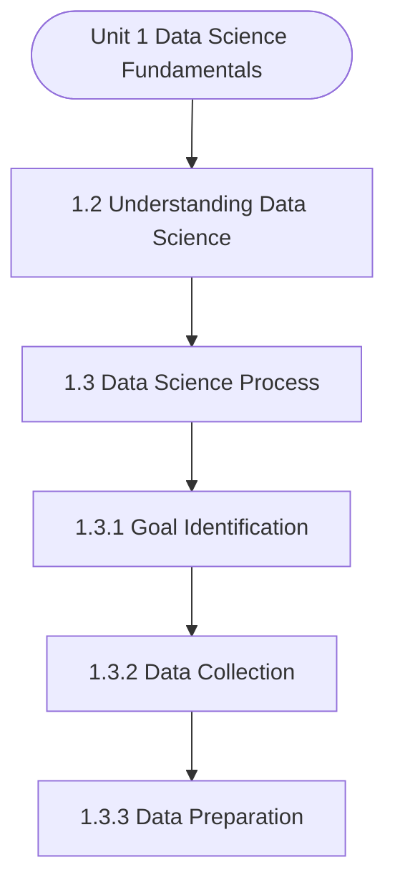

# MCS-062: Introduction to Data Science
## Unit 1: Data Science Fundamentals

> 📚 **Programme:** M.Sc. (Data Science and Analytics) | **Semester:** Semester 1  
> ⏱️ **Estimated Study Time:** ~92 mins | 📄 **Textbook Pages:** 49 Pages  
> 📥 **Original PDF:** [Download & View Textbook](../../../pdfs/Semester_1/MCS-062_Introduction_to_Data_Science/Unit-1_Data_Science_Fundamentals.pdf)

---

### 🎯 Executive Concept & Data Science Relevance
In modern data systems, **Data Science Fundamentals** forms a vital conceptual pillar. Descriptive statistics provide quantitative summaries of dataset properties. Measures of central tendency identify typical values, while measures of dispersion quantify data spread, uncertainty, and variability—critical for feature normalization and anomaly detection.

> [!NOTE]
> **Why this matters for your career:** Mastering data science fundamentals equips you with the foundational principles required to reason mathematically about high-dimensional datasets, evaluate algorithm performance, and avoid statistical pitfalls in production machine learning pipelines.

### 🗺️ Visual Knowledge Architecture
The following concept map illustrates the structural hierarchy and learning trajectory of this module:

### 📖 Core Definitions & Terminology Cards

> 📌 **Arithmetic Mean $\bar{x}$ or $\mu$**  
> - **Formal Definition:** The sum of all observations divided by the total number of observations: $\bar{x} = \frac{1}{n}\sum_{i=1}^n x_i$. Sensitive to extreme outliers.  
> - 💡 **Practical Intuition & Analogy:** *The center of mass or balance point of the distribution.*

> 📌 **Median**  
> - **Formal Definition:** The physical middle value separating the higher half from the lower half of an ordered dataset. Robust against outliers.  
> - 💡 **Practical Intuition & Analogy:** *The 50th percentile value where exactly half the data lies above and half below.*

> 📌 **Standard Deviation $\sigma$ or $s$**  
> - **Formal Definition:** The square root of variance, measuring average dispersion in original units: $s = \sqrt{\frac{1}{n-1}\sum (x_i - \bar{x})^2}$.  
> - 💡 **Practical Intuition & Analogy:** *The typical distance data points deviate from the mean.*

> 📌 **Coefficient of Variation ($CV$)**  
> - **Formal Definition:** Relative dispersion measure expressed as a percentage: $CV = \frac{\sigma}{\mu} \times 100\%$. Enables comparison across different measurement scales.  
> - 💡 **Practical Intuition & Analogy:** *Comparing stock volatility across assets priced at 10 USD vs 1,000 USD.*

### ⚡ Governing Mathematical Laws & Formula Cheatsheet
#### 🔹 Sample Variance Formula (Bessel's Correction)
$$
\begin{aligned} s^2 & = \frac{1}{n - 1} \sum_{i=1}^n (x_i - \bar{x})^2 \\ & = \frac{\sum x_i^2 - \frac{(\sum x_i)^2}{n}}{n - 1} \end{aligned}
$$
- **Explanation:** Using $n-1$ in the denominator corrects for downward sample bias, yielding an unbiased estimator of population variance $\sigma^2$.

#### 🔹 Interquartile Range (IQR) & Outlier Bounds
$$
\text{IQR} = Q_3 - Q_1, \quad \text{Outliers} < Q_1 - 1.5(\text{IQR}) \;\lor\; > Q_3 + 1.5(\text{IQR})
$$
- **Explanation:** Standard Tukey boxplot rule for identifying extreme data points robustly.

#### 🔹 Pearson's First Coefficient of Skewness
$$
Sk_1 = \frac{\text{Mean} - \text{Mode}}{\sigma} \quad \text{or} \quad Sk_2 = \frac{3(\text{Mean} - \text{Median})}{\sigma}
$$
- **Explanation:** Measures asymmetry: Positive skew means mean > median (right tail); negative skew means mean < median (left tail).

### 📌 Detailed Section-by-Section Study Breakdown
#### `1.2` Understanding Data Science
- **Core Concept:** Establishes theoretical foundations, axiomatic formulations, and properties of understanding data science.
- **Core Concept:** Analyzes standard algorithmic workflows and mathematical transformations relevant to data science fundamentals.
- **Core Concept:** Applies computational bounds and optimization guarantees across data processing workflows.
- **Data Science Application:** Provides foundational structures used directly in statistical modeling, query execution, and machine learning pipelines.

> [!TIP]
> **Exam & Interview Tip:** Be prepared to state the formal definition of understanding data science and derive its primary equations step-by-step.

#### `1.3` Data Science Process
- **Core Concept:** Data science is a systematic and iterative process.
- **Core Concept:** When new insights or issues arise, data scientists frequently iterate back to previous steps.
- **Core Concept:** Goal Identification This is the first stage in any data science project.
- **Data Science Application:** Provides foundational structures used directly in statistical modeling, query execution, and machine learning pipelines.

> [!TIP]
> **Exam & Interview Tip:** Be prepared to state the formal definition of data science process and derive its primary equations step-by-step.

#### `1.3.1` Goal Identification
- **Core Concept:** This is the first stage in any data science project.
- **Core Concept:** It aims to understand the business problem and determine the objectives of the investigation.
- **Core Concept:** This demands a grasp of the project's ‘what’ and ‘why’.
- **Data Science Application:** Provides foundational structures used directly in statistical modeling, query execution, and machine learning pipelines.

> [!TIP]
> **Exam & Interview Tip:** Be prepared to state the formal definition of goal identification and derive its primary equations step-by-step.

#### `1.3.2` Data Collection
- **Core Concept:** The next stage in your data science project is to gather the relevant data.
- **Core Concept:** Data scientists typically encounter two types of situations: - Adequate data exists inside the organisation.
- **Core Concept:** - No data is available within the organisation, or the existing data is insufficient.
- **Data Science Application:** Provides foundational structures used directly in statistical modeling, query execution, and machine learning pipelines.

> [!TIP]
> **Exam & Interview Tip:** Be prepared to state the formal definition of data collection and derive its primary equations step-by-step.

#### `1.3.3` Data Preparation
- **Core Concept:** This is the step where we prepare the retrieved data for exploratory analysis and modelling.
- **Core Concept:** It involves cleaning the data by removing errors in your data, combining data retrieved from different sources, and converting the data into a certain shape for all further analysis.
- **Core Concept:** Data cleaning ensures that errors, inconsistencies, and outliers are removed.
- **Data Science Application:** Provides foundational structures used directly in statistical modeling, query execution, and machine learning pipelines.

> [!TIP]
> **Exam & Interview Tip:** Be prepared to state the formal definition of data preparation and derive its primary equations step-by-step.

#### `1.3.4` Exploratory Data Analysis (EDA)
- **Core Concept:** It serves as a foundation for understanding the underlying structure of the data, identifying important variables, and guiding subsequent modeling efforts.
- **Core Concept:** EDA typically involves techniques such as distribution analysis, correlation assessment, and outlier detection, often using tools like histograms, box plots, scatter plots, and heatmaps.
- **Core Concept:** By providing insights into the quality and nature of the data, EDA helps data scientists make informed decisions about data preprocessing, feature selection, and modeling strategies.
- **Data Science Application:** Provides foundational structures used directly in statistical modeling, query execution, and machine learning pipelines.

> [!TIP]
> **Exam & Interview Tip:** Be prepared to state the formal definition of exploratory data analysis (eda) and derive its primary equations step-by-step.

### 💡 Interactive Self-Assessment Checkpoints
Test your comprehension before proceeding. Tap each question to reveal the comprehensive explanation:

<b>Checkpoint 1:</b> Why is sample variance divided by $n-1$ instead of $n$? <i>(Tap to reveal answer)</i>

> **Answer & Analysis:**  
> Dividing by $n-1$ applies **Bessel's correction**, which removes downward bias caused by using the sample mean $\bar{x}$ instead of the true population mean $\mu$.

<b>Checkpoint 2:</b> Which measure of central tendency is most robust to extreme outliers? <i>(Tap to reveal answer)</i>

> **Answer & Analysis:**  
> The **Median**, because it depends on positional rank rather than magnitude summation.

<b>Checkpoint 3:</b> In a right-skewed (positively skewed) distribution, what is the order of Mean, Median, and Mode? <i>(Tap to reveal answer)</i>

> **Answer & Analysis:**  
> $\text{Mode} < \text{Median} < \text{Mean}$.

<b>Checkpoint 4:</b> What are key functional blocks of data science. …………………………………………………………………………… …………………………………………………………………………… …………………………………………………………………………… <i>(Tap to reveal answer)</i>

> **Answer & Analysis:**  
> This question tests your conceptual mastery of Data Science Fundamentals. Review the governing formulas and section breakdowns above to formulate a complete, rigorous proof or derivation.

<b>Checkpoint 5:</b> What types of data are involved in critical care datasets and how are they categorized? <i>(Tap to reveal answer)</i>

> **Answer & Analysis:**  
> This question tests your conceptual mastery of Data Science Fundamentals. Review the governing formulas and section breakdowns above to formulate a complete, rigorous proof or derivation.

<b>Checkpoint 6:</b> How can data science support optimal mechanical ventilation and weaning in critical care? <i>(Tap to reveal answer)</i>

> **Answer & Analysis:**  
> This question tests your conceptual mastery of Data Science Fundamentals. Review the governing formulas and section breakdowns above to formulate a complete, rigorous proof or derivation.

### 🎯 Executive Module Wrap-Up
- **Central Idea:** Data Science Fundamentals provides essential mathematical and algorithmic tools directly utilized in Data Science.
- **Mathematical Rigor:** Formulas and laws must be memorized with attention to boundary conditions and assumptions.
- **Full Textbook Coverage:** For exhaustive multi-page derivations, proofs, and supplementary exercises, consult the [Authentic IGNOU Textbook](../../../pdfs/Semester_1/MCS-062_Introduction_to_Data_Science/Unit-1_Data_Science_Fundamentals.pdf).

---
### 🧭 Navigation & Syllabus Index
[📑 Course Index](README.md) | [Next: Unit 2 ➡](unit_02_Understanding_Data_and_Its_Type.md)
