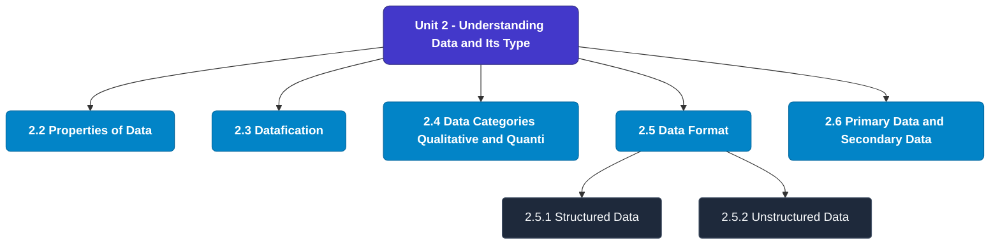

# MCS-062: Introduction to Data Science
## Unit 2: Understanding Data and Its Type

> 📚 **Programme:** M.Sc. (Data Science and Analytics) | **Semester:** Semester 1  
> ⏱️ **Estimated Study Time:** ~32 mins | 📄 **Textbook Pages:** 19 Pages  
> 📥 **Original PDF:** [Download & View Textbook](../../../pdfs/Semester_1/MCS-062_Introduction_to_Data_Science/Unit-2_Understanding_Data_and_Its_Type.pdf)

---

### 🎯 Executive Concept & Data Science Relevance
In modern data systems, **Understanding Data and Its Type** forms a vital conceptual pillar. Descriptive statistics provide quantitative summaries of dataset properties. Measures of central tendency identify typical values, while measures of dispersion quantify data spread, uncertainty, and variability—critical for feature normalization and anomaly detection.

> [!NOTE]
> **Why this matters for your career:** Mastering understanding data and its type equips you with the foundational principles required to reason mathematically about high-dimensional datasets, evaluate algorithm performance, and avoid statistical pitfalls in production machine learning pipelines.

### 🗺️ Visual Knowledge Architecture
The following concept map illustrates the structural hierarchy and learning trajectory of this module:

### 📖 Core Definitions & Terminology Cards
| Term | Formal Mathematical / Technical Definition | Intuitive Analogy / Concrete Example |
| :--- | :--- | :--- |
| **Arithmetic Mean $\bar{x}$ or $\mu$** | The sum of all observations divided by the total number of observations: $\bar{x} = \frac{1}{n}\sum_{i=1}^n x_i$. Sensitive to extreme outliers. | *The center of mass or balance point of the distribution.* |
| **Median** | The physical middle value separating the higher half from the lower half of an ordered dataset. Robust against outliers. | *The 50th percentile value where exactly half the data lies above and half below.* |
| **Standard Deviation $\sigma$ or $s$** | The square root of variance, measuring average dispersion in original units: $s = \sqrt{\frac{1}{n-1}\sum (x_i - \bar{x})^2}$. | *The typical distance data points deviate from the mean.* |
| **Coefficient of Variation ($CV$)** | Relative dispersion measure expressed as a percentage: $CV = \frac{\sigma}{\mu} \times 100\%$. Enables comparison across different measurement scales. | *Comparing stock volatility across assets priced at $10 vs $1,000.* |

### ⚡ Governing Mathematical Laws & Formula Cheatsheet
#### 🔹 Sample Variance Formula (Bessel's Correction)
$$s^2 = \frac{1}{n - 1} \sum_{i=1}^n (x_i - \bar{x})^2 = \frac{\sum x_i^2 - \frac{(\sum x_i)^2}{n}}{n - 1}$$
- **Explanation:** Using $n-1$ in the denominator corrects for downward sample bias, yielding an unbiased estimator of population variance $\sigma^2$.

#### 🔹 Interquartile Range (IQR) & Outlier Bounds
$$\text{IQR} = Q_3 - Q_1, \quad \text{Outliers} < Q_1 - 1.5(\text{IQR}) \;\lor\; > Q_3 + 1.5(\text{IQR})$$
- **Explanation:** Standard Tukey boxplot rule for identifying extreme data points robustly.

#### 🔹 Pearson's First Coefficient of Skewness
$$Sk_1 = \frac{\text{Mean} - \text{Mode}}{\sigma} \quad \text{or} \quad Sk_2 = \frac{3(\text{Mean} - \text{Median})}{\sigma}$$
- **Explanation:** Measures asymmetry: Positive skew means mean > median (right tail); negative skew means mean < median (left tail).

### 📌 Detailed Section-by-Section Study Breakdown
#### `2.2` Properties of Data
- **Core Concept:** Establishes rigorous theoretical formulations and computational bounds for properties of data.
- **Core Concept:** Applies standard algorithmic procedures and mathematical invariants relevant to understanding data and its type.
- **Core Concept:** Ensures deterministic performance guarantees across high-dimensional feature spaces.
- **Data Science Application:** Provides foundational structures used directly in statistical modeling, query execution, and machine learning pipelines.

> [!TIP]
> **Exam & Interview Tip:** Be prepared to state the formal definition of properties of data and derive its primary equations step-by-step.

#### `2.3` Datafication
- **Core Concept:** Establishes rigorous theoretical formulations and computational bounds for datafication.
- **Core Concept:** Applies standard algorithmic procedures and mathematical invariants relevant to understanding data and its type.
- **Core Concept:** Ensures deterministic performance guarantees across high-dimensional feature spaces.
- **Data Science Application:** Provides foundational structures used directly in statistical modeling, query execution, and machine learning pipelines.

> [!TIP]
> **Exam & Interview Tip:** Be prepared to state the formal definition of datafication and derive its primary equations step-by-step.

#### `2.4` Data Categories: Qualitative & Quantitative Data
- **Core Concept:** Data science sees every activity in the form of data.
- **Core Concept:** It essentially converts everything we do into data.
- **Core Concept:** This process of converting various aspects of our lives into data is called datafication.
- **Data Science Application:** Provides foundational structures used directly in statistical modeling, query execution, and machine learning pipelines.

> [!TIP]
> **Exam & Interview Tip:** Be prepared to state the formal definition of data categories: qualitative & quantitative data and derive its primary equations step-by-step.

#### `2.5` Data Format
- **Core Concept:** Two types of data are possible: quantitative and qualitative.
- **Core Concept:** It's important to know the difference between the two because they need different ways to collect and analyse data.
- **Core Concept:** Quantitative data implies the data which can be measured or counted and expressed in the form of numerical values.
- **Data Science Application:** Provides foundational structures used directly in statistical modeling, query execution, and machine learning pipelines.

> [!TIP]
> **Exam & Interview Tip:** Be prepared to state the formal definition of data format and derive its primary equations step-by-step.

#### `2.5.1` Structured Data
- **Core Concept:** Establishes rigorous theoretical formulations and computational bounds for structured data.
- **Core Concept:** Applies standard algorithmic procedures and mathematical invariants relevant to understanding data and its type.
- **Core Concept:** Ensures deterministic performance guarantees across high-dimensional feature spaces.
- **Data Science Application:** Provides foundational structures used directly in statistical modeling, query execution, and machine learning pipelines.

> [!TIP]
> **Exam & Interview Tip:** Be prepared to state the formal definition of structured data and derive its primary equations step-by-step.

#### `2.5.2` Unstructured Data
- **Core Concept:** Establishes rigorous theoretical formulations and computational bounds for unstructured data.
- **Core Concept:** Applies standard algorithmic procedures and mathematical invariants relevant to understanding data and its type.
- **Core Concept:** Ensures deterministic performance guarantees across high-dimensional feature spaces.
- **Data Science Application:** Provides foundational structures used directly in statistical modeling, query execution, and machine learning pipelines.

> [!TIP]
> **Exam & Interview Tip:** Be prepared to state the formal definition of unstructured data and derive its primary equations step-by-step.

### 💡 Interactive Self-Assessment Checkpoints
Test your comprehension before proceeding. Tap each question to reveal the comprehensive explanation:

<b>Checkpoint 1:</b> Why is sample variance divided by $n-1$ instead of $n$? <i>(Tap to reveal answer)</i>

> **Answer & Analysis:**  
> Dividing by $n-1$ applies **Bessel's correction**, which removes downward bias caused by using the sample mean $\bar{x}$ instead of the true population mean $\mu$.

<b>Checkpoint 2:</b> Which measure of central tendency is most robust to extreme outliers? <i>(Tap to reveal answer)</i>

> **Answer & Analysis:**  
> The **Median**, because it depends on positional rank rather than magnitude summation.

<b>Checkpoint 3:</b> In a right-skewed (positively skewed) distribution, what is the order of Mean, Median, and Mode? <i>(Tap to reveal answer)</i>

> **Answer & Analysis:**  
> $\text{Mode} < \text{Median} < \text{Mean}$.

<b>Checkpoint 4:</b> Define any 5 characteristics of good quality data. …………………………………………………………………………… …………………………………………………………………………… …………………………………………………………………………… …………………………………………………………………………… <i>(Tap to reveal answer)</i>

> **Answer & Analysis:**  
> This question tests your conceptual mastery of Understanding Data and Its Type. Review the governing formulas and section breakdowns above to formulate a complete, rigorous proof or derivation.

<b>Checkpoint 5:</b> Why is timely updating of information important for any organization? …………………………………………………………………………… …………………………………………………………………………… …………………………………………………………………………… …………………………………………………………………………… <i>(Tap to reveal answer)</i>

> **Answer & Analysis:**  
> This question tests your conceptual mastery of Understanding Data and Its Type. Review the governing formulas and section breakdowns above to formulate a complete, rigorous proof or derivation.

<b>Checkpoint 6:</b> Do datafication of your television watching activity or mobile phone usage activity. …………………………………………………………………………… …………………………………………………………………………… …………………………………………………………………………… <i>(Tap to reveal answer)</i>

> **Answer & Analysis:**  
> This question tests your conceptual mastery of Understanding Data and Its Type. Review the governing formulas and section breakdowns above to formulate a complete, rigorous proof or derivation.

### 🎯 Executive Module Wrap-Up
- **Central Idea:** Understanding Data and Its Type provides essential mathematical and algorithmic tools directly utilized in Data Science.
- **Mathematical Rigor:** Formulas and laws must be memorized with attention to boundary conditions and assumptions.
- **Full Textbook Coverage:** For exhaustive multi-page derivations, proofs, and supplementary exercises, consult the [Authentic IGNOU Textbook](../../../pdfs/Semester_1/MCS-062_Introduction_to_Data_Science/Unit-2_Understanding_Data_and_Its_Type.pdf).

---
### 🧭 Navigation & Syllabus Index
[⬅ Previous: Unit 1](unit_01_Data_Science_Fundamentals.md) | [📑 Course Index](README.md) | [Next: Unit 3 ➡](unit_03_Data_Acquisition_(DAQ)_Tools.md)
