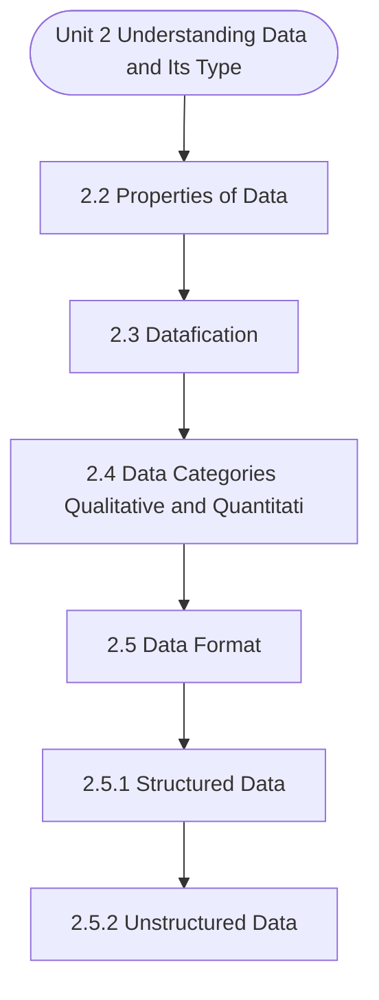

# MCS-062: Introduction to Data Science
## Unit 2: Understanding Data and Its Type

> 📚 **Programme:** M.Sc. (Data Science and Analytics) | **Semester:** Semester 1  
> ⏱️ **Estimated Study Time:** ~32 mins | 📄 **Textbook Pages:** 19 Pages  
> 📥 **Original PDF:** [Download & View Authentic Textbook](../../../pdfs/Semester_1/MCS-062_Introduction_to_Data_Science/Unit-2_Understanding_Data_and_Its_Type.pdf)

---

### 🎯 Executive Concept & Data Science Relevance
In modern data systems and advanced analytics, **Understanding Data and Its Type** forms a vital conceptual pillar. Descriptive statistics provide quantitative summaries of dataset properties. Measures of central tendency identify typical values, while measures of dispersion quantify data spread, uncertainty, and variability—critical for feature normalization and anomaly detection.

> [!NOTE]
> **Why this matters for your career:** Mastering understanding data and its type equips you with the foundational principles required to reason mathematically about high-dimensional datasets, evaluate algorithm performance, and avoid statistical pitfalls in production machine learning pipelines.

### 🗺️ Visual Knowledge Architecture
The following concept map illustrates the structural hierarchy and learning trajectory of this module:



### 📖 Core Definitions & Terminology Cards

> 📌 **Arithmetic Mean $\bar{x}$ or $\mu$**  
> - **Formal Definition:** The sum of all observations divided by the total number of observations: $\bar{x} = \frac{1}{n}\sum_{i=1}^n x_i$. Sensitive to extreme outliers.  
> - 💡 **Practical Intuition & Analogy:** *The center of mass or balance point of the distribution.*

> 📌 **Median**  
> - **Formal Definition:** The physical middle value separating the higher half from the lower half of an ordered dataset. Robust against outliers.  
> - 💡 **Practical Intuition & Analogy:** *The 50th percentile value where exactly half the data lies above and half below.*

> 📌 **Standard Deviation $\sigma$ or $s$**  
> - **Formal Definition:** The square root of variance, measuring average dispersion in original units: $s = \sqrt{\frac{1}{n-1}\sum (x_i - \bar{x})^2}$.  
> - 💡 **Practical Intuition & Analogy:** *The typical distance data points deviate from the mean.*

> 📌 **Coefficient of Variation ($CV$)**  
> - **Formal Definition:** Relative dispersion measure expressed as a percentage: $CV = \frac{\sigma}{\mu} \times 100\%$. Enables comparison across different measurement scales.  
> - 💡 **Practical Intuition & Analogy:** *Comparing stock volatility across assets priced at 10 USD vs 1,000 USD.*

### ⚡ Governing Mathematical Laws & Formula Cheatsheet
#### 🔹 Sample Variance Formula (Bessel's Correction)
$$
\begin{aligned} s^2 & = \frac{1}{n - 1} \sum_{i=1}^n (x_i - \bar{x})^2 \\ & = \frac{\sum x_i^2 - \frac{(\sum x_i)^2}{n}}{n - 1} \end{aligned}
$$
- **Explanation:** Using $n-1$ in the denominator corrects for downward sample bias, yielding an unbiased estimator of population variance $\sigma^2$.

#### 🔹 Interquartile Range (IQR) & Outlier Bounds
$$
\text{IQR} = Q_3 - Q_1, \quad \text{Outliers} < Q_1 - 1.5(\text{IQR}) \;\lor\; > Q_3 + 1.5(\text{IQR})
$$
- **Explanation:** Standard Tukey boxplot rule for identifying extreme data points robustly.

#### 🔹 Pearson's First Coefficient of Skewness
$$
Sk_1 = \frac{\text{Mean} - \text{Mode}}{\sigma} \quad \text{or} \quad Sk_2 = \frac{3(\text{Mean} - \text{Median})}{\sigma}
$$
- **Explanation:** Measures asymmetry: Positive skew means mean > median (right tail); negative skew means mean < median (left tail).

### ⚖️ Axiomatic Properties & Governing Laws
The mathematical formulations of this module are anchored by foundational algebraic and structural laws:

- **Variance Scaling Rule:** $\text{Var}(aX + b) = a^2 \text{Var}(X)$
- **Standard Deviation Scaling:** $\sigma(aX + b) = \vert a\vert \sigma(X)$
- **Empirical Rule (Normal Distribution):** 68% within $\mu \pm 1\sigma$, 95% within $\mu \pm 2\sigma$, 99.7% within $\mu \pm 3\sigma$

### 📌 Comprehensive Section-by-Section Study Breakdown
#### `2.2` Properties of Data

##### 📘 Theoretical Principles & Pedagogical Exposition
In modern data science engineering, **Properties of Data** forms a vital foundational building block. Within **Understanding Data and Its Type**, this section establishes analytical rigor, reproducible data processing methodologies, and computational guarantees required for production pipelines.

##### ⚙️ Mathematical & Algorithmic Mechanics
- **Core Mechanism:** Establishes analytical principles and computational workflows for understanding data and its type.
- **Boundary Conditions:** Missing data values, extreme outliers, and non-standard data types.

##### 📊 Practical Data Science & Production Relevance
- **Production Workflow:** End-to-end data science processing stacks (Pandas, Scikit-learn, PyTorch).
- **Real-World Pitfall:** Failing to validate inputs before feeding data into production analytics pipelines.

> [!TIP]
> **Exam & Technical Interview Insight:** Define key concepts in properties of data and articulate practical applications in real-world scenarios.

#### `2.3` Datafication

##### 📘 Theoretical Principles & Pedagogical Exposition
Data science sees every activity in the form of data. It essentially converts everything we do into data. This process of converting various aspects of our lives into data is called datafication. Datafication is then used to draw insights, make predictions, and improve various aspects of life and business.

Following table will further describe the datafication concept with the help of two examples. Use case 1 Use case 2 Real world activity You walk daily to keep yourself healthy A machine is producing jobs in a manufacturing plant Datafication · Number of Steps · Duration of walk · Heart rate record · Footwear used · Track type and condition · Person’s age · Person’s medical history · Start and stop time · Jobs characteristics · Production stop reasons · Operators’ details · Energy consumption · Quality of the jobs produced · Process parameters · Machine condition parameters Potential benefits of datafication · understand your health and fitness levels · alert you to potential health issues · better, more personalized care · Predict potential failure · Optimize process parameters · Reduce energy consumption · Operator assessment and allocation · Reduce defective products ☞


##### ⚙️ Mathematical & Algorithmic Mechanics
- **Core Mechanism:** Establishes analytical principles and computational workflows for understanding data and its type.
- **Boundary Conditions:** Missing data values, extreme outliers, and non-standard data types.

##### 📊 Practical Data Science & Production Relevance
- **Production Workflow:** End-to-end data science processing stacks (Pandas, Scikit-learn, PyTorch).
- **Real-World Pitfall:** Failing to validate inputs before feeding data into production analytics pipelines.

> [!TIP]
> **Exam & Technical Interview Insight:** Define key concepts in datafication and articulate practical applications in real-world scenarios.

#### `2.4` Data Categories: Qualitative & Quantitative Data

##### 📘 Theoretical Principles & Pedagogical Exposition
DATAFICATION Data science sees every activity in the form of data. It essentially converts everything we do into data. This process of converting various aspects of our lives into data is called datafication. Datafication is then used to draw insights, make predictions, and improve various aspects of life and business.

Following table will further describe the datafication concept with the help of two examples. Use case 1 Use case 2 Real world activity You walk daily to keep yourself healthy A machine is producing jobs in a manufacturing plant Datafication · Number of Steps · Duration of walk · Heart rate record · Footwear used · Track type and condition · Person’s age · Person’s medical history · Start and stop time · Jobs characteristics · Production stop reasons · Operators’ details · Energy consumption · Quality of the jobs produced · Process parameters · Machine condition parameters Potential benefits of datafication · understand your health and fitness levels · alert you to potential health issues · better, more personalized care · Predict potential failure · Optimize process parameters · Reduce energy consumption · Operator assessment and allocation · Reduce defective products ☞


##### ⚙️ Mathematical & Algorithmic Mechanics
- **Core Mechanism:** Establishes analytical principles and computational workflows for understanding data and its type.
- **Boundary Conditions:** Missing data values, extreme outliers, and non-standard data types.

##### 📊 Practical Data Science & Production Relevance
- **Production Workflow:** End-to-end data science processing stacks (Pandas, Scikit-learn, PyTorch).
- **Real-World Pitfall:** Failing to validate inputs before feeding data into production analytics pipelines.

> [!TIP]
> **Exam & Technical Interview Insight:** Define key concepts in data categories: qualitative & quantitative data and articulate practical applications in real-world scenarios.

#### `2.5` Data Format

##### 📘 Theoretical Principles & Pedagogical Exposition
DATA CATEGORIES Datafication provides data. Two types of data are possible: quantitative and qualitative. It's important to know the difference between the two because they need different ways to collect and analyse data. Quantitative data implies the data which can be measured or counted and expressed in the form of numerical values.

Accordingly, it gives us Introduction to Data Science-1 information about “how many,” “how much,” or “how often”. For example, following information can be captured in the form of quantitative data. · How many students opt for data science courses in the university in the last 5 years?

· How much weight loss did a person achieve in the last month? · How often do you buy products from online shopping apps? Qualitative data is not quantifiable or countable. It is characterised by descriptive language rather than numerical figures. Consequently, it provides answers to "Why?" or "How?" questions.


##### ⚙️ Mathematical & Algorithmic Mechanics
- **Core Mechanism:** Establishes analytical principles and computational workflows for understanding data and its type.
- **Boundary Conditions:** Missing data values, extreme outliers, and non-standard data types.

##### 📊 Practical Data Science & Production Relevance
- **Production Workflow:** End-to-end data science processing stacks (Pandas, Scikit-learn, PyTorch).
- **Real-World Pitfall:** Failing to validate inputs before feeding data into production analytics pipelines.

> [!TIP]
> **Exam & Technical Interview Insight:** Define key concepts in data format and articulate practical applications in real-world scenarios.

#### `2.5.1` Structured Data

##### 📘 Theoretical Principles & Pedagogical Exposition
Candidate, Age, Country, Education, Institute, Years of Experience, Manoj, 34, India, PhD, IIT, 1 Suresh, 37, India, PhD, NIT, 0 Ramesh, 33, India, MTech, IIT, 5 Another similar way to store the structured data is to use the Tab-Separated Values (TSV) file. In the TSV file we use tab to separate the entry instead of comma.

Understanding Data and its Type Semi-Structured Vs Structured data: Semi-structured and structured data differs in two key aspects: schema and data structure. The first distinction is schema. Unlike structured data, which requires a predefined and fixed schema, semi-structured data does not rely on a prior schema definition.

This lack of rigidity makes semi-structured data more adaptable, allowing it to evolve as new attributes are added over time. The second difference is in data structure. Semi-structured data uses a hierarchical structure that can include nested information, whereas structured data is represented in a flat, tabular format.


##### ⚙️ Mathematical & Algorithmic Mechanics
- **Core Mechanism:** Establishes analytical principles and computational workflows for understanding data and its type.
- **Boundary Conditions:** Missing data values, extreme outliers, and non-standard data types.

##### 📊 Practical Data Science & Production Relevance
- **Production Workflow:** End-to-end data science processing stacks (Pandas, Scikit-learn, PyTorch).
- **Real-World Pitfall:** Failing to validate inputs before feeding data into production analytics pipelines.

> [!TIP]
> **Exam & Technical Interview Insight:** Define key concepts in structured data and articulate practical applications in real-world scenarios.

#### `2.5.2` Unstructured Data

##### 📘 Theoretical Principles & Pedagogical Exposition
model and is not stored in a structured manner, which can be easily read by the machines. Unlike structured data, which is stored in relational databases with rows and columns, unstructured data is typically in formats like digital text, Graphics/images, Animation/videos, speeches/audio, media posts, emails, and sensor-driven data.

Sometimes, numerical or textual data can be unstructured because modeling it as a table is inefficient. Imagine a temperature sensor in a factory: it continuously outputs temperature readings at various intervals, it would be considered unstructured data unless specifically formatted into a structured database with timestamp and temperature values as separate columns.

Typically, unstructured data requires advanced tools from the field of (DL) Deep Learning/(ML) Machine Learning which specifically includes NLP i.e. Natural Language Processing (NLP) to extract insights. Examples of unstructured data · Text: Emails, text messages, · Images: Photos in JPEG, GIF, or PNG formats · Audio: Audio files in MP3, WAV, or FLAC formats · Video: Video files in MP4, AVI, or MOV formats · Healthcare data: MRIs, x-rays, CT scans, doctor's notes, · Surveillance data: Video monitoring data · Weather data: Weather data · Internet of Things (IoT) data: sensor data from devices · Social media posts: Posts on social media platforms Understanding Data and its Type


##### ⚙️ Mathematical & Algorithmic Mechanics
- **Core Mechanism:** Establishes analytical principles and computational workflows for understanding data and its type.
- **Boundary Conditions:** Missing data values, extreme outliers, and non-standard data types.

##### 📊 Practical Data Science & Production Relevance
- **Production Workflow:** End-to-end data science processing stacks (Pandas, Scikit-learn, PyTorch).
- **Real-World Pitfall:** Failing to validate inputs before feeding data into production analytics pipelines.

> [!TIP]
> **Exam & Technical Interview Insight:** Define key concepts in unstructured data and articulate practical applications in real-world scenarios.

#### `2.5.3` Semi-structured Data

##### 📘 Theoretical Principles & Pedagogical Exposition
to unstructured data but not as straightforward as structured data. · JSON and XML files · NoSQL databases (e.g., MongoDB) · Emails with headers (subject, sender, etc.) · Sensor data with labels · HTML code · XML documents HTML (HyperText Markup Language): On the web, HTML is the standard markup language used to produce and organise content.

It offers the organisation and layout of text, images, links, and other material using a system of components and tags, therefore defining the framework for web pages. It organizes content using tags like <header>, <p>, and <div>. It connects pages through links using the <a> tag.

It embeds images, videos, and audio files with tags like , <video>, and <audio>. There are various tags for the formatting and presentation of data on any web page, an example of THML code is given below. <!DOCTYPE html> <html> <head> <title>Welcome to Our Website</title> </head> <body> <h1>Hello, Earth!


##### ⚙️ Mathematical & Algorithmic Mechanics
- **Core Mechanism:** Establishes analytical principles and computational workflows for understanding data and its type.
- **Boundary Conditions:** Missing data values, extreme outliers, and non-standard data types.

##### 📊 Practical Data Science & Production Relevance
- **Production Workflow:** End-to-end data science processing stacks (Pandas, Scikit-learn, PyTorch).
- **Real-World Pitfall:** Failing to validate inputs before feeding data into production analytics pipelines.

> [!TIP]
> **Exam & Technical Interview Insight:** Define key concepts in semi-structured data and articulate practical applications in real-world scenarios.

#### `2.6` Primary Data & Secondary Data

##### 📘 Theoretical Principles & Pedagogical Exposition
DATA FORMAT The data format defines the structure of data within a system be it database/filebase system, imparting relevance to the processed data i.e. Sources of the data may exist in various formats. The following three formats are often utilized. · Structured/Formatted data · Unstructured/Unformatted data · Semi-structured /Semi-formatted data


##### ⚙️ Mathematical & Algorithmic Mechanics
- **Core Mechanism:** Establishes analytical principles and computational workflows for understanding data and its type.
- **Boundary Conditions:** Missing data values, extreme outliers, and non-standard data types.

##### 📊 Practical Data Science & Production Relevance
- **Production Workflow:** End-to-end data science processing stacks (Pandas, Scikit-learn, PyTorch).
- **Real-World Pitfall:** Failing to validate inputs before feeding data into production analytics pipelines.

> [!TIP]
> **Exam & Technical Interview Insight:** Define key concepts in primary data & secondary data and articulate practical applications in real-world scenarios.

### 📐 Step-by-Step Solved Mathematical Examples
To solidify your theoretical understanding, work through these fully solved, step-by-step mathematical problems:

#### 🧮 Example 1: Sample Variance and Standard Deviation Computation
> **Problem Statement:**  
> Given sample observations: $X = \lbrace 4, 8, 6, 5, 7 \rbrace$. Compute sample mean $\bar{x}$, sample variance $s^2$, and standard deviation $s$ step-by-step.

**Detailed Step-by-Step Solution:**

1. **Mean:** $\bar{x} = \frac{4 + 8 + 6 + 5 + 7}{5} = \frac{30}{5} = 6$.

2. **Squared deviations:**
- $(4 - 6)^2 = (-2)^2 = 4$
- $(8 - 6)^2 = 2^2 = 4$
- $(6 - 6)^2 = 0^2 = 0$
- $(5 - 6)^2 = (-1)^2 = 1$
- $(7 - 6)^2 = 1^2 = 1$
Sum of squared deviations $= 4 + 4 + 0 + 1 + 1 = 10$.

3. **Sample Variance with Bessel's Correction ($n-1 = 4$):**

$$
s^2 = \frac{10}{5 - 1} = \frac{10}{4} = 2.5
$$


4. **Standard Deviation:** $s = \sqrt{2.5} \approx 1.581$.

#### 🧮 Example 2: Tukey's IQR Outlier Detection Rule
> **Problem Statement:**  
> A customer spend dataset has $Q_1 = 30$ and $Q_3 = 70$. Determine whether transactions of $135$ and $25$ are classified as outliers.

**Detailed Step-by-Step Solution:**

1. **IQR:** $\text{IQR} = Q_3 - Q_1 = 70 - 30 = 40$.
2. **Lower Bound:** $Q_1 - 1.5(\text{IQR}) = 30 - 1.5(40) = 30 - 60 = -30$.
3. **Upper Bound:** $Q_3 + 1.5(\text{IQR}) = 70 + 1.5(40) = 70 + 60 = 130$.

Conclusion:
- Spend of 135 exceeds Upper Bound ($135 > 130$): **Classified as Outlier**.
- Spend of 25 is within $[-30, 130]$: **Normal observation**.

### 💻 Practical Data Science Implementation (Python)
Theory translates directly into production algorithms. Below is a self-contained, commented Python implementation illustrating the core operations of this unit:

```python
import numpy as np
import pandas as pd

# Statistical profiling on production dataset
data = np.array([12, 15, 18, 22, 25, 29, 34, 45, 95])

mean_val = np.mean(data)
median_val = np.median(data)
std_val = np.std(data, ddof=1) # Bessel's correction

q1, q3 = np.percentile(data, [25, 75])
iqr = q3 - q1
outlier_upper = q3 + 1.5 * iqr

outliers = data[data > outlier_upper]

print(f"Mean: {mean_val:.2f} | Median: {median_val:.2f} | Std: {std_val:.2f}")
print(f"IQR: {iqr:.2f} | Upper Bound: {outlier_upper:.2f}")
print(f"Detected Outliers: {outliers}")
```

### 💡 Interactive Self-Assessment Checkpoints
Test your comprehension before proceeding. Tap each question to reveal the comprehensive explanation:

<details>
<summary><b>Checkpoint 1:</b> Define any 5 characteristics of good quality data. …………………………………………………………………………… …………………………………………………………………………… …………………………………………………………………………… …………………………………………………………………………… <i>(Tap to reveal answer)</i></summary>

> **Answer & Analysis:**  
> **Detailed Analytical Solution:**
> 
> 1. **Core Principle:** Identify the governing theorem or definition for Understanding Data and Its Type.
> 2. **Step-by-Step Derivation:** Verify all preconditions and compute intermediate steps methodically.
> 3. **Conclusion:** State the final mathematical proof or calculation clearly, validating boundary edge cases.
</details>

<details>
<summary><b>Checkpoint 2:</b> Why is timely updating of information important for any organization? …………………………………………………………………………… …………………………………………………………………………… …………………………………………………………………………… …………………………………………………………………………… 61 Understanding Data and its Type <i>(Tap to reveal answer)</i></summary>

> **Answer & Analysis:**  
> **Detailed Analytical Solution:**
> 
> 1. **Core Principle:** Identify the governing theorem or definition for Understanding Data and Its Type.
> 2. **Step-by-Step Derivation:** Verify all preconditions and compute intermediate steps methodically.
> 3. **Conclusion:** State the final mathematical proof or calculation clearly, validating boundary edge cases.
</details>

<details>
<summary><b>Checkpoint 3:</b> Do datafication of your television watching activity or mobile phone usage activity. …………………………………………………………………………… …………………………………………………………………………… …………………………………………………………………………… <i>(Tap to reveal answer)</i></summary>

> **Answer & Analysis:**  
> **Detailed Analytical Solution:**
> 
> 1. **Core Principle:** Identify the governing theorem or definition for Understanding Data and Its Type.
> 2. **Step-by-Step Derivation:** Verify all preconditions and compute intermediate steps methodically.
> 3. **Conclusion:** State the final mathematical proof or calculation clearly, validating boundary edge cases.
</details>

<details>
<summary><b>Checkpoint 4:</b> Go for an evening walk and record the number of steps, start and end time of walk. Comment if this information is qualitative or quantitative. …………………………………………………………………………… …………………………………………………………………………… …………………………………………………………………………… …………………………………………………………………………… <i>(Tap to reveal answer)</i></summary>

> **Answer & Analysis:**  
> **Detailed Analytical Solution:**
> 
> 1. **Core Principle:** Identify the governing theorem or definition for Understanding Data and Its Type.
> 2. **Step-by-Step Derivation:** Verify all preconditions and compute intermediate steps methodically.
> 3. **Conclusion:** State the final mathematical proof or calculation clearly, validating boundary edge cases.
</details>

<details>
<summary><b>Checkpoint 5:</b> Why is sample variance divided by $n-1$ instead of $n$? <i>(Tap to reveal answer)</i></summary>

> **Answer & Analysis:**  
> Dividing by $n-1$ applies **Bessel's correction**, which removes downward bias caused by using the sample mean $\bar{x}$ instead of the true population mean $\mu$.
</details>

<details>
<summary><b>Checkpoint 6:</b> Which measure of central tendency is most robust to extreme outliers? <i>(Tap to reveal answer)</i></summary>

> **Answer & Analysis:**  
> The **Median**, because it depends on positional rank rather than magnitude summation.
</details>

### 🎯 Executive Module Wrap-Up
- **Central Idea:** Understanding Data and Its Type provides essential mathematical and algorithmic tools directly utilized in Data Science.
- **Mathematical Rigor:** Formulas and laws must be memorized with attention to boundary conditions and assumptions.
- **Full Textbook Coverage:** For exhaustive multi-page derivations, proofs, and supplementary exercises, consult the [Authentic IGNOU Textbook](../../../pdfs/Semester_1/MCS-062_Introduction_to_Data_Science/Unit-2_Understanding_Data_and_Its_Type.pdf).

---
### 🧭 Navigation & Syllabus Index
[⬅ Previous: Unit 1](unit_01_Data_Science_Fundamentals.md) | [📑 Course Index](README.md) | [Next: Unit 3 ➡](unit_03_Data_Acquisition_(DAQ)_Tools.md)
