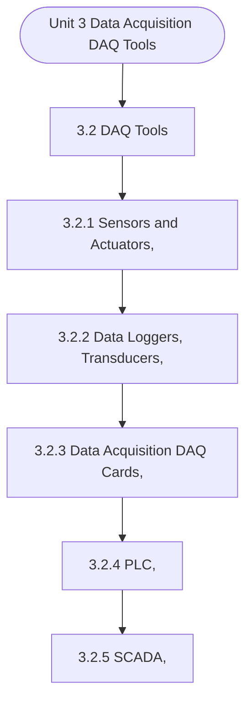

# MCS-062: Introduction to Data Science
## Unit 3: Data Acquisition (DAQ) Tools

> 📚 **Programme:** M.Sc. (Data Science and Analytics) | **Semester:** Semester 1  
> ⏱️ **Estimated Study Time:** ~102 mins | 📄 **Textbook Pages:** 49 Pages  
> 📥 **Original PDF:** [Download & View Authentic Textbook](../../../pdfs/Semester_1/MCS-062_Introduction_to_Data_Science/Unit-3_Data_Acquisition_(DAQ)_Tools.pdf)

---

### 🎯 Executive Concept & Data Science Relevance
In modern data systems and advanced analytics, **Data Acquisition (DAQ) Tools** forms a vital conceptual pillar. Descriptive statistics provide quantitative summaries of dataset properties. Measures of central tendency identify typical values, while measures of dispersion quantify data spread, uncertainty, and variability—critical for feature normalization and anomaly detection.

> [!NOTE]
> **Why this matters for your career:** Mastering data acquisition (daq) tools equips you with the foundational principles required to reason mathematically about high-dimensional datasets, evaluate algorithm performance, and avoid statistical pitfalls in production machine learning pipelines.

### 🗺️ Visual Knowledge Architecture
The following concept map illustrates the structural hierarchy and learning trajectory of this module:



### 📖 Core Definitions & Terminology Cards

> 📌 **Arithmetic Mean $\bar{x}$ or $\mu$**  
> - **Formal Definition:** The sum of all observations divided by the total number of observations: $\bar{x} = \frac{1}{n}\sum_{i=1}^n x_i$. Sensitive to extreme outliers.  
> - 💡 **Practical Intuition & Analogy:** *The center of mass or balance point of the distribution.*

> 📌 **Median**  
> - **Formal Definition:** The physical middle value separating the higher half from the lower half of an ordered dataset. Robust against outliers.  
> - 💡 **Practical Intuition & Analogy:** *The 50th percentile value where exactly half the data lies above and half below.*

> 📌 **Standard Deviation $\sigma$ or $s$**  
> - **Formal Definition:** The square root of variance, measuring average dispersion in original units: $s = \sqrt{\frac{1}{n-1}\sum (x_i - \bar{x})^2}$.  
> - 💡 **Practical Intuition & Analogy:** *The typical distance data points deviate from the mean.*

> 📌 **Coefficient of Variation ($CV$)**  
> - **Formal Definition:** Relative dispersion measure expressed as a percentage: $CV = \frac{\sigma}{\mu} \times 100\%$. Enables comparison across different measurement scales.  
> - 💡 **Practical Intuition & Analogy:** *Comparing stock volatility across assets priced at 10 USD vs 1,000 USD.*

### ⚡ Governing Mathematical Laws & Formula Cheatsheet
#### 🔹 Sample Variance Formula (Bessel's Correction)
$$
\begin{aligned} s^2 & = \frac{1}{n - 1} \sum_{i=1}^n (x_i - \bar{x})^2 \\ & = \frac{\sum x_i^2 - \frac{(\sum x_i)^2}{n}}{n - 1} \end{aligned}
$$
- **Explanation:** Using $n-1$ in the denominator corrects for downward sample bias, yielding an unbiased estimator of population variance $\sigma^2$.

#### 🔹 Interquartile Range (IQR) & Outlier Bounds
$$
\text{IQR} = Q_3 - Q_1, \quad \text{Outliers} < Q_1 - 1.5(\text{IQR}) \;\lor\; > Q_3 + 1.5(\text{IQR})
$$
- **Explanation:** Standard Tukey boxplot rule for identifying extreme data points robustly.

#### 🔹 Pearson's First Coefficient of Skewness
$$
Sk_1 = \frac{\text{Mean} - \text{Mode}}{\sigma} \quad \text{or} \quad Sk_2 = \frac{3(\text{Mean} - \text{Median})}{\sigma}
$$
- **Explanation:** Measures asymmetry: Positive skew means mean > median (right tail); negative skew means mean < median (left tail).

### ⚖️ Axiomatic Properties & Governing Laws
The mathematical formulations of this module are anchored by foundational algebraic and structural laws:

- **Variance Scaling Rule:** $\text{Var}(aX + b) = a^2 \text{Var}(X)$
- **Standard Deviation Scaling:** $\sigma(aX + b) = \vert a\vert \sigma(X)$
- **Empirical Rule (Normal Distribution):** 68% within $\mu \pm 1\sigma$, 95% within $\mu \pm 2\sigma$, 99.7% within $\mu \pm 3\sigma$

### 📌 Comprehensive Section-by-Section Study Breakdown
#### `3.2` DAQ Tools

##### 📘 Theoretical Principles & Pedagogical Exposition
DAQ TOOLS Data Acquisition (DAQ) refers to the process of collecting, measuring, and converting physical or electrical signals from real-world sources—such as temperature, pressure, sound, or voltage—into digital data that can be analyzed, monitored, or used for control systems. The DAQ tools are essential in this process and typically consist of a combination of hardware and software components, these tools are essential in providing the raw data needed for data science applications across various domains.

By leveraging these tools, data scientists can collect high-quality data from diverse sources, ranging from sensors and industrial systems to the web and satellite imagery. This data is then analyzed to uncover patterns, make predictions, optimize processes, and drive decision-making in fields like healthcare, energy, manufacturing, agriculture, and more.

The core elements of a DAQ system includes sensors, actuators, data loggers, transducers, DAQ cards, PLCs, SCADA systems, web scraping etc. wherein the remote sensing is critical for collecting and processing data from the physical world and from web-based sources. These tools enable real-time, large-scale, and diverse data collection for a variety of applications.


##### ⚙️ Mathematical & Algorithmic Mechanics
- **Core Mechanism:** Establishes analytical principles and computational workflows for data acquisition (daq) tools.
- **Boundary Conditions:** Missing data values, extreme outliers, and non-standard data types.

##### 📊 Practical Data Science & Production Relevance
- **Production Workflow:** End-to-end data science processing stacks (Pandas, Scikit-learn, PyTorch).
- **Real-World Pitfall:** Failing to validate inputs before feeding data into production analytics pipelines.

> [!TIP]
> **Exam & Technical Interview Insight:** Define key concepts in daq tools and articulate practical applications in real-world scenarios.

#### `3.2.1` Sensors and Actuators,

##### 📘 Theoretical Principles & Pedagogical Exposition
Above, we had already discussed about sensors and actuators in brief, and it is to reiterate that the Sensors and actuators are fundamental components in modern data acquisition systems and play a significant role in collecting, processing, and acting on data in the field of data science.

These devices bridge the gap between the physical world and digital systems by gathering data about physical environments and influencing the state of those environments based on computational insights. The data collected via sensors and the actions taken through actuators are central to a wide range of applications, from industrial automation to healthcare monitoring, smart cities, environmental monitoring, and more.

In this section we are going to discuss the role of sensors and actuators in data science. We learned that the Sensors are devices that detect and measure physical properties from the environment, such as temperature, pressure, humidity, motion, light, and even chemical concentrations.


##### ⚙️ Mathematical & Algorithmic Mechanics
- **Core Mechanism:** Establishes analytical principles and computational workflows for data acquisition (daq) tools.
- **Boundary Conditions:** Missing data values, extreme outliers, and non-standard data types.

##### 📊 Practical Data Science & Production Relevance
- **Production Workflow:** End-to-end data science processing stacks (Pandas, Scikit-learn, PyTorch).
- **Real-World Pitfall:** Failing to validate inputs before feeding data into production analytics pipelines.

> [!TIP]
> **Exam & Technical Interview Insight:** Define key concepts in sensors and actuators, and articulate practical applications in real-world scenarios.

#### `3.2.2` Data Loggers, Transducers,

##### 📘 Theoretical Principles & Pedagogical Exposition
In the realm of data science, data loggers and transducers are essential tools for data acquisition, enabling accurate and continuous collection of real- world data, which can then be analyzed for insights, predictions, and optimizations. These devices are integral in industries ranging from environmental monitoring and healthcare to industrial automation and scientific research.

In order to Understand their roles in data science we need to properly understand What Are Data Loggers? A data logger is an electronic device designed to collect, store, and often transmit data over time. Data loggers are typically used for monitoring environmental conditions, machinery, or systems where continuous or periodic measurements are needed.

They can be configured to record data from multiple sensors or instruments and are often employed in scenarios where real-time monitoring is critical. Data loggers come with various sensors for different types of measurements (e.g., temperature, humidity, voltage, pressure) and can either store data internally (for later retrieval) or send data to cloud platforms for real-time analysis.


##### ⚙️ Mathematical & Algorithmic Mechanics
- **Core Mechanism:** Establishes analytical principles and computational workflows for data acquisition (daq) tools.
- **Boundary Conditions:** Missing data values, extreme outliers, and non-standard data types.

##### 📊 Practical Data Science & Production Relevance
- **Production Workflow:** End-to-end data science processing stacks (Pandas, Scikit-learn, PyTorch).
- **Real-World Pitfall:** Failing to validate inputs before feeding data into production analytics pipelines.

> [!TIP]
> **Exam & Technical Interview Insight:** Define key concepts in data loggers, transducers, and articulate practical applications in real-world scenarios.

#### `3.2.3` Data Acquisition (DAQ) Cards,

##### 📘 Theoretical Principles & Pedagogical Exposition
Data Acquisition (DAQ) cards are vital components in modern data science applications that require the acquisition, processing, and analysis of data from physical systems. These cards interface with sensors, transducers, and other measuring devices to collect analog and digital signals, convert them into digital data, and then send this data to a computer or processing unit for analysis.

The role of DAQ cards is crucial in industries such as manufacturing, scientific research, healthcare, environmental monitoring, and automation. We can understand that a Data Acquisition (DAQ) card is an electronic device that is inserted into a computer to provide the interface between the physical world (sensors, instruments, etc.) and the digital world (computer, software, algorithms).

These cards are typically used to convert physical measurements like temperature, pressure, vibration, or voltage into digital signals that can be processed, analyzed, and stored by the computer. DAQ cards are connected to various measuring devices such as sensors, amplifiers, and transducers, and they are responsible of two primary functions: ● Signal Conditioning: This involves the preparation and conditioning of the signals for processing, the DAQ cards often include amplifiers, filters, and analog-to-digital converters (ADCs) to prepare and condition signals for processing.


##### ⚙️ Mathematical & Algorithmic Mechanics
- **Core Mechanism:** Establishes analytical principles and computational workflows for data acquisition (daq) tools.
- **Boundary Conditions:** Missing data values, extreme outliers, and non-standard data types.

##### 📊 Practical Data Science & Production Relevance
- **Production Workflow:** End-to-end data science processing stacks (Pandas, Scikit-learn, PyTorch).
- **Real-World Pitfall:** Failing to validate inputs before feeding data into production analytics pipelines.

> [!TIP]
> **Exam & Technical Interview Insight:** Define key concepts in data acquisition (daq) cards, and articulate practical applications in real-world scenarios.

#### `3.2.4` PLC,

##### 📘 Theoretical Principles & Pedagogical Exposition
A Programmable Logic Controller (PLC) is a critical piece of industrial automation technology used for controlling machinery, processes, and systems in environments such as manufacturing, chemical processing, energy management, and transportation. PLCs are designed to perform automated control tasks, monitoring inputs and generating outputs based on pre- programmed logic.

In the context of data science, PLCs play a significant role in data acquisition, process monitoring, predictive maintenance, optimization, and real-time decision-making. While PLCs are traditionally seen as tools for industrial control, their role in data science is expanding, especially in industries embracing Industry 4.0 and Data Acquisition (DAQ): Tools the Industrial Internet of Things (IIoT).

The discussion made in this section explores how PLCs are used to collect, process, and provide data, enabling advanced analytics, machine learning, and automation improvements in data science. In order to understand how PLCs are used to collect, process, and provide data, we need to firstly understand “What a Programmable Logic Controller (PLC) is?”.


##### ⚙️ Mathematical & Algorithmic Mechanics
- **Core Mechanism:** Establishes analytical principles and computational workflows for data acquisition (daq) tools.
- **Boundary Conditions:** Missing data values, extreme outliers, and non-standard data types.

##### 📊 Practical Data Science & Production Relevance
- **Production Workflow:** End-to-end data science processing stacks (Pandas, Scikit-learn, PyTorch).
- **Real-World Pitfall:** Failing to validate inputs before feeding data into production analytics pipelines.

> [!TIP]
> **Exam & Technical Interview Insight:** Define key concepts in plc, and articulate practical applications in real-world scenarios.

#### `3.2.5` SCADA,

##### 📘 Theoretical Principles & Pedagogical Exposition
Supervisory Control and Data Acquisition (SCADA) is an essential control system used in industrial settings to monitor and manage various processes such as manufacturing, energy distribution, water treatment, and infrastructure systems. SCADA systems enable operators to observe real-time Data Acquisition (DAQ): Tools data from sensors, control machines, and make informed decisions based on collected data.

In the context of data science, SCADA systems play a crucial role in providing real-time and historical data for advanced analysis, predictive modeling, optimization, and decision-making. By integrating SCADA systems with data science tools, organizations can leverage the data collected from their operations to enhance performance, efficiency, safety, and sustainability.

This discussion made in this section will cover how SCADA systems function, their role in data acquisition, and how they integrate with data science for advanced analysis and decision-making. To begin with , we need to understand “What SCADA is?” A Supervisory Control and Data Acquisition (SCADA) system is an automated system used for controlling industrial processes and collecting data in real-time.


##### ⚙️ Mathematical & Algorithmic Mechanics
- **Core Mechanism:** Establishes analytical principles and computational workflows for data acquisition (daq) tools.
- **Boundary Conditions:** Missing data values, extreme outliers, and non-standard data types.

##### 📊 Practical Data Science & Production Relevance
- **Production Workflow:** End-to-end data science processing stacks (Pandas, Scikit-learn, PyTorch).
- **Real-World Pitfall:** Failing to validate inputs before feeding data into production analytics pipelines.

> [!TIP]
> **Exam & Technical Interview Insight:** Define key concepts in scada, and articulate practical applications in real-world scenarios.

#### `3.2.6` Web scraping,

##### 📘 Theoretical Principles & Pedagogical Exposition
Web scraping is the automated process of extracting data from websites. In the context of data science, web scraping plays a pivotal role in gathering large volumes of unstructured or semi-structured data from the web, which can be used for analysis, machine learning models, decision-making, and more.

It allows data scientists to acquire data from a variety of online sources like e-commerce sites, social media platforms, news outlets, blogs, and forums, among others. This detailed discussion made in this section will explore how web scraping works, the tools commonly used for scraping, its role in data science, and how it fits into the broader data acquisition and analysis ecosystem.

Actually, Web scraping involves extracting data from websites by simulating human browsing behaviour or accessing a website's underlying HTML structure programmatically. This allows automated systems to download content (such as text, images, links, or tables) from web pages, clean and organize it, and then store it for further analysis.


##### ⚙️ Mathematical & Algorithmic Mechanics
- **Core Mechanism:** Establishes analytical principles and computational workflows for data acquisition (daq) tools.
- **Boundary Conditions:** Missing data values, extreme outliers, and non-standard data types.

##### 📊 Practical Data Science & Production Relevance
- **Production Workflow:** End-to-end data science processing stacks (Pandas, Scikit-learn, PyTorch).
- **Real-World Pitfall:** Failing to validate inputs before feeding data into production analytics pipelines.

> [!TIP]
> **Exam & Technical Interview Insight:** Define key concepts in web scraping, and articulate practical applications in real-world scenarios.

#### `3.2.7` Remote Sensing,

##### 📘 Theoretical Principles & Pedagogical Exposition
Remote sensing is the process of collecting data about objects or areas from a distance, typically using satellite, aerial, or drone-based technologies. These data collection methods are commonly used in geospatial analysis, environmental monitoring, agriculture, urban planning, disaster management, and more.

In the context of data science, remote sensing plays a crucial role by providing rich, spatially referenced data that can be processed, analyzed, and interpreted to extract valuable insights for decision-making. The discussion made in this section will explore what remote sensing is, how it works, its role in data science, and its applications across various domains.

Remote sensing involves the use of sensors to collect information about the Earth's surface (or any other celestial object) without direct physical contact. This is typically achieved using Satellites or Aerial platforms (airplanes, drones) or even the Ground-based sensors (when needed).


##### ⚙️ Mathematical & Algorithmic Mechanics
- **Core Mechanism:** Establishes analytical principles and computational workflows for data acquisition (daq) tools.
- **Boundary Conditions:** Missing data values, extreme outliers, and non-standard data types.

##### 📊 Practical Data Science & Production Relevance
- **Production Workflow:** End-to-end data science processing stacks (Pandas, Scikit-learn, PyTorch).
- **Real-World Pitfall:** Failing to validate inputs before feeding data into production analytics pipelines.

> [!TIP]
> **Exam & Technical Interview Insight:** Define key concepts in remote sensing, and articulate practical applications in real-world scenarios.

### 📐 Step-by-Step Solved Mathematical Examples
To solidify your theoretical understanding, work through these fully solved, step-by-step mathematical problems:

#### 🧮 Example 1: Sample Variance and Standard Deviation Computation
> **Problem Statement:**  
> Given sample observations: $X = \lbrace 4, 8, 6, 5, 7 \rbrace$. Compute sample mean $\bar{x}$, sample variance $s^2$, and standard deviation $s$ step-by-step.

**Detailed Step-by-Step Solution:**

1. **Mean:** $\bar{x} = \frac{4 + 8 + 6 + 5 + 7}{5} = \frac{30}{5} = 6$.

2. **Squared deviations:**
- $(4 - 6)^2 = (-2)^2 = 4$
- $(8 - 6)^2 = 2^2 = 4$
- $(6 - 6)^2 = 0^2 = 0$
- $(5 - 6)^2 = (-1)^2 = 1$
- $(7 - 6)^2 = 1^2 = 1$
Sum of squared deviations $= 4 + 4 + 0 + 1 + 1 = 10$.

3. **Sample Variance with Bessel's Correction ($n-1 = 4$):**

$$
s^2 = \frac{10}{5 - 1} = \frac{10}{4} = 2.5
$$


4. **Standard Deviation:** $s = \sqrt{2.5} \approx 1.581$.

#### 🧮 Example 2: Tukey's IQR Outlier Detection Rule
> **Problem Statement:**  
> A customer spend dataset has $Q_1 = 30$ and $Q_3 = 70$. Determine whether transactions of $135$ and $25$ are classified as outliers.

**Detailed Step-by-Step Solution:**

1. **IQR:** $\text{IQR} = Q_3 - Q_1 = 70 - 30 = 40$.
2. **Lower Bound:** $Q_1 - 1.5(\text{IQR}) = 30 - 1.5(40) = 30 - 60 = -30$.
3. **Upper Bound:** $Q_3 + 1.5(\text{IQR}) = 70 + 1.5(40) = 70 + 60 = 130$.

Conclusion:
- Spend of 135 exceeds Upper Bound ($135 > 130$): **Classified as Outlier**.
- Spend of 25 is within $[-30, 130]$: **Normal observation**.

### 💻 Practical Data Science Implementation (Python)
Theory translates directly into production algorithms. Below is a self-contained, commented Python implementation illustrating the core operations of this unit:

```python
import numpy as np
import pandas as pd

# Statistical profiling on production dataset
data = np.array([12, 15, 18, 22, 25, 29, 34, 45, 95])

mean_val = np.mean(data)
median_val = np.median(data)
std_val = np.std(data, ddof=1) # Bessel's correction

q1, q3 = np.percentile(data, [25, 75])
iqr = q3 - q1
outlier_upper = q3 + 1.5 * iqr

outliers = data[data > outlier_upper]

print(f"Mean: {mean_val:.2f} | Median: {median_val:.2f} | Std: {std_val:.2f}")
print(f"IQR: {iqr:.2f} | Upper Bound: {outlier_upper:.2f}")
print(f"Detected Outliers: {outliers}")
```

### 💡 Interactive Self-Assessment Checkpoints
Test your comprehension before proceeding. Tap each question to reveal the comprehensive explanation:

<details>
<summary><b>Checkpoint 1:</b> What is Data Acquisition in the context of data science? What are the main components of a DAQ system? Introduction to Data Science-1 82 …………………………………………………………………………… …………………………………………………………………………… …………………………………………………………………………… <i>(Tap to reveal answer)</i></summary>

> **Answer & Analysis:**  
> **Detailed Analytical Solution:**
> 
> 1. **Core Principle:** Identify the governing theorem or definition for Data Acquisition (DAQ) Tools.
> 2. **Step-by-Step Derivation:** Verify all preconditions and compute intermediate steps methodically.
> 3. **Conclusion:** State the final mathematical proof or calculation clearly, validating boundary edge cases.
</details>

<details>
<summary><b>Checkpoint 2:</b> Differentiate between Sensors and Actuators …………………………………………………………………………… …………………………………………………………………………… …………………………………………………………………………… <i>(Tap to reveal answer)</i></summary>

> **Answer & Analysis:**  
> **Detailed Analytical Solution:**
> 
> 1. **Core Principle:** Identify the governing theorem or definition for Data Acquisition (DAQ) Tools.
> 2. **Step-by-Step Derivation:** Verify all preconditions and compute intermediate steps methodically.
> 3. **Conclusion:** State the final mathematical proof or calculation clearly, validating boundary edge cases.
</details>

<details>
<summary><b>Checkpoint 3:</b> What is the role of sensors in data acquisition systems? …………………………………………………………………………… …………………………………………………………………………… …………………………………………………………………………… …………………………………………………………………………… Introduction to Data Science-1 86 <i>(Tap to reveal answer)</i></summary>

> **Answer & Analysis:**  
> **Detailed Analytical Solution:**
> 
> 1. **Core Principle:** Identify the governing theorem or definition for Data Acquisition (DAQ) Tools.
> 2. **Step-by-Step Derivation:** Verify all preconditions and compute intermediate steps methodically.
> 3. **Conclusion:** State the final mathematical proof or calculation clearly, validating boundary edge cases.
</details>

<details>
<summary><b>Checkpoint 4:</b> How do actuators contribute to data-driven automation? …………………………………………………………………………… …………………………………………………………………………… …………………………………………………………………………… <i>(Tap to reveal answer)</i></summary>

> **Answer & Analysis:**  
> **Detailed Analytical Solution:**
> 
> 1. **Core Principle:** Identify the governing theorem or definition for Data Acquisition (DAQ) Tools.
> 2. **Step-by-Step Derivation:** Verify all preconditions and compute intermediate steps methodically.
> 3. **Conclusion:** State the final mathematical proof or calculation clearly, validating boundary edge cases.
</details>

<details>
<summary><b>Checkpoint 5:</b> Why is sample variance divided by $n-1$ instead of $n$? <i>(Tap to reveal answer)</i></summary>

> **Answer & Analysis:**  
> Dividing by $n-1$ applies **Bessel's correction**, which removes downward bias caused by using the sample mean $\bar{x}$ instead of the true population mean $\mu$.
</details>

<details>
<summary><b>Checkpoint 6:</b> Which measure of central tendency is most robust to extreme outliers? <i>(Tap to reveal answer)</i></summary>

> **Answer & Analysis:**  
> The **Median**, because it depends on positional rank rather than magnitude summation.
</details>

### 🎯 Executive Module Wrap-Up
- **Central Idea:** Data Acquisition (DAQ) Tools provides essential mathematical and algorithmic tools directly utilized in Data Science.
- **Mathematical Rigor:** Formulas and laws must be memorized with attention to boundary conditions and assumptions.
- **Full Textbook Coverage:** For exhaustive multi-page derivations, proofs, and supplementary exercises, consult the [Authentic IGNOU Textbook](../../../pdfs/Semester_1/MCS-062_Introduction_to_Data_Science/Unit-3_Data_Acquisition_(DAQ)_Tools.pdf).

---
### 🧭 Navigation & Syllabus Index
[⬅ Previous: Unit 2](unit_02_Understanding_Data_and_Its_Type.md) | [📑 Course Index](README.md) | [Next: Unit 4 ➡](unit_04_Data_Acquisition_(DAQ)_Process.md)
