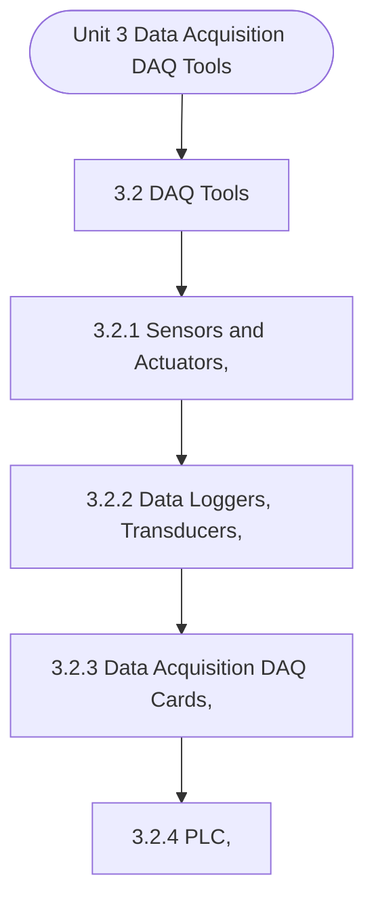

# MCS-062: Introduction to Data Science
## Unit 3: Data Acquisition (DAQ) Tools

> 📚 **Programme:** M.Sc. (Data Science and Analytics) | **Semester:** Semester 1  
> ⏱️ **Estimated Study Time:** ~102 mins | 📄 **Textbook Pages:** 49 Pages  
> 📥 **Original PDF:** [Download & View Textbook](../../../pdfs/Semester_1/MCS-062_Introduction_to_Data_Science/Unit-3_Data_Acquisition_(DAQ)_Tools.pdf)

---

### 🎯 Executive Concept & Data Science Relevance
In modern data systems, **Data Acquisition (DAQ) Tools** forms a vital conceptual pillar. Descriptive statistics provide quantitative summaries of dataset properties. Measures of central tendency identify typical values, while measures of dispersion quantify data spread, uncertainty, and variability—critical for feature normalization and anomaly detection.

> [!NOTE]
> **Why this matters for your career:** Mastering data acquisition (daq) tools equips you with the foundational principles required to reason mathematically about high-dimensional datasets, evaluate algorithm performance, and avoid statistical pitfalls in production machine learning pipelines.

### 🗺️ Visual Knowledge Architecture
The following concept map illustrates the structural hierarchy and learning trajectory of this module:

### 📖 Core Definitions & Terminology Cards

> 📌 **Arithmetic Mean $\bar{x}$ or $\mu$**  
> - **Formal Definition:** The sum of all observations divided by the total number of observations: $\bar{x} = \frac{1}{n}\sum_{i=1}^n x_i$. Sensitive to extreme outliers.  
> - 💡 **Practical Intuition & Analogy:** *The center of mass or balance point of the distribution.*

> 📌 **Median**  
> - **Formal Definition:** The physical middle value separating the higher half from the lower half of an ordered dataset. Robust against outliers.  
> - 💡 **Practical Intuition & Analogy:** *The 50th percentile value where exactly half the data lies above and half below.*

> 📌 **Standard Deviation $\sigma$ or $s$**  
> - **Formal Definition:** The square root of variance, measuring average dispersion in original units: $s = \sqrt{\frac{1}{n-1}\sum (x_i - \bar{x})^2}$.  
> - 💡 **Practical Intuition & Analogy:** *The typical distance data points deviate from the mean.*

> 📌 **Coefficient of Variation ($CV$)**  
> - **Formal Definition:** Relative dispersion measure expressed as a percentage: $CV = \frac{\sigma}{\mu} \times 100\%$. Enables comparison across different measurement scales.  
> - 💡 **Practical Intuition & Analogy:** *Comparing stock volatility across assets priced at 10 USD vs 1,000 USD.*

### ⚡ Governing Mathematical Laws & Formula Cheatsheet
#### 🔹 Sample Variance Formula (Bessel's Correction)
$$
\begin{aligned} s^2 & = \frac{1}{n - 1} \sum_{i=1}^n (x_i - \bar{x})^2 \\ & = \frac{\sum x_i^2 - \frac{(\sum x_i)^2}{n}}{n - 1} \end{aligned}
$$
- **Explanation:** Using $n-1$ in the denominator corrects for downward sample bias, yielding an unbiased estimator of population variance $\sigma^2$.

#### 🔹 Interquartile Range (IQR) & Outlier Bounds
$$
\text{IQR} = Q_3 - Q_1, \quad \text{Outliers} < Q_1 - 1.5(\text{IQR}) \;\lor\; > Q_3 + 1.5(\text{IQR})
$$
- **Explanation:** Standard Tukey boxplot rule for identifying extreme data points robustly.

#### 🔹 Pearson's First Coefficient of Skewness
$$
Sk_1 = \frac{\text{Mean} - \text{Mode}}{\sigma} \quad \text{or} \quad Sk_2 = \frac{3(\text{Mean} - \text{Median})}{\sigma}
$$
- **Explanation:** Measures asymmetry: Positive skew means mean > median (right tail); negative skew means mean < median (left tail).

### 📌 Detailed Section-by-Section Study Breakdown
#### `3.2` DAQ Tools
- **Core Concept:** The DAQ tools are essential in this process and typically consist of a combination of hardware and software components, these tools are essential in providing the raw data needed for data science applications across various domains.
- **Core Concept:** By leveraging these tools, data scientists can collect high-quality data from diverse sources, ranging from sensors and industrial systems to the web and satellite imagery.
- **Core Concept:** This data is then analyzed to uncover patterns, make predictions, optimize processes, and drive decision-making in fields like healthcare, energy, manufacturing, agriculture, and more.
- **Data Science Application:** Provides foundational structures used directly in statistical modeling, query execution, and machine learning pipelines.

> [!TIP]
> **Exam & Interview Tip:** Be prepared to state the formal definition of daq tools and derive its primary equations step-by-step.

#### `3.2.1` Sensors and Actuators,
- **Core Concept:** These devices bridge the gap between the physical world and digital systems by gathering data about physical environments and influencing the state of those environments based on computational insights.
- **Core Concept:** The data collected via sensors and the actions taken through actuators are central to a wide range of applications, from industrial automation to healthcare monitoring, smart cities, environmental monitoring, and more.
- **Core Concept:** In this section we are going to discuss the role of sensors and actuators in data science.
- **Data Science Application:** Provides foundational structures used directly in statistical modeling, query execution, and machine learning pipelines.

> [!TIP]
> **Exam & Interview Tip:** Be prepared to state the formal definition of sensors and actuators, and derive its primary equations step-by-step.

#### `3.2.2` Data Loggers, Transducers,
- **Core Concept:** In the realm of data science, data loggers and transducers are essential tools for data acquisition, enabling accurate and continuous collection of real- world data, which can then be analyzed for insights, predictions, and optimizations.
- **Core Concept:** These devices are integral in industries ranging from environmental monitoring and healthcare to industrial automation and scientific research.
- **Core Concept:** In order to Understand their roles in data science we need to properly understand What Are Data Loggers?
- **Data Science Application:** Provides foundational structures used directly in statistical modeling, query execution, and machine learning pipelines.

> [!TIP]
> **Exam & Interview Tip:** Be prepared to state the formal definition of data loggers, transducers, and derive its primary equations step-by-step.

#### `3.2.3` Data Acquisition (DAQ) Cards,
- **Core Concept:** Data Acquisition (DAQ) cards are vital components in modern data science applications that require the acquisition, processing, and analysis of data from physical systems.
- **Core Concept:** These cards interface with sensors, transducers, and other measuring devices to collect analog and digital signals, convert them into digital data, and then send this data to a computer or processing unit for analysis.
- **Core Concept:** The role of DAQ cards is crucial in industries such as manufacturing, scientific research, healthcare, environmental monitoring, and automation.
- **Data Science Application:** Provides foundational structures used directly in statistical modeling, query execution, and machine learning pipelines.

> [!TIP]
> **Exam & Interview Tip:** Be prepared to state the formal definition of data acquisition (daq) cards, and derive its primary equations step-by-step.

#### `3.2.4` PLC,
- **Core Concept:** PLCs are designed to perform automated control tasks, monitoring inputs and generating outputs based on pre- programmed logic.
- **Core Concept:** In the context of data science, PLCs play a significant role in data acquisition, process monitoring, predictive maintenance, optimization, and real-time decision-making.
- **Core Concept:** While PLCs are traditionally seen as tools for industrial control, their role in data science is expanding, especially in industries embracing Industry 4.0 and 95 Data Acquisition (DAQ): Tools the Industrial Internet of Things (IIoT).
- **Data Science Application:** Provides foundational structures used directly in statistical modeling, query execution, and machine learning pipelines.

> [!TIP]
> **Exam & Interview Tip:** Be prepared to state the formal definition of plc, and derive its primary equations step-by-step.

#### `3.2.5` SCADA,
- **Core Concept:** Supervisory Control and Data Acquisition (SCADA) is an essential control system used in industrial settings to monitor and manage various processes such as manufacturing, energy distribution, water treatment, and infrastructure systems.
- **Core Concept:** SCADA systems enable operators to observe real-time 99 Data Acquisition (DAQ): Tools data from sensors, control machines, and make informed decisions based on collected data.
- **Core Concept:** In the context of data science, SCADA systems play a crucial role in providing real-time and historical data for advanced analysis, predictive modeling, optimization, and decision-making.
- **Data Science Application:** Provides foundational structures used directly in statistical modeling, query execution, and machine learning pipelines.

> [!TIP]
> **Exam & Interview Tip:** Be prepared to state the formal definition of scada, and derive its primary equations step-by-step.

### 💡 Interactive Self-Assessment Checkpoints
Test your comprehension before proceeding. Tap each question to reveal the comprehensive explanation:

<b>Checkpoint 1:</b> Why is sample variance divided by $n-1$ instead of $n$? <i>(Tap to reveal answer)</i>

> **Answer & Analysis:**  
> Dividing by $n-1$ applies **Bessel's correction**, which removes downward bias caused by using the sample mean $\bar{x}$ instead of the true population mean $\mu$.

<b>Checkpoint 2:</b> Which measure of central tendency is most robust to extreme outliers? <i>(Tap to reveal answer)</i>

> **Answer & Analysis:**  
> The **Median**, because it depends on positional rank rather than magnitude summation.

<b>Checkpoint 3:</b> In a right-skewed (positively skewed) distribution, what is the order of Mean, Median, and Mode? <i>(Tap to reveal answer)</i>

> **Answer & Analysis:**  
> $\text{Mode} < \text{Median} < \text{Mean}$.

<b>Checkpoint 4:</b> What is Data Acquisition in the context of data science? What are the main components of a DAQ system? <i>(Tap to reveal answer)</i>

> **Answer & Analysis:**  
> This question tests your conceptual mastery of Data Acquisition (DAQ) Tools. Review the governing formulas and section breakdowns above to formulate a complete, rigorous proof or derivation.

<b>Checkpoint 5:</b> Differentiate between Sensors and Actuators …………………………………………………………………………… …………………………………………………………………………… …………………………………………………………………………… <i>(Tap to reveal answer)</i>

> **Answer & Analysis:**  
> This question tests your conceptual mastery of Data Acquisition (DAQ) Tools. Review the governing formulas and section breakdowns above to formulate a complete, rigorous proof or derivation.

<b>Checkpoint 6:</b> What is the role of sensors in data acquisition systems? …………………………………………………………………………… …………………………………………………………………………… …………………………………………………………………………… …………………………………………………………………………… <i>(Tap to reveal answer)</i>

> **Answer & Analysis:**  
> This question tests your conceptual mastery of Data Acquisition (DAQ) Tools. Review the governing formulas and section breakdowns above to formulate a complete, rigorous proof or derivation.

### 🎯 Executive Module Wrap-Up
- **Central Idea:** Data Acquisition (DAQ) Tools provides essential mathematical and algorithmic tools directly utilized in Data Science.
- **Mathematical Rigor:** Formulas and laws must be memorized with attention to boundary conditions and assumptions.
- **Full Textbook Coverage:** For exhaustive multi-page derivations, proofs, and supplementary exercises, consult the [Authentic IGNOU Textbook](../../../pdfs/Semester_1/MCS-062_Introduction_to_Data_Science/Unit-3_Data_Acquisition_(DAQ)_Tools.pdf).

---
### 🧭 Navigation & Syllabus Index
[⬅ Previous: Unit 2](unit_02_Understanding_Data_and_Its_Type.md) | [📑 Course Index](README.md) | [Next: Unit 4 ➡](unit_04_Data_Acquisition_(DAQ)_Process.md)
