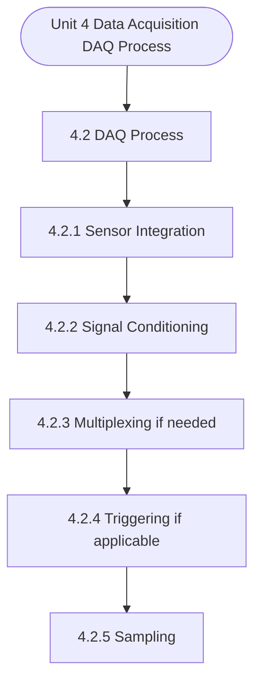

# MCS-062: Introduction to Data Science
## Unit 4: Data Acquisition (DAQ) Process

> 📚 **Programme:** M.Sc. (Data Science and Analytics) | **Semester:** Semester 1  
> ⏱️ **Estimated Study Time:** ~54 mins | 📄 **Textbook Pages:** 29 Pages  
> 📥 **Original PDF:** [Download & View Authentic Textbook](../../../pdfs/Semester_1/MCS-062_Introduction_to_Data_Science/Unit-4_Data_Acquisition_(DAQ)_Process.pdf)

---

### 🎯 Executive Concept & Data Science Relevance
In modern data systems and advanced analytics, **Data Acquisition (DAQ) Process** forms a vital conceptual pillar. Descriptive statistics provide quantitative summaries of dataset properties. Measures of central tendency identify typical values, while measures of dispersion quantify data spread, uncertainty, and variability—critical for feature normalization and anomaly detection.

> [!NOTE]
> **Why this matters for your career:** Mastering data acquisition (daq) process equips you with the foundational principles required to reason mathematically about high-dimensional datasets, evaluate algorithm performance, and avoid statistical pitfalls in production machine learning pipelines.

### 🗺️ Visual Knowledge Architecture
The following concept map illustrates the structural hierarchy and learning trajectory of this module:



### 📖 Core Definitions & Terminology Cards

> 📌 **Arithmetic Mean $\bar{x}$ or $\mu$**  
> - **Formal Definition:** The sum of all observations divided by the total number of observations: $\bar{x} = \frac{1}{n}\sum_{i=1}^n x_i$. Sensitive to extreme outliers.  
> - 💡 **Practical Intuition & Analogy:** *The center of mass or balance point of the distribution.*

> 📌 **Median**  
> - **Formal Definition:** The physical middle value separating the higher half from the lower half of an ordered dataset. Robust against outliers.  
> - 💡 **Practical Intuition & Analogy:** *The 50th percentile value where exactly half the data lies above and half below.*

> 📌 **Standard Deviation $\sigma$ or $s$**  
> - **Formal Definition:** The square root of variance, measuring average dispersion in original units: $s = \sqrt{\frac{1}{n-1}\sum (x_i - \bar{x})^2}$.  
> - 💡 **Practical Intuition & Analogy:** *The typical distance data points deviate from the mean.*

> 📌 **Coefficient of Variation ($CV$)**  
> - **Formal Definition:** Relative dispersion measure expressed as a percentage: $CV = \frac{\sigma}{\mu} \times 100\%$. Enables comparison across different measurement scales.  
> - 💡 **Practical Intuition & Analogy:** *Comparing stock volatility across assets priced at 10 USD vs 1,000 USD.*

### ⚡ Governing Mathematical Laws & Formula Cheatsheet
#### 🔹 Sample Variance Formula (Bessel's Correction)
$$
\begin{aligned} s^2 & = \frac{1}{n - 1} \sum_{i=1}^n (x_i - \bar{x})^2 \\ & = \frac{\sum x_i^2 - \frac{(\sum x_i)^2}{n}}{n - 1} \end{aligned}
$$
- **Explanation:** Using $n-1$ in the denominator corrects for downward sample bias, yielding an unbiased estimator of population variance $\sigma^2$.

#### 🔹 Interquartile Range (IQR) & Outlier Bounds
$$
\text{IQR} = Q_3 - Q_1, \quad \text{Outliers} < Q_1 - 1.5(\text{IQR}) \;\lor\; > Q_3 + 1.5(\text{IQR})
$$
- **Explanation:** Standard Tukey boxplot rule for identifying extreme data points robustly.

#### 🔹 Pearson's First Coefficient of Skewness
$$
Sk_1 = \frac{\text{Mean} - \text{Mode}}{\sigma} \quad \text{or} \quad Sk_2 = \frac{3(\text{Mean} - \text{Median})}{\sigma}
$$
- **Explanation:** Measures asymmetry: Positive skew means mean > median (right tail); negative skew means mean < median (left tail).

### ⚖️ Axiomatic Properties & Governing Laws
The mathematical formulations of this module are anchored by foundational algebraic and structural laws:

- **Variance Scaling Rule:** $\text{Var}(aX + b) = a^2 \text{Var}(X)$
- **Standard Deviation Scaling:** $\sigma(aX + b) = \vert a\vert \sigma(X)$
- **Empirical Rule (Normal Distribution):** 68% within $\mu \pm 1\sigma$, 95% within $\mu \pm 2\sigma$, 99.7% within $\mu \pm 3\sigma$

### 📌 Comprehensive Section-by-Section Study Breakdown
#### `4.2` DAQ Process:

##### 📘 Theoretical Principles & Pedagogical Exposition
In any Data Acquisition (DAQ) system, the Sensor integration refers to the process of connecting and configuring sensors with the DAQ hardware and software to ensure accurate and efficient data collection. In data science, the purpose of sensor integration is to enable the reliable and real-time collection of structured, high-quality data from the physical world, which can then be used for analysis, modelling, and decision-making.

This step of the DAQ process involves both the physical connection (e.g., wiring, mounting) and logical configuration (e.g., calibration, scaling, and signal compatibility), it is a crucial step as it directly affects the data. It is the stage wherein one needs to assure that data is correctly collected with minimum errors and distortion, further the compatibility of the signals received from sensors need to be assured and accordingly calibration is required to be performed.

Some of the key reasons behind the utility of this stage of data acquisition are mentioned below: Introduction to Data Science-1 Key reasons of proper Sensor Integration: 1. Accurate Data Collection: Proper integration ensures that the sensor's output is correctly interpreted by the DAQ system, minimizing errors and distortions.


##### ⚙️ Mathematical & Algorithmic Mechanics
- **Core Mechanism:** Operating systems manage hardware resource virtualization. Processes encapsulate private address spaces; threads share virtual memory within a process. Virtual memory uses multi-level page tables to translate virtual addresses to physical RAM frames.
- **Boundary Conditions:** Coffman deadlock conditions (Mutual Exclusion, Hold and Wait, No Preemption, Circular Wait), thrashing from excessive page faults, and multi-thread race conditions.

##### 📊 Practical Data Science & Production Relevance
- **Production Workflow:** Multi-process Python workloads (`multiprocessing`), asynchronous I/O architectures (`asyncio`), WSGI worker scaling (Gunicorn/Celery), and container resource bounds in Docker/K8s.
- **Real-World Pitfall:** Python Global Interpreter Lock (GIL) bottlenecks on CPU-bound multi-threaded code, or memory leaks triggering Linux kernel Out-Of-Memory (OOM) process termination.

> [!TIP]
> **Exam & Technical Interview Insight:** Calculate turnaround and waiting times for CPU scheduling algorithms (FCFS, SJF, Round Robin); determine safe execution states using the Banker's Algorithm.

#### `4.2.1` Sensor Integration

##### 📘 Theoretical Principles & Pedagogical Exposition
In any Data Acquisition (DAQ) system, the Sensor integration refers to the process of connecting and configuring sensors with the DAQ hardware and software to ensure accurate and efficient data collection. In data science, the purpose of sensor integration is to enable the reliable and real-time collection of structured, high-quality data from the physical world, which can then be used for analysis, modelling, and decision-making.

This step of the DAQ process involves both the physical connection (e.g., wiring, mounting) and logical configuration (e.g., calibration, scaling, and signal compatibility), it is a crucial step as it directly affects the data. It is the stage wherein one needs to assure that data is correctly collected with minimum errors and distortion, further the compatibility of the signals received from sensors need to be assured and accordingly calibration is required to be performed.

Some of the key reasons behind the utility of this stage of data acquisition are mentioned below: Introduction to Data Science-1 Key reasons of proper Sensor Integration: 1. Accurate Data Collection: Proper integration ensures that the sensor's output is correctly interpreted by the DAQ system, minimizing errors and distortions.


##### ⚙️ Mathematical & Algorithmic Mechanics
- **Core Mechanism:** Operating systems manage hardware resource virtualization. Processes encapsulate private address spaces; threads share virtual memory within a process. Virtual memory uses multi-level page tables to translate virtual addresses to physical RAM frames.
- **Boundary Conditions:** Coffman deadlock conditions (Mutual Exclusion, Hold and Wait, No Preemption, Circular Wait), thrashing from excessive page faults, and multi-thread race conditions.

##### 📊 Practical Data Science & Production Relevance
- **Production Workflow:** Multi-process Python workloads (`multiprocessing`), asynchronous I/O architectures (`asyncio`), WSGI worker scaling (Gunicorn/Celery), and container resource bounds in Docker/K8s.
- **Real-World Pitfall:** Python Global Interpreter Lock (GIL) bottlenecks on CPU-bound multi-threaded code, or memory leaks triggering Linux kernel Out-Of-Memory (OOM) process termination.

> [!TIP]
> **Exam & Technical Interview Insight:** Calculate turnaround and waiting times for CPU scheduling algorithms (FCFS, SJF, Round Robin); determine safe execution states using the Banker's Algorithm.

#### `4.2.2` Signal Conditioning

##### 📘 Theoretical Principles & Pedagogical Exposition
In a Data Acquisition (DAQ) system, signal conditioning is the process of modifying and preparing raw signals from sensors so they can be accurately and safely interpreted by the DAQ hardware. When a sensor is integrated into the system, it generates an electrical signal—often in a low-voltage, noisy, or non-linear form—that cannot be directly processed by the DAQ unit.

Signal conditioning acts as an essential intermediary step that ensures the sensor's output is compatible with the input requirements of the DAQ device. This step of DAQ i.e. Signal conditioning is directly linked to sensor integration because it transforms the raw sensor signal into a clean, usable format that the DAQ system can digitize and analyse.

Without signal conditioning, the data collected from sensors would likely be inaccurate or even unusable. For example, when a thermocouple is used to measure temperature, the small voltage it produces must be amplified, filtered, and linearized before the DAQ system can reliably interpret it as a temperature reading.


##### ⚙️ Mathematical & Algorithmic Mechanics
- **Core Mechanism:** Operating systems manage hardware resource virtualization. Processes encapsulate private address spaces; threads share virtual memory within a process. Virtual memory uses multi-level page tables to translate virtual addresses to physical RAM frames.
- **Boundary Conditions:** Coffman deadlock conditions (Mutual Exclusion, Hold and Wait, No Preemption, Circular Wait), thrashing from excessive page faults, and multi-thread race conditions.

##### 📊 Practical Data Science & Production Relevance
- **Production Workflow:** Multi-process Python workloads (`multiprocessing`), asynchronous I/O architectures (`asyncio`), WSGI worker scaling (Gunicorn/Celery), and container resource bounds in Docker/K8s.
- **Real-World Pitfall:** Python Global Interpreter Lock (GIL) bottlenecks on CPU-bound multi-threaded code, or memory leaks triggering Linux kernel Out-Of-Memory (OOM) process termination.

> [!TIP]
> **Exam & Technical Interview Insight:** Calculate turnaround and waiting times for CPU scheduling algorithms (FCFS, SJF, Round Robin); determine safe execution states using the Banker's Algorithm.

#### `4.2.3` Multiplexing (if needed)

##### 📘 Theoretical Principles & Pedagogical Exposition
Multiplexing and signal conditioning are two distinct but often closely related steps in a Data Acquisition (DAQ) system. They work together to enable efficient handling of signals from multiple sensors using limited hardware resources. The process of Multiplexing is required to combine multiple input signals into a single channel or path, which can then be read by a single analog-to-digital converter (ADC).

This is especially useful when a DAQ system needs to acquire data from many sensors, but has only a limited number of ADCs. In brief, multiplexing allows multiple conditioned signals to share a single ADC, while signal conditioning ensures each signal is in a proper form for accurate measurement.

When used together correctly, they make DAQ systems more scalable, cost-effective, and efficient. Example: Imagine a DAQ system collecting data from 8 temperature sensors using a single ADC. A multiplexer is used to sequentially route one sensor signal at a time to the ADC. Before each signal reaches the Multiplexer (MUX), it passes through its own signal conditioning module to amplify and linearize the signal, ensuring consistent and accurate digital conversion.


##### ⚙️ Mathematical & Algorithmic Mechanics
- **Core Mechanism:** Operating systems manage hardware resource virtualization. Processes encapsulate private address spaces; threads share virtual memory within a process. Virtual memory uses multi-level page tables to translate virtual addresses to physical RAM frames.
- **Boundary Conditions:** Coffman deadlock conditions (Mutual Exclusion, Hold and Wait, No Preemption, Circular Wait), thrashing from excessive page faults, and multi-thread race conditions.

##### 📊 Practical Data Science & Production Relevance
- **Production Workflow:** Multi-process Python workloads (`multiprocessing`), asynchronous I/O architectures (`asyncio`), WSGI worker scaling (Gunicorn/Celery), and container resource bounds in Docker/K8s.
- **Real-World Pitfall:** Python Global Interpreter Lock (GIL) bottlenecks on CPU-bound multi-threaded code, or memory leaks triggering Linux kernel Out-Of-Memory (OOM) process termination.

> [!TIP]
> **Exam & Technical Interview Insight:** Calculate turnaround and waiting times for CPU scheduling algorithms (FCFS, SJF, Round Robin); determine safe execution states using the Banker's Algorithm.

#### `4.2.4` Triggering (if applicable)

##### 📘 Theoretical Principles & Pedagogical Exposition
In a Data Acquisition (DAQ) system, multiplexing and triggering are two essential functions that work together to efficiently capture and manage input signals. Multiplexing involves sequentially sampling multiple input channels using a single analog-to-digital converter (ADC). Instead of having a separate ADC for each sensor or signal source, a multiplexer (MUX) cycles through each input one at a time, feeding them into a single ADC for conversion into digital values.

This approach reduces hardware complexity and cost, especially when dealing with many input signals. On the other hand, triggering controls when the data acquisition process begins. Rather than recording data continuously, which can be inefficient and lead to unnecessary data storage, triggering ensures that acquisition only starts under specific conditions—such as a threshold voltage being crossed, an external digital signal being received, or a predefined time event occurring.

This allows the system to capture meaningful data related to specific events or states. These two processes are closely related within a DAQ system. A trigger typically initiates the data acquisition sequence, after which the system begins multiplexing through the selected input channels.


##### ⚙️ Mathematical & Algorithmic Mechanics
- **Core Mechanism:** Operating systems manage hardware resource virtualization. Processes encapsulate private address spaces; threads share virtual memory within a process. Virtual memory uses multi-level page tables to translate virtual addresses to physical RAM frames.
- **Boundary Conditions:** Coffman deadlock conditions (Mutual Exclusion, Hold and Wait, No Preemption, Circular Wait), thrashing from excessive page faults, and multi-thread race conditions.

##### 📊 Practical Data Science & Production Relevance
- **Production Workflow:** Multi-process Python workloads (`multiprocessing`), asynchronous I/O architectures (`asyncio`), WSGI worker scaling (Gunicorn/Celery), and container resource bounds in Docker/K8s.
- **Real-World Pitfall:** Python Global Interpreter Lock (GIL) bottlenecks on CPU-bound multi-threaded code, or memory leaks triggering Linux kernel Out-Of-Memory (OOM) process termination.

> [!TIP]
> **Exam & Technical Interview Insight:** Calculate turnaround and waiting times for CPU scheduling algorithms (FCFS, SJF, Round Robin); determine safe execution states using the Banker's Algorithm.

#### `4.2.5` Sampling

##### 📘 Theoretical Principles & Pedagogical Exposition
We learned that Triggering defines the condition that initiates the data acquisition process. The system waits for a specific event or signal (trigger) to occur before starting to record data. This ensures that data is only captured during relevant or meaningful events, rather than continuously or randomly, which helps in managing storage and focusing on important data points.

Sampling is the process by which the system captures data from an input signal at discrete intervals. The system samples the input signal at a constant rate or when specific conditions (such as a trigger) are met. This process converts the analog signal into digital data for processing or analysis.

Thus, Sampling refers to the process of measuring the analog signal’s voltage at specific time intervals, known as the sampling rate. This is necessary because analog signals are continuous in time and value, while digital systems require discrete data points. By taking snapshots of the signal at regular intervals, the system captures enough information to digitally represent the original analog signal for processing, storage, or display.


##### ⚙️ Mathematical & Algorithmic Mechanics
- **Core Mechanism:** Statistical inference evaluates sample statistics to draw population conclusions. Hypothesis testing contrasts Null $H_0$ against Alternative $H_1$. The $p$-value represents probability of obtaining test results at least as extreme under $H_0$; reject $H_0$ if $p < \alpha$.
- **Boundary Conditions:** Type I error (false positive $\alpha$) vs Type II error (false negative $\beta$), statistical power $1 - \beta$, unequal sample variances in Student's $t$-test, and small cell counts in Chi-Square tests.

##### 📊 Practical Data Science & Production Relevance
- **Production Workflow:** Online experimentation and conversion lift validation (A/B testing), automated model drift monitoring, feature significance selection, and clinical trial efficacy tests.
- **Real-World Pitfall:** $p$-hacking, failing to apply multiple testing corrections (e.g. Bonferroni / FDR) across multiple comparisons, and confusing statistical significance with practical impact.

> [!TIP]
> **Exam & Technical Interview Insight:** State $H_0$ and $H_1$ explicitly; identify the correct test statistic ($Z$, $t$, $F$, or $\chi^2$); determine degrees of freedom and state the clear rejection conclusion.

#### `4.2.6` ADC (Analog-to-Digital Conversion)

##### 📘 Theoretical Principles & Pedagogical Exposition
In a Data Acquisition System (DAQ), the ADC (Analog-to-Digital Conversion) stage plays a critical role in converting continuous analog signals into discrete digital data that a computer or microcontroller can process. The ADC stage allows the system to interface with real-world analog signals such as temperature, pressure, voltage, or current.

This is necessary for monitoring, processing, and analysing physical phenomena in various applications, such as industrial automation, scientific research, or instrumentation. The ADC process typically involves several stages: signal conditioning, sampling, hold, quantization, conversion, encoding, and output, each with a specific role in converting the analog signal to a digital format.

Below, a brief discussion over the stages of ADC is given, with suitable examples for understanding each stage. Signal Conditioning: Before the analog signal reaches the ADC, it often needs to be conditioned. Signal conditioning typically involves amplifying, filtering, or isolating the signal to ensure that it falls within the input range of the ADC and is free from noise.


##### ⚙️ Mathematical & Algorithmic Mechanics
- **Core Mechanism:** Operating systems manage hardware resource virtualization. Processes encapsulate private address spaces; threads share virtual memory within a process. Virtual memory uses multi-level page tables to translate virtual addresses to physical RAM frames.
- **Boundary Conditions:** Coffman deadlock conditions (Mutual Exclusion, Hold and Wait, No Preemption, Circular Wait), thrashing from excessive page faults, and multi-thread race conditions.

##### 📊 Practical Data Science & Production Relevance
- **Production Workflow:** Multi-process Python workloads (`multiprocessing`), asynchronous I/O architectures (`asyncio`), WSGI worker scaling (Gunicorn/Celery), and container resource bounds in Docker/K8s.
- **Real-World Pitfall:** Python Global Interpreter Lock (GIL) bottlenecks on CPU-bound multi-threaded code, or memory leaks triggering Linux kernel Out-Of-Memory (OOM) process termination.

> [!TIP]
> **Exam & Technical Interview Insight:** Calculate turnaround and waiting times for CPU scheduling algorithms (FCFS, SJF, Round Robin); determine safe execution states using the Banker's Algorithm.

#### `4.2.7` Data Processing

##### 📘 Theoretical Principles & Pedagogical Exposition
Data processing in the ADC (Analog-to-Digital Conversion) process refers to the steps involved in transforming the sampled, quantized, and encoded data into a usable digital output that can be interpreted or further analysed by digital systems. Once conditioned signal, i.e. the analog signal is passed through an Analog- to-Digital Converter (ADC).

It passes through the stages of sampling, quantization, and encoding; thereafter the signal is digitized. The data processing involves the following: 1. Validation and Error Detection (Ensures data integrity and flags any outliers or errors): After the signal is digitized, the system performs data validation to ensure accuracy and reliability.

This may involve range checking to identify values that fall outside expected limits and error detection to flag or discard corrupt or incorrect data. In addition, data smoothing techniques like moving averages may be applied to remove erratic spikes or fluctuations. For example, if a sudden spike shows a temperature of 1000°C—far beyond the sensor’s capability—it may be recognized as an error and either flagged or corrected using previous valid readings.


##### ⚙️ Mathematical & Algorithmic Mechanics
- **Core Mechanism:** Operating systems manage hardware resource virtualization. Processes encapsulate private address spaces; threads share virtual memory within a process. Virtual memory uses multi-level page tables to translate virtual addresses to physical RAM frames.
- **Boundary Conditions:** Coffman deadlock conditions (Mutual Exclusion, Hold and Wait, No Preemption, Circular Wait), thrashing from excessive page faults, and multi-thread race conditions.

##### 📊 Practical Data Science & Production Relevance
- **Production Workflow:** Multi-process Python workloads (`multiprocessing`), asynchronous I/O architectures (`asyncio`), WSGI worker scaling (Gunicorn/Celery), and container resource bounds in Docker/K8s.
- **Real-World Pitfall:** Python Global Interpreter Lock (GIL) bottlenecks on CPU-bound multi-threaded code, or memory leaks triggering Linux kernel Out-Of-Memory (OOM) process termination.

> [!TIP]
> **Exam & Technical Interview Insight:** Calculate turnaround and waiting times for CPU scheduling algorithms (FCFS, SJF, Round Robin); determine safe execution states using the Banker's Algorithm.

### 📐 Step-by-Step Solved Mathematical Examples
To solidify your theoretical understanding, work through these fully solved, step-by-step mathematical problems:

#### 🧮 Example 1: Sample Variance and Standard Deviation Computation
> **Problem Statement:**  
> Given sample observations: $X = \lbrace 4, 8, 6, 5, 7 \rbrace$. Compute sample mean $\bar{x}$, sample variance $s^2$, and standard deviation $s$ step-by-step.

**Detailed Step-by-Step Solution:**

1. **Mean:** $\bar{x} = \frac{4 + 8 + 6 + 5 + 7}{5} = \frac{30}{5} = 6$.

2. **Squared deviations:**
- $(4 - 6)^2 = (-2)^2 = 4$
- $(8 - 6)^2 = 2^2 = 4$
- $(6 - 6)^2 = 0^2 = 0$
- $(5 - 6)^2 = (-1)^2 = 1$
- $(7 - 6)^2 = 1^2 = 1$
Sum of squared deviations $= 4 + 4 + 0 + 1 + 1 = 10$.

3. **Sample Variance with Bessel's Correction ($n-1 = 4$):**

$$
s^2 = \frac{10}{5 - 1} = \frac{10}{4} = 2.5
$$


4. **Standard Deviation:** $s = \sqrt{2.5} \approx 1.581$.

#### 🧮 Example 2: Tukey's IQR Outlier Detection Rule
> **Problem Statement:**  
> A customer spend dataset has $Q_1 = 30$ and $Q_3 = 70$. Determine whether transactions of $135$ and $25$ are classified as outliers.

**Detailed Step-by-Step Solution:**

1. **IQR:** $\text{IQR} = Q_3 - Q_1 = 70 - 30 = 40$.
2. **Lower Bound:** $Q_1 - 1.5(\text{IQR}) = 30 - 1.5(40) = 30 - 60 = -30$.
3. **Upper Bound:** $Q_3 + 1.5(\text{IQR}) = 70 + 1.5(40) = 70 + 60 = 130$.

Conclusion:
- Spend of 135 exceeds Upper Bound ($135 > 130$): **Classified as Outlier**.
- Spend of 25 is within $[-30, 130]$: **Normal observation**.

### 💻 Practical Data Science Implementation (Python)
Theory translates directly into production algorithms. Below is a self-contained, commented Python implementation illustrating the core operations of this unit:

```python
import numpy as np
import pandas as pd

# Statistical profiling on production dataset
data = np.array([12, 15, 18, 22, 25, 29, 34, 45, 95])

mean_val = np.mean(data)
median_val = np.median(data)
std_val = np.std(data, ddof=1) # Bessel's correction

q1, q3 = np.percentile(data, [25, 75])
iqr = q3 - q1
outlier_upper = q3 + 1.5 * iqr

outliers = data[data > outlier_upper]

print(f"Mean: {mean_val:.2f} | Median: {median_val:.2f} | Std: {std_val:.2f}")
print(f"IQR: {iqr:.2f} | Upper Bound: {outlier_upper:.2f}")
print(f"Detected Outliers: {outliers}")
```

### 💡 Interactive Self-Assessment Checkpoints
Test your comprehension before proceeding. Tap each question to reveal the comprehensive explanation:

<details>
<summary><b>Checkpoint 1:</b> What is data acquisition in the context of data science? …………………………………………………………………………… …………………………………………………………………………… …………………………………………………………………………… <i>(Tap to reveal answer)</i></summary>

> **Answer & Analysis:**  
> **Detailed Analytical Solution:**
> 
> 1. **Core Principle:** Identify the governing theorem or definition for Data Acquisition (DAQ) Process.
> 2. **Step-by-Step Derivation:** Verify all preconditions and compute intermediate steps methodically.
> 3. **Conclusion:** State the final mathematical proof or calculation clearly, validating boundary edge cases.
</details>

<details>
<summary><b>Checkpoint 2:</b> What types of sources can data be collected from in data acquisition? …………………………………………………………………………… …………………………………………………………………………… …………………………………………………………………………… <i>(Tap to reveal answer)</i></summary>

> **Answer & Analysis:**  
> **Detailed Analytical Solution:**
> 
> 1. **Core Principle:** Identify the governing theorem or definition for Data Acquisition (DAQ) Process.
> 2. **Step-by-Step Derivation:** Verify all preconditions and compute intermediate steps methodically.
> 3. **Conclusion:** State the final mathematical proof or calculation clearly, validating boundary edge cases.
</details>

<details>
<summary><b>Checkpoint 3:</b> What is the main purpose of the Data Acquisition (DAQ) process? …………………………………………………………………………… …………………………………………………………………………… …………………………………………………………………………… <i>(Tap to reveal answer)</i></summary>

> **Answer & Analysis:**  
> **Detailed Analytical Solution:**
> 
> 1. **Core Principle:** Identify the governing theorem or definition for Data Acquisition (DAQ) Process.
> 2. **Step-by-Step Derivation:** Verify all preconditions and compute intermediate steps methodically.
> 3. **Conclusion:** State the final mathematical proof or calculation clearly, validating boundary edge cases.
</details>

<details>
<summary><b>Checkpoint 4:</b> Why is signal conditioning necessary before sampling in a DAQ system? …………………………………………………………………………… …………………………………………………………………………… …………………………………………………………………………… <i>(Tap to reveal answer)</i></summary>

> **Answer & Analysis:**  
> **Detailed Analytical Solution:**
> 
> 1. **Core Principle:** Identify the governing theorem or definition for Data Acquisition (DAQ) Process.
> 2. **Step-by-Step Derivation:** Verify all preconditions and compute intermediate steps methodically.
> 3. **Conclusion:** State the final mathematical proof or calculation clearly, validating boundary edge cases.
</details>

<details>
<summary><b>Checkpoint 5:</b> Why is sample variance divided by $n-1$ instead of $n$? <i>(Tap to reveal answer)</i></summary>

> **Answer & Analysis:**  
> Dividing by $n-1$ applies **Bessel's correction**, which removes downward bias caused by using the sample mean $\bar{x}$ instead of the true population mean $\mu$.
</details>

<details>
<summary><b>Checkpoint 6:</b> Which measure of central tendency is most robust to extreme outliers? <i>(Tap to reveal answer)</i></summary>

> **Answer & Analysis:**  
> The **Median**, because it depends on positional rank rather than magnitude summation.
</details>

### 🎯 Executive Module Wrap-Up
- **Central Idea:** Data Acquisition (DAQ) Process provides essential mathematical and algorithmic tools directly utilized in Data Science.
- **Mathematical Rigor:** Formulas and laws must be memorized with attention to boundary conditions and assumptions.
- **Full Textbook Coverage:** For exhaustive multi-page derivations, proofs, and supplementary exercises, consult the [Authentic IGNOU Textbook](../../../pdfs/Semester_1/MCS-062_Introduction_to_Data_Science/Unit-4_Data_Acquisition_(DAQ)_Process.pdf).

---
### 🧭 Navigation & Syllabus Index
[⬅ Previous: Unit 3](unit_03_Data_Acquisition_(DAQ)_Tools.md) | [📑 Course Index](README.md) | [Next: Unit 5 ➡](unit_05_Data_Preparation_for_Analysis.md)
