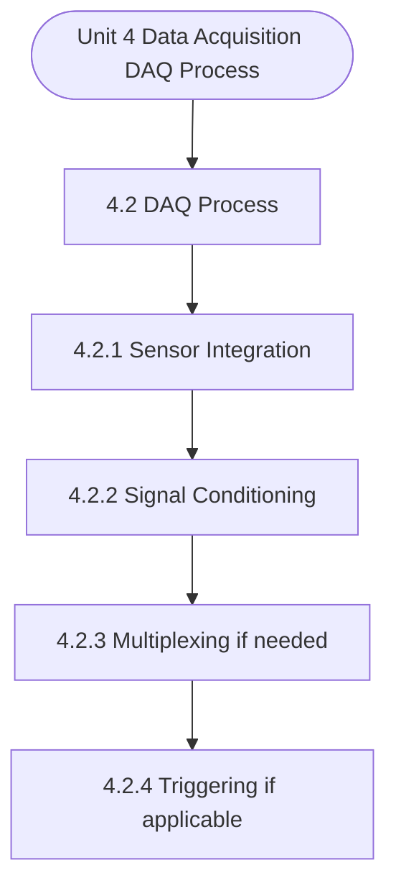

# MCS-062: Introduction to Data Science
## Unit 4: Data Acquisition (DAQ) Process

> 📚 **Programme:** M.Sc. (Data Science and Analytics) | **Semester:** Semester 1  
> ⏱️ **Estimated Study Time:** ~54 mins | 📄 **Textbook Pages:** 29 Pages  
> 📥 **Original PDF:** [Download & View Textbook](../../../pdfs/Semester_1/MCS-062_Introduction_to_Data_Science/Unit-4_Data_Acquisition_(DAQ)_Process.pdf)

---

### 🎯 Executive Concept & Data Science Relevance
In modern data systems, **Data Acquisition (DAQ) Process** forms a vital conceptual pillar. Descriptive statistics provide quantitative summaries of dataset properties. Measures of central tendency identify typical values, while measures of dispersion quantify data spread, uncertainty, and variability—critical for feature normalization and anomaly detection.

> [!NOTE]
> **Why this matters for your career:** Mastering data acquisition (daq) process equips you with the foundational principles required to reason mathematically about high-dimensional datasets, evaluate algorithm performance, and avoid statistical pitfalls in production machine learning pipelines.

### 🗺️ Visual Knowledge Architecture
The following concept map illustrates the structural hierarchy and learning trajectory of this module:

### 📖 Core Definitions & Terminology Cards

> 📌 **Arithmetic Mean $\bar{x}$ or $\mu$**  
> - **Formal Definition:** The sum of all observations divided by the total number of observations: $\bar{x} = \frac{1}{n}\sum_{i=1}^n x_i$. Sensitive to extreme outliers.  
> - 💡 **Practical Intuition & Analogy:** *The center of mass or balance point of the distribution.*

> 📌 **Median**  
> - **Formal Definition:** The physical middle value separating the higher half from the lower half of an ordered dataset. Robust against outliers.  
> - 💡 **Practical Intuition & Analogy:** *The 50th percentile value where exactly half the data lies above and half below.*

> 📌 **Standard Deviation $\sigma$ or $s$**  
> - **Formal Definition:** The square root of variance, measuring average dispersion in original units: $s = \sqrt{\frac{1}{n-1}\sum (x_i - \bar{x})^2}$.  
> - 💡 **Practical Intuition & Analogy:** *The typical distance data points deviate from the mean.*

> 📌 **Coefficient of Variation ($CV$)**  
> - **Formal Definition:** Relative dispersion measure expressed as a percentage: $CV = \frac{\sigma}{\mu} \times 100\%$. Enables comparison across different measurement scales.  
> - 💡 **Practical Intuition & Analogy:** *Comparing stock volatility across assets priced at 10 USD vs 1,000 USD.*

### ⚡ Governing Mathematical Laws & Formula Cheatsheet
#### 🔹 Sample Variance Formula (Bessel's Correction)
$$
\begin{aligned} s^2 & = \frac{1}{n - 1} \sum_{i=1}^n (x_i - \bar{x})^2 \\ & = \frac{\sum x_i^2 - \frac{(\sum x_i)^2}{n}}{n - 1} \end{aligned}
$$
- **Explanation:** Using $n-1$ in the denominator corrects for downward sample bias, yielding an unbiased estimator of population variance $\sigma^2$.

#### 🔹 Interquartile Range (IQR) & Outlier Bounds
$$
\text{IQR} = Q_3 - Q_1, \quad \text{Outliers} < Q_1 - 1.5(\text{IQR}) \;\lor\; > Q_3 + 1.5(\text{IQR})
$$
- **Explanation:** Standard Tukey boxplot rule for identifying extreme data points robustly.

#### 🔹 Pearson's First Coefficient of Skewness
$$
Sk_1 = \frac{\text{Mean} - \text{Mode}}{\sigma} \quad \text{or} \quad Sk_2 = \frac{3(\text{Mean} - \text{Median})}{\sigma}
$$
- **Explanation:** Measures asymmetry: Positive skew means mean > median (right tail); negative skew means mean < median (left tail).

### 📌 Detailed Section-by-Section Study Breakdown
#### `4.2` DAQ Process:
- **Core Concept:** Establishes theoretical foundations, axiomatic formulations, and properties of daq process:.
- **Core Concept:** Analyzes standard algorithmic workflows and mathematical transformations relevant to data acquisition (daq) process.
- **Core Concept:** Applies computational bounds and optimization guarantees across data processing workflows.
- **Data Science Application:** Provides foundational structures used directly in statistical modeling, query execution, and machine learning pipelines.

> [!TIP]
> **Exam & Interview Tip:** Be prepared to state the formal definition of daq process: and derive its primary equations step-by-step.

#### `4.2.1` Sensor Integration
- **Core Concept:** In data science, the purpose of sensor integration is to enable the reliable and real-time collection of structured, high-quality data from the physical world, which can then be used for analysis, modelling, and decision-making.
- **Core Concept:** Some of the key reasons behind the utility of this stage of data acquisition are mentioned below: Introduction to Data Science-1 130 Key reasons of proper Sensor Integration: 1.
- **Core Concept:** Accurate Data Collection: Proper integration ensures that the sensor's output is correctly interpreted by the DAQ system, minimizing errors and distortions.
- **Data Science Application:** Provides foundational structures used directly in statistical modeling, query execution, and machine learning pipelines.

> [!TIP]
> **Exam & Interview Tip:** Be prepared to state the formal definition of sensor integration and derive its primary equations step-by-step.

#### `4.2.2` Signal Conditioning
- **Core Concept:** In a Data Acquisition (DAQ) system, signal conditioning is the process of modifying and preparing raw signals from sensors so they can be accurately and safely interpreted by the DAQ hardware.
- **Core Concept:** When a sensor is integrated into the system, it generates an electrical signal—often in a low-voltage, noisy, or non-linear form—that cannot be directly processed by the DAQ unit.
- **Core Concept:** Signal conditioning acts as an essential intermediary step that ensures the sensor's output is compatible with the input requirements of the DAQ device.
- **Data Science Application:** Provides foundational structures used directly in statistical modeling, query execution, and machine learning pipelines.

> [!TIP]
> **Exam & Interview Tip:** Be prepared to state the formal definition of signal conditioning and derive its primary equations step-by-step.

#### `4.2.3` Multiplexing (if needed)
- **Core Concept:** Multiplexing and signal conditioning are two distinct but often closely related steps in a Data Acquisition (DAQ) system.
- **Core Concept:** They work together to enable efficient handling of signals from multiple sensors using limited hardware resources.
- **Core Concept:** The process of Multiplexing is required to combine multiple input signals into a single channel or path, which can then be read by a single analog-to-digital converter (ADC).
- **Data Science Application:** Provides foundational structures used directly in statistical modeling, query execution, and machine learning pipelines.

> [!TIP]
> **Exam & Interview Tip:** Be prepared to state the formal definition of multiplexing (if needed) and derive its primary equations step-by-step.

#### `4.2.4` Triggering (if applicable)
- **Core Concept:** In a Data Acquisition (DAQ) system, multiplexing and triggering are two essential functions that work together to efficiently capture and manage input signals.
- **Core Concept:** Multiplexing involves sequentially sampling multiple input channels using a single analog-to-digital converter (ADC).
- **Core Concept:** Instead of having a separate ADC for each sensor or signal source, a multiplexer (MUX) cycles through each input one at a time, feeding them into a single ADC for conversion into digital values.
- **Data Science Application:** Provides foundational structures used directly in statistical modeling, query execution, and machine learning pipelines.

> [!TIP]
> **Exam & Interview Tip:** Be prepared to state the formal definition of triggering (if applicable) and derive its primary equations step-by-step.

#### `4.2.5` Sampling
- **Core Concept:** We learned that Triggering defines the condition that initiates the data acquisition process.
- **Core Concept:** The system waits for a specific event or signal (trigger) to occur before starting to record data.
- **Core Concept:** This ensures that data is only captured during relevant or meaningful events, rather than continuously or randomly, which helps in managing storage and focusing on important data points.
- **Data Science Application:** Provides foundational structures used directly in statistical modeling, query execution, and machine learning pipelines.

> [!TIP]
> **Exam & Interview Tip:** Be prepared to state the formal definition of sampling and derive its primary equations step-by-step.

### 💡 Interactive Self-Assessment Checkpoints
Test your comprehension before proceeding. Tap each question to reveal the comprehensive explanation:

<b>Checkpoint 1:</b> Why is sample variance divided by $n-1$ instead of $n$? <i>(Tap to reveal answer)</i>

> **Answer & Analysis:**  
> Dividing by $n-1$ applies **Bessel's correction**, which removes downward bias caused by using the sample mean $\bar{x}$ instead of the true population mean $\mu$.

<b>Checkpoint 2:</b> Which measure of central tendency is most robust to extreme outliers? <i>(Tap to reveal answer)</i>

> **Answer & Analysis:**  
> The **Median**, because it depends on positional rank rather than magnitude summation.

<b>Checkpoint 3:</b> In a right-skewed (positively skewed) distribution, what is the order of Mean, Median, and Mode? <i>(Tap to reveal answer)</i>

> **Answer & Analysis:**  
> $\text{Mode} < \text{Median} < \text{Mean}$.

<b>Checkpoint 4:</b> What is data acquisition in the context of data science? …………………………………………………………………………… …………………………………………………………………………… …………………………………………………………………………… <i>(Tap to reveal answer)</i>

> **Answer & Analysis:**  
> This question tests your conceptual mastery of Data Acquisition (DAQ) Process. Review the governing formulas and section breakdowns above to formulate a complete, rigorous proof or derivation.

<b>Checkpoint 5:</b> What types of sources can data be collected from in data acquisition? …………………………………………………………………………… …………………………………………………………………………… …………………………………………………………………………… <i>(Tap to reveal answer)</i>

> **Answer & Analysis:**  
> This question tests your conceptual mastery of Data Acquisition (DAQ) Process. Review the governing formulas and section breakdowns above to formulate a complete, rigorous proof or derivation.

<b>Checkpoint 6:</b> What is the main purpose of the Data Acquisition (DAQ) process? …………………………………………………………………………… …………………………………………………………………………… …………………………………………………………………………… <i>(Tap to reveal answer)</i>

> **Answer & Analysis:**  
> This question tests your conceptual mastery of Data Acquisition (DAQ) Process. Review the governing formulas and section breakdowns above to formulate a complete, rigorous proof or derivation.

### 🎯 Executive Module Wrap-Up
- **Central Idea:** Data Acquisition (DAQ) Process provides essential mathematical and algorithmic tools directly utilized in Data Science.
- **Mathematical Rigor:** Formulas and laws must be memorized with attention to boundary conditions and assumptions.
- **Full Textbook Coverage:** For exhaustive multi-page derivations, proofs, and supplementary exercises, consult the [Authentic IGNOU Textbook](../../../pdfs/Semester_1/MCS-062_Introduction_to_Data_Science/Unit-4_Data_Acquisition_(DAQ)_Process.pdf).

---
### 🧭 Navigation & Syllabus Index
[⬅ Previous: Unit 3](unit_03_Data_Acquisition_(DAQ)_Tools.md) | [📑 Course Index](README.md) | [Next: Unit 5 ➡](unit_05_Data_Preparation_for_Analysis.md)
