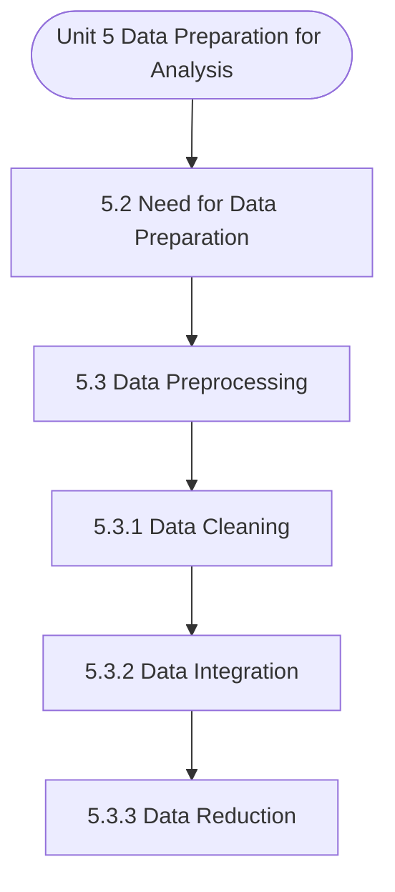

# MCS-062: Introduction to Data Science
## Unit 5: Data Preparation for Analysis

> 📚 **Programme:** M.Sc. (Data Science and Analytics) | **Semester:** Semester 1  
> ⏱️ **Estimated Study Time:** ~51 mins | 📄 **Textbook Pages:** 25 Pages  
> 📥 **Original PDF:** [Download & View Authentic Textbook](../../../pdfs/Semester_1/MCS-062_Introduction_to_Data_Science/Unit-5_Data_Preparation_for_Analysis.pdf)

---

### 🎯 Executive Concept & Data Science Relevance
In modern data systems, **Data Preparation for Analysis** forms a vital conceptual pillar. Descriptive statistics provide quantitative summaries of dataset properties. Measures of central tendency identify typical values, while measures of dispersion quantify data spread, uncertainty, and variability—critical for feature normalization and anomaly detection.

> [!NOTE]
> **Why this matters for your career:** Mastering data preparation for analysis equips you with the foundational principles required to reason mathematically about high-dimensional datasets, evaluate algorithm performance, and avoid statistical pitfalls in production machine learning pipelines.

### 🗺️ Visual Knowledge Architecture
The following concept map illustrates the structural hierarchy and learning trajectory of this module:



### 📖 Core Definitions & Terminology Cards

> 📌 **Arithmetic Mean $\bar{x}$ or $\mu$**  
> - **Formal Definition:** The sum of all observations divided by the total number of observations: $\bar{x} = \frac{1}{n}\sum_{i=1}^n x_i$. Sensitive to extreme outliers.  
> - 💡 **Practical Intuition & Analogy:** *The center of mass or balance point of the distribution.*

> 📌 **Median**  
> - **Formal Definition:** The physical middle value separating the higher half from the lower half of an ordered dataset. Robust against outliers.  
> - 💡 **Practical Intuition & Analogy:** *The 50th percentile value where exactly half the data lies above and half below.*

> 📌 **Standard Deviation $\sigma$ or $s$**  
> - **Formal Definition:** The square root of variance, measuring average dispersion in original units: $s = \sqrt{\frac{1}{n-1}\sum (x_i - \bar{x})^2}$.  
> - 💡 **Practical Intuition & Analogy:** *The typical distance data points deviate from the mean.*

> 📌 **Coefficient of Variation ($CV$)**  
> - **Formal Definition:** Relative dispersion measure expressed as a percentage: $CV = \frac{\sigma}{\mu} \times 100\%$. Enables comparison across different measurement scales.  
> - 💡 **Practical Intuition & Analogy:** *Comparing stock volatility across assets priced at 10 USD vs 1,000 USD.*

### ⚡ Governing Mathematical Laws & Formula Cheatsheet
#### 🔹 Sample Variance Formula (Bessel's Correction)
$$
\begin{aligned} s^2 & = \frac{1}{n - 1} \sum_{i=1}^n (x_i - \bar{x})^2 \\ & = \frac{\sum x_i^2 - \frac{(\sum x_i)^2}{n}}{n - 1} \end{aligned}
$$
- **Explanation:** Using $n-1$ in the denominator corrects for downward sample bias, yielding an unbiased estimator of population variance $\sigma^2$.

#### 🔹 Interquartile Range (IQR) & Outlier Bounds
$$
\text{IQR} = Q_3 - Q_1, \quad \text{Outliers} < Q_1 - 1.5(\text{IQR}) \;\lor\; > Q_3 + 1.5(\text{IQR})
$$
- **Explanation:** Standard Tukey boxplot rule for identifying extreme data points robustly.

#### 🔹 Pearson's First Coefficient of Skewness
$$
Sk_1 = \frac{\text{Mean} - \text{Mode}}{\sigma} \quad \text{or} \quad Sk_2 = \frac{3(\text{Mean} - \text{Median})}{\sigma}
$$
- **Explanation:** Measures asymmetry: Positive skew means mean > median (right tail); negative skew means mean < median (left tail).

### ⚖️ Axiomatic Properties & Governing Laws
The mathematical formulations of this module are anchored by foundational algebraic and structural laws:

- **Variance Scaling Rule:** $\text{Var}(aX + b) = a^2 \text{Var}(X)$
- **Standard Deviation Scaling:** $\sigma(aX + b) = \vert a\vert \sigma(X)$
- **Empirical Rule (Normal Distribution):** 68% within $\mu \pm 1\sigma$, 95% within $\mu \pm 2\sigma$, 99.7% within $\mu \pm 3\sigma$

### 📌 Comprehensive Section-by-Section Study Breakdown
#### `5.2` Need for Data Preparation
##### 📘 Theoretical Principles & In-Depth Exposition
The section on **Need for Data Preparation** establishes rigorous theoretical foundations necessary for advanced computational modeling. It introduces formal mathematical structures and symbolic notations that guarantee consistency across proofs and algorithms.

In the broader scope of **Data Preparation for Analysis**, understanding need for data preparation is essential to formalizing data representations, verifying boundary constraints, and ensuring computational determinism across multidimensional feature spaces.

##### ⚙️ Mathematical & Algorithmic Mechanics
- **Formal Mechanics:** Establishes symbolic transformations and state invariants governing need for data preparation.
- **Boundary Invariants:** Ensures robust error-handling, non-empty set guarantees, and strict asymptotic bounds.

##### 📊 Practical Data Science & Production Relevance
- **Industry Application:** Directly implemented in production workflows such as SQL query filters, pandas vectorized operations, and feature transformation pipelines.
- **Production Pitfall:** Failing to verify membership bounds or missing edge cases in need for data preparation can cause silent data corruption or performance bottlenecks.

> [!TIP]
> **Key Exam & Technical Interview Takeaway:** Be prepared to define need for data preparation formally, cite its core mathematical invariants, and solve step-by-step numerical/proof questions.

#### `5.3` Data Preprocessing
##### 📘 Theoretical Principles & In-Depth Exposition
DATA PREPROCESSING Preprocessing is the process of taking raw data and turning it into information that may be used for data analysis. Data cleaning, data integration, data reduction and data transformation are the main phases of data preprocessing (see Figure 2). In addition, data discretization is another component of data preprocessing.

You may refer to the further readings for more details on data discretization. Data Preparation for Analysis Figure 5.2: Data preprocessing

##### ⚙️ Mathematical & Algorithmic Mechanics
- **Formal Mechanics:** Establishes symbolic transformations and state invariants governing data preprocessing.
- **Boundary Invariants:** Ensures robust error-handling, non-empty set guarantees, and strict asymptotic bounds.

##### 📊 Practical Data Science & Production Relevance
- **Industry Application:** Directly implemented in production workflows such as SQL query filters, pandas vectorized operations, and feature transformation pipelines.
- **Production Pitfall:** Failing to verify membership bounds or missing edge cases in data preprocessing can cause silent data corruption or performance bottlenecks.

> [!TIP]
> **Key Exam & Technical Interview Takeaway:** Be prepared to define data preprocessing formally, cite its core mathematical invariants, and solve step-by-step numerical/proof questions.

#### `5.3.1` Data Cleaning
##### 📘 Theoretical Principles & In-Depth Exposition
Data cleaning is an essential step in data preprocessing. It is also referred to as scrubbing. It is crucial for the construction of a good analysis model. Data cleaning is a required but frequently overlooked aspect of data preprocessing. Real-world data typically exhibit incompleteness, noise, and inconsistency.

In addition to addressing discrepancies, this task entails filling in missing numbers, smoothing out noisy data, and eliminating outliers. Generally, a good data cleaning process helps reduce errors in data modeling and enhances data quality. Although it might be a time-consuming and laborious operation, it is necessary to fix data inaccuracies and delete bad entries.

In the subsequent paragraphs, we discuss some basic data cleansing operations. Missing Values Consider you need to study Customer and Sales data for ABC Company. You examined the data and pointed out that numerous tuples lack recorded values for several characteristics or attributes (for example, customer income).

##### ⚙️ Mathematical & Algorithmic Mechanics
- **Formal Mechanics:** Establishes symbolic transformations and state invariants governing data cleaning.
- **Boundary Invariants:** Ensures robust error-handling, non-empty set guarantees, and strict asymptotic bounds.

##### 📊 Practical Data Science & Production Relevance
- **Industry Application:** Directly implemented in production workflows such as SQL query filters, pandas vectorized operations, and feature transformation pipelines.
- **Production Pitfall:** Failing to verify membership bounds or missing edge cases in data cleaning can cause silent data corruption or performance bottlenecks.

> [!TIP]
> **Key Exam & Technical Interview Takeaway:** Be prepared to define data cleaning formally, cite its core mathematical invariants, and solve step-by-step numerical/proof questions.

#### `5.3.2` Data Integration
##### 📘 Theoretical Principles & In-Depth Exposition
Data from many sources, such as files, data cubes, databases (both relational and non-relational), etc., may be combined before a machine learning algorithm can use it as training or test data. The data from the sources may have the following characteristics: · The data sources may be homogeneous or heterogeneous.

· The data sources may contain structured, unstructured, or semi- structured data. Redundancies and inconsistencies can be reduced and avoided with careful integration. The following are some of the issues of data integration. Entity identification problem: In many projects, data from several sources are integrated into a consistent data set.

For example, a data warehouse gathers data from several sources into coherent data storage. These sources include various databases, data cubes, and flat files. During data integration, there are several things to consider. Integration of schemas and object matching might be challenging.

##### ⚙️ Mathematical & Algorithmic Mechanics
- **Formal Mechanics:** Establishes symbolic transformations and state invariants governing data integration.
- **Boundary Invariants:** Ensures robust error-handling, non-empty set guarantees, and strict asymptotic bounds.

##### 📊 Practical Data Science & Production Relevance
- **Industry Application:** Directly implemented in production workflows such as SQL query filters, pandas vectorized operations, and feature transformation pipelines.
- **Production Pitfall:** Failing to verify membership bounds or missing edge cases in data integration can cause silent data corruption or performance bottlenecks.

> [!TIP]
> **Key Exam & Technical Interview Takeaway:** Be prepared to define data integration formally, cite its core mathematical invariants, and solve step-by-step numerical/proof questions.

#### `5.3.3` Data Reduction
##### 📘 Theoretical Principles & In-Depth Exposition
In this phase, data is trimmed. The number of records, attributes, or dimensions can be reduced. When reducing data, one should keep in mind that the outcomes from the reduced data should be identical to those from the original data. Consider that you have chosen some data for analysis from ABC Company's data warehouse.

The data set will probably be enormous! Large-scale complex data analysis and mining can be time-consuming, rendering such a study impractical or unfeasible. Techniques for data reduction can be applied to create a condensed version of the data set that is Data Preparation for Analysis considerably smaller while meticulously retaining the integrity of the original data.

In other words, mining the smaller data set should yield more useful results while effectively yielding the same analytical outcomes. This section begins with an overview of data reduction tactics and then delves deeper into specific procedures. Data compression, dimensionality reduction, and numerosity reduction are data reduction methods.

##### ⚙️ Mathematical & Algorithmic Mechanics
- **Formal Mechanics:** Establishes symbolic transformations and state invariants governing data reduction.
- **Boundary Invariants:** Ensures robust error-handling, non-empty set guarantees, and strict asymptotic bounds.

##### 📊 Practical Data Science & Production Relevance
- **Industry Application:** Directly implemented in production workflows such as SQL query filters, pandas vectorized operations, and feature transformation pipelines.
- **Production Pitfall:** Failing to verify membership bounds or missing edge cases in data reduction can cause silent data corruption or performance bottlenecks.

> [!TIP]
> **Key Exam & Technical Interview Takeaway:** Be prepared to define data reduction formally, cite its core mathematical invariants, and solve step-by-step numerical/proof questions.

#### `5.3.4` Data Transformation
##### 📘 Theoretical Principles & In-Depth Exposition
This procedure is used to change the data into formats that are suited for the analytical process. Data transformation involves transforming or consolidating the data into analysis-ready formats. The following are some data transformation strategies: a. Smoothing: Smoothing is a process which attempts to reduce data noise.

You can use methods like binning, regression, and grouping for data smoothening. Attribute construction (or feature construction): Attribute construction is the process of constructing additional attributes using the set of data attributes. The primary objective of attribute construction is to aid the analysis process, c.

Aggregation: Aggregation is the process of summarizing the data of an attribute based on some criteria; for instance, the daily sales data may be combined to produce monthly or yearly sales. This process is often used to build a data cube for data analysis at different levels of abstraction.

##### ⚙️ Mathematical & Algorithmic Mechanics
- **Formal Mechanics:** Establishes symbolic transformations and state invariants governing data transformation.
- **Boundary Invariants:** Ensures robust error-handling, non-empty set guarantees, and strict asymptotic bounds.

##### 📊 Practical Data Science & Production Relevance
- **Industry Application:** Directly implemented in production workflows such as SQL query filters, pandas vectorized operations, and feature transformation pipelines.
- **Production Pitfall:** Failing to verify membership bounds or missing edge cases in data transformation can cause silent data corruption or performance bottlenecks.

> [!TIP]
> **Key Exam & Technical Interview Takeaway:** Be prepared to define data transformation formally, cite its core mathematical invariants, and solve step-by-step numerical/proof questions.

#### `5.4` Selection and Data Extraction
##### 📘 Theoretical Principles & In-Depth Exposition
SELECTION AND DATA EXTRACTION The process of choosing the best data source, data type, and collection tools is known as data selection. Prior to starting the actual data collection procedure, data selection is conducted. This concept makes a distinction between selective data reporting (excluding data that is not supportive of a study premise) and active/interactive data selection (using obtained data for monitoring activities/events or conducting secondary data analysis).

Data integrity may be impacted by how acceptable data are selected for a research project. The main goal of data selection is to choose the proper data type, source, and tool that enables researchers to solve research issues effectively. This decision typically depends on the research area, research questions, prior research, and the availability of the data sources.

When cost and convenience considerations make you decide which "appropriate" data to collect, then you may face data integrity issues. Cost and convenience are unquestionably important variables to consider while deciding. However, researchers should consider how much these factors can skew the results of their study.

##### ⚙️ Mathematical & Algorithmic Mechanics
- **Formal Mechanics:** Establishes symbolic transformations and state invariants governing selection and data extraction.
- **Boundary Invariants:** Ensures robust error-handling, non-empty set guarantees, and strict asymptotic bounds.

##### 📊 Practical Data Science & Production Relevance
- **Industry Application:** Directly implemented in production workflows such as SQL query filters, pandas vectorized operations, and feature transformation pipelines.
- **Production Pitfall:** Failing to verify membership bounds or missing edge cases in selection and data extraction can cause silent data corruption or performance bottlenecks.

> [!TIP]
> **Key Exam & Technical Interview Takeaway:** Be prepared to define selection and data extraction formally, cite its core mathematical invariants, and solve step-by-step numerical/proof questions.

#### `5.5` Data Curation
##### 📘 Theoretical Principles & In-Depth Exposition
DATA CURATION In the previous sections, we have discussed data preprocessing. The objective of data preprocessing is to obtain high-quality data for analysis. In this section, we discuss data curation. Data curation is integrating and maintaining high-quality data for a specific purpose in an organization using multiple data sources.

Data curation aims to create high-quality data sets that can be accessed and used by data users, who may include company Introduction to Data Science-2 employees or any other person looking for such information. Data curation involves collecting the data from its sources; integrating and arranging the collected data; indexing the information so generated; and categorizing the information to support business decisions, academic needs, scientific research, etc.

Data curation is a step in the more extensive data management process that helps prepare data sets for usage in business intelligence (BI) and analytics applications.

##### ⚙️ Mathematical & Algorithmic Mechanics
- **Formal Mechanics:** Establishes symbolic transformations and state invariants governing data curation.
- **Boundary Invariants:** Ensures robust error-handling, non-empty set guarantees, and strict asymptotic bounds.

##### 📊 Practical Data Science & Production Relevance
- **Industry Application:** Directly implemented in production workflows such as SQL query filters, pandas vectorized operations, and feature transformation pipelines.
- **Production Pitfall:** Failing to verify membership bounds or missing edge cases in data curation can cause silent data corruption or performance bottlenecks.

> [!TIP]
> **Key Exam & Technical Interview Takeaway:** Be prepared to define data curation formally, cite its core mathematical invariants, and solve step-by-step numerical/proof questions.

### 📐 Step-by-Step Solved Mathematical Examples
To solidify your theoretical understanding, work through these fully solved, step-by-step mathematical problems:

#### 🧮 Example 1: Sample Variance and Standard Deviation Computation
> **Problem Statement:**  
> Given sample observations: $X = \lbrace 4, 8, 6, 5, 7 \rbrace$. Compute sample mean $\bar{x}$, sample variance $s^2$, and standard deviation $s$ step-by-step.

**Detailed Step-by-Step Solution:**

1. **Mean:** $\bar{x} = \frac{4 + 8 + 6 + 5 + 7}{5} = \frac{30}{5} = 6$.

2. **Squared deviations:**
- $(4 - 6)^2 = (-2)^2 = 4$
- $(8 - 6)^2 = 2^2 = 4$
- $(6 - 6)^2 = 0^2 = 0$
- $(5 - 6)^2 = (-1)^2 = 1$
- $(7 - 6)^2 = 1^2 = 1$
Sum of squared deviations $= 4 + 4 + 0 + 1 + 1 = 10$.

3. **Sample Variance with Bessel's Correction ($n-1 = 4$):**
$$
s^2 = \frac{10}{5 - 1} = \frac{10}{4} = 2.5
$$

4. **Standard Deviation:** $s = \sqrt{2.5} \approx 1.581$.

#### 🧮 Example 2: Tukey's IQR Outlier Detection Rule
> **Problem Statement:**  
> A customer spend dataset has $Q_1 = 30$ and $Q_3 = 70$. Determine whether transactions of $135$ and $25$ are classified as outliers.

**Detailed Step-by-Step Solution:**

1. **IQR:** $\text{IQR} = Q_3 - Q_1 = 70 - 30 = 40$.
2. **Lower Bound:** $Q_1 - 1.5(\text{IQR}) = 30 - 1.5(40) = 30 - 60 = -30$.
3. **Upper Bound:** $Q_3 + 1.5(\text{IQR}) = 70 + 1.5(40) = 70 + 60 = 130$.

Conclusion:
- Spend of 135 exceeds Upper Bound ($135 > 130$): **Classified as Outlier**.
- Spend of 25 is within $[-30, 130]$: **Normal observation**.

### 💻 Practical Data Science Implementation (Python)
Theory translates directly into production algorithms. Below is a self-contained, commented Python implementation illustrating the core operations of this unit:

```python
import numpy as np
import pandas as pd

# Statistical profiling on production dataset
data = np.array([12, 15, 18, 22, 25, 29, 34, 45, 95])

mean_val = np.mean(data)
median_val = np.median(data)
std_val = np.std(data, ddof=1) # Bessel's correction

q1, q3 = np.percentile(data, [25, 75])
iqr = q3 - q1
outlier_upper = q3 + 1.5 * iqr

outliers = data[data > outlier_upper]

print(f"Mean: {mean_val:.2f} | Median: {median_val:.2f} | Std: {std_val:.2f}")
print(f"IQR: {iqr:.2f} | Upper Bound: {outlier_upper:.2f}")
print(f"Detected Outliers: {outliers}")
```

### 💡 Interactive Self-Assessment Checkpoints
Test your comprehension before proceeding. Tap each question to reveal the comprehensive explanation:

<details>
<summary><b>Checkpoint 1:</b> Why is sample variance divided by $n-1$ instead of $n$? <i>(Tap to reveal answer)</i></summary>

> **Answer & Analysis:**  
> Dividing by $n-1$ applies **Bessel's correction**, which removes downward bias caused by using the sample mean $\bar{x}$ instead of the true population mean $\mu$.
</details>

<details>
<summary><b>Checkpoint 2:</b> Which measure of central tendency is most robust to extreme outliers? <i>(Tap to reveal answer)</i></summary>

> **Answer & Analysis:**  
> The **Median**, because it depends on positional rank rather than magnitude summation.
</details>

<details>
<summary><b>Checkpoint 3:</b> In a right-skewed (positively skewed) distribution, what is the order of Mean, Median, and Mode? <i>(Tap to reveal answer)</i></summary>

> **Answer & Analysis:**  
> $\text{Mode} < \text{Median} < \text{Mean}$.
</details>

<details>
<summary><b>Checkpoint 4:</b> What is meant by data preprocessing? <i>(Tap to reveal answer)</i></summary>

> **Answer & Analysis:**  
> This question tests your conceptual mastery of Data Preparation for Analysis. Review the governing formulas and section breakdowns above to formulate a complete, rigorous proof or derivation.
</details>

<details>
<summary><b>Checkpoint 5:</b> Why is preprocessing important? <i>(Tap to reveal answer)</i></summary>

> **Answer & Analysis:**  
> This question tests your conceptual mastery of Data Preparation for Analysis. Review the governing formulas and section breakdowns above to formulate a complete, rigorous proof or derivation.
</details>

<details>
<summary><b>Checkpoint 6:</b> What are the 5 characteristics of data processing? <i>(Tap to reveal answer)</i></summary>

> **Answer & Analysis:**  
> This question tests your conceptual mastery of Data Preparation for Analysis. Review the governing formulas and section breakdowns above to formulate a complete, rigorous proof or derivation.
</details>

### 🎯 Executive Module Wrap-Up
- **Central Idea:** Data Preparation for Analysis provides essential mathematical and algorithmic tools directly utilized in Data Science.
- **Mathematical Rigor:** Formulas and laws must be memorized with attention to boundary conditions and assumptions.
- **Full Textbook Coverage:** For exhaustive multi-page derivations, proofs, and supplementary exercises, consult the [Authentic IGNOU Textbook](../../../pdfs/Semester_1/MCS-062_Introduction_to_Data_Science/Unit-5_Data_Preparation_for_Analysis.pdf).

---
### 🧭 Navigation & Syllabus Index
[⬅ Previous: Unit 4](unit_04_Data_Acquisition_(DAQ)_Process.md) | [📑 Course Index](README.md) | [Next: Unit 6 ➡](unit_06_Descriptive_and_Exploratory_Data_Analysis_-_An_Int.md)
