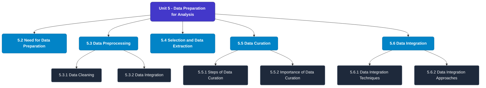

# MCS-062: Introduction to Data Science
## Unit 5: Data Preparation for Analysis

> 📚 **Programme:** M.Sc. (Data Science and Analytics) | **Semester:** Semester 1  
> ⏱️ **Estimated Study Time:** ~51 mins | 📄 **Textbook Pages:** 25 Pages  
> 📥 **Original PDF:** [Download & View Textbook](../../../pdfs/Semester_1/MCS-062_Introduction_to_Data_Science/Unit-5_Data_Preparation_for_Analysis.pdf)

---

### 🎯 Executive Concept & Data Science Relevance
In modern data systems, **Data Preparation for Analysis** forms a vital conceptual pillar. Descriptive statistics provide quantitative summaries of dataset properties. Measures of central tendency identify typical values, while measures of dispersion quantify data spread, uncertainty, and variability—critical for feature normalization and anomaly detection.

> [!NOTE]
> **Why this matters for your career:** Mastering data preparation for analysis equips you with the foundational principles required to reason mathematically about high-dimensional datasets, evaluate algorithm performance, and avoid statistical pitfalls in production machine learning pipelines.

### 🗺️ Visual Knowledge Architecture
The following concept map illustrates the structural hierarchy and learning trajectory of this module:

### 📖 Core Definitions & Terminology Cards
| Term | Formal Mathematical / Technical Definition | Intuitive Analogy / Concrete Example |
| :--- | :--- | :--- |
| **Arithmetic Mean $\bar{x}$ or $\mu$** | The sum of all observations divided by the total number of observations: $\bar{x} = \frac{1}{n}\sum_{i=1}^n x_i$. Sensitive to extreme outliers. | *The center of mass or balance point of the distribution.* |
| **Median** | The physical middle value separating the higher half from the lower half of an ordered dataset. Robust against outliers. | *The 50th percentile value where exactly half the data lies above and half below.* |
| **Standard Deviation $\sigma$ or $s$** | The square root of variance, measuring average dispersion in original units: $s = \sqrt{\frac{1}{n-1}\sum (x_i - \bar{x})^2}$. | *The typical distance data points deviate from the mean.* |
| **Coefficient of Variation ($CV$)** | Relative dispersion measure expressed as a percentage: $CV = \frac{\sigma}{\mu} \times 100\%$. Enables comparison across different measurement scales. | *Comparing stock volatility across assets priced at $10 vs $1,000.* |

### ⚡ Governing Mathematical Laws & Formula Cheatsheet
#### 🔹 Sample Variance Formula (Bessel's Correction)
$$s^2 = \frac{1}{n - 1} \sum_{i=1}^n (x_i - \bar{x})^2 = \frac{\sum x_i^2 - \frac{(\sum x_i)^2}{n}}{n - 1}$$
- **Explanation:** Using $n-1$ in the denominator corrects for downward sample bias, yielding an unbiased estimator of population variance $\sigma^2$.

#### 🔹 Interquartile Range (IQR) & Outlier Bounds
$$\text{IQR} = Q_3 - Q_1, \quad \text{Outliers} < Q_1 - 1.5(\text{IQR}) \;\lor\; > Q_3 + 1.5(\text{IQR})$$
- **Explanation:** Standard Tukey boxplot rule for identifying extreme data points robustly.

#### 🔹 Pearson's First Coefficient of Skewness
$$Sk_1 = \frac{\text{Mean} - \text{Mode}}{\sigma} \quad \text{or} \quad Sk_2 = \frac{3(\text{Mean} - \text{Median})}{\sigma}$$
- **Explanation:** Measures asymmetry: Positive skew means mean > median (right tail); negative skew means mean < median (left tail).

### 📌 Detailed Section-by-Section Study Breakdown
#### `5.2` Need for Data Preparation
- **Core Concept:** Establishes rigorous theoretical formulations and computational bounds for need for data preparation.
- **Core Concept:** Applies standard algorithmic procedures and mathematical invariants relevant to data preparation for analysis.
- **Core Concept:** Ensures deterministic performance guarantees across high-dimensional feature spaces.
- **Data Science Application:** Provides foundational structures used directly in statistical modeling, query execution, and machine learning pipelines.

> [!TIP]
> **Exam & Interview Tip:** Be prepared to state the formal definition of need for data preparation and derive its primary equations step-by-step.

#### `5.3` Data Preprocessing
- **Core Concept:** Preprocessing is the process of taking raw data and turning it into information that may be used for data analysis.
- **Core Concept:** In addition, data discretization is another component of data preprocessing.
- **Core Concept:** You may refer to the further readings for more details on data discretization.
- **Data Science Application:** Provides foundational structures used directly in statistical modeling, query execution, and machine learning pipelines.

> [!TIP]
> **Exam & Interview Tip:** Be prepared to state the formal definition of data preprocessing and derive its primary equations step-by-step.

#### `5.3.1` Data Cleaning
- **Core Concept:** Data cleaning is an essential step in data preprocessing.
- **Core Concept:** It is crucial for the construction of a good analysis model.
- **Core Concept:** Data cleaning is a required but frequently overlooked aspect of data preprocessing.
- **Data Science Application:** Provides foundational structures used directly in statistical modeling, query execution, and machine learning pipelines.

> [!TIP]
> **Exam & Interview Tip:** Be prepared to state the formal definition of data cleaning and derive its primary equations step-by-step.

#### `5.3.2` Data Integration
- **Core Concept:** Data from many sources, such as files, data cubes, databases (both relational and non-relational), etc., may be combined before a machine learning algorithm can use it as training or test data.
- **Core Concept:** The data from the sources may have the following characteristics: · The data sources may be homogeneous or heterogeneous.
- **Core Concept:** · The data sources may contain structured, unstructured, or semi- structured data.
- **Data Science Application:** Provides foundational structures used directly in statistical modeling, query execution, and machine learning pipelines.

> [!TIP]
> **Exam & Interview Tip:** Be prepared to state the formal definition of data integration and derive its primary equations step-by-step.

#### `5.3.3` Data Reduction
- **Core Concept:** The number of records, attributes, or dimensions can be reduced.
- **Core Concept:** When reducing data, one should keep in mind that the outcomes from the reduced data should be identical to those from the original data.
- **Core Concept:** Consider that you have chosen some data for analysis from ABC Company's data warehouse.
- **Data Science Application:** Provides foundational structures used directly in statistical modeling, query execution, and machine learning pipelines.

> [!TIP]
> **Exam & Interview Tip:** Be prepared to state the formal definition of data reduction and derive its primary equations step-by-step.

#### `5.3.4` Data Transformation
- **Core Concept:** This procedure is used to change the data into formats that are suited for the analytical process.
- **Core Concept:** Data transformation involves transforming or consolidating the data into analysis-ready formats.
- **Core Concept:** The following are some data transformation strategies: a.
- **Data Science Application:** Provides foundational structures used directly in statistical modeling, query execution, and machine learning pipelines.

> [!TIP]
> **Exam & Interview Tip:** Be prepared to state the formal definition of data transformation and derive its primary equations step-by-step.

### 💡 Interactive Self-Assessment Checkpoints
Test your comprehension before proceeding. Tap each question to reveal the comprehensive explanation:

<b>Checkpoint 1:</b> Why is sample variance divided by $n-1$ instead of $n$? <i>(Tap to reveal answer)</i>

> **Answer & Analysis:**  
> Dividing by $n-1$ applies **Bessel's correction**, which removes downward bias caused by using the sample mean $\bar{x}$ instead of the true population mean $\mu$.

<b>Checkpoint 2:</b> Which measure of central tendency is most robust to extreme outliers? <i>(Tap to reveal answer)</i>

> **Answer & Analysis:**  
> The **Median**, because it depends on positional rank rather than magnitude summation.

<b>Checkpoint 3:</b> In a right-skewed (positively skewed) distribution, what is the order of Mean, Median, and Mode? <i>(Tap to reveal answer)</i>

> **Answer & Analysis:**  
> $\text{Mode} < \text{Median} < \text{Mean}$.

<b>Checkpoint 4:</b> What is meant by data preprocessing? <i>(Tap to reveal answer)</i>

> **Answer & Analysis:**  
> This question tests your conceptual mastery of Data Preparation for Analysis. Review the governing formulas and section breakdowns above to formulate a complete, rigorous proof or derivation.

<b>Checkpoint 5:</b> Why is preprocessing important? <i>(Tap to reveal answer)</i>

> **Answer & Analysis:**  
> This question tests your conceptual mastery of Data Preparation for Analysis. Review the governing formulas and section breakdowns above to formulate a complete, rigorous proof or derivation.

<b>Checkpoint 6:</b> What are the 5 characteristics of data processing? <i>(Tap to reveal answer)</i>

> **Answer & Analysis:**  
> This question tests your conceptual mastery of Data Preparation for Analysis. Review the governing formulas and section breakdowns above to formulate a complete, rigorous proof or derivation.

### 🎯 Executive Module Wrap-Up
- **Central Idea:** Data Preparation for Analysis provides essential mathematical and algorithmic tools directly utilized in Data Science.
- **Mathematical Rigor:** Formulas and laws must be memorized with attention to boundary conditions and assumptions.
- **Full Textbook Coverage:** For exhaustive multi-page derivations, proofs, and supplementary exercises, consult the [Authentic IGNOU Textbook](../../../pdfs/Semester_1/MCS-062_Introduction_to_Data_Science/Unit-5_Data_Preparation_for_Analysis.pdf).

---
### 🧭 Navigation & Syllabus Index
[⬅ Previous: Unit 4](unit_04_Data_Acquisition_(DAQ)_Process.md) | [📑 Course Index](README.md) | [Next: Unit 6 ➡](unit_06_Descriptive_and_Exploratory_Data_Analysis_-_An_Int.md)
