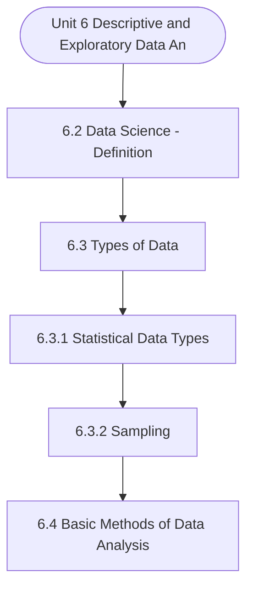

# MCS-062: Introduction to Data Science
## Unit 6: Descriptive and Exploratory Data Analysis - An Introduction

> 📚 **Programme:** M.Sc. (Data Science and Analytics) | **Semester:** Semester 1  
> ⏱️ **Estimated Study Time:** ~27 mins | 📄 **Textbook Pages:** 16 Pages  
> 📥 **Original PDF:** [Download & View Textbook](../../../pdfs/Semester_1/MCS-062_Introduction_to_Data_Science/Unit-6_Descriptive_and_Exploratory_Data_Analysis_-_An_Introduction.pdf)

---

### 🎯 Executive Concept & Data Science Relevance
In modern data systems, **Descriptive and Exploratory Data Analysis - An Introduction** forms a vital conceptual pillar. Descriptive statistics provide quantitative summaries of dataset properties. Measures of central tendency identify typical values, while measures of dispersion quantify data spread, uncertainty, and variability—critical for feature normalization and anomaly detection.

> [!NOTE]
> **Why this matters for your career:** Mastering descriptive and exploratory data analysis - an introduction equips you with the foundational principles required to reason mathematically about high-dimensional datasets, evaluate algorithm performance, and avoid statistical pitfalls in production machine learning pipelines.

### 🗺️ Visual Knowledge Architecture
The following concept map illustrates the structural hierarchy and learning trajectory of this module:

### 📖 Core Definitions & Terminology Cards

> 📌 **Arithmetic Mean $\bar{x}$ or $\mu$**  
> - **Formal Definition:** The sum of all observations divided by the total number of observations: $\bar{x} = \frac{1}{n}\sum_{i=1}^n x_i$. Sensitive to extreme outliers.  
> - 💡 **Practical Intuition & Analogy:** *The center of mass or balance point of the distribution.*

> 📌 **Median**  
> - **Formal Definition:** The physical middle value separating the higher half from the lower half of an ordered dataset. Robust against outliers.  
> - 💡 **Practical Intuition & Analogy:** *The 50th percentile value where exactly half the data lies above and half below.*

> 📌 **Standard Deviation $\sigma$ or $s$**  
> - **Formal Definition:** The square root of variance, measuring average dispersion in original units: $s = \sqrt{\frac{1}{n-1}\sum (x_i - \bar{x})^2}$.  
> - 💡 **Practical Intuition & Analogy:** *The typical distance data points deviate from the mean.*

> 📌 **Coefficient of Variation ($CV$)**  
> - **Formal Definition:** Relative dispersion measure expressed as a percentage: $CV = \frac{\sigma}{\mu} \times 100\%$. Enables comparison across different measurement scales.  
> - 💡 **Practical Intuition & Analogy:** *Comparing stock volatility across assets priced at 10 USD vs 1,000 USD.*

### ⚡ Governing Mathematical Laws & Formula Cheatsheet
#### 🔹 Sample Variance Formula (Bessel's Correction)
$$
\begin{aligned} s^2 & = \frac{1}{n - 1} \sum_{i=1}^n (x_i - \bar{x})^2 \\ & = \frac{\sum x_i^2 - \frac{(\sum x_i)^2}{n}}{n - 1} \end{aligned}
$$
- **Explanation:** Using $n-1$ in the denominator corrects for downward sample bias, yielding an unbiased estimator of population variance $\sigma^2$.

#### 🔹 Interquartile Range (IQR) & Outlier Bounds
$$
\text{IQR} = Q_3 - Q_1, \quad \text{Outliers} < Q_1 - 1.5(\text{IQR}) \;\lor\; > Q_3 + 1.5(\text{IQR})
$$
- **Explanation:** Standard Tukey boxplot rule for identifying extreme data points robustly.

#### 🔹 Pearson's First Coefficient of Skewness
$$
Sk_1 = \frac{\text{Mean} - \text{Mode}}{\sigma} \quad \text{or} \quad Sk_2 = \frac{3(\text{Mean} - \text{Median})}{\sigma}
$$
- **Explanation:** Measures asymmetry: Positive skew means mean > median (right tail); negative skew means mean < median (left tail).

### 📌 Detailed Section-by-Section Study Breakdown
#### `6.2` Data Science - Definition
- **Core Concept:** Establishes theoretical foundations, axiomatic formulations, and properties of data science - definition.
- **Core Concept:** Analyzes standard algorithmic workflows and mathematical transformations relevant to descriptive and exploratory data analysis - an introduction.
- **Core Concept:** Applies computational bounds and optimization guarantees across data processing workflows.
- **Data Science Application:** Provides foundational structures used directly in statistical modeling, query execution, and machine learning pipelines.

> [!TIP]
> **Exam & Interview Tip:** Be prepared to state the formal definition of data science - definition and derive its primary equations step-by-step.

#### `6.3` Types of Data
- **Core Concept:** The type of data is one of the essential aspects determining the kind of analysis that can be performed on data.
- **Core Concept:** In data science, the following are the different types of data that are required to be processed: 1.
- **Core Concept:** Data Streams Structured Data Since the start of the era of computing, the computer has been used as a data processing device.
- **Data Science Application:** Provides foundational structures used directly in statistical modeling, query execution, and machine learning pipelines.

> [!TIP]
> **Exam & Interview Tip:** Be prepared to state the formal definition of types of data and derive its primary equations step-by-step.

#### `6.3.1` Statistical Data Types
- **Core Concept:** Two distinct types of data can be used in statistical analysis.
- **Core Concept:** These are – Categorical data and Quantitative data.
- **Core Concept:** Categorical or qualitative Data: Categorical data identifies the category of data.
- **Data Science Application:** Provides foundational structures used directly in statistical modeling, query execution, and machine learning pipelines.

> [!TIP]
> **Exam & Interview Tip:** Be prepared to state the formal definition of statistical data types and derive its primary equations step-by-step.

#### `6.3.2` Sampling
- **Core Concept:** In general, the size of the data that is to be processed is quite large.
- **Core Concept:** This leads you to the question: whether you would use the entire data or some representative sample of this data?.
- **Core Concept:** In several data science techniques, sample data is used to develop an exploratory model.
- **Data Science Application:** Provides foundational structures used directly in statistical modeling, query execution, and machine learning pipelines.

> [!TIP]
> **Exam & Interview Tip:** Be prepared to state the formal definition of sampling and derive its primary equations step-by-step.

#### `6.4` Basic Methods of Data Analysis
- **Core Concept:** Summary and Interquartile Range (IQR) To create a 5-point summary, first, you need to sort the data.
- **Core Concept:** or Values > (18.5 – 9) or Values > 27.5.
- **Core Concept:** Thus, there is no outlier in the initial data of Example 2.
- **Data Science Application:** Provides foundational structures used directly in statistical modeling, query execution, and machine learning pipelines.

> [!TIP]
> **Exam & Interview Tip:** Be prepared to state the formal definition of basic methods of data analysis and derive its primary equations step-by-step.

#### `6.4.1` Descriptive Analysis
- **Core Concept:** Descriptive analysis is used to present basic data summaries; however, it does not attempt to interpret the data.
- **Core Concept:** These summaries may include different statistical values and certain graphs.
- **Core Concept:** Different types of data are described using different ways.
- **Data Science Application:** Provides foundational structures used directly in statistical modeling, query execution, and machine learning pipelines.

> [!TIP]
> **Exam & Interview Tip:** Be prepared to state the formal definition of descriptive analysis and derive its primary equations step-by-step.

### 💡 Interactive Self-Assessment Checkpoints
Test your comprehension before proceeding. Tap each question to reveal the comprehensive explanation:

<b>Checkpoint 1:</b> Why is sample variance divided by $n-1$ instead of $n$? <i>(Tap to reveal answer)</i>

> **Answer & Analysis:**  
> Dividing by $n-1$ applies **Bessel's correction**, which removes downward bias caused by using the sample mean $\bar{x}$ instead of the true population mean $\mu$.

<b>Checkpoint 2:</b> Which measure of central tendency is most robust to extreme outliers? <i>(Tap to reveal answer)</i>

> **Answer & Analysis:**  
> The **Median**, because it depends on positional rank rather than magnitude summation.

<b>Checkpoint 3:</b> In a right-skewed (positively skewed) distribution, what is the order of Mean, Median, and Mode? <i>(Tap to reveal answer)</i>

> **Answer & Analysis:**  
> $\text{Mode} < \text{Median} < \text{Mean}$.

<b>Checkpoint 4:</b> Define the term data science. <i>(Tap to reveal answer)</i>

> **Answer & Analysis:**  
> This question tests your conceptual mastery of Descriptive and Exploratory Data Analysis - An Introduction. Review the governing formulas and section breakdowns above to formulate a complete, rigorous proof or derivation.

<b>Checkpoint 5:</b> Differentiate between structured, semi-structured, unstructured and stream data. <i>(Tap to reveal answer)</i>

> **Answer & Analysis:**  
> This question tests your conceptual mastery of Descriptive and Exploratory Data Analysis - An Introduction. Review the governing formulas and section breakdowns above to formulate a complete, rigorous proof or derivation.

<b>Checkpoint 6:</b> What would be the measurement scale for the following? Give reasons in support of your answer.   Sample Population <i>(Tap to reveal answer)</i>

> **Answer & Analysis:**  
> This question tests your conceptual mastery of Descriptive and Exploratory Data Analysis - An Introduction. Review the governing formulas and section breakdowns above to formulate a complete, rigorous proof or derivation.

### 🎯 Executive Module Wrap-Up
- **Central Idea:** Descriptive and Exploratory Data Analysis - An Introduction provides essential mathematical and algorithmic tools directly utilized in Data Science.
- **Mathematical Rigor:** Formulas and laws must be memorized with attention to boundary conditions and assumptions.
- **Full Textbook Coverage:** For exhaustive multi-page derivations, proofs, and supplementary exercises, consult the [Authentic IGNOU Textbook](../../../pdfs/Semester_1/MCS-062_Introduction_to_Data_Science/Unit-6_Descriptive_and_Exploratory_Data_Analysis_-_An_Introduction.pdf).

---
### 🧭 Navigation & Syllabus Index
[⬅ Previous: Unit 5](unit_05_Data_Preparation_for_Analysis.md) | [📑 Course Index](README.md) | [Next: Unit 7 ➡](unit_07_Inferential_and_Predictive_Data_Analysis_-_An_Intr.md)
