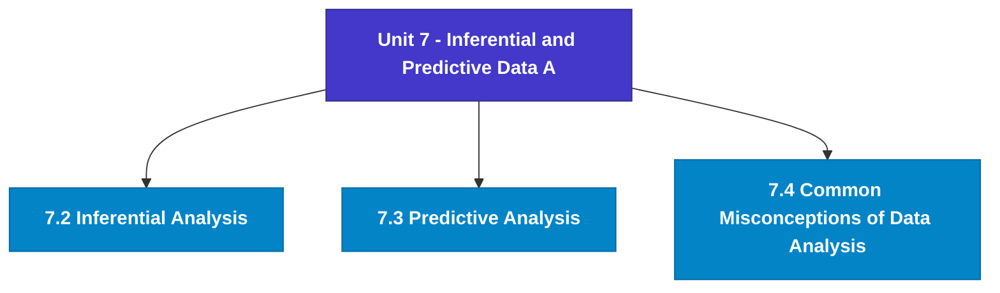

# MCS-062: Introduction to Data Science
## Unit 7: Inferential and Predictive Data Analysis - An Introduction

> 📚 **Programme:** M.Sc. (Data Science and Analytics) | **Semester:** Semester 1  
> ⏱️ **Estimated Study Time:** ~36 mins | 📄 **Textbook Pages:** 17 Pages  
> 📥 **Original PDF:** [Download & View Textbook](../../../pdfs/Semester_1/MCS-062_Introduction_to_Data_Science/Unit-7_Inferential_and_Predictive_Data_Analysis_-_An_Introduction.pdf)

---

### 🎯 Executive Concept & Data Science Relevance
In modern data systems, **Inferential and Predictive Data Analysis - An Introduction** forms a vital conceptual pillar. Regression analysis estimates relationships between dependent targets and independent explanatory variables. Linear models, regularization penalties, and gradient updates form the computational core of supervised machine learning.

> [!NOTE]
> **Why this matters for your career:** Mastering inferential and predictive data analysis - an introduction equips you with the foundational principles required to reason mathematically about high-dimensional datasets, evaluate algorithm performance, and avoid statistical pitfalls in production machine learning pipelines.

### 🗺️ Visual Knowledge Architecture
The following concept map illustrates the structural hierarchy and learning trajectory of this module:

### 📖 Core Definitions & Terminology Cards
| Term | Formal Mathematical / Technical Definition | Intuitive Analogy / Concrete Example |
| :--- | :--- | :--- |
| **Ordinary Least Squares (OLS)** | Estimation method that minimizes the sum of squared differences (residuals) between observed values and predictions: $\min_\beta \sum (y_i - \hat{y}_i)^2$. | *Finding the single line that minimizes total vertical squared distance to all data points.* |
| **Coefficient of Determination ($R^2$)** | The proportion of variance in the dependent variable explained by independent features: $R^2 = 1 - \frac{SS_{\text{res}}}{SS_{\text{tot}}}$. Ranges from 0 to 1. | *An $R^2 = 0.85$ means 85% of target variability is captured by your model.* |
| **Ridge Regularization ($L_2$)** | Adds squared magnitude penalty to the loss function: $\mathcal{L} + \lambda \sum_{j=1}^p \beta_j^2$. Shrinks weights toward zero to prevent overfitting under multicollinearity. | *Discourages extreme weight spikes without setting any coefficient entirely to zero.* |
| **Lasso Regularization ($L_1$)** | Adds absolute magnitude penalty to the loss function: $\mathcal{L} + \lambda \sum_{j=1}^p \vert\beta_j\vert$. Drives non-essential coefficients exactly to zero, performing automated feature selection. | *Selects a sparse subset of impactful features by zeroing out noise variables.* |

### ⚡ Governing Mathematical Laws & Formula Cheatsheet
#### 🔹 Simple Linear Regression OLS Parameters

$$
\hat{\beta}_1 = \frac{\sum (x_i - \bar{x})(y_i - \bar{y})}{\sum (x_i - \bar{x})^2} = \frac{\text{Cov}(x, y)}{\text{Var}(x)}, \quad \hat{\beta}_0 = \bar{y} - \hat{\beta}_1 \bar{x}
$$

- **Explanation:** Closed-form slope and intercept formulas for single-feature linear regression.

#### 🔹 Multiple Linear Regression Normal Equation

$$
\hat{\mathbf{\beta}} = (\mathbf{X}^T \mathbf{X})^{-1} \mathbf{X}^T \mathbf{y}
$$

- **Explanation:** Direct analytic matrix solution for OLS regression weights.

#### 🔹 Ridge Regression Closed-Form Estimator

$$
\hat{\mathbf{\beta}}_{\text{Ridge}} = (\mathbf{X}^T \mathbf{X} + \lambda \mathbf{I})^{-1} \mathbf{X}^T \mathbf{y}
$$

- **Explanation:** Adding $\lambda \mathbf{I}$ ensures invertibility even when $\mathbf{X}^T \mathbf{X}$ is ill-conditioned or collinear.

#### 🔹 Logistic Regression Sigmoid Function

$$
P(Y = 1 \mid X = \mathbf{x}) = \sigma(\mathbf{w}^T \mathbf{x} + b) = \frac{1}{1 + e^{-(\mathbf{w}^T \mathbf{x} + b)}}
$$

- **Explanation:** Maps any real-valued linear score into a calibrated probability interval $[0, 1]$.

### 📌 Detailed Section-by-Section Study Breakdown
#### `7.2` Inferential Analysis
- **Core Concept:** Establishes rigorous theoretical formulations and computational bounds for inferential analysis.
- **Core Concept:** Applies standard algorithmic procedures and mathematical invariants relevant to inferential and predictive data analysis - an introduction.
- **Core Concept:** Ensures deterministic performance guarantees across high-dimensional feature spaces.
- **Data Science Application:** Provides foundational structures used directly in statistical modeling, query execution, and machine learning pipelines.

> [!TIP]
> **Exam & Interview Tip:** Be prepared to state the formal definition of inferential analysis and derive its primary equations step-by-step.

#### `7.3` Predictive Analysis
- **Core Concept:** Predictive Data Analysis involves predictions about future or unknown events using historical data to make.
- **Core Concept:** It combines statistical techniques, data mining, and machine learning algorithms to identify patterns and relationships in data.
- **Core Concept:** These patterns are then used to build models that can forecast outcomes with a certain level of confidence.
- **Data Science Application:** Provides foundational structures used directly in statistical modeling, query execution, and machine learning pipelines.

> [!TIP]
> **Exam & Interview Tip:** Be prepared to state the formal definition of predictive analysis and derive its primary equations step-by-step.

#### `7.4` Common Misconceptions of Data Analysis
- **Core Concept:** Understanding data correctly is essential for making sound decisions in business, science, policy, and everyday life.
- **Core Concept:** However, several widespread misconceptions can lead to inaccurate conclusions or misleading results.
- **Core Concept:** Three of the most common misconceptions in data analysis are the confusion between correlation and causation, the misinterpretation of trends due to Simpson’s Paradox, and the misuse of statistical testing through data dredging.
- **Data Science Application:** Provides foundational structures used directly in statistical modeling, query execution, and machine learning pipelines.

> [!TIP]
> **Exam & Interview Tip:** Be prepared to state the formal definition of common misconceptions of data analysis and derive its primary equations step-by-step.

### 💡 Interactive Self-Assessment Checkpoints
Test your comprehension before proceeding. Tap each question to reveal the comprehensive explanation:

<b>Checkpoint 1:</b> What is the key difference between Ridge ($L_2$) and Lasso ($L_1$) regression? <i>(Tap to reveal answer)</i>

> **Answer & Analysis:**  
> Ridge shrinks coefficients continuously toward zero without zeroing them out, whereas Lasso drives coefficients to exactly zero, producing sparse models and automated feature selection.

<b>Checkpoint 2:</b> What is the matrix Normal Equation for Ordinary Least Squares? <i>(Tap to reveal answer)</i>

> **Answer & Analysis:**  
> $\hat{\mathbf{\beta}} = (\mathbf{X}^T \mathbf{X})^{-1} \mathbf{X}^T \mathbf{y}$

<b>Checkpoint 3:</b> What does a high Variance Inflation Factor (VIF > 5) indicate? <i>(Tap to reveal answer)</i>

> **Answer & Analysis:**  
> Severe **multicollinearity**, meaning independent features are highly correlated with each other, destabilizing coefficient estimation.

<b>Checkpoint 4:</b> What is the main objective of inferential data analysis? <i>(Tap to reveal answer)</i>

> **Answer & Analysis:**  
> This question tests your conceptual mastery of Inferential and Predictive Data Analysis - An Introduction. Review the governing formulas and section breakdowns above to formulate a complete, rigorous proof or derivation.

<b>Checkpoint 5:</b> How does a confidence interval help in inference? <i>(Tap to reveal answer)</i>

> **Answer & Analysis:**  
> This question tests your conceptual mastery of Inferential and Predictive Data Analysis - An Introduction. Review the governing formulas and section breakdowns above to formulate a complete, rigorous proof or derivation.

<b>Checkpoint 6:</b> When is a t-test preferred over a z-test? <i>(Tap to reveal answer)</i>

> **Answer & Analysis:**  
> This question tests your conceptual mastery of Inferential and Predictive Data Analysis - An Introduction. Review the governing formulas and section breakdowns above to formulate a complete, rigorous proof or derivation.

### 🎯 Executive Module Wrap-Up
- **Central Idea:** Inferential and Predictive Data Analysis - An Introduction provides essential mathematical and algorithmic tools directly utilized in Data Science.
- **Mathematical Rigor:** Formulas and laws must be memorized with attention to boundary conditions and assumptions.
- **Full Textbook Coverage:** For exhaustive multi-page derivations, proofs, and supplementary exercises, consult the [Authentic IGNOU Textbook](../../../pdfs/Semester_1/MCS-062_Introduction_to_Data_Science/Unit-7_Inferential_and_Predictive_Data_Analysis_-_An_Introduction.pdf).

---
### 🧭 Navigation & Syllabus Index
[⬅ Previous: Unit 6](unit_06_Descriptive_and_Exploratory_Data_Analysis_-_An_Int.md) | [📑 Course Index](README.md) | [Next: Unit 8 ➡](unit_08_Data_Visualisation_and_Interpretation.md)
