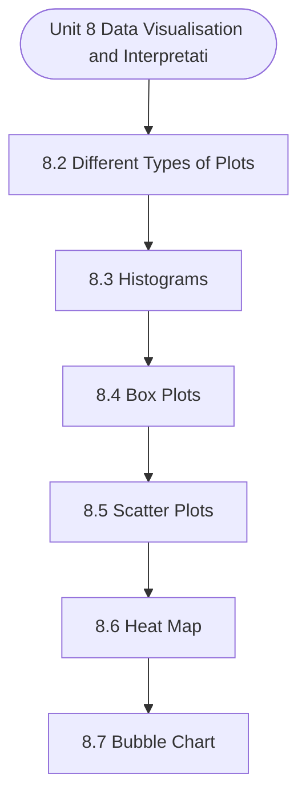

# MCS-062: Introduction to Data Science
## Unit 8: Data Visualisation and Interpretation

> 📚 **Programme:** M.Sc. (Data Science and Analytics) | **Semester:** Semester 1  
> ⏱️ **Estimated Study Time:** ~59 mins | 📄 **Textbook Pages:** 49 Pages  
> 📥 **Original PDF:** [Download & View Authentic Textbook](../../../pdfs/Semester_1/MCS-062_Introduction_to_Data_Science/Unit-8_Data_Visualisation_and_Interpretation.pdf)

---

### 🎯 Executive Concept & Data Science Relevance
In modern data systems and advanced analytics, **Data Visualisation and Interpretation** forms a vital conceptual pillar. Descriptive statistics provide quantitative summaries of dataset properties. Measures of central tendency identify typical values, while measures of dispersion quantify data spread, uncertainty, and variability—critical for feature normalization and anomaly detection.

> [!NOTE]
> **Why this matters for your career:** Mastering data visualisation and interpretation equips you with the foundational principles required to reason mathematically about high-dimensional datasets, evaluate algorithm performance, and avoid statistical pitfalls in production machine learning pipelines.

### 🗺️ Visual Knowledge Architecture
The following concept map illustrates the structural hierarchy and learning trajectory of this module:



### 📖 Core Definitions & Terminology Cards

> 📌 **Arithmetic Mean $\bar{x}$ or $\mu$**  
> - **Formal Definition:** The sum of all observations divided by the total number of observations: $\bar{x} = \frac{1}{n}\sum_{i=1}^n x_i$. Sensitive to extreme outliers.  
> - 💡 **Practical Intuition & Analogy:** *The center of mass or balance point of the distribution.*

> 📌 **Median**  
> - **Formal Definition:** The physical middle value separating the higher half from the lower half of an ordered dataset. Robust against outliers.  
> - 💡 **Practical Intuition & Analogy:** *The 50th percentile value where exactly half the data lies above and half below.*

> 📌 **Standard Deviation $\sigma$ or $s$**  
> - **Formal Definition:** The square root of variance, measuring average dispersion in original units: $s = \sqrt{\frac{1}{n-1}\sum (x_i - \bar{x})^2}$.  
> - 💡 **Practical Intuition & Analogy:** *The typical distance data points deviate from the mean.*

> 📌 **Coefficient of Variation ($CV$)**  
> - **Formal Definition:** Relative dispersion measure expressed as a percentage: $CV = \frac{\sigma}{\mu} \times 100\%$. Enables comparison across different measurement scales.  
> - 💡 **Practical Intuition & Analogy:** *Comparing stock volatility across assets priced at 10 USD vs 1,000 USD.*

### ⚡ Governing Mathematical Laws & Formula Cheatsheet
#### 🔹 Sample Variance Formula (Bessel's Correction)
$$
\begin{aligned} s^2 & = \frac{1}{n - 1} \sum_{i=1}^n (x_i - \bar{x})^2 \\ & = \frac{\sum x_i^2 - \frac{(\sum x_i)^2}{n}}{n - 1} \end{aligned}
$$
- **Explanation:** Using $n-1$ in the denominator corrects for downward sample bias, yielding an unbiased estimator of population variance $\sigma^2$.

#### 🔹 Interquartile Range (IQR) & Outlier Bounds
$$
\text{IQR} = Q_3 - Q_1, \quad \text{Outliers} < Q_1 - 1.5(\text{IQR}) \;\lor\; > Q_3 + 1.5(\text{IQR})
$$
- **Explanation:** Standard Tukey boxplot rule for identifying extreme data points robustly.

#### 🔹 Pearson's First Coefficient of Skewness
$$
Sk_1 = \frac{\text{Mean} - \text{Mode}}{\sigma} \quad \text{or} \quad Sk_2 = \frac{3(\text{Mean} - \text{Median})}{\sigma}
$$
- **Explanation:** Measures asymmetry: Positive skew means mean > median (right tail); negative skew means mean < median (left tail).

### ⚖️ Axiomatic Properties & Governing Laws
The mathematical formulations of this module are anchored by foundational algebraic and structural laws:

- **Variance Scaling Rule:** $\text{Var}(aX + b) = a^2 \text{Var}(X)$
- **Standard Deviation Scaling:** $\sigma(aX + b) = \vert a\vert \sigma(X)$
- **Empirical Rule (Normal Distribution):** 68% within $\mu \pm 1\sigma$, 95% within $\mu \pm 2\sigma$, 99.7% within $\mu \pm 3\sigma$

### 📌 Comprehensive Section-by-Section Study Breakdown
#### `8.2` Different Types of Plots

##### 📘 Theoretical Principles & Pedagogical Exposition
In modern data science engineering, **Different Types of Plots** forms a vital foundational building block. Within **Data Visualisation and Interpretation**, this section establishes analytical rigor, reproducible data processing methodologies, and computational guarantees required for production pipelines.

##### ⚙️ Mathematical & Algorithmic Mechanics
- **Core Mechanism:** Establishes analytical principles and computational workflows for data visualisation and interpretation.
- **Boundary Conditions:** Missing data values, extreme outliers, and non-standard data types.

##### 📊 Practical Data Science & Production Relevance
- **Production Workflow:** End-to-end data science processing stacks (Pandas, Scikit-learn, PyTorch).
- **Real-World Pitfall:** Failing to validate inputs before feeding data into production analytics pipelines.

> [!TIP]
> **Exam & Technical Interview Insight:** Define key concepts in different types of plots and articulate practical applications in real-world scenarios.

#### `8.3` Histograms

##### 📘 Theoretical Principles & Pedagogical Exposition
In modern data science engineering, **Histograms** forms a vital foundational building block. Within **Data Visualisation and Interpretation**, this section establishes analytical rigor, reproducible data processing methodologies, and computational guarantees required for production pipelines.

##### ⚙️ Mathematical & Algorithmic Mechanics
- **Core Mechanism:** Establishes analytical principles and computational workflows for data visualisation and interpretation.
- **Boundary Conditions:** Missing data values, extreme outliers, and non-standard data types.

##### 📊 Practical Data Science & Production Relevance
- **Production Workflow:** End-to-end data science processing stacks (Pandas, Scikit-learn, PyTorch).
- **Real-World Pitfall:** Failing to validate inputs before feeding data into production analytics pipelines.

> [!TIP]
> **Exam & Technical Interview Insight:** Define key concepts in histograms and articulate practical applications in real-world scenarios.

#### `8.4` Box Plots

##### 📘 Theoretical Principles & Pedagogical Exposition
BOX PLOTS Box-and-whisker plots, also known as box plots, are widely employed when displaying data distributions using the five essential summary statistics of minimum, first quartile, median, third quartile, and maximum. It is a visual depiction of data that aids in determining how widely distributed or how much the data values change.

These box plots make it simple to compare the 20-25 26-30 31-35 36-40 41-45 46-50 Population Size Age Group (Bins) Population data of a group of 100 people Histogram Data Visualization and Interpretation distributions since it makes the centre, spread, and overall range understandable.

They are utilised for data analysis wherein the graphical representations are used to determine the following: 1. Shape of Distribution 2. Variability of Data Constructing a Box plot: The two components of the graphic are described by their names: the box, which shows the median value of data along with the first and third quartiles (25 percentile and 75 percentile), and the whiskers, which shows the remaining data.


##### ⚙️ Mathematical & Algorithmic Mechanics
- **Core Mechanism:** Establishes analytical principles and computational workflows for data visualisation and interpretation.
- **Boundary Conditions:** Missing data values, extreme outliers, and non-standard data types.

##### 📊 Practical Data Science & Production Relevance
- **Production Workflow:** End-to-end data science processing stacks (Pandas, Scikit-learn, PyTorch).
- **Real-World Pitfall:** Failing to validate inputs before feeding data into production analytics pipelines.

> [!TIP]
> **Exam & Technical Interview Insight:** Define key concepts in box plots and articulate practical applications in real-world scenarios.

#### `8.5` Scatter Plots

##### 📘 Theoretical Principles & Pedagogical Exposition
SCATTER PLOTS A scatter plot is the most commonly used chart when observing the relationship between two quantitative variables. It works particularly well for quickly identifying possible correlations between different data points. The relationship between multiple variables can be efficiently studied using scatter plots, which show whether one variable is a good predictor of another or whether they normally fluctuate independently.

Multiple distinct data points are displayed on a single graph in a scatter plot. Following that, the chart can be enhanced with analytics like trend lines or cluster analysis. It is especially useful for quickly identifying potential correlations between data points. Constructing a Scatter Plot: Scatter plots are mathematical diagrams or plots that rely on Cartesian coordinates.

In this type of graph, the categories being compared are represented by the circles on the chart (shown by the colour of the circles) and the numerical volume of the data (indicated by the circle size). One colour on the graph allows you to represent two values for two variables related to a data set, but two colours can also be used to include a third variable.


##### ⚙️ Mathematical & Algorithmic Mechanics
- **Core Mechanism:** Establishes analytical principles and computational workflows for data visualisation and interpretation.
- **Boundary Conditions:** Missing data values, extreme outliers, and non-standard data types.

##### 📊 Practical Data Science & Production Relevance
- **Production Workflow:** End-to-end data science processing stacks (Pandas, Scikit-learn, PyTorch).
- **Real-World Pitfall:** Failing to validate inputs before feeding data into production analytics pipelines.

> [!TIP]
> **Exam & Technical Interview Insight:** Define key concepts in scatter plots and articulate practical applications in real-world scenarios.

#### `8.6` Heat Map

##### 📘 Theoretical Principles & Pedagogical Exposition
HEAT MAP Heatmaps are two-dimensional graphics that show data trends through colour shading. They are an example of a part-to-whole chart in which values are represented using colours. A basic heat map offers a quick visual representation of the data. A user can comprehend complex data sets with the help of more intricate heat maps.

Heat maps can be presented in a variety of ways, but they all have one thing in common: they all make use of colour to convey correlations between data values. Heat maps are more frequently utilized to present a more comprehensive view of massive amounts of data. It is especially helpful because colours are simpler to understand and identify than plain numbers.

Heat maps are highly flexible and effective at highlighting trends. Heatmaps are naturally self-explanatory, in contrast to other data visualisations that require interpretation. The greater the quantity/volume, the deeper the colour (or the higher the value, the tighter the dispersion, etc.).


##### ⚙️ Mathematical & Algorithmic Mechanics
- **Core Mechanism:** Establishes analytical principles and computational workflows for data visualisation and interpretation.
- **Boundary Conditions:** Missing data values, extreme outliers, and non-standard data types.

##### 📊 Practical Data Science & Production Relevance
- **Production Workflow:** End-to-end data science processing stacks (Pandas, Scikit-learn, PyTorch).
- **Real-World Pitfall:** Failing to validate inputs before feeding data into production analytics pipelines.

> [!TIP]
> **Exam & Technical Interview Insight:** Define key concepts in heat map and articulate practical applications in real-world scenarios.

#### `8.7` Bubble Chart

##### 📘 Theoretical Principles & Pedagogical Exposition
BUBBLE CHART Bubble diagrams are used to show the relationships between different variables. They are frequently used to represent data points in three dimensions, specifically when the bubble size, y-axis, and x-axis are all present. Bubble charts demonstrate relationships between data points using location and size.

However, bubble charts have a restricted data size capability since too many bubbles can make the chart difficult to read. Although technically not a separate type of visualisation, bubbles can be used to show the relationship between three or more measurements in scatter plots or maps by adding complexity.

By altering the size and colour of circles, large amounts of data are presented concurrently in visually pleasing charts. Data Visualization and Interpretation Constructing a Bubble Chart: For each observation of a pair of numerical variables (A, B), a bubble or disc is drawn and placed in a Cartesian coordinate system horizontally according to the value of variable A and vertically according to the value of variable B.


##### ⚙️ Mathematical & Algorithmic Mechanics
- **Core Mechanism:** Establishes analytical principles and computational workflows for data visualisation and interpretation.
- **Boundary Conditions:** Missing data values, extreme outliers, and non-standard data types.

##### 📊 Practical Data Science & Production Relevance
- **Production Workflow:** End-to-end data science processing stacks (Pandas, Scikit-learn, PyTorch).
- **Real-World Pitfall:** Failing to validate inputs before feeding data into production analytics pipelines.

> [!TIP]
> **Exam & Technical Interview Insight:** Define key concepts in bubble chart and articulate practical applications in real-world scenarios.

#### `8.8` Bar Chart

##### 📘 Theoretical Principles & Pedagogical Exposition
BAR CHART A bar chart is a graphical depiction bars) with equal widths and varied h are one of the methods for handling Constructing a Bar Chart: The x and the y-axis corresponds to t frequency in this graph. Write the to be noted along the horizontal x-a Along the horizontal axis, choose t gap between the bars.

Pick an app runs vertically so that you can figu ₹- ₹5,000.00 ₹10,000.00 ₹15,000.00 ₹20,000.00 ₹25,000.00 ₹30,000.00 Nu Sales and Profit ver BUBBL …………………………………………… …………………………………………… …………………………………………… r? …………………………………………… …………………………………………… …………………………………………… n a scatter plot and a bubble chart?

…………………………………………… …………………………………………… …………………………………………… e chart? …………………………………………… …………………………………………… …………………………………………… n of numerical data that uses rectangles (or heights. In the field of statistics, bar charts g data. x-axis corresponds to the horizontal line, the vertical line. The y-axis represents names of the data items whose values are axis.


##### ⚙️ Mathematical & Algorithmic Mechanics
- **Core Mechanism:** Establishes analytical principles and computational workflows for data visualisation and interpretation.
- **Boundary Conditions:** Missing data values, extreme outliers, and non-standard data types.

##### 📊 Practical Data Science & Production Relevance
- **Production Workflow:** End-to-end data science processing stacks (Pandas, Scikit-learn, PyTorch).
- **Real-World Pitfall:** Failing to validate inputs before feeding data into production analytics pipelines.

> [!TIP]
> **Exam & Technical Interview Insight:** Define key concepts in bar chart and articulate practical applications in real-world scenarios.

#### `8.9` Distribution Plot

##### 📘 Theoretical Principles & Pedagogical Exposition
Visually by contr expected hypothes from the useful fo data and along an your progress 6: en should we use a bar chart? ………………………………………………… ………………………………………………… ………………………………………………… at are the different types of bar charts? ………………………………………………… ………………………………………………… ………………………………………………… w a vertical bar chart.

………………………………………………… ………………………………………………… ………………………………………………… w a horizontal bar chart. ………………………………………………… ………………………………………………… e the following data to answer the questions 3 nth January Februar mber of visitors DISTRIBUTION PLOT y assessing the distribution of sample data, d rasting the actual distribution of the data wi d from a certain distribution.

In additio sis tests, distribution plots can be used to es e sample follows a particular distribution. or analysing the relationship between the ran d its distribution. The values of the data ar n axis. 6,123 2,053 4,181 3,316 - 2,000 4,000 6,000 8,0 East West South North Sales By Region ………………………… ………………………… ………………………… ………………………… ………………………… ………………………… ………………………… ………………………… ………………………… ………………………… ………………………… and 4: ry March distribution charts do this ith the theoretical values on to more traditional stablish whether the data The distribution plot is nge of a set of numerical re represented as points East West South North Data Visualisation and Interpretation Constructing a Distribution Plot: In a distribution plot, you must utilise one or two dimensions together with one measure.


##### ⚙️ Mathematical & Algorithmic Mechanics
- **Core Mechanism:** Probability distributions characterize probability mass (PMF) or density (PDF). The Central Limit Theorem (CLT) establishes that the sample mean of $n$ independent, identically distributed random variables converges to Gaussian $\mathcal{N}(\mu, \sigma^2/n)$ as $n \to \infty$.
- **Boundary Conditions:** Cauchy distributions violating CLT due to undefined variance, extreme skewness in small samples ($n < 30$), and fat-tailed catastrophic risk events.

##### 📊 Practical Data Science & Production Relevance
- **Production Workflow:** Standardizing features via Z-score normalization, anomaly detection using Gaussian Mixture Models, calculating $p$-values in hypothesis testing, and Monte Carlo simulation.
- **Real-World Pitfall:** Assuming Gaussian normality for heavy-tailed operational metrics (e.g. web server latency or stock returns), severely underestimating extreme tail probabilities.

> [!TIP]
> **Exam & Technical Interview Insight:** Compute probabilities by standardizing to the standard normal distribution $Z = \frac{X - \mu}{\sigma}$; recognize when to approximate Binomial with Poisson or Normal.

### 📐 Step-by-Step Solved Mathematical Examples
To solidify your theoretical understanding, work through these fully solved, step-by-step mathematical problems:

#### 🧮 Example 1: Sample Variance and Standard Deviation Computation
> **Problem Statement:**  
> Given sample observations: $X = \lbrace 4, 8, 6, 5, 7 \rbrace$. Compute sample mean $\bar{x}$, sample variance $s^2$, and standard deviation $s$ step-by-step.

**Detailed Step-by-Step Solution:**

1. **Mean:** $\bar{x} = \frac{4 + 8 + 6 + 5 + 7}{5} = \frac{30}{5} = 6$.

2. **Squared deviations:**
- $(4 - 6)^2 = (-2)^2 = 4$
- $(8 - 6)^2 = 2^2 = 4$
- $(6 - 6)^2 = 0^2 = 0$
- $(5 - 6)^2 = (-1)^2 = 1$
- $(7 - 6)^2 = 1^2 = 1$
Sum of squared deviations $= 4 + 4 + 0 + 1 + 1 = 10$.

3. **Sample Variance with Bessel's Correction ($n-1 = 4$):**

$$
s^2 = \frac{10}{5 - 1} = \frac{10}{4} = 2.5
$$


4. **Standard Deviation:** $s = \sqrt{2.5} \approx 1.581$.

#### 🧮 Example 2: Tukey's IQR Outlier Detection Rule
> **Problem Statement:**  
> A customer spend dataset has $Q_1 = 30$ and $Q_3 = 70$. Determine whether transactions of $135$ and $25$ are classified as outliers.

**Detailed Step-by-Step Solution:**

1. **IQR:** $\text{IQR} = Q_3 - Q_1 = 70 - 30 = 40$.
2. **Lower Bound:** $Q_1 - 1.5(\text{IQR}) = 30 - 1.5(40) = 30 - 60 = -30$.
3. **Upper Bound:** $Q_3 + 1.5(\text{IQR}) = 70 + 1.5(40) = 70 + 60 = 130$.

Conclusion:
- Spend of 135 exceeds Upper Bound ($135 > 130$): **Classified as Outlier**.
- Spend of 25 is within $[-30, 130]$: **Normal observation**.

### 💻 Practical Data Science Implementation (Python)
Theory translates directly into production algorithms. Below is a self-contained, commented Python implementation illustrating the core operations of this unit:

```python
import numpy as np
import pandas as pd

# Statistical profiling on production dataset
data = np.array([12, 15, 18, 22, 25, 29, 34, 45, 95])

mean_val = np.mean(data)
median_val = np.median(data)
std_val = np.std(data, ddof=1) # Bessel's correction

q1, q3 = np.percentile(data, [25, 75])
iqr = q3 - q1
outlier_upper = q3 + 1.5 * iqr

outliers = data[data > outlier_upper]

print(f"Mean: {mean_val:.2f} | Median: {median_val:.2f} | Std: {std_val:.2f}")
print(f"IQR: {iqr:.2f} | Upper Bound: {outlier_upper:.2f}")
print(f"Detected Outliers: {outliers}")
```

### 💡 Interactive Self-Assessment Checkpoints
Test your comprehension before proceeding. Tap each question to reveal the comprehensive explanation:

<details>
<summary><b>Checkpoint 1:</b> What is the difference between a Bar Graph and a Histogram? …………………………………………………………………………… …………………………………………………………………………… …………………………………………………………………………… <i>(Tap to reveal answer)</i></summary>

> **Answer & Analysis:**  
> **Detailed Analytical Solution:**
> 
> 1. **Core Principle:** Identify the governing theorem or definition for Data Visualisation and Interpretation.
> 2. **Step-by-Step Derivation:** Verify all preconditions and compute intermediate steps methodically.
> 3. **Conclusion:** State the final mathematical proof or calculation clearly, validating boundary edge cases.
</details>

<details>
<summary><b>Checkpoint 2:</b> Draw a Histogram for the following data: Class Interval Frequency 0 − 10 35 10 − 20 70 20 − 30 20 30 − 40 40 40 − 50 50 <i>(Tap to reveal answer)</i></summary>

> **Answer & Analysis:**  
> **Detailed Analytical Solution:**
> 
> 1. **Core Principle:** Identify the governing theorem or definition for Data Visualisation and Interpretation.
> 2. **Step-by-Step Derivation:** Verify all preconditions and compute intermediate steps methodically.
> 3. **Conclusion:** State the final mathematical proof or calculation clearly, validating boundary edge cases.
</details>

<details>
<summary><b>Checkpoint 3:</b> Why is a histogram used? …………………………………………………………………………… …………………………………………………………………………… …………………………………………………………………………… <i>(Tap to reveal answer)</i></summary>

> **Answer & Analysis:**  
> **Detailed Analytical Solution:**
> 
> 1. **Core Principle:** Identify the governing theorem or definition for Data Visualisation and Interpretation.
> 2. **Step-by-Step Derivation:** Verify all preconditions and compute intermediate steps methodically.
> 3. **Conclusion:** State the final mathematical proof or calculation clearly, validating boundary edge cases.
</details>

<details>
<summary><b>Checkpoint 4:</b> What do histograms show? …………………………………………………………………………… …………………………………………………………………………… …………………………………………………………………………… <i>(Tap to reveal answer)</i></summary>

> **Answer & Analysis:**  
> **Detailed Analytical Solution:**
> 
> 1. **Core Principle:** Identify the governing theorem or definition for Data Visualisation and Interpretation.
> 2. **Step-by-Step Derivation:** Verify all preconditions and compute intermediate steps methodically.
> 3. **Conclusion:** State the final mathematical proof or calculation clearly, validating boundary edge cases.
</details>

<details>
<summary><b>Checkpoint 5:</b> Why is sample variance divided by $n-1$ instead of $n$? <i>(Tap to reveal answer)</i></summary>

> **Answer & Analysis:**  
> Dividing by $n-1$ applies **Bessel's correction**, which removes downward bias caused by using the sample mean $\bar{x}$ instead of the true population mean $\mu$.
</details>

<details>
<summary><b>Checkpoint 6:</b> Which measure of central tendency is most robust to extreme outliers? <i>(Tap to reveal answer)</i></summary>

> **Answer & Analysis:**  
> The **Median**, because it depends on positional rank rather than magnitude summation.
</details>

### 🎯 Executive Module Wrap-Up
- **Central Idea:** Data Visualisation and Interpretation provides essential mathematical and algorithmic tools directly utilized in Data Science.
- **Mathematical Rigor:** Formulas and laws must be memorized with attention to boundary conditions and assumptions.
- **Full Textbook Coverage:** For exhaustive multi-page derivations, proofs, and supplementary exercises, consult the [Authentic IGNOU Textbook](../../../pdfs/Semester_1/MCS-062_Introduction_to_Data_Science/Unit-8_Data_Visualisation_and_Interpretation.pdf).

---
### 🧭 Navigation & Syllabus Index
[⬅ Previous: Unit 7](unit_07_Inferential_and_Predictive_Data_Analysis_-_An_Intr.md) | [📑 Course Index](README.md) | [Next: Unit 9 ➡](unit_09_Excel_for_Descriptive_Data_Analysis.md)
