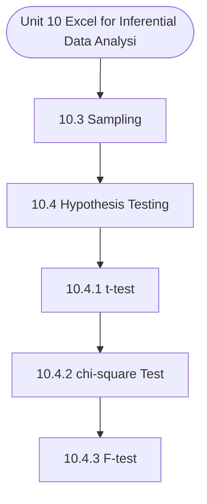

# MCS-062: Introduction to Data Science
## Unit 10: Excel for Inferential Data Analysis

> 📚 **Programme:** M.Sc. (Data Science and Analytics) | **Semester:** Semester 1  
> ⏱️ **Estimated Study Time:** ~102 mins | 📄 **Textbook Pages:** 83 Pages  
> 📥 **Original PDF:** [Download & View Textbook](../../../pdfs/Semester_1/MCS-062_Introduction_to_Data_Science/Unit-10_Excel_for_Inferential_Data_Analysis.pdf)

---

### 🎯 Executive Concept & Data Science Relevance
In modern data systems, **Excel for Inferential Data Analysis** forms a vital conceptual pillar. Descriptive statistics provide quantitative summaries of dataset properties. Measures of central tendency identify typical values, while measures of dispersion quantify data spread, uncertainty, and variability—critical for feature normalization and anomaly detection.

> [!NOTE]
> **Why this matters for your career:** Mastering excel for inferential data analysis equips you with the foundational principles required to reason mathematically about high-dimensional datasets, evaluate algorithm performance, and avoid statistical pitfalls in production machine learning pipelines.

### 🗺️ Visual Knowledge Architecture
The following concept map illustrates the structural hierarchy and learning trajectory of this module:

### 📖 Core Definitions & Terminology Cards

> 📌 **Arithmetic Mean $\bar{x}$ or $\mu$**  
> - **Formal Definition:** The sum of all observations divided by the total number of observations: $\bar{x} = \frac{1}{n}\sum_{i=1}^n x_i$. Sensitive to extreme outliers.  
> - 💡 **Practical Intuition & Analogy:** *The center of mass or balance point of the distribution.*

> 📌 **Median**  
> - **Formal Definition:** The physical middle value separating the higher half from the lower half of an ordered dataset. Robust against outliers.  
> - 💡 **Practical Intuition & Analogy:** *The 50th percentile value where exactly half the data lies above and half below.*

> 📌 **Standard Deviation $\sigma$ or $s$**  
> - **Formal Definition:** The square root of variance, measuring average dispersion in original units: $s = \sqrt{\frac{1}{n-1}\sum (x_i - \bar{x})^2}$.  
> - 💡 **Practical Intuition & Analogy:** *The typical distance data points deviate from the mean.*

> 📌 **Coefficient of Variation ($CV$)**  
> - **Formal Definition:** Relative dispersion measure expressed as a percentage: $CV = \frac{\sigma}{\mu} \times 100\%$. Enables comparison across different measurement scales.  
> - 💡 **Practical Intuition & Analogy:** *Comparing stock volatility across assets priced at 10 USD vs 1,000 USD.*

### ⚡ Governing Mathematical Laws & Formula Cheatsheet
#### 🔹 Sample Variance Formula (Bessel's Correction)
$$
\begin{aligned} s^2 & = \frac{1}{n - 1} \sum_{i=1}^n (x_i - \bar{x})^2 \\ & = \frac{\sum x_i^2 - \frac{(\sum x_i)^2}{n}}{n - 1} \end{aligned}
$$
- **Explanation:** Using $n-1$ in the denominator corrects for downward sample bias, yielding an unbiased estimator of population variance $\sigma^2$.

#### 🔹 Interquartile Range (IQR) & Outlier Bounds
$$
\text{IQR} = Q_3 - Q_1, \quad \text{Outliers} < Q_1 - 1.5(\text{IQR}) \;\lor\; > Q_3 + 1.5(\text{IQR})
$$
- **Explanation:** Standard Tukey boxplot rule for identifying extreme data points robustly.

#### 🔹 Pearson's First Coefficient of Skewness
$$
Sk_1 = \frac{\text{Mean} - \text{Mode}}{\sigma} \quad \text{or} \quad Sk_2 = \frac{3(\text{Mean} - \text{Median})}{\sigma}
$$
- **Explanation:** Measures asymmetry: Positive skew means mean > median (right tail); negative skew means mean < median (left tail).

### 📌 Detailed Section-by-Section Study Breakdown
#### `10.3` Sampling
- **Core Concept:** Establishes theoretical foundations, axiomatic formulations, and properties of sampling.
- **Core Concept:** Analyzes standard algorithmic workflows and mathematical transformations relevant to excel for inferential data analysis.
- **Core Concept:** Applies computational bounds and optimization guarantees across data processing workflows.
- **Data Science Application:** Provides foundational structures used directly in statistical modeling, query execution, and machine learning pipelines.

> [!TIP]
> **Exam & Interview Tip:** Be prepared to state the formal definition of sampling and derive its primary equations step-by-step.

#### `10.4` Hypothesis Testing
- **Core Concept:** Hypothesis testing is a statistical method used to make decisions or inferences about a population parameter based on a sample.
- **Core Concept:** It involves setting up two competing hypotheses: the null hypothesis (H₀), which states that there is no effect or difference, and the alternative hypothesis (H₁), which suggests there is an effect or difference.
- **Core Concept:** The process involves calculating a test statistic and comparing it to a critical value from a known distribution to either accept or reject the null hypothesis.
- **Data Science Application:** Provides foundational structures used directly in statistical modeling, query execution, and machine learning pipelines.

> [!TIP]
> **Exam & Interview Tip:** Be prepared to state the formal definition of hypothesis testing and derive its primary equations step-by-step.

#### `10.4.1` t-test
- **Core Concept:** The t-test is used to compare the means of two groups to see if they are statistically different from each other.
- **Core Concept:** Example: Let’s say we want to test whether a new teaching method improves students’ performance.
- **Core Concept:** We take two groups of students: one taught with the traditional method and the other with the new method.
- **Data Science Application:** Provides foundational structures used directly in statistical modeling, query execution, and machine learning pipelines.

> [!TIP]
> **Exam & Interview Tip:** Be prepared to state the formal definition of t-test and derive its primary equations step-by-step.

#### `10.4.2` chi-square Test
- **Core Concept:** The chi-square test is used for categorical data to assess how likely it is that any observed difference between sets of categories is due to chance.
- **Core Concept:** It compares observed frequencies to expected frequencies under the null hypothesis.
- **Core Concept:** Example: Suppose a company wants to know if there is a significant difference in customer preferences for three product colors: red, blue, and green.
- **Data Science Application:** Provides foundational structures used directly in statistical modeling, query execution, and machine learning pipelines.

> [!TIP]
> **Exam & Interview Tip:** Be prepared to state the formal definition of chi-square test and derive its primary equations step-by-step.

#### `10.4.3` F-test
- **Core Concept:** different regressio Example Suppose · Gro · Gro The null hypothes The F-st ck OK.
- **Core Concept:** 10.22: CHISQ.TEST output HISQ.TEST function is a bit quicker to use, it is standard practice to include the test m.
- **Core Concept:** Therefore, we recommend using the CHISQ culating the necessary details as demonstrate n.
- **Data Science Application:** Provides foundational structures used directly in statistical modeling, query execution, and machine learning pipelines.

> [!TIP]
> **Exam & Interview Tip:** Be prepared to state the formal definition of f-test and derive its primary equations step-by-step.

#### `10.4.4` Z-test
- **Core Concept:** The Z-test is used when comparing sample and population means to assess if they are significantly different, especially when the sample size is large (n > 30) and the population variance is known.
- **Core Concept:** Example: Suppose the average height of men in a country is 175 cm with a standard deviation of 5 cm.
- **Core Concept:** A researcher wants to test if a new sample of 50 men has a significantly different average height.
- **Data Science Application:** Provides foundational structures used directly in statistical modeling, query execution, and machine learning pipelines.

> [!TIP]
> **Exam & Interview Tip:** Be prepared to state the formal definition of z-test and derive its primary equations step-by-step.

### 💡 Interactive Self-Assessment Checkpoints
Test your comprehension before proceeding. Tap each question to reveal the comprehensive explanation:

<b>Checkpoint 1:</b> Why is sample variance divided by $n-1$ instead of $n$? <i>(Tap to reveal answer)</i>

> **Answer & Analysis:**  
> Dividing by $n-1$ applies **Bessel's correction**, which removes downward bias caused by using the sample mean $\bar{x}$ instead of the true population mean $\mu$.

<b>Checkpoint 2:</b> Which measure of central tendency is most robust to extreme outliers? <i>(Tap to reveal answer)</i>

> **Answer & Analysis:**  
> The **Median**, because it depends on positional rank rather than magnitude summation.

<b>Checkpoint 3:</b> In a right-skewed (positively skewed) distribution, what is the order of Mean, Median, and Mode? <i>(Tap to reveal answer)</i>

> **Answer & Analysis:**  
> $\text{Mode} < \text{Median} < \text{Mean}$.

<b>Checkpoint 4:</b> What is Hypothesis Testing? <i>(Tap to reveal answer)</i>

> **Answer & Analysis:**  
> This question tests your conceptual mastery of Excel for Inferential Data Analysis. Review the governing formulas and section breakdowns above to formulate a complete, rigorous proof or derivation.

<b>Checkpoint 5:</b> Compare between t-test and Z-test. <i>(Tap to reveal answer)</i>

> **Answer & Analysis:**  
> This question tests your conceptual mastery of Excel for Inferential Data Analysis. Review the governing formulas and section breakdowns above to formulate a complete, rigorous proof or derivation.

<b>Checkpoint 6:</b> What are the common applications of the chi-square test? <i>(Tap to reveal answer)</i>

> **Answer & Analysis:**  
> This question tests your conceptual mastery of Excel for Inferential Data Analysis. Review the governing formulas and section breakdowns above to formulate a complete, rigorous proof or derivation.

### 🎯 Executive Module Wrap-Up
- **Central Idea:** Excel for Inferential Data Analysis provides essential mathematical and algorithmic tools directly utilized in Data Science.
- **Mathematical Rigor:** Formulas and laws must be memorized with attention to boundary conditions and assumptions.
- **Full Textbook Coverage:** For exhaustive multi-page derivations, proofs, and supplementary exercises, consult the [Authentic IGNOU Textbook](../../../pdfs/Semester_1/MCS-062_Introduction_to_Data_Science/Unit-10_Excel_for_Inferential_Data_Analysis.pdf).

---
### 🧭 Navigation & Syllabus Index
[⬅ Previous: Unit 9](unit_09_Excel_for_Descriptive_Data_Analysis.md) | [📑 Course Index](README.md) | [Next: Unit 11 ➡](unit_11_Introduction_to_NOSQL_and_Bigdata.md)
