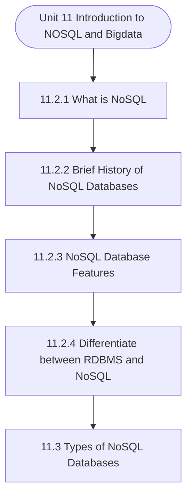

# MCS-062: Introduction to Data Science
## Unit 11: Introduction to NOSQL and Bigdata

> 📚 **Programme:** M.Sc. (Data Science and Analytics) | **Semester:** Semester 1  
> ⏱️ **Estimated Study Time:** ~89 mins | 📄 **Textbook Pages:** 47 Pages  
> 📥 **Original PDF:** [Download & View Authentic Textbook](../../../pdfs/Semester_1/MCS-062_Introduction_to_Data_Science/Unit-11_Introduction_to_NOSQL_and_Bigdata.pdf)

---

### 🎯 Executive Concept & Data Science Relevance
In modern data systems, **Introduction to NOSQL and Bigdata** forms a vital conceptual pillar. Relational algebra and SQL form the query engine of every data warehouse (Snowflake, BigQuery, Postgres). Concurrency protocols and normalization ensure data integrity and ACID consistency across concurrent transaction streams.

> [!NOTE]
> **Why this matters for your career:** Mastering introduction to nosql and bigdata equips you with the foundational principles required to reason mathematically about high-dimensional datasets, evaluate algorithm performance, and avoid statistical pitfalls in production machine learning pipelines.

### 🗺️ Visual Knowledge Architecture
The following concept map illustrates the structural hierarchy and learning trajectory of this module:



### 📖 Core Definitions & Terminology Cards

> 📌 **Relational Algebra**  
> - **Formal Definition:** A procedural query language consisting of a set of operations on relations: Select ( $\sigma$ ), Project ( $\pi$ ), Union ( $\cup$ ), Set Difference ( $-$ ), Cartesian Product ( $\times$ ), and Join ( $\bowtie$ ).  
> - 💡 **Practical Intuition & Analogy:** *The formal mathematical syntax executed behind SQL `SELECT` queries.*

> 📌 **ACID Properties**  
> - **Formal Definition:** Atomicity (all or nothing), Consistency (preserves invariants), Isolation (concurrent execution equivalent to serial), Durability (committed data survives crashes).  
> - 💡 **Practical Intuition & Analogy:** *The financial transaction guarantee: money cannot disappear between debit and credit.*

> 📌 **Functional Dependency $X \to Y$**  
> - **Formal Definition:** A constraint between two sets of attributes: for any two valid tuples $t_1, t_2$, if $t_1[X] = t_2[X]$, then $t_1[Y] = t_2[Y]$. Value of $X$ uniquely determines $Y$.  
> - 💡 **Practical Intuition & Analogy:** *`StudentID` uniquely determines `StudentName`.*

> 📌 **Third Normal Form (3NF) & BCNF**  
> - **Formal Definition:** A relation is in 3NF if for every non-trivial $X \to Y$, either $X$ is a superkey or $Y$ is a prime attribute. It is in BCNF if $X$ is strictly a superkey.  
> - 💡 **Practical Intuition & Analogy:** *Eliminates transitive dependencies so data is stored in exactly one canonical place without update anomalies.*

### ⚡ Governing Mathematical Laws & Formula Cheatsheet
#### 🔹 Relational Algebra Selection & Projection
$$
\sigma_{\text{condition}}(R) \quad \text{and} \quad \pi_{\text{attributes}}(R)
$$
- **Explanation:** $\sigma$ filters rows (equivalent to SQL `WHERE`), while $\pi$ selects specific columns (equivalent to SQL `SELECT column_list`).

#### 🔹 Relational Natural Join
$$
R \bowtie S = \pi_{\mathcal{A}(R) \cup \mathcal{A}(S)}\left(\sigma_{\text{match}}(R \times S)\right)
$$
- **Explanation:** Performs equality join across all identically named attributes between two tables.

#### 🔹 Two-Phase Locking (2PL) Theorem
$$
\text{Growing Phase: Only Acquire Locks} \implies \text{Shrinking Phase: Only Release Locks}
$$
- **Explanation:** Guarantees conflict serializability of concurrent database schedules without data race anomalies.

### ⚖️ Axiomatic Properties & Governing Laws
The mathematical formulations of this module are anchored by foundational algebraic and structural laws:

- **Armstrong's Reflexivity:** $Y \subseteq X \implies X \to Y$
- **Armstrong's Augmentation:** $X \to Y \implies XZ \to YZ$
- **Armstrong's Transitivity:** $X \to Y \land Y \to Z \implies X \to Z$

### 📌 Comprehensive Section-by-Section Study Breakdown
#### `11.2.1` What is NoSQL
##### 📘 Theoretical Principles & In-Depth Exposition
NoSQL is a way to build databases that can accommodate many different kinds of information, such as key-value pairs, multimedia files, documents, columnar data, graphs, external files, and more. In order to facilitate the development of cutting-edge applications, NoSQL was designed to work with a variety of different data models and schemas.

The great functionality, ease of development, and performance at scale offered by NoSQL have helped make it a popular name. NoSQL is sometimes referred to as a non-relational database due to the numerous data Data Science – Allied Areas handling features it offers. Due to the fact that it does not adhere to the guidelines established by Relational Database Management Systems (RDBMS), you cannot query your data using conventional SQL commands.

We can think of such well-known examples as Mongo DB, Neo4J, Hyper Graph DB, etc.

##### ⚙️ Mathematical & Algorithmic Mechanics
- **Formal Mechanics:** Establishes symbolic transformations and state invariants governing what is nosql.
- **Boundary Invariants:** Ensures robust error-handling, non-empty set guarantees, and strict asymptotic bounds.

##### 📊 Practical Data Science & Production Relevance
- **Industry Application:** Directly implemented in production workflows such as SQL query filters, pandas vectorized operations, and feature transformation pipelines.
- **Production Pitfall:** Failing to verify membership bounds or missing edge cases in what is nosql can cause silent data corruption or performance bottlenecks.

> [!TIP]
> **Key Exam & Technical Interview Takeaway:** Be prepared to define what is nosql formally, cite its core mathematical invariants, and solve step-by-step numerical/proof questions.

#### `11.2.2` Brief History of NoSQL Databases
##### 📘 Theoretical Principles & In-Depth Exposition
In the late 2000s, as the price of storage began to plummet, No-SQL databases began to gain popularity. No longer is it necessary to develop a sophisticated, difficult-to-manage data model to prevent data duplication. Because developers' time was quickly surpassing the cost of data storage, NoSQL databases were designed with efficiency in mind.

Table 11.1: History of Databases Year Database Solutions Company / Database Technology 1970- Mainly RDBMS related Oracle, IBM DB2, SQL Server, MySQL 2000- Dot Com boom – new scale solutions, start of NoSQL dev, whitepapers Google, Facebook, IBM, amazon 2005- New open source & mainstream databases Cassandra, Riak, Apache Hbase, neo4j, MongoDB, CouchDB, Redis onwards Adoption of Cloud DBaaS (Database as a Service) As storage costs reduced significantly, the quantity of data that applications were required to store and query grew.

This data came in all forms— structured, semi-structured, and unstructured — and sizes making it practically difficult to define the schema in advance. NoSQL databases give programmers a great deal of freedom by enabling them to store enormous amounts of unstructured data. In addition, the Agile Manifesto was gaining momentum, and software developers were reconsidering their approach to software development.

##### ⚙️ Mathematical & Algorithmic Mechanics
- **Formal Mechanics:** Establishes symbolic transformations and state invariants governing brief history of nosql databases.
- **Boundary Invariants:** Ensures robust error-handling, non-empty set guarantees, and strict asymptotic bounds.

##### 📊 Practical Data Science & Production Relevance
- **Industry Application:** Directly implemented in production workflows such as SQL query filters, pandas vectorized operations, and feature transformation pipelines.
- **Production Pitfall:** Failing to verify membership bounds or missing edge cases in brief history of nosql databases can cause silent data corruption or performance bottlenecks.

> [!TIP]
> **Key Exam & Technical Interview Takeaway:** Be prepared to define brief history of nosql databases formally, cite its core mathematical invariants, and solve step-by-step numerical/proof questions.

#### `11.2.3` NoSQL Database Features
##### 📘 Theoretical Principles & In-Depth Exposition
Every NoSQL database comes with its own set of one-of-a-kind capabilities. The following are general characteristics shared by several NoSQL databases: · Schema flexibility · Horizontal scaling · Quick responses to queries as a result of the data model · Ease of use for software developers

##### ⚙️ Mathematical & Algorithmic Mechanics
- **Formal Mechanics:** Establishes symbolic transformations and state invariants governing nosql database features.
- **Boundary Invariants:** Ensures robust error-handling, non-empty set guarantees, and strict asymptotic bounds.

##### 📊 Practical Data Science & Production Relevance
- **Industry Application:** Directly implemented in production workflows such as SQL query filters, pandas vectorized operations, and feature transformation pipelines.
- **Production Pitfall:** Failing to verify membership bounds or missing edge cases in nosql database features can cause silent data corruption or performance bottlenecks.

> [!TIP]
> **Key Exam & Technical Interview Takeaway:** Be prepared to define nosql database features formally, cite its core mathematical invariants, and solve step-by-step numerical/proof questions.

#### `11.2.4` Differentiate between RDBMS and NoSQL
##### 📘 Theoretical Principles & In-Depth Exposition
The differences and similarities between the two DBMSs are as follows: For the most part, NoSQL databases fall under the category of non-relational or distributed databases, while SQL databases are classified as Relational Database Management Systems (RDBMS). Databases that use the Structured Query Language (SQL) are table-oriented, while NoSQL databases use either document-oriented or key-value pairs or wide-column stores, or graph databases.

Unlike NoSQL databases, which have dynamic or flexible schema to manage unstructured data, SQL databases have a strict or static schema. Structured data is stored using SQL, whereas both structured and unstructured data can be stored using NoSQL. SQL databases are thought to be scalable in a vertical direction, whereas NoSQL databases are thought to be scalable in a horizontal direction.

Increasing the computing capability of your hardware is the first step in the Data Science – Allied Areas scaling process for SQL databases. In contrast, NoSQL databases scale by distributing the load over multiple servers. MySQL, Oracle, PostgreSQL, and Microsoft SQL Server are all examples of SQL databases.

##### ⚙️ Mathematical & Algorithmic Mechanics
- **Formal Mechanics:** Establishes symbolic transformations and state invariants governing differentiate between rdbms and nosql.
- **Boundary Invariants:** Ensures robust error-handling, non-empty set guarantees, and strict asymptotic bounds.

##### 📊 Practical Data Science & Production Relevance
- **Industry Application:** Directly implemented in production workflows such as SQL query filters, pandas vectorized operations, and feature transformation pipelines.
- **Production Pitfall:** Failing to verify membership bounds or missing edge cases in differentiate between rdbms and nosql can cause silent data corruption or performance bottlenecks.

> [!TIP]
> **Key Exam & Technical Interview Takeaway:** Be prepared to define differentiate between rdbms and nosql formally, cite its core mathematical invariants, and solve step-by-step numerical/proof questions.

#### `11.3` Types of NoSQL Databases
##### 📘 Theoretical Principles & In-Depth Exposition
In this section, we will discuss the many classifications of NoSQL databases. There are typically four types of NoSQL databases: 1) Column-based: Instead of accumulating data in rows, this method organizes it all together into columns, which makes it easier to query large datasets.

2) Graph-based: These are systems that are utilized for the storage of information regarding networks, such as social relationships. 3) Key-value pair based: This is the simplest sort of database, in which each item of your database is saved in the form of an attribute name (also known as a "key") coupled with the value.

4) Document-based: Made up of sets of key-value pairs that are kept in documents. Introduction to NOSQL and Bigdata

##### ⚙️ Mathematical & Algorithmic Mechanics
- **Formal Mechanics:** Establishes symbolic transformations and state invariants governing types of nosql databases.
- **Boundary Invariants:** Ensures robust error-handling, non-empty set guarantees, and strict asymptotic bounds.

##### 📊 Practical Data Science & Production Relevance
- **Industry Application:** Directly implemented in production workflows such as SQL query filters, pandas vectorized operations, and feature transformation pipelines.
- **Production Pitfall:** Failing to verify membership bounds or missing edge cases in types of nosql databases can cause silent data corruption or performance bottlenecks.

> [!TIP]
> **Key Exam & Technical Interview Takeaway:** Be prepared to define types of nosql databases formally, cite its core mathematical invariants, and solve step-by-step numerical/proof questions.

#### `11.3.1` Column Based
##### 📘 Theoretical Principles & In-Depth Exposition
A column store, in contrast to a relational database, is arranged as a set of columns, rather than rows. This allows you to read only the columns you need for analysis, saving memory space that would otherwise be taken up by irrelevant information. Because columns are frequently of the same kind, they are able to take advantage of more efficient compression, which makes data reading even quicker.

The value of a specific column can be quickly aggregated using columnar databases. Although columnar databases are excellent for analytics, because of the way they publish data, it is challenging for them to remain consistent because writes to all the columns need several write events on the disk.

However, this problem never arises with relational databases because row data is continuously written to disk. How Does a Column Database Work? A columnar database is a type of database management system (DBMS) that allows data to be stored in columns rather than rows. It is accountable for reducing the amount of time needed to return a certain query.

##### ⚙️ Mathematical & Algorithmic Mechanics
- **Formal Mechanics:** Establishes symbolic transformations and state invariants governing column based.
- **Boundary Invariants:** Ensures robust error-handling, non-empty set guarantees, and strict asymptotic bounds.

##### 📊 Practical Data Science & Production Relevance
- **Industry Application:** Directly implemented in production workflows such as SQL query filters, pandas vectorized operations, and feature transformation pipelines.
- **Production Pitfall:** Failing to verify membership bounds or missing edge cases in column based can cause silent data corruption or performance bottlenecks.

> [!TIP]
> **Key Exam & Technical Interview Takeaway:** Be prepared to define column based formally, cite its core mathematical invariants, and solve step-by-step numerical/proof questions.

#### `11.3.2` Graph Based
##### 📘 Theoretical Principles & In-Depth Exposition
The initial hardware hurdles that made it feasible for SQL to handle vast quantities of data are no longer there, despite the fact that SQL is an excellent superb RDBMS and has been used for many years to manage massive amounts of data. As a result, NoSQL has rapidly emerged as the dominant form of contemporary database management and many of the largest websites we rely on today are powered by NoSQL, like Twitter's use of FlockDB and Amazon's DynamoDB.

A database that stores data using graph structures is known as a graph database. It represents and stores data using nodes, edges, and attributes rather than tables or documents. Relationships between the nodes are represented by the edges. This makes data retrieval simpler and, in many circumstances, only requires one action.

Additionally, it works fantastically as a database for fast, threaded data structures like those used on Twitter How does a Graph Database Work? Graphs, which are not relational databases, rely heavily on the idea of multi- relational data "pathways" for their functionality. However, the structure of graph databases is typically simple.

##### ⚙️ Mathematical & Algorithmic Mechanics
- **Formal Mechanics:** Establishes symbolic transformations and state invariants governing graph based.
- **Boundary Invariants:** Ensures robust error-handling, non-empty set guarantees, and strict asymptotic bounds.

##### 📊 Practical Data Science & Production Relevance
- **Industry Application:** Directly implemented in production workflows such as SQL query filters, pandas vectorized operations, and feature transformation pipelines.
- **Production Pitfall:** Failing to verify membership bounds or missing edge cases in graph based can cause silent data corruption or performance bottlenecks.

> [!TIP]
> **Key Exam & Technical Interview Takeaway:** Be prepared to define graph based formally, cite its core mathematical invariants, and solve step-by-step numerical/proof questions.

#### `11.3.3` Key-value Pair Based
##### 📘 Theoretical Principles & In-Depth Exposition
Key-value stores are perhaps the most widely used of the four major NoSQL database formats because of their simplicity and quick performance. Let us examine key-value stores' operation and application in more detail. With some of the most well-known platforms and services depending on them to deliver material to users with lightning speed, NoSQL has grown in significance in our daily lives.

Of course, NoSQL includes a range of database types, but key-value store is unquestionably the most used. Because of its extreme simplicity, this kind of data model is built to execute incredibly quickly when compared to relational databases. Furthermore, because key-value stores adhere to the scalable NoSQL design philosophy, they are flexible and simple to set up.

How Does a Key-Value Work? In reality, key-value storage is quite simple. A value is saved with a key that specifies its location, and a value can be pretty much any piece of data or information. In reality, this design idea may be found in almost every programming language as an array or map object, refer Figure 11.5.

##### ⚙️ Mathematical & Algorithmic Mechanics
- **Formal Mechanics:** Establishes symbolic transformations and state invariants governing key-value pair based.
- **Boundary Invariants:** Ensures robust error-handling, non-empty set guarantees, and strict asymptotic bounds.

##### 📊 Practical Data Science & Production Relevance
- **Industry Application:** Directly implemented in production workflows such as SQL query filters, pandas vectorized operations, and feature transformation pipelines.
- **Production Pitfall:** Failing to verify membership bounds or missing edge cases in key-value pair based can cause silent data corruption or performance bottlenecks.

> [!TIP]
> **Key Exam & Technical Interview Takeaway:** Be prepared to define key-value pair based formally, cite its core mathematical invariants, and solve step-by-step numerical/proof questions.

### 📐 Step-by-Step Solved Mathematical Examples
To solidify your theoretical understanding, work through these fully solved, step-by-step mathematical problems:

#### 🧮 Example 1: BCNF Normalization Decomposition
> **Problem Statement:**  
> Given relation $R(A, B, C, D)$ with functional dependencies $F = \lbrace A \to B, \; B \to C, \; C \to D \rbrace$. Find candidate keys, check if $R$ is in BCNF, and decompose if necessary.

**Detailed Step-by-Step Solution:**

1. **Candidate Key:** Closure $(A)^+ = \lbrace A, B, C, D \rbrace$. Thus $A$ is the sole candidate key.
2. **BCNF Test:**
- $A \to B$: $A$ is superkey (Passes BCNF).
- $B \to C$: $B$ is NOT a superkey (Violates BCNF).
- $C \to D$: $C$ is NOT a superkey (Violates BCNF).

3. **Decomposition:**
- Decompose on $B \to C$: $R_1(B, C)$ with $B \to C$ (In BCNF, key $B$), and $R_2(A, B, D)$ with $A \to B, B \to D$.
- In $R_2$, $B \to D$ violates BCNF ($B$ not superkey for $R_2$). Decompose $R_2$ into $R_{21}(B, D)$ and $R_{22}(A, B)$.

Final BCNF schema: $R_1(B, C), \; R_{21}(B, D), \; R_{22}(A, B)$ (Lossless and dependency preserving).

#### 🧮 Example 2: Relational Algebra to SQL Translation
> **Problem Statement:**  
> Express relational algebra query $\pi_{\text{name, salary}}(\sigma_{\text{dept}='Analytics' \land \text{salary} > 80000}(\text{Employees}))$ into standard SQL.

**Detailed Step-by-Step Solution:**

```sql
SELECT name, salary
FROM Employees
WHERE dept = 'Analytics' AND salary > 80000;
```

### 💻 Practical Data Science Implementation (Python)
Theory translates directly into production algorithms. Below is a self-contained, commented Python implementation illustrating the core operations of this unit:

```python
import pandas as pd

# Simulating Relational Algebra with Pandas
emp = pd.DataFrame({
    'emp_id': [1, 2, 3, 4],
    'name': ['Alice', 'Bob', 'Charlie', 'David'],
    'dept_id': [10, 10, 20, 30]
})

dept = pd.DataFrame({
    'dept_id': [10, 20, 40],
    'dept_name': ['Analytics', 'Engineering', 'HR']
})

# 1. Selection (Sigma): dept_id == 10
sel = emp[emp['dept_id'] == 10]

# 2. Projection (Pi): ['name', 'dept_id']
proj = sel[['name', 'dept_id']]

# 3. Natural Join (Bowtie): emp ⨝ dept
natural_join = pd.merge(emp, dept, on='dept_id', how='inner')

print("Natural Join Result:\n", natural_join[['name', 'dept_name']])
```

### 💡 Interactive Self-Assessment Checkpoints
Test your comprehension before proceeding. Tap each question to reveal the comprehensive explanation:

<details>
<summary><b>Checkpoint 1:</b> What does ACID stand for in database management? <i>(Tap to reveal answer)</i></summary>

> **Answer & Analysis:**  
> Atomicity, Consistency, Isolation, and Durability.
</details>

<details>
<summary><b>Checkpoint 2:</b> What is the difference between 3NF and BCNF? <i>(Tap to reveal answer)</i></summary>

> **Answer & Analysis:**  
> In 3NF, for any non-trivial $X \to Y$, $X$ must be a superkey OR $Y$ must be a prime attribute. In BCNF (Boyce-Codd Normal Form), $X$ MUST strictly be a superkey (eliminating all dependencies on prime attributes).
</details>

<details>
<summary><b>Checkpoint 3:</b> What is the relational algebra symbol for row selection and column projection? <i>(Tap to reveal answer)</i></summary>

> **Answer & Analysis:**  
> Row selection: $\sigma$ (Sigma). Column projection: $\pi$ (Pi).
</details>

<details>
<summary><b>Checkpoint 4:</b> What is NoSQL? …………………………………………………………………………… …………………………………………………………………………… …………….……………………………………………………………… <i>(Tap to reveal answer)</i></summary>

> **Answer & Analysis:**  
> This question tests your conceptual mastery of Introduction to NOSQL and Bigdata. Review the governing formulas and section breakdowns above to formulate a complete, rigorous proof or derivation.
</details>

<details>
<summary><b>Checkpoint 5:</b> What are the features of NoSQL databases? …………………………………………………………………………… …………………………………………………………………………… ………..………………………….…………..…………………………… <i>(Tap to reveal answer)</i></summary>

> **Answer & Analysis:**  
> This question tests your conceptual mastery of Introduction to NOSQL and Bigdata. Review the governing formulas and section breakdowns above to formulate a complete, rigorous proof or derivation.
</details>

<details>
<summary><b>Checkpoint 6:</b> Differentiate between the NoSQL and SQL. …………………………………………………………………………… …………………………………………………………………………… …………………………………………………………………………… <i>(Tap to reveal answer)</i></summary>

> **Answer & Analysis:**  
> This question tests your conceptual mastery of Introduction to NOSQL and Bigdata. Review the governing formulas and section breakdowns above to formulate a complete, rigorous proof or derivation.
</details>

### 🎯 Executive Module Wrap-Up
- **Central Idea:** Introduction to NOSQL and Bigdata provides essential mathematical and algorithmic tools directly utilized in Data Science.
- **Mathematical Rigor:** Formulas and laws must be memorized with attention to boundary conditions and assumptions.
- **Full Textbook Coverage:** For exhaustive multi-page derivations, proofs, and supplementary exercises, consult the [Authentic IGNOU Textbook](../../../pdfs/Semester_1/MCS-062_Introduction_to_Data_Science/Unit-11_Introduction_to_NOSQL_and_Bigdata.pdf).

---
### 🧭 Navigation & Syllabus Index
[⬅ Previous: Unit 10](unit_10_Excel_for_Inferential_Data_Analysis.md) | [📑 Course Index](README.md) | [Next: Unit 12 ➡](unit_12_Mining_Data_Streams.md)
