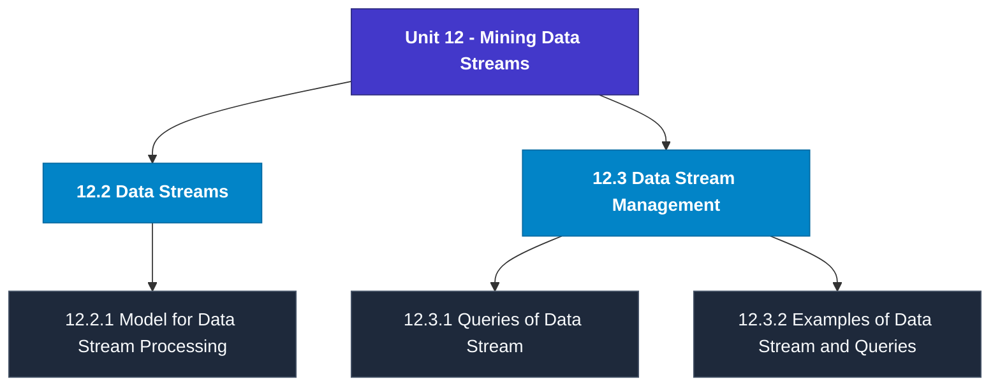

# MCS-062: Introduction to Data Science
## Unit 12: Mining Data Streams

> 📚 **Programme:** M.Sc. (Data Science and Analytics) | **Semester:** Semester 1  
> ⏱️ **Estimated Study Time:** ~27 mins | 📄 **Textbook Pages:** 13 Pages  
> 📥 **Original PDF:** [Download & View Textbook](../../../pdfs/Semester_1/MCS-062_Introduction_to_Data_Science/Unit-12_Mining_Data_Streams.pdf)

---

### 🎯 Executive Concept & Data Science Relevance
In modern data systems, **Mining Data Streams** forms a vital conceptual pillar. Descriptive statistics provide quantitative summaries of dataset properties. Measures of central tendency identify typical values, while measures of dispersion quantify data spread, uncertainty, and variability—critical for feature normalization and anomaly detection.

> [!NOTE]
> **Why this matters for your career:** Mastering mining data streams equips you with the foundational principles required to reason mathematically about high-dimensional datasets, evaluate algorithm performance, and avoid statistical pitfalls in production machine learning pipelines.

### 🗺️ Visual Knowledge Architecture
The following concept map illustrates the structural hierarchy and learning trajectory of this module:

### 📖 Core Definitions & Terminology Cards
| Term | Formal Mathematical / Technical Definition | Intuitive Analogy / Concrete Example |
| :--- | :--- | :--- |
| **Arithmetic Mean $\bar{x}$ or $\mu$** | The sum of all observations divided by the total number of observations: $\bar{x} = \frac{1}{n}\sum_{i=1}^n x_i$. Sensitive to extreme outliers. | *The center of mass or balance point of the distribution.* |
| **Median** | The physical middle value separating the higher half from the lower half of an ordered dataset. Robust against outliers. | *The 50th percentile value where exactly half the data lies above and half below.* |
| **Standard Deviation $\sigma$ or $s$** | The square root of variance, measuring average dispersion in original units: $s = \sqrt{\frac{1}{n-1}\sum (x_i - \bar{x})^2}$. | *The typical distance data points deviate from the mean.* |
| **Coefficient of Variation ($CV$)** | Relative dispersion measure expressed as a percentage: $CV = \frac{\sigma}{\mu} \times 100\%$. Enables comparison across different measurement scales. | *Comparing stock volatility across assets priced at $10 vs $1,000.* |

### ⚡ Governing Mathematical Laws & Formula Cheatsheet
#### 🔹 Sample Variance Formula (Bessel's Correction)

$$
s^2 = \frac{1}{n - 1} \sum_{i=1}^n (x_i - \bar{x})^2 = \frac{\sum x_i^2 - \frac{(\sum x_i)^2}{n}}{n - 1}
$$

- **Explanation:** Using $n-1$ in the denominator corrects for downward sample bias, yielding an unbiased estimator of population variance $\sigma^2$.

#### 🔹 Interquartile Range (IQR) & Outlier Bounds

$$
\text{IQR} = Q_3 - Q_1, \quad \text{Outliers} < Q_1 - 1.5(\text{IQR}) \;\lor\; > Q_3 + 1.5(\text{IQR})
$$

- **Explanation:** Standard Tukey boxplot rule for identifying extreme data points robustly.

#### 🔹 Pearson's First Coefficient of Skewness

$$
Sk_1 = \frac{\text{Mean} - \text{Mode}}{\sigma} \quad \text{or} \quad Sk_2 = \frac{3(\text{Mean} - \text{Median})}{\sigma}
$$

- **Explanation:** Measures asymmetry: Positive skew means mean > median (right tail); negative skew means mean < median (left tail).

### 📌 Detailed Section-by-Section Study Breakdown
#### `12.2` Data Streams
- **Core Concept:** Establishes rigorous theoretical formulations and computational bounds for data streams.
- **Core Concept:** Applies standard algorithmic procedures and mathematical invariants relevant to mining data streams.
- **Core Concept:** Ensures deterministic performance guarantees across high-dimensional feature spaces.
- **Data Science Application:** Provides foundational structures used directly in statistical modeling, query execution, and machine learning pipelines.

> [!TIP]
> **Exam & Interview Tip:** Be prepared to state the formal definition of data streams and derive its primary equations step-by-step.

#### `12.2.1` Model for Data Stream Processing
- **Core Concept:** Let’s Understanding the Model for Data Stream Processing, when working with traditional datasets, we usually have the entire data available beforehand, stored in a database or a file system.
- **Core Concept:** We can query it multiple times, sort it, scan it repeatedly, or even join it with other data.
- **Core Concept:** But in data stream processing, things are different.
- **Data Science Application:** Provides foundational structures used directly in statistical modeling, query execution, and machine learning pipelines.

> [!TIP]
> **Exam & Interview Tip:** Be prepared to state the formal definition of model for data stream processing and derive its primary equations step-by-step.

#### `12.3` Data Stream Management
- **Core Concept:** Managing data streams is a critical task in today’s data-centric world, especially when dealing with real-time applications like traffic monitoring, stock trading, or weather forecasting.
- **Core Concept:** Unlike traditional data stored in databases, data streams are continuous, fast, and often infinite.
- **Core Concept:** This means we usually don’t have the luxury to store all the incoming data or process it multiple times.
- **Data Science Application:** Provides foundational structures used directly in statistical modeling, query execution, and machine learning pipelines.

> [!TIP]
> **Exam & Interview Tip:** Be prepared to state the formal definition of data stream management and derive its primary equations step-by-step.

#### `12.3.1` Queries of Data Stream
- **Core Concept:** When working with traditional databases, we write queries that run on stored data and return results after the computation is complete.
- **Core Concept:** But in the world of data streams, where data is constantly flowing in real time, we need a different kind of approach to querying.
- **Core Concept:** Here, the data is not static—it’s live, fast, and potentially endless.
- **Data Science Application:** Provides foundational structures used directly in statistical modeling, query execution, and machine learning pipelines.

> [!TIP]
> **Exam & Interview Tip:** Be prepared to state the formal definition of queries of data stream and derive its primary equations step-by-step.

#### `12.3.2` Examples of Data Stream and Queries
- **Core Concept:** To understand what data streams really are, it helps to look at real-world situations where data isn’t stored first, but instead flows in continuously.
- **Core Concept:** A data stream is a live, ongoing flow of information that must be processed in real time.
- **Core Concept:** This kind of data appears in many everyday applications, and recognizing these can help you better appreciate how streaming systems work.
- **Data Science Application:** Provides foundational structures used directly in statistical modeling, query execution, and machine learning pipelines.

> [!TIP]
> **Exam & Interview Tip:** Be prepared to state the formal definition of examples of data stream and queries and derive its primary equations step-by-step.

#### `12.3.3` Issues and Challenges of Data Stream
- **Core Concept:** As we explore the world of data stream processing, you'll quickly realize that it’s very different from working with traditional static data.
- **Core Concept:** In streaming, data flows continuously, and we must process it in real time.
- **Core Concept:** While this offers exciting possibilities—like instant decision-making and live monitoring—it also introduces a number of technical and conceptual challenges.
- **Data Science Application:** Provides foundational structures used directly in statistical modeling, query execution, and machine learning pipelines.

> [!TIP]
> **Exam & Interview Tip:** Be prepared to state the formal definition of issues and challenges of data stream and derive its primary equations step-by-step.

### 💡 Interactive Self-Assessment Checkpoints
Test your comprehension before proceeding. Tap each question to reveal the comprehensive explanation:

<b>Checkpoint 1:</b> Why is sample variance divided by $n-1$ instead of $n$? <i>(Tap to reveal answer)</i>

> **Answer & Analysis:**  
> Dividing by $n-1$ applies **Bessel's correction**, which removes downward bias caused by using the sample mean $\bar{x}$ instead of the true population mean $\mu$.

<b>Checkpoint 2:</b> Which measure of central tendency is most robust to extreme outliers? <i>(Tap to reveal answer)</i>

> **Answer & Analysis:**  
> The **Median**, because it depends on positional rank rather than magnitude summation.

<b>Checkpoint 3:</b> In a right-skewed (positively skewed) distribution, what is the order of Mean, Median, and Mode? <i>(Tap to reveal answer)</i>

> **Answer & Analysis:**  
> $\text{Mode} < \text{Median} < \text{Mean}$.

<b>Checkpoint 4:</b> Define the data stream processing. Which model of data stream processing is useful in finding stock market trends? <i>(Tap to reveal answer)</i>

> **Answer & Analysis:**  
> This question tests your conceptual mastery of Mining Data Streams. Review the governing formulas and section breakdowns above to formulate a complete, rigorous proof or derivation.

<b>Checkpoint 5:</b> Differentiate between DBMS and DSMS. Why is all the data of data streams not stored? <i>(Tap to reveal answer)</i>

> **Answer & Analysis:**  
> This question tests your conceptual mastery of Mining Data Streams. Review the governing formulas and section breakdowns above to formulate a complete, rigorous proof or derivation.

<b>Checkpoint 6:</b> How are Standing queries different to ad-hoc queries? <i>(Tap to reveal answer)</i>

> **Answer & Analysis:**  
> This question tests your conceptual mastery of Mining Data Streams. Review the governing formulas and section breakdowns above to formulate a complete, rigorous proof or derivation.

### 🎯 Executive Module Wrap-Up
- **Central Idea:** Mining Data Streams provides essential mathematical and algorithmic tools directly utilized in Data Science.
- **Mathematical Rigor:** Formulas and laws must be memorized with attention to boundary conditions and assumptions.
- **Full Textbook Coverage:** For exhaustive multi-page derivations, proofs, and supplementary exercises, consult the [Authentic IGNOU Textbook](../../../pdfs/Semester_1/MCS-062_Introduction_to_Data_Science/Unit-12_Mining_Data_Streams.pdf).

---
### 🧭 Navigation & Syllabus Index
[⬅ Previous: Unit 11](unit_11_Introduction_to_NOSQL_and_Bigdata.md) | [📑 Course Index](README.md) | [Next: Unit 13 ➡](unit_13_Tools_for_Data_Science_-_An_Introduction.md)
