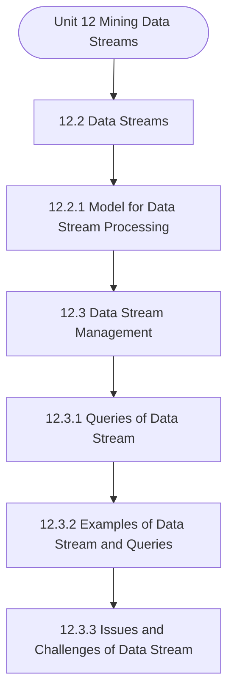

# MCS-062: Introduction to Data Science
## Unit 12: Mining Data Streams

> 📚 **Programme:** M.Sc. (Data Science and Analytics) | **Semester:** Semester 1  
> ⏱️ **Estimated Study Time:** ~27 mins | 📄 **Textbook Pages:** 13 Pages  
> 📥 **Original PDF:** [Download & View Authentic Textbook](../../../pdfs/Semester_1/MCS-062_Introduction_to_Data_Science/Unit-12_Mining_Data_Streams.pdf)

---

### 🎯 Executive Concept & Data Science Relevance
In modern data systems and advanced analytics, **Mining Data Streams** forms a vital conceptual pillar. Descriptive statistics provide quantitative summaries of dataset properties. Measures of central tendency identify typical values, while measures of dispersion quantify data spread, uncertainty, and variability—critical for feature normalization and anomaly detection.

> [!NOTE]
> **Why this matters for your career:** Mastering mining data streams equips you with the foundational principles required to reason mathematically about high-dimensional datasets, evaluate algorithm performance, and avoid statistical pitfalls in production machine learning pipelines.

### 🗺️ Visual Knowledge Architecture
The following concept map illustrates the structural hierarchy and learning trajectory of this module:



### 📖 Core Definitions & Terminology Cards

> 📌 **Arithmetic Mean $\bar{x}$ or $\mu$**  
> - **Formal Definition:** The sum of all observations divided by the total number of observations: $\bar{x} = \frac{1}{n}\sum_{i=1}^n x_i$. Sensitive to extreme outliers.  
> - 💡 **Practical Intuition & Analogy:** *The center of mass or balance point of the distribution.*

> 📌 **Median**  
> - **Formal Definition:** The physical middle value separating the higher half from the lower half of an ordered dataset. Robust against outliers.  
> - 💡 **Practical Intuition & Analogy:** *The 50th percentile value where exactly half the data lies above and half below.*

> 📌 **Standard Deviation $\sigma$ or $s$**  
> - **Formal Definition:** The square root of variance, measuring average dispersion in original units: $s = \sqrt{\frac{1}{n-1}\sum (x_i - \bar{x})^2}$.  
> - 💡 **Practical Intuition & Analogy:** *The typical distance data points deviate from the mean.*

> 📌 **Coefficient of Variation ($CV$)**  
> - **Formal Definition:** Relative dispersion measure expressed as a percentage: $CV = \frac{\sigma}{\mu} \times 100\%$. Enables comparison across different measurement scales.  
> - 💡 **Practical Intuition & Analogy:** *Comparing stock volatility across assets priced at 10 USD vs 1,000 USD.*

### ⚡ Governing Mathematical Laws & Formula Cheatsheet
#### 🔹 Sample Variance Formula (Bessel's Correction)
$$
\begin{aligned} s^2 & = \frac{1}{n - 1} \sum_{i=1}^n (x_i - \bar{x})^2 \\ & = \frac{\sum x_i^2 - \frac{(\sum x_i)^2}{n}}{n - 1} \end{aligned}
$$
- **Explanation:** Using $n-1$ in the denominator corrects for downward sample bias, yielding an unbiased estimator of population variance $\sigma^2$.

#### 🔹 Interquartile Range (IQR) & Outlier Bounds
$$
\text{IQR} = Q_3 - Q_1, \quad \text{Outliers} < Q_1 - 1.5(\text{IQR}) \;\lor\; > Q_3 + 1.5(\text{IQR})
$$
- **Explanation:** Standard Tukey boxplot rule for identifying extreme data points robustly.

#### 🔹 Pearson's First Coefficient of Skewness
$$
Sk_1 = \frac{\text{Mean} - \text{Mode}}{\sigma} \quad \text{or} \quad Sk_2 = \frac{3(\text{Mean} - \text{Median})}{\sigma}
$$
- **Explanation:** Measures asymmetry: Positive skew means mean > median (right tail); negative skew means mean < median (left tail).

### ⚖️ Axiomatic Properties & Governing Laws
The mathematical formulations of this module are anchored by foundational algebraic and structural laws:

- **Variance Scaling Rule:** $\text{Var}(aX + b) = a^2 \text{Var}(X)$
- **Standard Deviation Scaling:** $\sigma(aX + b) = \vert a\vert \sigma(X)$
- **Empirical Rule (Normal Distribution):** 68% within $\mu \pm 1\sigma$, 95% within $\mu \pm 2\sigma$, 99.7% within $\mu \pm 3\sigma$

### 📌 Comprehensive Section-by-Section Study Breakdown
#### `12.2` Data Streams

##### 📘 Theoretical Principles & Pedagogical Exposition
Let’s Understanding the Model for Data Stream Processing, when working with traditional datasets, we usually have the entire data available beforehand, stored in a database or a file system. We can query it multiple times, sort it, scan it repeatedly, or even join it with other data.

But in data stream processing, things are different. The data arrives continuously, often at high speed, and we only get one chance to process it. This is because storing the entire stream is not practical due to limited memory, time, and processing power. To deal with this challenge, researchers and developers have come up with specific models for processing data streams efficiently.

Each model provides a strategy to analyse and summarize the incoming data using minimal resources, often with a trade-off in accuracy. Let’s explore some of the commonly used models with easy-to-understand examples. Sliding Window Model : In this model, we focus only on the most recent data in the stream.


##### ⚙️ Mathematical & Algorithmic Mechanics
- **Core Mechanism:** Establishes analytical principles and computational workflows for mining data streams.
- **Boundary Conditions:** Missing data values, extreme outliers, and non-standard data types.

##### 📊 Practical Data Science & Production Relevance
- **Production Workflow:** End-to-end data science processing stacks (Pandas, Scikit-learn, PyTorch).
- **Real-World Pitfall:** Failing to validate inputs before feeding data into production analytics pipelines.

> [!TIP]
> **Exam & Technical Interview Insight:** Define key concepts in data streams and articulate practical applications in real-world scenarios.

#### `12.2.1` Model for Data Stream Processing

##### 📘 Theoretical Principles & Pedagogical Exposition
Let’s Understanding the Model for Data Stream Processing, when working with traditional datasets, we usually have the entire data available beforehand, stored in a database or a file system. We can query it multiple times, sort it, scan it repeatedly, or even join it with other data.

But in data stream processing, things are different. The data arrives continuously, often at high speed, and we only get one chance to process it. This is because storing the entire stream is not practical due to limited memory, time, and processing power. To deal with this challenge, researchers and developers have come up with specific models for processing data streams efficiently.

Each model provides a strategy to analyse and summarize the incoming data using minimal resources, often with a trade-off in accuracy. Let’s explore some of the commonly used models with easy-to-understand examples. Sliding Window Model : In this model, we focus only on the most recent data in the stream.


##### ⚙️ Mathematical & Algorithmic Mechanics
- **Core Mechanism:** Operating systems manage hardware resource virtualization. Processes encapsulate private address spaces; threads share virtual memory within a process. Virtual memory uses multi-level page tables to translate virtual addresses to physical RAM frames.
- **Boundary Conditions:** Coffman deadlock conditions (Mutual Exclusion, Hold and Wait, No Preemption, Circular Wait), thrashing from excessive page faults, and multi-thread race conditions.

##### 📊 Practical Data Science & Production Relevance
- **Production Workflow:** Multi-process Python workloads (`multiprocessing`), asynchronous I/O architectures (`asyncio`), WSGI worker scaling (Gunicorn/Celery), and container resource bounds in Docker/K8s.
- **Real-World Pitfall:** Python Global Interpreter Lock (GIL) bottlenecks on CPU-bound multi-threaded code, or memory leaks triggering Linux kernel Out-Of-Memory (OOM) process termination.

> [!TIP]
> **Exam & Technical Interview Insight:** Calculate turnaround and waiting times for CPU scheduling algorithms (FCFS, SJF, Round Robin); determine safe execution states using the Banker's Algorithm.

#### `12.3` Data Stream Management

##### 📘 Theoretical Principles & Pedagogical Exposition
Managing data streams is a critical task in today’s data-centric world, especially when dealing with real-time applications like traffic monitoring, stock trading, or weather forecasting. Unlike traditional data stored in databases, data streams are continuous, fast, and often infinite.

This means we usually don’t have the luxury to store all the incoming data or process it multiple times. So, how do we effectively manage such data? The answer lies in using smart models that help us process, analyze, and summarize data streams efficiently, often with limited memory and computing resources.

One useful approach is the sliding window model, where only the most recent portion of the data stream is kept in memory. For example, if we are monitoring traffic at a busy intersection, we might only care about vehicle counts in the last 5 minutes, rather than the entire day. As new data arrives, old data is removed from the window, allowing us to continuously analyze the latest situation without overloading the system.


##### ⚙️ Mathematical & Algorithmic Mechanics
- **Core Mechanism:** Establishes analytical principles and computational workflows for mining data streams.
- **Boundary Conditions:** Missing data values, extreme outliers, and non-standard data types.

##### 📊 Practical Data Science & Production Relevance
- **Production Workflow:** End-to-end data science processing stacks (Pandas, Scikit-learn, PyTorch).
- **Real-World Pitfall:** Failing to validate inputs before feeding data into production analytics pipelines.

> [!TIP]
> **Exam & Technical Interview Insight:** Define key concepts in data stream management and articulate practical applications in real-world scenarios.

#### `12.3.1` Queries of Data Stream

##### 📘 Theoretical Principles & Pedagogical Exposition
When working with traditional databases, we write queries that run on stored data and return results after the computation is complete. But in the world of data streams, where data is constantly flowing in real time, we need a different kind of approach to querying. Here, the data is not static—it’s live, fast, and potentially endless.

This is where understanding how queries work in data streams becomes really important. In data stream systems, we mainly deal with two types of queries: adhoc queries and standing (or continuous) queries. Adhoc Queries: Adhoc queries are similar to traditional database queries. They are executed once on a snapshot or current state of the data (usually within a defined window).

These queries are useful when we want to check something quickly or perform a one-time analysis. Example: Imagine we want to know how many users visited a website in the last 10 minutes. We can run an adhoc query over that time window to get the result once. Standing (Continuous) Queries: Standing queries, also called continuous queries, are much more powerful and common in data stream systems.


##### ⚙️ Mathematical & Algorithmic Mechanics
- **Core Mechanism:** Establishes analytical principles and computational workflows for mining data streams.
- **Boundary Conditions:** Missing data values, extreme outliers, and non-standard data types.

##### 📊 Practical Data Science & Production Relevance
- **Production Workflow:** End-to-end data science processing stacks (Pandas, Scikit-learn, PyTorch).
- **Real-World Pitfall:** Failing to validate inputs before feeding data into production analytics pipelines.

> [!TIP]
> **Exam & Technical Interview Insight:** Define key concepts in queries of data stream and articulate practical applications in real-world scenarios.

#### `12.3.2` Examples of Data Stream and Queries

##### 📘 Theoretical Principles & Pedagogical Exposition
To understand what data streams really are, it helps to look at real-world situations where data isn’t stored first, but instead flows in continuously. A data stream is a live, ongoing flow of information that must be processed in real time. This kind of data appears in many everyday applications, and recognizing these can help you better appreciate how streaming systems work.

Sensor Data Streams One of the most common sources of data streams is sensors. These are used in everything from weather stations to smart homes and industrial machines. For example, weather sensors stream temperature, humidity, and wind speed data every few seconds. Similarly, smart home devices like thermostats or motion detectors constantly send activity updates.

In industries, IoT-enabled machines send data about vibration, pressure, or speed to help monitor equipment health and prevent breakdowns. Social Media Feeds Social media platforms are full of streaming data. Every time someone posts a tweet, uploads a video, or reacts to a story, that action becomes part of a data stream.


##### ⚙️ Mathematical & Algorithmic Mechanics
- **Core Mechanism:** Establishes analytical principles and computational workflows for mining data streams.
- **Boundary Conditions:** Missing data values, extreme outliers, and non-standard data types.

##### 📊 Practical Data Science & Production Relevance
- **Production Workflow:** End-to-end data science processing stacks (Pandas, Scikit-learn, PyTorch).
- **Real-World Pitfall:** Failing to validate inputs before feeding data into production analytics pipelines.

> [!TIP]
> **Exam & Technical Interview Insight:** Define key concepts in examples of data stream and queries and articulate practical applications in real-world scenarios.

#### `12.3.3` Issues and Challenges of Data Stream

##### 📘 Theoretical Principles & Pedagogical Exposition
As we explore the world of data stream processing, you'll quickly realize that it’s very different from working with traditional static data. In streaming, data flows continuously, and we must process it in real time. While this offers exciting possibilities—like instant decision-making and live monitoring—it also introduces a number of technical and conceptual challenges.

Let’s break these down into key categories so that you can better understand the landscape. Continuous and Unbounded Data: The most obvious challenge is that data streams are infinite—they never stop. Unlike static datasets, which have a definite beginning and end, stream data keeps coming.

This makes it difficult to store all the data or reprocess it later. As a learner, ask yourself: how would you handle a firehose of data that never ends? The solution lies in using sliding or tumbling windows, sampling, or approximation techniques. Limited Memory and Storage: Because stream processing needs to happen in real time and memory is limited, you can't store all incoming data.


##### ⚙️ Mathematical & Algorithmic Mechanics
- **Core Mechanism:** Establishes analytical principles and computational workflows for mining data streams.
- **Boundary Conditions:** Missing data values, extreme outliers, and non-standard data types.

##### 📊 Practical Data Science & Production Relevance
- **Production Workflow:** End-to-end data science processing stacks (Pandas, Scikit-learn, PyTorch).
- **Real-World Pitfall:** Failing to validate inputs before feeding data into production analytics pipelines.

> [!TIP]
> **Exam & Technical Interview Insight:** Define key concepts in issues and challenges of data stream and articulate practical applications in real-world scenarios.

### 📐 Step-by-Step Solved Mathematical Examples
To solidify your theoretical understanding, work through these fully solved, step-by-step mathematical problems:

#### 🧮 Example 1: Sample Variance and Standard Deviation Computation
> **Problem Statement:**  
> Given sample observations: $X = \lbrace 4, 8, 6, 5, 7 \rbrace$. Compute sample mean $\bar{x}$, sample variance $s^2$, and standard deviation $s$ step-by-step.

**Detailed Step-by-Step Solution:**

1. **Mean:** $\bar{x} = \frac{4 + 8 + 6 + 5 + 7}{5} = \frac{30}{5} = 6$.

2. **Squared deviations:**
- $(4 - 6)^2 = (-2)^2 = 4$
- $(8 - 6)^2 = 2^2 = 4$
- $(6 - 6)^2 = 0^2 = 0$
- $(5 - 6)^2 = (-1)^2 = 1$
- $(7 - 6)^2 = 1^2 = 1$
Sum of squared deviations $= 4 + 4 + 0 + 1 + 1 = 10$.

3. **Sample Variance with Bessel's Correction ($n-1 = 4$):**

$$
s^2 = \frac{10}{5 - 1} = \frac{10}{4} = 2.5
$$


4. **Standard Deviation:** $s = \sqrt{2.5} \approx 1.581$.

#### 🧮 Example 2: Tukey's IQR Outlier Detection Rule
> **Problem Statement:**  
> A customer spend dataset has $Q_1 = 30$ and $Q_3 = 70$. Determine whether transactions of $135$ and $25$ are classified as outliers.

**Detailed Step-by-Step Solution:**

1. **IQR:** $\text{IQR} = Q_3 - Q_1 = 70 - 30 = 40$.
2. **Lower Bound:** $Q_1 - 1.5(\text{IQR}) = 30 - 1.5(40) = 30 - 60 = -30$.
3. **Upper Bound:** $Q_3 + 1.5(\text{IQR}) = 70 + 1.5(40) = 70 + 60 = 130$.

Conclusion:
- Spend of 135 exceeds Upper Bound ($135 > 130$): **Classified as Outlier**.
- Spend of 25 is within $[-30, 130]$: **Normal observation**.

### 💻 Practical Data Science Implementation (Python)
Theory translates directly into production algorithms. Below is a self-contained, commented Python implementation illustrating the core operations of this unit:

```python
import numpy as np
import pandas as pd

# Statistical profiling on production dataset
data = np.array([12, 15, 18, 22, 25, 29, 34, 45, 95])

mean_val = np.mean(data)
median_val = np.median(data)
std_val = np.std(data, ddof=1) # Bessel's correction

q1, q3 = np.percentile(data, [25, 75])
iqr = q3 - q1
outlier_upper = q3 + 1.5 * iqr

outliers = data[data > outlier_upper]

print(f"Mean: {mean_val:.2f} | Median: {median_val:.2f} | Std: {std_val:.2f}")
print(f"IQR: {iqr:.2f} | Upper Bound: {outlier_upper:.2f}")
print(f"Detected Outliers: {outliers}")
```

### 💡 Interactive Self-Assessment Checkpoints
Test your comprehension before proceeding. Tap each question to reveal the comprehensive explanation:

<details>
<summary><b>Checkpoint 1:</b> Why is sample variance divided by $n-1$ instead of $n$? <i>(Tap to reveal answer)</i></summary>

> **Answer & Analysis:**  
> Dividing by $n-1$ applies **Bessel's correction**, which removes downward bias caused by using the sample mean $\bar{x}$ instead of the true population mean $\mu$.
</details>

<details>
<summary><b>Checkpoint 2:</b> Which measure of central tendency is most robust to extreme outliers? <i>(Tap to reveal answer)</i></summary>

> **Answer & Analysis:**  
> The **Median**, because it depends on positional rank rather than magnitude summation.
</details>

<details>
<summary><b>Checkpoint 3:</b> In a right-skewed (positively skewed) distribution, what is the order of Mean, Median, and Mode? <i>(Tap to reveal answer)</i></summary>

> **Answer & Analysis:**  
> $\text{Mode} < \text{Median} < \text{Mean}$.
</details>

### 🎯 Executive Module Wrap-Up
- **Central Idea:** Mining Data Streams provides essential mathematical and algorithmic tools directly utilized in Data Science.
- **Mathematical Rigor:** Formulas and laws must be memorized with attention to boundary conditions and assumptions.
- **Full Textbook Coverage:** For exhaustive multi-page derivations, proofs, and supplementary exercises, consult the [Authentic IGNOU Textbook](../../../pdfs/Semester_1/MCS-062_Introduction_to_Data_Science/Unit-12_Mining_Data_Streams.pdf).

---
### 🧭 Navigation & Syllabus Index
[⬅ Previous: Unit 11](unit_11_Introduction_to_NOSQL_and_Bigdata.md) | [📑 Course Index](README.md) | [Next: Unit 13 ➡](unit_13_Tools_for_Data_Science_-_An_Introduction.md)
