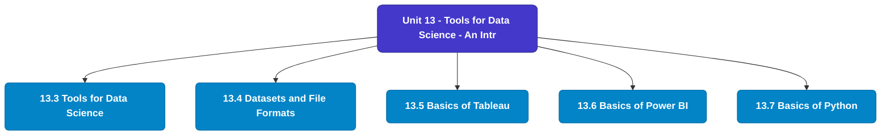

# MCS-062: Introduction to Data Science
## Unit 13: Tools for Data Science - An Introduction

> 📚 **Programme:** M.Sc. (Data Science and Analytics) | **Semester:** Semester 1  
> ⏱️ **Estimated Study Time:** ~88 mins | 📄 **Textbook Pages:** 81 Pages  
> 📥 **Original PDF:** [Download & View Textbook](../../../pdfs/Semester_1/MCS-062_Introduction_to_Data_Science/Unit-13_Tools_for_Data_Science_-_An_Introduction.pdf)

---

### 🎯 Executive Concept & Data Science Relevance
In modern data systems, **Tools for Data Science - An Introduction** forms a vital conceptual pillar. Descriptive statistics provide quantitative summaries of dataset properties. Measures of central tendency identify typical values, while measures of dispersion quantify data spread, uncertainty, and variability—critical for feature normalization and anomaly detection.

> [!NOTE]
> **Why this matters for your career:** Mastering tools for data science - an introduction equips you with the foundational principles required to reason mathematically about high-dimensional datasets, evaluate algorithm performance, and avoid statistical pitfalls in production machine learning pipelines.

### 🗺️ Visual Knowledge Architecture
The following concept map illustrates the structural hierarchy and learning trajectory of this module:

### 📖 Core Definitions & Terminology Cards
| Term | Formal Mathematical / Technical Definition | Intuitive Analogy / Concrete Example |
| :--- | :--- | :--- |
| **Arithmetic Mean $\bar{x}$ or $\mu$** | The sum of all observations divided by the total number of observations: $\bar{x} = \frac{1}{n}\sum_{i=1}^n x_i$. Sensitive to extreme outliers. | *The center of mass or balance point of the distribution.* |
| **Median** | The physical middle value separating the higher half from the lower half of an ordered dataset. Robust against outliers. | *The 50th percentile value where exactly half the data lies above and half below.* |
| **Standard Deviation $\sigma$ or $s$** | The square root of variance, measuring average dispersion in original units: $s = \sqrt{\frac{1}{n-1}\sum (x_i - \bar{x})^2}$. | *The typical distance data points deviate from the mean.* |
| **Coefficient of Variation ($CV$)** | Relative dispersion measure expressed as a percentage: $CV = \frac{\sigma}{\mu} \times 100\%$. Enables comparison across different measurement scales. | *Comparing stock volatility across assets priced at $10 vs $1,000.* |

### ⚡ Governing Mathematical Laws & Formula Cheatsheet
#### 🔹 Sample Variance Formula (Bessel's Correction)
$$s^2 = \frac{1}{n - 1} \sum_{i=1}^n (x_i - \bar{x})^2 = \frac{\sum x_i^2 - \frac{(\sum x_i)^2}{n}}{n - 1}$$
- **Explanation:** Using $n-1$ in the denominator corrects for downward sample bias, yielding an unbiased estimator of population variance $\sigma^2$.

#### 🔹 Interquartile Range (IQR) & Outlier Bounds
$$\text{IQR} = Q_3 - Q_1, \quad \text{Outliers} < Q_1 - 1.5(\text{IQR}) \;\lor\; > Q_3 + 1.5(\text{IQR})$$
- **Explanation:** Standard Tukey boxplot rule for identifying extreme data points robustly.

#### 🔹 Pearson's First Coefficient of Skewness
$$Sk_1 = \frac{\text{Mean} - \text{Mode}}{\sigma} \quad \text{or} \quad Sk_2 = \frac{3(\text{Mean} - \text{Median})}{\sigma}$$
- **Explanation:** Measures asymmetry: Positive skew means mean > median (right tail); negative skew means mean < median (left tail).

### 📌 Detailed Section-by-Section Study Breakdown
#### `13.3` Tools for Data Science
- **Core Concept:** Establishes rigorous theoretical formulations and computational bounds for tools for data science.
- **Core Concept:** Applies standard algorithmic procedures and mathematical invariants relevant to tools for data science - an introduction.
- **Core Concept:** Ensures deterministic performance guarantees across high-dimensional feature spaces.
- **Data Science Application:** Provides foundational structures used directly in statistical modeling, query execution, and machine learning pipelines.

> [!TIP]
> **Exam & Interview Tip:** Be prepared to state the formal definition of tools for data science and derive its primary equations step-by-step.

#### `13.4` Datasets and File Formats
- **Core Concept:** A dataset is an organized set of data used for analysis and building models.
- **Core Concept:** Format Description / Strengths / Use Cases CSV (Comma- Separated Values) A simple, plain-text format where each row is a new line and columns separated by commas.
- **Core Concept:** Very widely supported by spreadsheets (Excel, LibreOffice), data-analysis tools, databases.
- **Data Science Application:** Provides foundational structures used directly in statistical modeling, query execution, and machine learning pipelines.

> [!TIP]
> **Exam & Interview Tip:** Be prepared to state the formal definition of datasets and file formats and derive its primary equations step-by-step.

#### `13.5` Basics of Tableau
- **Core Concept:** Here in this section, we will try to brief.
- **Data Science Application:** Provides foundational structures used directly in statistical modeling, query execution, and machine learning pipelines.

> [!TIP]
> **Exam & Interview Tip:** Be prepared to state the formal definition of basics of tableau and derive its primary equations step-by-step.

#### `13.6` Basics of Power BI
- **Core Concept:** Power BI is a Microsoft applic valuable insights.
- **Core Concept:** It enables users to create interac simplify data analysis and unde research, or any data-driven field, P trends, and make informed decision The process involves three main ste 1.
- **Core Concept:** Visualization –Build interact showcase your data efficiently.
- **Data Science Application:** Provides foundational structures used directly in statistical modeling, query execution, and machine learning pipelines.

> [!TIP]
> **Exam & Interview Tip:** Be prepared to state the formal definition of basics of power bi and derive its primary equations step-by-step.

#### `13.7` Basics of Python
- **Core Concept:** It’s lightweight and good for beginners and small projects.
- **Core Concept:** · Jupyter Notebook: A web-based tool with a cell-based layout supporting live code, text (Markdown), and visualizations.
- **Core Concept:** Ideal for data science, research, and documentation.
- **Data Science Application:** Provides foundational structures used directly in statistical modeling, query execution, and machine learning pipelines.

> [!TIP]
> **Exam & Interview Tip:** Be prepared to state the formal definition of basics of python and derive its primary equations step-by-step.

#### `13.8` Basics of R-STUDIO
- **Core Concept:** ………………………………………………… ………………………………………………… w do you calculate mean and median in pandas?
- **Core Concept:** ………………………………………………… ………………………………………………… w can you identify outliers using visualization?
- **Core Concept:** ………………………………………………… ………………………………………………… R-STUDIO is a powerful, user-friendly IDE for R d environment for most R users.
- **Data Science Application:** Provides foundational structures used directly in statistical modeling, query execution, and machine learning pipelines.

> [!TIP]
> **Exam & Interview Tip:** Be prepared to state the formal definition of basics of r-studio and derive its primary equations step-by-step.

### 💡 Interactive Self-Assessment Checkpoints
Test your comprehension before proceeding. Tap each question to reveal the comprehensive explanation:

<b>Checkpoint 1:</b> Why is sample variance divided by $n-1$ instead of $n$? <i>(Tap to reveal answer)</i>

> **Answer & Analysis:**  
> Dividing by $n-1$ applies **Bessel's correction**, which removes downward bias caused by using the sample mean $\bar{x}$ instead of the true population mean $\mu$.

<b>Checkpoint 2:</b> Which measure of central tendency is most robust to extreme outliers? <i>(Tap to reveal answer)</i>

> **Answer & Analysis:**  
> The **Median**, because it depends on positional rank rather than magnitude summation.

<b>Checkpoint 3:</b> In a right-skewed (positively skewed) distribution, what is the order of Mean, Median, and Mode? <i>(Tap to reveal answer)</i>

> **Answer & Analysis:**  
> $\text{Mode} < \text{Median} < \text{Mean}$.

<b>Checkpoint 4:</b> What are the key components of the Tableau workspace? ……………………………………………………………………………. ……………………………………………………………………………. ……………………………………………………………………………. ……………………………………………………………………………. <i>(Tap to reveal answer)</i>

> **Answer & Analysis:**  
> This question tests your conceptual mastery of Tools for Data Science - An Introduction. Review the governing formulas and section breakdowns above to formulate a complete, rigorous proof or derivation.

<b>Checkpoint 5:</b> How do you connect to a Microsoft Excel file in Tableau? ……………………………………………………………………………. ……………………………………………………………………………. ……………………………………………………………………………. ……………………………………………………………………………. <i>(Tap to reveal answer)</i>

> **Answer & Analysis:**  
> This question tests your conceptual mastery of Tools for Data Science - An Introduction. Review the governing formulas and section breakdowns above to formulate a complete, rigorous proof or derivation.

<b>Checkpoint 6:</b> What is the purpose of the 'Show Me' panel in Tableau? ……………………………………………………………………………. ……………………………………………………………………………. ……………………………………………………………………………. ……………………………………………………………………………. <i>(Tap to reveal answer)</i>

> **Answer & Analysis:**  
> This question tests your conceptual mastery of Tools for Data Science - An Introduction. Review the governing formulas and section breakdowns above to formulate a complete, rigorous proof or derivation.

### 🎯 Executive Module Wrap-Up
- **Central Idea:** Tools for Data Science - An Introduction provides essential mathematical and algorithmic tools directly utilized in Data Science.
- **Mathematical Rigor:** Formulas and laws must be memorized with attention to boundary conditions and assumptions.
- **Full Textbook Coverage:** For exhaustive multi-page derivations, proofs, and supplementary exercises, consult the [Authentic IGNOU Textbook](../../../pdfs/Semester_1/MCS-062_Introduction_to_Data_Science/Unit-13_Tools_for_Data_Science_-_An_Introduction.pdf).

---
### 🧭 Navigation & Syllabus Index
[⬅ Previous: Unit 12](unit_12_Mining_Data_Streams.md) | [📑 Course Index](README.md)
