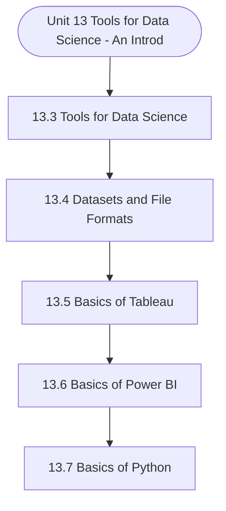

# MCS-062: Introduction to Data Science
## Unit 13: Tools for Data Science - An Introduction

> 📚 **Programme:** M.Sc. (Data Science and Analytics) | **Semester:** Semester 1  
> ⏱️ **Estimated Study Time:** ~88 mins | 📄 **Textbook Pages:** 81 Pages  
> 📥 **Original PDF:** [Download & View Authentic Textbook](../../../pdfs/Semester_1/MCS-062_Introduction_to_Data_Science/Unit-13_Tools_for_Data_Science_-_An_Introduction.pdf)

---

### 🎯 Executive Concept & Data Science Relevance
In modern data systems, **Tools for Data Science - An Introduction** forms a vital conceptual pillar. Descriptive statistics provide quantitative summaries of dataset properties. Measures of central tendency identify typical values, while measures of dispersion quantify data spread, uncertainty, and variability—critical for feature normalization and anomaly detection.

> [!NOTE]
> **Why this matters for your career:** Mastering tools for data science - an introduction equips you with the foundational principles required to reason mathematically about high-dimensional datasets, evaluate algorithm performance, and avoid statistical pitfalls in production machine learning pipelines.

### 🗺️ Visual Knowledge Architecture
The following concept map illustrates the structural hierarchy and learning trajectory of this module:



### 📖 Core Definitions & Terminology Cards

> 📌 **Arithmetic Mean $\bar{x}$ or $\mu$**  
> - **Formal Definition:** The sum of all observations divided by the total number of observations: $\bar{x} = \frac{1}{n}\sum_{i=1}^n x_i$. Sensitive to extreme outliers.  
> - 💡 **Practical Intuition & Analogy:** *The center of mass or balance point of the distribution.*

> 📌 **Median**  
> - **Formal Definition:** The physical middle value separating the higher half from the lower half of an ordered dataset. Robust against outliers.  
> - 💡 **Practical Intuition & Analogy:** *The 50th percentile value where exactly half the data lies above and half below.*

> 📌 **Standard Deviation $\sigma$ or $s$**  
> - **Formal Definition:** The square root of variance, measuring average dispersion in original units: $s = \sqrt{\frac{1}{n-1}\sum (x_i - \bar{x})^2}$.  
> - 💡 **Practical Intuition & Analogy:** *The typical distance data points deviate from the mean.*

> 📌 **Coefficient of Variation ($CV$)**  
> - **Formal Definition:** Relative dispersion measure expressed as a percentage: $CV = \frac{\sigma}{\mu} \times 100\%$. Enables comparison across different measurement scales.  
> - 💡 **Practical Intuition & Analogy:** *Comparing stock volatility across assets priced at 10 USD vs 1,000 USD.*

### ⚡ Governing Mathematical Laws & Formula Cheatsheet
#### 🔹 Sample Variance Formula (Bessel's Correction)
$$
\begin{aligned} s^2 & = \frac{1}{n - 1} \sum_{i=1}^n (x_i - \bar{x})^2 \\ & = \frac{\sum x_i^2 - \frac{(\sum x_i)^2}{n}}{n - 1} \end{aligned}
$$
- **Explanation:** Using $n-1$ in the denominator corrects for downward sample bias, yielding an unbiased estimator of population variance $\sigma^2$.

#### 🔹 Interquartile Range (IQR) & Outlier Bounds
$$
\text{IQR} = Q_3 - Q_1, \quad \text{Outliers} < Q_1 - 1.5(\text{IQR}) \;\lor\; > Q_3 + 1.5(\text{IQR})
$$
- **Explanation:** Standard Tukey boxplot rule for identifying extreme data points robustly.

#### 🔹 Pearson's First Coefficient of Skewness
$$
Sk_1 = \frac{\text{Mean} - \text{Mode}}{\sigma} \quad \text{or} \quad Sk_2 = \frac{3(\text{Mean} - \text{Median})}{\sigma}
$$
- **Explanation:** Measures asymmetry: Positive skew means mean > median (right tail); negative skew means mean < median (left tail).

### ⚖️ Axiomatic Properties & Governing Laws
The mathematical formulations of this module are anchored by foundational algebraic and structural laws:

- **Variance Scaling Rule:** $\text{Var}(aX + b) = a^2 \text{Var}(X)$
- **Standard Deviation Scaling:** $\sigma(aX + b) = \vert a\vert \sigma(X)$
- **Empirical Rule (Normal Distribution):** 68% within $\mu \pm 1\sigma$, 95% within $\mu \pm 2\sigma$, 99.7% within $\mu \pm 3\sigma$

### 📌 Comprehensive Section-by-Section Study Breakdown
#### `13.3` Tools for Data Science
##### 📘 Theoretical Principles & In-Depth Exposition
The section on **Tools for Data Science** establishes rigorous theoretical foundations necessary for advanced computational modeling. It introduces formal mathematical structures and symbolic notations that guarantee consistency across proofs and algorithms.

In the broader scope of **Tools for Data Science - An Introduction**, understanding tools for data science is essential to formalizing data representations, verifying boundary constraints, and ensuring computational determinism across multidimensional feature spaces.

##### ⚙️ Mathematical & Algorithmic Mechanics
- **Formal Mechanics:** Establishes symbolic transformations and state invariants governing tools for data science.
- **Boundary Invariants:** Ensures robust error-handling, non-empty set guarantees, and strict asymptotic bounds.

##### 📊 Practical Data Science & Production Relevance
- **Industry Application:** Directly implemented in production workflows such as SQL query filters, pandas vectorized operations, and feature transformation pipelines.
- **Production Pitfall:** Failing to verify membership bounds or missing edge cases in tools for data science can cause silent data corruption or performance bottlenecks.

> [!TIP]
> **Key Exam & Technical Interview Takeaway:** Be prepared to define tools for data science formally, cite its core mathematical invariants, and solve step-by-step numerical/proof questions.

#### `13.4` Datasets and File Formats
##### 📘 Theoretical Principles & In-Depth Exposition
A dataset is an organized set of data used for analysis and building models. It's usually laid out like a table, where rows show individual entries and columns represent different features or variables. Depending on the type and use of the data, datasets can be stored in different formats—one of the most common being CSV (Comma-Separated Values),which is widely used for storing tabular data; Excel files (.xls, .xlsx), which allow multiple sheets and more formatting options; JSON and XML, which are suitable for storing nested or hierarchical data; SQL databases, used for managing structured data; Parquet and ORC, which are efficient columnar storage formats often used in big data systems; and TXT files, which store plain text with custom delimiters.

Format Description / Strengths / Use Cases CSV (Comma- Separated Values) A simple, plain-text format where each row is a new line and columns separated by commas. Very widely supported by spreadsheets (Excel, LibreOffice), data-analysis tools, databases. Great for tabular data, easy to read and edit.

Excel (.xls / .xlsx) Spreadsheet format allowing multiple sheets, richer metadata / formatting than CSV. Handy if you want human-friendly editing, multiple tables in one file, or need features like formulas or embedded metadata. (Often exported to CSV / other formats for ML workflows.) JSON (JavaScript Object Notation) A text-based format supporting nested / hierarchical data (objects, arrays).

##### ⚙️ Mathematical & Algorithmic Mechanics
- **Formal Mechanics:** Establishes symbolic transformations and state invariants governing datasets and file formats.
- **Boundary Invariants:** Ensures robust error-handling, non-empty set guarantees, and strict asymptotic bounds.

##### 📊 Practical Data Science & Production Relevance
- **Industry Application:** Directly implemented in production workflows such as SQL query filters, pandas vectorized operations, and feature transformation pipelines.
- **Production Pitfall:** Failing to verify membership bounds or missing edge cases in datasets and file formats can cause silent data corruption or performance bottlenecks.

> [!TIP]
> **Key Exam & Technical Interview Takeaway:** Be prepared to define datasets and file formats formally, cite its core mathematical invariants, and solve step-by-step numerical/proof questions.

#### `13.5` Basics of Tableau
##### 📘 Theoretical Principles & In-Depth Exposition
Tableau is a user-friendly and a powerful tool for creating interactive data visualizations. It connects easily to a wide range of data sources and lets users explore and present their data through clear, engaging visuals with its simple drag-and-drop interface, even beginners can build charts, graphs, and dashboards—no coding needed.

Widely used by data analysts and scientists, Tableau is popular in industries like healthcare, tech, and e-commerce to support smart, data-driven decisions. Once installed, users can get started by activating their license or signing in with their Tableau account. Tableau Installation: Tableau is a engaging and interactive visualiza helps transform raw data into a mo has become a widely used tool in th Users can connect with others acr visualizations, and even publish t media platforms.

Here in this section, we will try to brief. To begin with the Prerequisite As a Prerequisites for Using Table such as running programs and na Familiarity with spreadsheet applic and learn new tools. Firstly, Let’s learn how to Install Installation, simply go to the offic follow the step-by-step instructions The stepwise process is also given h the interface available at official we Fig.1: Tab At official website at https://www section, where you’ll find four m Desktop Products: a free, easy-to-use tool that lets users build ations—all without writing any code.

##### ⚙️ Mathematical & Algorithmic Mechanics
- **Formal Mechanics:** Establishes symbolic transformations and state invariants governing basics of tableau.
- **Boundary Invariants:** Ensures robust error-handling, non-empty set guarantees, and strict asymptotic bounds.

##### 📊 Practical Data Science & Production Relevance
- **Industry Application:** Directly implemented in production workflows such as SQL query filters, pandas vectorized operations, and feature transformation pipelines.
- **Production Pitfall:** Failing to verify membership bounds or missing edge cases in basics of tableau can cause silent data corruption or performance bottlenecks.

> [!TIP]
> **Key Exam & Technical Interview Takeaway:** Be prepared to define basics of tableau formally, cite its core mathematical invariants, and solve step-by-step numerical/proof questions.

#### `13.6` Basics of Power BI
##### 📘 Theoretical Principles & In-Depth Exposition
Power BI is a Microsoft applic valuable insights. It enables users to create interac simplify data analysis and unde research, or any data-driven field, P trends, and make informed decision The process involves three main ste 1. Power Query Editor – Prepare 2. Data Modeling and Relation data tables and organize your d 3.

Visualization –Build interact showcase your data efficiently. Fig.28: Getting Working with Power BI is straightf Fig. 29 below Fig.29: Wo cation built to convert raw data into ctive dashboards, reports, and charts to erstanding. Whether you're in business, Power BI helps you identify patterns, track ns more efficiently.

eps: e and clean your data. nships – Establish connections between data. tive graphs and charts to explore and g Started with Power BI forward, it follows the easy steps, shown in orking of Power BI Tools for Data Science an Introduction Data Science – Allied Areas Step-by-Step procedure to work by Using Power BI is as follows : Step 1: Download and Install Power BI Desktop: Go to Microsoft’s official website and download Power BI Desktop for free.

##### ⚙️ Mathematical & Algorithmic Mechanics
- **Formal Mechanics:** Establishes symbolic transformations and state invariants governing basics of power bi.
- **Boundary Invariants:** Ensures robust error-handling, non-empty set guarantees, and strict asymptotic bounds.

##### 📊 Practical Data Science & Production Relevance
- **Industry Application:** Directly implemented in production workflows such as SQL query filters, pandas vectorized operations, and feature transformation pipelines.
- **Production Pitfall:** Failing to verify membership bounds or missing edge cases in basics of power bi can cause silent data corruption or performance bottlenecks.

> [!TIP]
> **Key Exam & Technical Interview Takeaway:** Be prepared to define basics of power bi formally, cite its core mathematical invariants, and solve step-by-step numerical/proof questions.

#### `13.7` Basics of Python
##### 📘 Theoretical Principles & In-Depth Exposition
This section is an Introduction to Python Interface (Anaconda & Google Colab) - Python IDLE, Jupyter Notebook, and Google Colab all support Python development but differ in interface and capabilities, a brief introduction to each is given below: · Python IDLE: A simple, built-in IDE with a Python Shell for interactive code and an Editor for scripts.

It’s lightweight and good for beginners and small projects. · Jupyter Notebook: A web-based tool with a cell-based layout supporting live code, text (Markdown), and visualizations. Ideal for data science, research, and documentation. · Google Colab: A cloud-hosted version of Jupyter with added benefits like free GPU/TPU access, Google Drive integration, and real-time collaboration.

Best suited for machine learning tasks. Before we start diving into Python coding, let's learn how to install Python IDLE. Installing Python and Accessing IDLE : To work with Python locally (instead of Google Colab), we use Python IDLE, which comes bundled with the official Python installation.

##### ⚙️ Mathematical & Algorithmic Mechanics
- **Formal Mechanics:** Establishes symbolic transformations and state invariants governing basics of python.
- **Boundary Invariants:** Ensures robust error-handling, non-empty set guarantees, and strict asymptotic bounds.

##### 📊 Practical Data Science & Production Relevance
- **Industry Application:** Directly implemented in production workflows such as SQL query filters, pandas vectorized operations, and feature transformation pipelines.
- **Production Pitfall:** Failing to verify membership bounds or missing edge cases in basics of python can cause silent data corruption or performance bottlenecks.

> [!TIP]
> **Key Exam & Technical Interview Takeaway:** Be prepared to define basics of python formally, cite its core mathematical invariants, and solve step-by-step numerical/proof questions.

#### `13.8` Basics of R-STUDIO
##### 📘 Theoretical Principles & In-Depth Exposition
RStudio preferred science integrate Jupyter R extens Here, we below: Fig.72: R at library in Python is used for plotting graphs? ………………………………………………… ………………………………………………… w do you calculate mean and median in pandas? ………………………………………………… ………………………………………………… w can you identify outliers using visualization?

………………………………………………… ………………………………………………… R-STUDIO is a powerful, user-friendly IDE for R d environment for most R users. It offers tasks, and quite easy access to docume ed version control (Git). However, Other I r Notebook with IRKernel – Interactive R no sion, StatET Plugin for Eclipse, and Jamov e will work on R-Studio only, the user interfa R-Studio: Interface Layout (4 Panes): ………………………….

It’s the s Clean layout for data entation and plots with Interfaces (Optional) are otebooks, VS Code with vi also. face of the same is shown The description of the 4-panes sho 1. Source Editor (Top-Left) · Write and edit R scripts (.R), RM · Supports syntax highlighting, c Source Editor This is where files, and notebooks.

##### ⚙️ Mathematical & Algorithmic Mechanics
- **Formal Mechanics:** Establishes symbolic transformations and state invariants governing basics of r-studio.
- **Boundary Invariants:** Ensures robust error-handling, non-empty set guarantees, and strict asymptotic bounds.

##### 📊 Practical Data Science & Production Relevance
- **Industry Application:** Directly implemented in production workflows such as SQL query filters, pandas vectorized operations, and feature transformation pipelines.
- **Production Pitfall:** Failing to verify membership bounds or missing edge cases in basics of r-studio can cause silent data corruption or performance bottlenecks.

> [!TIP]
> **Key Exam & Technical Interview Takeaway:** Be prepared to define basics of r-studio formally, cite its core mathematical invariants, and solve step-by-step numerical/proof questions.

### 📐 Step-by-Step Solved Mathematical Examples
To solidify your theoretical understanding, work through these fully solved, step-by-step mathematical problems:

#### 🧮 Example 1: Sample Variance and Standard Deviation Computation
> **Problem Statement:**  
> Given sample observations: $X = \lbrace 4, 8, 6, 5, 7 \rbrace$. Compute sample mean $\bar{x}$, sample variance $s^2$, and standard deviation $s$ step-by-step.

**Detailed Step-by-Step Solution:**

1. **Mean:** $\bar{x} = \frac{4 + 8 + 6 + 5 + 7}{5} = \frac{30}{5} = 6$.

2. **Squared deviations:**
- $(4 - 6)^2 = (-2)^2 = 4$
- $(8 - 6)^2 = 2^2 = 4$
- $(6 - 6)^2 = 0^2 = 0$
- $(5 - 6)^2 = (-1)^2 = 1$
- $(7 - 6)^2 = 1^2 = 1$
Sum of squared deviations $= 4 + 4 + 0 + 1 + 1 = 10$.

3. **Sample Variance with Bessel's Correction ($n-1 = 4$):**
$$
s^2 = \frac{10}{5 - 1} = \frac{10}{4} = 2.5
$$

4. **Standard Deviation:** $s = \sqrt{2.5} \approx 1.581$.

#### 🧮 Example 2: Tukey's IQR Outlier Detection Rule
> **Problem Statement:**  
> A customer spend dataset has $Q_1 = 30$ and $Q_3 = 70$. Determine whether transactions of $135$ and $25$ are classified as outliers.

**Detailed Step-by-Step Solution:**

1. **IQR:** $\text{IQR} = Q_3 - Q_1 = 70 - 30 = 40$.
2. **Lower Bound:** $Q_1 - 1.5(\text{IQR}) = 30 - 1.5(40) = 30 - 60 = -30$.
3. **Upper Bound:** $Q_3 + 1.5(\text{IQR}) = 70 + 1.5(40) = 70 + 60 = 130$.

Conclusion:
- Spend of 135 exceeds Upper Bound ($135 > 130$): **Classified as Outlier**.
- Spend of 25 is within $[-30, 130]$: **Normal observation**.

### 💻 Practical Data Science Implementation (Python)
Theory translates directly into production algorithms. Below is a self-contained, commented Python implementation illustrating the core operations of this unit:

```python
import numpy as np
import pandas as pd

# Statistical profiling on production dataset
data = np.array([12, 15, 18, 22, 25, 29, 34, 45, 95])

mean_val = np.mean(data)
median_val = np.median(data)
std_val = np.std(data, ddof=1) # Bessel's correction

q1, q3 = np.percentile(data, [25, 75])
iqr = q3 - q1
outlier_upper = q3 + 1.5 * iqr

outliers = data[data > outlier_upper]

print(f"Mean: {mean_val:.2f} | Median: {median_val:.2f} | Std: {std_val:.2f}")
print(f"IQR: {iqr:.2f} | Upper Bound: {outlier_upper:.2f}")
print(f"Detected Outliers: {outliers}")
```

### 💡 Interactive Self-Assessment Checkpoints
Test your comprehension before proceeding. Tap each question to reveal the comprehensive explanation:

<details>
<summary><b>Checkpoint 1:</b> Why is sample variance divided by $n-1$ instead of $n$? <i>(Tap to reveal answer)</i></summary>

> **Answer & Analysis:**  
> Dividing by $n-1$ applies **Bessel's correction**, which removes downward bias caused by using the sample mean $\bar{x}$ instead of the true population mean $\mu$.
</details>

<details>
<summary><b>Checkpoint 2:</b> Which measure of central tendency is most robust to extreme outliers? <i>(Tap to reveal answer)</i></summary>

> **Answer & Analysis:**  
> The **Median**, because it depends on positional rank rather than magnitude summation.
</details>

<details>
<summary><b>Checkpoint 3:</b> In a right-skewed (positively skewed) distribution, what is the order of Mean, Median, and Mode? <i>(Tap to reveal answer)</i></summary>

> **Answer & Analysis:**  
> $\text{Mode} < \text{Median} < \text{Mean}$.
</details>

<details>
<summary><b>Checkpoint 4:</b> What are the key components of the Tableau workspace? ……………………………………………………………………………. ……………………………………………………………………………. ……………………………………………………………………………. ……………………………………………………………………………. <i>(Tap to reveal answer)</i></summary>

> **Answer & Analysis:**  
> This question tests your conceptual mastery of Tools for Data Science - An Introduction. Review the governing formulas and section breakdowns above to formulate a complete, rigorous proof or derivation.
</details>

<details>
<summary><b>Checkpoint 5:</b> How do you connect to a Microsoft Excel file in Tableau? ……………………………………………………………………………. ……………………………………………………………………………. ……………………………………………………………………………. ……………………………………………………………………………. <i>(Tap to reveal answer)</i></summary>

> **Answer & Analysis:**  
> This question tests your conceptual mastery of Tools for Data Science - An Introduction. Review the governing formulas and section breakdowns above to formulate a complete, rigorous proof or derivation.
</details>

<details>
<summary><b>Checkpoint 6:</b> What is the purpose of the 'Show Me' panel in Tableau? ……………………………………………………………………………. ……………………………………………………………………………. ……………………………………………………………………………. ……………………………………………………………………………. <i>(Tap to reveal answer)</i></summary>

> **Answer & Analysis:**  
> This question tests your conceptual mastery of Tools for Data Science - An Introduction. Review the governing formulas and section breakdowns above to formulate a complete, rigorous proof or derivation.
</details>

### 🎯 Executive Module Wrap-Up
- **Central Idea:** Tools for Data Science - An Introduction provides essential mathematical and algorithmic tools directly utilized in Data Science.
- **Mathematical Rigor:** Formulas and laws must be memorized with attention to boundary conditions and assumptions.
- **Full Textbook Coverage:** For exhaustive multi-page derivations, proofs, and supplementary exercises, consult the [Authentic IGNOU Textbook](../../../pdfs/Semester_1/MCS-062_Introduction_to_Data_Science/Unit-13_Tools_for_Data_Science_-_An_Introduction.pdf).

---
### 🧭 Navigation & Syllabus Index
[⬅ Previous: Unit 12](unit_12_Mining_Data_Streams.md) | [📑 Course Index](README.md)
