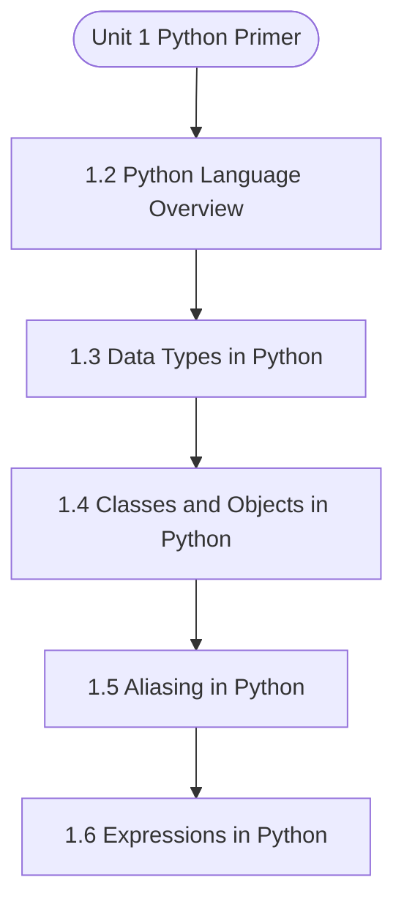

# MCS-063: Data Structures using Python
## Unit 1: Python Primer

> 📚 **Programme:** M.Sc. (Data Science and Analytics) | **Semester:** Semester 1  
> ⏱️ **Estimated Study Time:** ~43 mins | 📄 **Textbook Pages:** 26 Pages  
> 📥 **Original PDF:** [Download & View Authentic Textbook](../../../pdfs/Semester_1/MCS-063_Data_Structures_using_Python/Unit-1_Python_Primer.pdf)

---

### 🎯 Executive Concept & Data Science Relevance
In modern data systems, **Python Primer** forms a vital conceptual pillar. Algorithm efficiency governs data scale. In large-scale data engineering, choosing between $O(n \log n)$ mergesort vs $O(n^2)$ bubblesort, or an $O(1)$ hash table lookup vs $O(n)$ linear scan, determines whether a pipeline finishes in seconds or hours.

> [!NOTE]
> **Why this matters for your career:** Mastering python primer equips you with the foundational principles required to reason mathematically about high-dimensional datasets, evaluate algorithm performance, and avoid statistical pitfalls in production machine learning pipelines.

### 🗺️ Visual Knowledge Architecture
The following concept map illustrates the structural hierarchy and learning trajectory of this module:



### 📖 Core Definitions & Terminology Cards

> 📌 **Big-O Notation $O(g(n))$**  
> - **Formal Definition:** Asymptotic upper bound: $f(n) = O(g(n))$ if $\exists c > 0, n_0 > 0$ such that $0 \le f(n) \le c \cdot g(n), \forall n \ge n_0$. Describes worst-case growth rate.  
> - 💡 **Practical Intuition & Analogy:** *The performance guarantee: execution time will not grow faster than this bound.*

> 📌 **Hash Table & Load Factor $\alpha$**  
> - **Formal Definition:** Data structure mapping keys to bucket indices using a hash function $h(k)$. Load factor $\alpha = n/m$ where $n$ is stored elements and $m$ is table capacity. Average lookup is $O(1)$.  
> - 💡 **Practical Intuition & Analogy:** *Instant dictionary key-value lookup in Python.*

> 📌 **Binary Search Tree (BST) & AVL Balance Factor**  
> - **Formal Definition:** A tree where for every node, left sub-tree values are smaller and right sub-tree values are larger. In AVL trees, Balance Factor $BF = h_L - h_R \in \lbrace -1, 0, 1 \rbrace$, maintaining $O(\log n)$ bounds via rotations.  
> - 💡 **Practical Intuition & Analogy:** *A self-balancing search index that guarantees rapid logarithmic lookups.*

### ⚡ Governing Mathematical Laws & Formula Cheatsheet
#### 🔹 Master Theorem for Divide-and-Conquer Recurrences
$$
\begin{aligned} & T(n) = aT(n/b) + \Theta(n^d) \\ & \implies T(n) = \begin{cases} \Theta(n^{\log_b a}) & \text{if } d < \log_b a \\ \Theta(n^d \log n) & \text{if } d = \log_b a \\ \Theta(n^d) & \text{if } d > \log_b a \end{cases} \end{aligned}
$$
- **Explanation:** Solves common divide-and-conquer recurrences like Mergesort ( $T(n) = 2T(n/2) + O(n) \implies O(n \log n)$ ).

#### 🔹 Binary Heap Array Index Formulas
$$
\text{Parent}(i) = \lfloor (i - 1)/2 \rfloor, \; \text{Left}(i) = 2i + 1, \; \text{Right}(i) = 2i + 2
$$
- **Explanation:** Enables cache-friendly representation of complete binary trees directly within flat linear arrays.

#### 🔹 Comparison Sort Lower Bound
$$
\Omega(n \log n) \quad \text{for comparison-based sorting algorithms}
$$
- **Explanation:** Information-theoretic lower bound: reaching $n!$ leaf permutations requires a decision tree of minimum depth $\log_2(n!) = \Omega(n \log n)$.

### ⚖️ Axiomatic Properties & Governing Laws
The mathematical formulations of this module are anchored by foundational algebraic and structural laws:

- **AVL Height Bound:** $h < 1.44 \log_2(n + 2) \implies O(\log n) \text{ worst-case search}$
- **Hash Table Amortized Bound:** $O(1) \text{ lookup when } \alpha = n/m < 0.75$
- **Comparison Lower Bound:** $\Omega(n \log n) \text{ for comparison sorts}$

### 📌 Comprehensive Section-by-Section Study Breakdown
#### `1.2` Python Language Overview
##### 📘 Theoretical Principles & In-Depth Exposition
The section on **Python Language Overview** establishes rigorous theoretical foundations necessary for advanced computational modeling. It introduces formal mathematical structures and symbolic notations that guarantee consistency across proofs and algorithms.

In the broader scope of **Python Primer**, understanding python language overview is essential to formalizing data representations, verifying boundary constraints, and ensuring computational determinism across multidimensional feature spaces.

##### ⚙️ Mathematical & Algorithmic Mechanics
- **Formal Mechanics:** Establishes symbolic transformations and state invariants governing python language overview.
- **Boundary Invariants:** Ensures robust error-handling, non-empty set guarantees, and strict asymptotic bounds.

##### 📊 Practical Data Science & Production Relevance
- **Industry Application:** Directly implemented in production workflows such as SQL query filters, pandas vectorized operations, and feature transformation pipelines.
- **Production Pitfall:** Failing to verify membership bounds or missing edge cases in python language overview can cause silent data corruption or performance bottlenecks.

> [!TIP]
> **Key Exam & Technical Interview Takeaway:** Be prepared to define python language overview formally, cite its core mathematical invariants, and solve step-by-step numerical/proof questions.

#### `1.3` Data Types in Python
##### 📘 Theoretical Principles & In-Depth Exposition
The section on **Data Types in Python** establishes rigorous theoretical foundations necessary for advanced computational modeling. It introduces formal mathematical structures and symbolic notations that guarantee consistency across proofs and algorithms.

In the broader scope of **Python Primer**, understanding data types in python is essential to formalizing data representations, verifying boundary constraints, and ensuring computational determinism across multidimensional feature spaces.

##### ⚙️ Mathematical & Algorithmic Mechanics
- **Formal Mechanics:** Establishes symbolic transformations and state invariants governing data types in python.
- **Boundary Invariants:** Ensures robust error-handling, non-empty set guarantees, and strict asymptotic bounds.

##### 📊 Practical Data Science & Production Relevance
- **Industry Application:** Directly implemented in production workflows such as SQL query filters, pandas vectorized operations, and feature transformation pipelines.
- **Production Pitfall:** Failing to verify membership bounds or missing edge cases in data types in python can cause silent data corruption or performance bottlenecks.

> [!TIP]
> **Key Exam & Technical Interview Takeaway:** Be prepared to define data types in python formally, cite its core mathematical invariants, and solve step-by-step numerical/proof questions.

#### `1.4` Classes and Objects in Python
##### 📘 Theoretical Principles & In-Depth Exposition
CLASSES AND OBJECTS IN PYTHON Python is an object-oriented language and classes form the basis for all its data types. Classes are a means of bringing together data and functionality together. Each class encapsulates data and behaviour (methods) into a single entity. This structure allows you to model real-world objects and create organized, reusable code.

A class in Python serves as a template for creating objects, which are instances of the class or instantiated from the class. We use classes when we need to encapsulate related data and functions, making the code modular and easier to manage. After defining a class, one can create multiple objects that share the same attributes and methods, while all these objects have their own unique state.

Example: class car: name = “” Colour = “” An object is an instance of a class. Creating a new instance of a class is known as instantiation. Hence Car is a class and now we can create objects like car1, car2 etc from this class as under: Class car: name = “BMW” Colour = “white”

##### ⚙️ Mathematical & Algorithmic Mechanics
- **Formal Mechanics:** Establishes symbolic transformations and state invariants governing classes and objects in python.
- **Boundary Invariants:** Ensures robust error-handling, non-empty set guarantees, and strict asymptotic bounds.

##### 📊 Practical Data Science & Production Relevance
- **Industry Application:** Directly implemented in production workflows such as SQL query filters, pandas vectorized operations, and feature transformation pipelines.
- **Production Pitfall:** Failing to verify membership bounds or missing edge cases in classes and objects in python can cause silent data corruption or performance bottlenecks.

> [!TIP]
> **Key Exam & Technical Interview Takeaway:** Be prepared to define classes and objects in python formally, cite its core mathematical invariants, and solve step-by-step numerical/proof questions.

#### `1.5` Aliasing in Python
##### 📘 Theoretical Principles & In-Depth Exposition
ALIASING IN PYTHON Each identifier is associated with the memory address of the object to which it referring to. An identifier can be associated with one type of object initially and later it can be reassigned to another object that is of the same or different type. x = [10, 20] y = x # y now refers to the same list object as x print(x is y) # Output: True (since x and y are aliases) Let us say, we decide to add another number to the list then the scenario is: y.append(30) # Modifying y also affects x print(x) # Output: [10, 20, 30] print(y) # Output: [10, 20, 30] In the example illustrated above, x and y are aliases because they point to the same list.

Modifying any one of the the list will affect the other. These characteristics should be borne in mind when working with mutable objects like lists and dictionaries. Aliasing can lead to unexpected side effects if not handled carefully. To avoid any unintended effect, one can create a copy of the object instead of creating an alias.

x = [10, 20] y = x.copy() # y is now a copy of x print(x is y) # Output: False (x and y are different objects) y.append(30) print(x) # Output: [10, 20] print(y) # Output: [10, 20, 30]

##### ⚙️ Mathematical & Algorithmic Mechanics
- **Formal Mechanics:** Establishes symbolic transformations and state invariants governing aliasing in python.
- **Boundary Invariants:** Ensures robust error-handling, non-empty set guarantees, and strict asymptotic bounds.

##### 📊 Practical Data Science & Production Relevance
- **Industry Application:** Directly implemented in production workflows such as SQL query filters, pandas vectorized operations, and feature transformation pipelines.
- **Production Pitfall:** Failing to verify membership bounds or missing edge cases in aliasing in python can cause silent data corruption or performance bottlenecks.

> [!TIP]
> **Key Exam & Technical Interview Takeaway:** Be prepared to define aliasing in python formally, cite its core mathematical invariants, and solve step-by-step numerical/proof questions.

#### `1.6` Expressions in Python
##### 📘 Theoretical Principles & In-Depth Exposition
EXPRESSIONS IN PYTHON Like in C or C++, a combination of operands and operators is called an expression. The expression produces some value or result after being interpreted by the Python interpreter. It combines operators, variables, literals, and function calls to produce a value.

The programming language uses distinct expressions for various requirements. Decision-making requires Boolean values from logical expressions like and, or. As you know, relational expressions compare values and return Booleans in Python, while arithmetic expressions compute numbers.

Complex expressions may involve numerous operators and types. The sequence of operation is determined by the Operator precedence inthese expressions. A defined operator precedence hierarchy in Python ensures proper expression evaluation. Programmers have additional control by changing the evaluation order with parentheses.

##### ⚙️ Mathematical & Algorithmic Mechanics
- **Formal Mechanics:** Establishes symbolic transformations and state invariants governing expressions in python.
- **Boundary Invariants:** Ensures robust error-handling, non-empty set guarantees, and strict asymptotic bounds.

##### 📊 Practical Data Science & Production Relevance
- **Industry Application:** Directly implemented in production workflows such as SQL query filters, pandas vectorized operations, and feature transformation pipelines.
- **Production Pitfall:** Failing to verify membership bounds or missing edge cases in expressions in python can cause silent data corruption or performance bottlenecks.

> [!TIP]
> **Key Exam & Technical Interview Takeaway:** Be prepared to define expressions in python formally, cite its core mathematical invariants, and solve step-by-step numerical/proof questions.

#### `1.7` Control Flow
##### 📘 Theoretical Principles & In-Depth Exposition
CONTROL FLOW Program execution happens sequentially in Python wherein the Python interpreter reads a code written by you line by line from top to bottom with each statement interpreted from left to right and. The interpreter executes operations and functions in the order that it reads which is what the control flow signifies.

Not every program shall follow this pattern since the program shall also encounter conditional statement and based on this outcome, the control gets transferred to the desired statement. Without control flow expressions, a program is simply a list of statements that are sequentially executed.

Python uses if, elif (short for else if), and else keywords to create control flow structures in your program. Imagine all these keywords are traffic controllers telling the control flow where to go. Thus a program’s control flow decides the order in which the program code executes.

##### ⚙️ Mathematical & Algorithmic Mechanics
- **Formal Mechanics:** Establishes symbolic transformations and state invariants governing control flow.
- **Boundary Invariants:** Ensures robust error-handling, non-empty set guarantees, and strict asymptotic bounds.

##### 📊 Practical Data Science & Production Relevance
- **Industry Application:** Directly implemented in production workflows such as SQL query filters, pandas vectorized operations, and feature transformation pipelines.
- **Production Pitfall:** Failing to verify membership bounds or missing edge cases in control flow can cause silent data corruption or performance bottlenecks.

> [!TIP]
> **Key Exam & Technical Interview Takeaway:** Be prepared to define control flow formally, cite its core mathematical invariants, and solve step-by-step numerical/proof questions.

#### `1.8` Looping / Repetition
##### 📘 Theoretical Principles & In-Depth Exposition
LOOPING / REPETITION Understanding loops is essential for any python programmer as these provide a powerful tool to automate code logic and process data. Python being popular programming language, offers several loop structures to iterate over sequences and execute repetitive tasks efficiently.

These are also referred to as repetition statement used to repeat a block of code statements. Python has two loops structures which are: for loop while loop

##### ⚙️ Mathematical & Algorithmic Mechanics
- **Formal Mechanics:** Establishes symbolic transformations and state invariants governing looping / repetition.
- **Boundary Invariants:** Ensures robust error-handling, non-empty set guarantees, and strict asymptotic bounds.

##### 📊 Practical Data Science & Production Relevance
- **Industry Application:** Directly implemented in production workflows such as SQL query filters, pandas vectorized operations, and feature transformation pipelines.
- **Production Pitfall:** Failing to verify membership bounds or missing edge cases in looping / repetition can cause silent data corruption or performance bottlenecks.

> [!TIP]
> **Key Exam & Technical Interview Takeaway:** Be prepared to define looping / repetition formally, cite its core mathematical invariants, and solve step-by-step numerical/proof questions.

#### `1.9` Functions
##### 📘 Theoretical Principles & In-Depth Exposition
FUNCTIONS A function is a block of reusable code that performs a specific task. This task is generally one which is used multiple times to develop an application in Python. Suppose we need to create a program to compute area of a given land or the volume of a box. The idea is to organize code, make it more readable, and avoid repetition of the same code statements.

Thus, it helps to divide a complex problem into smaller ones and makes our program code easy to understand and reuse. Let’s take a quick glimpse of how a function works. Creating a Function def welcomemessage (): print(“welcome to the world of Python”) The keyword “def” is used to create a function.

welcomemessage () is the name of the function. The print statement forms the function body. Now in order to use or call this function, the following program gives you the insight. # program to define a Function and call it def welcomemessage (): print("welcome to the world of Python") welcomemessage()  Output welcome to the world of Python Lets take a more relevant program that computes area.

##### ⚙️ Mathematical & Algorithmic Mechanics
- **Formal Mechanics:** Establishes symbolic transformations and state invariants governing functions.
- **Boundary Invariants:** Ensures robust error-handling, non-empty set guarantees, and strict asymptotic bounds.

##### 📊 Practical Data Science & Production Relevance
- **Industry Application:** Directly implemented in production workflows such as SQL query filters, pandas vectorized operations, and feature transformation pipelines.
- **Production Pitfall:** Failing to verify membership bounds or missing edge cases in functions can cause silent data corruption or performance bottlenecks.

> [!TIP]
> **Key Exam & Technical Interview Takeaway:** Be prepared to define functions formally, cite its core mathematical invariants, and solve step-by-step numerical/proof questions.

### 📐 Step-by-Step Solved Mathematical Examples
To solidify your theoretical understanding, work through these fully solved, step-by-step mathematical problems:

#### 🧮 Example 1: Solving Recurrence via Master Theorem
> **Problem Statement:**  
> Solve the recurrence relation $T(n) = 2T(n/2) + n$ modeling Mergesort.

**Detailed Step-by-Step Solution:**

1. **Identify parameters:** $a = 2, \; b = 2, \; f(n) = n = \Theta(n^1) \implies d = 1$.
2. **Compare $\log_b a$ and $d$:**
$$
\log_b a = \log_2 2 = 1
$$
Since $d = \log_b a = 1$, Case 2 of the Master Theorem applies.

3. **Conclusion:**
$$
T(n) = \Theta(n^d \log n) = \Theta(n \log n)
$$

#### 🧮 Example 2: AVL Tree Rotation Sequence
> **Problem Statement:**  
> An empty AVL tree receives sequential insertions: 10, 20, 30. Trace the balance factors and demonstrate the required rotation.

**Detailed Step-by-Step Solution:**

1. Insert 10: $BF = 0$.
2. Insert 20: 10 has $BF = -1$, 20 has $BF = 0$.
3. Insert 30: Node 10 has left height 0, right height 2 $\implies BF(10) = -2$ (Unbalanced: Right-Right condition).
4. **Apply Single Left Rotation on Node 10:**
- Node 20 becomes new root.
- Node 10 becomes left child of 20.
- Node 30 remains right child of 20.
New Balance Factors: $BF(20) = 0, \; BF(10) = 0, \; BF(30) = 0$. Tree balanced.

### 💻 Practical Data Science Implementation (Python)
Theory translates directly into production algorithms. Below is a self-contained, commented Python implementation illustrating the core operations of this unit:

```python
# Custom Hash Map with Collision Chaining
class SimpleHashMap:
    def __init__(self, capacity=8):
        self.capacity = capacity
        self.buckets = [[] for _ in range(capacity)]

    def _hash(self, key):
        return hash(key) % self.capacity

    def put(self, key, value):
        b_idx = self._hash(key)
        for i, (k, v) in enumerate(self.buckets[b_idx]):
            if k == key:
                self.buckets[b_idx][i] = (key, value)
                return
        self.buckets[b_idx].append((key, value))

    def get(self, key):
        b_idx = self._hash(key)
        for k, v in self.buckets[b_idx]:
            if k == key:
                return v
        return None

hm = SimpleHashMap()
hm.put("user_101", {"name": "Alice", "role": "Data Scientist"})
hm.put("user_102", {"name": "Bob", "role": "ML Engineer"})
print("Lookup user_101:", hm.get("user_101"))
```

### 💡 Interactive Self-Assessment Checkpoints
Test your comprehension before proceeding. Tap each question to reveal the comprehensive explanation:

<details>
<summary><b>Checkpoint 1:</b> What is the worst-case and average-case time complexity of Quicksort? <i>(Tap to reveal answer)</i></summary>

> **Answer & Analysis:**  
> Average case: $O(n \log n)$. Worst case: $O(n^2)$ (occurs when the pivot chosen is always the extreme minimum or maximum in already sorted arrays).
</details>

<details>
<summary><b>Checkpoint 2:</b> How does an AVL tree restore balance after an insertion? <i>(Tap to reveal answer)</i></summary>

> **Answer & Analysis:**  
> By computing the Balance Factor ( $h_L - h_R$ ) and applying tree rotations: Left-Left (Single Right Rotation), Right-Right (Single Left Rotation), Left-Right (Double Rotation), or Right-Left (Double Rotation).
</details>

<details>
<summary><b>Checkpoint 3:</b> What is the average lookup time in a Hash Table? <i>(Tap to reveal answer)</i></summary>

> **Answer & Analysis:**  
> $O(1)$ constant time, assuming a uniform hash distribution and reasonable load factor.
</details>

<details>
<summary><b>Checkpoint 4:</b> What operators does python support? <i>(Tap to reveal answer)</i></summary>

> **Answer & Analysis:**  
> This question tests your conceptual mastery of Python Primer. Review the governing formulas and section breakdowns above to formulate a complete, rigorous proof or derivation.
</details>

<details>
<summary><b>Checkpoint 5:</b> What are the common built-in data types in Python? <i>(Tap to reveal answer)</i></summary>

> **Answer & Analysis:**  
> This question tests your conceptual mastery of Python Primer. Review the governing formulas and section breakdowns above to formulate a complete, rigorous proof or derivation.
</details>

<details>
<summary><b>Checkpoint 6:</b> Where and how is a Python function defined? <i>(Tap to reveal answer)</i></summary>

> **Answer & Analysis:**  
> This question tests your conceptual mastery of Python Primer. Review the governing formulas and section breakdowns above to formulate a complete, rigorous proof or derivation.
</details>

### 🎯 Executive Module Wrap-Up
- **Central Idea:** Python Primer provides essential mathematical and algorithmic tools directly utilized in Data Science.
- **Mathematical Rigor:** Formulas and laws must be memorized with attention to boundary conditions and assumptions.
- **Full Textbook Coverage:** For exhaustive multi-page derivations, proofs, and supplementary exercises, consult the [Authentic IGNOU Textbook](../../../pdfs/Semester_1/MCS-063_Data_Structures_using_Python/Unit-1_Python_Primer.pdf).

---
### 🧭 Navigation & Syllabus Index
[📑 Course Index](README.md) | [Next: Unit 2 ➡](unit_02_Object_Oriented_Programming.md)
