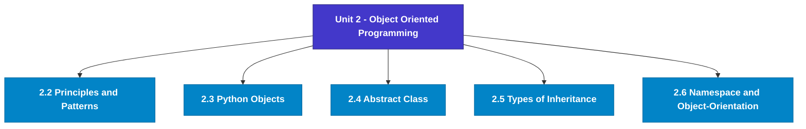

# MCS-063: Data Structures using Python
## Unit 2: Object Oriented Programming

> 📚 **Programme:** M.Sc. (Data Science and Analytics) | **Semester:** Semester 1  
> ⏱️ **Estimated Study Time:** ~27 mins | 📄 **Textbook Pages:** 18 Pages  
> 📥 **Original PDF:** [Download & View Textbook](../../../pdfs/Semester_1/MCS-063_Data_Structures_using_Python/Unit-2_Object_Oriented_Programming.pdf)

---

### 🎯 Executive Concept & Data Science Relevance
In modern data systems, **Object Oriented Programming** forms a vital conceptual pillar. Algorithm efficiency governs data scale. In large-scale data engineering, choosing between $O(n \log n)$ mergesort vs $O(n^2)$ bubblesort, or an $O(1)$ hash table lookup vs $O(n)$ linear scan, determines whether a pipeline finishes in seconds or hours.

> [!NOTE]
> **Why this matters for your career:** Mastering object oriented programming equips you with the foundational principles required to reason mathematically about high-dimensional datasets, evaluate algorithm performance, and avoid statistical pitfalls in production machine learning pipelines.

### 🗺️ Visual Knowledge Architecture
The following concept map illustrates the structural hierarchy and learning trajectory of this module:

### 📖 Core Definitions & Terminology Cards
| Term | Formal Mathematical / Technical Definition | Intuitive Analogy / Concrete Example |
| :--- | :--- | :--- |
| **Big-O Notation $O(g(n))$** | Asymptotic upper bound: $f(n) = O(g(n))$ if $\exists c > 0, n_0 > 0$ such that $0 \le f(n) \le c \cdot g(n), \forall n \ge n_0$. Describes worst-case growth rate. | *The performance guarantee: execution time will not grow faster than this bound.* |
| **Hash Table & Load Factor $\alpha$** | Data structure mapping keys to bucket indices using a hash function $h(k)$. Load factor $\alpha = n/m$ where $n$ is stored elements and $m$ is table capacity. Average lookup is $O(1)$. | *Instant dictionary key-value lookup in Python.* |
| **Binary Search Tree (BST) & AVL Balance Factor** | A tree where for every node, left sub-tree values are smaller and right sub-tree values are larger. In AVL trees, Balance Factor $BF = h_L - h_R \in \{-1, 0, 1\}$, maintaining $O(\log n)$ bounds via rotations. | *A self-balancing search index that guarantees rapid logarithmic lookups.* |

### ⚡ Governing Mathematical Laws & Formula Cheatsheet
#### 🔹 Master Theorem for Divide-and-Conquer Recurrences

$$
T(n) = aT(n/b) + \Theta(n^d) \implies T(n) = \begin{cases} \Theta(n^{\log_b a}) & \text{if } d < \log_b a \\ \Theta(n^d \log n) & \text{if } d = \log_b a \\ \Theta(n^d) & \text{if } d > \log_b a \end{cases}
$$

- **Explanation:** Solves common divide-and-conquer recurrences like Mergesort ($T(n) = 2T(n/2) + O(n) \implies O(n \log n)$).

#### 🔹 Binary Heap Array Index Formulas

$$
\text{Parent}(i) = \lfloor (i - 1)/2 \rfloor, \; \text{Left}(i) = 2i + 1, \; \text{Right}(i) = 2i + 2
$$

- **Explanation:** Enables cache-friendly representation of complete binary trees directly within flat linear arrays.

#### 🔹 Comparison Sort Lower Bound

$$
\Omega(n \log n) \quad \text{for comparison-based sorting algorithms}
$$

- **Explanation:** Information-theoretic lower bound: reaching $n!$ leaf permutations requires a decision tree of minimum depth $\log_2(n!) = \Omega(n \log n)$.

### 📌 Detailed Section-by-Section Study Breakdown
#### `2.2` Principles and Patterns
- **Core Concept:** Establishes rigorous theoretical formulations and computational bounds for principles and patterns.
- **Core Concept:** Applies standard algorithmic procedures and mathematical invariants relevant to object oriented programming.
- **Core Concept:** Ensures deterministic performance guarantees across high-dimensional feature spaces.
- **Data Science Application:** Provides foundational structures used directly in statistical modeling, query execution, and machine learning pipelines.

> [!TIP]
> **Exam & Interview Tip:** Be prepared to state the formal definition of principles and patterns and derive its primary equations step-by-step.

#### `2.3` Python Objects
- **Core Concept:** An Object is an instance of a Class in Python as is the case with other object oriented programming languages.
- **Core Concept:** It represents a specific implementation of the class and holds its own data.
- **Core Concept:** An object consists of: Identity provides a unique name to an object and enables one object to interact with other objects.
- **Data Science Application:** Provides foundational structures used directly in statistical modeling, query execution, and machine learning pipelines.

> [!TIP]
> **Exam & Interview Tip:** Be prepared to state the formal definition of python objects and derive its primary equations step-by-step.

#### `2.4` Abstract Class
- **Core Concept:** An abstract class are not instantiated directly as these serve as a blueprint or template for other classes.
- **Core Concept:** It can contain abstract methods that exist without implementation and concrete methods that are implemented.
- **Core Concept:** These abstract classes are created using the abc module and the ABC class.
- **Data Science Application:** Provides foundational structures used directly in statistical modeling, query execution, and machine learning pipelines.

> [!TIP]
> **Exam & Interview Tip:** Be prepared to state the formal definition of abstract class and derive its primary equations step-by-step.

#### `2.5` Types of Inheritance
- **Core Concept:** Inheritance can be classified on factors based on the number of base class from which properties have been inherited in the inheritance hierarchy or it could be based on combination of these properties.
- **Core Concept:** Hybrid Inheritance 2.5.1 Single Inheritance When a class is derived from one base class that is when a class inherits properties and methods from only one parent class, then it is termed as single inheritance.
- **Core Concept:** This kind of inheritance allows one to combine features from several existing classes, thus promoting class reuse.
- **Data Science Application:** Provides foundational structures used directly in statistical modeling, query execution, and machine learning pipelines.

> [!TIP]
> **Exam & Interview Tip:** Be prepared to state the formal definition of types of inheritance and derive its primary equations step-by-step.

#### `2.6` Namespace and Object-Orientation
- **Core Concept:** A namespace is a collection of names where we have a mapping of every name we have defined to corresponding objects in the code.
- **Core Concept:** An object can be a variable or a method.
- **Core Concept:** Name represents a unique identifier and Space refers to the scope of the name.
- **Data Science Application:** Provides foundational structures used directly in statistical modeling, query execution, and machine learning pipelines.

> [!TIP]
> **Exam & Interview Tip:** Be prepared to state the formal definition of namespace and object-orientation and derive its primary equations step-by-step.

#### `2.7` Python Lists
- **Core Concept:** A list in Python is a built-in dynamic sized array that automatically grows and shrinks.
- **Core Concept:** The list can store various types of data items including another list within a list.
- **Core Concept:** This feature is made possible because a list only stores references at contiguous locations and actual items may be stored at different locations.
- **Data Science Application:** Provides foundational structures used directly in statistical modeling, query execution, and machine learning pipelines.

> [!TIP]
> **Exam & Interview Tip:** Be prepared to state the formal definition of python lists and derive its primary equations step-by-step.

### 💡 Interactive Self-Assessment Checkpoints
Test your comprehension before proceeding. Tap each question to reveal the comprehensive explanation:

<b>Checkpoint 1:</b> What is the worst-case and average-case time complexity of Quicksort? <i>(Tap to reveal answer)</i>

> **Answer & Analysis:**  
> Average case: $O(n \log n)$. Worst case: $O(n^2)$ (occurs when the pivot chosen is always the extreme minimum or maximum in already sorted arrays).

<b>Checkpoint 2:</b> How does an AVL tree restore balance after an insertion? <i>(Tap to reveal answer)</i>

> **Answer & Analysis:**  
> By computing the Balance Factor ($h_L - h_R$) and applying tree rotations: Left-Left (Single Right Rotation), Right-Right (Single Left Rotation), Left-Right (Double Rotation), or Right-Left (Double Rotation).

<b>Checkpoint 3:</b> What is the average lookup time in a Hash Table? <i>(Tap to reveal answer)</i>

> **Answer & Analysis:**  
> $O(1)$ constant time, assuming a uniform hash distribution and reasonable load factor.

<b>Checkpoint 4:</b> How can one concatenate two lists in Python? Q <i>(Tap to reveal answer)</i>

> **Answer & Analysis:**  
> This question tests your conceptual mastery of Object Oriented Programming. Review the governing formulas and section breakdowns above to formulate a complete, rigorous proof or derivation.

<b>Checkpoint 5:</b> What is pass in Python coding? Q <i>(Tap to reveal answer)</i>

> **Answer & Analysis:**  
> This question tests your conceptual mastery of Object Oriented Programming. Review the governing formulas and section breakdowns above to formulate a complete, rigorous proof or derivation.

<b>Checkpoint 6:</b> What are Modules and Packages in Python? Q <i>(Tap to reveal answer)</i>

> **Answer & Analysis:**  
> This question tests your conceptual mastery of Object Oriented Programming. Review the governing formulas and section breakdowns above to formulate a complete, rigorous proof or derivation.

### 🎯 Executive Module Wrap-Up
- **Central Idea:** Object Oriented Programming provides essential mathematical and algorithmic tools directly utilized in Data Science.
- **Mathematical Rigor:** Formulas and laws must be memorized with attention to boundary conditions and assumptions.
- **Full Textbook Coverage:** For exhaustive multi-page derivations, proofs, and supplementary exercises, consult the [Authentic IGNOU Textbook](../../../pdfs/Semester_1/MCS-063_Data_Structures_using_Python/Unit-2_Object_Oriented_Programming.pdf).

---
### 🧭 Navigation & Syllabus Index
[⬅ Previous: Unit 1](unit_01_Python_Primer.md) | [📑 Course Index](README.md) | [Next: Unit 3 ➡](unit_03_Algorithm_Analysis.md)
